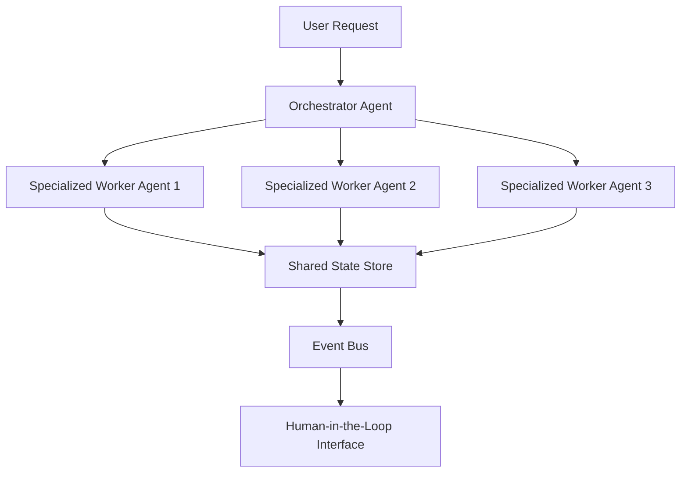

# Getting Started with Agentic AI: Your First Steps into Intelligent Automation

**Based on:** [-01_lets_get_started](https://github.com/panaversity/learn-agentic-ai/tree/bd868a5030d29df4d816c9d6322899655424b49a/-01_lets_get_started)

## The Core Concept: Why This Example Exists

### The Problem: From Static AI to Autonomous Intelligence

Traditional AI systems are reactive—they respond to specific inputs with predetermined outputs, like a calculator that only computes when given numbers. But the real world demands something more: **intelligent systems that can reason, make decisions, and take actions autonomously** to achieve complex goals.

Imagine needing to research a market trend, write a comprehensive report, and then email it to stakeholders. With traditional AI, you'd need to break this into dozens of separate steps, manually connecting each piece. With agentic AI, you can simply state your goal, and the system autonomously plans and executes the entire workflow.

### The Solution: The Agentic AI Paradigm

Agentic AI represents a fundamental shift from "command-and-response" to "goal-and-autonomy." An AI agent is like having an intelligent assistant that can:

- **Understand complex goals** ("Prepare a competitive analysis report")
- **Decompose them into actionable tasks** (research competitors, analyze data, format findings)
- **Use tools autonomously** (web search, data analysis, document creation)
- **Adapt based on new information** (pivot research if initial findings suggest different direction)
- **Maintain context over extended workflows** (remember previous findings when writing conclusions)

The key insight: **Large Language Models (LLMs) serve as the "reasoning engine" that powers these autonomous capabilities.**

---

## Practical Walkthrough: Code Breakdown

### Understanding the Foundation: LLM Selection

Before building agents, you must choose your "reasoning engine." The curriculum guides you through this critical decision using real-world criteria that matter for autonomous systems.

#### Key Decision Framework

**File: `examples/-01_lets_get_started/00_which_llm/readme.md`**

The framework evaluates LLMs across eight crucial factors for agentic systems:

```markdown
# Core Evaluation Criteria for Agentic AI
1. **Reasoning Ability** - Can it think through complex problems step-by-step?
2. **Tool-Calling Proficiency** - How well does it integrate with external APIs and tools?  
3. **Accuracy** - Does it provide reliable, factual responses?
4. **Cost Efficiency** - What are the operational costs at scale?
5. **Context Size** - How much information can it process simultaneously?
6. **Structured Output** - Can it generate consistent, parseable responses?
7. **API/SDK Maturity** - How robust is the development ecosystem?
8. **Response Speed** - How fast does it process and respond?
```

**The Winner: Google Gemini Flash**

The analysis concludes that Gemini Flash excels for most agentic use cases because:

- **Sub-200ms latency** for real-time agent responses
- **1M token context** for handling extensive workflows  
- **Generous free tier** for prototyping and learning
- **Robust API ecosystem** via Vertex AI and OpenAI-compatible APIs
- **Strong structured output** capabilities for tool integration

### Framework Selection: Balancing Power and Simplicity

**File: `examples/-01_lets_get_started/01_which_agentic_framework/readme.md`**

The curriculum presents a comparison table of major agentic frameworks:

| Framework | Abstraction Level | Learning Curve | Control Level | Simplicity |
|-----------|------------------|----------------|---------------|------------|
| **OpenAI Agents SDK** | Minimal | Low | High | High |
| CrewAI | Moderate | Low-Medium | Medium | Medium |  
| AutoGen | High | Medium | Medium | Medium |
| LangGraph | Low-Moderate | Very High | Very High | Low |

**Why OpenAI Agents SDK Wins:**

```python
# OpenAI Agents SDK Philosophy: Minimal Abstractions
# Direct access to core primitives without framework overhead

from openai_agents import Agent

# Simple agent creation - no complex configuration
agent = Agent(
    name="research_assistant",
    instructions="You are a helpful research assistant",
    tools=[web_search, document_analyzer]
)

# Direct control over agent behavior
response = agent.run("Research the latest trends in renewable energy")
```

The framework's strength lies in its **minimal abstraction**—you work directly with agent primitives rather than fighting complex abstractions.

### Mastering Agent Communication: Prompt Engineering

**File: `examples/-01_lets_get_started/02_prompts_by_examples/readme.md`**

The curriculum emphasizes that **effective prompting is the bridge between human intent and agent autonomy.** It provides progressive exercises:

#### Basic Agent Instruction
```python
# Less Effective (Vague)
prompt = "Find information about renewable energy"

# More Effective (Agentic)
prompt = """
You are a Research Analyst specializing in clean technology.

GOAL: Create a comprehensive overview of renewable energy trends for Q1 2025

PROCESS:
1. Use web_search tool to find recent industry reports
2. Use document_analyzer tool to extract key statistics  
3. Structure findings in JSON format with sections: trends, statistics, implications

CONSTRAINTS:
- Focus on sources from last 6 months
- Include specific numeric data where possible
- Limit response to 500 words

OUTPUT FORMAT:
{
  "trends": [],
  "key_statistics": {},
  "market_implications": ""
}
"""
```

#### Advanced Multi-Step Workflows
```python
# Tool-Calling with Reasoning
prompt = """
You are a Travel Planning Agent. Plan a 3-day Paris itinerary for art lovers.

AVAILABLE TOOLS:
- map_service(query): Find locations and calculate routes
- museum_database(name): Get hours, prices, current exhibitions
- restaurant_finder(cuisine, area): Locate dining options

REASONING PROCESS:
Before using each tool, state your reasoning:
*Thought:* I need to find art museums near central Paris
*Action:* museum_database("Louvre Museum")
*Result:* [Process the response and plan next step]

DELIVERABLE: Day-by-day itinerary with logistics and reasoning
"""
```

### From Simple LLMs to Multi-Agent Systems

**File: `examples/-01_lets_get_started/03_from_llms_to_stateful_long_runningl_multi_agents/readme.md`**

The curriculum culminates by introducing the **DACA (Dapr Agentic Cloud Ascent)** pattern for building production-scale multi-agent systems:

#### Architecture Philosophy


#### Real-World Agent Examples

The curriculum provides detailed architectures for production systems:

**Email Management Agent:**
- **Event-Driven**: Triggered by incoming emails
- **Stateful**: Maintains conversation context and user preferences
- **Human-in-the-Loop**: Suggests responses, waits for approval
- **LLM Intelligence**: Composes contextually appropriate replies

**Supply Chain Optimization Agent:**
- **Scheduled Computing**: Runs optimization algorithms on cron schedules
- **Three-Tier Architecture**: Presentation, logic, and data layers
- **Stateless Computing**: Each optimization request is independent
- **Tool Integration**: Inventory APIs, logistics databases, route planners

---

## Mental Model: Thinking in Agentic AI

### Build the Mental Model: The Agent as a Digital Employee

Think of an AI agent like hiring a new employee for your team. Just as you would:

1. **Define their role** ("You're our market research analyst")
2. **Give them access to tools** (databases, internet, analysis software)  
3. **Set clear objectives** ("Prepare weekly competitive intelligence reports")
4. **Establish communication protocols** ("Update me on progress, ask for help when stuck")
5. **Create feedback loops** ("Review your work, provide corrections")

An AI agent operates similarly, but instead of learning through experience, it leverages the reasoning capabilities of Large Language Models to make intelligent decisions in real-time.

### Why It's Designed This Way: The LLM Revolution

The agentic AI paradigm became possible due to three key breakthroughs:

1. **Emergent Reasoning**: Modern LLMs can break down complex problems into logical steps
2. **Tool Integration**: LLMs can understand when and how to use external tools  
3. **Context Management**: Large context windows allow agents to maintain awareness across extended workflows

Before these capabilities, automation required explicit programming of every decision point. Now, agents can **reason about novel situations** using the same cognitive patterns that LLMs learned from human text.

### Further Exploration: Your Next Steps

**Immediate Practice:**
1. Set up an OpenAI API account and experiment with basic prompts
2. Try the prompt engineering exercises in the curriculum
3. Build a simple agent that can answer questions using web search

**Deeper Exploration:**
- How might you design an agent for your specific domain (e.g., customer service, content creation, data analysis)?
- What tools would your ideal agent need access to?
- How would you balance automation with human oversight?

**Advanced Challenge:**
Design a multi-agent system where one agent gathers information, another analyzes it, and a third presents findings. How would they communicate? What would happen if one agent encounters an error?

---

*The foundation you've built here—understanding LLM selection, framework choice, prompt engineering, and system architecture—forms the bedrock for everything that follows in your agentic AI journey. Next, we'll dive into the practical mechanics of building your first agents with the OpenAI API.*