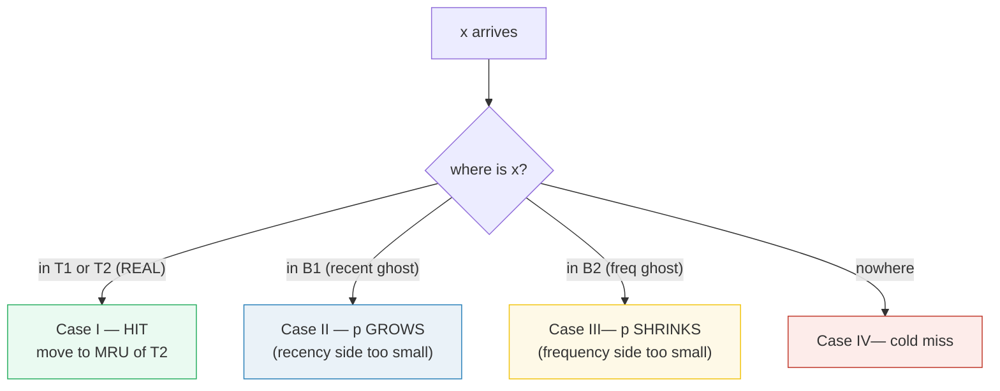
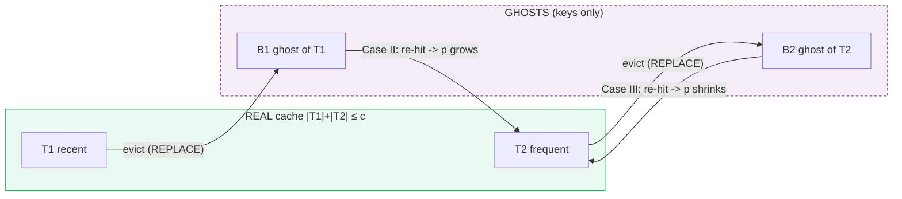
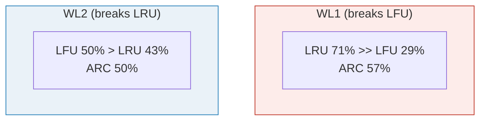

# Adaptive Replacement Cache (ARC) — A Visual, Worked-Example Guide

> **Companion code:** [`arc_cache.py`](./arc_cache.py). **Every number in this
> guide is printed by `uv run python arc_cache.py`** — nothing hand-computed.
>
> **Sibling guide:** [`LFU_CACHE.md`](./LFU_CACHE.md) — the **pollution bug**
> ARC exists to fix. Read that first; this guide assumes you know why pure LFU
> collapses on non-stationary workloads. Cross-references marked 🔗 throughout.
>
> **Live animation:** [`arc_cache.html`](./arc_cache.html) — watch the four
> lists and the adaptive `p` dial move as the workload shifts.

---

## 0. TL;DR — the bouncer who learns the crowd

> **The analogy (read this first):** A club has room for `c` people. A *fixed*
> door policy is doomed: "kick out whoever arrived earliest" (LRU) fails when
> the regulars are loyal; "kick out whoever dances least" (LFU) fails when a
> one-night burst earns a nobody a permanent VIP badge (🔗 pollution). ARC's
> idea: **run both door policies at once, watch which one keeps getting
> second-guessed, and shift the rope toward the other.** It is a bouncer with a
> memory of every mistake.

ARC (Megiddo & Modha, 2003) does **not** pick LRU or LFU. It runs an LRU half
and an LFU half **at the same time**, keeps a *ghost* of every eviction, and
uses ghost re-hits as the feedback signal that turns a capacity dial called `p`.



> **One-line definition:** *ARC* splits the real cache into a **recency** half
> `T1` and a **frequency** half `T2`, keeps **ghost** directories `B1`/`B2` of
> what it evicted, and continuously retargets `|T1|` toward an adaptive `p ∈ [0,c]`
> that grows on `B1` re-hits and shrinks on `B2` re-hits.

### Glossary (plain English — refer back any time)

| Term | Plain meaning |
|---|---|
| **T1** | REAL cache, "recent" half — keys seen once recently (the LRU side). |
| **T2** | REAL cache, "frequent" half — keys seen ≥ 2×, or promoted from a ghost. |
| **B1** | GHOST of T1 — keys that lived in T1 and were evicted. **Stores the key only, never a value.** |
| **B2** | GHOST of T2 — keys that lived in T2 and were evicted. |
| **c** | total real capacity. `|T1| + |T2| ≤ c`. Ghosts can push `|T1|+|B1| ≤ c` and `|T2|+|B2| ≤ c`. |
| **p** | the ADAPTIVE target size of T1, in `[0, c]`. `p=0` → pure frequency (all T2); `p=c` → pure recency (all T1). **ARC tunes p from traffic.** |
| **REPLACE** | the subroutine that frees a real slot: evict from T1 if `|T1|>p`, else from T2 — and demote the victim to its matching ghost list. |
| **ghost** | ~free metadata (a key, no value) that lets ARC *remember its eviction mistakes*. A ghost re-hit is the feedback that turns the dial. |

---

## 1. The four cases — the whole algorithm

ARC classifies each access into one of four cases. This is the entire policy:

> **Case I** — `x` in `T1 ∪ T2` (a real hit): move `x` to MRU of `T2` (a second
> sighting makes it "frequent").
>
> **Case II** — `x` in `B1` (recent-ghost hit): the recency side is too small.
> `p ← min(c, p + max(|B2|/|B1|, 1))`; `REPLACE`; promote `x` from `B1` to MRU of `T2`.
>
> **Case III** — `x` in `B2` (frequent-ghost hit): the frequency side is too small.
> `p ← max(0, p − max(|B1|/|B2|, 1))`; `REPLACE`; promote `x` from `B2` to MRU of `T2`.
>
> **Case IV** — `x` nowhere (cold miss): possibly trim a ghost list, `REPLACE`
> if a slot is needed, then insert `x` at MRU of `T1`.



**Why ghosts are genius:** a ghost costs ~zero memory (just the key) but lets
ARC *remember what it threw away*. When the workload asks for it again, the
ghost hit is the signal that the dial turned the wrong way. A plain LRU/LFU
forgets its evictions the instant they happen; ARC learns from them.

---

## 2. Self-tuning — watch `p` move with the workload

This is the headline. The sequence below is designed so that `T2` fills **first**
(promoting A,B on hits), so that the subsequent cold scan evicts into ghosts, so
that re-asking for those keys fires **Case II / Case III** and moves `p`.

```
sequence: A B C D A B E F G H E F A      capacity = 4
```

- **Steps 1–6:** A,B,C,D enter `T1`; re-asking A,B promotes them to `T2`. Now
  *both* halves are populated — the precondition for ghosts.
- **Steps 7–10:** cold scan E,F,G,H. Each miss calls `REPLACE`, which demotes
  the LRU of `T1` into `B1`. Ghosts now exist.
- **Steps 11–12:** re-ask E,F → they are in `B1` = **Case II** ghost hits → `p` grows.
- **Step 13:** re-ask A → it is in `B2` = **Case III** ghost hit → `p` shrinks.

> From `arc_cache.py` **Section B**:
>
> | # | op | res | case | p after |
> |---|---|---|---|---|
> | 5 | A | HIT | I | 0 |
> | 6 | B | HIT | I | 0 |
> | 7 | E | MISS | IV | 0 |
> | 10 | H | MISS | IV | 0 |
> | 11 | E | MISS | **II (B1 ghost hit, p+=1)** | **1** |
> | 12 | F | MISS | **II (B1 ghost hit, p+=1)** | **2** |
> | 13 | A | MISS | **III (B2 ghost hit, p−=1)** | **1** |
>
> `p`-trajectory (start + per step) = `[0,0,0,0,0,0,0,0,0,0,0,1,2,1]`.
> `p` went `0 → 1 → 2 → 1`. The two Case-II hits **grew** it; the Case-III hit
> **shrunk** it. No fixed LRU or LFU can do this — ARC retargeted its recency /
> frequency balance purely from live ghost feedback.

> 🔗 Note the Case-II/III nudge magnitude is `max(rival_size / my_size, 1)`: a
> lonely ghost in a *big* rival list moves the dial *harder*. If `B2` is full of
> evicted frequent keys and a single `B1` ghost re-hits, ARC grows `p` a lot in
> one step — because the evidence that the recency side is starved is strong.

---

## 3. Robustness — ARC never collapses; LRU and LFU each do

ARC's claim is **not** "wins every trace" (no policy does). Its claim is
**worst-case robustness**: with *no* knowledge of the workload, it stays
competitive on the workloads that break each fixed policy.

`arc_cache.py` **Section C** runs two opposed workloads (the exact pair from
🔗 [`LFU_CACHE.md`](./LFU_CACHE.md)):

- **WL1 — non-stationary** (the pollution workload): stale squatter X then a
  live `{A,B,C}`, c=3. *Breaks LFU.*
- **WL2 — stationary hot set + scan**: `{H1,H2}` hot, then a one-shot cold
  scan, then back, c=2. *Breaks LRU.*

> | workload | ARC | LRU | LFU | ARC `p` |
> |---|---|---|---|---|
> | 1: non-stationary (LFU-pollution), c=3 | 57% | **71%** | 29% | 2 |
> | 2: stationary hot set + scan, c=2 | **50%** | 43% | **50%** | 0 |
> | **worst-case** | **50%** | 43% | 29% | |



LRU and LFU each have a workload where they collapse (LFU→**29%** on WL1,
LRU→**43%** on WL2). ARC, knowing *nothing* about which workload it is on,
stays competitive on **both** because `p` adapts — it leaned **recency-favored**
(`p=2`) on WL1 and **frequency-favored** (`p=0`) on WL2. That worst-case
robustness — not winning every single trace — is what made IBM adopt ARC for
Z-series storage.

---

## 4. Why it's correct — the invariants

ARC's four lists are not ad hoc; three invariants always hold, and `arc_cache.py`
**Section D** asserts them after every run:

> ```
> |T1| + |T2| ≤ c          (the real cache never overflows)
> |T1| + |B1| ≤ c          (recent side + its ghosts)
> |T2| + |B2| ≤ c          (frequent side + its ghosts)
> 0 ≤ p ≤ c                (the dial stays in range)
> ```

Plus: **no key is ever in two lists** (a key is in exactly one of T1, T2, B1,
B2, or nowhere). These invariants are what make `REPLACE` able to find a victim
in O(1) and what bound the ghost metadata at `≤ 2c` keys total.

---

## 5. Where it lives

- **IBM Z-series storage / EasyTier** — the headline production deployment; the
  self-tuning property matters most on storage tiers whose workload drifts.
- **PostgreSQL** had an ARC variant in its buffer manager briefly (8.0.x); it was
  reverted over a patent concern, then generalized into the clock-sweep that
  ships today.
- **ZFS** uses a direct descendant (the "ARC" is literally the in-kernel cache).

> 🔗 ARC is one answer to "don't be pure" (🔗 [`LFU_CACHE.md`](./LFU_CACHE.md) §5).
> The other modern answer is **W-TinyLFU** (Caffeine): instead of two real
> halves, keep one LRU window + an *aging* frequency sketch, so stale-popular
> keys decay out instead of needing ghosts.

---

## Sources

- Megiddo & Modha, *"ARC: A Self-Tuning, Low Overhead Replacement Cache"*
  (FAST '03) — the paper; IBM Z storage / EasyTier use ARC.
- Johnson & Shasha, *"2Q"* (VLDB '94) — the two-list ancestor ARC generalizes.
- Wikipedia, *"Adaptive replacement cache"* — the reference pseudocode this
  guide's integer-`p` variant follows.
