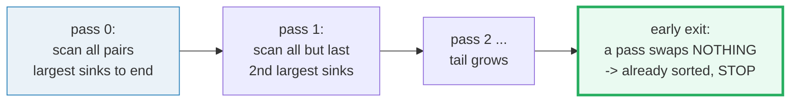

# Bubble Sort — A Visual, Worked-Example Guide

> **Companion code:** [`bubble_sort.py`](./bubble_sort.py). **Every number in this
> guide is printed by `uv run python bubble_sort.py`** — change the code, re-run,
> re-paste. Nothing here is hand-computed.
>
> **Sibling guide:** [`INSERTION_SORT.md`](./INSERTION_SORT.md) — same input,
> head-to-head comparison in §5.
>
> **Live animation:** [`bubble_sort.html`](./bubble_sort.html) — open in a browser,
> play/step through every comparison and swap.
>
> **Source material:** Knuth, *TAOCP* Vol 3 §5.2.2 (exchange sorting).

---

## 0. TL;DR — heavy bubbles sink

Picture the array as a row of bubbles in water. Each **pass** scans adjacent
pairs left-to-right; whenever the left bubble is **heavier** than its right
neighbour, they **swap**. So the heaviest bubble "sinks" one step at a time to
the far right. After pass `k`, the `k+1` largest values are **locked** at the
tail in their final positions.



> **One-line definition:** *Bubble sort* repeatedly scans the array, swapping
> out-of-order **adjacent** pairs, until a full pass makes **no swaps**. Each
> pass locks the next-largest element at the tail.

### Glossary

| Term | Plain meaning |
|---|---|
| **pass** | one left-to-right scan over the (shrinking) unsorted region |
| **compare** | checking `arr[j] > arr[j+1]`; a pass costs as many as it scans |
| **swap** | exchanging an out-of-order adjacent pair; **fixes exactly 1 inversion** |
| **inversion** | a pair `(i<j)` with `arr[i] > arr[j]`; a sorted array has 0 |
| **early exit** | stop the whole sort the first time a pass does 0 swaps |
| **locked tail** | after pass `i`, indices `n-1-i .. n-1` are in final order |

### The worked example

```python
INPUT = [64, 34, 25, 12, 22, 11, 90]      # n = 7, 14 inversions
bubble_sort(INPUT)
# => [11, 12, 22, 25, 34, 64, 90]
#    21 comparisons, 14 swaps
```

---

## 1. The algorithm (the early-exit flag is the whole story)

```python
def bubble_sort(arr):
    a = list(arr)                       # don't mutate the caller's list
    n = len(a)
    for i in range(n - 1):
        swapped = False
        for j in range(n - 1 - i):      # the tail i..n-1 is already locked
            if a[j] > a[j + 1]:         # strict > : keeps equal keys in order (stable)
                a[j], a[j + 1] = a[j + 1], a[j]
                swapped = True
        if not swapped:                 # EARLY EXIT: a clean pass means sorted
            break
    return a
```

Two things to notice:

1. **The inner range shrinks by `i`** — once pass `i-1` locks the tail, no
   later pass needs to re-scan it. (`range(n - 1 - i)`.)
2. **The `if not swapped: break`** — *without it* bubble sort is always
   `O(n²)`. With it, an already-sorted input stops after **one** pass of `n-1`
   comparisons → **best case `O(n)`**. That single flag is what makes bubble
   sort *adaptive*.

---

## 2. Step-by-step on `[64, 34, 25, 12, 22, 11, 90]`

Reproduced from `uv run python bubble_sort.py` (Section A). `<->` = swapped,
`.` = in order.

```
--- PASS 0 ---  unsorted region = arr[0 .. 5]
  j=0: 64 vs 34  <->  -> [ 34, 64, 25, 12, 22, 11, 90]
  j=1: 64 vs 25  <->  -> [ 34, 25, 64, 12, 22, 11, 90]
  j=2: 64 vs 12  <->  -> [ 34, 25, 12, 64, 22, 11, 90]
  j=3: 64 vs 22  <->  -> [ 34, 25, 12, 22, 64, 11, 90]
  j=4: 64 vs 11  <->  -> [ 34, 25, 12, 22, 11, 64, 90]   # 64 sinks next to 90
  j=5: 64 vs 90   .   -> [ 34, 25, 12, 22, 11, 64, 90]   # pass 0: 6 cmp, 5 swap; tail[6] locked
--- PASS 1 ---  unsorted region = arr[0 .. 4]
  ... 34 sinks to index 4 ...                             # 5 cmp, 4 swap; tail[5,6] locked
--- PASS 2 ---  25 sinks to index 3                       # 4 cmp, 3 swap; tail[4,5,6] locked
--- PASS 3 ---  only 22 vs 11 swaps                       # 3 cmp, 1 swap
--- PASS 4 ---  12 vs 11 swaps                            # 2 cmp, 1 swap
--- PASS 5 ---  11 vs 12 in order, no swap                # 1 cmp, 0 swap

RESULT: [11, 12, 22, 25, 34, 64, 90]
TOTALS: 21 comparisons, 14 swaps.
```

> 🔗 Each step is an animation frame in [`bubble_sort.html`](./bubble_sort.html) —
> press play to watch `90`, then `64`, then `34` … sink to the tail.

---

## 3. Counting: comparisons, swaps, and the inversions identity

```
Input [64, 34, 25, 12, 22, 11, 90]   (n=7)
  comparisons performed : 21
  swaps performed       : 14
  inversions in input   : 14
```

Two invariants that always hold (and that the `.py` asserts):

| Invariant | Why |
|---|---|
| **`swaps == inversions`** (`14 == 14`) | each adjacent swap removes **exactly one** inversion. Bubble sort removes inversions one swap at a time, so it can't stop before all are gone. |
| **`comparisons ≤ n(n−1)/2`** (`21 ≤ 21`) | there are only `n(n−1)/2 = 21` ordered pairs to ever compare. |

> **Note:** comparisons hit the **maximum** `n(n−1)/2` here *even with* the
> early-exit flag, because every pass up to the last still does swaps. Early
> exit only saves comparisons when a pass makes **zero** swaps — i.e. on
> already- or nearly-sorted input (see §4 best case: **6** comparisons).

---

## 4. Best / average / worst (concrete on n = 7)

| case | input | comparisons | swaps | passes |
|---|---|---|---|---|
| **BEST** | `[1,2,3,4,5,6,7]` | **6** = `n−1` | **0** | 1 |
| **our input** | `[64,34,25,12,22,11,90]` | 21 | 14 | 6 |
| **WORST** | `[7,6,5,4,3,2,1]` | 21 = `n(n−1)/2` | 21 = `n(n−1)/2` | 6 |

| | complexity |
|---|---|
| **comparisons** | best `O(n)` · average `Θ(n²)` · worst `n(n−1)/2` |
| **swaps** | best `0` · average `~n(n−1)/4` · worst `n(n−1)/2` (= inversions) |
| **space** | `O(1)`, in place |
| **adaptive?** | **yes** (with the early-exit flag) |
| **stable?** | **yes** (strict `>`, never `>=`) |

The early-exit flag is what makes bubble sort **adaptive**: its cost tracks how
disordered the input is. Strip the flag and *every* input costs `n(n−1)/2`
comparisons — the best case collapses to `O(n²)`.

---

## 5. When to use bubble sort (vs insertion sort)

Same input, two O(n²) sorts — insertion sort dominates on comparisons:

| algorithm | comparisons | swaps |
|---|---|---|
| **insertion sort** | **16** | 14 |
| bubble sort | 21 | 14 |

Both do **14 swaps** (each fixes one inversion, and there are 14 inversions).
But insertion sort's inner loop **stops** the moment it finds a smaller
element, while bubble sort always scans the whole unsorted region — so
insertion sort does **fewer comparisons**.

**Use bubble sort when:**
- you are **teaching** an adaptive, stable sort — its invariant ("each pass
  locks the next largest") is the easiest of any sort to *see*;
- the input is tiny (`n < ~16`) and you want a 10-line, in-place, stable,
  zero-allocation sort.

**Don't use it when performance matters** — insertion sort, or the stdlib's
**Timsort** (which uses insertion sort for small runs), is strictly better:
same `O(n²)` worst case, fewer comparisons, better cache behaviour. See
[`INSERTION_SORT.md`](./INSERTION_SORT.md).

---

## Sources

- Knuth, D. E. *The Art of Computer Programming, Vol 3: Sorting and
  Searching*, §5.2.2 (internal/exchange sorting). The `swaps == inversions`
  identity and the early-exit optimisation are classical.
- 🔗 [`insertion_sort.py`](./insertion_sort.py) / [`INSERTION_SORT.md`](./INSERTION_SORT.md)
  — the sibling O(n²) sort this guide compares against.
