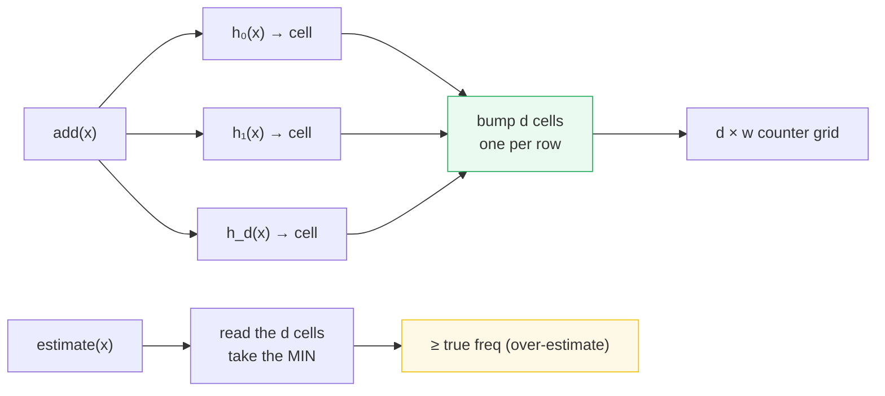
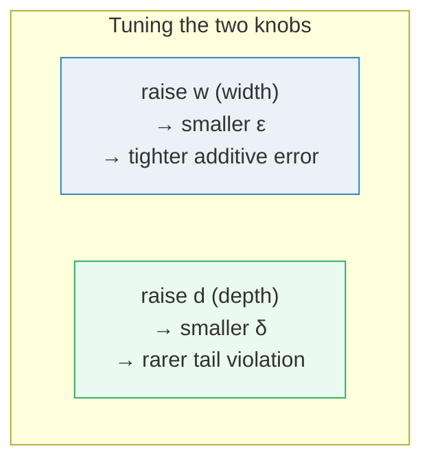

# Count-Min Sketch (CMS) — A Visual, Worked-Example Guide

> **Companion code:** [`count_min_sketch.py`](./count_min_sketch.py). **Every
> number in this guide is printed by `uv run python count_min_sketch.py`** —
> nothing hand-computed.
>
> **Live animation:** [`count_min_sketch.html`](./count_min_sketch.html) — step
> the stream and watch each `add()` bump `d` cells, then take the `min` for an
> estimate. The tiny example is recomputed in JS from the *identical* pinned
> hash parameters as the `.py`.
>
> **Sibling guide:** [`HYPERLOGLOG.md`](./HYPERLOGLOG.md) — the other half of
> "probabilistic counting": CMS counts *how often*, HLL counts *how many
> distinct*. Cross-references marked 🔗 throughout.

---

## 0. TL;DR — the pessimist's tally sheet

> **The analogy (read this first):** You run a website and want a counter per
> visitor, but there are a billion possible visitor ids — a billion counters is
> too much RAM. CMS lays down a small `d × w` grid of counters and gives every
> row its **own** hash function. To record a visit, you bump the one cell that
> `x` hashes to in **each** row (`d` cells total). To ask "how many times did
> `x` visit?", you read the `d` cells `x` hashed to and take the **minimum** —
> because every cell was bumped by `x`'s own visits *plus* any strangers that
> collided into it, so each cell **over-counts**, and the smallest one is the
> least-polluted, i.e. the best guess.

CMS (Cormode & Mirodnik, 2004) is **one-sided**: every estimate is `≥` the
truth, never below. The error is an **additive** `ε·N` tail, bounded with high
probability, using only `d·w = O(ln(1/δ)/ε)` counters — independent of how big
the id universe is.



> **One-line definition:** *Count-Min Sketch* is a `d × w` array of counters
> with `d` hash functions; `add(x)` increments `d` cells (one per row), and
> `estimate(x)` returns the **minimum** of those `d` cells — always `≥` the true
> frequency, with `Pr[estimate − f(x) > ε·N] ≤ δ`.

### Glossary (plain English — refer back any time)

| Term | Plain meaning |
|---|---|
| **sketch** | the `d × w` grid of counters. The whole data structure. |
| **d** | number of rows = number of hash functions. |
| **w** | number of counters per row (the width). |
| **hash fn** | `h_j(x) = ((a_j·x + b_j) mod P) mod w` — a multiply-mod-prime universal family. One per row; `a_j, b_j` fixed & public. |
| **add(x)** | bump the `d` cells `x` hashes to (one per row). |
| **estimate(x)** | the **min** of the `d` cells. Best guess; always `≥ f(x)`. |
| **over-count** | strangers that bumped a cell alongside `x`. Always `≥ 0`. |
| **N** | total stream weight (sum of all `add()` calls). |
| **heavy hitter** | an item whose frequency exceeds a threshold (e.g. 1% of `N`). CMS's headline application (§4). |

---

## 1. The algorithm — `add` bumps `d` cells, `estimate` takes the min

This is the whole algorithm. A `d × w` grid; `add(x)` bumps `d` cells;
`estimate(x)` takes the min.

```
hash family (multiply-mod-prime):  h_j(x) = ((a_j*x + b_j) mod P) mod w
add(x, c)    : for j in 0..d-1:  counts[j][ h_j(x) ] += c
estimate(x)  : min over j of      counts[j][ h_j(x) ]
```

> **Why the min?** Each of the `d` cells holds `x`'s true count **plus** every
> stranger that hashed to the same cell. So every cell is an **over-estimate**.
> The minimum is the cell polluted by the *fewest* strangers — the best
> estimate. And because *all* of them are `≥ f(x)`, the min is also `≥ f(x)`:
> CMS **never under-counts**. The only thing it can do is count a little high.

### Tiny worked example — heavy item 1 is exact, rare item 4 is over-counted

From `count_min_sketch.py` **Section A**, `d=3, w=4` (12 counters, deliberately
tiny), stream `[1,2,1,3,1,2,1,4,1]` (exact freqs: `1→5, 2→2, 3→1, 4→1`):

```
add(1): positions = [3,2,3]   bump row0[col3], row1[col2], row2[col3]
add(2): positions = [0,0,3]   bump row0[col0], row1[col0], row2[col3]
... (every add bumps exactly d=3 cells)
```

The final counter matrix (the entire data structure, `N=9`):

| | col0 | col1 | col2 | col3 |
|---|---|---|---|---|
| **row 0** (`h₀`) | 4 | 0 | 0 | **5** |
| **row 1** (`h₁`) | 2 | 0 | **6** | 1 |
| **row 2** (`h₂`) | 0 | 0 | 0 | **9** |

Now query each item — read its `d` cells, take the min:

| item | cells touched | estimate = min | exact | over-count |
|---|---|---|---|---|
| **1** (heavy) | `[5, 6, 9]` | **5** | 5 | **0** |
| 2 | `[4, 2, 9]` | **2** | 2 | 0 |
| 3 | `[4, 1, 9]` | **1** | 1 | 0 |
| **4** (rare) | `[4, 6, 9]` | **4** | 1 | **+3** |

Read the two extremes:
- **Item 1 (heavy, exact 5)** is recovered **exactly**. Its cells are `[5,6,9]`
  — every row also absorbed some of item 1's *own* weight plus collisions, but
  the **min picks row 0**, where item 1 sits *alone* in col 3 with value 5. The
  min found a clean row.
- **Item 4 (rare, exact 1)** is over-counted to **4**. Its cells are `[4,6,9]` —
  and *all three* also hold the heavy item 1 (and item 2). No row is clean, so
  the min (`4`) is nowhere near the truth (`1`). **This is over-counting: pure
  collision with a heavy neighbour, and it is the only error CMS ever makes.**

> 🔗 Compare with [`HYPERLOGLOG.md`](./HYPERLOGLOG.md): both trade exactness for
> fixed memory, but CMS answers "how *often*?" (frequencies, additive error)
> while HLL answers "how *many distinct*?" (cardinality, relative error).

---

## 2. The error bound — `Pr[estimate − f(x) > ε·N] ≤ δ`

CMS's guarantee (Cormode & Mirodnik 2004): for **any** item `x`,

> `estimate(x) ≤ f(x) + ε·N` &nbsp;&nbsp; with probability `≥ 1 − δ`,

where `N` is the total stream weight, and `(ε, δ)` fix the grid size:

> `w = ⌈e/ε⌉` &nbsp;&nbsp;&nbsp; `d = ⌈ln(1/δ)⌉` &nbsp;&nbsp;&nbsp; memory `= d·w = O(ln(1/δ)/ε)`.

From `count_min_sketch.py` **Section B**:

| target ε | target δ | `w = ⌈e/ε⌉` | `d = ⌈ln(1/δ)⌉` | counters `d·w` |
|---|---|---|---|---|
| 0.01 | 0.01 | 272 | 5 | 1,360 |
| **0.001** | 0.01 | 2,719 | 5 | 13,595 |
| 0.001 | 0.0001 | 2,719 | 10 | 27,190 |
| 0.0001 | 0.001 | 27,183 | 7 | 190,281 |

**Note memory does not depend on the universe `U`.** Tracking a 64-bit-id stream
to `ε=1e-3, δ=1e-4` costs `~10 × 2719 = 27,190` counters whether `U` is `10³` or
`10¹⁸`. Exact counting needs `O(U)`.

### The bound holds empirically

On a 200,000-item stream over 5,000 ids (`count_min_sketch.py` Section B), the
**worst per-item** error/N stayed under `ε` for every `(ε, δ)`:

| ε | δ | `w` | `d` | worst error/N | ≤ ε? |
|---|---|---|---|---|---|
| 0.002 | 0.01 | 1,360 | 5 | 0.000730 | YES |
| 0.001 | 0.001 | 2,719 | 7 | 0.000360 | YES |
| 0.02 | 0.4 | 136 | 1 | 0.007775 | YES |

The sketch is **one-sided**: every estimate is an over-estimate, so there is
never a false *too few* — the only risk is *too many*, and that risk is exactly
what `(ε, δ)` bounds. Increase `d` (depth) to drive `δ` down; increase `w`
(width) to drive `ε` down.



---

## 3. Memory — CMS is `O(d·w)`, independent of the universe

Exact per-item counting must store one counter for every key that *could* appear
(the universe `U`). CMS stores a fixed `d·w` grid regardless of `U`.

> `bytes = (d·w) · counter_width` &nbsp;&nbsp;(4 bytes per 32-bit counter)
> vs `exact = U · counter_width`, and `U` can be astronomically large.

From `count_min_sketch.py` **Section C**, a `ε=0.001, δ=0.001` sketch =
`d=7, w=2,719` = **76,132 bytes (~74 KiB)**:

| scenario | exact bytes | CMS bytes | CMS win |
|---|---|---|---|
| 10K users (exact is fine here) | 40,000 | 76,132 | 0.5× |
| 1M user ids | 4,000,000 | 76,132 | ~50× |
| 1B (ad impressions) | 4,000,000,000 | 76,132 | ~50,000× |
| 64-bit ids (`U = 2⁶⁴`) | **73,786,976,294,838,206,464** | 76,132 | **~10¹⁵×** |

Read it: exact is linear in `U`. CMS is a **constant** ~74 KiB no matter whether
`U` is 10K or `2⁶⁴`. For `U = 2⁶⁴`, exact counting is impossible (~18 exabytes);
CMS still costs ~74 KiB and loses only `ε·N` accuracy. That trade — bounded
memory, bounded additive error — is the deal CMS offers.

---

## 4. Applications — heavy hitters, inner products, range sums, merge

The *same* `d × w` sketch answers several questions for free (Section D):

- **Heavy hitters.** An item is a candidate heavy hitter if `estimate(x) ≥
  threshold`. On a skewed stream with item `42` planted at ~4,000 hits (~8%),
  CMS (`ε=0.005, δ=0.01`) recovers it: `estimate(42) = 4,073` (exact 4,073),
  well above the 1%-of-`N` threshold of 500. (To *name* heavy hitters you pair
  CMS with a small candidate tracker like Space-Saving; CMS answers "how big?"
  in O(1) for any id you ask about.)
- **Inner product ⟨f, g⟩ of two streams** = `min_j Σ_k C₁[j][k]·C₂[j][k]` →
  self-join size, traffic correlation, **without joining the data**.
- **Range / subrange sums** = sum of estimates over a key range → "how many hits
  from ids 100..200?".
- **Distributed merge.** Two sketches with the *same* `(d, w, hash fns)` add
  cell-wise to give the sketch of the union stream. Each shard keeps ~74 KiB;
  the reducer adds `d·w` small ints — no shuffle of raw items.
  `count_min_sketch.py` Section D verifies `merge(shard_a, shard_b)` equals the
  single-pass sketch to the cell.

---

## 5. Where it lives

- **Network telemetry / traffic analysis** — per-flow counting at line rate where
  the flow-id space is huge and exact tables cannot fit in SRAM.
- **Ad-tech / impression counting** — counting views per (user, ad) pair across a
  billion-user space.
- **Streaming SQL engines** (e.g. approximate `GROUP BY` counts, heavy-hitter
  detection) where an exact aggregate would spill to disk.
- **Distributed roll-ups** — mergeable sketches let each shard summarise locally
  and the coordinator combine summaries, never raw rows.

> 🔗 CMS answers *frequency*; for *cardinality* (count-distinct) see
> [`HYPERLOGLOG.md`](./HYPERLOGLOG.md) — Redis ships both: `PFCOUNT` (HLL) and
> Count-Min-style sketches for top-K.

---

## Sources

- Cormode & Mirodnik, *"An Improved Data Stream Summary: The Count-Min Sketch
  and its Applications"* (J. Algorithms 2005; DIMACS TR 2003) — the paper.
- Cormode & Hadjieleftheriou, *"Methods for Finding Frequent Items in Data
  Streams"* (VLDB J. 2010) — the heavy-hitter / comparison survey.
- Wikipedia, *"Count–Min sketch"* — the reference for the `(ε, δ)` ↦ `(w, d)`
  parameter formulas used here.
