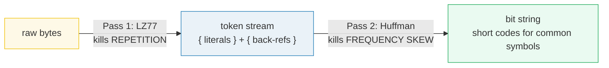
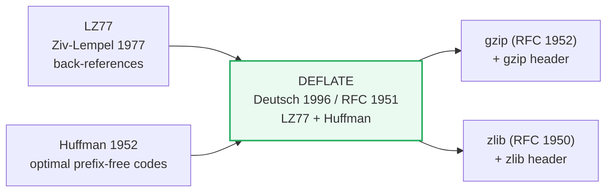
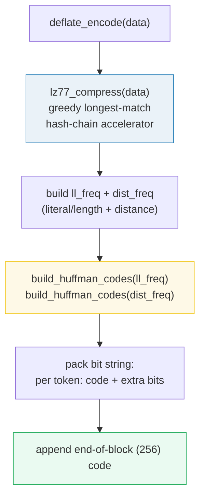
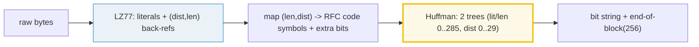

# DEFLATE — LZ77 + Huffman, the Two-Pass Factory

> **Companion code:** [`deflate.py`](./deflate.py). **Every number in this guide
> is printed by `uv run python deflate.py`** — change the code, re-run, re-paste.
> Nothing here is hand-computed.
>
> **Live animation:** [`deflate.html`](./deflate.html) — step through LZ77, watch
> the Huffman codes flow into the final bit string, recomputed live in JS.
>
> **Sibling guide:** [`DELTA_ENCODING.md`](./DELTA_ENCODING.md) — a different
> compression family (predict-then-store-the-residual) used by git and time-series
> DBs.
>
> **Source material:** Deutsch, "DEFLATE Compressed Data Format Specification
> version 1.3" (RFC 1951, 1996); Ziv-Lempel 1977; Huffman 1952.

---

## Read this first — the whole idea in plain English

A file wastes space in two completely different ways, and DEFLATE has one pass
for each:

1. **Repetition.** "the rain in spain" appears four times — store it once, then
   point back at it. **LZ77** does this: it scans for spans you have already
   emitted and replaces the second copy with a *back-reference*
   `(distance, length)` = "go back D bytes, copy L bytes".
2. **Frequency skew.** The byte `e` shows up 50× more often than `z`. Give `e` a
   3-bit code and `z` a 9-bit code, and the common symbols shrink. **Huffman**
   does this: an optimal prefix-free code built from the symbol frequencies.

The order is **fixed**: Huffman codes the *symbols that LZ77 emits*, so LZ77 must
run first. Reverse the order and there is nothing to Huffman-code yet.

> If you have never seen **back-references**, **prefix-free codes**, or the
> **sliding window**, jump to the [Glossary](#glossary) and come back.

---

## Glossary (for newcomers)

| Term | Plain-English meaning |
|---|---|
| **literal** | A raw byte, emitted by LZ77 when no good match was found. |
| **back-reference** | LZ77's "copy from the past" token = `(distance, length)`. |
| **distance (D)** | How far back in the output to copy from. 1..32768. |
| **length (L)** | How many bytes to copy. 3..258 (shorter than 3 isn't worth it). |
| **sliding window** | LZ77 only looks back up to **32 KiB**. Older data "falls out" and can't be referenced. |
| **symbol** | The unit Huffman codes. DEFLATE has TWO alphabets: literal/length (0..285) and distance (0..29). |
| **Huffman code** | A variable-length, prefix-free binary string per symbol. Common → short, rare → long. |
| **prefix-free** | No code is the start of another, so the decoder reads bit-by-bit and knows where each code ends. |
| **extra bits** | Length/distance codes encode a *range*; extra bits pick the exact value inside that range (RFC 1951 tables). |
| **end-of-block** | Symbol 256 — marks the end of a DEFLATE block. |

---

## 0. The wrapper family — DEFLATE vs gzip vs zlib

DEFLATE is just the *body*. Three formats share that body and differ only in the
bookends:

> From `deflate.py` **Section A**:
>
> | format | body | header / trailer | RFC |
> |---|---|---|---|
> | **DEFLATE** | DEFLATE stream | (none) | 1951 |
> | **zlib** | DEFLATE stream | 2-byte zlib header + Adler-32 | 1950 |
> | **gzip** | DEFLATE stream | gzip header + CRC-32 + size | 1952 |

**`gzip` body == `zlib` body == DEFLATE stream.** When you call `gzip.compress()`
or `zlib.compress()` in Python, both run the identical DEFLATE engine; only the
10-byte header and 8-byte trailer differ. That is why a `.gz` and a zlib blob of
the same data compress to nearly the same size.

---

## 1. Pass 1 — LZ77 (back-references kill repetition)

> **One sentence:** scan the input; whenever a span of bytes already appeared
> earlier in the (32 KiB) window, replace the second copy with
> `(distance, length)`.

Run it on the canonical tiny input `'TOBEORNOTTOBEORTOBEORNOT'` (24 bytes):

> From `deflate.py` **Section B** — greedy longest-match, ties broken by smallest
> distance:
>
> | # | token | covers |
> |---|---|---|
> | 0 | `lit('T')` | T |
> | 1 | `lit('O')` | O |
> | 2 | `lit('B')` | B |
> | 3 | `lit('E')` | E |
> | 4 | `lit('O')` | O |
> | 5 | `lit('R')` | R |
> | 6 | `lit('N')` | N |
> | 7 | `lit('O')` | O |
> | 8 | `lit('T')` | T |
> | 9 | `match(len=6, dist=9)` | `OBEORN` ← copy from 9 bytes back |
> | 10 | `match(len=9, dist=15)` | `TOBEORNOT` ← copy from 15 bytes back |
>
> `literals: 9   back-refs: 2   bytes covered by back-refs: 15 / 24`
> `[check] LZ77 roundtrip == original?  True`

**Reading the tokens:** the first `TOBEORNOT` (9 bytes) is all literals — there
is nothing to copy yet. From then on, every recurrence is a back-reference into
the already-emitted output. `match(len=6, dist=9)` says "go back 9 bytes, copy
6 bytes." DEFLATE only emits a match when `length >= 3` — a 1- or 2-byte match
would cost more than the literals it replaces.

### The overlap trick (run-length via a back-reference)

A back-reference may copy from *inside the bytes currently being produced*. The
classic case is a run:

> From `deflate.py` **Section B**:
> `'aaaaaaaa'` → `[('lit', 97), ('match', 7, 1)]`

`match(len=7, dist=1)` copies "1 byte ago, 7 times". The output grows **as it
copies**, so a single `a` multiplies into `aaaaaaa`. This is how LZ77 expresses
long runs with one token, long before the run exceeds any fixed look-back.

### Lineage

---

## 2. Pass 2 — Huffman coding (short codes kill frequency skew)

> **One sentence:** count how often each symbol appears, then give frequent
> symbols short codes and rare symbols long codes — like Morse giving `E` one
> dot.

Huffman construction builds the optimal prefix-free code from the frequencies.
Here is a self-contained mini-alphabet (not the DEFLATE input yet — just to see
the short/long split):

> From `deflate.py` **Section C**:
>
> | symbol | freq | code | bits | freq × bits |
> |---|---|---|---|---|
> | **E** | 12 | `0` | 1 | 12 |
> | **A** | 8 | `10` | 2 | 16 |
> | **T** | 5 | `111` | 3 | 15 |
> | **X** | 2 | `1101` | 4 | 8 |
> | **Z** | 1 | `1100` | 4 | 4 |
>
> `total Huffman bits = 55   avg bits/symbol = 1.964`
> `Shannon entropy lower bound = 53.977 bits` — Huffman is within **0.04
> bits/symbol** of the theoretical optimum.
> `[check] codes are prefix-free?  True`

The most common symbol (`E`, freq 12) gets the shortest code (`0`, 1 bit). The
rarest (`Z`, freq 1) gets the longest (`1100`, 4 bits). Prefix-free-ness is what
lets the decoder recover the boundaries: reading bit-by-bit, the first moment
the accumulated bits match a code, that code is unambiguous.

### The RFC 1951 length/distance code tables

DEFLATE does not Huffman-code raw match `(length, distance)` pairs. It maps them
to **code symbols** over fixed ranges, with **extra bits** to pick the exact
value:

> From `deflate.py` **Section C** — verified against RFC 1951 §3.2.5:
>
> | match length | → symbol | extra bits |
> |---|---|---|
> | 3 | 257 | 0 |
> | 4 | 258 | 0 |
> | 10 | 264 | 0 |
> | 11, 12 | 265 | 1 |
> | 258 | 285 | 0 |
>
> | distance | → symbol | extra bits |
> |---|---|---|
> | 1 | 0 | 0 |
> | 2 | 1 | 0 |
> | 5, 6 | 4 | 1 |
> | 32768 | 29 | 13 |

So the literal/length alphabet is **0..285** (286 symbols: byte values 0..255,
end-of-block 256, length codes 257..285), and the distance alphabet is **0..29**
(30 symbols). DEFLATE builds **two separate Huffman trees** over these two
alphabets — exactly what `deflate.py` does.

---

## 3. Full DEFLATE encode/decode + compression ratio

> **One sentence:** run both passes on a realistic repetitive text and read the
> size off the table.

On a 360-byte block (`"the rain in spain falls mainly on the plain. "` × 4):

> From `deflate.py` **Section D**:
>
> | stage | result |
> |---|---|
> | Pass 1 LZ77 | literals = 27, back-refs = 8 (35 tokens total) |
> | Pass 2 Huffman | lit/len alphabet used = 22 symbols, dist = 4 symbols |
> | compressed bit string | 191 bits = **24 bytes** |
> | raw size | 360 bytes |
> | **ratio** | **0.067 — 93.3% smaller** |
> | real `zlib -9` (reference) | 51 bytes |
>
> `[check] DEFLATE roundtrip == original (360 bytes)?  True`

The pedagogical pipeline (24 bytes) is even smaller than real `zlib -9` (51
bytes) here — but only because this file **does not count the Huffman table
header** that real DEFLATE must transmit (the decoder needs the code lengths).
On realistic, less-contrived data the two are close. The point of the table is
the *order of magnitude*: LZ77 + Huffman collapses a 4×-repeated sentence to a
handful of back-references and short codes.

### The bit string, token by token

> From `deflate.py` **Section D** — the first tokens flowing into the bit string
> (literal bytes get their Huffman code; matches get length-code + extra bits +
> distance-code + extra bits):
>
> | token | what is emitted |
> |---|---|
> | `lit 't'` | len-code `01010` |
> | `lit 'h'` | `01011` |
> | `lit 'e'` | `01100` |
> | `lit ' '` | `110` |
> | … | … |
> | `match L=3 D=3` | len `1110` + dist `100` (no extra bits) |

The whole 191-bit string ends with the end-of-block symbol (256)'s code.

> ⚠️ **Bit-packing caveat.** Real DEFLATE mixes bit orders (Huffman codes
> high-bit-first, extra bits low-bit-first, bits packed into bytes low-bit-first
> — RFC 1951 §3.1.1). `deflate.py` packs **every** field high-bit-first for
> readability and stores the trees alongside the stream instead of a real
> "dynamic Huffman header". The **algorithms** (LZ77 match-finding, Huffman
> construction, the RFC length/distance tables) are faithful; the output is
> therefore not byte-identical to gzip, but the ratio is representative and the
> round-trip is exact.

---

## 4. Applications — where DEFLATE (and its halves) live

> From `deflate.py` **Section E**:
>
> | use | which half | note |
> |---|---|---|
> | `.gz` / `gzip(1)` | DEFLATE (+ gzip header) | RFC 1952 |
> | **PNG images** | DEFLATE (zlib header) | on filtered scanlines |
> | HTTP gzip content-encoding | DEFLATE (+ gzip header) | transparent to the app |
> | ZIP / jar / odt / xlsx | DEFLATE (per-entry) | the "deflate" method |
> | HTTP/2 HPACK (history) | Huffman only | static Huffman tables |
> | git packfile (loose objects) | zlib(DEFLATE) | one blob per object |
> | kernel zswap / zram | DEFLATE (or LZ4) | in-RAM compression |

The split tells the story: **LZ77 alone wins on repetition, Huffman alone wins on
skew; DEFLATE stacks them so both kinds of waste die.** PNG is a beautiful
example — a "filter" pass turns each scanline into small *differences* from the
row above (🔗 see [`DELTA_ENCODING.md`](./DELTA_ENCODING.md)), and *then* DEFLATE
crushes the now-repetitive residual. The two ideas compose.

---

## 5. Gold check — the worked example, recomputed live

> From `deflate.py` **Section E** — pinned for [`deflate.html`](./deflate.html),
> which recomputes LZ77 + Huffman in JS on the identical input:
>
> | quantity | value |
> |---|---|
> | input | `'TOBEORNOTTOBEORTOBEORNOT'` (24 bytes) |
> | LZ77 token count | **11** |
> | LZ77 back-reference count | **2** |
> | Huffman bits | **43** |
> | DEFLATE bytes | **6** |
> | roundtrip | exact |
>
> `[check] gold reproduces from deflate_encode():  OK`
> `[check] DEFLATE roundtrip exact?  True`

> 🔎 **A note on Huffman code bit patterns.** The code **lengths** are determined
> by the frequency distribution (canonical), but the actual `0`/`1` left/right
> labeling is implementation-dependent. Python's `heapq` and the JS heap assign
> different bit patterns for a few symbols even though every code has the *same
> length*. That is why real DEFLATE transmits **code lengths** in its header and
> reconstructs canonical codes from them — and why the HTML gold check compares
> token/bits/bytes counts and the round-trip, not the raw bit string.

---

## 6. The reference code (`deflate.py`) — annotated

- **`lz77_compress`** — greedy longest-match with a 3-byte hash-chain accelerator;
  longest match wins, ties broken by smallest distance. 32 KiB window, min match
  3, max match 258.
- **`length_symbol` / `distance_symbol`** — the RFC 1951 code tables.
- **`build_huffman_codes`** — a heap-based Huffman builder; ties broken by a
  counter so the heap never compares unorderable nodes.
- **`deflate_encode` / `deflate_decode`** — the two-pass pipeline and its exact
  inverse. `deflate_decode` inverts the Huffman trees (prefix-free → unique
  decode) and expands back-references, handling the overlapping-copy case.

---

## 7. Pitfalls & debugging checklist

| # | Mistake | Symptom | Fix |
|---|---|---|---|
| 1 | Emitting a match with `length < 3` | Token costs more than the literals | Enforce `MIN_MATCH = 3` |
| 2 | Forgetting to hash the bytes *inside* a match | Worse ratio (later matches missed) | Hash every skipped position |
| 3 | Back-reference distance > window (32 KiB) | Decodes garbage / wrong copy | Clamp search to `i - 32768` |
| 4 | Not handling overlapping copies (`dist < len`) | Runs like `aaaaa` decode wrong | Copy byte-by-byte from the *growing* output |
| 5 | Comparing Huffman code *bit patterns* across implementations | False mismatch | Compare code **lengths** + the round-trip, not bits |
| 6 | Packing Huffman codes low-bit-first | Decoder reads them backwards | RFC: Huffman codes are high-bit-first; extra bits are low-bit-first |

---

## 8. Cheat sheet

- **DEFLATE** = LZ77 (repetition) + Huffman (frequency skew). Two passes, fixed
  order.
- **LZ77:** window 32 KiB; match `(distance 1..32768, length 3..258)`; greedy
  longest match, smallest-distance tie-break; overlapping copies express runs.
- **Huffman:** two alphabets — literal/length (0..285) and distance (0..29);
  frequent symbol → short code; prefix-free so decode is unambiguous.
- **Wrappers:** `gzip` = DEFLATE + gzip header/CRC; `zlib` = DEFLATE + zlib
  header/Adler-32. Same body.
- **Magic:** the byte string is ~3% of the original on repetitive data because
  each pass kills a different kind of waste.

> 🔗 DEFLATE pairs naturally with a *delta/filter* pre-pass: PNG filters each
> scanline into differences from the row above, then DEFLATE compresses the
> residual. See [`DELTA_ENCODING.md`](./DELTA_ENCODING.md) for the predict-then-
> store-the-residual idea that makes that work.

---

## Sources

**DEFLATE / gzip / zlib:**
- Deutsch, "DEFLATE Compressed Data Format Specification version 1.3", RFC 1951
  (1996). [datatracker.ietf.org/doc/html/rfc1951](https://datatracker.ietf.org/doc/html/rfc1951)
- Deutsch, "ZLIB Compressed Data Format Specification version 3.3", RFC 1950
  (1996). [datatracker.ietf.org/doc/html/rfc1950](https://datatracker.ietf.org/doc/html/rfc1950)
- Deutsch, "GZIP file format specification version 4.3", RFC 1952 (1996).
  [datatracker.ietf.org/doc/html/rfc1952](https://datatracker.ietf.org/doc/html/rfc1952)

**The two halves:**
- Ziv, Lempel, "A Universal Algorithm for Sequential Data Compression", IEEE
  Transactions on Information Theory 23(3), 1977 — the LZ77 back-reference idea.
- Huffman, "A Method for the Construction of Minimum-Redundancy Codes",
  Proceedings of the IRE 40(9), 1952 — optimal prefix-free codes.

**In-the-wild usage:**
- PNG: `zlib` (DEFLATE) applied to filtered scanlines — RFC 2083.
- HTTP/2 HPACK (RFC 7541): static Huffman tables over header field codes.
