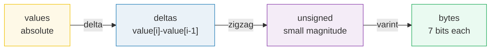
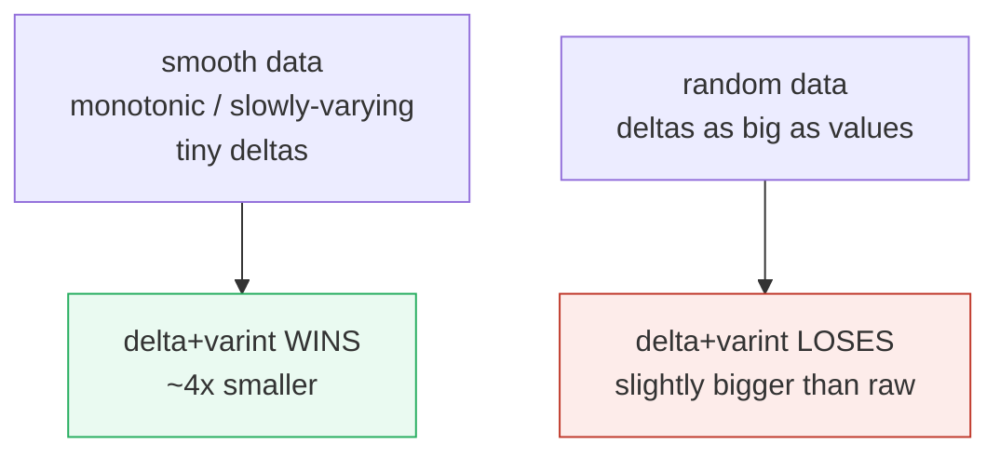
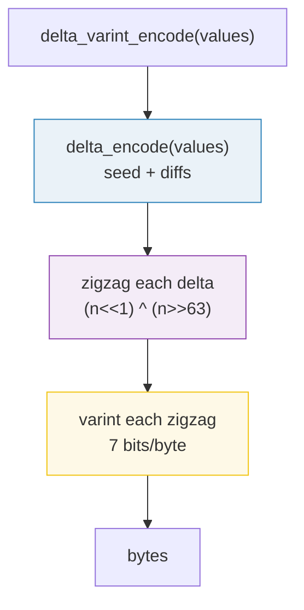
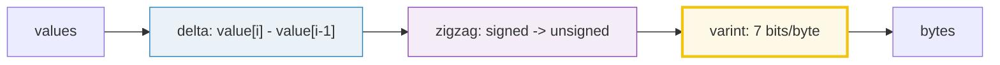

# Delta Encoding — Store the Change, Not the Number

> **Companion code:** [`delta_encoding.py`](./delta_encoding.py). **Every number
> in this guide is printed by `uv run python delta_encoding.py`** — change the
> code, re-run, re-paste. Nothing here is hand-computed.
>
> **Live animation:** [`delta_encoding.html`](./delta_encoding.html) — step
> through the diff transform and watch the compression bars for monotonic vs
> random data, recomputed live in JS.
>
> **Sibling guide:** [`DEFLATE.md`](./DEFLATE.md) — a different compression
> family (LZ77 + Huffman). The two ideas compose: PNG filters scanlines into
> deltas, then DEFLATE compresses the residual.

---

## Read this first — the whole idea in plain English

Most sequences you store are *smooth*: each value is close to the one before it.
A log of timestamps, a stock price feed, a sensor reading, a git blob after a
one-line edit. Storing every value absolutely wastes space, because most of each
number is "the same as yesterday". **Delta encoding** stores only the *change*:

```
absolute : [100, 102, 105, 106, 110]
delta    : [100,  +2,  +3,  +1,  +4]      <- seed, then consecutive diffs
```

The first value is kept absolute (the **seed**, so the chain can restart); every
later value becomes `value[i] − value[i-1]`. On smooth data the deltas are tiny
even when the absolute values are enormous — and tiny is exactly what the second
stage rewards:



**Delta alone does not compress anything** — it produces the same number of
values at the same bit-width. It only changes *which* values are big. **Varint**
rewards small magnitudes (1 byte for 0..127), so the two compose: delta makes
magnitudes small, varint packs them.

> If you have never seen **varint**, **zigzag**, or **prefix sums**, jump to the
> [Glossary](#glossary) and come back.

---

## Glossary (for newcomers)

| Term | Plain-English meaning |
|---|---|
| **delta** | The difference `value[i] − value[i-1]`. Can be negative. |
| **seed** | The first value, stored absolutely, so the chain can restart. |
| **monotonic** | Strictly non-decreasing (or non-increasing). Timestamps, counters, log sequence numbers — deltas all share a sign and are tiny. The sweet spot. |
| **slowly-varying** | Each value is close to the previous (small \|delta\|) even if the sign flips. Sensor readings, audio samples. |
| **zigzag** | A bijection mapping signed ints onto unsigned ints so small magnitudes (both signs) map to small unsigned values: `0→0, -1→1, 1→2, -2→3, 2→4, …` |
| **varint** | Base-128 encoding, 7 payload bits per byte, top bit = "more bytes follow". `0..127 → 1 byte`, `128..16383 → 2 bytes`. |
| **LEB128** | Little-Endian Base 128 — the varint wire format (protobuf, DWARF). |
| **prefix sum** | The inverse of delta encoding: a running total. Delta *decode* is a prefix sum. |

---

## 0. The pipeline — delta + zigzag + varint

| stage | job | example |
|---|---|---|
| **delta** | replace each value with its diff from the predecessor | `[100,102,105] → [100, +2, +3]` |
| **zigzag** | map signed → unsigned so small \|n\| → small value | `+2 → 4`, `-2 → 3` |
| **varint** | 7 payload bits/byte; small magnitude → few bytes | `4 → [0x04]` (1 byte) |

**Why zigzag is needed:** varint only encodes *non-negative* numbers. A delta of
`-1` would, as a signed int, be a huge unsigned value (all 1-bits) — a multi-byte
monster. Zigzag interleaves the number line so `0, -1, +1, -2, +2, …` map to
`0, 1, 2, 3, 4, …`, keeping every small-magnitude delta (either sign) at 1 byte.

```
zigzag(n) = (n << 1) ^ (n >> 63)      # 64-bit, arithmetic shift sign-extends
```

---

## 1. Encode / decode on the canonical example

> **One sentence:** the first value is the seed; every later value is the diff
> from its predecessor; decode is a prefix sum (running total).

> From `delta_encoding.py` **Section B**:
>
> | step | value | delta | how |
> |---|---|---|---|
> | 0 | 100 | **100** | seed (absolute) |
> | 1 | 102 | +2 | 102 − 100 |
> | 2 | 105 | +3 | 105 − 102 |
> | 3 | 106 | +1 | 106 − 105 |
> | 4 | 110 | +4 | 110 − 106 |
>
> `delta_encode([100,102,105,106,110]) → [100, 2, 3, 1, 4]`
> `delta_decode([100, 2, 3, 1, 4])    → [100, 102, 105, 106, 110]`
> `[check] roundtrip == original?  True`

### Zigzag, then varint

The deltas `[100, 2, 3, 1, 4]` are all non-negative here, but in general deltas
can be negative, so zigzag first:

> From `delta_encoding.py` **Section B**:
>
> | delta | zigzag | varint bytes |
> |---|---|---|
> | 100 | 200 | `[0xC8, 0x01]` (2 bytes) |
> | 2 | 4 | `[0x04]` |
> | 3 | 6 | `[0x06]` |
> | 1 | 2 | `[0x02]` |
> | 4 | 8 | `[0x08]` |
>
> `full pipeline → bytes = [200, 1, 4, 6, 2, 8]  (6 bytes)`
> `vs raw = 5 ints × 4 bytes = 20 bytes`
> `[check] full pipeline roundtrip?  True`

The seed (`100`) is the most expensive value — 2 bytes — because zigzag(100) =
200 needs two base-128 bytes. Every *subsequent* value is a tiny delta that costs
1 byte. That asymmetry is the whole point: one absolute anchor, then a stream of
cheap diffs.

---

## 2. Compression ratio — smooth data crushes, random doesn't

> **One sentence:** delta + varint is a **bet** that consecutive values are
> close. On monotonic data it wins ~4×; on uniform random it *loses*.

> From `delta_encoding.py` **Section C** — three 64-point workloads, raw = every
> value as a 4-byte int32:
>
> | workload | raw int32 | delta + varint | ratio | verdict |
> |---|---|---|---|---|
> | monotonic timestamps (1s apart) | 256 | 68 | **0.266** | good |
> | slowly-drifting sensor (±small) | 256 | 65 | **0.254** | good |
> | uniform random 32-bit | 256 | 316 | **1.234** | WORSE than raw |

**Reading the table:**

- **Monotonic** — every delta is `+1`. The huge absolute values (`1,700,000,000`!)
  collapse to a 1-byte varint. *Absolute magnitude is irrelevant; only the step
  size matters.*
- **Drifting** — deltas stay in `|−5|..|5|`, so 1 byte each.
- **Random** — deltas are as big as the values, so varint grows to 5 bytes each.
  Delta encoding actively *hurts* here (1.23× the raw size).



### Zoom into the monotonic case

> From `delta_encoding.py` **Section C** — first 8 of 64 timestamps:
>
> | values | deltas |
> |---|---|
> | `[1700000000, 1700000001, …, 1700000007]` | `[1700000000, 1, 1, 1, 1, 1, 1, 1]` |
>
> one value raw = 4 bytes; one delta varint = **1 byte**

A 1.7-billion value takes 1 byte once delta-encoded, because the *step* is `+1`.
This is the single most important insight: **delta encoding doesn't care how big
the numbers are — it cares how big the jumps are.**

---

## 3. Applications — git, time-series DBs, video P-frames

> From `delta_encoding.py` **Section D**:

### ① git packfile deltas (`OBJ_OFS_DELTA`)

A git "delta" object is a stream of instructions against a **base** object:

```
COPY  <offset> <len>     # copy len bytes from base+offset
ADD   <bytes...>         # insert literal new bytes
```

The `<offset>` and `<len>` are themselves varint-delta-encoded, so a *nearby*
copy is cheap. This is how a one-line commit to a 1 MB file becomes a ~100-byte
delta object in `.git/objects/pack/`.

> From `delta_encoding.py` **Section D** — demo: a 1000-int blob vs the same blob
> with one value bumped at index 500:
>
> | blob | delta + varint |
> |---|---|
> | original | 1000 bytes |
> | +1 bump @500 | 1002 bytes (**+2 bytes**: only deltas[500],[501] grew) |

A localized edit touches only the 1–2 deltas around it — exactly why git stores
the delta instead of the new blob.

### ② Time-series databases (monotonic timestamps)

Timestamps arrive in order: `1.7B, 1.7B+1, 1.7B+2, …`. Stored as int64 that's
8 bytes/point. Delta-encoded → every delta is `+1` → **1 byte/point** — an 8×
reduction on the timestamp column *before* any general-purpose compression.
Parquet calls this `DELTA_ENCODING`; InfluxDB and QuestDB do the same on their
time index.

### ③ Video codecs — P-frames (predict + encode the residual)

A **P-frame** does *not* store pixels. It stores a **motion-compensated delta**
from the previous frame: "this 16×16 block moved `(dx, dy)` → here are the small
brightness corrections." Most of the frame is nearly identical to the last, so
the residual is mostly ~0 and compresses to almost nothing. This is delta
encoding applied to 2D image blocks over time. **I-frames are the seeds.**

### ④ The whole game in one chart

> From `delta_encoding.py` **Section D** — 32 points each:
>
> | data | raw | delta + varint | ratio |
> |---|---|---|---|
> | monotonic | 128 B | 36 B | **0.28×** |
> | random | 128 B | 156 B | **1.22×** |

Delta encoding is a bet, and the bet is **"consecutive values are close."** Win
the bet (smooth data) → tiny file. Lose it (random data) → no win, even a slight
loss.

---

## 4. Gold check — the worked example, recomputed live

> From `delta_encoding.py` **Section E** — pinned for
> [`delta_encoding.html`](./delta_encoding.html), which recomputes the whole
> pipeline in JS on the identical input:
>
> | quantity | value |
> |---|---|
> | input | `[100, 102, 105, 106, 110]` |
> | delta array | **`[100, 2, 3, 1, 4]`** |
> | zigzag array | **`[200, 4, 6, 2, 8]`** |
> | varint bytes | `[200, 1, 4, 6, 2, 8]` |
> | varint byte total | **6** |
> | first byte (seed) | 200 (varint of zigzag(100) = 200) |
> | raw int32 | 20 bytes |
> | monotonic 64-pt | 68 bytes (raw int32 = 256) |
> | roundtrip | exact |
>
> `[check] gold reproduces from delta_*():  OK`
> `[check] canonical roundtrip exact?  True`
> `[check] monotonic roundtrip exact?  True`

---

## 5. The reference code (`delta_encoding.py`) — annotated



- **`delta_encode`** — 4 lines: keep the first value, append each diff. Its own
  inverse is `delta_decode` (a prefix sum).
- **`zigzag_encode`** — `(n << 1) ^ (n >> 63)`. The arithmetic right-shift
  sign-extends, so negatives XOR in all-1s, flipping the low bit. Lossless
  bijection Int64 ↔ UInt64.
- **`varint_encode`** — base-128: 7 payload bits per byte, top bit set if more
  bytes follow. `varint_len(n)` = `(n.bit_length() + 6) // 7`.
- **`delta_varint_encode`** — the full pipeline; `delta_varint_decode` is its
  exact inverse.

---

## 6. Pitfalls & debugging checklist

| # | Mistake | Symptom | Fix |
|---|---|---|---|
| 1 | Varint-encoding signed deltas directly | `-1` becomes a 10-byte monster | zigzag *before* varint |
| 2 | Using `n >> 63` in languages with unsigned ints | Wrong sign-extension | Use an arithmetic/signed shift, or a conditional |
| 3 | Delta-encoding random / unsorted data | Output bigger than input | Sort first, or don't use delta |
| 4 | Forgetting the seed is absolute | Cannot restart the chain | First value is always stored absolutely |
| 5 | Treating delta encoding as compression on its own | No size change (same count, same width) | Pair it with varint (or a general compressor) |
| 6 | Byte-slicing a multibyte `String`/`&str` (Rust) | Panic on multi-byte UTF-8 | Use char-based ops, never `&s[..n]` |

---

## 7. Cheat sheet



- **Delta encoding** = store differences, not absolutes. Seed first, then diffs.
- **Decode** = prefix sum (running total). Lossless, reversible.
- **Composes with varint:** delta makes magnitudes small, varint rewards small
  magnitudes. Tiny deltas → 1 byte each.
- **Wins on smooth data** (monotonic, slowly-varying): ~4× smaller. **Loses on
  random data.**
- **Lives in:** git packfile deltas, Parquet/InfluxDB/Druid time-series, video
  P-frames, protobuf/LEB128 (the varint half), LevelDB/RocksDB sorted keys.
- **Magic:** a 1.7-billion timestamp costs 1 byte, because the *jump* is `+1` —
  absolute magnitude is irrelevant.

> 🔗 PNG filters each scanline into deltas from the row above, then hands the
> residual to DEFLATE ([`DEFLATE.md`](./DEFLATE.md)). The two ideas — predict the
> value, then compress the residual — are how most real compression stacks are
> built.

---

## Sources

**Delta encoding & varint:**
- Ziv, Lempel (1977) — LZ77's back-references are a generalization of "store the
  diff against a past copy."
- Google, "Protocol Buffers Encoding — Varints" — the LEB128 / zigzag recipe this
  guide implements. [protobuf.dev/programming-guides/encoding](https://protobuf.dev/programming-guides/encoding/)
- DWARF Debugging Information Format §7 — LEB128 (the canonical varint spec).

**In-the-wild usage:**
- git `OBJ_OFS_DELTA` / `OBJ_REF_DELTA` — delta-encoded objects in packfiles;
  `git help gitformat-pack`.
- Apache Parquet, "Encodings" — `DELTA_ENCODING` / `DELTA_BINARY_PACKED` for
  sorted integer columns. [parquet.apache.org/docs](https://parquet.apache.org/docs/)
- InfluxDB / QuestDB storage engine — delta-of-delta timestamp compression.
- Video: ITU-T H.264 / H.265 — P-frames store motion-compensated residuals from
  the reference (I) frame.

> **32-bit caveat.** `delta_encoding.py` uses Python's arbitrary-precision ints
> (`n >> 63` generalizes to full 64-bit). The companion `delta_encoding.html`
> uses JavaScript's 32-bit bitwise ops, which match the Python output for all
> in-range examples here (canonical values ≤ 2³¹); for 64-bit timestamps in JS
> you'd reach for `BigInt`.
