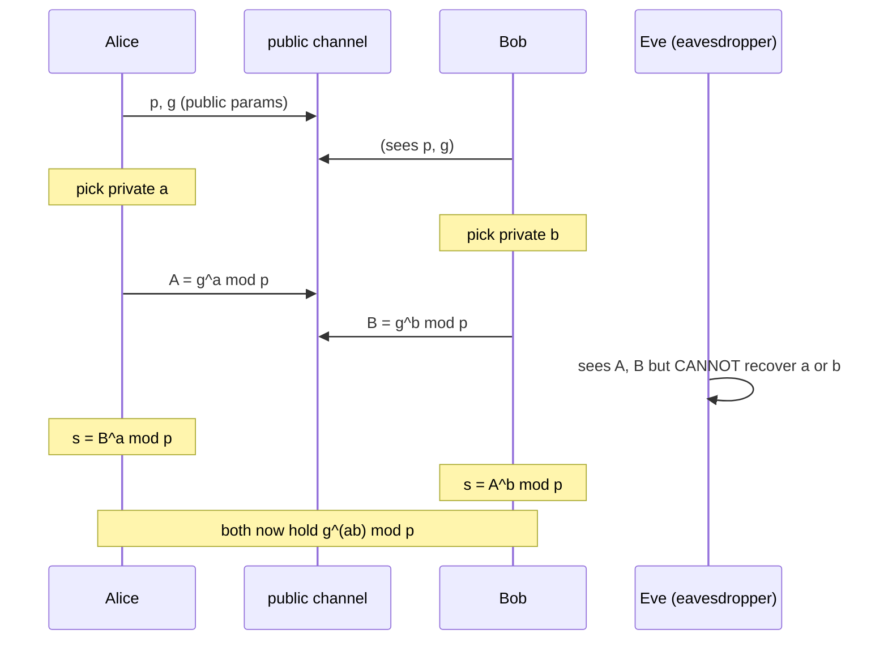
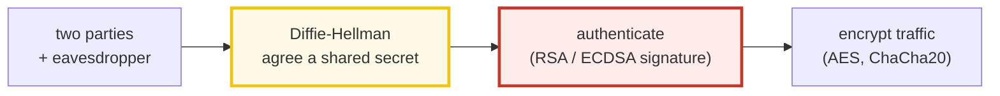

# Diffie-Hellman Key Exchange (1976) — A Visual, Worked-Example Guide

> **Companion code:** [`diffie_hellman.py`](./diffie_hellman.py). **Every
> number in this guide is printed by `uv run python diffie_hellman.py`** —
> nothing hand-computed.
>
> **Sibling guide:** [`DIGITAL_SIGNATURES.md`](./DIGITAL_SIGNATURES.md) — DH
> alone has **no authentication**, so it is vulnerable to a man-in-the-middle.
> Signatures (RSA / ECDSA) authenticate the channel DH builds. Cross-references
> are marked 🔗 throughout.
>
> **Live animation:** [`diffie_hellman.html`](./diffie_hellman.html) — step
> through the exchange between Alice, Bob, and the eavesdropper Eve.

---

## 0. TL;DR — two strangers share a secret over a public channel

> **The paint analogy (read this first):** two people who never meet want to
> share a **secret paint color**. They publicly agree on a bucket of **yellow**
> paint. Each privately adds their own secret pigment — Alice adds red, Bob
> adds blue — and each **publishes** their mixed bucket. Anyone can *see* the
> two mixed buckets, but **un-mixing paint is impossible**: you cannot recover
> "red" from "orange" without trying every pigment. The trick: Alice takes
> Bob's published bucket and adds *her* red; Bob takes Alice's published bucket
> and adds *his* blue. Both end up with yellow+red+blue = the **same muddy
> brown**. An eavesdropper, holding only yellow, orange, and green, can never
> make that brown.

Diffie-Hellman (1976) is that idea done with **numbers** instead of paint:

```
agree   : p = 23, g = 5                          (public — everyone sees these)
secrets : a = 6 (Alice),  b = 15 (Bob)            (private — never sent)
public  : A = g^a mod p = 8  ;  B = g^b mod p = 19 (broadcast)
shared  : B^a = A^b = g^(ab) mod p = 2             (both sides compute the SAME 2)
```

One plain sentence: **Alice and Bob each raise the other's public number to
their own private exponent; commutativity of exponents makes the results
identical, while the discrete-log problem stops anyone else from doing it.**

---

### Glossary (plain English — refer back any time)

| Term | Plain meaning |
|---|---|
| **prime `p`** | A large public prime. The size of the "clock" we wrap around. |
| **generator `g`** | A public base whose powers hit *every* residue mod p. With the right g, `{g^1, g^2, …, g^(p-1)}` covers all of `1..p-1`. |
| **private key `a`** | Alice's secret exponent, chosen in `1..p-1`. Never shared. |
| **public key `A`** | What Alice **sends** = `g^a mod p`. Safe to broadcast. |
| **shared secret** | The number both sides land on = `g^(a·b) mod p`. |
| **modular exp** | `g^e mod p`, done fast by square-and-multiply (Python's `pow(g, e, p)`). |
| **discrete log** | The *inverse* of modular exp: given `g` and `A = g^a mod p`, find `a`. This is the one-way property DH leans on. |
| **mod p** | "take the remainder mod p" — keeps every number `< p`. |

---

## 1. The protocol, in four steps



The whole construction (the core of `diffie_hellman.py`):

```python
def alice_public(g, a, p):       # Alice broadcasts A = g^a mod p
    return pow(g, a, p)

def bob_public(g, b, p):         # Bob broadcasts B = g^b mod p
    return pow(g, b, p)

# Alice computes the shared secret from Bob's public value + her private a:
def shared_secret_from_bob_public(B, a, p):
    return pow(B, a, p)
```

> One plain sentence: **each side raises the *other's* public value to *their
> own* private exponent.** Because `(g^b)^a = (g^a)^b = g^(a·b)`, both land on
> the identical secret — without either ever transmitting their exponent.

---

## 2. The worked example — `p = 23, g = 5`

### The public clock and why g=5 is a generator

From `diffie_hellman.py` **Section A**:

```
Public params: prime p = 23, generator g = 5

[check] is g=5 a primitive root mod 23?  True  (its powers cover all of 1..22)

  e   :   1   2   3   4   5   6   7   8   9  10  11  12  13  14  15  16  17  18  19  20  21  22
  g^e :   5   2  10   4  20   8  17  16  11   9  22  18  21  13  19   3  15   6   7  12  14   1
```

`g=5` is a **primitive root** mod 23: its powers cycle through *every* number
`1..22` before returning to 1 at step `p-1 = 22` (Fermat's little theorem). That
matters — a generator gives the eavesdropper the *largest possible* search
space, maximising security for a given `p`.

### The exchange, traced

From `diffie_hellman.py` **Section B**:

```
WHO KNOWS WHAT:
  Alice : private a=6, receives B=19 from Bob
  Bob   : private b=15, receives A=8 from Alice
  Eve   : sees p=23, g=5, A=8, B=19  (but NOT a, b, or the secret)

ALICE computes the shared secret:
  s = B^a mod p = 19^6 mod 23 = 2

BOB computes the shared secret:
  s = A^b mod p = 8^15 mod 23 = 2

DIRECT (sanity): g^(a*b) mod p = 5^(6*15) mod 23 = 2

[check] B^a == A^b == g^(ab)?  True   (Alice=2, Bob=2, direct=2)
```

> **The key pattern:** Alice never learns `b`; Bob never learns `a`. Yet both
> compute `g^(a·b) mod p = 2`, because exponentiation is **commutative**:
> `(g^b)^a = (g^a)^b`. Watch this live in [`diffie_hellman.html`](./diffie_hellman.html)
> panel ①.

### Why they match — the algebra

```
B^a = (g^b)^a = g^(b·a) = g^(a·b)        (exponents multiply)
A^b = (g^a)^b = g^(a·b)                  (same product, commutative)
```

Both sides compute the same `g^(a·b) mod p`, *without ever sending `a` or `b`.*
The shared secret `2` now feeds a cipher (e.g. as the AES key) to encrypt the
conversation that follows.

---

## 3. Security analysis — why the eavesdropper is stuck (discrete log)

Eve sees `p=23, g=5, A=8, B=19`. Her goal: recover `a` from `A = g^a mod p`.
The only known generic method is **brute force** — try every exponent. From
`diffie_hellman.py` **Section C**:

```
Brute-force trace (Eve squares-and-multiplies, checking each step):
  try x= 1: g^ 1 mod 23 =  5
  try x= 2: g^ 2 mod 23 =  2
  try x= 3: g^ 3 mod 23 = 10
  try x= 4: g^ 4 mod 23 =  4
  try x= 5: g^ 5 mod 23 = 20
  try x= 6: g^ 6 mod 23 =  8  <- MATCH, a recovered!

Eve finds a = 6 after 6 tries.
```

For `p=23` Eve wins instantly. **The whole security rests on `p` being big:**

| bits of p | group size | generic brute-force | best-known attack | feasible? |
|-----------|------------|---------------------|--------------------|-----------|
| 5 | ~2^5 | ~2^5 | ~2^3 | yes (toy) |
| 64 | ~2^64 | ~2^64 | ~2^22 | seconds |
| 256 | ~2^256 | ~2^256 | ~2^64 | no (huge) |
| 2048 | ~2^2048 | ~2^2048 | ~2^112 | no* |

> `*` for a 2048-bit prime, generic brute force is ~2^2048, but the best
> **known** attack (the number-field sieve) is ~2^112 — still infeasible today.
> Doubling `p`'s bit-length makes Eve's job **exponentially** harder.

### The math, in plain terms

```
forward (easy)   : a  ->  g^a mod p      (one modular exponentiation, ~log a mults)
inverse (hard)   : A  ->  a  such that g^a = A mod p   (discrete logarithm)
```

That asymmetry — *easy one way, brutal the other* — is the **one-way function**
Diffie & Hellman leaned on. It is the same "mixing paint" idea: mixing is
trivial, un-mixing is not.

---

## 4. The man-in-the-middle attack (DH has NO authentication)

This is DH's Achilles heel. DH guarantees **secrecy** against a *passive*
eavesdropper, but **not** against an *active* attacker who intercepts and
replaces the public values. From `diffie_hellman.py` **Section D**:

```
Mallory INTERCEPTS both, discards them, and sends her OWN values:
  -> Alice receives M1 = g^13 mod 23 = 21  (thinks it's Bob's)
  -> Bob   receives M2 = g^3 mod 23 = 10  (thinks it's Alice's)

RESULTING shared secrets (there are now TWO, not one):
  Alice   <-> Mallory : Alice = M1^a = 21^6 = 18
                       Mallory = A^ma = 8^13 = 18
  Bob     <-> Mallory : Bob   = M2^b = 10^15 = 5
                       Mallory = B^mb = 19^3 = 5

[check] Mallory matches both sides, and the two secrets differ?  True
```

Alice and Bob hold **different** secrets (`18` vs `5`) — they are not actually
talking to each other. Mallory sits in the middle, decrypting every message
from Alice (key `18`) and re-encrypting it under Bob's key (`5`), and vice
versa. Neither side notices.

```
Alice --[key 18]--> Mallory --[key 5]--> Bob
        "I trust Bob"            "I trust Alice"
```

> **The fix:** authenticate the channel **first**. In TLS, the server **signs**
> its DH public value with an RSA / ECDSA private key, so the client can prove
> the value really came from the server and not Mallory. 🔗 See
> [`DIGITAL_SIGNATURES.md`](./DIGITAL_SIGNATURES.md). **Without a signature, DH
> is blind to *who* you are keying with.**

---

## 5. Applications — where Diffie-Hellman lives in the wild

From `diffie_hellman.py` **Section E**:

| protocol | domain | role of Diffie-Hellman |
|---|---|---|
| **TLS / HTTPS** | web encryption | Key exchange (DHE/ECDHE) negotiates the session key; the server's DH public value is **signed** (RSA/ECDSA) to stop MITM. |
| **SSH** | secure shell | `diffie-hellman-group14/16` + Ed25519 host signature. |
| **Signal (X3DH)** | end-to-end messaging | Extended triple-DH: 3 DH rounds build the root key; long-term identity keys authenticate, ephemeral keys give forward secrecy. |
| **IPsec (IKE)** | VPN tunnels | IKE phases use DH to derive keys for the encrypted tunnel. |

### Forward secrecy — the headline property

If you use a **fresh** `a, b` per session (**ephemeral** DH = DHE), then a later
leak of the long-term key **cannot** decrypt old sessions — the per-session
`a, b` are gone. This is why modern TLS mandates **ECDHE** even when RSA keys
are present.

### Variants

- **DH** — integer modular arithmetic (this file).
- **ECDH** — same idea on an elliptic curve; a 256-bit key ≈ 3072-bit RSA
  security. The dominant choice today.
- **X25519** — a specific fast ECDH curve (Curve25519, Bernstein 2006).

---

## 6. Gold check

The `diffie_hellman.html` page re-runs this exact exchange in JS (same `p, g, a,
b`) and verifies the shared secret equals `2`. From `diffie_hellman.py`
**Section F**:

```
gold public params : p=23, g=5
gold secrets       : a=6 (Alice), b=15 (Bob)
gold public A      = g^a mod p = 5^6 mod 23 = 8
gold public B      = g^b mod p = 5^15 mod 23 = 19
gold shared secret = B^a mod p = 19^6 mod 23 = 2
gold shared secret = A^b mod p = 8^15 mod 23 = 2
gold shared secret = g^(ab)    = 5^90 mod 23 = 2

[check] gold B^a == A^b == g^(ab) == 2?  True
[check] gold discrete log of A needs 6 tries (toy p=23)
```

---

## 7. Where Diffie-Hellman sits in a secure connection



DH builds the **shared secret**; 🔗 signatures **authenticate** who you shared
it with (killing MITM); a symmetric cipher then encrypts the bulk traffic at
speed. Together they form TLS.

| stage | what it buys | needs |
|---|---|---|
| **Diffie-Hellman** | a shared secret over a public channel | a big prime p + a generator g |
| **Signature** 🔗 | proof of who sent the DH public value | a private/public key pair |
| **Symmetric cipher** | fast confidentiality on the traffic | the shared secret as key |

---

### References

- Diffie, W. & Hellman, M. (1976), *"New Directions in Cryptography"*, IEEE
  Trans. Inf. Theory, IT-22(6). Introduced public-key exchange + the concept of
  a one-way function underpinning it.
- Hankerson, Menezes & Vanstone (2004), *Guide to Elliptic Curve Cryptography* —
  ECDH, the modern successor with far smaller keys.
- Bernstein, D. J. (2006), *Curve25519: new Diffie-Hellman speed records* — the
  fast ECDH curve used in TLS 1.3, SSH, Signal.
- 🔗 [`DIGITAL_SIGNATURES.md`](./DIGITAL_SIGNATURES.md) — how RSA / ECDSA
  signatures fix DH's man-in-the-middle weakness.
