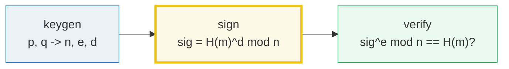
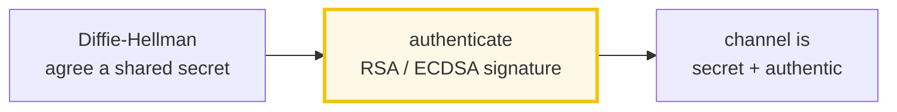

# Digital Signatures (RSA / ECDSA / HMAC) — A Visual, Worked-Example Guide

> **Companion code:** [`digital_signatures.py`](./digital_signatures.py).
> **Every number in this guide is printed by
> `uv run python digital_signatures.py`** — nothing hand-computed.
>
> **Sibling guide:** [`DIFFIE_HELLMAN.md`](./DIFFIE_HELLMAN.md) — DH builds a
> shared secret but has **no authentication**, so it is vulnerable to a
> man-in-the-middle. **Signatures are the fix.** Cross-references are marked 🔗
> throughout.
>
> **Live animation:** [`digital_signatures.html`](./digital_signatures.html) —
> sign a message, verify it, then watch a tampered message fail verification.

---

## 0. TL;DR — a wax seal you can verify but not forge

> **The wax-seal analogy (read this first):** a hand-written signature proves
> *who* wrote a document. A **digital** signature adds two things a wax seal
> can't: it proves the document has **not been changed** (integrity), and the
> signer **cannot later deny** signing it (non-repudiation). The trick is
> **asymmetry** — a *key pair* where one half seals and the other half
> verifies. Think of the private key as a wax ring (only you have it) and the
> public key as a published picture of the imprint (anyone can compare).

Three flavours, all implemented from scratch in [`digital_signatures.py`](./digital_signatures.py):

```
RSA    : sig = H(m)^d mod n          seal with private d; verify sig^e == H(m)
ECDSA  : sign on an elliptic curve    smaller keys, same security (Bitcoin, TLS)
HMAC   : tag = H((k⊕opad)||H((k⊕ipad)||m))   shared key; fast; NO non-repudiation
```

One plain sentence: **sign with the private key, verify with the public key; any
change to the message (even one bit) breaks verification.** A wax seal that
shatters if anyone so much as breathes on the document.

---

### Glossary (plain English — refer back any time)

| Term | Plain meaning |
|---|---|
| **private key `d`** | The secret exponent/point used to **sign**. Never shared. |
| **public key** | `(n, e)` for RSA, or the point `Q = d·G` for ECDSA. Anyone verifies with it; nobody can derive `d` from it. |
| **hash `H(m)`** | A fixed-size fingerprint of the message. One bit of `m` flips ~half the output bits. We sign the **hash**, not the whole message. |
| **signature** | The pair `(r, s)` [ECDSA] or single int `sig` [RSA] output alongside the message. |
| **verify** | Recompute the expected value from `m` + public key; compare to the signature. Match ⇒ authentic + intact. |
| **non-repudiation** | Only the private-key holder could have signed, so they can't later deny it. **HMAC lacks this** (both sides share the key). |
| **trapdoor** | Easy one way, hard the other. `x → x^e` is easy; `sig → d` is the discrete-log / factoring problem. |
| **modinv `x⁻¹`** | The number `y` with `x·y ≡ 1 mod n`. Computed fast via the extended Euclid (Python's `pow(x, -1, n)`). |

---

## 1. RSA signatures — the algorithm



The whole RSA construction (the core of `digital_signatures.py`):

```python
def rsa_keygen(p, q, e):
    n   = p * q                  # public modulus
    phi = (p - 1) * (q - 1)      # Euler totient
    d   = pow(e, -1, phi)        # private key = e^-1 mod phi
    return n, e, d

def rsa_sign(msg, d, n):         # sig = H(m)^d mod n
    return pow(hash_to_int(msg, n), d, n)

def rsa_verify(msg, sig, e, n):  # accept iff sig^e mod n == H(m)
    return pow(sig, e, n) == hash_to_int(msg, n)
```

> One plain sentence: **signing raises the hash to the secret exponent `d`;
> verifying raises the signature to the public exponent `e`.** Because
> `e·d ≡ 1 mod phi`, `(H^d)^e = H^(d·e) = H^1 = H` — the original hash pops
> back out. Only the holder of `d` can produce a signature whose `e`-th power
> lands on the hash.

---

## 2. The worked example — RSA `p=61, q=53`

### Key generation

From `digital_signatures.py` **Section A**:

```
Textbook primes: p=61, q=53, public exponent e=17

KEY GENERATION:
  n   = p*q        = 61*53 = 3233        (public modulus)
  phi = (p-1)(q-1) = 60*52 = 3120   (Euler totient)
  d   = e^-1 mod phi = 17^-1 mod 3120 = 2753    (private key)
  check: e*d mod phi = 17*2753 mod 3120 = 1

PUBLIC KEY  = (n, e) = (3233, 17)   -> publish this
PRIVATE KEY = (n, d) = (3233, 2753)  -> KEEP SECRET
```

> **The trapdoor:** computing `d` needs `phi`, which needs the factors `p, q`.
> Factoring `n=3233` is trivial; factoring a 2048-bit `n` is infeasible. **That
> gap is all of RSA's security.**

### Sign-then-verify — the round trip

From `digital_signatures.py` **Section B**:

```
message m = b'hello'

Step 1 - hash: H(m) = SHA-256 leftmost 12-bits mod 3233 = 719

Step 2 - SIGN (Alice, with private d):
  sig = H(m)^d mod n = 719^2753 mod 3233 = 136

Step 3 - VERIFY (Bob, with public e):
  sig^e mod n = 136^17 mod 3233 = 719
  H(m)        = 719
  match? 719 == 719 -> True

[check] rsa_verify(m, sig, e, n)?  True
```

Bob never sees `d`. He only needed the **public** `(n, e)` and the signature to
confirm Alice authored `'hello'` and it was not altered in transit.

---

## 3. Tampering detection — a modified message fails

A signature is **bound to the exact bytes signed**. Flip one character and
verification fails. From `digital_signatures.py` **Section C**:

```
Alice signs m="hello" -> sig = 136

  original m="hello"  -> H(m) = 719
  tampered m="hellp"  -> H(m) = 828
  (one bit of m flips ~half the hash bits -> totally different H(m))

Bob verifies the tampered message with the SAME signature:
  sig^e mod n = 719
  H(tampered) = 828
  match? 719 == 828 -> False

[check] verify original  ?  True
[check] verify tampered  ?  False
```

This is the **integrity** guarantee: the signature only validates against the
*original* message. An attacker who modifies a single byte cannot produce a
matching signature without the private key `d`.

---

## 4. ECDSA — elliptic-curve signatures

RSA is integer arithmetic. **ECDSA** does the same job with points on an
elliptic curve, giving the same security with **far smaller keys** (256-bit
ECDSA ≈ 3072-bit RSA). It is what Bitcoin, TLS, and Apple's Secure Enclave use.

From `digital_signatures.py` **Section D**, on a tiny textbook curve
`y² = x³ + 2x + 2 (mod 17)`:

```
Tiny curve: y^2 = x^3 + 2x + 2  (mod 17)
Generator G = (5, 1), on curve? True

The curve has 19 points (+the point at infinity O):
  (0,6), (0,11), (3,1), (3,16), (5,1), (5,16), (6,3), (6,14), (7,6),
  (7,11), (9,1), (9,16), (10,6), (10,11), (13,7), (13,10), (16,4), (16,13), O

Order of G (smallest n with n*G = O): n = 19
[check] 19*G = O (infinity)? True

private key d = 7  ->  public key Q = d*G = 7*(5, 1) = (0,6)

Sign m="curve":
  H(m) truncated to 5 bits mod 19 = 16
  k = 11, k*G = (13,10)
  r = (k*G).x mod n = 13
  s = k^-1 * (H(m) + r*d) mod n = 7 * (16+13*7) mod 19 = 8
  -> signature (r, s) = (13, 8)

Verify m="curve" with public Q=(0,6):
  w = s^-1 mod n = 12
  u1 = H(m)*w = 2, u2 = r*w = 4
  X = u1*G + u2*Q = 2*G + 4*Q = (13,10)
  r == X.x mod n ?  13 == 13  -> True

[check] ecdsa_verify(m, sig, Q)?  True
[check] ecdsa_verify(tampered 'curvE', sig, Q)?  False
```

### The math, in plain terms

```
keygen  : Q  = d · G                 (public key = private key times generator)
sign    : r  = (k·G).x mod n
          s  = k⁻¹ (H(m) + r·d) mod n
verify  : w  = s⁻¹ mod n
          X  = H(m)·w · G  +  r·w · Q
          accept iff r == X.x mod n
```

The verifier never learns `d`. Instead it reconstructs a point `X` from the
*public* `Q`, the *public* `G`, and the signature `(r, s)` — and accepts only if
`X.x mod n` equals `r`. The algebra `X = (k·G)` works out because of how `s` was
built. 🔗 The "hard problem" here is the **elliptic-curve discrete log**
(finding `d` from `Q = d·G`), believed infeasible for well-chosen curves.

> **Why ECDSA wins in practice:** a 256-bit ECDSA key matches a 3072-bit RSA key
> for security, with signatures ~64 bytes vs ~256. That is why Bitcoin, TLS, and
> Apple's Secure Enclave all use ECDSA / Ed25519.

---

## 5. HMAC — symmetric message authentication

HMAC is **not** asymmetric: both parties share the **same key**. There is no
public key, so HMAC gives authentication + integrity but **not non-repudiation**
(either party could have made the tag). From `digital_signatures.py` **Section
E**:

```
key  = b'secret-key'  (shared, secret)
msg  = b'transfer $100'

CONSTRUCTION (RFC 2104):
  block size = 64 bytes ; ipad = 0x36, opad = 0x5c
  tag = H( (k ^ opad) || H( (k ^ ipad) || m ) )

inner = H( (k^ipad) || m ) = a274defd52494161122f6b9e6007a9404a134f844404ecfaea3262ab9d8e8cf1
tag   = H( (k^opad) || inner ) = 7aae85d71f38bedd29816b44c6872dd0fb6fb82f3ec1049328b3f7cc6db36206

[check] recompute tag matches?  True
[check] tag of tampered 'transfer $900' matches?  False  (must be False)
[check] tag with wrong key matches?  False  (must be False)
```

### Why the double hash?

The nested construction defeats **length-extension attacks**. SHA-256 (like all
Merkle-Damgård hashes) lets an attacker who knows `H(k || m)` compute
`H(k || m || extension)` *without knowing k*. HMAC's inner-then-outer hashing
with the `ipad`/`opad` padding breaks that: the final output is `H(opad ||
inner)`, and the attacker cannot extend *that* because they'd need to know
`inner` (which requires `k`).

### When HMAC vs signatures

| Need | Use |
|---|---|
| Two parties share a secret; want fast auth (API tokens, TLS record, cookies) | **HMAC** |
| Only one party should be able to sign (server identity, code signing) | **RSA / ECDSA** |

---

## 6. Applications — RSA vs ECDSA vs HMAC

From `digital_signatures.py` **Section F**:

| scheme | type | used in | notes |
|---|---|---|---|
| **RSA** | asymmetric | TLS certs, code signing, PGP | `sig = H(m)^d mod n`; slow, big keys (2048+ bits) |
| **ECDSA** | asymmetric | Bitcoin, TLS, SSH, Apple enclave | point math; 256-bit key ≈ 3072-bit RSA; ~64-byte sig |
| **Ed25519** | asymmetric | SSH, Signal, apt, age | fast + deterministic ECDSA variant on Curve25519 |
| **HMAC** | symmetric | JWT, API auth, TLS record, cookies | shared key; fast; **no non-repudiation** |

### The three guarantees a signature gives

1. **Authenticity** — only the private-key holder could sign it.
2. **Integrity** — any change to `m` breaks verification.
3. **Non-repudiation** — the signer can't later deny it (only `d` could have
   produced the signature). **HMAC lacks #3.**

### Why sign the hash, not the message?

- **Size** — a signature operates on a fixed-size digest (32 bytes for
  SHA-256), not a gigabyte document.
- **Security** — SHA-256 is collision-resistant, so signing `H(m)` is as safe
  as signing `m`, for any practical message length.

---

## 7. Gold check

The `digital_signatures.html` page re-runs RSA sign/verify + ECDSA sign/verify +
HMAC in JS with these exact parameters and checks the verdicts match. From
`digital_signatures.py` **Section G**:

```
RSA GOLD:
  p=61, q=53, e=17 -> n=3233, d=2753
  m="hello"  ->  H(m) mod 3233 = 719
  sig = H(m)^d mod n = 136
  sig^e mod n = 719  (== H(m)? True)
  [check] rsa_verify?  True
  [check] tampered verify?  False  (must be False)

ECDSA GOLD:
  curve y^2=x^3+2x+2 mod 17, G=(5, 1), n=19
  d=7 -> Q=d*G=(0,6)
  m="curve", k=11 -> (r,s)=(13,8)
  [check] ecdsa_verify?  True
  [check] tampered verify?  False  (must be False)
```

---

## 8. Where signatures sit in a secure connection



🔗 [`DIFFIE_HELLMAN.md`](./DIFFIE_HELLMAN.md) builds the shared secret; **this
guide** authenticates *who* you shared it with (killing the man-in-the-middle);
a symmetric cipher then encrypts the bulk traffic. Together they form TLS.

| stage | what it buys | needs |
|---|---|---|
| **Diffie-Hellman** 🔗 | a shared secret over a public channel | a big prime `p` + generator `g` |
| **Signature** | proof of who sent the DH public value | a private/public key pair |
| **Symmetric cipher** | fast confidentiality on the traffic | the shared secret as key |

---

### References

- Diffie, W. & Hellman, M. (1976), *"New Directions in Cryptography"* — first
  described the idea of a digital signature via public-key crypto.
- Rivest, R., Shamir, A. & Adleman, L. (1978), *"A Method for Obtaining Digital
  Signatures and Public-Key Cryptosystems"*, Comm. ACM. The RSA scheme.
- Koblitz, N. (1987) / Miller, V. (1985) — elliptic-curve cryptography; the
  basis of ECDSA.
- Bellare, M., Canetti, R. & Krawczyk, H. (1996) — formal security of HMAC;
  HMAC became FIPS 198 / RFC 2104.
- 🔗 [`DIFFIE_HELLMAN.md`](./DIFFIE_HELLMAN.md) — the key exchange whose
  man-in-the-middle weakness signatures are built to fix.
