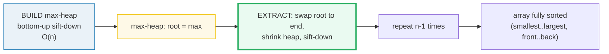
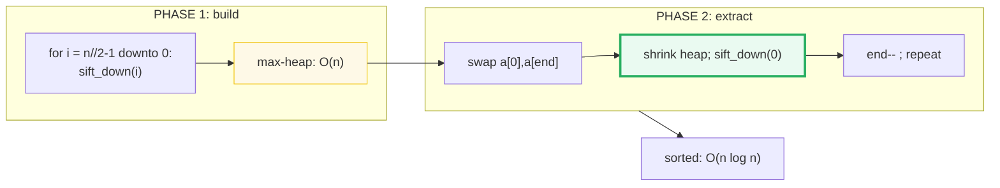
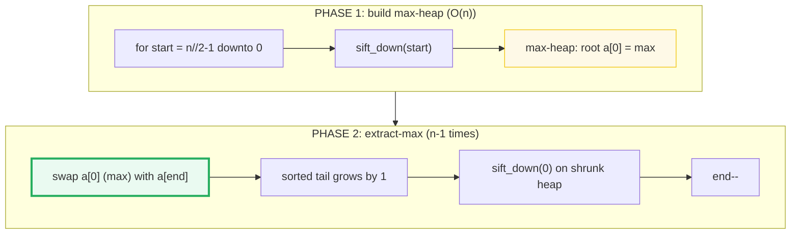
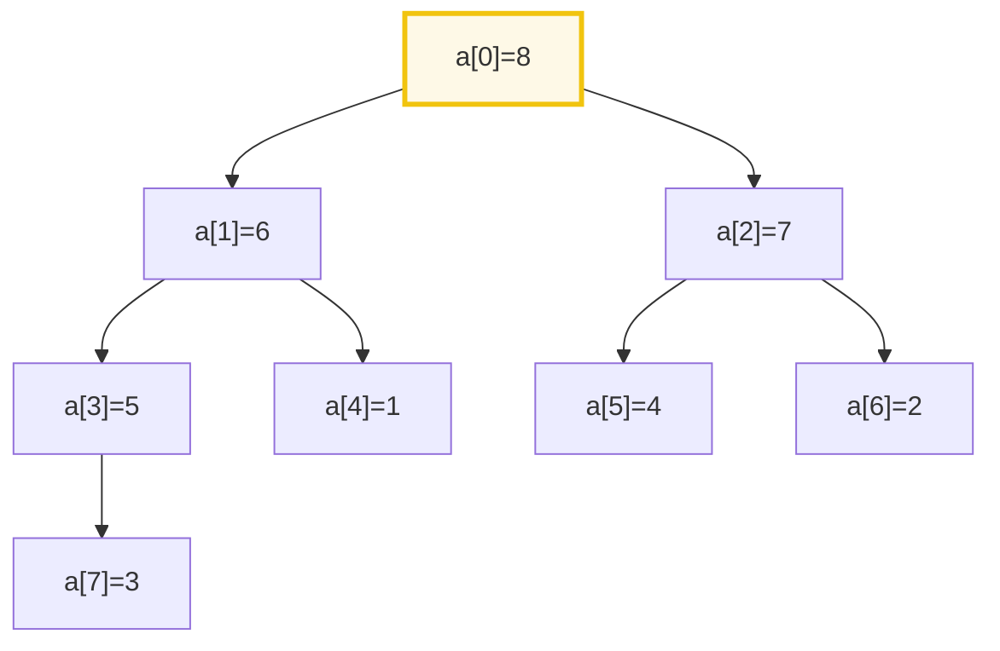
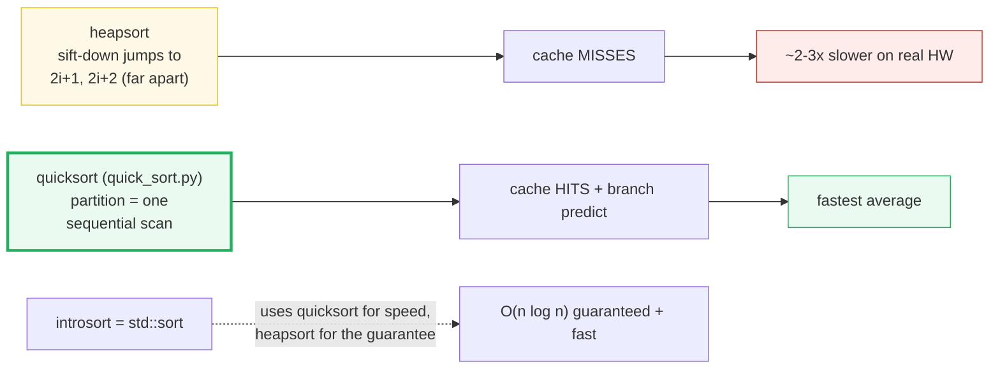
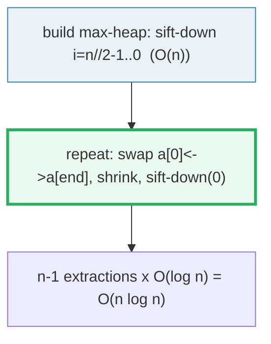

# Heapsort — A Visual, Worked-Example Guide

> **Companion code:** [`heap_sort.py`](./heap_sort.py). **Every number in this
> guide is printed by `uv run python heap_sort.py`** — change the code, re-run,
> re-paste. Nothing here is hand-computed.
>
> **Sibling guide:** [`QUICK_SORT.md`](./QUICK_SORT.md) — the faster-but-risky
> counterpart that heapsort is the safety net for (introsort).
>
> **Live animation:** [`heap_sort.html`](./heap_sort.html) — open in a browser.
>
> **Source material:** CLRS Ch. 6 (Heapsort), Williams (1964), Floyd (1964).

---

## 0. TL;DR — a sorting machine that never forgets the max

### Read this first — the array is secretly a tree

A binary **heap** is just an array pretending to be a tree. Node `i`'s children
are `2i+1` and `2i+2`. In a **max-heap** every parent is `≥` its children, so
the **biggest element is always at index 0** (the root). Heapsort exploits this
two-phase:

- **build** : one bottom-up pass turns the array into a max-heap (O(n)).
- **extract** : the root is the max — swap it to the **end**, shrink the heap by
  one, and sift the new root back down. Repeat `n−1` times. Each step deposits
  the next-largest element at the back; when the heap empties the array is sorted.

```
   max-heap property: every parent >= children  ->  max at root [0]
```



> **One-line definition:** *Heapsort* = build a max-heap in place, then
> repeatedly move the root-max to the end and re-heapify. Guaranteed
> `O(n log n)` worst case, in place, `O(1)` extra memory. Not stable.

### Glossary (every term used below)

| Term | Plain meaning |
|---|---|
| **max-heap** | array where every parent `≥` its children → maximum at root `[0]` |
| **node i** | its parent is `(i-1)//2`, children are `2i+1` (left) and `2i+2` (right) |
| **heap size (m)** | the prefix `[0..m-1]` currently the heap; suffix `[m..n-1]` is already-sorted output |
| **sift-down** | push a too-small root DOWN to its level by swapping with the larger child, repeating (a.k.a. `heapify`) |
| **build-heap** | sift-down every internal node bottom-up → O(n) (Floyd's method, 1964) |
| **complete binary tree** | every level full except maybe the last, filled left→right → packs perfectly into an array |

---

### The technical TL;DR



| | **heapsort** | **quicksort (median-of-3)** 🔗 | **mergesort** |
|---|---|---|---|
| **worst case** | **O(n log n) guaranteed** | O(n²) (pathological) | O(n log n) |
| **avg / real-world** | slowest (cache-hostile) | **fastest** (cache) | middle (stable) |
| **memory** | **O(1) in place** | O(log n) stack | O(n) extra |
| **stable?** | no | no | **yes** |
| **used for** | guarantees, priority queues, introsort fallback | general sorting (`std::sort`) | stability, external/linked-list |

> 🔗 **Why heapsort exists:** it is the **guarantee**. Quicksort
> ([`QUICK_SORT.md`](./QUICK_SORT.md)) is faster on average but can blow up to
> O(n²); heapsort **never** does, in place, with O(1) memory. That is exactly why
> `std::sort` (introsort) is *quicksort that falls back to heapsort* once the
> recursion gets too deep.

---

## 1. The algorithm — Section A output

Two phases, both in place, both built on **sift-down**:



> From `heap_sort.py` **Section A** — worked array `[3, 8, 2, 5, 1, 4, 7, 6]`:
>
> **PHASE 1 — build max-heap** (sift-down internal nodes `i = 3,2,1,0`):
>
> | sift_down(start) | before | after | swaps |
> |---|---|---|---|
> | start=3 (val 5) | `[3,8,2,5,1,4,7,6]` | `[3,8,2,6,1,4,7,5]` | 1 |
> | start=2 (val 2) | `[3,8,2,6,1,4,7,5]` | `[3,8,7,6,1,4,2,5]` | 1 |
> | start=1 (val 8) | `[3,8,7,6,1,4,2,5]` | `[3,8,7,6,1,4,2,5]` | 0 |
> | start=0 (val 3) | `[3,8,7,6,1,4,2,5]` | `[8,6,7,5,1,4,2,3]` | 3 |
>
> **max-heap = `[8,6,7,5,1,4,2,3]`** (root `a[0] = 8` = maximum).
>
> **PHASE 2 — extract max** (each row: swap root to end, sift-down):
>
> | swap max to | heap after | sorted tail |
> |---|---|---|
> | 8 → [7] | `[7,6,4,5,1,3,2]` | `8` |
> | 7 → [6] | `[6,5,4,2,1,3]` | `7,8` |
> | 6 → [5] | `[5,3,4,2,1]` | `6,7,8` |
> | 5 → [4] | `[4,3,1,2]` | `5,6,7,8` |
> | 4 → [3] | `[3,2,1]` | `4,5,6,7,8` |
> | 3 → [2] | `[2,1]` | `3,4,5,6,7,8` |
> | 2 → [1] | `[1]` | `2,3,4,5,6,7,8` |
>
> **Sorted result: `[1,2,3,4,5,6,7,8]`** ✓

**sift-down in one breath:** at a node, find its **larger** child; if that child
is bigger than the node, swap and descend into it; repeat until the node is ≥
both children or it's a leaf. Each sift-down is `O(height) = O(log n)`.

---

## 2. The heap structure — Section B output (array IS the tree)

There are **no pointers** — the complete-binary-tree shape is pure index
arithmetic:

```
parent(i) = (i-1) // 2     left(i) = 2i+1     right(i) = 2i+2
```

> From `heap_sort.py` **Section B** — the max-heap `[8,6,7,5,1,4,2,3]`:
>
> | index i | value | parent | left child | right child |
> |---|---|---|---|---|
> | 0 | 8 | — | 1 | 2 |
> | 1 | 6 | 0 | 3 | 4 |
> | 2 | 7 | 0 | 5 | 6 |
> | 3 | 5 | 1 | 7 | — |
> | 4 | 1 | 1 | — | — |
> | 5 | 4 | 2 | — | — |
> | 6 | 2 | 2 | — | — |
> | 7 | 3 | 3 | — | — |
>
> Drawn as a tree (level order = array order):
> ```
>                 [0] 8
>          [1] 6            [2] 7
>      [3] 5    [4] 1    [5] 4    [6] 2
>    [7] 3
> ```
> `[check] every parent >= children: OK`



The **max-heap property** (every parent ≥ children) forces the global maximum to
the root `[0]` — that single fact is what makes extraction work: "pop the root,
swap the last leaf up, sift it down."

---

## 3. build-heap is O(n), not O(n log n) — Section C output (CLRS Theorem 6.1)

The naive guess — "`n` sift-downs × `O(log n)`" — is wrong. A node at height
`h` needs at most `h` swaps, and **most nodes are near the bottom** (height 0 or
1) where they barely move. Summing over heights telescopes to **O(n)**:

```
Σ_{h=0}^{⌊log n⌋} ⌈n / 2^(h+1)⌉ · O(h)  ≤  O(n)     (CLRS Theorem 6.1)
```

> From `heap_sort.py` **Section C** — total heapsort comparisons / n:
>
> | n | total comparisons | comparisons / n | (n log₂n)/n |
> |---|---|---|---|
> | 8 | 25 | 3.12 | 3.00 |
> | 32 | 224 | 7.00 | 5.00 |
> | 128 | 1395 | 10.90 | 7.00 |
> | 512 | 7600 | 14.84 | 9.00 |
> | 2048 | 38653 | 18.87 | 11.00 |
> | 8192 | 186894 | 22.81 | 13.00 |
>
> (These counts include the **whole** sort; build-heap alone is even cheaper.)
> This is why the **extraction phase** (n−1 sift-downs of O(log n)) dominates
> heapsort, and why heapsort is O(n log n) overall.


---

## 4. Heapsort vs quicksort vs mergesort — Section D output

All three are O(n log n), but heapsort pays in **constant factors and cache**.
On `n = 64` random ints:

> From `heap_sort.py` **Section D**:
>
> | sort | comparisons | memory | stable | worst case | real-world |
> |---|---|---|---|---|---|
> | heapsort | 568 | **O(1)** | no | **O(n log n)** | slowest (cache) |
> | quicksort (m3) 🔗 | 306 | O(log n) | no | O(n²)* | **fastest (cache)** |
> | mergesort | ~311 | O(n) | **yes** | O(n log n) | middle (stable) |
>
> `[check] heapsort(64) comparisons 568 > quicksort 306: OK` — heapsort does
> ~2× the comparisons. `*` quicksort needs median-of-3 + introsort to guarantee
> O(n log n); heapsort needs **no such trick**.



**The cache lesson:** Big-O hides constant factors dominated by the memory
hierarchy. Quicksort's partition touches memory **sequentially** (prefetcher
happy); heapsort's sift-down jumps between `i`, `2i+1`, `2i+2`, which for large
arrays land in different cache lines → ~2–3× slower despite identical
asymptotics. **Introsort** (`std::sort`) takes quicksort's speed and adds
heapsort as the depth-bound fallback to recover the guarantee.

---

## 5. When to use heapsort (and when NOT to) — Section E output

> From `heap_sort.py` **Section E**:

**USE heapsort when:**
- you need a **worst-case O(n log n) guarantee** with **O(1) memory**
  (embedded systems, hard real-time, adversarial input);
- you need the **k largest/smallest of a stream** cheaply → a heap (partial
  heapsort / heapselect), **not** a full sort;
- it is the **fallback inside introsort** (`std::sort`) — quicksort's safety net.

**AVOID heapsort when:**
- raw speed on random data matters → **quicksort** 🔗 (better cache);
- you need **stability** → **mergesort** (heapsort is unstable);
- you mostly do lookups/insertions interleaved with sorting → a balanced BST or
  a dedicated **priority queue** is clearer.

> **Rule of thumb:** heapsort is the **guarantee**. Quicksort is the **speed**.
> Introsort = quicksort for speed + heapsort for the guarantee. The binary heap
> *structure* is separately the go-to **priority queue**.

---

## 6. The GOLD value (pinned for `heap_sort.html`)

> From `heap_sort.py` **Section G** — worked array `[3, 8, 2, 5, 1, 4, 7, 6]`:
>
> ```
> GOLD sorted result          = [1, 2, 3, 4, 5, 6, 7, 8]
> GOLD heapsort comparisons   = 27
> GOLD max-heap of WORKED     = [8, 6, 7, 5, 1, 4, 2, 3]
> GOLD first-extract sift-down steps = 5, swaps = 2
> GOLD after first extract    = [7, 6, 4, 5, 1, 3, 2, 8]
> ```
>
> [`heap_sort.html`](./heap_sort.html) recomputes the full heapsort on the
> *identical* array in JavaScript and checks both the comparison count (`27`)
> and the max-heap (`[8,6,7,5,1,4,2,3]`).

---

## 7. Pitfalls & debugging checklist

| # | Mistake | Symptom | Fix |
|---|---|---|---|
| 1 | sift-down stopping at `child > end` but extracting with wrong `end` | last element misplaced / not sorted | extraction shrinks heap to `end-1`; sift on `[0..end-1]` after swapping root with `a[end]` |
| 2 | Picking the **smaller** child to swap down | violates max-heap | swap with the **larger** child (1 extra compare) |
| 3 | build-heap top-down instead of bottom-up | O(n log n) build, wrong heap | Floyd's method: `for i in n//2-1 downto 0` |
| 4 | Forgetting the heap is 0-indexed (`2i+1` not `2i`) | parent/child off by one | `left = 2i+1, right = 2i+2, parent = (i-1)//2` |
| 5 | Assuming heapsort is stable | wrong order of equal keys | it is NOT stable — use mergesort |
| 6 | Swapping root to end but not shrinking heap | re-extracts garbage | decrement `heapSize` before sift-down |
| 7 | Using sift-**up** (insert) during sort instead of sift-down | O(n log n) build, slower | sort uses sift-down; sift-up is for priority-queue insert only |

---

## 8. Cheat sheet



- **Idea:** build a max-heap, then repeatedly pop the root-max to the end.
- **Worst case:** **O(n log n) guaranteed** — no pathological input.
- **Memory:** **O(1)** in place. **Stable:** no.
- **Index math:** `parent(i)=(i-1)//2`, `left(i)=2i+1`, `right(i)=2i+2`.
- **build-heap:** O(n) (Floyd; most nodes are leaves). **extraction:** O(n log n).
- **vs quicksort** 🔗: heapsort guaranteed but cache-hostile (~2× comparisons);
  quicksort faster on average but O(n²) worst.
- **Production:** heapsort is the **introsort fallback**; the heap *structure* is
  the go-to **priority queue**.

> 🔗 Heapsort's guarantee is exactly what fills quicksort's O(n²) hole — read
> [`QUICK_SORT.md`](./QUICK_SORT.md) §3 to see *why* that hole appears (sorted
> input + bad pivot). Together they explain why `std::sort` uses both.

---

## Sources

- **Williams, J. W. J.** *Algorithm 232: Heapsort.* Communications of the ACM,
  1964. Introduced heapsort and the heap data structure.
- **Floyd, R. W.** *Algorithm 245: Treesort 3.* CACM, 1964. The O(n) bottom-up
  build-heap (Floyd's method), used by every modern heapsort.
- **CLRS** — *Introduction to Algorithms*, Ch. 6 (Heapsort). Theorem 6.1
  (build-heap is O(n)); §6.4 (heapsort is O(n log n)); §6.5 (priority queues —
  the heap structure's other life). Cross-referenced in QUICK_SORT.md Ch. 7.
- **Musser, D. R.** *Introspective Sorting and Selection Algorithms.*, 1997.
  Introsort: quicksort that falls back to heapsort to guarantee O(n log n) —
  this is `std::sort`; see [`QUICK_SORT.md`](./QUICK_SORT.md) Sources.
