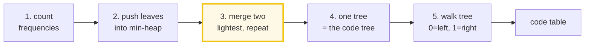
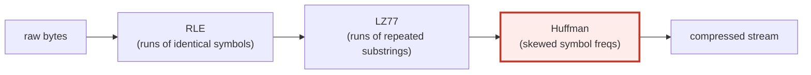

# Huffman Coding (1952) — A Visual, Worked-Example Guide

> **Companion code:** [`huffman.py`](./huffman.py). **Every number in this
> guide is printed by `uv run python huffman.py`** — nothing hand-computed.
>
> **Sibling guide:** [`RLE.md`](./RLE.md) — the *other* half of DEFLATE. RLE
> handles **repetition**; Huffman handles **frequency skew**. Cross-references
> are marked 🔗 throughout.
>
> **Live animation:** [`huffman.html`](./huffman.html) — watch the tree grow
> merge-by-merge, encode/decode bit-by-bit.

---

## 0. TL;DR — Morse code's good idea, made optimal

> **The Morse analogy (read this first):** Morse code gives **short** signals
> to common letters (`E = "."`) and **long** signals to rare letters
> (`Q = "--.-"`). Great idea — but Morse picked the lengths by hand. Huffman
> (1952) found a construction that picks them **optimally from the data**, and
> guarantees the result is **prefix-free** (no codeword is the start of
> another, so decoding is unambiguous).

Huffman coding is a **variable-length prefix code**: frequent symbols get
**short** codewords, rare symbols get **long** codewords. It is provably
optimal for symbol-by-symbol coding with a binary alphabet.

```
ABRACADABRA  →  A=0  B=110  C=100  D=101  R=111  →  01101110100010101101110  (23 bits)
                                                      (vs 88 bits in ASCII)
```

One plain sentence: **Huffman turns frequency skew into shorter codes.** The
construction repeatedly **marries the two rarest subtrees**; rare symbols sink
deep (long codes), common symbols stay shallow (short codes).

---

### Glossary (plain English — refer back any time)

| Term | Plain meaning |
|---|---|
| **symbol** | One element of the input alphabet (here, a character). |
| **frequency** | How many times the symbol appears in the input. |
| **weight** | The number at a tree node = total frequency beneath it. For a leaf, weight == frequency. |
| **leaf** | A node carrying a real symbol (no children). |
| **internal node** | A node created by merging two others (no symbol, two kids). |
| **codeword** | The string of 0/1 bits on the path from root to a leaf. |
| **prefix-free** | No codeword is a prefix of another. Makes bit-by-bit decoding unambiguous. Huffman codes are prefix-free **by construction**. |
| **min-heap** | A queue that always returns the smallest element. We push `(weight, tiebreak, node)` so ties break deterministically. |

---

## 1. The algorithm, in five steps



The whole construction (the core of `huffman.py`):

```python
def build_tree(freq):
    heap = []
    order = 0
    for sym in sorted(freq, key=lambda s: (freq[s], s)):      # stable init
        heapq.heappush(heap, (freq[sym], order, Node(sym, freq[sym])))
        order += 1
    while len(heap) > 1:
        w1, _, n1 = heapq.heappop(heap)                        # two lightest
        w2, _, n2 = heapq.heappop(heap)
        parent = Node(None, w1 + w2, n1, n2)                   # left=n1, right=n2
        heapq.heappush(heap, (parent.weight, order, parent))
        order += 1
    return heap[0][2]
```

```python
def build_codes(root):
    codes = {}
    def walk(node, prefix):
        if node.is_leaf():
            codes[node.sym] = prefix
            return
        walk(node.left,  prefix + "0")     # left edge = 0
        walk(node.right, prefix + "1")     # right edge = 1
    walk(root, "")
    return codes
```

> One plain sentence: **always merge the two lightest, then read bits off the
> edges.** The `order` counter is only there to make ties deterministic
> (FIFO) — it does not change the code *lengths*, which are forced by the
> frequencies.

---

## 2. The worked example — `"ABRACADABRA"`

### Step 1: frequency table

From `huffman.py` **Section A**:

```
input = "ABRACADABRA"   (len = 11)

Step 1 - frequency table:
    A:  5  #####
    B:  2  ##
    R:  2  ##
    C:  1  #
    D:  1  #
```

A is 5× more common than C or D. That skew is exactly what Huffman exploits.

### Step 2: the merge trace

From `huffman.py` **Section B** — the heap state at every merge. Entries are
`(weight, order, node)`; ties break by `order` (FIFO), so this is byte-identical
every run:

```
Initial heap (sorted by freq, then symbol):
  [(1, 0, 'C'), (1, 1, 'D'), (2, 2, 'B'), (2, 3, 'R'), (5, 4, 'A')]

  step 1: pop (1,C) & (1,D)  ->  merge into {C+D} weight 2
  step 2: pop (2,B) & (2,R)  ->  merge into {B+R} weight 4
  step 3: pop (2,{C+D}) & (4,{B+R})  ->  merge into {{C+D}+{B+R}} weight 6
  step 4: pop (5,A) & (6,{{C+D}+{B+R}})  ->  merge into root weight 11
```

> **The key pattern:** rare symbols (C, D) merge **first** and sink **deep**.
> The common symbol (A) waits until the very last merge, so it stays **one step
> from the root** → the **shortest** code. Watch this happen live in
> [`huffman.html`](./huffman.html) panel ①.

### Step 3: the code tree

```
*(11)
├─0:A(5)
└─1:*(6)
   ├─0:*(2)
   │  ├─0:C(1)
   │  └─1:D(1)
   └─1:*(4)
      ├─0:B(2)
      └─1:R(2)
```

`*(w)` = internal node of weight *w*. Every left edge is `0`, every right edge
is `1`. Read the path root → leaf to get the codeword.

### Step 4: the code table (prefix-free by construction)

```
Step 3 - code table (walk root->leaf; left='0', right='1'):
    A: 0       (len 1)
    B: 110     (len 3)
    C: 100     (len 3)
    D: 101     (len 3)
    R: 111     (len 3)

Step 4 - prefix-free check (no codeword is a prefix of another):
    [check] prefix-free?  True
```

A (the common symbol) gets the 1-bit code. The four rare symbols share the
3-bit codes. **No codeword starts any other** — that is what makes bit-by-bit
decoding unambiguous (see [§4](#4-encode--decode--bit-exact-round-trip)).

---

## 3. Why it is optimal — `H ≤ L < H + 1`

This is the headline result of Huffman (1952). For the code it builds, the
**expected code length** `L` satisfies:

```
H  ≤  L  <  H + 1        (H = Shannon entropy, in bits/symbol)
```

i.e. Huffman is within **one bit per symbol** of the information-theoretic
floor. From `huffman.py` **Section D**:

```
input = "ABRACADABRA"   (5 distinct symbols)

fixed 8-bit ASCII : 11 x 8         =   88 bits
fixed 3-bit (5sym): 11 x 3         =   33 bits  (ceil(log2 5) = 3)
Huffman (variable): 01101110100010101101110  =   23 bits

ratios:
  Huffman / ASCII     = 23/88 = 0.261   (73.9% smaller than ASCII)
  Huffman / fixed-3   = 23/33 = 0.697

OPTIMALITY CHECK (the headline result of Huffman 1952):
  entropy   H = -sum(p log2 p)              = 2.0404 bits/symbol
  avg len   L = sum(p * len(code))          = 2.0909 bits/symbol
  gap       L - H                           = +0.0505 bits/symbol
  guarantee H <= L < H + 1                  -> 2.0404 <= 2.0909 < 3.0404
  [check] H <= L < H+1 ?  True

  Huffman is within 0.05 bit/symbol of the entropy floor.
```

> **To beat Huffman** you must code **blocks** of symbols (arithmetic / range
> coding) or model the stream adaptively. Arithmetic coding removes the
> `H + 1` ceiling but costs more CPU.

### The math, in plain terms

```
entropy    H = -Σ pᵢ log₂ pᵢ          (theoretical floor, bits/symbol)
avg length L =  Σ pᵢ · len(codeᵢ)     (what Huffman actually achieves)
gap        L - H  < 1                  (Huffman's guarantee)
```

For `"ABRACADABRA"`: `H = 2.040`, `L = 2.091`, gap `+0.051`. Huffman leaves
almost nothing on the table.

---

## 4. Encode + decode — bit-exact round-trip

From `huffman.py` **Section C**:

```
input = "ABRACADABRA"

encode (concatenate codewords, symbol by symbol):
    A -> 0
    B -> 110
    R -> 111
    A -> 0
    C -> 100
    A -> 0
    D -> 101
    A -> 0
    B -> 110
    R -> 111
    A -> 0

bit stream = 01101110100010101101110   (23 bits)

decode(bits) = "ABRACADABRA"
[check] round-trip decode(encode(x)) == x ?  True
```

**Decode** walks the tree bit by bit: follow `0`/`1` down an edge, and the
instant you hit a **leaf**, emit that symbol and jump back to the root. Because
the code is **prefix-free**, there is exactly one way to parse the bit stream —
no separators, no lookahead, no backtracking.

```
bits : 0 1 1 0 1 1 1 0 1 0 0 0 1 0 1 0 1 1 0 1 1 1 0
decode: A · B · R · A · C · A · D · A · B · R · A
       (every leaf arrival resets to the root)
```

---

## 5. Data skew matters — flat vs skewed alphabets

Huffman only beats fixed-length coding when frequencies are **skewed**. On a
**uniform** alphabet, Huffman cannot help — every codeword is the same length,
and `L == log₂(|alphabet|) == H`. From `huffman.py` **Section E**:

| case | input | \|A\| | H | L | L−H | vs 8-bit ASCII |
|---|---|---|---|---|---|---|
| **uniform 4 symbols** | `ABCDABCDABCDABCD` | 4 | 2.000 | 2.000 | +0.000 | 0.250 (75.0% saved) |
| **skewed (A-heavy)** | `AAAAAAAABCD` | 4 | 1.278 | 1.455 | +0.177 | 0.182 (81.8% saved) |
| **very skewed** | `AAAAAAAAAAB` | 2 | 0.439 | 1.000 | +0.561 | 0.125 (87.5% saved) |
| **ABRACADABRA** | `ABRACADABRA` | 5 | 2.040 | 2.091 | +0.051 | 0.261 (73.9% saved) |

> **Read it as:** the more **skewed** the frequencies, the bigger the win.
> Uniform data → Huffman == fixed-length (no gain beyond the trivial
> `log₂(|A|)` vs 8-bit savings). That is why DEFLATE runs **LZ77 first**: LZ77
> turns **repetition into symbol skew**, which Huffman can then exploit. 🔗 See
> [`RLE.md`](./RLE.md) §8 for where each layer sits.

---

## 6. When to use Huffman (and the alternatives)

Huffman is the workhorse of the "second stage" in almost every lossless codec.
It is fast, optimal for single-symbol coding, and cheap to ship alongside the
data. From `huffman.py` **Section F**:

| codec | used in | role of Huffman |
|---|---|---|
| **DEFLATE** | gzip (.gz), zlib, PNG | LZ77 (repetition) + Huffman (skew). The default stack. |
| **JPEG** | lossy image | RLE-of-zeros stage, then Huffman on the `(run,len)` symbols. |
| **MP3 / AAC** | lossy audio | Huffman the quantized spectral coefficients. |
| **BZIP2** | block-sorting compressor | final stage after BWT + MTF. |

### Alternatives (when Huffman is not enough)

- **Arithmetic / range coding** — codes **blocks** of symbols, beats the
  `H + 1` floor. Used in JPEG2000, modern video codecs. Slower.
- **Asymmetric Numeral Systems (rANS)** — arithmetic-coding compression at
  Huffman-like speed. Used in **zstd**, Facebook's lizard.
- **Adaptive Huffman** — updates the tree as it reads the stream. One pass, no
  separate code table; used in some modem specs.

> **Rule of thumb:** reach for Huffman when you want **optimal single-symbol
> coding at high speed**. Reach for arithmetic/rANS when you can afford more
> CPU to squeeze the last few percent.

---

## 7. Gold check

The `huffman.html` page rebuilds the tree for `"ABRACADABRA"` in JS with the
**same FIFO tiebreak** as `huffman.py`, and verifies the code table, bit
stream, entropy `H`, and average length `L` all match. From `huffman.py`
**Section G**:

```
gold input = "ABRACADABRA"

gold code table:
    A: 0
    B: 110
    C: 100
    D: 101
    R: 111

gold bit stream = 01101110100010101101110   (23 bits)
gold decode(bits) = "ABRACADABRA"

[check] gold round-trip ?  True
[check] gold entropy H = 2.0404, avg len L = 2.0909, gap = 0.0505
```

---

## 8. Where Huffman sits in the compression stack



Huffman is the **last, frequency-aware** layer. It cannot see *runs* or
*repeats* — only how often each symbol appears. So it is always paired with a
layer that creates skew: RLE 🔗 (adjacent repeats) or LZ77 (any repeats). The
combination is DEFLATE.

| layer | redundancy it catches | needs |
|---|---|---|
| **RLE** 🔗 | identical adjacent symbols | avg run > 2 |
| **LZ77** 🔗 | repeated substrings (nearby or far) | a sliding window |
| **Huffman** | skewed symbol frequencies | a frequency table |

---

### References

- Huffman, D. A. (1952), *"A Method for the Construction of Minimum-Redundancy
  Codes"*, Proc. IRE. The original paper — beats Fano-Shannon coding, which was
  not always optimal.
- Deutsch, P. (1996), *DEFLATE Compressed Data Format*, RFC 1951 — LZ77 +
  Huffman (gzip, zlib, PNG).
- Cover, T. & Thomas, J. (2006), *Elements of Information Theory* — the
  `H ≤ L < H + 1` optimality proof.
- 🔗 [`RLE.md`](./RLE.md) — the simpler, repetition-only sibling.
