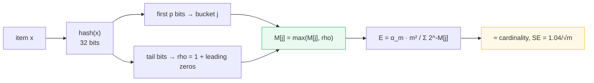
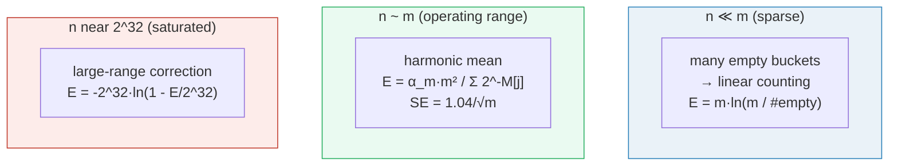

# HyperLogLog (HLL) — A Visual, Worked-Example Guide

> **Companion code:** [`hyperloglog.py`](./hyperloglog.py). **Every number in
> this guide is printed by `uv run python hyperloglog.py`** — nothing
> hand-computed.
>
> **Live animation:** [`hyperloglog.html`](./hyperloglog.html) — step the stream
> and watch each item's hash split into bucket bits + a tail, see the leading-1
> (`rho`) widen a register, and watch the error collapse as `m` grows. The tiny
> example is recomputed in JS from the *identical* pinned hash as the `.py`.
>
> **Sibling guide:** [`COUNT_MIN_SKETCH.md`](./COUNT_MIN_SKETCH.md) — the other
> half of "probabilistic counting": HLL counts *how many distinct*, CMS counts
> *how often*. Cross-references marked 🔗 throughout.

---

## 0. TL;DR — how many distinct, from leading zeros alone

> **The analogy (read this first):** You need to know how many *distinct* users
> visited today. Keeping the exact set of ids costs one entry per user — a
> billion users, a billion ids. HyperLogLog's idea: **hash every item to a random
> bit-string and look at the position of the leftmost `1`** (`rho`). A hash that
> starts `0001…` is rare (about 1 in 16); one that starts `00001…` is rarer still
> (1 in 32). So the *widest* `rho` you ever observe is a noisy estimate of
> `log2(cardinality)`: it takes roughly `2^k` draws to meet one whose hash begins
> with `k` zeros. Average that signal over many buckets and the noise collapses.

HyperLogLog (Flajolet et al., 2007) routes each item to one of `m = 2^p` buckets
by the first `p` hash bits, keeps the **max `rho`** per bucket, and combines the
`m` registers with a **harmonic-mean estimator**. The standard error is
**`1.04 / √m`** — a function only of your memory budget, not of the cardinality.



> **One-line definition:** *HyperLogLog* hashes each item, uses the first `p`
> bits to pick one of `m = 2^p` registers, updates that register with `rho` (the
> position of the leftmost `1` in the remaining bits, kept as a running max), and
> estimates cardinality as `α_m · m² / Σ_j 2^{−M[j]}` with small/large-range
> corrections, standard error `1.04/√m`.

### Glossary (plain English — refer back any time)

| Term | Plain meaning |
|---|---|
| **cardinality** | the number of DISTINCT items (`n`) — what HLL estimates. |
| **hash** | a uniform 32-bit pseudo-random value per item (here a fixed integer-mix finalizer, reproducible across Python/JS). |
| **rho (ρ)** | `1 +` (number of leading 0-bits in the hash tail) — the "wideness" of a hash. The key signal. |
| **p** | precision = bits used to pick the bucket. `m = 2^p`. |
| **m** | number of buckets/registers = `2^p`. The memory budget. |
| **M[j]** | the register for bucket `j` = the **max** `rho` seen there. |
| **α_m** | a bias-correction constant depending only on `m`. |
| **estimator** | `E = α_m · m² / Σ_j 2^{−M[j]}` (harmonic mean), with small/large-range corrections. |

---

## 1. The algorithm — bucket by `p` bits, keep max `rho`, harmonic mean

```
bucket(x) : first p bits of hash(x)          -> j in [0, m)
tail(x)   : remaining (32 - p) bits
rho(x)    : 1 + (number of leading zeros in tail(x))
M[j]      : max over items in bucket j of rho(x)
estimate  : E = alpha_m * m^2 / sum_j 2^{-M[j]}
            (+ small-range linear counting when buckets are empty)
```

> **Why `rho` tracks cardinality.** Under a uniform hash, a `rho` of `k` happens
> with probability `2^{−k}`. So to see even one item whose tail begins with `k`
> zeros, you need about `2^k` distinct items. The **maximum** `rho` over the
> stream is therefore an estimate of `log2(n)` — noisy from a single hash, which
> is why HLL splits into `m` buckets and **stochastically averages**.

### Tiny worked example — `p=4` (`m=16`), 30 adds of 20 distinct ids

From `hyperloglog.py` **Section A**, `p=4` → `m=16` buckets, `w=28` rho bits,
`α_m = 0.673`. For the first few items, the 32-bit hash splits into
**bucket bits | tail bits**, and `rho` = 1 + leading zeros of the tail:

| id | hash (bucket \| tail) | bucket | rho | M[bucket] |
|---|---|---|---|---|
| 1 | `1001` \| `0110101000001111100101101011` | 9 | 2 | **2** (new max) |
| 2 | `1011` \| `0100010000100001101110111011` | 11 | 2 | **2** (new max) |
| 1 | (duplicate) | 9 | 2 | 2 (unchanged) |
| 7 | `0010` \| `0011000101101010001100101001` | 2 | **3** | **3** (new max) |
| 8 | `1110` \| `0100001110110110100110000001` | 14 | 2 | **2** (new max) |

Item **7** has `rho = 3` — its tail starts with `001…` (two leading zeros). That
widens bucket 2's register to 3. The final registers (the whole data structure):

| | 0 | 1 | 2 | 3 | 4 | 5 | 6 | 7 | 8 | 9 | 10 | 11 | 12 | 13 | 14 | 15 |
|---|---|---|---|---|---|---|---|---|---|---|---|---|---|---|---|---|
| **M[j]** | 0 | 0 | 3 | 3 | 0 | 1 | 0 | 2 | 1 | 3 | 2 | 2 | 0 | 0 | 2 | 1 |

6 of 16 buckets are empty. Folding them with the estimator:

```
sum(2^-M[j]) = 8.875
raw E = 0.673 * 16^2 / 8.875 = 19.41
small-range (E <= 2.5m, 6 empty): E = 16*ln(16/6) = 15.69
-> estimate = 15.69   (true 20, rel error -21.5%)
```

**Two things to notice:**
- **Duplicates don't matter.** The stream is 30 adds of only 20 distinct ids.
  Re-adding an id produces the *same* hash, hence the *same* `rho`, so it can
  never raise a register. HLL is **duplicate-invariant** by construction.
- **`m=16` is tiny on purpose.** Its standard error is `1.04/√16 = 26%`, so a
  21% miss is ~1 SE — expected. Real deployments use `m=16384` (0.81% error);
  §2 shows the error collapsing as `m` grows.

> 🔗 CMS ([`COUNT_MIN_SKETCH.md`](./COUNT_MIN_SKETCH.md)) is also a hash sketch,
> but it answers "how *often*?" (frequencies) where HLL answers "how *many
> distinct*?" (cardinality). Same building block (hash into buckets), opposite
> question.

---

## 2. The error — standard error = `1.04/√m`, verified

HLL's relative error is set **only** by `m` (the memory budget), not by the
cardinality `n`. Theory (Flajolet 2007): standard error ≈ `1.04/√m`.

From `hyperloglog.py` **Section B**:

| p | m = 2^p | theory SE = 1.04/√m | memory (bytes) |
|---|---|---|---|
| 4 | 16 | 26.000% | 16 |
| 6 | 64 | 13.000% | 64 |
| 8 | 256 | 6.500% | 256 |
| 10 | 1,024 | 3.250% | 1,024 |
| 12 | 4,096 | 1.625% | 4,096 |
| **14** | **16,384** | **0.812%** | **16,384** |

**Redis's default `p=14`** → 0.81% error for ~16 KiB. **SE halves for every 4×
more memory** (each `+2` to `p` quadruples `m`). The accuracy graph in the `.html`
makes this concrete: the *same* 20-distinct stream drops from −21.5% error at
`m=16` to ≈0.1% at `m=16384`.

### Empirical check

On streams of `n` distinct ids (Section B), `|rel error|` stays within ~1–2
theory-SE for large `n`, e.g. `m=16384, n=100,000` → estimate `100,203`
(`+0.20%`, ~0.25 SE). The estimator is slightly biased **low** for very small
`n`; the **small-range linear-counting** correction fixes the `n ≪ m` regime (it
fires whenever the raw estimate is `≤ 2.5m` and some buckets are still empty).



---

## 3. Memory — HLL is `O(m)`, independent of cardinality

Exact count-distinct must store every distinct id seen (a set). HLL stores `m`
registers (one byte each for a 32-bit hash) regardless of how many distinct items
appear.

> `bytes_HLL = m · register_width` (1 byte/register) &nbsp;vs&nbsp;
> `bytes_exact = n · id_width` (8 bytes per 64-bit id).

From `hyperloglog.py` **Section C**, `p=14` (Redis default) → `m=16,384` =
**16,384 bytes (~16 KiB)**, standard error **0.81%**:

| scenario (true distinct `n`) | exact bytes | HLL bytes | HLL win |
|---|---|---|---|
| 10K distinct | 80,000 | 16,384 | 5× |
| 1M distinct | 8,000,000 | 16,384 | 488× |
| 1B distinct (ad users) | 8,000,000,000 | 16,384 | 488,281× |
| 100B distinct (web scale) | 800,000,000,000 | 16,384 | 48,828,125× |

Read it: exact is linear in `n`. HLL is a **constant** ~16 KiB whether `n` is 10K
or 100B. For 100B distinct ids, exact needs ~742 GB; HLL needs 16 KiB and loses
only ~0.8% accuracy. That is why every modern analytics engine ships HLL for
count-distinct.

---

## 4. Applications — uniques, distributed merge

HLL gives you "how many unique users" in `O(m)` memory, streaming, with **no set
of ids ever stored**. The building blocks (`hyperloglog.py` Section D):

- **DAU / MAU** (daily/monthly active users), unique-visitor counts in analytics
  dashboards, distinct-query-count in databases (`COUNT(DISTINCT)`). On 1M visits
  from 250,000 distinct ids, a `p=14` HLL estimates **249,369** (true 250,000,
  −0.25%).
- **Distributed count-distinct.** HLL is **mergeable**: two sketches with the
  same `p` combine by **register-wise MAX** to give the sketch of the union. Each
  shard keeps ~16 KiB; the coordinator takes the register-wise max and the union
  cardinality falls out — **no shuffle of raw ids**. Section D verifies
  `merge(shard_a, shard_b)` equals the single-pass sketch register-for-register.

---

## 5. Where it lives

- **Redis `PFCOUNT` / `PFMERGE`** — the canonical in-process HLL; `PFMERGE` is
  the distributed-merge primitive from §4.
- **BigQuery `APPROX_COUNT_DISTINCT`**, **Presto/Trino `approx_distinct`**,
  **Druid `HLL` aggregator** — approximate count-distinct at query time, trading
  <1% error for the ability to aggregate over petabytes without materialising id
  sets.
- **ClickHouse**, **Postgres `HLL` extension**, **Apache DataSketches** —
  production HLL (often the `HLL++` variant, which adds sparse-register and
  bias-correction refinements for very large cardinalities).

> 🔗 The CMS/HLL pair covers the two questions every data pipeline asks:
> *frequencies* ([`COUNT_MIN_SKETCH.md`](./COUNT_MIN_SKETCH.md)) and
> *cardinality* (this guide). Both are sub-linear, both are mergeable, both trade
> a tiny bounded error for orders-of-magnitude less memory.

---

## Sources

- Flajolet, Fusy, Gandouet, Meunier, *"HyperLogLog: the analysis of a near-optimal
  cardinality estimation algorithm"* (AOFA '07) — the paper; the estimator,
  `α_m`, and the small/large-range corrections all follow it exactly.
- Heule, Nunkesser, Hall, *"HyperLogLog in Practice: Algorithmic Engineering of a
  State-of-the-Art Cardinality Estimation Algorithm"* (WSDM 2013) — the Google
  `HLL++` refinements (sparse registers, bias corrections) behind BigQuery.
- Wikipedia, *"HyperLogLog"* — the `α_m` constants and the `1.04/√m` standard
  error.
