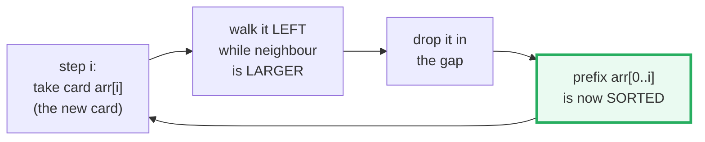

# Insertion Sort — A Visual, Worked-Example Guide

> **Companion code:** [`insertion_sort.py`](./insertion_sort.py). **Every number
> in this guide is printed by `uv run python insertion_sort.py`** — change the
> code, re-run, re-paste. Nothing here is hand-computed.
>
> **Sibling guide:** [`BUBBLE_SORT.md`](./BUBBLE_SORT.md) — same input,
> head-to-head comparison in §5.
>
> **Live animation:** [`insertion_sort.html`](./insertion_sort.html) — open in a
> browser, play/step through every comparison and swap.
>
> **Source material:** CLRS (3rd ed.) §2.1; Knuth *TAOCP* Vol 3 §5.2.1;
> Peters, *Timsort* (2002).

---

## 0. TL;DR — sorting a hand of cards

Think of sorting a hand of playing cards. You hold them in your left hand in
random order, take them **one at a time** with your right, and slide each new
card into its correct spot among the cards already placed — shifting the larger
ones one slot right to make room. That is the whole algorithm.



After step `i`, the prefix `arr[0..i]` is **sorted** (and contains exactly the
original first `i+1` cards, reordered); the suffix `arr[i+1..]` is untouched.

> **One-line definition:** *Insertion sort* builds a sorted prefix left to
> right; at step `i` it inserts `arr[i]` into the sorted `arr[0..i−1]` by
> shifting larger elements one slot right.

### Glossary

| Term | Plain meaning |
|---|---|
| **outer step `i`** | "take the next card" `arr[i]` into the sorted prefix |
| **inner walk** | slide that card left past larger neighbours (via swaps) |
| **compare** | checking `arr[j−1] > arr[j]`; **stops** as soon as it is false |
| **swap / shift** | exchanging the card with its left neighbour; fixes 1 inversion |
| **inversion** | a pair `(i<j)` with `arr[i] > arr[j]`; sorted array has 0 |
| **run** | a short already-ordered slice; Timsort finds these and feeds small ones to insertion sort |
| **stable** | equal keys keep their relative order; insertion sort **is** stable (strict `>`) |

### The worked example

```python
INPUT = [64, 34, 25, 12, 22, 11, 90]      # n = 7, 14 inversions
insertion_sort(INPUT)
# => [11, 12, 22, 25, 34, 64, 90]
#    16 comparisons, 14 swaps
```

---

## 1. The algorithm (two equivalent forms)

The reference impl in [`insertion_sort.py`](./insertion_sort.py) uses the
**swap-based** form so every step is an animation frame identical in shape to
the bubble-sort trace:

```python
def insertion_sort(arr):
    a = list(arr)
    n = len(a)
    for i in range(1, n):              # take card arr[i]
        j = i
        while j > 0 and a[j - 1] > a[j]:   # walk left while neighbour is larger
            a[j], a[j - 1] = a[j - 1], a[j]
            j -= 1
    return a
```

The **shift-based** form in CLRS (§2.1) is mathematically identical:

```python
# pull the card out, shift larger elements right, drop it in the gap
key = a[i];  j = i - 1
while j >= 0 and a[j] > key:
    a[j + 1] = a[j]       # shift right (== one "move")
    j -= 1
a[j + 1] = key
```

> **Equivalence:** both forms do the **same number of comparisons** and the
> **same number of element moves** (one swap == one shift here, since the card
> being inserted is one of the two swapped elements). Both remove exactly one
> **inversion** per swap, so `swaps == inversions` in both.

The `while j > 0 and a[j-1] > a[j]` condition **short-circuits**: the moment the
card meets a smaller-or-equal neighbour, the walk stops. That short-circuit is
the entire reason best case is `O(n)` and comparisons beat bubble sort.

---

## 2. Step-by-step on `[64, 34, 25, 12, 22, 11, 90]`

Reproduced from `uv run python insertion_sort.py` (Section A). `<->` = swapped,
`.` = stopped (left neighbour smaller/equal).

```
--- STEP i=1 ---  take card 34, walk left into prefix [64]
  64 vs 34  <->  -> [ 34, 64, 25, 12, 22, 11, 90]      # 1 cmp, 1 swap
--- STEP i=2 ---  take card 25, walk left into [34,64]
  64 vs 25  <->  -> [ 34, 25, 64, 12, 22, 11, 90]
  34 vs 25  <->  -> [ 25, 34, 64, 12, 22, 11, 90]      # 2 cmp, 2 swap
--- STEP i=3 ---  take card 12 -> front                 # 3 cmp, 3 swap -> [12,25,34,64,...]
--- STEP i=4 ---  take card 22
  64 vs 22  <->; 34 vs 22  <->; 25 vs 22  <->;
  12 vs 22   .   -> [ 12, 22, 25, 34, 64, 11, 90]      # 4 cmp, 3 swap (stops at 12)
--- STEP i=5 ---  take card 11 -> front                 # 5 cmp, 5 swap -> [...,11,12,22,25,34,64,90]
--- STEP i=6 ---  take card 90
  64 vs 90   .   -> [ 11, 12, 22, 25, 34, 64, 90]      # 1 cmp, 0 swap (already largest)

RESULT: [11, 12, 22, 25, 34, 64, 90]
TOTALS: 16 comparisons, 14 swaps.
```

> 🔗 Each comparison is an animation frame in
> [`insertion_sort.html`](./insertion_sort.html) — watch each card walk left
> until it meets a smaller neighbour.

---

## 3. Counting: comparisons, swaps, and the inversions identity

```
Input [64, 34, 25, 12, 22, 11, 90]   (n=7)
  comparisons performed : 16
  swaps performed       : 14
  inversions in input   : 14
```

| Invariant | Why |
|---|---|
| **`swaps == inversions`** (`14 == 14`) | each swap removes exactly one inversion; both forms walk a card left past exactly the elements larger than it. |
| **`comparisons ≤ n(n−1)/2`** (`16 ≤ 21`) | there are at most `n(n−1)/2 = 21` pairs; the inner walk stops early so we usually do fewer. |

> **Why comparisons (16) can exceed swaps (14):** every swap is preceded by one
> "yes, keep walking" comparison, **plus** there is one extra **"stop"**
> comparison per card that does *not* lead to a swap (when the card finds a
> smaller neighbour). So `comparisons = swaps + (stops)`. This `+stops` overhead
> is small, which is exactly why insertion sort beats bubble sort — bubble sort
> has no short-circuit and pays the full `n(n−1)/2`.

---

## 4. Best / average / worst (concrete on n = 7)

| case | input | comparisons | swaps |
|---|---|---|---|
| **BEST** | `[1,2,3,4,5,6,7]` | **6** = `n−1` | **0** |
| **our input** | `[64,34,25,12,22,11,90]` | 16 | 14 |
| **WORST** | `[7,6,5,4,3,2,1]` | 21 = `n(n−1)/2` | 21 = `n(n−1)/2` |

| | complexity |
|---|---|
| **comparisons** | best `O(n)` · average `~n²/4` · worst `n(n−1)/2` |
| **swaps** | best `0` · average `~n²/4` · worst `n(n−1)/2` (= inversions) |
| **space** | `O(1)`, in place |
| **adaptive?** | **yes** (the inner walk short-circuits) |
| **stable?** | **yes** |

Best case `O(n)`: on already-sorted input every card needs **1** comparison and
**0** moves. Insertion sort is adaptive — nearly-sorted input runs in
near-linear time. **This is the property Timsort exploits (§5).**

---

## 5. When to use insertion sort (Timsort, vs bubble sort)

Same input, two O(n²) sorts — insertion sort dominates on comparisons:

| algorithm | comparisons | swaps |
|---|---|---|
| **insertion sort** | **16** | 14 |
| bubble sort | 21 | 14 |

Both do **14 swaps** (14 inversions). Insertion sort wins on comparisons
because its inner loop short-circuits; it never does *more* comparisons than
bubble sort and usually does fewer.

**Use insertion sort when:**
- `n` is **small** (roughly `≤ 64`). Below that its tiny constant factor and
  cache-friendly sequential access beat any `O(n log n)` sort.
- the input is **nearly sorted** — adaptivity gives near-`O(n)`.
- you need **stability** in `O(1)` space.
- you are implementing a **hybrid** sort's small-case path.

### Where it hides in real systems — **Timsort**

`sorted()` / `list.sort()` (Python), `Arrays.sort` on objects (Java),
`Array.sort` (V8), and Rust's stable sort all run **Timsort** (Peters, 2002) — a
merge-sort + insertion-sort hybrid. CPython's Timsort scans for **runs** of
already-ordered elements; runs shorter than **64** are grown to length 64 using
**binary insertion sort**, then merged. So **every Python `sorted()` call runs
insertion sort internally** on small slices.

> Insertion sort is not legacy — it is the workhorse of the world's most-used
> stable sorts. 🔗 Compare with [`BUBBLE_SORT.md`](./BUBBLE_SORT.md).

---

## Sources

- Cormen, Leiserson, Rivest, Stein. *Introduction to Algorithms* (3rd ed.),
  §2.1 (insertion sort) — the shift-based form and the loop-invariant proof.
- Knuth, D. E. *TAOCP* Vol 3 §5.2.1 (insertion sorting).
- Peters, T. [*Timsort*](https://svn.python.org/projects/python/trunk/Objects/listsort.txt)
  (2002) — the run-finding + binary-insertion + merge hybrid used by CPython.
- 🔗 [`bubble_sort.py`](./bubble_sort.py) / [`BUBBLE_SORT.md`](./BUBBLE_SORT.md)
  — the sibling O(n²) sort this guide compares against.
