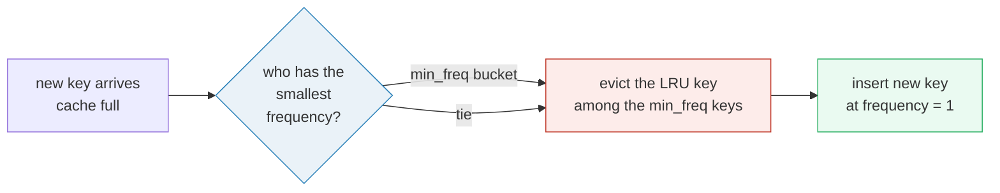
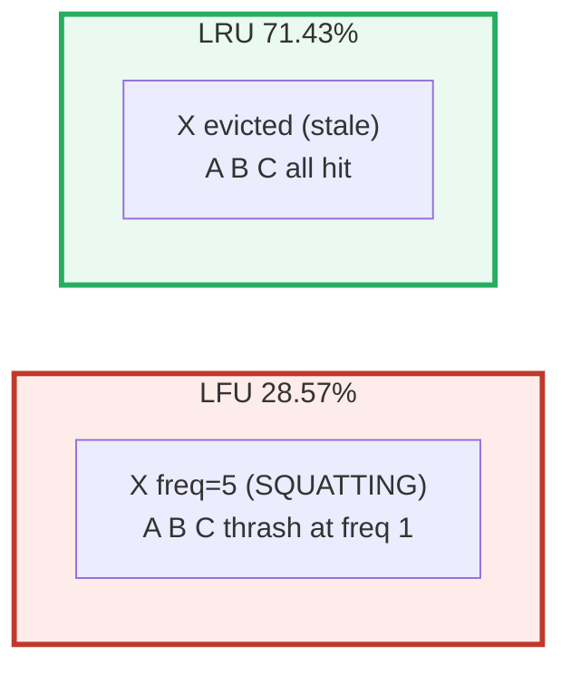

# Least Frequently Used (LFU) — A Visual, Worked-Example Guide

> **Companion code:** [`lfu_cache.py`](./lfu_cache.py). **Every number in this
> guide is printed by `uv run python lfu_cache.py`** — change the code, re-run,
> re-paste. Nothing here is hand-computed.
>
> **Sibling guides:** [`ARC_CACHE.md`](./ARC_CACHE.md) — the *self-tuning* fix
> for the pollution bug documented here; [`WRITE_POLICIES.md`](./WRITE_POLICIES.md)
> — what caches do on the *write* side. Cross-references marked 🔗 throughout.
>
> **Live animation:** [`lfu_cache.html`](./lfu_cache.html) — step an access
> sequence through the frequency buckets and watch LFU lose to LRU.

---

## 0. TL;DR — the library with the sticky bestsellers

> **The analogy (read this first):** A small library has room for only `c`
> books on the display shelf. When a `c+1`-th book arrives, one has to go back
> to the stacks. The librarian asks one question: *"which of these was checked
> out the **fewest** times?"* and shelves that one. That is LFU.

It sounds ideal — keep the popular books, retire the one-hit wonders. And for a
**stationary** collection (the popular set never changes) it *is* better than
LRU. The trap is the word **stationary**.



> **One-line definition:** *Least Frequently Used* evicts the resident key with
> the smallest access count, breaking ties by recency (the LRU key among those
> at the minimum frequency). New keys start at count 1; each hit increments it.

### Glossary (plain English — refer back any time)

| Term | Plain meaning |
|---|---|
| **frequency** | A per-key counter of accesses *while resident*. New inserts start at 1; each hit `+1`. |
| **min_freq** | The smallest frequency among resident keys. The victim is the **LRU** key at exactly this frequency. |
| **bucket** | The set of keys sharing one frequency value. One LRU-ordered list per frequency; eviction pops the front of the `min_freq` bucket. This is what makes LFU **O(1)**, not O(log n). |
| **pollution** | A high-frequency key that is *no longer* in the active working set but refuses to leave because its count dwarfs every newcomer. **The** LFU bug. |
| **tie-break** | When several keys share the min frequency, evict the one that reached it earliest (LRU within the bucket). |

---

## 1. The O(1) mechanism — keys hop between frequency buckets

The naive picture of LFU is "scan for the smallest counter" — that's O(n). The
trick that makes it O(1) is to **group keys by frequency into buckets** and
chase a single `min_freq` pointer.

> From `lfu_cache.py` **Section A** — capacity 2, sequence `A B A C A C`:
>
> | # | op | result | evict | state after | freq buckets |
> |---|---|---|---|---|---|
> | 1 | A | MISS | – | {A:1} | 1:['A'] |
> | 2 | B | MISS | – | {A:1,B:1} | 1:['A','B'] |
> | 3 | A | HIT | – | {A:2,B:1} | 1:['B'] 2:['A'] |
> | 4 | C | MISS | **B** | {A:2,C:1} | 1:['C'] 2:['A'] |
> | 5 | A | HIT | – | {A:3,C:1} | 1:['C'] 3:['A'] |
> | 6 | C | HIT | – | {A:3,C:2} | 2:['C'] 3:['A'] |

Read each row as: on a hit, the key **hops from bucket `f` to bucket `f+1`**;
when a bucket empties, `min_freq` chases the next non-empty bucket upward. Step
4 is the eviction: `min_freq` is 1, the bucket `1:['A','B']` is ordered LRU, so
its front (`B`) is evicted and `C` enters at bucket 1.

The whole data structure is three dicts:

```python
key_to_val   : key -> value
key_to_freq  : key -> its current frequency
freq_to_keys : freq -> OrderedDict(key -> None)   # LRU order; front = victim
min_freq     : smallest frequency with a non-empty bucket
```

**Two invariants make eviction O(1):**

1. A fresh insert *always* lands at frequency 1, so `min_freq` resets to 1 on
   every miss. The victim is never more than one dict lookup away.
2. `min_freq` only ever **increases**, and only by `+1`, because the only way
   the `min_freq` bucket can empty is a touch — which moves that key to
   `min_freq+1`.

---

## 2. Cache pollution — the failure mode (the headline result)

Here is where LFU falls apart. **X is read 5× in a burst, then never again.**
After that the live working set is `{A,B,C}`, cycled forever, and the cache
holds exactly 3 — *if X would leave*.

```
sequence: X X X X X A B C A B C A B C      capacity = 3
```

LFU stamps X with frequency 5. From then on X is **untouchable**: every new key
starts at frequency 1 < 5, so A, B, C can only fight over the 2 slots X leaves
them. They **thrash at frequency 1 forever**.

> From `lfu_cache.py` **Section B** (LFU run):
>
> | # | op | result | evict | freq buckets |
> |---|---|---|---|---|
> | 5 | X | HIT | – | 5:['X'] |
> | 8 | C | MISS | **A** | 1:['B','C'] 5:['X'] |
> | 9 | A | MISS | **B** | 1:['C','A'] 5:['X'] |
> | 10 | B | MISS | **C** | 1:['A','B'] 5:['X'] |
> | … | | *(A,B,C evict each other in a circle)* | | 5:['X'] never moves |
>
> `hits=4 misses=10 hit_rate=4/14 = 28.57%`. Final cache `{X:5, B:1, C:1}` —
> **X is still squatting**, never touched after step 5.

Now the **same sequence** through plain LRU. LRU asks "who was touched longest
ago?", so when `C` arrives and the cache is full, the stalest key is **X**:

> From `lfu_cache.py` **Section B** (LRU run):
>
> | # | op | result | evict | state after |
> |---|---|---|---|---|
> | 8 | C | MISS | **X** | [A,B,C] |
> | 9 | A | HIT | – | [B,C,A] |
> | 10 | B | HIT | – | [C,A,B] |
> | … | | *(all hits)* | | [A,B,C] |
>
> `hits=10 misses=4 hit_rate=10/14 = 71.43%`. Final cache `{A,B,C}` — the
> **live working set**, captured the moment LRU threw out the stale squatter.



> **The pollution, in one line:** LFU final cache `{X,B,C}` (X still here,
> A/B/C thrashing) at **28.57%**; LRU final cache `{A,B,C}` (the live working
> set) at **71.43%**. LRU beats LFU by **43 points** here, purely because LFU
> cannot forget a stale popular key. Frequency only goes **up**.

---

## 3. When LFU *wins* — a stationary hot set

LFU isn't uniformly bad. If the popular set **never changes**, its "pin the hot
keys" behavior is exactly right, and it beats LRU on the workload that breaks
LRU: a **one-shot scan** of cold items.

```
sequence: H1 H2 H1 H2 H1 H2 C1 C2 C3 C4 H1 H2 H1 H2      capacity = 2
```

`{H1,H2}` are hot; `{C1..C4}` is a cold scan. LFU's frequency counts reject the
scan; LRU's recency lets the scan flush the hot set.

> From `lfu_cache.py` **Section C**:
>
> | policy | hit_rate | why |
> |---|---|---|
> | **LFU** | **50.00%** | hot set pinned at frequency 3; scans enter at freq 1 and are evicted first |
> | LRU | 42.86% | the 4-item scan evicts H1 then H2; both miss on return |

Takeaway: **LFU is optimal for stationary popularity.** Its entire failure
(Section 2) is about *non-stationary* workloads — a key whose popularity
*wanes* but whose count never does.

---

## 4. Why buckets beat a heap — O(1) vs O(log n)

There are two ways to find "the resident key with the smallest frequency":

| Approach | find-min / evict | touch a key | stale entries |
|---|---|---|---|
| **min-heap** of `(freq, key)` | O(log n) pop | O(log n) push a new entry | **unbounded** — must lazily skip stale `(freq,key)` pairs |
| **bucket lists** (this guide) | **O(1)** pop front of `freq_to_keys[min_freq]` | **O(1)** dict move `f → f+1` | none |

Both produce the **identical** eviction choices (LFU + LRU tie-break). The heap
is simpler to write; the buckets are faster and avoid the stale-entry bookkeeping
that haunts the heap. Production LFU-likes (Caffeine's windowed TinyLFU, Redis's
approximate-LFU) go further still — they don't even keep *exact* counts, using a
**frequency sketch** (Count-Min) that ages out, precisely to dodge the pollution
of Section 2.

---

## 5. The fix — don't be pure

Pure LFU is a teaching artifact; nobody ships it alone. Real systems combine
recency and frequency so each cancels the other's blind spot:

- **ARC** (🔗 [`ARC_CACHE.md`](./ARC_CACHE.md)) — runs an LRU half and an LFU
  half simultaneously and shifts capacity between them based on which one's
  *ghosts* get re-hit. Self-tuning; IBM Z storage uses it.
- **2Q** (Johnson & Shasha 1994) — keeps a recent-in / frequent-in split; the
  ancestor of ARC.
- **W-TinyLFU** (Caffeine, Ehcache) — an admission filter backed by an aging
  TinyLFU sketch: a new key must beat the frequency of the admitted set, but the
  sketch **decays**, so a stale-popular key eventually becomes evictable again.

The common thread: **frequency is useful, but only if it can forget.**

---

## Sources

- Johnson & Shasha, *"2Q: A Low Overhead High Performance Buffer Management
  Replacement Algorithm"* (VLDB '94) — frames the pollution problem.
- Megiddo & Modha, *"ARC: A Self-Tuning, Low Overhead Replacement Cache"*
  (FAST '03) — 🔗 [`ARC_CACHE.md`](./ARC_CACHE.md).
- Einziger et al., *"TinyLFU: A Highly Efficient Cache Admission Policy"*
  (Euro-Par '14) and Caffeine's W-TinyLFU — the aging-sketch fix.
- LeetCode 460 "LFU Cache" — the canonical O(1) bucket-list implementation.
