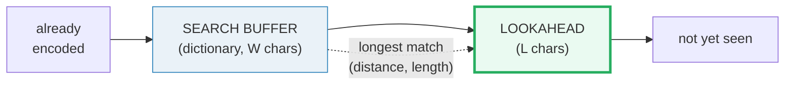

# LZ77 (Lempel–Ziv 1977) — A Visual, Worked-Example Guide

> **Companion code:** [`lz77.py`](./lz77.py). **Every number in this guide is
> printed by `uv run python lz77.py`** — change the code, re-run, re-paste.
> Nothing here is hand-computed. Full dump: [`lz77_output.txt`](./lz77_output.txt).
>
> **Sibling guide:** [`LZW.md`](./LZW.md) (LZ78's practical descendant — a
> dictionary that *grows itself* and never has to be sent). Cross-references are
> marked 🔗 throughout.
>
> **Live animation:** [`lz77.html`](./lz77.html) — open in a browser.

---

## 0. TL;DR — the librarian with a short memory

You need no math to get the idea. Picture a librarian copying a book who can
only **remember the last `W` words** they wrote (the *search buffer*, aka the
*dictionary*) and who can **peek at the next `L` words** they have not written
yet (the *lookahead*). Those two regions together are the **sliding window**.

At every step the librarian:

1. looks **back into the remembered words** for the *longest* run matching the
   start of what they're about to write;
2. instead of writing that run again, scribbles a **back-reference** —
   `(distance back, length of match, next literal char)`;
3. **slides the window forward by `length + 1`**.

A match may reach **into the lookahead and overlap itself**, which is how a run
like `aaaaaa` collapses into a single token — run-length encoding for free.



> **One-line definition:** *LZ77* = a sliding window that replaces each repeated
> substring with a `(distance, length, next_char)` back-reference into the
> recent past. It is the **dictionary half of DEFLATE** (gzip/zlib/PNG).

### Glossary

| Term | Plain meaning |
|---|---|
| **search buffer** | the *dictionary* — the last `W` chars already encoded; matches are hunted only here |
| **lookahead** | the next `L` chars not yet encoded; matches are measured from its start |
| **sliding window** | search buffer + lookahead; it slides right one token at a time. Size = `W + L` |
| **back-reference** | a `(distance, length)` pair pointing into the dictionary; the decoder *copies* instead of being told the bytes |
| **self-overlap** | a match with `length > distance`; the copy reads bytes it is currently writing → RLE behaviour |
| **token** | one `(distance, length, next_char)` triple — the unit LZ77 emits |
| **`MIN_MATCH`** | below this length a literal is cheaper than a token; DEFLATE uses 3 |

### The technical TL;DR

```
window_size      = W_search + L_lookahead
match length max = min(L_lookahead, n - pos)          # cannot run past EOF
self-overlap ok  : length may exceed distance          # copy reads its own output
token consumes   = length + 1 chars                    # progress guarantee
decode needs     : only the token stream + W_search history (rebuilt live)
```

---

## 1. The sliding window = search buffer + lookahead  *(Section A)*

Two regions slide across the input together:

```
[ ...already encoded... | SEARCH BUFFER (dictionary, W chars) | > LOOKAHEAD (L chars) < | not yet seen ... ]
                                              ^ matches are measured from the start of here
```

At each step the encoder finds the **longest prefix of the lookahead that also
occurs in the search buffer**, emits `(distance, length, next_char)`, and slides
forward by `length + 1`. Three knobs (and their classic values):

| Knob | Meaning | Classic value |
|---|---|---|
| **`W_search`** | dictionary size | DEFLATE/gzip = **32768** (32 KiB), PNG = 32768, LZ4 = 65536 |
| **`L_lookahead`** | max match length | DEFLATE = **258**, gzip = 258 |
| **`MIN_MATCH`** | literal-vs-token cutoff | DEFLATE = **3** |

Larger `W` → more matches found (fewer tokens) but each distance needs more bits.
Larger `L` → longer matches but the length field needs more bits. §5 quantifies
the tradeoff.

---

## 2. Encoding `TOBEORNOTTOBE` step by step  *(Section B, W=16, L=16)*

Input: `'TOBEORNOTTOBE'` (len 13). The underline marks each chosen
back-reference: `^` = source copy region inside the search buffer; `*` = the
matched bytes inside the lookahead (`length` = number of `*`).

| pos | window state | token emitted |
|---|---|---|
| 0 | `TOBEORNOTTOBE` | `(0, 0, 'T')` literal |
| 1 | `TOBEORNOTTOBE` | `(0, 0, 'O')` literal |
| 2 | `TOBEORNOTTOBE` | `(0, 0, 'B')` literal |
| 3 | `TOBEORNOTTOBE` | `(0, 0, 'E')` literal |
| 4 | `TOBEORNOTTOBE` <br> ` ^  * ` | `(3, 1, 'R')` copy 1 from dist 3, then 'R' |
| 6 | `TOBEORNOTTOBE` | `(0, 0, 'N')` literal |
| 7 | `TOBEORNOTTOBE` <br> `    ^  *` | `(3, 1, 'T')` copy 1 from dist 3, then 'T' |
| 9 | `TOBEORNOTTOBE` <br> `^^^^     ****` | `(9, 4, <EOF>)` copy 4 from dist 9, to EOF |

**Token stream:**
`(0,0,'T'), (0,0,'O'), (0,0,'B'), (0,0,'E'), (3,1,'R'), (0,0,'N'), (3,1,'T'), (9,4,EOF)`

**13 chars → 8 tokens** (the first 5 are literals — nothing repeated yet). The
final token is the payoff: the second `TOBE` is 9 chars back, so the encoder
copies 4 bytes and is done.

Note two short `O`/`T` back-references (length 1) are still emitted as matches
because classic LZ77 always includes the trailing literal anyway. Real codecs
add a `MIN_MATCH` cutoff so a length-1 match never costs more than a literal.

---

## 3. The self-overlap trick — a match may be longer than its distance  *(Section C)*

Input: `'aaaaaa'`, `W=4`, `L=16`:

| pos | token | note |
|---|---|---|
| 0 | `(0, 0, 'a')` | first 'a' is a literal |
| 1 | `(1, 5, <EOF>)` | **length 5 > distance 1** |

`'aaaaaa'` (6 chars) → **2 tokens**. The second token copies 5 bytes from just
**1 byte back**: the copy *reads bytes it is currently writing*. Because
`data[1:]` is matched against `data[0:]`, the single remembered `'a'` reproduces
itself five times. This is **run-length encoding for free** — the engine of why
LZ77 handles long runs so well. The decoder achieves the same effect by
appending to its output buffer *as* it copies, so a copy at distance `d` with
`length > d` reads freshly written bytes.

---

## 4. Decode + round-trip + the GOLD token stream  *(Section D)*

```
input   : 'TOBEORNOTTOBE'
tokens  : [(0,0,'T'),(0,0,'O'),(0,0,'B'),(0,0,'E'),(3,1,'R'),(0,0,'N'),(3,1,'T'),(9,4,'')]
decoded : 'TOBEORNOTTOBE'

[check] decode(encode(S)) == S ?  True
```

Decoding needs **no separate dictionary** — the history is rebuilt live from the
output itself. Self-overlapping copies are handled because the decoder appends as
it goes. The GOLD token stream (pinned for [`lz77.html`](./lz77.html)) is:

| i | distance | length | next_char |
|---|---|---|---|
| 0 | 0 | 0 | `'T'` |
| 1 | 0 | 0 | `'O'` |
| 2 | 0 | 0 | `'B'` |
| 3 | 0 | 0 | `'E'` |
| 4 | 3 | 1 | `'R'` |
| 5 | 0 | 0 | `'N'` |
| 6 | 3 | 1 | `'T'` |
| 7 | 9 | 4 | EOF |

`[check]` GOLD scalars: `num_tokens=8`, `num_literals=5`, `total_match_len=6` — **OK**.

---

## 5. Compression ratio + the window-size tradeoff  *(Section E)*

**Naive fixed-width token model** (classic LZ77 triple, no entropy coding):

```
bits/token = dist_bits + len_bits + char_bits
dist_bits  = W_search.bit_length()            # distance in 1..W
len_bits   = (L_lookahead + 1).bit_length()   # length in 0..L (incl. literal)
char_bits  = 8
```

On a longer text — `'the quick brown fox jumps over the lazy dog'` ×3 (131 chars;
the phrase repeats ~45 chars apart) — sweeping `W` (with `L=15` fixed):

| `W_search` | bits/token | tokens | compressed/original | what happens |
|---|---|---|---|---|
| 16 | 18 | 89 | **1.529** | window < 45: can't reach the repeat → mostly literals |
| 32 | 19 | 76 | **1.378** | still < 45: partial matches only |
| 64 | 20 | 37 | **0.706** | just clears 45: every repeat now references the previous |
| 256 | 22 | 37 | 0.777 | token count saturated; extra dist bits start to hurt |
| 4096 | 26 | 37 | 0.918 | way past saturation: most bits wasted on dist field |

**There is a sweet spot.** Below it (`W=16`, ratio 1.53) the window is too short
to reach the repeating phrase, so the encoder emits mostly literals and
**expands** the data. At `W=64` the window just clears that distance and token
count saturates at 37 (ratio 0.71). Beyond it the match count can't fall further,
so each extra distance bit only bloats the output (ratio climbs back to 0.92 at
`W=4096`).

**Lesson:** pick `W` to *just* cover your data's repetition scale. DEFLATE fixes
`W=32768` and recovers the wasted distance bits with **Huffman coding** — rare
long distances get long codes, common short ones get short codes — so a huge `W`
costs little in practice. The naive fixed-width model above can't do that, which
is exactly why pure LZ77 needs an entropy layer.

**Why pure LZ77 is weak on fresh data:** a literal char (8 bits) becomes a whole
triple. On input with *no* repetition, LZ77 **expands** the data — random text
(60 chars, no runs) → tokens=30, ratio **1.375** (>1.0 = expansion). That is
exactly why DEFLATE layers Huffman on top: literals and short distances get short
codes, killing the expansion. The dictionary idea (LZ77) and the entropy idea
(Huffman) are **complementary** — `DEFLATE = LZ77 + Huffman`.

`[check]` GOLD: LONG text, `W=64` (sweet spot), `L=15` → tokens=37, ratio **0.7061** — **OK**.

---

## 6. Where LZ77 actually lives  *(Section F)*

Every codec below is a sliding-window dictionary coder at heart: search back `W`
bytes, copy the longest match, emit a token. They differ in (a) how they flag a
literal vs a match (LZSS bit vs DEFLATE Huffman tree), (b) the entropy back-end
(Huffman vs range/arithmetic), and (c) `W`/`L` size.

| codec | spec | `W_search` | `L_look` | `MIN` | used in |
|---|---|---|---|---|---|
| **DEFLATE** | RFC 1951 | 32768 | 258 | 3 | gzip (.gz), zlib, HTTP gzip, **PNG** (IDAT) |
| **gzip** | GNU | 32768 | 258 | 3 | wraps DEFLATE; the unix `gzip` tool |
| **zlib** | RFC 1950 | 32768 | 258 | 3 | DEFLATE + Adler-32; in nearly every zip/png library |
| **LZ4** | Collet '11 | 65536 | 255 | 4 | very fast; favors speed over ratio |
| **Snappy** | Google '11 | 65536 | 64 | 4 | Protobuf / Bigtable |
| **LZMA/LZMA2** | Pavlov '99 | 2³²+ | 273 | 2 | xz / 7-Zip; range coder instead of Huffman |

The 1977 idea — *replace repetition with a `(distance, length)` pointer* — is
still the backbone of general-purpose lossless compression today.

🔗 **LZ77 vs LZW:** LZ77's dictionary is the *recent past* (a sliding window); it
must re-find matches every step. LZW (see [`LZW.md`](./LZW.md)) instead *grows a
persistent dictionary* of strings and never resends it. DEFLATE picked LZ77;
GIF picked LZW.

---

## Sources

- Ziv & Lempel, *"A Universal Algorithm for Sequential Data Compression,"* IEEE
  TIT-23(3), 1977 — the original LZ77.
- Storer & Szymanski, *"Data Compression via Textual Substitution,"* JACM 1982 —
  the LZSS flag-bit refinement DEFLATE actually uses.
- Deutsch, *DEFLATE Compressed Data Format Specification*, RFC 1951, 1996.
- Sedgewick & Wayne, *Algorithms*, §5.5; Salomon, *Handbook of Data Compression*.
