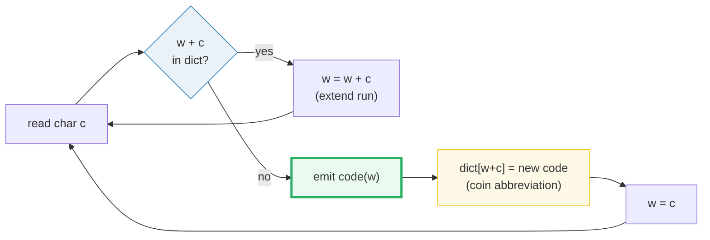

# LZW (Lempel–Ziv–Welch 1984) — A Visual, Worked-Example Guide

> **Companion code:** [`lzw.py`](./lzw.py). **Every number in this guide is
> printed by `uv run python lzw.py`** — change the code, re-run, re-paste.
> Nothing here is hand-computed. Full dump: [`lzw_output.txt`](./lzw_output.txt).
>
> **Sibling guide:** [`LZ77.md`](./LZ77.md) (the sliding-window ancestor — a
> dictionary that is the *recent past*, not a persistent table). Cross-references
> are marked 🔗 throughout.
>
> **Live animation:** [`lzw.html`](./lzw.html) — open in a browser.

---

## 0. TL;DR — the translator who coins abbreviations

You need no math to get the idea. Picture a translator typing a long message who
is allowed to **coin new abbreviations** as they go. They keep a glossary (the
**dictionary**) of every single-character symbol to start, then read left to
right, greedily extending the current run as long as it is already in the
glossary. The instant they hit a run that is *not* in the glossary, they:

1. **emit the code** for the longest run that *was* in the glossary;
2. **add the new (slightly longer) run** to the glossary with a fresh code;
3. **start a new run** from the current character.

The magic: the decoder performs the **same steps**, so it reconstructs the
**exact same glossary** from the code stream alone. The dictionary is **never
transmitted** — both sides grow it in lockstep. That is LZW's whole reason for
existing over its parent LZ78.



> **One-line definition:** *LZW* = a dictionary coder whose dictionary **grows
> itself one entry per emitted code** and is **rebuilt identically by the
decoder** — so it travels inside the data, not alongside it. Foundation of GIF,
TIFF-LZW, and Unix `compress`.

### Glossary

| Term | Plain meaning |
|---|---|
| **dictionary** | a table mapping strings → integer codes; starts with single chars, grows one entry per emitted code |
| **`w`** | the current run ("prefix" already known to be in the dict) |
| **code** | a fixed-width integer identifying a dictionary string |
| **emit** | output `dict[w]` when `w + c` is *not* in the dict |
| **variable width** | codes start narrow and **widen by 1 bit** each time the dict fills a power of two, up to 12 bits |
| **special case** | the decoder sometimes gets a code for an entry it hasn't built yet → `entry = w + w[0]` |
| **lockstep invariant** | after the k-th emitted code, encoder and decoder have both added `k−1` entries |

### The technical TL;DR

```
entries added per emitted code = 1       (except the final trailing code)
decoder dictionary lag         = 1 entry behind the encoder
special-case trigger           = received code == next free code
code width                     = grows 1 bit at each 2^k boundary, <= 12
max codes (12-bit)             = 4096     (GIF then emits a CLEAR code)
```

> The worked traces seed the dictionary with only the distinct characters that
> appear, numbered `1, 2, 3, …` (small, printable codes). Real byte-level LZW
> presets codes `0..255` and starts new codes at `256`; the algorithm is
> identical, only the offset differs (§6).

---

## 1. Build the dictionary on the fly; never send it  *(Section A)*

Both sides start with a dictionary of single characters. The encoder reads left
to right, extending the current run `w` while it is known:

```
while (w + c) in dictionary:   w = w + c
the moment (w + c) is NOT in the dictionary:
    emit code(w)            # longest known prefix
    dictionary[w + c] = new # coin a fresh abbreviation
    w = c                   # restart
```

The decoder replays the **same** additions: after reading `code(w)` it can
compute the same new entry the encoder coined. So the dictionary is **never in
the bitstream** — it is reconstructed in lockstep.

**INVARIANT:** after the k-th emitted code, encoder and decoder have both added
`k−1` entries (the encoder adds one per code, except the last). The decoder
**lags one entry behind** — harmless, except in §3.

**CODE WIDTH:** codes are fixed-width but the width *grows*. It starts at just
enough bits for the seed alphabet and widens by 1 each time the dictionary fills
a power of two, capped at **12 bits = 4096 codes**. That cap is why GIF emits a
CLEAR code to reset, and why Unix `compress` stops adapting once full.

---

## 2. Encoding `ABABABCABABAB` step by step  *(Section B)*

Input: `'ABABABCABABAB'` (len 13). Seed dictionary: `{A:1, B:2, C:3}`,
next free code = 4. (`w` = current run, `c` = next char.)

| read | `w+c` | in dict? | action | result |
|---|---|---|---|---|
| `A` | `A` | yes | extend | `w=A` |
| `B` | `AB` | **no** | emit `code(A)=1`, add `dict[AB]=4` | `w=B` |
| `A` | `BA` | **no** | emit `code(B)=2`, add `dict[BA]=5` | `w=A` |
| `B` | `AB` | yes | extend | `w=AB` |
| `A` | `ABA` | **no** | emit `code(AB)=4`, add `dict[ABA]=6` | `w=A` |
| `B` | `AB` | yes | extend | `w=AB` |
| `C` | `ABC` | **no** | emit `code(AB)=4`, add `dict[ABC]=7` | `w=C` |
| `A` | `CA` | **no** | emit `code(C)=3`, add `dict[CA]=8` | `w=A` |
| `B` | `AB` | yes | extend | `w=AB` |
| `A` | `ABA` | yes | extend | `w=ABA` |
| `B` | `ABAB` | **no** | emit `code(ABA)=6`, add `dict[ABAB]=9` | `w=B` |
| `A` | `BA` | yes | extend | `w=BA` |
| `B` | `BAB` | **no** | emit `code(BA)=5`, add `dict[BAB]=10` | `w=B` |
| EOF | — | — | flush `w=B` → emit `code(B)=2` (no new entry) | — |

**Emitted codes:** `[1, 2, 4, 4, 3, 6, 5, 2]` — **13 chars → 8 codes**.

Dictionary grew **7 entries** (3 seed → 10 total). Notice the codes get reused
across repetitions (`4` is emitted twice for `AB`), and each repetition coin a
*longer* phrase: `AB`→`ABA`→`ABAB`. That lengthening is LZW's compression engine.

---

## 3. The decoder special case — a code for a brand-new entry  *(Section C)*

The encoder can emit a code for an entry it coins on the **very same step** — a
code the decoder has not built yet. The classic trigger is a long run. Input
`'AAAA'`, seed `{A:1}`, next free = 2:

| step | code | what the decoder sees | entry used | new dict entry |
|---|---|---|---|---|
| 1 | `1` | known → `A` | `A` | — |
| 2 | `2` | **NOT in dict yet** → `entry = w + w[0] = A + A = AA` | `AA` | `dict[2]=AA` |
| 3 | `1` | known → `A` | `A` | `dict[3]=AAA` |

**Decoded:** `A` + `AA` + `A` = `'AAAA'` ✓.

Why `w + w[0]` is correct: the only way the encoder can emit a not-yet-decoded
code is when that code equals `w + w[0]` — the new entry *always begins with the
current run's first character*. This is the **one subtle corner** of LZW; get it
wrong and decode silently corrupts.

---

## 4. Decode + round-trip + the GOLD code stream  *(Section D)*

```
input   : 'ABABABCABABAB'
codes   : [1, 2, 4, 4, 3, 6, 5, 2]
decoded : 'ABABABCABABAB'

[check] decode(encode(S)) == S ?  True
```

**GOLD code stream** (pinned for [`lzw.html`](./lzw.html)): `[1, 2, 4, 4, 3, 6, 5, 2]`.

Dictionary growth on this input (the NEW codes, in coin-order):

| code | string |
|---|---|
| 4 | `AB` |
| 5 | `BA` |
| 6 | `ABA` |
| 7 | `ABC` |
| 8 | `CA` |
| 9 | `ABAB` |
| 10 | `BAB` |

`[check]` GOLD scalars: `num_codes=8`, `dict_entries_added=7` — **OK**.

---

## 5. Compression ratio + variable-width code growth  *(Section E)*

Two code-width models are used in practice:

1. **Fixed 12-bit** — every code costs 12 bits. Simple; the historical ceiling
   of Unix `compress` and the GIF maximum code size.
2. **Variable width** — codes start narrow (just enough for the seed alphabet)
   and **widen by 1 bit at each `2^k` boundary** up to 12. GIF and `compress`
   both do this; it saves bits early on.

$$\text{ratio} = \frac{\text{total\_code\_bits}}{\text{num\_chars} \times 8}$$

| input | chars | codes | final width | fixed-12 ratio | variable ratio |
|---|---|---|---|---|---|
| `ABABABCABABAB` | 13 | 8 | 4 | 0.923 | **0.269** |
| `AAAA` (degenerate run) | 4 | 3 | 3 | 1.125 | **0.219** |
| LONG (repeated phrase, 131) | 131 | 84 | 7 | 0.962 | **0.523** |

**Variable width always beats (or ties) fixed-12-bit, often dramatically:** on
`ABABABCABABAB` it is **0.27 vs 0.92**, because the early codes ride at 2–3 bits
instead of 12. Fixed-12-bit can even **expand** short data (`AAAA`: 1.125), since
12 bits per code is wasteful when few codes are emitted. On the longer repetitive
prose, variable width reaches **~0.52** while fixed-12 barely breaks even
(0.96). The degenerate run `AAAA` crushes to **0.22** because each repetition
collapses into a single code.

**Lesson:** the adaptive width is not a minor optimization — it is **where LZW's
compression actually comes from**.

`[check]` GOLD: LONG text → codes=84, final_width=7, fixed12_ratio=**0.962**, variable_ratio=**0.523** — **OK**.

---

## 6. Where LZW actually lives (and why it faded)  *(Section F)*

| format | spec | code width | used for |
|---|---|---|---|
| **GIF** | CompuServe 1987 | variable 3..12-bit | indexed-color images; the format that made LZW famous |
| **TIFF (LZW)** | Aldus 1986 | variable 2..12-bit | option tag 5: LZW on TIFF image/tile data |
| **Unix `compress`** | Spencer 1984 | adaptive 9..12-bit | `.Z` files; the classic `compress` utility |
| **PDF** | Adobe 1993 | 12-bit (`LZWDecode`) | early PDF stream filter (mostly replaced by `FlateDecode`) |
| **V.42bis** | ITU-T 1988 | on-line, max 12-bit | hardware LZW inside dial-up modems (in real time) |

LZW's heyday was the late 1980s / early 1990s. It lost ground to **DEFLATE**
(LZ77 + Huffman) because (a) LZW cannot beat Huffman on the literal/symbol
probabilities — DEFLATE's entropy stage is strictly additive, and (b) the 12-bit
dictionary cap limits how far back LZW can reach (4096 entries) versus DEFLATE's
32 KiB window. GIF still mandates LZW for patent-historical reasons, but PNG
(DEFLATE) has largely replaced it. The 1984 **lockstep trick**, however, remains
a beautiful idea: a dictionary reconstructed from nothing but the data.

🔗 **LZ77 vs LZW:** LZ77's dictionary is the *recent past* (a sliding window of
size `W`) and it re-finds matches every step. LZW's dictionary *grows
persistently* and never resends. See [`LZ77.md`](./LZ77.md).

---

## Sources

- Welch, *"A Technique for High-Performance Data Compression,"* IEEE Computer
  17(6), 1984 — the original LZW.
- Ziv & Lempel, *"Compression of Individual Sequences via Variable-Rate
  Coding,"* IEEE TIT-24(5), 1978 — LZ78, LZW's direct ancestor.
- Nelson, *"LZW Data Compression,"* Dr. Dobb's Journal 1989 — the canonical
  pedagogical walkthrough (including the special case).
- Salomon, *Handbook of Data Compression*, §6 (dictionary methods).
