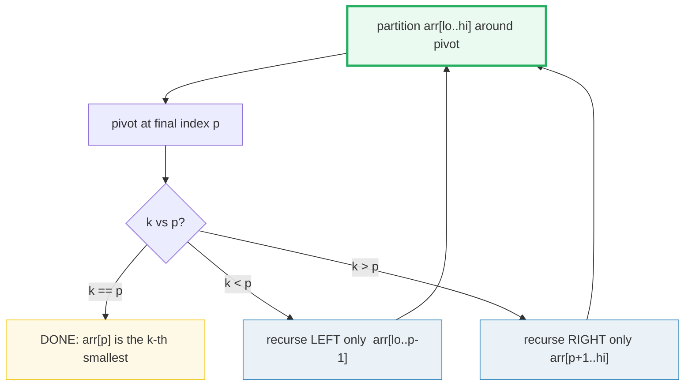
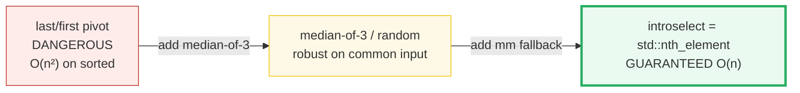
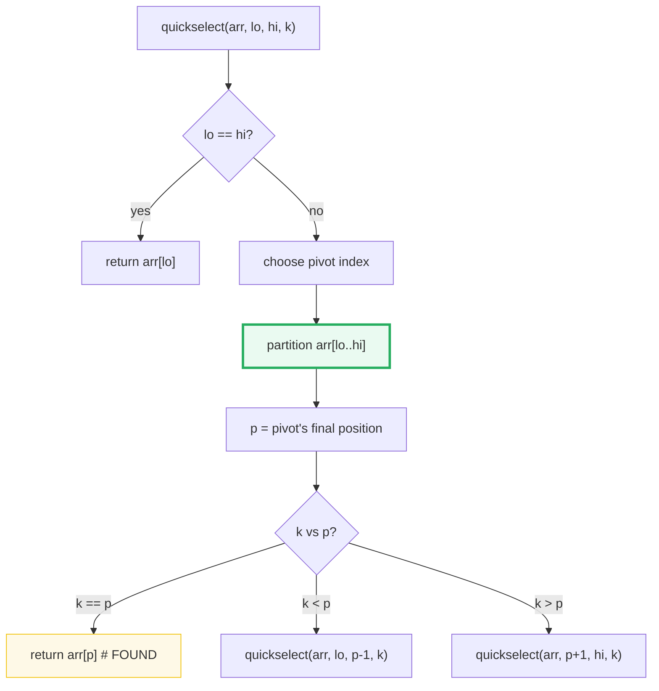
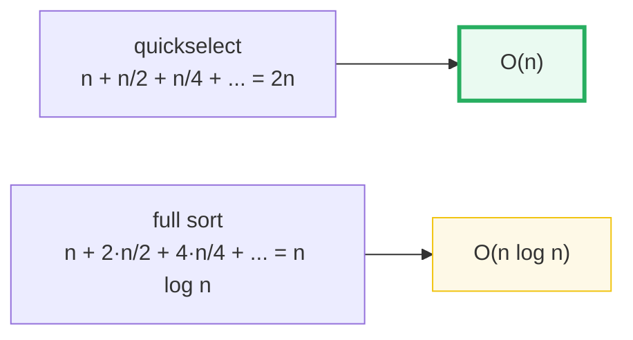
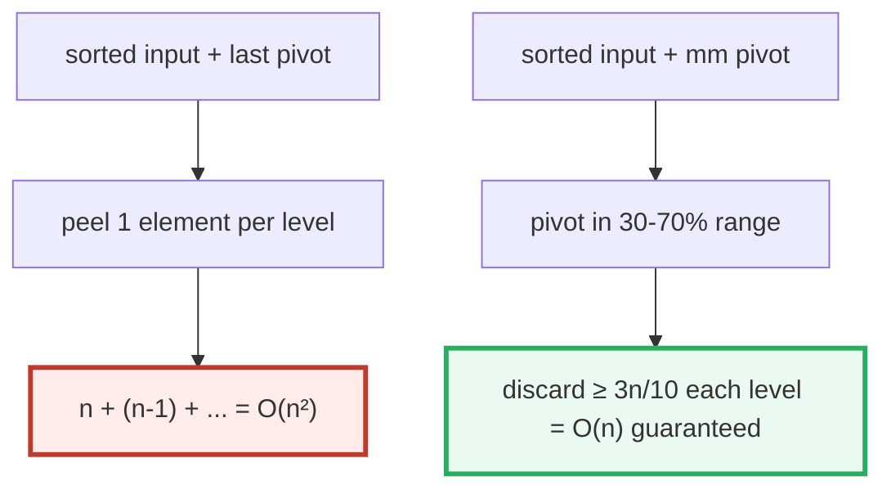
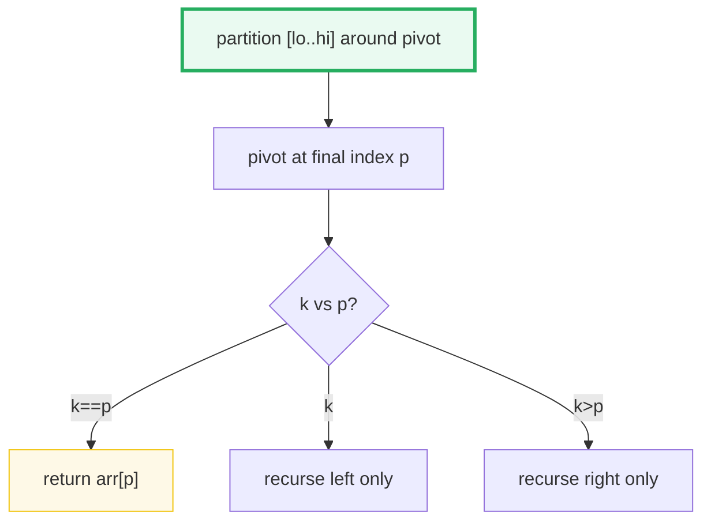

# Quickselect — A Visual, Worked-Example Guide

> **Companion code:** [`quickselect.py`](./quickselect.py). **Every number in
> this guide is printed by `uv run python quickselect.py`** — change the code,
> re-run, re-paste. Nothing here is hand-computed.
>
> **Sibling guide:** [`RESERVOIR_SAMPLING.md`](./RESERVOIR_SAMPLING.md) — the
> other "one pass, keep O(few)" algorithm in this folder; and
> [`QUICK_SORT.md`](./QUICK_SORT.md) — quickselect shares quicksort's partition.
>
> **Live animation:** [`quickselect.html`](./quickselect.html) — open in a
> browser.
>
> **Source material:** Hoare (1961, Algorithm 65 *FIND*), Blum-Floyd-Pratt-
> Rivest-Tarjan (1973, *Time Bounds for Selection*), CLRS Ch. 9 (*Medians and
> Order Statistics*).

---

## 0. TL;DR — quicksort that only walks ONE branch

### Read this first — partition, pick a side, repeat

Quickselect is quicksort that refuses to do half the work. To find the **k-th
smallest** element:

- **partition** : pick a pivot, split the array into "smaller | pivot | bigger"
  (exactly the quicksort partition — one linear scan). The pivot lands in its
  **final sorted position**, index `p`.
- **pick side** : if `k == p`, the pivot **is** the answer — done. If `k < p`,
  the answer is in the **left** part; recurse left. If `k > p`, recurse
  **right**. We **always throw away** the other half.
- **vs sort** : quicksort recurses on **both** halves → `O(n log n)`. Quickselect
  recurses on only **one** → `O(n)` average. That is the whole trick.



> **One-line definition:** *Quickselect* partitions the array around a pivot
> (same partition as quicksort), then recurses into only the side that contains
> index `k`. Average `O(n)`, worst-case `O(n²)`; in place; not a full sort.

### Glossary (every term used below)

| Term | Plain meaning |
|---|---|
| **k-th smallest** | the element that would sit at index `k` (0-based) if sorted. `k=0` = min, `k=n-1` = max, `k=n//2` = median |
| **order statistic** | another name for "k-th smallest". "Selection" = finding one |
| **partition** | the single pass (Lomuto here) rearranging `[lo..hi]` into "smaller \| pivot \| bigger"; returns the pivot's final index. 🔗 identical to `QUICK_SORT.md`'s partition |
| **pivot** | the element we partition around. Its choice decides the worst case (same trap as quicksort) |
| **search region** | the subarray `[lo..hi]` that still contains index `k`. Shrinks ~in half each level → that is why it is O(n) |
| **median-of-medians** | a pivot rule (BFPRT) that guarantees a pivot in the 30–70% range → worst-case O(n) |
| **introselect** | quickselect + median-of-medians fallback past a depth limit = `std::nth_element` |

---

### The technical TL;DR



| | **last/first** | **median-of-3 / random** | **median-of-medians** | **introselect** (std) |
|---|---|---|---|---|
| **avg case** | O(n) | O(n) | O(n) | O(n) |
| **worst case** | **O(n²)** | O(n²) (pathological) | **O(n) guaranteed** | **O(n) guaranteed** |
| **constant factor** | smallest | small | **~5–10× larger** | small (mm only as fallback) |
| **used by** | toy / teaching | common | theory / fallback | `std::nth_element`, `np.partition` |

> 🔗 Quickselect is quicksort's **selection** sibling: same partition, one-sided
> recursion. Its O(n²) hole is the **same** hole
> [`QUICK_SORT.md`](./QUICK_SORT.md) has, and median-of-medians plays the exact
> role heapsort plays in introsort — a guaranteed-linear fallback.

---

## 1. The algorithm — Section A output

The whole thing is quicksort's partition wrapped in a one-sided recursion:



> From `quickselect.py` **Section A** — worked array
> `[3, 8, 2, 5, 1, 9, 4, 7, 6]` (`n=9`), find the **median** (`k=4`), **last**-
> element pivot, every level traced:
>
> ```
> Level 0: region arr[0..8] (size 9), pivot = arr[8] = 6, 8 comparisons
>   after partition: [3, 2, 5, 1, 4, 6, 8, 7, 9], pivot at index 5
>   k=4 < p=5 -> discard the RIGHT half, recurse LEFT.
>
> Level 1: region arr[0..4] (size 5), pivot = arr[4] = 4, 4 comparisons
>   after partition: [3, 2, 1, 4, 5, 6, 8, 7, 9], pivot at index 3
>   k=4 > p=3 -> discard the LEFT half, recurse RIGHT.
>
> Level 2: region arr[4..4] (size 1), pivot = arr[4] = 5, 0 comparisons
>   k=4 == p=4 -> DONE. The k-th smallest = 5.
>
> Result: the 4-th smallest = 5  (== sorted median).
> Total comparisons = 12.  (Full sort ~ n log2 n = 29.)
> ```
>
> Watch the **search region** shrink: `[0..8]` → `[0..4]` → `[4..4]`. The right
> half `[6..8]` was discarded after level 0 — quicksort would have recursed into
> it; quickselect never touches it. That is the O(n) vs O(n log n) gap.

**The recursion in one breath:** partition `[lo..hi]` around a pivot to get its
final index `p`; if `p == k` return `arr[p]`; else recurse into the **single**
side `[lo..p-1]` or `[p+1..hi]` that still contains `k`. The partition is the
same Lomuto scan as quicksort (`arr[j] <= pivot` grows the small region); only
the recursion shape differs.

---

## 2. Complexity — Section B output (why one branch is O(n))

This is the section that explains why walking one branch collapses the cost.

> From `quickselect.py` **Section B**:
>
> **Average case** (good / random pivot splits ~in half): each level does `O(n)`
> partition work, then recurses into one side of size `~n/2`, then `n/4`, … The
> work telescopes:
> ```
> T(n) = n + n/2 + n/4 + … = 2n = Θ(n).
> ```
> (Quicksort recurses **both** sides → `n + 2(n/2) + 4(n/4) + … = n log n`.
> Walking one branch is what halts the doubling.)
>
> **Worst case** (pivot always smallest/largest): peels one element per level:
> ```
> T(n) = n + (n-1) + (n-2) + … = n(n+1)/2 = Θ(n²).
> ```
> Same trap as quicksort: last/first pivot on sorted input.

**Empirical scaling** — comparisons vs `n` (mean over 200 random inputs, random
pivot) vs a full sort:

> | n | quickselect (avg) | / n | sort (n log₂n) | ratio qs/sort |
> |---|---|---|---|---|
> | 64 | 190.9 | 2.98 | 384 | 49.72% |
> | 256 | 824.7 | 3.22 | 2,048 | 40.27% |
> | 1,024 | 3,450.3 | 3.37 | 10,240 | 33.69% |
> | 4,096 | 14,268.4 | 3.48 | 49,152 | 29.03% |
>
> Quickselect comparisons grow **linearly** in `n` (the `/ n` column is roughly
> constant, ~3). Quickselect is `~1/log₂n` of the sort cost — `~1/6` at `n=64`,
> `~1/12` at `n=4096`.



**Worst case, concretely** — `last` pivot on a sorted array, find the **min**
(`k=0`); each partition peels the max and recurses into `[0..hi-1]`, walking the
whole shrinking array:

> | | comparisons |
> |---|---|
> | last pivot, k=0 (min), n=256 | **32,640** (== `n(n-1)/2`, O(n²)) |
> | random pivot, k=median, n=256 | 933 (linear, dodges the trap) |
>
> `[check] last-pivot-on-sorted, k=0 == n(n-1)/2 == 32640: OK`

---

## 3. Median-of-medians (BFPRT) — Section C output (the O(n) guarantee)

The O(n²) worst case is real (Section 2). Median-of-medians kills it by spending
extra work to pick a pivot **guaranteed** to be good.

> From `quickselect.py` **Section C** — the rule (Blum, Floyd, Pratt, Rivest,
> Tarjan 1973):
>
> 1. Split `arr[lo..hi]` into **groups of 5** (last group may be smaller).
> 2. Sort each group (≤5 elements, O(1)) and take its **median**.
> 3. Recursively find the **median of those medians** → use as the pivot.
>
> **Why it is linear:** half of the `~n/5` group-medians are ≤ the pivot, and
> each of those is ≥ 2 elements in its own group. So at least **3 of every 10**
> elements are guaranteed ≤ the pivot (and 3/10 ≥ it). The pivot is in the
> 30–70% range, so each partition discards `≥ 3n/10`:
>
> ```
> T(n) ≤ T(n/5)  [find medians]  +  T(7n/10)  [recurse one side]  +  O(n)
>      = Θ(n).     (1/5 + 7/10 = 0.9 < 1  →  the recursion sums linearly.)
> ```
>
> **The trade:** the constant is ~5–10× quickselect's, so in practice people use
> **introselect** (quickselect + median-of-medians fallback past a depth limit).
> That is exactly `std::nth_element`: quickselect's speed, linear guarantee.

**Comparisons to find the median** (`n=256`), strategy × input:

> | input | last | median-of-3 | random | **mm (BFPRT)** | full sort |
> |---|---|---|---|---|---|
> | random | 1,103 | 597 | 1,023 | 1,405 | 1,738 |
> | sorted | **24,512** | 496 | 933 | **1,490** | 1,024 |
> | reversed | **32,640** | 255 | 846 | **2,454** | 1,024 |
>
> `[check] median-of-medians worst (over inputs) ≤ 20n = 5120: OK (was 2454)`



Read the `sorted`/`reversed` rows: `last` pivot blows up to `~n(n-1)/2` (O(n²));
**median-of-medians stays linear** (a few × n) on **every** input, including the
hostile ones. That guaranteed linearity is what BFPRT buys — at a constant-factor
cost (compare `mm` vs `random` on the `random` row).

> 🔗 The O(n²) hole and its fix are the **selection** mirror of
> [`QUICK_SORT.md`](./QUICK_SORT.md)'s story: quicksort's hole is closed by a
> **heapsort** fallback (introsort); quickselect's hole is closed by a
> **median-of-medians** fallback (introselect). Same engineering pattern:
> "fast heuristic + guaranteed fallback."

---

## 4. Applications — Section D output (when to select instead of sort)

> From `quickselect.py` **Section D**:

**USE quickselect** when you need **one** order statistic (or a few), not the
whole sorted order:

- **median** of a dataset — the canonical use. O(n) vs O(n log n) to sort;
- **percentiles / quantiles** — P95 latency, box-plot whiskers, the k-th largest
  sale. Select index `k = p·n` for the p-th percentile;
- **top-k / bottom-k** — select the k-th element, then everything on one side is
  your set (`O(n + k log k)` to finish-sort the top-k);
- **outlier / anomaly thresholds** — "is this value above the 99th pct?" select
  once, then compare.

**Where it lives in the wild:**

- C++ `std::nth_element` — introselect (quickselect + mm fallback);
- `numpy.partition` / `np.median` (small arrays) — introselect-based;
- quickselect is the subroutine behind median-of-medians pivot selection in some
  quicksort variants.

**WHEN NOT to use it:**

- you need the **whole** array sorted → just sort (O(n log n));
- you need **many** order statistics from the same array → sort once, then every
  k-th query is O(1); quickselect per query is O(n) each → worse than one sort
  after ~log n queries;
- the array is **tiny** → constant factors of partition/recursion dominate; a
  small sort is simpler and as fast;
- you need a **worst-case linear guarantee** on adversarial input and can't
  afford introselect's machinery → use median-of-medians directly.

> **Rule of thumb:** select (don't sort) when you want **one rank**, not the
> order. The default in nearly every stdlib is **introselect** — quickselect's
> speed with median-of-medians' O(n) guarantee.

---

## 5. The GOLD values (pinned for `quickselect.html`)

> From `quickselect.py` **Section G** — worked array
> `[3, 8, 2, 5, 1, 9, 4, 7, 6]` (`n=9`, `k=4`):
>
> ```
> GOLD median (k-th smallest)        = 5
> GOLD quickselect levels (recursions) = 3
> GOLD per-level pivots:
>   level 0: pivot 6 lands at index 5, go=left
>   level 1: pivot 4 lands at index 3, go=right
>   level 2: pivot 5 lands at index 4, go=done
> GOLD last-pivot    comparisons = 12
> GOLD median3       comparisons = 14
> GOLD random(seed0) comparisons = 13
> GOLD mm (BFPRT)    comparisons = 39, value = 5
> ```
>
> [`quickselect.html`](./quickselect.html) recomputes the last-pivot quickselect
> on the *identical* array in JavaScript (no RNG needed — last-pivot is fully
> deterministic) and checks the median is `5`, comparisons are `12`, across
> exactly `3` levels with the pinned per-level pivots.

---

## 6. Pitfalls & debugging checklist

| # | Mistake | Symptom | Fix |
|---|---|---|---|
| 1 | **last/first pivot** on sorted/reversed input | O(n²) — peels one element per level | use median-of-3/random, or introselect (mm fallback) |
| 2 | Recursing **both** sides | O(n log n) — you just reinvented quicksort | recurse only the side `k` is in (`k < p` → left, `k > p` → right) |
| 3 | Passing the wrong `k` into the right-side recursion | wrong answer / infinite loop | right side keeps the **global** `k`; left side keeps `k` too (indices don't shift, unlike rank-based selection) |
| 4 | `k == p` check after recursing | extra work / missed termination | check `k == p` first and **return immediately** — the pivot is already final |
| 5 | Assuming quickselect finds a value without moving it | reading the wrong cell afterwards | after select, `arr[k]` holds the k-th smallest (Lomuto places it there); the rest is partially sorted, not fully |
| 6 | Counting partition comparisons wrong in benchmarks | misleading O(n) claims | count `arr[j] <= pivot` only (one per loop iteration, `hi-lo` per partition) |
| 7 | Expecting mm to be *faster* than quickselect | disappointment | mm is **linear-guaranteed** but ~5–10× the constant; use it as a **fallback**, not the default |

---

## 7. Cheat sheet



- **Idea:** partition, then recurse into only the side containing `k`.
- **Average:** O(n) (`n + n/2 + n/4 + … = 2n`). **Worst:** O(n²) (same pivot trap as quicksort).
- **vs sort:** O(n) vs O(n log n) — the gap is `log₂n`; need one rank, not the order.
- **Pivot strategies:** last/first (risky), median-of-3/random (robust), median-of-medians (guaranteed).
- **Counted op:** `arr[j] <= pivot`; `hi-lo` comparisons per partition.
- **median-of-medians:** `T(n) ≤ T(n/5) + T(7n/10) + O(n) = Θ(n)` — the guaranteed-linear fallback.
- **Production:** introselect = quickselect + mm fallback = `std::nth_element`.
- **🔗 quicksort**: same partition, both sides → O(n log n). Read the two together.

> 🔗 Quickselect is the **ranked-selection** counterpart to
> [`RESERVOIR_SAMPLING.md`](./RESERVOIR_SAMPLING.md)'s **random** sampling: both
> extract a small answer from a large sequence in a single linear pass — one
> keeps the k-th smallest, the other keeps k uniformly random items.

---

## Sources

- **Hoare, C. A. R.** *Algorithm 65: FIND.* Communications of the ACM, 1961. The
  original quickselect — same author, same year, same partition as quicksort
  (Algorithm 64).
- **Blum, M., Floyd, R. W., Pratt, V., Rivest, R. L., Tarjan, R. E.** *Time
  Bounds for Selection.* Journal of Computer and System Sciences, 1973. The
  median-of-medians algorithm ("BFPRT") that gives the **linear worst-case**
  guarantee: `T(n) ≤ T(n/5) + T(7n/10) + O(n) = Θ(n)`.
- **Musser, D. R.** *Introspective Sorting and Selection Algorithms.* Software:
  Practice and Experience, 1997. Introselect — quickselect + median-of-medians
  fallback; this is `std::nth_element`.
- **CLRS** — *Introduction to Algorithms*, Ch. 9 (*Medians and Order Statistics*).
  §9.2 (expected linear-time selection), §9.3 (worst-case linear selection via
  median-of-medians). The partition is Ch. 7 (🔗 cross-referenced in
  `QUICK_SORT.md`).
- **Floyd, R. W.** *Algorithm 245: Treesort* and subsequent work on heap-based
  selection; co-author of BFPRT.
