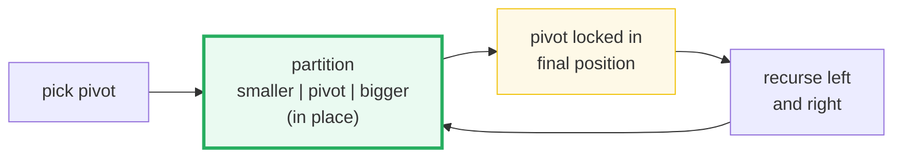
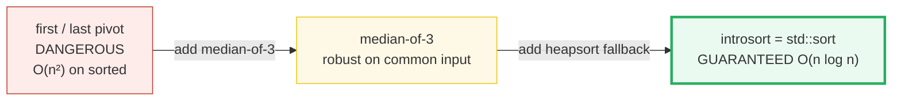
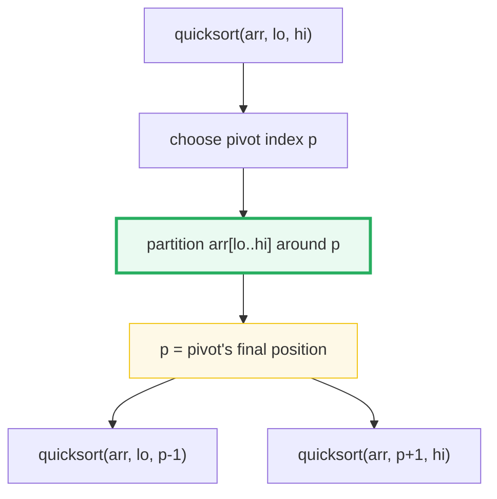
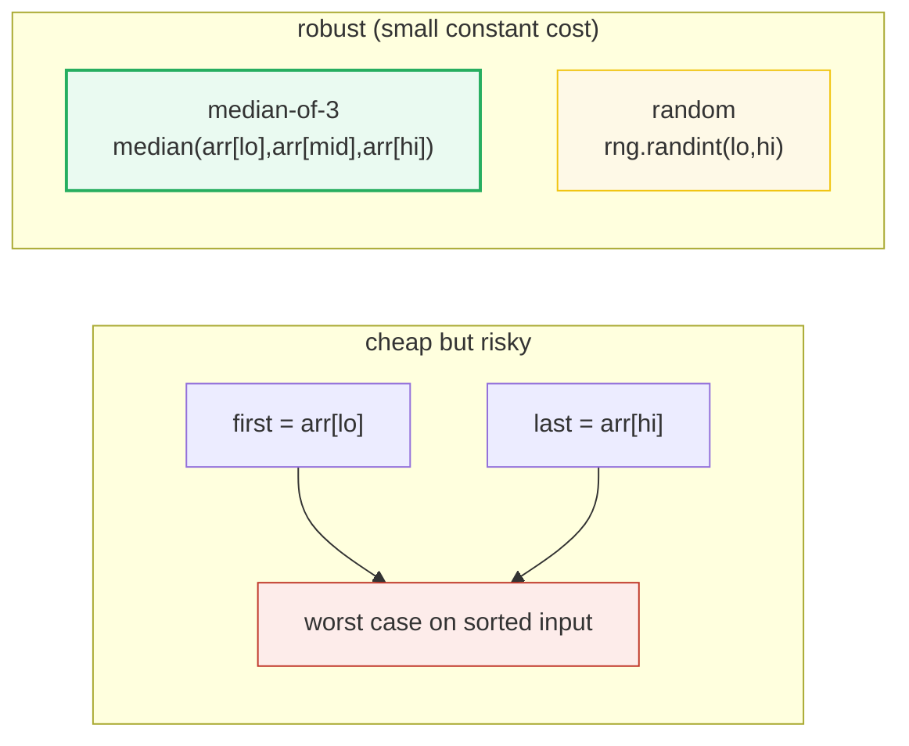
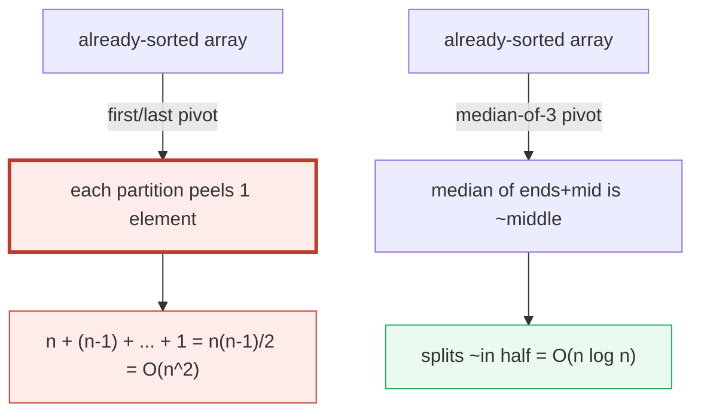
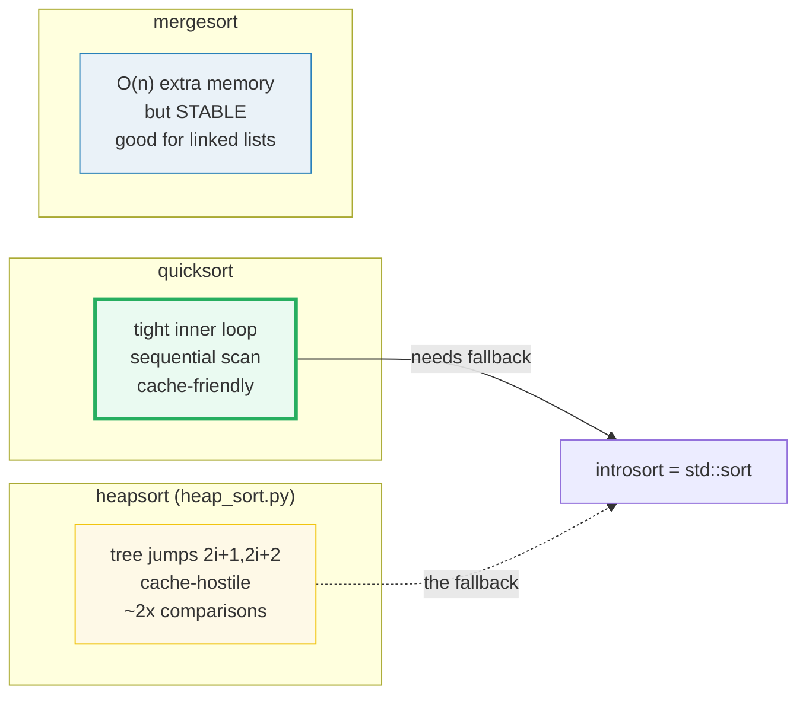
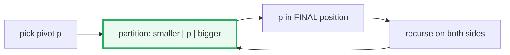

# Quicksort — A Visual, Worked-Example Guide

> **Companion code:** [`quick_sort.py`](./quick_sort.py). **Every number in this
> guide is printed by `uv run python quick_sort.py`** — change the code, re-run,
> re-paste. Nothing here is hand-computed.
>
> **Sibling guide:** [`HEAP_SORT.md`](./HEAP_SORT.md) — the guaranteed
> O(n log n) counterpart that quicksort falls back to (introsort).
>
> **Live animation:** [`quick_sort.html`](./quick_sort.html) — open in a browser.
>
> **Source material:** CLRS Ch. 7 (Quicksort), Sedgewick (1975 PhD / 1978),
> Hoare (1961, Algorithm 64), Musser (1997, introsort).

---

## 0. TL;DR — one pivot, one scan, recurse

### Read this first — split, conquer, repeat

Quicksort is one idea repeated to death: **pick a pivot, split the array into
"smaller than pivot | pivot | bigger than pivot", and recurse on each side.**
The split — the *partition* — happens **in place**, using only swaps. After a
partition, the pivot is in its **final sorted position**, forever.

- **partition** : one left-to-right scan that grows a "small" region at the
  front. Every element ≤ the pivot is swapped into it; everything else stays.
  At the end the pivot is dropped between the two regions. **Linear, in place.**
- **pivot** : the element you split around. **Its choice is the whole game.**
  Split the array roughly in half → `O(n log n)`. Split off one element at a
  time → `O(n²)`.
- **the danger** : on *already-sorted* input, a first/last pivot peels off one
  element per pass → the worst case. This is why real quicksorts use
  **median-of-3** and a **heapsort fallback** (introsort).



> **One-line definition:** *Quicksort* = pick a pivot, partition the array
> around it (everything smaller left, everything bigger right, pivot in its final
> spot), then recursively quicksort the two sides. Average `O(n log n)`,
> worst-case `O(n²)`; in place; not stable.

### Glossary (every term used below)

| Term | Plain meaning |
|---|---|
| **pivot** | the element we split the subarray around |
| **partition** | the single pass that rearranges `[lo..hi]` into "smaller \| pivot \| bigger"; returns the pivot's final index |
| **Lomuto scheme** | a partition that scans left-to-right, swapping each ≤-pivot element into a growing "small" region (taught here for clarity; Hoare's original scans from both ends) |
| **comparison** | the basic op we count (`arr[j] <= pivot`). This single number separates O(n log n) from O(n²) |
| **median-of-3** | pick the median of `arr[lo], arr[mid], arr[hi]` as pivot — kills the sorted/reversed worst case |
| **introsort** | quicksort + median-of-3 + heapsort fallback + insertion-sort cutoff = `std::sort` |

---

### The technical TL;DR



| | **first/last** | **median-of-3** (textbook) | **introsort** (std::sort) |
|---|---|---|---|
| **avg case** | O(n log n) | O(n log n) | O(n log n) |
| **worst case** | **O(n²)** on sorted/reversed | O(n²) (pathological only) | **O(n log n) guaranteed** |
| **memory** | O(log n) stack | O(log n) stack | O(log n) stack |
| **stable?** | no | no | no |
| **used by** | toy / teaching | older stdlibs | `std::sort`, most modern libs |

> 🔗 **Why quicksort usually wins despite no guarantee:** its inner loop is a
> single compare-and-swap on a **contiguous** array — superb cache locality and
> branch prediction. Heapsort (🔗 [`HEAP_SORT.md`](./HEAP_SORT.md)) is also
> O(n log n) but jumps around a tree stored in an array (children at `2i+1`,
> `2i+2`, far apart) → cache-hostile, ~2–3× slower on real hardware.

---

## 1. The algorithm — Section A output

The whole thing is two lines of recursion wrapped around **one linear pass**:



> From `quick_sort.py` **Section A** — worked array `[3, 8, 2, 5, 1, 4, 7, 6]`,
> **last-element** pivot (`= 6`), top-level partition traced step by step:
>
> ```
> stash pivot 6 at end:     [3, 8, 2, 5, 1, 4, 7, 6]
> compare j=0 (val 3):  <= pivot -> grows small region
>   swap i=0<->j=0:          [3, 8, 2, 5, 1, 4, 7, 6]
> compare j=1 (val 8):  > pivot -> skip
> compare j=2 (val 2):  <= pivot -> grows small region
>   swap i=1<->j=2:          [3, 2, 8, 5, 1, 4, 7, 6]
> compare j=3 (val 5):  <= pivot -> grows small region
>   swap i=2<->j=3:          [3, 2, 5, 8, 1, 4, 7, 6]
> compare j=4 (val 1):  <= pivot -> grows small region
>   swap i=3<->j=4:          [3, 2, 5, 1, 8, 4, 7, 6]
> compare j=5 (val 4):  <= pivot -> grows small region
>   swap i=4<->j=5:          [3, 2, 5, 1, 4, 8, 7, 6]
> compare j=6 (val 7):  > pivot -> skip
> place pivot at index 5: [3, 2, 5, 1, 4, 6, 7, 8]   <- pivot locked
>
> Pivot 5 final index. Left = [3, 8, 2, 5, 1], right = [7, 6].
> ```
>
> The pivot `6` is now at index `5` — its **final** position in the sorted
> array. The scan did `n-1 = 7` comparisons. Then we recurse on the left
> `[3,2,5,1,4]` and right `[7,6]`. Full sort: `15` comparisons.

**The Lomuto partition in one breath:** stash the pivot at the end; maintain a
pointer `i` at the end of the "small" region; scan `j` left→right; whenever
`a[j] ≤ pivot`, grow the small region (`i++`) and swap `a[i]⇄a[j]`; finally drop
the pivot at `i+1`. `i` only advances on a "small" element, so the small region
is always `[lo..i]`.

---

## 2. The four pivot strategies — Section B output

Same algorithm, different rule for picking the pivot index:

> From `quick_sort.py` **Section B** — for the top-level call `arr[0..7]`:
>
> | strategy | pivot index | pivot value | how chosen |
> |---|---|---|---|
> | first | 0 | 3 | just `arr[lo]` |
> | last | 7 | 6 | just `arr[hi]` |
> | random | 6 | 7 | `rng.randint(0,7)` (seed 0) |
> | median-of-3 | 3 | 5 | median of `arr[0]=3, arr[3]=5, arr[7]=6` |
>
> `first`/`last` are the **dangerous** ones on sorted/reversed input (Section 3).
> `median-of-3` costs 2–3 extra compares per call but avoids the worst case on
> the two commonest real-world inputs. `random` makes the worst case a
> *probability event* (≈ 2/n ln n expected), not an *input pattern*.



---

## 3. Pivot-choice impact — Section C output (the O(n²) worst case)

This is the section that justifies median-of-3's existence. We count
**comparisons** for each strategy × input type at `n = 32`:

> From `quick_sort.py` **Section C**:
>
> | input | first | last | random | median-of-3 | best possible |
> |---|---|---|---|---|---|
> | random | 145 | 125 | 131 | **113** | 160 |
> | sorted | **496** | **496** | 133 | **103** | 160 |
> | reversed | **496** | **496** | 203 | **126** | 160 |
> | few-unique | 186 | 195 | 186 | 186 | 160 |
>
> | strategy | worst comparisons seen | vs n log₂ n |
> |---|---|---|
> | first | 496 | 3.10× |
> | last | 496 | 3.10× |
> | random | 203 | 1.27× |
> | median-of-3 | **186** | **1.16×** |
>
> `[check] first-pivot on sorted == n(n-1)/2 == 496: OK`

**Read the red numbers:** `first`/`last` on **sorted** or **reversed** input
collide with the worst case — each partition peels off *one* element, giving
`n + (n-1) + ... + 1 = n(n-1)/2 = O(n²)`. And "sorted input" is the *most
common* real-world data. `median-of-3` and `random` stay within ~1.2–1.3× of the
information-theoretic lower bound `n log₂n` on **every** input.



> 🔗 The decision-tree lower bound says no comparison sort can beat
> `⌈log₂(n!)⌉ ≈ n log₂n − 1.44n` comparisons in the worst case. Quicksort with
> random/median-of-3 pivots sits at ~1.39 n log₂n — close to optimal. Heapsort
> (🔗 [`HEAP_SORT.md`](./HEAP_SORT.md) §3) hits the bound more reliably but pays
> in cache misses.

---

## 4. Quicksort vs mergesort vs heapsort — Section D output

All three are ~O(n log n), but they differ in **constant factors, memory, and
guarantees**. On `n = 64` random ints:

> From `quick_sort.py` **Section D**:
>
> | sort | comparisons | auxiliary memory | stable | worst case |
> |---|---|---|---|---|
> | quicksort (m3) | 306 | O(log n) stack | no | O(n²)* |
> | mergesort | 311 | O(n) extra array | yes | O(n log n) |
> | heapsort | 568 | O(1) in place | no | O(n log n) |
>
> `*` median-of-3's O(n²) is vanishingly rare; introsort restores the O(n log n)
> guarantee by switching to heapsort after `2·log₂(n)` recursion levels.



**Why quicksort usually wins in practice (despite no guarantee):**
- tightest inner loop — one compare + one branch + maybe one swap, all on a
  **contiguous** array → superb cache locality + branch prediction;
- heapsort hops around a tree stored in an array (`2i+1`, `2i+2` are far apart
  for big arrays) → ~2–3× slower on real hardware;
- mergesort streams two runs sequentially (good cache) but needs O(n) auxiliary
  memory → use it when you specifically need **stability** or a linked-list sort.

---

## 5. When to use quicksort (and when NOT to) — Section E output

> From `quick_sort.py` **Section E**:

**USE quicksort when:**
- you sort general arrays in RAM and want the fastest *average* speed (this is
  why `std::sort` / `sorted()` are quicksort/introsort-based);
- you can afford O(log n) stack and have no stability requirement.

**AVOID quicksort when:**
- you need a **worst-case guarantee** without introsort's fallback (hard
  real-time, adversarial input) → **heapsort** 🔗;
- you need **stability** (equal keys keep their order) → **mergesort**;
- the data is a linked list or streamed → **mergesort** (O(1) merge);
- `n` is tiny → **insertion sort** (fewer ops, no recursion); real quicksorts
  switch to insertion sort below ~10–20 elements.

> **Rule of thumb:** the default in nearly every stdlib is **introsort**
> (quicksort + median-of-3 + heapsort fallback + insertion-sort cutoff). You get
> quicksort's speed AND heapsort's O(n log n) guarantee.

---

## 6. The GOLD value (pinned for `quick_sort.html`)

> From `quick_sort.py` **Section G** — worked array `[3, 8, 2, 5, 1, 4, 7, 6]`:
>
> ```
> GOLD sorted result        = [1, 2, 3, 4, 5, 6, 7, 8]
> GOLD median-of-3 comparisons = 13
> GOLD last comparisons        = 15
> GOLD first comparisons       = 15
> GOLD median-of-3 top pivot index = 3, value = 5, lands at 4
> GOLD top-level partition step count = 13
> ```
>
> [`quick_sort.html`](./quick_sort.html) recomputes the median-of-3 sort on the
> *identical* array in JavaScript and checks the comparison count equals `13`.

---

## 7. Pitfalls & debugging checklist

| # | Mistake | Symptom | Fix |
|---|---|---|---|
| 1 | **first/last pivot** on sorted/reversed input | O(n²), stack overflow on big arrays | use median-of-3 (or introsort) |
| 2 | No recursion-depth bound | stack overflow on adversarial input | introsort: switch to heapsort past `2·log₂n` depth |
| 3 | Off-by-one in partition (e.g. `range(lo, hi+1)`) | pivot compared to itself / infinite loop | Lomuto scans `j ∈ [lo, hi)` — the pivot is parked at `hi` |
| 4 | Forgetting to recurse `p-1` / `p+1` (not `p`) | infinite recursion on the pivot | the pivot's final index `p` is excluded from both halves |
| 5 | Assuming quicksort is stable | wrong relative order of equal keys | use mergesort, or add a tie-breaker index |
| 6 | Counting the wrong op as "comparison" | misleading benchmarks | count `arr[j] <= pivot` only (the data-dependent branch) |
| 7 | Using `random` pivot without a seed | non-reproducible tests / flaky benchmarks | seed the RNG, or use deterministic median-of-3 |

---

## 8. Cheat sheet



- **Idea:** pick pivot → partition in place → recurse on both halves.
- **Average:** O(n log n). **Worst:** O(n²) (sorted input + first/last pivot).
- **Inner loop:** one compare + one conditional swap, sequential → cache-friendly.
- **Pivot strategies:** first/last (risky), median-of-3 (robust), random (probabilistic).
- **Counted op:** `arr[j] <= pivot`; best possible ≈ `n log₂n`.
- **vs heapsort** 🔗: quicksort faster (cache), heapsort guaranteed O(n log n).
- **vs mergesort**: quicksort in place + faster; mergesort stable + O(n) memory.
- **Production:** introsort = quicksort + median-of-3 + heapsort fallback + insertion cutoff.

> 🔗 Quicksort's O(n²) hole is exactly what [`HEAP_SORT.md`](./HEAP_SORT.md)
> closes: heapsort guarantees O(n log n) by construction, which is why it is the
> *fallback* inside `std::sort`. Read the two together.

---

## Sources

- **Hoare, C. A. R.** *Algorithm 64: Quicksort.* Communications of the ACM,
  1961. The original two-pointer partition.
- **Sedgewick, R.** *Quicksort.* PhD thesis, Stanford, 1975; and *Implementing
  Quicksort programs*, CACM 1978. Median-of-3, the analysis, the textbook form.
- **Musser, D. R.** *Introspective Sorting and Selection Algorithms.*
  Software: Practice and Experience, 1997. The quicksort→heapsort fallback that
  guarantees O(n log n); this is `std::sort`.
- **CLRS** — *Introduction to Algorithms*, Ch. 7 (Quicksort) and Ch. 6
  (Heapsort, cross-referenced in HEAP_SORT.md). Theorem 7.1 (expected
  comparisons ≤ 1.39 n log₂n for random pivots); §7.4 (worst-case O(n²)).
- **Heap (1964)** — Williams (heapsort + heap) and Floyd (O(n) build-heap); see
  [`HEAP_SORT.md`](./HEAP_SORT.md) Sources.
