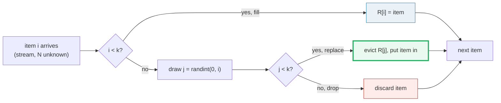
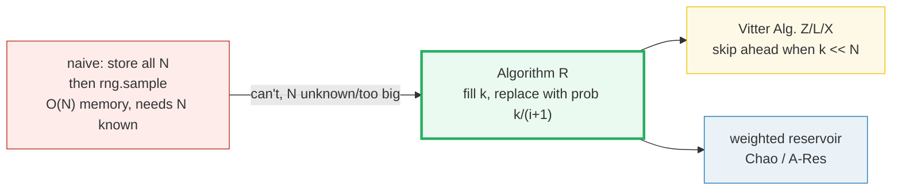
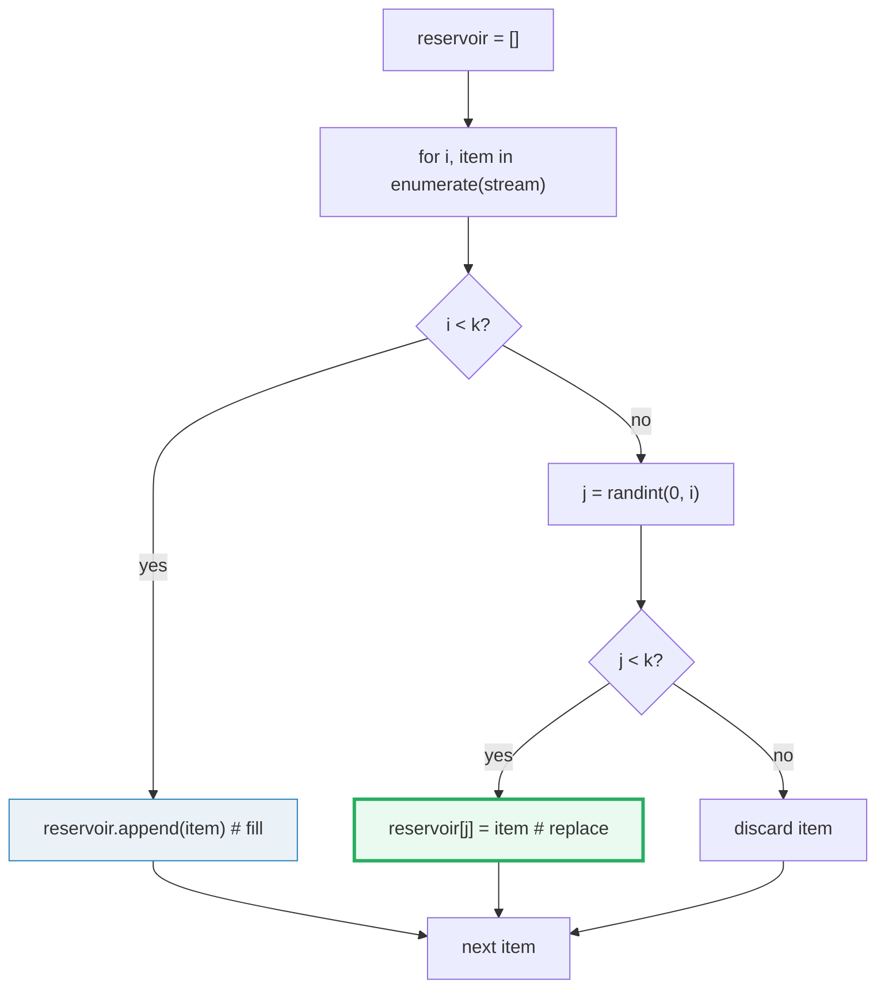
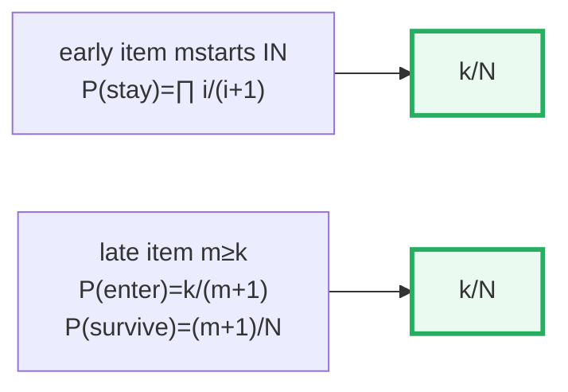
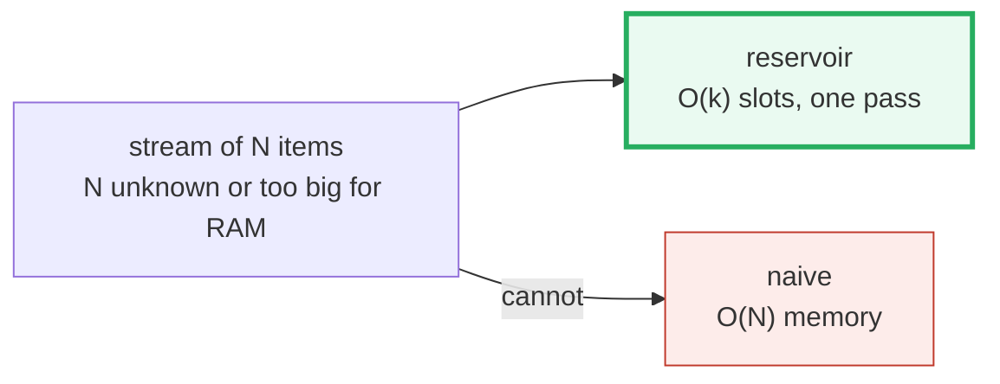
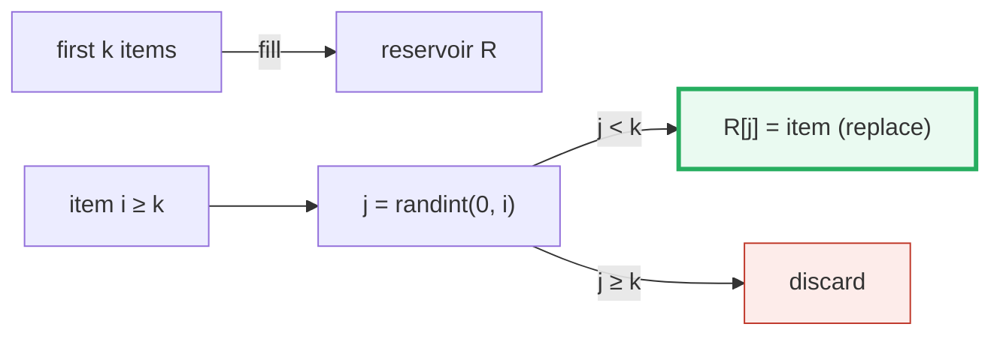

# Reservoir Sampling — A Visual, Worked-Example Guide

> **Companion code:** [`reservoir_sampling.py`](./reservoir_sampling.py). **Every
> number in this guide is printed by `uv run python reservoir_sampling.py`** —
> change the code, re-run, re-paste. Nothing here is hand-computed.
>
> **Sibling guide:** [`QUICKSELECT.md`](./QUICKSELECT.md) — the other "process a
> sequence in one pass, keep only O(few)" algorithm in this folder.
>
> **Live animation:** [`reservoir_sampling.html`](./reservoir_sampling.html) —
> open in a browser.
>
> **Source material:** Knuth *TAOCP* Vol 2 §3.4.2 (Random Sampling without
> Replacement), Vitter (1985, *Random Sampling with a Reservoir*, ACM TOMS),
> Waterman (original Algorithm R, cited by Knuth).

---

## 0. TL;DR — one pass, k slots, every item at probability k/N

### Read this first — the conveyor belt with k slots

Picture a **conveyor belt** of items rolling past you, one at a time. You don't
know how many will come (the stream length `N` is unknown), and you can't store
them all. But you must end up holding `k` of them, chosen **uniformly at random**
— every item that ever rode the belt must have the same chance `k/N` of being in
your hand.

Algorithm R does this with a **reservoir** of `k` slots and one rule:

- **fill** : the first `k` items go straight into the reservoir. Slots full.
- **replace** : for every later item `i`, pick a random slot index `j` in
  `[0..i]`; if `j` happens to be one of the `k` reservoir slots (`j < k`),
  evict whatever is there and put item `i` in. Otherwise drop item `i`.

That's the whole algorithm. One pass, `k` slots of memory, and — remarkably —
every item ends up with probability **exactly `k/N`**, even though we decided
each item's fate *before we knew `N`*.



> **One-line definition:** *Reservoir sampling* (Algorithm R) keeps `k` slots;
> the first `k` stream items fill them, then each later item `i` overwrites a
> random slot `j ∈ [0..i]` iff `j < k`. The result is a uniform sample of size
> `k` over a stream of unknown length `N`, in one pass, `O(N)` time, `O(k)`
> space.

### Glossary (every term used below)

| Term | Plain meaning |
|---|---|
| **reservoir** | the array of `k` slots we keep. Always size `k`, start to end |
| **stream** | the sequence of items arriving one at a time. Length `N` is unknown while sampling |
| **Algorithm R** | the basic reservoir method (fill + replace). Waterman's; Knuth TAOCP §3.4.2; cleaned up by Vitter 1985 |
| **item index `i`** | the 0-based position of an item in the stream (`0, 1, …, N-1`) |
| **replace prob** | when item `i` arrives, `P(it enters the reservoir) = k/(i+1)` |
| **uniform sample** | a subset where every one of the C(N,k) possible k-subsets is equally likely |
| **single pass** | we see each item ONCE and never look back. O(1) work per item |

---

### The technical TL;DR



| | **naive store+sample** | **Algorithm R** (here) | **Vitter Z/L/X** |
|---|---|---|---|
| **passes** | 1 (but needs all N in RAM) | 1 | 1 (skips items) |
| **time** | O(N) | O(N) | O(N) amortized, faster constant |
| **space** | **O(N)** | **O(k)** | O(k) |
| **needs N up front?** | yes | **no** (stream ok) | no |
| **used for** | small data | streams, big logs | huge streams, k ≪ N |

> 🔗 Algorithm R is the **sampling** counterpart to selection algorithms like
> [`QUICKSELECT.md`](./QUICKSELECT.md): both extract a small answer from a large
> sequence in one linear pass, but reservoir sampling keeps **random** items
> while quickselect keeps the **k-th ranked** one.

---

## 1. The algorithm — Section A output

The whole thing is `fill` then a uniform-replace loop:



> From `reservoir_sampling.py` **Section A** — stream `[A, B, …, L]` (`N=12`),
> `k=4`, seed `0`, every step traced:
>
> ```
>   i  item   phase   j=randint(0,i)  action                     reservoir
>   0    A     fill             --    R[0] = A  (slot fill)      [A]
>   1    B     fill             --    R[1] = B  (slot fill)      [A, B]
>   2    C     fill             --    R[2] = C  (slot fill)      [A, B, C]
>   3    D     fill             --    R[3] = D  (slot fill)      [A, B, C, D]
>   4    E  replace             3     R[3] = E  (evict D)        [A, B, C, E]
>   5    F  replace             3     R[3] = F  (evict E)        [A, B, C, F]
>   6    G  replace             0     R[0] = G  (evict A)        [G, B, C, F]
>   7    H  replace             4     drop H  (j >= k)           [G, B, C, F]
>   8    I  replace             8     drop I  (j >= k)           [G, B, C, F]
>   9    J  replace             7     drop J  (j >= k)           [G, B, C, F]
>  10    K  replace             6     drop K  (j >= k)           [G, B, C, F]
>  11    L  replace             4     drop L  (j >= k)           [G, B, C, F]
>
> Final reservoir = [G, B, C, F]
> ```
>
> Notice: early items (`A`, `D`, `E`) frequently get evicted by late arrivals;
> late items (`H`–`L`) get in rarely (their `j ≥ k`) but, once in, are safe.
> The two effects balance to exactly `k/N` for everyone (Section 2).

**The rule in one breath:** fill the first `k`; then for item `i` draw
`j = randint(0, i)` — a uniform index among `i+1` candidates — and replace slot
`j` iff `j` is a real reservoir slot (`j < k`). The probability of entering is
`k/(i+1)`; the probability a specific resident slot is evicted at step `i` is
`1/(i+1)`. These are the only two numbers in the proof.

---

## 2. The probability proof — Section B output

This is the section that justifies the whole algorithm. The claim is striking:
*every* item — early or late — lands in the final reservoir with probability
**exactly `k/N`**, even though we decided each one's fate before knowing `N`.

> From `reservoir_sampling.py` **Section B** — proof by telescoping product:
>
> **Case 1 — an early "fill" item (`m < k`).** It starts *in* the reservoir. It
> stays iff no later step `i` (`k ≤ i < N`) evicts its slot. At step `i`, that
> slot is hit with probability `1/(i+1)`:
>
> ```
> P(stay) = ∏_{i=k}^{N-1} (1 − 1/(i+1)) = ∏_{i=k}^{N-1} i/(i+1)
>         = k/(k+1) · (k+1)/(k+2) · … · (N−1)/N = k/N   (telescopes)
> ```
>
> **Case 2 — a late item (`m ≥ k`).** It must *enter* at step `m`, then
> *survive*:
>
> ```
> P(enter at m) = k/(m+1)            (k good slots out of m+1)
> P(survive)    = ∏_{i=m+1}^{N-1} i/(i+1) = (m+1)/N
> P(final)      = (k/(m+1)) · (m+1)/N = k/N.
> ```
>
> Both cases give `k/N`. The boundary ratio `(m+1)/N` is the telescoping hinge.

**Numerical telescoping check** (`N=12, k=4`): for `m = 0, 3, 4, 11` the product
formula gives `0.333333` in every case — `k/N = 4/12 = 0.333333`. `OK`.

**Monte Carlo** over `200,000` independent runs (one shared seeded RNG stream):

> | item | count | empirical P | target k/N | \|err\| |
> |---|---|---|---|---|
> | A | 66,677 | 0.3334 | 0.3333 | 0.0001 |
> | B | 66,523 | 0.3326 | 0.3333 | 0.0007 |
> | C | 66,444 | 0.3322 | 0.3333 | 0.0011 |
> | D | 66,494 | 0.3325 | 0.3333 | 0.0009 |
> | E | 66,662 | 0.3333 | 0.3333 | 0.0000 |
> | F | 66,952 | 0.3348 | 0.3333 | 0.0014 |
> | G | 66,627 | 0.3331 | 0.3333 | 0.0002 |
> | H | 66,832 | 0.3342 | 0.3333 | 0.0008 |
> | I | 66,603 | 0.3330 | 0.3333 | 0.0003 |
> | J | 66,871 | 0.3344 | 0.3333 | 0.0010 |
> | K | 66,532 | 0.3327 | 0.3333 | 0.0007 |
> | L | 66,783 | 0.3339 | 0.3333 | 0.0006 |
>
> `max |empirical − k/N| = 0.0014` (expected MC noise ≈ `0.0011`).
> `[check] all items within ~5 sigma of k/N: OK`



> 🔗 The proof uses the same telescoping-product trick as the "one-pass min/max"
> argument in elementary algorithms: a long product of `i/(i+1)` fractions
> collapses to a single ratio because every interior term cancels. The whole
> correctness of reservoir sampling hangs on that one cancellation.

---

## 3. Complexity — Section C output (the memory win)

Per item (`i ≥ k`): one `randint(0, i)` + a compare + maybe one write. That is
`O(1)` amortized. Over `N` items → **`O(N)` time**. Memory is just the `k`
reservoir slots → **`O(k)` space**. The stream is consumed and forgotten.

> From `reservoir_sampling.py` **Section C**:
>
> | method | passes | time | space | needs N up front? |
> |---|---|---|---|---|
> | **reservoir (Alg. R)** | 1 | O(N) | **O(k)** | **no** (stream ok) |
> | naive store + sample | 1 | O(N) | O(N) | yes (or 2 passes) |
> | sort then take k | 1 | O(N log N) | O(N) | yes |
>
> Worked scaling (`k=10`, growing `N`):
>
> | N | reservoir mem (slots) | naive mem (slots) | ratio |
> |---|---|---|---|
> | 1,000 | 10 | 1,000 | 100× |
> | 10,000 | 10 | 10,000 | 1,000× |
> | 100,000 | 10 | 100,000 | 10,000× |



**Reservoir memory is constant in `N`; naive memory is linear.** For `N = 100,000`
and `k = 10`, reservoir uses **10,000× less memory**. That is the entire reason
the algorithm exists — sample from a stream that does not fit in RAM (logs,
click streams, sensor feeds).

`[check] reservoir on N=5000, k=10: size=10, all distinct, in range: OK`

---

## 4. Applications — Section D output

> From `reservoir_sampling.py` **Section D**:

**USE reservoir sampling when:**
- you sample from a **stream** whose length is unknown or infinite (logs, network
  packets, real-time metrics, a file too big for RAM);
- you want `k` random rows from a huge dataset in **one pass**, `O(k)` memory;
- you need a fixed-size **random window** over an evolving population (e.g.
  "keep 100 random active users" as the set churns).

**Classic real-world uses:**
- random log/tap sampling: keep `k` lines out of millions flowing past;
- A/B experiment bucketing from an event stream of unknown volume;
- MapReduce "sample `k` from each shard" then merge (distributed);
- **"Random line from a file"** is just reservoir sampling with `k=1` — the
  classic interview question (one line held, one pass, no `len()`);
- keeping a random subset of an infinite feed for later inspection.

**WHEN NOT to use it:**
- `N` is known and small: just `rng.sample(range(N), k)` — simpler, same result;
- you need **weighted** sampling (items have unequal weights): use **Chao's**
  algorithm or **A-Res** (Efraimidis-Spirakis 2006), *not* Algorithm R;
- `k` is close to `N` (`k ≈ N`): just store everything; the memory win is gone;
- you need multiple independent samples: run independent reservoirs.

> **Rule of thumb:** Algorithm R is the answer whenever someone says "pick `k`
> random items from a sequence, **but you can only look at each item once and
> you don't know how many there are**." If `N` is known and fits in memory,
> `rng.sample` is simpler and equivalent.

---

## 5. The GOLD values (pinned for `reservoir_sampling.html`)

> From `reservoir_sampling.py` **Section G** — stream `[A…L]` (`N=12`), `k=4`,
> seed `0`:
>
> ```
> GOLD final reservoir    = [G, B, C, F]
> GOLD step count         = 12
> GOLD replacements (i>=k, j<k) = 3
> GOLD drops          (i>=k, j>=k) = 5
> GOLD j-sequence (j=randint(0,i) for each i) = [None,None,None,None,3,3,0,4,8,7,6,4]
> ```
>
> [`reservoir_sampling.html`](./reservoir_sampling.html) replays Algorithm R on
> the *identical* pinned `j`-sequence in JavaScript and checks the final
> reservoir equals `[G, B, C, F]`. (CPython's MT19937 is hard to reproduce in
> JS byte-for-byte, so the `j`-sequence is pinned from the `.py` gold — the same
> "pin the ground-truth values" trick `gqa.html` uses for its Q/K/V arrays. The
> `j`-sequence is `k`-independent, so the page can still let you scrub `k`.)

---

## 6. Pitfalls & debugging checklist

| # | Mistake | Symptom | Fix |
|---|---|---|---|
| 1 | `randint(0, i)` vs `randint(0, i-1)` off-by-one | biased sample (late items never enter) | use `randint(0, i)` inclusive — `i+1` candidates, `k` good |
| 2 | Evicting a *value* instead of a *slot* | duplicates / lost items on non-unique streams | replace **slot `j`** (`res[j] = x`), not "the slot holding some value" |
| 3 | Seeding inside the loop | every item draws the same `j` → degenerate | create the `Random` **once**, before the loop |
| 4 | Reaching `i < k` but appending to a fixed-size array | index errors / over-fill | fill phase appends; the array only ever has `≤ k` elements |
| 5 | Using it for **weighted** sampling | silent bias toward heavy items handled wrong | switch to Chao or A-Res (Efraimidis-Spirakis); Algorithm R is uniform-only |
| 6 | Assuming `randint(0, i)` needs `N` | "I can't sample, I don't know the length" | `i` is the running count, computed as you go — `N` is irrelevant until the end |
| 7 | Two independent samples from one reservoir | correlated, not independent | run two separate reservoirs (or accept the coupling) |

---

## 7. Cheat sheet



- **Idea:** fill first `k`; for each later item `i`, replace slot `j=randint(0,i)` iff `j<k`.
- **Result:** uniform sample of size `k` — **every item at probability `k/N`**.
- **Proof:** telescoping product; enter-prob `k/(i+1)` × survive-prod `∏ i/(i+1)` = `k/N`.
- **Time:** O(N), one pass. **Space:** O(k) — constant in N.
- **Counted ops:** one `randint` + one compare + maybe one write, per item.
- **vs naive:** both O(N) time, but naive needs O(N) memory + `N` known.
- **k=1:** the "random line from a file" interview question.
- **Weighted:** use Chao / A-Res, not Algorithm R.

> 🔗 Reservoir sampling is the **random** analogue of
> [`QUICKSELECT.md`](./QUICKSELECT.md)'s **ranked** selection: both pull a small
> answer out of a large sequence in a single linear pass. Read the two together —
> one keeps `k` random items, the other finds the `k`-th smallest.

---

## Sources

- **Waterman.** Original Algorithm R (1970s, unpublished); cited by Knuth as the
  inventor of the fill-and-replace method.
- **Knuth, D. E.** *The Art of Computer Programming, Vol 2: Seminumerical
  Algorithms*, §3.4.2 "Random Sampling without Replacement." The canonical
  reference that popularized Algorithm R.
- **Vitter, J. S.** *Random Sampling with a Reservoir.* ACM Transactions on
  Mathematical Software, 1985. Cleans up Algorithm R and introduces the
  skip-ahead variants Z, L, X that are faster when `k ≪ N`.
- **Chao, M.-T.** *A General Purpose Unequal Probability Sampling Plan.*
  Biometrika, 1982. Weighted reservoir sampling.
- **Efraimidis, P. & Spirakis, P.** *Weighted Random Sampling over Data
  Streams.* 2006. A-Res / A-ExpJ — the modern weighted-reservoir algorithms.
- **Park, B. B. & Kim, Y.** *Reservoir-Based Sampling for Streaming Data* and
  related MapReduce/distributed reservoir extensions.
