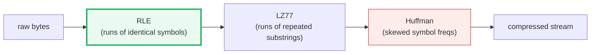

# Run-Length Encoding (RLE) — A Visual, Worked-Example Guide

> **Companion code:** [`rle.py`](./rle.py). **Every number in this guide is
> printed by `uv run python rle.py`** — nothing hand-computed.
>
> **Sibling guide:** [`HUFFMAN.md`](./HUFFMAN.md) — the *other* half of
> DEFLATE. RLE handles **repetition**; Huffman handles **frequency skew**.
> Cross-references are marked 🔗 throughout.
>
> **Live animation:** [`rle.html`](./rle.html) — step the encoder, watch the
> ratio bar, see the 2× expansion failure mode.

---

## 0. TL;DR — the photocopier tray

> **The photocopier analogy (read this first):** You have a tray of 100 copies
> of the **same** page. Scanning all 100 is a waste. Instead you write
> **"100 × (this page)"** on one sticky note. The note and the stack carry the
> same information — but the note is ~100× smaller. That is the whole of RLE.

RLE replaces each maximal **run** (streak of identical symbols) with a single
`(count, symbol)` **token**. No probability model, no tree, no transformation
— just counting.

```
AAAAABBBCC   →   (5,A) (3,B) (2,C)   →   "5A3B2C"
```

One plain sentence: **RLE turns repetition into breakeven arithmetic.** A run
of length *L* costs 2 bytes to encode instead of *L* bytes — so it only wins
when *L* > 2.

---

### Glossary (plain English — refer back any time)

| Term | Plain meaning |
|---|---|
| **symbol** | One element of the input. Here, one ASCII character. In a fax, one black-or-white pixel. In JPEG, one DCT coefficient. |
| **run** | A maximal block of the **same** symbol in a row. `"AAAAA"` is one run of length 5; `"ABABAB"` is six runs of length 1. |
| **token** | The `(count, symbol)` pair emitted per run. Count is one byte, so the longest single run encodable is **255**; longer runs split. |
| **payload** | The sequence of tokens — "the compressed form". |
| **ratio** | `bits_out / bits_in`. `< 1` = we saved space; `> 1` = we bloated. |
| **MAX_RUN** | The cap (255) on a single token's count, set by the one-byte count field. |

---

## 1. The algorithm, in full

RLE is unusually small — two functions. The whole thing:

```python
def rle_encode(data):
    if not data: return []
    tokens, current, count = [], data[0], 1
    for ch in data[1:]:
        if ch == current and count < MAX_RUN:   # extend the run
            count += 1
        else:                                    # symbol changed OR hit the cap
            tokens.append((count, current))
            current, count = ch, 1
    tokens.append((count, current))
    return tokens

def rle_decode(tokens):
    return "".join(symbol * count for count, symbol in tokens)
```

> One plain sentence: **encode walks and counts; decode just repeats.** The
> only subtlety is the `count < MAX_RUN` cap (see [§3](#3-the-255-byte-cap)).

The wire format is fixed-width: **one count byte + one symbol byte = 16 bits
per token**. That is what we measure ratios against. The textbook `"5A3B2C"`
display form is *not* the wire format — it becomes ambiguous once counts hit
double digits (`"12A"` = 12 A's, or 1-of-'2' then 1-of-'A'?).

---

## 2. The worked example (`AAAAABBBCC`)

From `rle.py` **Section A**:

```
input           = "AAAAABBBCC"   (len = 10)

encode step-by-step (emit a token whenever the symbol changes):
  scan A A A A A -> run of 5 A's -> emit (5, 'A')
  scan B B B     -> run of 3 B's -> emit (3, 'B')
  scan C C       -> run of 2 C's -> emit (2, 'C')

tokens (wire)   = [(5, 'A'), (3, 'B'), (2, 'C')]
display form    = "5A3B2C"

decode(tokens)  = "AAAAABBBCC"
[check] round-trip decode(encode(x)) == x ?  True
[check] ratio = bits_out/bits_in = 48/80 = 0.600
        -> saved 40.0% of the space (48 bits vs 80 bits)
```

10 chars → 3 tokens. Three tokens × 16 bits = 48 bits; ten chars × 8 bits =
80 bits. **Ratio 0.600** — saved 40%. Try it live in [`rle.html`](./rle.html)
panel ①.

---

## 3. The 255-byte cap

The count field is one byte, holding `0..255`. A run longer than 255 cannot
fit in one token, so it **splits**:

```
input  = "A" * 300   (len = 300)
tokens = [(255, 'A'), (45, 'A')]
```

From `rle.py` **Section B**, the boundary cases:

| input | tokens | why |
|---|---|---|
| `"A" * 255` | `[(255,'A')]` | exactly fills one count byte |
| `"A" * 256` | `[(255,'A'),(1,'A')]` | one over the cap → split |
| `"A" * 300` | `[(255,'A'),(45,'A')]` | arbitrary long run → 255 + remainder |

The decoder concatenates the runs, so `decode(encode(x)) == x` still holds
exactly. **This cap is the only subtlety in RLE.** Everything else is just
counting.

---

## 4. Compression ratio across data patterns — the headline table

Same algorithm, very different outcomes depending on the data. From
`rle.py` **Section C**:

| pattern | input (shown) | runs | bits_in | bits_out | ratio | verdict |
|---|---|---|---|---|---|---|
| **perfect run** | `AAAAAA...` (×40) | 1 | 320 | 16 | **0.050** | COMPRESSED |
| **run-heavy (fax)** | 20×'.' + 'X' + 19×'.' | 3 | 320 | 48 | **0.150** | COMPRESSED |
| **runs of 2** | `AABBCCDDEEFFGGHH` | 8 | 128 | 128 | **1.000** | breakeven |
| **natural text** | `the quick brown fox` | 19 | 152 | 304 | **2.000** | EXPANDED |
| **alternating** | `ABABAB...` (×20) | 20 | 160 | 320 | **2.000** | EXPANDED |

### The breakeven formula (why RLE has a hard floor)

```
average_run = len(input) / len(tokens)
ratio       = 2 / average_run        (one token = 2 bytes, one symbol = 1 byte)
```

So **breakeven is `average_run == 2`** — and below that, RLE *expands*. The
`rle.py` output proves this holds for every row:

```
  perfect run      : avg_run = 40.00  ->  2/avg_run = 0.050  ==  ratio 0.050
  run-heavy (fax)  : avg_run = 13.33  ->  2/avg_run = 0.150  ==  ratio 0.150
  runs of 2        : avg_run =  2.00  ->  2/avg_run = 1.000  ==  ratio 1.000
  natural text     : avg_run =  1.00  ->  2/avg_run = 2.000  ==  ratio 2.000
  alternating      : avg_run =  1.00  ->  2/avg_run = 2.000  ==  ratio 2.000

[check] ratio == 2 / average_run for every pattern:  OK
```

> **Mental model:** RLE is a bet that the average run is > 2. Fax scans win
> the bet (long white runs); text loses the bet (almost no runs).

---

## 5. The failure mode — alternating data DOUBLES in size

This is the most important thing to know about RLE. From `rle.py`
**Section D**:

```
input  = "AB" * 20   (len = 40)
tokens = 40 runs of length 1 -> 40 x (1, sym) = 80 bytes on the wire

bits_in  = 40 chars x 8  = 320 bits
bits_out = 40 tokens x 16 = 640 bits
ratio    = 2.000   <- the 'compressed' file is 2.0x BIGGER
```

**WHY:** every symbol flip forces a new token, and a length-1 token
`(1,'A')` costs **2 bytes to represent 1 byte**. There is no run to exploit,
so the `(count, symbol)` overhead is pure loss.

This is exactly why RLE is **never** used on its own for general data.
🔗 **DEFLATE** (gzip, PNG) runs **LZ77 first** to turn nearby repeats into
long literal/distance runs, *then* **Huffman-codes** the result. RLE is the
implicit first layer; Huffman is the second (see [`HUFFMAN.md`](./HUFFMAN.md)).

---

## 6. When to use RLE (and when NOT to)

RLE is a **specialist**: brilliant on data with long runs, useless otherwise.
Real systems use it exactly where runs are *guaranteed* by the data's nature.
From `rle.py` **Section E**:

| format | payload | why runs exist | note |
|---|---|---|---|
| **Fax (T.4/T.6)** | monochrome scan | long white runs | 1 token per white scanline → ~100× |
| **BMP BI_RLE8/4** | paletted image | flat color regions | good on icons/logos; optional lossy cap |
| **PCX** | paletted image | scanline runs | splits at count = 63 (6-bit count) |
| **JPEG (AC)** | quantized DCT coeffs | trailing zeros | `ZRL` = 16 zeros; EOB = all rest zero |
| **DEFLATE** | LZ77 + Huffman | LZ77 makes runs | RLE is implicit, **not** standalone |
| **Text (.txt)** | natural language | almost no runs | **DO NOT USE** — expands ~2× |
| **Random bytes** | encrypted / incompressible | no runs by design | **DO NOT USE** — expands ~2× |

> **Rule of thumb:** apply RLE only when you can **guarantee** the average run
> length is well above 2. For everything else, reach for **Huffman**
> (symbol-frequency skew) or **LZW/LZ77** (repetition).

---

## 7. Gold check (the canonical Wikipedia example)

The `rle.html` page re-encodes this exact string in JS and verifies the token
list + ratio match `rle.py` **Section F**:

```
gold input = "WWWWWWWWWWWWBWWWWWWWWWWWWBBBWWWWWWWWWWWWWWWWWWWWWWWWBWWWWWWWWWWWWWW"

gold tokens = [(12, 'W'), (1, 'B'), (12, 'W'), (3, 'B'), (24, 'W'), (1, 'B'), (14, 'W')]
gold display = "12W1B12W3B24W1B14W"

[check] gold round-trip decode(encode(x)) == x ?  True
[check] gold ratio = 0.2090  (7 tokens x 16 bits / 67 chars x 8 bits)
```

67 chars → 7 tokens. Ratio **0.209** — saved ~79%. This is what a fax scan
looks like: long runs of white (W) interrupted by occasional black (B).

---

## 8. Where RLE sits in the compression stack



RLE is the **simplest, most local** layer: it only sees adjacent identical
symbols. LZ77 generalizes it to *non-adjacent* repeats (copies). Huffman then
 squeezes the resulting symbol stream by frequency. Each layer catches a
different kind of redundancy; together they are DEFLATE.

| layer | redundancy it catches | needs |
|---|---|---|
| **RLE** | identical adjacent symbols | avg run > 2 |
| **LZ77** 🔗 | repeated substrings (nearby or far) | a sliding window |
| **Huffman** 🔗 | skewed symbol frequencies | a frequency table |

---

### References

- Huffman, D. (1952) — see [`HUFFMAN.md`](./HUFFMAN.md).
- Deutsch, P. (1996), *DEFLATE Compressed Data Format*, RFC 1951 — LZ77 +
  Huffman (no standalone RLE).
- ITU-T T.4 / T.6 — fax Group 3/4, the canonical RLE-on-white use case.
- Microsoft DIB spec — `BI_RLE8` / `BI_RLE4` (4-bit and 8-bit RLE for BMP).
