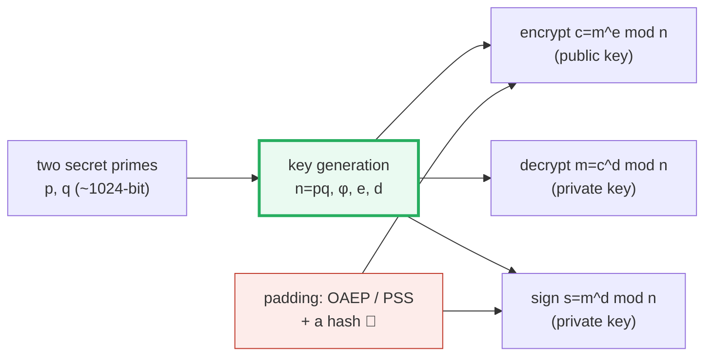

# RSA Public-Key Cryptosystem — A Visual, Worked-Example Guide

> **Companion code:** [`rsa.py`](./rsa.py). **Every number in this guide is
> printed by `uv run python rsa.py`** — nothing hand-computed.
>
> **Sibling guide:** [`SHA256.md`](./SHA256.md) — the cryptographic hash that
> real RSA deployments rely on for padding (OAEP/PSS). Cross-references are
> marked 🔗 throughout.
>
> **Live animation:** [`rsa.html`](./rsa.html) — step key generation,
> encrypt/decrypt, and sign/verify with the toy keys.

---

## 0. TL;DR — the one-way padlock

> **The padlock analogy (read this first):** You hand out **open padlocks**
> (the **public key**) to anyone — they can snap one shut on a box
> (**encrypt**). But only **you** hold the **key** (the **private key**) that
> opens a locked box (**decrypt**). Making the lock is cheap; picking it is
> astronomically hard. That is RSA in one image.

```
public  key  (n, e)  ── publish ──>  anyone can encrypt:   c = m^e mod n
private key  (n, d)  ── keep secret ─> only you can decrypt: m = c^d mod n
```

One plain sentence: **RSA turns the difficulty of factoring into a one-way
math operation** — `m^e mod n` is easy, but finding the `e`-th root mod `n`
without `d` requires factoring `n`, which (we believe) is infeasible for large
`n`.

> ⚠️ **This guide uses toy primes `p=61, q=53` so every number is printable.**
> Real RSA uses ~1024-bit primes. The math is identical — only the bit-lengths
> change. **Never use these numbers for real secrecy.**

---

### Glossary (plain English — refer back any time)

| Term | Plain meaning |
|---|---|
| **primes `p, q`** | Two large secret primes — the "ingredients" of the key. |
| **modulus `n`** | `n = p * q`. Part of **both** keys. All arithmetic is mod `n`; messages must be `< n`. |
| **totient `φ`** | `φ(n) = (p-1)(q-1)` — how many numbers `< n` are coprime to `n`. **Secret** — knowing it is as good as knowing `p` and `q`. |
| **public exp `e`** | Coprime to `φ`. The pair `(n, e)` is the **public key**. |
| **private exp `d`** | `d = e⁻¹ mod φ` — the modular inverse of `e`. The pair `(n, d)` is the **private key**. |
| **plaintext `m`** | The message number, `0 ≤ m < n`. |
| **ciphertext `c`** | `c = m^e mod n`. Looks random; only `d` undoes it. |
| **signature `s`** | `s = m^d mod n` — sign with the **private** key. |
| **verify** | Check `s^e mod n == m` — anyone verifies with the **public** key. |

---

## 1. The algorithm, in full

RSA is small — four functions. The whole thing:

```python
def generate_keypair(p, q, e=17):
    n = p * q
    phi = (p - 1) * (q - 1)
    d = mod_inverse(e, phi)          # e*d ≡ 1 (mod φ), via extended Euclid
    return (n, e), (n, d)            # public, private

def encrypt(m, public):  n, e = public;  return pow(m, e, n)    # c = m^e mod n
def decrypt(c, private): n, d = private; return pow(c, d, n)    # m = c^d mod n
def sign(m, private):    n, d = private; return pow(m, d, n)    # s = m^d mod n
def verify(s, public):   n, e = public;  return pow(s, e, n)    # m = s^e mod n
```

> One plain sentence: **encrypt raises to `e`, decrypt raises to `d`; `d` is
> the secret that undoes `e` because `e·d ≡ 1 (mod φ)`.** Signatures flip the
> roles (sign with `d`, verify with `e`).

The `pow(m, e, n)` calls use **square-and-multiply** modular exponentiation,
which is why even 2048-bit exponents are fast — and why the reverse (finding
`d` without `φ`) is not.

---

## 2. Key generation — the one-way padlock factory

From `rsa.py` **Section A**, with `p=61, q=53, e=17`:

```
modulus    n = p*q        = 61*53   = 3233
totient    φ = (p-1)(q-1) = 60*52   = 3120

[check] gcd(e=17, φ=3120) = 1  ->  e is a valid exponent
private exponent d = e^-1 mod φ = 17^-1 mod 3120 = 2753
[check] e*d mod φ = 17*2753 mod 3120 = 1   (must be 1)

PUBLIC  key = (n=3233, e=17)    <- publish this; anyone may encrypt
PRIVATE key = (n=3233, d=2753)  <- keep secret; only you can decrypt
```

**Why `φ` must stay secret:** an attacker who knows `φ` computes
`d = e⁻¹ mod φ` instantly — `φ` is exactly as valuable as knowing `p` and `q`.
And computing `φ` from `n` alone *requires* factoring `n`. That is the whole
security argument in one line.

---

## 3. Encrypt + decrypt — the worked example

From `rsa.py` **Section B**:

```
plaintext m = 65   (ASCII 'A'; note m < n=3233)

ENCRYPT  with public key (n=3233, e=17):
  c = m^e mod n = 65^17 mod 3233 = 2790

DECRYPT  with private key (n=3233, d=2753):
  m = c^d mod n = 2790^2753 mod 3233 = 65

[check] decrypt(encrypt(65)) == 65 ?  True
```

A 3-character message, character by character:

```
--- a 3-character message 'CAT' ---
  'C' m= 67 -> c= 641 -> decrypt= 67 ✓
  'A' m= 65 -> c=2790 -> decrypt= 65 ✓
  'T' m= 84 -> c=2159 -> decrypt= 84 ✓
```

Each character is an independent `m < n`. (Real RSA doesn't encrypt char by
char — it encrypts a padded block, or more commonly uses RSA only to wrap a
symmetric key. See [§6](#6-security-properties--textbook-rsa-is-not-secure).)

---

## 4. Sign + verify — digital signatures

Signatures **flip** the roles of `e` and `d`. From `rsa.py` **Section C**:

```
SIGN   with PRIVATE key (n=3233, d=2753):  s = m^d mod n
VERIFY with PUBLIC  key (n=3233, e=17):    recover m = s^e mod n

plaintext m = 42
signature  s = m^d mod n = 42^2753 mod 3233 = 3065

verify: s^e mod n = 3065^17 mod 3233 = 42
[check] verify(sign(42)) == 42 ?  True
```

You sign with the **private** key, so only **you** could have produced `s`.
Anyone verifies with the **public** key. This is the basis of code signing,
TLS certificates, and blockchain transactions.

**Forgery fails:** an attacker who sends a made-up `s' = 999` (not a real
signature):

```
Forgery attempt: an attacker sends s' = 999 (not a real signature):
  verify(999) = 999^17 mod 3233 = 2464   != 42  -> REJECTED
[check] a forged signature fails verification:  OK
```

---

## 5. Why it works — Euler's theorem (the correctness proof)

We built `d` so that `e·d ≡ 1 (mod φ)`. **Why** does that make decryption
undo encryption? The answer is **Euler's theorem**:

> **Euler's theorem:** if `gcd(m, n) = 1`, then `m^φ(n) ≡ 1 (mod n)`.

Since `e·d ≡ 1 (mod φ)`, write `e·d = 1 + k·φ` for some integer `k`:

```
m^(e·d) = m^(1 + k·φ) = m · (m^φ)^k ≡ m · 1^k = m   (mod n)
```

So `(m^e)^d = m^(e·d) ≡ m (mod n)`. Encrypt then decrypt gives `m` back. From
`rsa.py` **Section D**:

```
For our keys: e*d = 17*2753 = 46801 = 1 + 15*φ  (check: 1+15*3120 = 46801)

Euler's theorem in action — m^φ ≡ 1 (mod n) for coprime m:

| m  | gcd(m,n) | m^φ mod n |
|----|----------|-----------|
| 2  | 1        | 1        |  <- coprime -> 1
| 7  | 1        | 1        |  <- coprime -> 1
| 65 | 1        | 1        |  <- coprime -> 1
| 100 | 1        | 1        |  <- coprime -> 1
```

> **Mental model:** `e·d` is secretly `1` (mod `φ`). Euler's theorem lets us
> "throw away" whole multiples of `φ` from the exponent, leaving a single `m`.

### How `d` is computed — the extended Euclidean algorithm

`d` is the modular inverse of `e`. The extended Euclidean algorithm finds
`x, y` with `e·x + φ·y = gcd(e, φ) = 1`; then `d = x mod φ`. Trace for
`e=17, φ=3120`:

```
| step |   a    |   b    |  q=a//b  |  r=a%b  |
|------|--------|--------|----------|---------|
| 0    | 17     | 3120   | 0        | 17      |
| 1    | 3120   | 17     | 183      | 9       |
| 2    | 17     | 9      | 1        | 8       |
| 3    | 9      | 8      | 1        | 1       |
| 4    | 8      | 1      | 8        | 0       |
| 5    | 1      | 0      |  (gcd)   |         |  <- gcd=1

Result: gcd=1, x=-367, y=2
  check: e*x + φ*y = 17*-367 + 3120*2 = 1 (== gcd=1)
  d = x mod φ = 2753
```

---

## 6. Security properties — textbook RSA is NOT secure

RSA's security rests **entirely** on one assumption, from `rsa.py`
**Section E**:

> **Factoring `n = p·q` is hard for an attacker who knows only `n`.**

Because every other secret follows from `p` and `q`:
`know p,q → φ=(p-1)(q-1) → d=e⁻¹ mod φ → private key.`

For the toy `n` this is trivial (`factor(3233) = 61 * 53`), but the difficulty
**explodes** with bit-length:

| RSA modulus | bit-length | factoring effort | status |
|---|---|---|---|
| `p=61,q=53` (toy) | 12 | instant | **BROKEN** (trivial) |
| 512-bit | 512 | ~weeks on a cluster | **BROKEN** (2009) |
| 768-bit | 768 | ~1500 CPU-years (record) | **BROKEN** (2009, Kleinjung) |
| 1024-bit | 1024 | estimated feasible for nation-states | deprecated |
| 2048-bit | 2048 | infeasible today | **current minimum** |
| 3072-bit | 3072 | infeasible for decades | recommended |
| 4096-bit | 4096 | very hard; diminishing returns | conservative |

> **The gap between "easy to multiply" and "hard to factor" is RSA's whole
> leverage:** multiplying two 1024-bit primes to get `n` is fast, but
> recovering them from `n` alone is (we believe) infeasible.

### The malleability problem (why padding is mandatory)

**Textbook RSA** (what this file implements) is **not** secure as-is. Without
padding, RSA is **multiplicatively homomorphic** — an attacker can combine
ciphertexts without decrypting:

```
enc(7)*enc(11) mod n = 2369*3061 mod 3233 = 3123
enc(7*11) = enc(77)            = 3123
equal? True   <- an attacker can combine ciphertexts
```

That is why real RSA wraps every `m` in **randomized padding** before
exponentiating:
- **OAEP** (Optimal Asymmetric Encryption Padding) for encryption.
- **PSS** (Probabilistic Signature Scheme) for signatures.

🔗 The padding is **hashed** — see [`SHA256.md`](./SHA256.md) for how a
cryptographic hash is built from scratch.

| property | textbook RSA (this guide) | real RSA (OAEP/PSS) |
|---|---|---|
| malleable | ✗ yes (ciphertexts combinable) | ✓ no (padding breaks it) |
| deterministic | ✗ same `m` → same `c` | ✓ no (randomized padding) |
| chosen-ciphertext secure | ✗ no | ✓ yes (under assumptions) |

---

## 7. Gold check (values pinned for `rsa.html`)

The `rsa.html` page re-derives `(n, e, d)` from `p=61, q=53` and recomputes
these in JS, checking against `rsa.py` **Section F**:

```
Keys: p=61, q=53, n=3233, e=17, d=2753

GOLD encrypt:  m=65 ('A')  ->  c = m^e mod n = 2790
GOLD decrypt:  c=2790  ->  m = c^d mod n = 65
GOLD sign:     m=42  ->  s = m^d mod n = 3065
GOLD verify:   s=3065  ->  m = s^e mod n = 42

GOLD scalar (compact .html check): encrypt(65) = 2790
GOLD scalar (compact .html check): verify(sign(42)) = 42
```

---

## 8. Where RSA sits in the crypto stack



| layer | what it does | needs |
|---|---|---|
| **primes `p, q`** | the secret ingredients | a secure RNG + primality test |
| **key generation** | builds `n, φ, e, d` | extended Euclid for `d` |
| **encrypt/decrypt** | `m^e mod n` / `c^d mod n` | modular exponentiation |
| **padding** 🔗 | defeats malleability & replay | a cryptographic hash (SHA-256) |

---

### References

- Rivest, Shamir, Adleman (1978), *A Method for Obtaining Digital Signatures
  and Public-Key Cryptosystems*, CACM 21(2). The original RSA paper.
- Diffie & Hellman (1976), *New Directions in Cryptography* — introduced
  public-key cryptography.
- PKCS#1 / RFC 8017 — OAEP and PSS padding schemes (what real RSA uses).
- Shor (1994) — quantum factoring algorithm; RSA's eventual doom on a large
  quantum computer.
- 🔗 [`SHA256.md`](./SHA256.md) — the hash that OAEP/PSS padding relies on.
