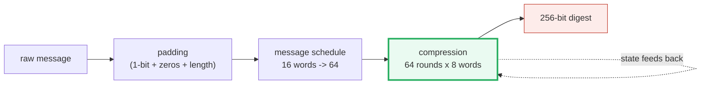

# SHA-256 Hash — A Visual, Worked-Example Guide

> **Companion code:** [`sha256.py`](./sha256.py). **Every number in this guide
> is printed by `uv run python sha256.py`** — nothing hand-computed. The
> implementation is from scratch and verified against `hashlib` + the NIST
> test vectors.
>
> **Sibling guide:** [`RSA.md`](./RSA.md) — real RSA padding (OAEP/PSS) hashes
> its message with SHA-256. Cross-references are marked 🔗 throughout.
>
> **Live animation:** [`sha256.html`](./sha256.html) — step padding, the
> message schedule, and the 64-round compression on `b"abc"`.

---

## 0. TL;DR — the meat grinder

> **The meat-grinder analogy (read this first):** You feed the input in
> fist-sized chunks (**512-bit blocks**) through a grinder with fixed blades
> (the **compression function**). After every chunk, the grinder's internal
> state (**256 bits = eight 32-bit words**) gets mashed with that chunk.
> Read off the final state — **that is the hash**. It is one-way because the
> blades mix everything irreversibly: you cannot un-grind the state back to
> the input.

```
message  ──pad──>  512-bit blocks  ──compress (64 rounds each)──>  256-bit hash
                          ^                                  │
                          └──── state feeds back in ─────────┘
```

One plain sentence: **SHA-256 is an iterated one-way meat grinder** — each
512-bit block is mixed into a 256-bit state through 64 rounds of bit
shuffling, and the final state *is* the digest. The same input always gives
the same output; one flipped bit scrambles ~half the output bits.

---

### Glossary (plain English — refer back any time)

| Term | Plain meaning |
|---|---|
| **word** | A 32-bit unsigned integer. All arithmetic is mod 2³². |
| **block** | A 512-bit chunk of the padded message = 16 words. |
| **schedule `W`** | The 64-word working array built from one block (first 16 = the block; next 48 = derived by mixing). |
| **state `a..h`** | The 8 working words, carried block-to-block. Initialized to the IV; after the final block, `H[i] += state[i]` gives the hash. |
| **IV / `H`** | The 8 initial hash words — square roots of the first 8 primes. |
| **`K`** | The 64 round constants — cube roots of the first 64 primes. |
| **round** | One iteration of the compression: rotate `a..h`, inject `T1, T2`. |
| **avalanche** | One input bit flip changes ~half the output bits. |

---

## 1. The algorithm, in full

SHA-256 has three stages. The whole thing:

```python
def sha256(data):
    words = pad_message(data)               # §2: pad to 512-bit blocks
    H = list(IV)                            # 8 words: sqrt of first 8 primes
    for each 16-word block:
        W = build_schedule(block)           # §3: expand 16 words -> 64
        new = compress(H, W)                # §4: 64 rounds of bit-mixing
        H = [(H[i] + new[i]) & MASK for i in range(8)]
    return "".join(f"{w:08x}" for w in H)   # 8 words -> 256-bit hex digest
```

> One plain sentence: **pad, then grind each block's 64-word schedule through
> the 8-word state for 64 rounds, adding the result into the running hash.**
> The final 8 words concatenate into the digest.

The bit primitives (all mod 2³²):

```
ROTR(x,n) = (x>>n) | (x<<(32-n))     right rotation within 32 bits
Ch(x,y,z) = (x&y) ^ (~x&z)            choose z where x=0, y where x=1
Maj(x,y,z)= (x&y) ^ (x&z) ^ (y&z)     majority vote
Σ0(x) = ROTR(x,2)^ROTR(x,13)^ROTR(x,22)   big sigma (on a)
Σ1(x) = ROTR(x,6)^ROTR(x,11)^ROTR(x,25)   big sigma (on e)
σ0(x) = ROTR(x,7)^ROTR(x,18)^SHR(x,3)     small sigma (schedule)
σ1(x) = ROTR(x,17)^ROTR(x,19)^SHR(x,10)   small sigma (schedule)
```

---

## 2. The constants — nothing-up-my-sleeve

Every constant in SHA-256 is derived from **prime numbers**, so the designers
could not have hidden a weakness in them. From `sha256.py` **Section A**:

```
K[t] = floor( 2^32 * frac( prime[t]^(1/3) ) )   t = 0..63
H[i] = floor( 2^32 * frac( prime[i]^(1/2) ) )   i = 0..7

First 8 primes: 2, 3, 5, 7, 11, 13, 17, 19

| i | prime | root |  constant (hex) | recomputed (hex) | match |
|---|-------|------|-----------------|------------------|-------|
| 0 | 2     | ∛    | 0x428a2f98      | 0x428a2f98       | OK    |
| 1 | 3     | ∛    | 0x71374491      | 0x71374491       | OK    |
| ... (all 64 K + all 8 H verify) ...                                   |
| 0 | 2     | √    | 0x6a09e667      | 0x6a09e667       | OK    |
| 1 | 3     | √    | 0xbb67ae85      | 0xbb67ae85       | OK    |

[check] all 64 K constants match ∛(prime) fractional parts?  True
[check] all 8  H constants match √(prime) fractional parts?   True
```

> **Why this matters:** if the constants were arbitrary, skeptics could suspect
> a trapdoor. By deriving them from primes via a simple public formula, the
> designers proved there is "nothing up their sleeve." (The same trick is used
> in Blowfish's π digits and Keccak's round constants.)

---

## 3. Padding — the Merkle-Damgård preprocessing

A 512-bit block holds 16 words. `"abc"` is only 24 bits, so we must **pad** it
to 512 bits. From `sha256.py` **Section B**, the padding has three parts:

1. **the message bits:** `0x61 0x62 0x63` (`'a','b','c'`)
2. **a single `'1'` bit:** `0x80` (the stop bit, then seven `'0'` bits)
3. **`'0'` bits** until `448 mod 512`, **then the 64-bit length**

```
input = b'abc'   (3 bytes = 24 bits)
After padding: 16 words = 512 bits = 1 block(s)

| word | hex        | meaning                                  |
|------|------------|------------------------------------------|
| 0    | 0x61626380 | 'a','b','c' then the 0x80 stop bit       |
| 1-13 | 0x00000000 | zero padding                             |
| 14   | 0x00000000 | high 32 bits of length (0)               |
| 15   | 0x00000018 | low 32 bits of length (24 bits = 0x18)   |

message length in bits = 3 bytes * 8 = 24 = 0x18
[check] last word == bit-length?  24 == 24  OK
[check] padded length % 512 == 0?  512 % 512 = 0  OK
```

The 64-bit **length field** is appended last (reserving the final 64 bits of
the block). It binds the hash to the exact message length, partly defending
against length-extension tricks. A message longer than 448 bits in a block
spills into a second block — the schedule + compression simply runs once per
block.

---

## 4. The message schedule — 16 block words → 64

The first 16 schedule words ARE the padded block (copied). Words 16..63 are
**derived** by mixing earlier words. From `sha256.py` **Section C**:

```
W[t] = σ1(W[t-2]) + W[t-7] + σ0(W[t-15]) + W[t-16]   (mod 2^32)

| t  | W[t] (hex)    | source                          |
|----|---------------|---------------------------------|
| 0  | 0x61626380    | block word (copy)               |
| 15 | 0x00000018    | block word (copy)               |
| 16 | 0x61626380    | σ1(W[14])+W[9]+σ0(W[1])+W[0]    |
| 17 | 0x000f0000    | σ1(W[15])+W[10]+σ0(W[2])+W[1]   |
| ...  | ...           | (all 64 derived by the same formula) |
| 63 | 0x12b1edeb    | σ1(W[61])+W[56]+σ0(W[48])+W[47] |

Avalanche check: flip 'abc'->'abd' (1 bit) -> 46/64 schedule words differ.
```

`σ0` and `σ1` are rotates+shifts that spread bits around. The derived words
look random **even though the input was almost all zeros** — that is the
bit-mixing doing its job. This expansion is why flipping ONE input bit
changes most of `W[t]`, which then avalanches through every round.

---

## 5. The compression function — 64 rounds, round by round

Start the state at the IV (the 8 `H` constants). Each round computes:

```
T1 = h + Σ1(e) + Ch(e,f,g) + K[t] + W[t]
T2 = Σ0(a) + Maj(a,b,c)
then shift the register: a<-T1+T2, e<-d+T1, and h<-g<-f<-e<-d<-c<-b
```

From `sha256.py` **Section D**:

```
initial state (the IV):
  a=0x6a09e667  e=0x510e527f

| t  | a after round  | e after round  | T1             | T2             |
|----|----------------|----------------|----------------|----------------|
| 0  | 0x5d6aebcd     | 0xfa2a4622     | 0x54da50e8     | 0x08909ae5     |
| 1  | 0x5a6ad9ad     | 0x78ce7989     | 0x3c5f8617     | 0x1e0b5396     |
| 2  | 0xc8c347a7     | 0xf92939eb     | 0x3dc18b66     | 0x8b01bc41     |
| ...  | (rounds 3-62 run identically; each remixes all 8 words)         |
| 63 | 0x506e3058     | 0x5ef50f24     | 0xa8467f25     | 0xa827b133     |
```

After 64 rounds, **add** the new state into the IV to get the hash words:

```
H[0] = 0x6a09e667 + 0x506e3058 = 0xba7816bf
H[1] = 0xbb67ae85 + 0xd39a2165 = 0x8f01cfea
... (8 words)

final digest = ba7816bf8f01cfea414140de5dae2223b00361a396177a9cb410ff61f20015ad
[check] matches hashlib.sha256(b'abc')?  True
```

> **Mental model:** think of the 8 words `a..h` as a row of 8 buckets. Each
> round pours `W[t]` and `K[t]` into the buckets, then **rotates** the whole
> row one step to the right while stirring (`Σ`, `Ch`, `Maj`). After 64 rounds
> the original IV is unrecognizable — but deterministically so.

---

## 6. Verification + avalanche — does it match NIST?

The real test of a from-scratch SHA-256: does it match the official NIST test
vectors and Python's `hashlib`? From `sha256.py` **Section E**:

```
| input          | our sha256      | hashlib         | NIST            | match |
|----------------|-----------------|-----------------|-----------------|-------|
| (empty)        | e3b0c44298fc... | e3b0c44298fc... | e3b0c44298fc... | OK    |
| abc            | ba7816bf8f01... | ba7816bf8f01... | ba7816bf8f01... | OK    |
| abcdbcde...nopq| 248d6a61d206... | 248d6a61d206... | 248d6a61d206... | OK    |
| hello world    | b94d27b9934d... | b94d27b9934d... | b94d27b9934d... | OK    |

[check] all 4 test vectors match hashlib + NIST?  True
```

The **avalanche** effect — the defining property of a good hash:

```
Avalanche: sha256('hello') vs sha256('hellp') (1-bit input change)
  131 / 256 output bits differ (51.2%)  <- near the ideal 50%
  2cf24dba5fb0a30e26e83b2ac5b9e29e1b161e5c1fa7425e73043362938b9824
  fdd7585e08c4e2afd71dcabdb4636c89d557a3f42db9e2040c8bbd1708aa4ce7
```

One input bit flips → **131 of 256 output bits** change. There is no visible
correlation between the two digests. This is what makes SHA-256 useful for
integrity checks, commit IDs, and 🔗 RSA padding.

---

## 7. Gold check (values pinned for `sha256.html`)

The `sha256.html` page re-runs the SHA-256 compression in JS from the same IV
and `"abc"` block, checking the schedule, round values, and final digest
against `sha256.py` **Section F**:

```
gold input = b'abc'

gold padded block (16 words):
  W[0] = 0x61626380      W[15] = 0x00000018   (W[1..14] = 0)

gold schedule (sampled):
  W[0] = 0x61626380   W[15] = 0x00000018
  W[16] = 0x61626380  W[17] = 0x000f0000   W[63] = 0x12b1edeb

gold round values (a, e, T1, T2):
  round 0 : a=0x5d6aebcd  e=0xfa2a4622  T1=0x54da50e8  T2=0x08909ae5
  round 1 : a=0x5a6ad9ad  e=0x78ce7989  T1=0x3c5f8617  T2=0x1e0b5396
  round 63: a=0x506e3058  e=0x5ef50f24  T1=0xa8467f25  T2=0xa827b133

gold digest = ba7816bf8f01cfea414140de5dae2223b00361a396177a9cb410ff61f20015ad
[check] gold digest matches hashlib?  True
```

---

## 8. Where SHA-256 sits in the crypto stack



| stage | what it does | key idea |
|---|---|---|
| **padding** | make length a multiple of 512 bits | the 64-bit length field |
| **schedule** | expand 16 block words → 64 | `σ0, σ1` mixing |
| **compression** | 64 rounds of bit-shuffling on 8 words | `Ch`, `Maj`, `Σ0, Σ1`, constants `K` |
| **finalize** | `H[i] += state[i]`, concatenate | the 8 words ARE the digest |

SHA-256's one weakness is **length extension** (an artifact of Merkle-Damgård):
given `H(secret ‖ message)` you can compute `H(secret ‖ message ‖ padding ‖
extra)` without knowing `secret`. This is why HMAC-SHA256 wraps the hash for
MACs, and why 🔗 RSA-PSS/OAEP structure their padding carefully.

---

### References

- NIST FIPS 180-4 (2015), *Secure Hash Standard* — the authoritative SHA-256
  spec this implementation follows.
- Merkle (1989) / Damgård (1989) — the iterate-compress construction.
- Rivest (1992), *The MD5 Message-Digest Algorithm*, RFC 1321 — the
  word-mixing style SHA inherits.
- SHA-3 / Keccak (NIST FIPS 202) — the sponge-construction successor, immune
  to length extension.
- 🔗 [`RSA.md`](./RSA.md) — real RSA padding (OAEP/PSS) hashes with SHA-256.
