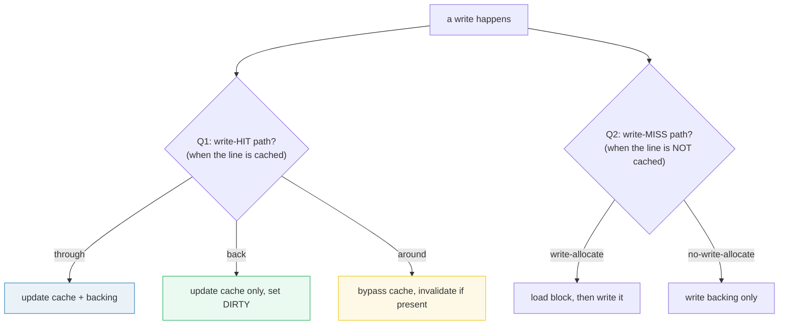
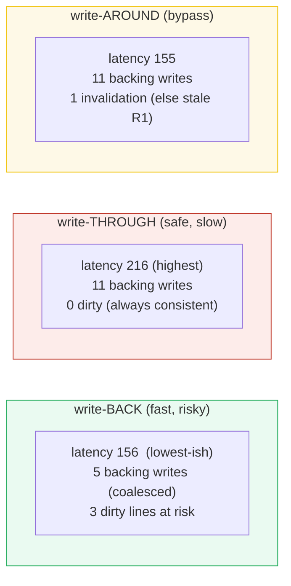

# Cache Write Policies — A Visual, Worked-Example Guide

> **Companion code:** [`write_policies.py`](./write_policies.py). **Every number
> in this guide is printed by `uv run python write_policies.py`** — nothing
> hand-computed.
>
> **Sibling guides:** [`LFU_CACHE.md`](./LFU_CACHE.md) and
> [`ARC_CACHE.md`](./ARC_CACHE.md) answer *who leaves* the cache on a miss.
> This guide answers the other half: *when a write happens, which copy do I
> update?* Cross-references marked 🔗 throughout.
>
> **Live animation:** [`write_policies.html`](./write_policies.html) — step a
> write/read workload through five policies and watch latency, backing writes,
> and the dirty bits diverge.

---

## 0. TL;DR — the desk, the filing cabinet, and the safe

> **The analogy (read this first):** You keep a notepad on your **desk** (the
> cache, fast) and the authoritative record in a **filing cabinet** down the
> hall (the backing store, slow). Reads are easy — glance at the notepad, and
> if it's missing, walk to the cabinet. **Writes are the hard part**, because
> now there are *two* copies and a decision: which do I update?
>
> - **Write-through:** update the notepad **and** walk to the cabinet each time.
>   The cabinet is always right. Safe — but every write costs a walk.
> - **Write-back:** scribble on the notepad, mark it with a sticky note
>   (**dirty**), and walk to the cabinet **later**. Fast — ten edits to one page
>   become one trip (**coalesced**) — but if the building catches fire before
>   the trip, those edits are gone.
> - **Write-around:** skip the notepad entirely — walk straight to the cabinet,
>   and **throw out** the notepad page if it's there. Write-only junk (logs,
>   bulk loads) never clutters the desk — but reading it back is a walk.

A read is a single decision (hit/miss). A **write** is **two** independent
decisions, and that is why the "write policy" space is two-dimensional:



> **One-line definition:** a cache's write policy answers **(a)** what to do on
> a *write hit* — **through** (both copies), **back** (cache only + dirty bit),
> or **around** (bypass) — and **(b)** what to do on a *write miss* —
> **write-allocate** (load-then-write) or **no-write-allocate** (write backing
> only). Reads are not a choice: always allocate on a read miss.

### Glossary (plain English — refer back any time)

| Term | Plain meaning |
|---|---|
| **dirty bit** | A per-line flag = "the cache copy is newer than the backing copy; a flush is owed." Set by write-back writes; cleared by a writeback. |
| **writeback** | Copying a dirty line back to the backing store. Triggered by evicting a dirty line or an explicit flush. Costs one backing write. |
| **invalidate** | Dropping a cache line **without** writing it back (the backing store already has the fresh data). Used by write-around. |
| **coalescing** | Several writes to the same dirty block become **one** writeback. The main performance win of write-back. |
| **consistency** | Whether the backing store always reflects the latest writes. through / around: **yes**. back: **no** (stale until flush). |

---

## 1. The two-axis space — the four combos hardware actually ships

The two axes compose into the policies real systems use:

| hit \\ miss | **write-allocate** | **no-write-allocate** |
|---|---|---|
| **THROUGH** | simple, safe, slow writes | strict "write-around" write path |
| **BACK** | **CPU L1/L2** — fast, coalesced, crash-risky | some DB buffer pools |
| AROUND | (n/a — around bypasses on *every* write) | |

> 🔗 Reads are **not** a choice: a read miss always loads the block into the
> cache (you clearly want it). Only writes get the two-axis freedom.

---

## 2. The headline — write-back coalesces, write-through doesn't

Consider the first three ops of the workload: **`W0 W0 W0`** — write address 0
three times. Same block, three times.

> From `write_policies.py` **Section B**:
>
> | policy | what W0,W0,W0 do | cost (T_CACHE=1, T_BACK=10) | backing writes |
> |---|---|---|---|
> | **write-back** | hit the same line 3×, set dirty **once** | `3 × 1 = 3` | **0** (deferred to one writeback) |
> | **write-through** | write cache **and** backing each time | `3 × (1+10) = 33` | **3** |
>
> **11× cheaper**, and `3` backing writes collapse to at most `1`. This is the
> *entire* reason CPU caches and database buffer pools use write-back: writes to
> a hot line are **coalesced** into a single eventual writeback. The price is
> the dirty bit.

---

## 3. All five policies on the same workload

The workload (`capacity = 4`, `T_CACHE = 1`, `T_BACK = 10`) is built to expose
every divergence:

```
W0 W0 W0  R1  W1  R1  W2 R2  W3 W3  R0  W4 W5 W6 W7  R0
```

Note ops 4–6: `R1` brings 1 into the cache, `W1` writes that **same** cached
line, `R1` re-reads it. This is where the policies visibly split:

- **write-back**: `W1` hits the cached line (dirty); `R1` is a **hit**.
- **write-through**: `W1` hits (cache + backing); `R1` is a **hit**.
- **write-around**: `W1` **invalidates** the cached line; `R1` is a **miss**
  (reloads the fresh value from backing — the *only* reason it isn't stale).

> From `write_policies.py` **Section C**:
>
> | policy | latency | bk_reads | bk_writes | dirty | writebacks |
> |---|---|---|---|---|---|
> | write-through + write-allocate | 216 | 9 | 11 | 0 | 0 |
> | write-through + no-write-allocate | 146 | 3 | 11 | 0 | 0 |
> | **write-back + write-allocate** | **156** | 9 | **5** | **3** | 5 |
> | write-back + no-write-allocate | 136 | 3 | 10 | 1 | 0 |
> | write-around | 155 | 4 | 11 | 0 | 0 |



**Read it as the three-way trade-off:**

- **write-back**: fewest backing writes (coalescing!), but **3 dirty lines** are
  at risk if the power drops before their writeback.
- **write-through**: always consistent, but pays `T_BACK` on every write — no
  coalescing, most backing-store wear.
- **write-around**: the cache never fills with write-only junk, **but** the
  invalidation at `W1` is the *only* thing saving the later `R1` from serving a
  **stale** cached value (the classic write-around bug).

---

## 4. Consistency vs latency — the durability question

After the workload, is the backing store guaranteed to hold every write? Only
if there are **no dirty lines**, or a flush has run.

> From `write_policies.py` **Section D**:
>
> | policy | dirty before flush | consistent before flush? |
> |---|---|---|
> | write-through + write-allocate | 0 | **YES** |
> | write-through + no-write-allocate | 0 | **YES** |
> | **write-back + write-allocate** | **3** | **NO (crash loses data)** |
> | write-back + no-write-allocate | 1 | NO (crash loses data) |
> | write-around | 0 | YES |

- **write-through / write-around:** the backing store is *always* the source of
  truth. A crash at any instant loses **nothing**. Cost: every write pays
  `T_BACK`, and there is no coalescing.
- **write-back:** the backing store is **stale** for every dirty line. A crash
  before the writeback loses those writes. The mitigations are the entire reason
  databases and filesystems have journals:
  - **WAL / journaling** — durably log the *intent* first, so a crash can
    **replay** unfinished writebacks.
  - **`fsync` / explicit flush** at commit boundaries — forces the writeback.
  - **Battery-backed NVRAM** — the "dirty" window survives a power cut.

---

## 5. The latency model, in full

For the deterministic trace (`T_CACHE = 1`, `T_BACK = 10`):

| event | latency |
|---|---|
| read hit | `1` |
| read miss | `10` (fetch) + `1` = `11` |
| write-through hit | `1` + `10` = `11` |
| write-through miss + allocate | `10` (load) + `1` + `10` = `21` |
| write-through miss + no-allocate | `10` |
| write-back hit | `1` (set dirty) |
| write-back miss + allocate | `10` (load) + `1` = `11` |
| write-back miss + no-allocate | `10` |
| write-around (any) | `10` (+ invalidate) |
| **evict a DIRTY line** | **+ `10`** (a writeback) |

> 🔗 This is the *write* side of caching. The *read/eviction* side — *who* the
> dirty line pushes out when it's finally written back — is governed by the
> eviction policy in [`LFU_CACHE.md`](./LFU_CACHE.md) /
> [`ARC_CACHE.md`](./ARC_CACHE.md).

---

## Sources

- Hennessy & Patterson, *"Computer Architecture: A Quantitative Approach"*,
  Appendix B (the memory hierarchy) — the canonical write-policy treatment.
- SQLite / PostgreSQL buffer managers — write-back variants tuned for
  durability via WAL.
- Mohan et al., *"ARIES: A Transaction Recovery Method..."* (1992) — the
  WAL/journaling machinery that makes write-back crash-safe.
