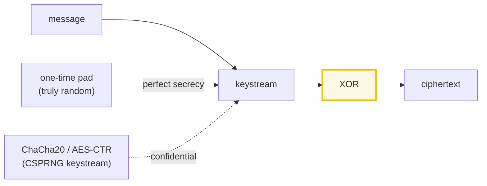

# XOR Stream Cipher — One-Time Pad, Vigenère, and Catastrophic Key Reuse

> **Companion code:** [`xor_cipher.py`](./xor_cipher.py). **Every number in this
> guide is printed by `uv run python xor_cipher.py`** — nothing hand-computed.
>
> **Sibling guide:** [`AES_SPN.md`](./AES_SPN.md) — AES-CTR/GCM are literally
> "XOR with an AES-derived keystream", so this guide is the foundation for that
> one. Cross-references are marked 🔗 throughout.
>
> **Live animation:** [`xor_cipher.html`](./xor_cipher.html) — XOR bit-by-bit,
> the one-time-pad bijection, the two-time-pad crib-drag, and the malleability
> bit-flip, all recomputed live in JS.

---

## 0. TL;DR — the whole cipher is one identity

> **The key insight (read this first):** XOR (`^`) is its **own inverse** —
> `x ^ k ^ k = x`. That single property **is** the cipher: XOR the plaintext
> with a key to encrypt, XOR the ciphertext with the **same** key to decrypt.
> The security question is **entirely about the key**, never about XOR.

```
ENCRYPT:   ciphertext = plaintext ^ key
DECRYPT:   plaintext  = ciphertext ^ key      (same operation!)
```

The whole story is a slider on the key:

```
random + full-length + used-once  ->  ONE-TIME PAD  ->  UNBREAKABLE (Shannon)
short key, repeated               ->  VIGENÈRE      ->  BROKEN (Kasiski + freq)
good key, REUSED                  ->  TWO-TIME PAD  ->  CATASTROPHIC
```

One plain sentence: **XOR secrecy is perfect only with a truly-random,
full-length, never-reused key (the one-time pad). Everything else leaks.**

---

### Glossary (plain English — refer back any time)

| Term | Plain meaning |
|---|---|
| **plaintext (p)** | The message you want to hide, as bytes. |
| **key (k)** | The secret byte string, as long as the plaintext. a.k.a. the "pad" / "keystream". |
| **ciphertext (c)** | `p ^ k`. Looks like random noise **if** the key is good. |
| **XOR (`^`)** | Bitwise exclusive-or. Output bit = 1 iff inputs differ. Its own inverse: `x ^ k ^ k == x`. |
| **one-time pad** | A key that is (1) truly random, (2) exactly as long as the message, (3) used **once**. Gives perfect secrecy. |
| **keystream** | A (pseudo)random byte stream the plaintext is XORed with. In a real stream cipher (ChaCha20, AES-CTR) it is generated from a short key + nonce. |
| **crib** | A fragment of guessed plaintext (e.g. `"the "`, `"HTTP/1"`). |
| **crib-dragging** | Sliding a crib across `C1 ^ C2` in a two-time-pad attack to recover the other message's plaintext. |
| **malleability** | An attacker can **edit** the plaintext by editing the ciphertext (`c ^ d → p ^ d`) with no key. |

---

## 1. XOR is its own inverse — the core identity

XOR compares two bit patterns and outputs `1` wherever they **differ** and `0`
wherever they **agree**:

```
1 ^ 1 = 0  (agree)     0 ^ 0 = 0  (agree)
1 ^ 0 = 1  (differ)    0 ^ 1 = 1  (differ)
```

The magic is `x ^ k ^ k == x`: apply the key twice and the original comes back.
So **encryption and decryption are the same function**. From `xor_cipher.py`
**Section A**:

```
plaintext  = b'HELLO'   (HELLO)
key        = b'POWER'   (POWER)   (same length as p)

byte-by-byte XOR (the bit pattern: 1 where inputs DIFFER):
  pos | p      k      c=p^k  | bits
   0  | H= 72  P= 80   24    | 01001000 ^ 01010000 = 00011000
   1  | E= 69  O= 79   10    | 01000101 ^ 01001111 = 00001010
   2  | L= 76  W= 87   27    | 01001100 ^ 01010111 = 00011011
   3  | L= 76  E= 69    9    | 01001100 ^ 01000101 = 00001001
   4  | O= 79  R= 82   29    | 01001111 ^ 01010010 = 00011101

ciphertext = 18 0a 1b 09 1d

DECRYPT applies the SAME operation: p = c ^ k
decrypt(ciphertext) = b'HELLO'
[check] p ^ k ^ k == p ?  True   (XOR is its own inverse)
```

The core operation is a one-liner:

```python
def xor_bytes(a, b):
    return bytes(x ^ y for x, y in zip(a, b))   # BOTH encrypt AND decrypt
```

> The key must be **as long as the data** — a stream cipher needs a keystream
> matching the message length. How you *produce* that keystream is the entire
> security story.

---

## 2. The ONE-TIME PAD — perfect secrecy (Shannon 1949)

Use a key that is (1) **truly random**, (2) **exactly as long** as the message,
and (3) **used once**. Shannon (1949) proved this has **perfect secrecy**: the
ciphertext leaks **zero** information about the plaintext.

```
Formally:   H(P | C) == H(P)   <=>   I(P ; C) == 0
```

### Why it is unbreakable — every plaintext is equally likely

For **any** plaintext guess `P'`, there exists a key `K' = P' ^ C` that
produces the **same** ciphertext `C`. Observing `C` therefore rules out **no**
plaintext. From `xor_cipher.py` **Section B** (ciphertext
`C = 6a 49 cf 2f 37 13`):

```
  P'=b'ATTACK'  -> key K'=P'^C=2b 1d 9b 6e 74 58  -> decrypt(C,K')=b'ATTACK'
  P'=b'DEFEND'  -> key K'=P'^C=2e 0c 89 6a 79 57  -> decrypt(C,K')=b'DEFEND'
  P'=b'RETIRE'  -> key K'=P'^C=38 0c 9b 66 65 56  -> decrypt(C,K')=b'RETIRE'
  P'=b'SECRET'  -> key K'=P'^C=39 0c 8c 7d 72 47  -> decrypt(C,K')=b'SECRET'  (real one)

  All these keys are equally probable (uniform random), so the ciphertext gives
  the attacker ZERO information about the plaintext.
```

> **All three conditions are required.** Drop any one and the cipher breaks:
> not random → keystream is predictable; not full-length → it's repeating-key
> (Section 3); reused → it's a two-time pad (Section 4). The hard part in
> practice is **key distribution** — handing over a key as big as the message
> — which is why one-time pads are mostly military/diplomatic.

---

## 3. Repeating-key XOR = Vigenère (breakable)

A **short key cycled** over the plaintext is repeating-key XOR — the byte-level
version of the **Vigenère** cipher. Every 3rd byte (for a 3-byte key) uses the
*same* key byte. From `xor_cipher.py` **Section C**:

```
plaintext = b'THE QUICK BROWN FOX JUMPS OVER THE LAZY DOG'
key       = b'KEY'   (length 3, REPEATED to fit)

pos | p        key pos | key byte
  0 | T            0    | 'K'  <- key restarts
  1 | H            1    | 'E'
  2 | E            2    | 'Y'
  3 | (space)      0    | 'K'  <- key restarts
  ...
```

### Why this breaks — two facts

**1. The period leaks (Kasiski).** A repeated plaintext byte (e.g. space)
encrypted under the *same* key position yields a repeated ciphertext byte. The
spacing between repeats is a multiple of the key length, so their **GCD reveals
the period**:

```
most common cipher byte 0x6b (= space ^ key[0])
appears at positions [3, 9, 15, 30, 39]; distances [6, 6, 15, 9] -> gcd = 3 = key length
[check] gcd == key length (3) ?  True   (period recovered)
```

**2. Frequency analysis per column.** Group ciphertext bytes by key position
(`i % period`). Each column is a **single-byte XOR** cipher, so the most
common byte there `^` the most common plaintext byte (space, `0x20`) reveals
the key byte:

```
column 0: most common 0x6b ^ 0x20(space) = 0x4b = 'K'  (matches key!)
column 1: most common 0x65 ^ 0x20(space) = 0x45 = 'E'  (matches key!)
column 2: most common 0x16 ^ 0x20(space) = 0x36 = '6'  (no space here -> needs more text)

recovered key bytes = 4b 45 36   (2/3 correct)
```

> 2 of 3 columns cracked **instantly**; column 2 had no spaces in this short
> text, so the space heuristic missed. With **more ciphertext** the statistics
> sharpen and all columns fall. Real stream ciphers (ChaCha20, AES-CTR) fix this
> by generating a keystream that *looks* full-length and random from a
> `(key, nonce)` seed — **no period, no columns to analyze**.

---

## 4. Key reuse is catastrophic — the two-time pad

Reuse a pad **once** and you get a "two-time pad". The key **cancels** when you
XOR the two ciphertexts:

```
c1 ^ c2 = (p1 ^ k) ^ (p2 ^ k) = p1 ^ p2 ^ (k ^ k) = p1 ^ p2
```

The attacker now has `p1 ^ p2` with **no key and no randomness**. From
`xor_cipher.py` **Section D** (both messages encrypted with the same key):

```
message 1 = b'ATTACKATDAWN'
message 2 = b'DEFENDATDAWN'

c1 ^ c2 = 05 11 12 04 0d 0f 00 00 00 00 00 00
p1 ^ p2 = 05 11 12 04 0d 0f 00 00 00 00 00 00
[check] c1^c2 == p1^p2 ?  True   (the key is GONE)
```

### Crib-dragging — guess one fragment, recover the other

Slide a guessed fragment (a **crib**) of one message across `c1 ^ c2` to peel
open a window of the other, because `(p1 ^ p2) ^ p1 == p2`:

```
attacker guesses message 1 starts with "ATTACK".
(c1^c2)[:6] ^ "ATTACK" = b'DEFEND'
[check] recovered == message2[:6] ?  True   (leaked "DEFEND" of "DEFEND")
```

> Each correct crib peels open a window of the *other* message. Slide it across
> every offset and you can read both messages piecemeal. This is the **Venona**
> break (1940s): reused Soviet one-time pads were read for decades. **Reusing a
> one-time pad even once destroys perfect secrecy completely.**

---

## 5. Malleability — flip ciphertext bits to edit the plaintext (no key)

XOR is a **group operation**, so an attacker can **edit** the plaintext by
**editing** the ciphertext — with **no knowledge of the key**:

```
decrypt(c ^ d) = (c ^ d) ^ k = (p ^ k ^ d) ^ k = p ^ d
-> XORing ciphertext byte i with d flips plaintext byte i by d.
```

From `xor_cipher.py` **Section E** (an unbreakable OTP ciphertext):

```
plaintext  = b'AMOUNT=$1000'
attacker wants to turn "1" (pos 8) into "9".
delta = ord('1') ^ ord('9') = 0x31 ^ 0x39 = 0x08
forged ciphertext byte 8: 0xb1 ^ 0x08 = 0xb9

decrypt(forged) = b'AMOUNT=$9000'
[check] forged decrypts to "AMOUNT=$9000" ?  True
```

> **XOR secrecy does not mean integrity.** The ciphertext is *opaque* but
> *soft*: anyone can knead it into a meaningful new plaintext ($1000 → $9000).
> This is why real systems add a **MAC** or use **AEAD** (AES-GCM,
> ChaCha20-Poly1305): the authentication tag detects *any* ciphertext
> tampering. Confidentiality alone is not enough.

---

## 6. When to use XOR (and what NEVER to roll yourself)

XOR is just a building block. Security depends **entirely** on the keystream.
**Never** XOR data with a password or a short repeating key. From
`xor_cipher.py` **Section F**:

| construction | keystream source | security | when to use |
|---|---|---|---|
| **one-time pad** | pre-shared random key | perfect secrecy | military/diplomatic (key distribution is the hard part) |
| **ChaCha20** | CSPRNG keystream from (key, nonce) | confidential | TLS 1.3, WireGuard, mobile (no AES hardware) |
| **AES-CTR** | AES-block-encrypt a counter → keystream | confidential | disk, general TLS (with AES-NI) 🔗 |
| **AES-GCM** | AES-CTR + GHASH auth tag | confidential + integrity | the TLS 1.3 default AEAD 🔗 |
| **repeating key** | short key cycled | **BROKEN** | toys/CTF only — Vigenère, Kasiski-broken |
| **XOR + password** | hash(password) cycled | **BROKEN** | **NEVER** — trivially frequency-analyzed |

> **Rule of thumb:** XOR with a CSPRNG keystream (ChaCha20, AES-CTR/GCM). The
> keystream must (a) look random, (b) be full-length, and (c) **never** repeat
> for a given `(key, nonce)`. Get this from a vetted library, and always pair
> confidentiality with integrity (MAC / AEAD) to stop Section 5's edits.

---

## 7. Gold check

The `xor_cipher.html` page rebuilds the repeating-key XOR, the two-time-pad
attack, and the malleability bit-flip **in JS** on the exact same inputs as
`xor_cipher.py`, and verifies they match. From `xor_cipher.py` **Section G**:

```
gold plaintext = b'HELLO'
gold key       = b'KEY'   (repeating)
gold ciphertext (hex) = 03 00 15 07 0a
gold ciphertext (dec) = [3, 0, 21, 7, 10]
gold decrypt(c) = b'HELLO'   [check] round-trip ?  True

gold two-time pad: c1^c2 (hex) = 05 11 12 04 0d 0f 00 00 00 00 00 00
gold crib "ATTACK" -> recovered = b'DEFEND'

gold malleability: delta('1'->'9') = 0x08 = 8
```

---

## 8. Where XOR sits relative to real ciphers



Every modern **stream cipher** and stream-like **mode** (ChaCha20, AES-CTR,
AES-GCM) is, at the core, "XOR the plaintext with a keystream." The genius is
entirely in how the keystream is produced: a CSPRNG seeded by `(key, nonce)`
that outputs a stream indistinguishable from random and **never repeats**.
That is the bridge to [`AES_SPN.md`](./AES_SPN.md): AES-CTR is *literally*
"XOR with an AES-derived keystream." 🔗

---

### References

- Shannon, C. E. (1949), *"Communication Theory of Secrecy Systems"*, Bell
  System Technical Journal — proves the one-time pad has **perfect secrecy**
  (`H(P|C) == H(P)`) iff the key is random, full-length, and never reused.
- Vernam, G. (1917/1919), the original teleprinter one-time pad (US Patent
  1310719) — key on paper tape, truly random, destroyed after one use.
- Kasiski, F. (1863) / Friedman, W. (1920) — the index-of-coincidence breaks
  on repeating-key (Vigenère) ciphers; identical attack works byte-for-byte on
  repeating-key XOR.
- 🔗 [`AES_SPN.md`](./AES_SPN.md) — AES-CTR/GCM wrap AES in "XOR with an
  AES-derived keystream," so this guide is the foundation for that one.
