# Cohort Retention &#8212; Heatmaps, Retention Curves, Churn &#8212; A Visual, Worked-Example Guide

> **Companion code:** [`cohort_retention.py`](https://github.com/quanhua92/tutorials/blob/main/analytics/cohort_retention.py).
> **Every number in this guide is printed by `python3 cohort_retention.py`** &#8212; change the
> code, re-run, re-paste. Nothing here is hand-computed.
>
> **Live demo:** [`cohort_retention.html`](./cohort_retention.html) &#8212; open in a browser,
> click a cohort cell to plot its retention curve, toggle the exponential-fit overlay, compare
> cohorts and segments. Gold-checked against the `.py`.
>
> **Source material:** [`cohort_retention/discussion.md`](https://github.com/quanhua92/tutorials/blob/main/analytics/HOW_TO_RESEARCH.md)
> (interview-prep), and [CalibreOS &#8212; Cohort &amp; Retention Analysis](https://www.calibreos.com/learn/analytics-cohort-retention).

---

## 0. TL;DR &#8212; the one idea

### Read this first &#8212; a retention curve is a survival function

Group users by the **month they signed up** (a *cohort*). For each cohort ask: *"what fraction
came back on day N?"* That fraction is the **N-day retention R(N)**. Stack cohorts as rows and
the offsets (D1, D7, D30, D60, D90) as columns and you get a **retention heatmap** &#8212; a
triangle, because recent cohorts haven't lived long enough to have a D90 (**right-censoring**).

`R(N)` is exactly the **survival function** `S(N)` from reliability / biostatistics: the
probability a user is still active N days after signup. Its complement `1 &#8722; R(N)` is the
**cumulative churn**, and the drop between two horizons `(R(a)&#8722;R(b))/R(a)` is the
**period churn** of whoever survived to `a`.

```mermaid
graph LR
    A["events table<br/>(login, action, $)"] --> B["anchor CTE<br/>MIN(ts) per user"]
    B --> C["activity flags<br/>days_since_anchor"]
    C --> D["retention flags<br/>MAX(CASE WHEN off=N ...)"]
    D --> E["cohort aggregation<br/>AVG(flag) per cohort"]
    E --> F["retention heatmap<br/>(cohort &#215; horizon)"]
    F --> G["curve + fit + churn"]
    style A fill:#fef9e7,stroke:#f1c40f
    style D fill:#eaf2f8,stroke:#2980b9
    style F fill:#fde7f0,stroke:#e91e63,stroke-width:2px
    style G fill:#eafaf1,stroke:#27ae60
```



| | value | why |
|---|---|---|
| retention R(N) | `retained_users(cohort, N) / cohort_size` | count **distinct users**, never sessions |
| period drop-off a&#8594;b | `(R(a) &#8722; R(b)) / R(a)` | churn *of those who reached a* |
| cumulative churn by N | `1 &#8722; R(N)` | the complement of survival |
| exponential fit | `R(t) = A &#183; exp(&#8722;k&#183;t)` | log-linear least squares; one half-life |
| right-censoring | `WHERE cohort_age >= N` | never put a young cohort in the D{N} denominator |

---

## 1. The simulation &#8212; a 3-segment generative model

The dataset is **simulated** (`SEED=42`, fully reproducible): **7,990 users** across **7 monthly
cohorts** (2025-01 &#8230; 2025-07), analysis cutoff **2025-07-20**. Every user is assigned to one
of three behavioral segments; each measurement day is then a Bernoulli draw against that segment's
retention probability.

| segment | retention probability P(active on day t), t &#8805; 1 | role |
|---|---|---|
| **bounce** | `0` | signed up, never came back (the D0&#8594;D1 wall) |
| **casual** | `exp(&#8722;0.25&#183;t)` | tries it a few days, gone by ~D14 |
| **core** | `0.45 + 0.45&#183;exp(&#8722;0.05&#183;t)` | decays, then **plateaus &#8776;45%** (the loyal minority) |

The **core plateau** is the whole story: it is what bends the curve and what a pure-exponential
fit can never capture (Section 5). Later cohorts get slightly better onboarding (less bounce);
**paid** users bounce more; **iOS** users lean core (+~3pp) &#8212; the well-known platform delta.

| cohort | size | organic % | iOS % | maturity (d) | matured-to |
|---|---|---|---|---|---|
| 2025-01 | 980 | 58.0 | 49.8 | 200 | D1, D7, D30, D60, D90 |
| 2025-02 | 1120 | 57.3 | 46.6 | 169 | D1, D7, D30, D60, D90 |
| 2025-03 | 1340 | 56.9 | 47.7 | 141 | D1, D7, D30, D60, D90 |
| 2025-04 | 1080 | 59.8 | 48.7 | 110 | D1, D7, D30, D60, D90 |
| 2025-05 | 1450 | 57.2 | 47.4 | 80 | D1, D7, D30, D60 |
| 2025-06 | 1260 | 55.9 | 46.7 | 49 | D1, D7, D30 |
| 2025-07 | 760 | 56.1 | 46.1 | 19 | D1, D7 |

**maturity** = days between signup (1st of the month) and the analysis date. A cohort can only
have `D{N}` if `maturity &#8805; N`; otherwise the cell is **right-censored** (not zero &#8212; just
not yet observable). That rule carves the retention triangle.

---

## 2. Multi-horizon retention SQL &#8212; D1..D90 in ONE pass

The production query. One `LEFT JOIN` of events onto the user anchor, then
`MAX(CASE WHEN day_offset = N THEN 1 ELSE 0 END)` per horizon &#8212; a **linear scan + group-by**
instead of a quadratic self-join. `AVG` of the 0/1 flags is the retention fraction.

```sql
WITH flags AS (
    SELECT u.cohort,
           MAX(CASE WHEN e.day_offset = 1  THEN 1 ELSE 0 END) AS d1,
           MAX(CASE WHEN e.day_offset = 7  THEN 1 ELSE 0 END) AS d7,
           MAX(CASE WHEN e.day_offset = 30 THEN 1 ELSE 0 END) AS d30,
           MAX(CASE WHEN e.day_offset = 60 THEN 1 ELSE 0 END) AS d60,
           MAX(CASE WHEN e.day_offset = 90 THEN 1 ELSE 0 END) AS d90
    FROM users u
    LEFT JOIN events e ON e.user_id = u.id
    GROUP BY u.cohort, u.id
)
SELECT cohort,
       printf('%.1f', 100.0*AVG(d1))  AS d1,
       printf('%.1f', 100.0*AVG(d7))  AS d7,
       printf('%.1f', 100.0*AVG(d30)) AS d30,
       printf('%.1f', 100.0*AVG(d60)) AS d60,
       printf('%.1f', 100.0*AVG(d90)) AS d90
FROM flags
GROUP BY cohort
ORDER BY cohort;
```

| cohort | D1 | D7 | D30 | D60 | D90 |
|---|---|---|---|---|---|
| 2025-01 | 41.1 | 23.4 | 14.5 | 11.9 | 11.6 |
| 2025-02 | 39.2 | 23.3 | 14.3 | 12.9 | 12.4 |
| 2025-03 | 44.0 | 25.5 | 16.0 | 12.8 | 13.7 |
| 2025-04 | 40.9 | 25.1 | 14.8 | 11.9 | 13.0 |
| 2025-05 | 42.3 | 26.1 | 16.5 | 14.0 | **0.0** |
| 2025-06 | 49.7 | 29.5 | 19.5 | **0.0** | **0.0** |
| 2025-07 | 48.8 | 30.4 | **0.0** | **0.0** | **0.0** |

> &#9888;&#65039; The `0.0%` cells are **NOT real churn**. 2025-06 / 2025-07 are too young to have a
> D60/D90. Including them in the denominator is the classic **math artifact**. The next section
> censors them.

---

## 3. The retention heatmap &#8212; the retention triangle

Right-censored cells (cohort younger than the offset) are shown as `&#8212;`. The missing
lower-right corner *is* the triangle.

| cohort | D1 | D7 | D30 | D60 | D90 |
|---|---|---|---|---|---|
| 2025-01 | 41.1% | 23.4% | 14.5% | 11.9% | 11.6% |
| 2025-02 | 39.2% | 23.3% | 14.3% | 12.9% | 12.4% |
| 2025-03 | 44.0% | 25.5% | 16.0% | 12.8% | 13.7% |
| 2025-04 | 40.9% | 25.1% | 14.8% | 11.9% | 13.0% |
| 2025-05 | 42.3% | 26.1% | 16.5% | 14.0% | &#8212; |
| 2025-06 | 49.7% | 29.5% | 19.5% | &#8212; | &#8212; |
| 2025-07 | 48.8% | 30.4% | &#8212; | &#8212; | &#8212; |

**How to read it:**

- **Down a column (vertical):** same lifecycle stage, different cohorts. Tests whether
  product / acquisition quality is *improving*. Here the recent cohorts (06, 07) are actually
  *stronger* at D1/D7 &#8212; a sign the onboarding work is landing.
- **Across a row (horizontal):** one cohort's decay curve. Tests long-term stickiness.
- **Diagonal streak** &#8594; product regression or worse acquisition quality.
- **Vertical red column** &#8594; measurement bug or a seasonal event.

---

## 4. The retention curve &#8212; the survival function (2025-01)

2025-01 has 200 days of maturity, so the full D0&#8211;D90 curve is observable.

| day | retention | curve (0&#8211;100%) |
|---|---|---|
| D0 | 100.0% | `########################################` |
| D1 | 41.1% | `################################`........ |
| D3 | 32.3% | `#############`......................... |
| D7 | 23.4% | `#########`............................. |
| D14 | 17.2% | `#######`......................... |
| D30 | 14.5% | `######`.......................... |
| D45 | 12.3% | `#####`........................... |
| D60 | 11.9% | `#####`........................... |
| D75 | 11.6% | `#####`........................... |
| D90 | 11.6% | `#####`........................... |

| horizon | value | meaning |
|---|---|---|
| **D1 = 41.1%** | activation quality | first-impression value; strongest predictor of long-term retention in consumer apps |
| **D7 = 23.4%** | habit formation | the gold standard for investor comparison; most onboarding A/B tests are powered for D7 |
| **D30 = 14.5%** | long-term value | tracks LTV in subscription products; below 15&#8211;20% in a paid app means the cohort likely won't recover CAC |
| **D90 = 11.6%** | the loyal core plateau | whoever is left is the durable base |

**Curve shape:** steep D1&#8594;D7 drop (bounce + casual users leave), then a flattening tail (the
core minority plateaus). This bend is the signature of a healthy consumer-social product &#8212; and
exactly what a pure-exponential fit cannot capture.

---

## 5. Curve fitting &#8212; exponential decay

Fit `R(t) = A &#183; exp(&#8722;k&#183;t)` by **log-linear least squares** (linear regression of
`ln R` on `t`). Closed-form normal equations, no numpy. Single decay rate `k` &#8594; one half-life.

| quantity | value |
|---|---|
| A (anchor) | **27.25%** (fitted D0 intercept) |
| k (decay rate) | **0.0122 /day** |
| half-life | **56.59 days** (`ln 2 / k`) |
| R&#178; (log scale) | **0.7195** |

| day | actual | fitted | error |
|---|---|---|---|
| D1 | 41.1% | 26.9% | &#8722;14.2pp |
| D7 | 23.4% | 25.0% | +1.6pp |
| D30 | 14.5% | 18.9% | +4.4pp |
| D60 | 11.9% | 13.1% | +1.1pp |
| D90 | 11.6% | 9.1% | &#8722;2.6pp |

**Why it fits poorly:** a single exponential must decay to zero, but the real curve **plateaus**
at the core floor (~12%). The fit **under-estimates D90** (9.1% predicted vs 11.6% actual) and
**over-shoots the mid-range** (D30). Better models: a **power law**, or a **mixture**
`A_fast&#183;exp(&#8722;k&#8321;t) + A_slow&#183;exp(&#8722;k&#8322;t)` that lets the loyal tail
survive. The half-life is still a handy single-number summary &#8212; just don't trust its tail.

---

## 6. Churn analysis (2025-01)

Cumulative churn by `D{N} = 1 &#8722; R(N)`. Period drop-off between two horizons =
`(R(a) &#8722; R(b)) / R(a)` &#8212; the share of whoever was still around at `D{a}` who had left
by `D{b}`.

| from &#8594; to | R(a) | R(b) | drop-off | cumulative churn @ D{b} |
|---|---|---|---|---|
| D0 &#8594; D1 | 100.0% | 41.1% | **58.9%** | 58.9% |
| D1 &#8594; D7 | 41.1% | 23.4% | 43.2% | 76.6% |
| D7 &#8594; D30 | 23.4% | 14.5% | 38.0% | 85.5% |
| D30 &#8594; D60 | 14.5% | 11.9% | 17.6% | 88.1% |
| D60 &#8594; D90 | 11.9% | 11.6% | 2.6% | 88.4% |

The **D0&#8594;D1 wall** (~59% leave on day one) is the bounce. Most of the damage is done early;
after D30 the curve is nearly flat. &#9888;&#65039; Missing D30 is **dormancy, not permanent exit**
&#8212; a user absent at D30 can resurrect at D45/D90 (resurrection is often 3&#8211;5&#215; cheaper
than acquiring fresh).

---

## 7. Segmentation &#8212; channel &#215; platform (2025-01)

Headline retention is a **blend**. Always decompose it before diagnosing a drop.

| segment | size | D1 | D7 | D30 | D30 delta vs blend |
|---|---|---|---|---|---|
| organic | 568 | 44.0% | 24.8% | 17.1% | +2.6pp |
| paid | 412 | 37.1% | 21.4% | 10.9% | &#8722;3.6pp |
| iOS | 488 | 44.1% | 25.4% | 15.4% | +0.9pp |
| Android | 492 | 38.2% | 21.3% | 13.6% | &#8722;0.9pp |

**organic D30 = 17.1% vs paid D30 = 10.9%** (delta +6.2pp). **iOS D30 = 15.4% vs Android D30 =
13.6%** (delta +1.8pp). If headline D7 drops, check whether **paid mix rose** before blaming the
product. iOS runs a few pp above Android across categories (demographics + app-quality selection).

---

## 8. Benchmarks &#215; curve-shape diagnostics (2026 medians)

| product type | D1 | D7 | D30 | key driver |
|---|---|---|---|---|
| **Consumer Social (organic)** | 40&#8211;50 | 25&#8211;35 | 15&#8211;25 | network density |
| B2B SaaS (SMB) | 50&#8211;65 | 35&#8211;50 | 25&#8211;40 | workflow integration |
| B2B SaaS (Enterprise) | 65 | 55 | 45 | deep integrations |
| Mobile Gaming (midcore) | 35&#8211;45 | 18&#8211;28 | 10&#8211;18 | progression pacing |
| Marketplace (two-sided) | 30&#8211;40 | 20&#8211;30 | 12&#8211;20 | liquidity |
| Productivity Tools | 45&#8211;60 | 30&#8211;45 | 20&#8211;35 | daily habit |
| Streaming Media | 55&#8211;70 | 40&#8211;55 | 30&#8211;45 | content catalog |

> 2026 structural shifts: SMB SaaS **NRR dropped below 100%**; consumer mobile **D30 compressed
> 10&#8211;15%**; streaming **monthly churn rose to ~5.5%**. Never cite pre-2024 benchmarks
> without acknowledging compression. The simulated 2025-01 cohort (D1 41% / D7 23% / D30 15%)
> sits squarely in the **consumer-social (organic)** band &#8212; a sanity check that the model
> is realistic.

**Curve-shape read:**

- steep D1&#8594;D7 drop + flat tail &#8594; **onboarding** problem (not core product)
- gradual linear decay &#8594; low engagement frequency
- power-law &#8594; utility apps (normal)
- S-curve &#8594; free-trial conversion gate

---

## 9. Killer pitfalls

1. **Event-grain vs user-grain.** Always `COUNT(DISTINCT user_id)`. A single power user can
   inflate session counts and mask broad churn &#8212; the single most common retention-SQL mistake.
2. **Right-censoring in the denominator.** A young cohort in the D30 denominator looks like 0%
   retention. Filter `WHERE cohort_age >= N` (or mark censored) &#8212; see the `0.0%` artifact in
   Section 2.
3. **Definition drift (the silent killers).** Push opt-out, an SDK version change that stops
   firing an event, or an acquisition-mix shift can collapse headline retention with **no product
   regression**. Always segment before concluding.
4. **Calendar day vs rolling 24h.** Pick one and document it; mixing produces off-by-one errors at
   timezone boundaries.
5. **Trusting the exponential tail.** A single `A&#183;e&#8722;kt` must decay to zero; real
   curves plateau. Use it for the half-life summary, not for D90 projection.

---

## 10. Follow-up interview questions

- **D7 dropped 5pp after a launch &#8212; investigate.** Check acquisition-mix shift, event-schema
  change, platform mix, feature exposure (segment first; don't blame the product blindly).
- **Improve D1 (40&#8594;45%) or D30 (20&#8594;22%)?** D1 is a multiplier on all downstream
  retention; D30 improvements carry higher absolute LTV per user. Answer depends on funnel shape
  and marginal cost.
- **Design a retention dashboard for freemium SaaS.** Dimensions: cohort week, plan type,
  activation status, acquisition channel, platform. Always show **cohort size** next to the %.
- **Diagnose product vs acquisition quality.** Segment by channel within a cohort: if organic
  holds but paid drops, it's **acquisition**; if all segments drop together, it's **product**.

---

*Built per [`HOW_TO_RESEARCH.md`](./HOW_TO_RESEARCH.md). Source of truth:
[`cohort_retention.py`](https://github.com/quanhua92/tutorials/blob/main/analytics/cohort_retention.py) &#8594;
[`cohort_retention_output.txt`](https://github.com/quanhua92/tutorials/blob/main/analytics/cohort_retention_output.txt) &#8594;
this guide &#8594; [`cohort_retention.html`](./cohort_retention.html).*
