# Data Quality

> **Companion code:** [`data_quality.py`](https://github.com/quanhua92/tutorials/blob/main/analytics/data_quality.py).
> **Live demo:** [`data_quality.html`](https://github.com/quanhua92/tutorials/blob/main/analytics/data_quality.html) — open in a browser.
> **Source interview notes:** [`data_quality/discussion.md`](https://github.com/quanhua92/interview-prep/blob/main/data_analytics/data_quality/discussion.md).

---

## 0. TL;DR — the one idea

> **Data quality is a defense-in-depth system, not a single check.** You stack four layers — **contract assertions** at ingest
> (null / range / format / referential), **freshness SLAs** tiered by business criticality, **anomaly detection** on volume and null
> rates, and **completeness scoring** — then roll them into one **scorecard**. The trap that catches every junior: a single
> outlier (a 5000-row spike) inflates the mean and std so much that a **z-score over the full series misses the 400-row drop**;
> use a **robust method (IQR)** or train on a clean baseline.

The whole concept reduces to one operation: **measure each quality dimension, threshold it, and aggregate the survivors into a score.**
Everything else — severity tiers, alert routing, sustain periods, lineage triage — hangs off that measurement.

```mermaid
graph LR
    S(["source"]) -->|schema contract| I["ingest"]
    I -->|assertions| T["transform (dbt/GX)"]
    T --> W[("warehouse")]
    W -->|freshness SLA| F["monitors"]
    W -->|volume/null anomaly| A["EWMA / z / IQR"]
    F --> SC(["scorecard"])
    A --> SC
    W -->|completeness| SC
    style SC fill:#fce4ec,stroke:#e91e63,stroke-width:2px
    style F fill:#fef9e7,stroke:#f1c40f
    style A fill:#1c2a4a,stroke:#58a6ff
```



**Overall quality = 69.6% [NEEDS ATTENTION]** (`data_quality.py` Section 7) — a deliberately dirty dataset that fails its hard constraints.

---

## 1. Requirements

### Functional
- **Validate contracts** at ingest: null checks, range checks, format checks, enum/whitelist checks, referential integrity.
- **Enforce freshness SLAs** tiered by table criticality: Tier 0 (minutes, page), Tier 1 (hours, Slack), Tier 2 (best-effort, log).
- **Detect volume anomalies** with seasonality-aware methods (z-score, IQR, EWMA).
- **Monitor null rates** on key columns with adaptive baselines.
- **Score completeness** at the cell level and roll up per table.
- **Provide a scorecard** that aggregates every dimension into one leadership-viewable number.

### Non-Functional
- Alert latency under minutes for Tier 0 tables.
- Scale to thousands of tables without alert fatigue (dependency suppression, sustain periods).
- Minimize compute — metadata-only checks where possible.
- Every alert must have an owner, severity, and runbook URL.

---

## 2. Validation Rules — the known-knowns

> From `data_quality.py` **Section 1** — 10 contract assertions against `users` (100 rows) + `orders` (200 rows):

| # | target | rule | bad | total | metric | status |
|---|---|---|---|---|---|---|
| 1 | users.email | not_null | 6 | 100 | 6.0% null | **FAIL** |
| 2 | users.age | range[0,120] | 3 | 100 | 3 out of range | **FAIL** |
| 3 | users.email | format | 2 | 94 | 2 malformed / 94 non-null | WARN |
| 4 | users.country | whitelist | 2 | 100 | 2 not in whitelist | WARN |
| 5 | orders.amount | not_null | 3 | 200 | 1.5% null | WARN |
| 6 | orders.amount | range[0,10000] | 2 | 200 | 2 negative | **FAIL** |
| 7 | orders.status | enum | 1 | 200 | 1 invalid | **FAIL** |
| 8 | orders.user_id | referential | 4 | 200 | 4 orphans | **FAIL** |
| 9 | orders.id | not_null | 0 | 200 | 0 null | PASS |
| 10 | users.id | unique | 0 | 100 | 0 duplicates | PASS |

> **Validity score = 100 × (2 + 0.5×3) / 10 = 35.0%** — PASS counts 1, WARN counts 0.5.

**Each check type and how it is expressed in SQL:**

```sql
-- NULL check (key column)
SELECT COUNT(*) FROM users WHERE email IS NULL;            -- => 6

-- RANGE check
SELECT COUNT(*) FROM users WHERE age < 0 OR age > 120;     -- => 3

-- FORMAT check (regex, run in Python/GX, not SQL)
SELECT email FROM users WHERE email IS NOT NULL;           -- => 2 malformed

-- ENUM / whitelist check
SELECT COUNT(*) FROM users WHERE country NOT IN ('US','UK','VN','DE','JP');  -- => 2

-- REFERENTIAL integrity (LEFT JOIN + IS NULL)
SELECT COUNT(*) FROM orders o
  LEFT JOIN users u ON o.user_id = u.id
  WHERE u.id IS NULL;                                      -- => 4 orphans
```

> **Key insight:** the **4 referential orphans are the P0** — they reference no user, so any revenue `JOIN` silently drops
> those orders from downstream dashboards. Referential breaks are the most dangerous because they fail *silently* (no error,
> just missing rows). This is exactly why Great Expectations / dbt group these into a versioned **expectation suite** run as a
> CI/CD gate, not ad-hoc.

---

## 3. Freshness SLAs — tiered by business criticality

> From `data_quality.py` **Section 2** — event-time lag = `NOW - MAX(event_timestamp)`:

| table | tier | lag | SLA | status |
|---|---|---|---|---|
| revenue_daily | Tier 0 | 300s | 900s (15min) | PASS |
| experiment_assign | Tier 0 | 7200s | 900s (15min) | **FAIL (page)** |
| mobile_events | Tier 1 | 9000s | 14400s (4h) | PASS |
| ops_dashboard_fact | Tier 1 | 21600s | 14400s (4h) | **FAIL (slack)** |
| weekly_summary | Tier 2 | 79200s | 86400s (24h) | PASS |
| ad_hoc_export | Tier 2 | 216000s | 86400s (24h) | WARN (log) |

> **Freshness score = 100 × (3 + 0.5×1) / 6 = 58.3%.**

| Tier | SLA | On breach | Examples |
|---|---|---|---|
| **Tier 0** | minutes | page oncall | revenue, experimentation, fraud |
| **Tier 1** | 1–4 hours | Slack alert | daily operational dashboards |
| **Tier 2** | 12–24 hours | log only | weekly reporting, ad-hoc |

> **Freshness is the FIRST triage question.** A stale Tier 0 table (`experiment_assign`, 2h lag vs 15min SLA) pages before you
> even look at null rates or volume — nothing downstream can be trusted until the pipeline is fresh. **Dependency suppression**
> means an upstream freshness failure suppresses downstream alerts, so one root cause produces one alert, not a storm.

```mermaid
graph TD
    L["last_event_ts"] -->|NOW - MAX ts| LAG["event-time lag"]
    LAG -->|lag <= SLA| P["PASS"]
    LAG -->|lag > SLA, Tier 0| PG["page"]
    LAG -->|lag > SLA, Tier 1| SL["Slack"]
    LAG -->|lag > SLA, Tier 2| LG["log only"]
    style PG fill:#3a1414,stroke:#c0392b
    style P fill:#0e2a18,stroke:#27ae60
```



---

## 4. Z-score Anomaly Detection — and why the full series fails

> From `data_quality.py` **Section 3** — daily row count over 14 days; day 13 = 400 (drop), day 14 = 5000 (spike):

| Method | mean | std | anomalies (\|z\|>3) | catches the drop? |
|---|---|---|---|---|
| **z over full series** | 1242.857 | 1053.427 | **1** (spike only) | **NO** |
| **z over clean baseline** (first 12 days) | 1000.000 | 11.648 | **2** (drop + spike) | YES |

| Day | Count | z (full) | z (baseline) |
|---|---|---|---|
| 13 | 400 | −0.800 | **−51.51** ✱ |
| 14 | 5000 | **+3.567** ✱ | **+343.42** ✱ |

> **The trap:** the 5000-row spike inflates the mean (1242.9) and especially the std (1053.4) so much that the 400-row drop
> has a z-score of only **−0.800** — well inside the |z|>3 band. It looks *normal*. Train z-score on a **clean baseline window**
> and the same drop jumps to **−51.5**. **Never let anomalies pollute the statistics you detect them with.**

```
z_i = (x_i - mean) / std          flag when |z_i| > 3
full-series:    mean=1242.857  std=1053.427  -> 1 anomaly
baseline-trained: mean=1000.000 std=11.648   -> 2 anomalies
```

---

## 5. IQR Anomaly Detection — robust single pass

> From `data_quality.py` **Section 4** — Tukey's method on the same 14-day series:

```
Sorted: [400, 980, 985, 990, 992, 995, 1000, 1000, 1005, 1008, 1010, 1015, 1020, 5000]
Q1 = 990.0   Q3 = 1010.0   IQR = 20.0
Lower fence = Q1 - 1.5*IQR = 960.0
Upper fence = Q3 + 1.5*IQR = 1040.0
=> day 13 (400) < 960  : ANOMALY (drop)
=> day 14 (5000) > 1040: ANOMALY (spike)
```

> **IQR catches BOTH anomalies in one pass**, with no training window, because the median and quartiles are **robust to
> outliers** — the huge 5000 spike barely moves Q1/Q3. IQR wins for thousands of tables where you cannot hand-curate a clean
> baseline. **Method choice rule of thumb:** IQR/z-EWMA for breadth (cheap, thousands of tables); Prophet/STL for the few
> high-value Tier 0 tables that need trend + seasonality.

```mermaid
graph TD
    D["daily counts"] --> S["sort + quartiles"]
    S --> F["fences: Q1-1.5*IQR .. Q3+1.5*IQR"]
    F --> A1["drop < lower fence"]
    F --> A2["spike > upper fence"]
    style A1 fill:#3a1414,stroke:#c0392b
    style A2 fill:#3a1414,stroke:#c0392b
```



---

## 6. EWMA Null-Rate Monitoring — adaptive baseline + spike alert

> From `data_quality.py` **Section 5** — daily null rate for `users.email`; day 8 is the planted "Friday-night SDK bug"
> (2% → 60%):

| Day | rate % | forecast | residual | alert |
|---|---|---|---|---|
| 7 | 2.0 | 1.979 | 0.021 | |
| **8** | **60.0** | **1.985** | **58.015** | **ALERT (null spike)** |
| 9 | 2.1 | 19.390 | −17.290 | (EWMA echo, suppressed) |

```
baseline_t  = α·rate_t + (1−α)·baseline_{t−1}        (α = 0.3)
forecast_t  = baseline_{t−1}
residual_t  = rate_t − forecast_t
sigma       = std of normal-period residuals         = 0.150
ALERT if    residual_t > 3·sigma  (one-sided)        band = 0.450
```

> **The day-8 residual (58.015) dwarfs the 3σ band (0.450)** — a mobile SDK bug pushed the email-null rate from ~2% to 60%.
> **One-sided alerting** (spikes only) avoids firing on the EWMA "echo" as the baseline lags back down on day 9 (residual −17.3,
> negative, not a spike). This is also why a **sustain period** (alert only after N consecutive failures) cuts false positives —
> the leading practice at Uber D3/DQM (4-hour sustain window).

---

## 7. Completeness Scoring

> From `data_quality.py` **Section 6** — cell-level non-null rate:

| table.column | total | non-null | complete % |
|---|---|---|---|
| users.id | 100 | 100 | 100.00% |
| users.email | 100 | 94 | 94.00% |
| users.age | 100 | 100 | 100.00% |
| users.country | 100 | 100 | 100.00% |
| orders.id | 200 | 200 | 100.00% |
| orders.user_id | 200 | 200 | 100.00% |
| orders.amount | 200 | 197 | 98.50% |
| orders.status | 200 | 200 | 100.00% |

| Rollup | value |
|---|---|
| users completeness | 394/400 = **98.50%** |
| orders completeness | 797/800 = **99.62%** |
| **OVERALL completeness** | 1191/1200 = **99.25%** |

> **Completeness is necessary but NOT sufficient:** `users.age` is 100% non-null and still holds 3 out-of-range values;
> `orders.user_id` is 100% non-null and still has 4 orphans. **Completeness + validity together = trustworthy data.**

---

## 8. Quality Scorecard

> From `data_quality.py` **Section 7** — `score = 100 × (pass + 0.5×warn) / total` per dimension; WARN counts half:

| dimension | pass | warn | fail | score |
|---|---|---|---|---|
| validity | 2 | 3 | 5 | **35.0%** |
| freshness | 3 | 1 | 2 | **58.3%** |
| completeness | — | — | — | **99.25%** |
| volume | 12/14 days normal | — | — | **85.7%** |
| **OVERALL QUALITY** | | | | **69.6% [NEEDS ATTENTION]** |

> One score per dimension + one rollup gives leadership a single view. Drilling into **validity** shows the P0 referential
> orphans; into **freshness** shows the breached Tier 0 table. **Score = 100 only when every contract holds AND every monitor
> is green.** PCA-style bundling (Uber DQM) collapses correlated metrics into one table-level score to cut alert volume 5–10×.

### Severity-aware alerting

| Signal | P0? | Detector | Owner |
|---|---|---|---|
| Freshness breach (Tier 0) | Yes | SLA sensor | DE oncall |
| Row-count drop ≥50% | Yes | Volume anomaly | DE |
| Null spike on key column | Yes | EWMA column monitor | Feature + DE |
| Referential orphans | Yes | FK assertion | DE |
| Slow drift in mean | Maybe | Bayesian change-point | DS + DE |
| Schema add column | No | Registry diff | Platform |

---

## Triage Framework — when a metric looks wrong

1. **Is the pipeline fresh?** Check `NOW - MAX(event_timestamp)` against the tier SLA. (Section 3)
2. **Did row counts move?** z-score / IQR on daily inserts — a join key drop or silent fanout loss. (Sections 4–5)
3. **Schema change?** A renamed column reads `NULL` downstream — check the schema registry diff.
4. **Definition drift?** A PM changed the funnel definition — data is correct but semantics moved.
5. **Null spike?** EWMA on key columns — an SDK bug, an upstream rename, a watermark miss. (Section 6)

---

## Killer Gotchas

- **z-score over the full series masks the drop** — outliers inflate mean+std. Train on a clean baseline or use IQR (Section 4).
- **Referential orphans fail silently** — a `LEFT JOIN ... IS NULL` catches them; a plain `INNER JOIN` hides the lost rows.
- **Static null thresholds** fire on every weekend/weekday shift — use EWMA + day-of-week baselines (Section 6).
- **No sustain period** = alert storms — wait N consecutive failures before paging.
- **Completeness ≠ validity** — 100% non-null can still hold wrong values (out-of-range ages, invalid enums).
- **Alerting on the EWMA echo** — as the baseline lags down after a spike, recovery looks like a negative anomaly. Use one-sided
  (spikes-only) alerting.
- **Tier-2 tables paging oncall** — route by business criticality; Tier 2 breaches log only.

---

### Reproduce

```bash
python3 data_quality.py          # prints all sections + [check] OK
```

> From `data_quality.py` **Section 8 — GOLD CHECK** (values pinned for `data_quality.html`):

```
validity_score_pct        = 35.0        freshness_score_pct      = 58.3
completeness_overall_pct  = 99.25       volume_score_pct         = 85.7
zscore_mean_full          = 1242.857    zscore_std_full          = 1053.427
zscore_anomaly_full       = 1           zscore_anomaly_baseline  = 2
iqr_q1                    = 990.0       iqr_fence_high           = 1040.0
ewma_spike_day            = 8           ewma_residual_day8       = 58.015
ewma_sigma                = 0.150       overall_quality_score    = 69.6
```

`[check] ALL GOLD values reproduce from the data-quality formulas? OK` — the gold badge `check: OK` at the bottom of
[`data_quality.html`](https://github.com/quanhua92/tutorials/blob/main/analytics/data_quality.html) recomputes every validation
count, freshness score, z-score, IQR fence, EWMA residual, completeness rate, and the overall scorecard in JavaScript from the
*identical* inputs and confirms it matches the `.py` exactly.
