# Experiment Design (A/B Testing)

> **Companion code:** [`experiment_design.py`](https://github.com/quanhua92/tutorials/blob/main/analytics/experiment_design.py).
> **Live demo:** [`experiment_design.html`](https://github.com/quanhua92/tutorials/blob/main/analytics/experiment_design.html) — open in a browser.

---

## 0. TL;DR — the one idea

> **The analogy:** an A/B test is a **bet on a counterfactual**. You power it *before* you run it (sample size from baseline + MDE),
> read it *once* at the planned horizon (p-value + confidence interval), correct for the number of tests you ran (Bonferroni), and
> **validate the assignment itself before trusting any metric** (SRM). Skip any of these and a "winning" experiment is just a
> well-dressed coincidence.

The whole concept reduces to one operation: **compare a treatment proportion to a control proportion, and ask whether the gap is
larger than sampling noise would produce on its own.** Everything else — power, MDE, CI, multiple testing, effect size, SRM — is a
discipline layered on top of that one comparison to keep you honest.

```mermaid
graph LR
    H(["hypothesis<br/>+ MDE"]) -->|power| N(["n per arm<br/>47,525"])
    R(["run A/B<br/>observed"]) -->|z-test| P(["p-value<br/>0.000437"])
    P -->|significant?| V{"verdict"}
    V -->|yes| CI(["CI [0.31, 1.09] pp<br/>excludes zero?"])
    CI --> MDE{"lower >= MDE?"}
    S(["5 metrics<br/>k=5"]) -->|alpha/k| B(["Bonferroni<br/>0.0100"])
    A(["assignment<br/>50/50?"]) -->|chi-square| SRM{"SRM<br/>p >= 0.001?"}
    style N fill:#fce4ec,stroke:#e91e63
    style P fill:#fce4ec,stroke:#e91e63
    style V fill:#fef9e7,stroke:#f1c40f
    style SRM fill:#2a1414,stroke:#c0392b
    style B fill:#e8f0fe,stroke:#58a6ff
```



**A +0.7pp lift on 50k/arm gives z = 3.5164, p = 0.000437.** (`experiment_design.py` Section 2)

---

## 1. Requirements

### Functional
- **Formulate a directional, falsifiable, quantified hypothesis** — treatment T moves metric M by at least &delta; (MDE) on unit U
  without regressing guardrails G1..Gk beyond threshold.
- **Pre-register the metric stack**: exactly one primary, 3–5 guardrails, counter-metrics, 3–5 secondary.
- **Compute sample size and duration** from baseline rate, MDE, alpha, and power — *before* enrollment.
- **Read at the planned horizon**: z-test for proportions (or Welch's t for continuous), report p-value **and** confidence interval.
- **Correct for multiplicity**: Bonferroni (alpha/k) for primary + guardrails, Benjamini-Hochberg FDR for secondary.
- **Run SRM diagnostics daily** and halt at p < 0.001.

### Non-Functional
- **Statistical validity**: unbiased treatment-effect estimate, controlled false-positive rate.
- **Duration constraint**: the experiment must finish inside the business decision window.
- **Blast-radius control**: catch P0 issues at 1% canary before a wide ramp.

---

## 2. Sample Size & Power Analysis

> From `experiment_design.py` **Section 1** — two-proportion z-test sample size (per arm, unpooled variance):

```
n_per_arm = (z_{a/2} + z_b)^2 * [p1(1-p1) + p2(1-p2)] / (p2 - p1)^2
```

| Parameter | Value |
|---|---|
| alpha (two-sided) | 0.05 → z_{a/2} = **1.95996** |
| power | 0.80 → z_b = **0.84162** |
| baseline p1 | 0.0800 (8.0%) |
| MDE (absolute) | 0.0050 (+0.50 pp) |
| target p2 | 0.0850 (8.50%) |

| Intermediate | Value |
|---|---|
| z_{a/2} + z_b | 2.80159 (squared = 7.8489) |
| p1(1-p1) + p2(1-p2) | 0.151375 |
| (p2 − p1)^2 | 0.00002500 |

**n per arm = 47,524.97 → round up to 47,525. Total (both arms) = 95,050. At 13,000/arm/day that is ~4 days.**

> **The MDE framing trap:** never ask "what is the smallest effect we can detect?" Ask "**what is the smallest effect we would care
> about?**" Powering to detect 0.05pp when 0.5pp is the ship bar burns time on a meaningless effect. If the duration exceeds the
> business window, reach for **CUPED** (variance shrinks by 1 − &rho;&sup2;; &rho;=0.8 → 64% reduction, ~3x faster) or stratification
> *before* you lower power or raise alpha. Never weaken the test for speed.

---

## 3. The z-Test for Proportions (p-value)

> From `experiment_design.py` **Section 2** — observed control 5,400/50,000 vs treatment 5,750/50,000:

| Quantity | Value |
|---|---|
| p_control | 5400/50000 = 0.10800 (10.80%) |
| p_treatment | 5750/50000 = 0.11500 (11.50%) |
| pooled p | 0.11150 |
| SE (pooled) | 0.001991 |
| **z** | (0.11500 − 0.10800) / 0.001991 = **3.5164** |
| **p-value (two-sided)** | 2 &middot; (1 − &Phi;(\|z\|)) = **0.000437** |
| relative lift | +6.48% |
| absolute lift | +0.700 pp |

```
p_pool = (c1 + c2) / (n1 + n2)
SE     = sqrt( p_pool * (1 - p_pool) * (1/n1 + 1/n2) )
z      = (p2 - p1) / SE
p      = 2 * (1 - Phi(|z|))     # two-sided
```

**Verdict: 0.000437 < 0.05 → REJECT H0 (significant).** But significance &ne; business value: a +0.7pp lift on a 50k/arm sample is
detectable; whether it clears the ship-bar MDE is a separate call. Test choice cheat-sheet:

- **Two-proportion z-test** — binary metrics (conversion, CTR). [what we use here]
- **Welch's t-test** — continuous metrics (revenue, time spent); unequal variances.
- **Mann-Whitney U / bootstrap** — skewed metrics (revenue with a whale tail).
- **Cluster-robust SE** — when randomizing by cluster (social, marketplace).

---

## 4. Confidence Intervals for the Treatment Effect

> From `experiment_design.py` **Section 3** — Wald 95% CI for p_treatment − p_control (unpooled SE):

| Quantity | Value |
|---|---|
| point estimate (p2 − p1) | 0.00700 (+0.700 pp) |
| SE (unpooled) | 0.001991 |
| margin (z &middot; SE) | 0.003901 |
| **95% CI** | **[0.003099, 0.010901]** = [+0.310 pp, +1.090 pp] |
| CI crosses zero? | **NO** (significant — confirms Section 2) |
| lower bound >= MDE? | **NO** (below the +0.5pp ship bar) |

> **The two-question readout:** (1) Does the CI exclude zero? → *is the effect real?* (2) Does its lower bound clear the MDE? →
> *are we 95% sure it clears the business bar?* Here the effect is statistically real but we are **not** 95% sure it clears the ship
> bar — the lower bound (0.31 pp) sits below +0.5pp. A CI answers both questions where a p-value answers only the first.

---

## 5. Multiple Testing — Bonferroni Correction

> From `experiment_design.py` **Section 4** — family of k=5 tests (1 primary + 4 guardrails/secondary):

| # | metric | role | p_ctrl | p_trt | p-value | @0.05 | @Bonf (0.01) |
|---|---|---|---|---|---|---|---|
| 1 | conversion | primary | 10.80% | 11.50% | 0.00044 | **YES** | **YES** |
| 2 | click_rate | guardrail | 16.00% | 16.20% | 0.38956 | no | no |
| 3 | retention | secondary | 30.00% | 31.20% | 0.00004 | **YES** | **YES** |
| 4 | checkout | guardrail | 10.80% | 10.76% | 0.83841 | no | no |
| 5 | signup | secondary | 60.00% | 61.00% | 0.00122 | **YES** | **YES** |

- raw &alpha; = 0.05 → **Bonferroni &alpha; = 0.05 / 5 = 0.0100**
- significant @ raw 0.05: **3/5**
- significant @ Bonferroni: **3/5**
- expected false positives @ 0.05 without correction: k&middot;&alpha; = **0.25**

> **The multiplicity trap:** running k=5 tests at &alpha;=0.05 inflates the family-wise error rate to ~0.23 — you expect ~0.25 false
> positives *by construction*. **Bonferroni (alpha/k)** controls the family-wise error for primary + guardrails. Use
> **Benjamini-Hochberg FDR &le; 0.10** for the secondary metric panel and segment cuts instead (it is more powerful than Bonferroni
> when you genuinely have many tests).

---

## 6. Effect Size — Does It Matter?

> From `experiment_design.py` **Section 5** — statistical significance scales with n; effect size does **not**. Report both.

**Cohen's h** (two proportions): `h = 2 * [arcsin(√p2) − arcsin(√p1)]`
- arcsin(√0.1080) = 0.33486, arcsin(√0.1150) = 0.34598 → **h = 0.0222** → **negligible** (&lt;0.20)

**Cohen's d** (continuous, revenue/user): `d = (m_trt − m_ctrl) / sd_pooled`
- $4.35 − $4.20 over sd $3.10 → **d = 0.0484** → **negligible** (&lt;0.20)

| Band | Cohen's h / d |
|---|---|
| negligible | &lt; 0.20 |
| small | 0.20 – 0.50 |
| medium | 0.50 – 0.80 |
| large | &ge; 0.80 |

> **The significance-vs-magnitude trap:** a p-value can be tiny on a huge sample yet describe a useless effect. Effect size answers
> *"does it MATTER?"*, the p-value answers *"is it REAL?"*. Always pair them — especially when arguing for a rollout decision. Here
> the primary metric is highly significant (p=0.0004) **and** negligible in magnitude (h=0.022): a real but tiny effect.

---

## 7. SRM — Sample Ratio Mismatch (the silent killer)

> From `experiment_design.py` **Section 6** — chi-square goodness-of-fit on observed vs expected assignment counts (df=1):

| Case | observed | expected | &chi;&sup2; | p-value | verdict |
|---|---|---|---|---|---|
| A (healthy) | 50,050 / 49,950 | 50,000 / 50,000 | **0.1000** | 0.7518 | SRM OK — keep running |
| B (mismatch) | 52,000 / 48,000 | 50,000 / 50,000 | **160.0000** | 0.00000000 | **SRM FIRES — HALT** |

```
chi2 = sum( (O - E)^2 / E )              # over both arms
p    = 2 * (1 - Phi( sqrt(chi2) ))       # df = 1 identity
```

> **The silent killer:** when the observed ratio differs from the intended 50/50 at a statistically improbable level, **every metric
> on that experiment is biased** — you cannot trust a z-test if the assignment itself is broken. Root causes: bot filter on one
> variant, latency-induced exposure dropout, salt collision, crash on first load, ad-blocker on the tracking pixel. **When SRM fires:
> halt, do NOT rebalance, trace the logging chain, restart after the bug fix.** Threshold: p < 0.001, checked daily.

---

## 8. The 9-Step Framework & Ramp Plan

> Synthesis of the full end-to-end workflow (from `experiment_design/` source material):

### Design sequence
1. **Hypothesis** — directional, falsifiable, quantified (T moves M by &delta; on U without regressing G1..Gk).
2. **Randomization unit** — user (UI/ranker), session (search/ads), request (infra), cluster (social/marketplace), switchback (pricing).
3. **Metric stack** — one primary (pre-registered), 3–5 guardrails, counter-metrics, 3–5 secondary.
4. **Sample size / MDE** — power to the smallest effect that moves the business decision (Section 2).
5. **Variance reduction** — CUPED `Y_adj = Y − &theta;(X − E[X])`, &theta; = Cov(Y,X)/Var(X); shrinks variance by (1 − &rho;&sup2;).
6. **Pre-committed analysis plan** — test choice, Bonferroni for primary+guardrails, BH-FDR for secondary, peeking policy.
7. **SRM diagnostics** — chi-square daily, halt at p < 0.001 (Section 7).
8. **Specialized designs** — switchback (marketplace), interleaving (ranking), synthetic control (geo holdout).
9. **Ramp plan** — 1% canary → 5% guardrail → 25% pre-experiment → 50/50 decision → 100% + holdback.

### Ramp halt conditions
- crash rate increase > 10% relative
- p99 latency increase > 50ms or > 25% relative
- any guardrail regression beyond pre-set threshold
- **SRM at p < 0.001**
- strong negative DAU signal (> 2&sigma; from baseline)

### Peeking policy
- **Fixed-horizon** (analyze only at planned end date) — cleanest.
- **Sequential** (mSPRT, always-valid p-values) — required if you must peek.
- Peeking daily at &alpha;=0.05 for 30 days inflates Type I error to **~25%**.


---

## Killer Gotchas

- **Powering after seeing data** — computing MDE from the observed lift (instead of the business decision) makes the test meaningless.
  Power *before* enrollment, to the ship bar.
- **Reading only the p-value** — a significant p-value on a huge sample can describe a negligible effect (Section 6: p=0.0004 yet
  h=0.022). Always pair with effect size and CI.
- **Ignoring the confidence interval** — the CI answers *both* "is it real?" (excludes zero) and "is it shippable?" (lower bound ≥
  MDE). The p-value answers only the first (Section 4).
- **No multiple-testing correction** — k=5 tests at &alpha;=0.05 give ~0.25 expected false positives by construction (Section 5).
- **Trusting metrics when SRM fires** — a mismatched assignment biases *every* metric. Halt, do not rebalance (Section 7).
- **Peeking daily at &alpha;=0.05** — inflates Type I error to ~25% over a 30-day experiment. Use fixed-horizon or sequential tests.
- **Novelty / primacy effects** — a treatment that looks great in week 1 may converge by week 3. Run &ge; 4 weeks, drop the first 7 days.
- **Survivorship bias** — analyze all assigned users (ITT), not only those who completed the funnel.

---

### Reproduce

```bash
python3 experiment_design.py          # prints all sections + [check] OK
```

> From `experiment_design.py` **Section 7 — GOLD CHECK** (values pinned for `experiment_design.html`):

```
z_alpha2            = 1.95996        z_beta              = 0.84162
n_per_arm           = 47524.97       n_per_arm_rounded   = 47525
z_stat_primary      = 3.5164         pvalue_primary      = 0.000437
rel_lift_pct        = 6.48           abs_lift_pp         = 0.700
ci_lower            = 0.003099       ci_upper            = 0.010901
cohens_h            = 0.0222         cohens_d            = 0.0484
bonferroni_alpha    = 0.0100         srm_ok_chi2         = 0.1000
srm_ok_pvalue       = 0.7518         srm_bad_chi2        = 160.0000
srm_bad_pvalue      = 0.00000000
```

`[check] ALL GOLD values reproduce from the experiment-design formulas? OK` — the gold badge `check: OK` at the bottom of
[`experiment_design.html`](https://github.com/quanhua92/tutorials/blob/main/analytics/experiment_design.html) recomputes every
sample-size, z-statistic, p-value, Wald CI, Bonferroni threshold, Cohen's h/d, and SRM chi-square in JavaScript — using an Acklam
inverse-normal and erf-based normal-CDF that match Python's `statistics.NormalDist` to ~1e-7 — from the *identical* inputs and
confirms it matches the `.py` exactly.
