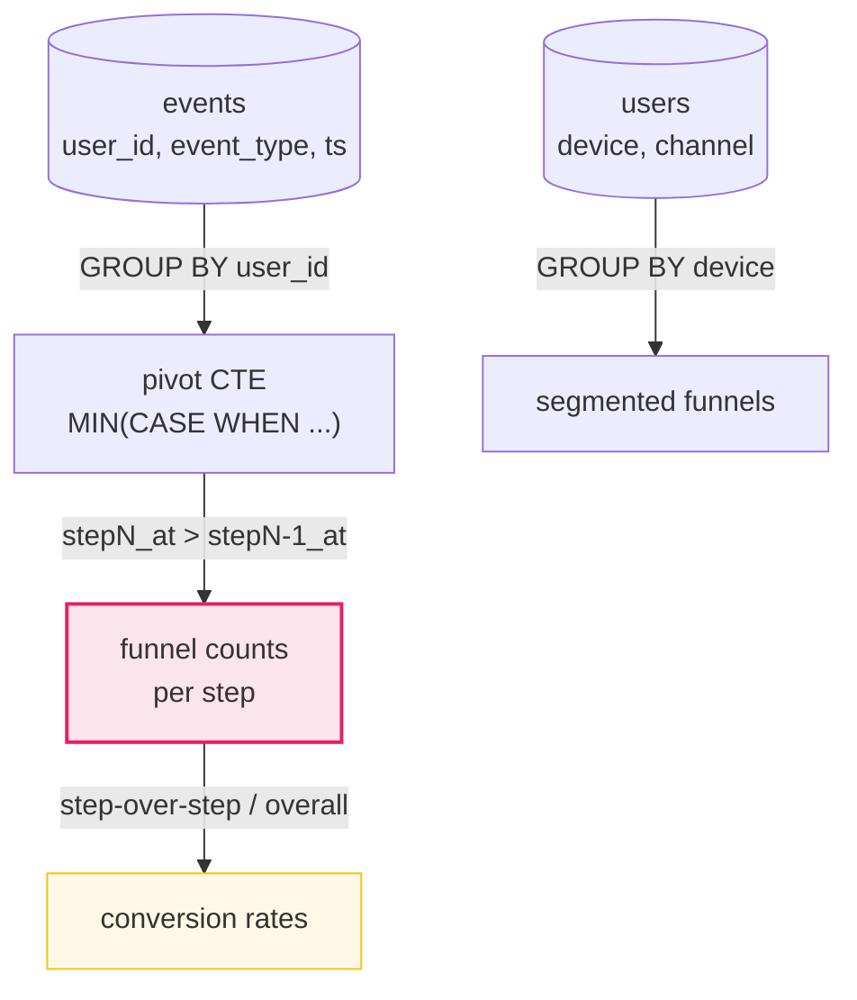

# Funnel Analysis

> **Companion code:** [`funnel_analysis.py`](https://github.com/quanhua92/tutorials/blob/main/analytics/funnel_analysis.py).
> **Live demo:** [`funnel_analysis.html`](https://github.com/quanhua92/tutorials/blob/main/analytics/funnel_analysis.html) — open in a browser.

---

## 0. TL;DR — the one idea

> **The analogy:** a funnel is a **sequence of gated steps toward a goal**. Your job is to count who
> makes it through each gate, measure the **step-over-step** conversion (the diagnostic metric), rank
> the leaks by **absolute users lost** (not the worst percentage), then **segment before you conclude
> causality** — because an aggregate "improvement" can hide a segment-level regression (Simpson's paradox).

The whole concept reduces to one operation: **take a cohort of users and count, at each ordered step,
how many advanced.** Everything else — drop-off attribution, time-to-convert, A/B comparison,
prioritization — hangs off that single sequence of counts.

```mermaid
graph LR
    V(["100,000 visit"]) -->|62.0%| S(["62,000 signup"])
    S -->|60.0%| A(["37,200 activate"])
    A -->|30.0%| P(["11,160 purchase"])
    V -.->|drop 38,000| X1((lost))
    S -.->|drop 24,800| X2((lost))
    A -.->|drop 26,040| X3((lost))
    style V fill:#fce4ec,stroke:#e91e63
    style P fill:#fce4ec,stroke:#e91e63,stroke-width:2px
    style X1 fill:#2a1414,stroke:#c0392b
    style X2 fill:#2a1414,stroke:#c0392b
    style X3 fill:#2a1414,stroke:#c0392b
```



**Overall conversion = 11,160 / 100,000 = 11.16%.** (`funnel_analysis.py` Section 1)

---

## 1. Requirements

### Functional
- **Define funnel steps explicitly** with concrete events (here: `visit → signup → activate → purchase`).
- Enforce **sequential ordering** (step N+1 must occur after step N in time) and a **conversion window**.
- Report **step-over-step conversion**, **overall conversion**, and **absolute counts** at each step.
- **Segment** the funnel by device, user type (new/returning), channel, geography.
- Support **comparison** between variants (A/B) and **time-to-convert** distributions (P50, P90).

### Non-Functional
- Accurate **time ordering** — step 2 counted only if `step2_at > step1_at`.
- **Conversion window** to avoid inflating metrics with stale journeys.
- Efficient SQL on large event volumes (CTEs + window functions).
- Guard against **instrumentation gaps** that masquerade as funnel drops.

---

## 2. Core Metrics

> From `funnel_analysis.py` **Section 1** (events pivoted with `MIN(CASE WHEN event_type=... THEN ts END)`):

| Step | Count | Step-over-step | Drop-off |
|---|---|---|---|
| visit | 100,000 | — | — |
| signup | 62,000 | **62.0%** | 38,000 (38.0%) |
| activate | 37,200 | **60.0%** | 24,800 (40.0%) |
| purchase | 11,160 | **30.0%** | 26,040 (70.0%) |
| **Overall** | | | **11.16%** |

| Metric | Definition |
|---|---|
| **Step-over-step conversion** | users at step N / users at step N-1. The primary diagnostic. |
| **Overall conversion** | users at last step / users at first step. The headline. |
| **Drop-off rate** | `1 − step-over-step`. Proportion lost at each step. |
| **Time-to-convert** | P50 / P90 time from funnel entry to completion. Long P90 = friction. |
| **Impact** | `entering × drop_rate × improvement_potential` = users recovered. |

> **Key insight:** `activate → purchase` has the worst rate (70% drop), but `visit → signup` loses the
> most users absolutely (38,000). Step-over-step tells you *where*; absolute counts tell you *how much it matters*.

---

## 3. Drop-off Analysis & Prioritization

> From `funnel_analysis.py` **Section 2** — impact ranking at 10% recovery of each dropped cohort:

| Transition | Entering | Lost | Drop % | Impact @10% |
|---|---|---|---|---|
| visit → signup | 100,000 | 38,000 | 38.0% | **3,800** |
| signup → activate | 62,000 | 24,800 | 40.0% | 2,480 |
| activate → purchase | 37,200 | 26,040 | 70.0% | 2,604 |

**Priority by impact (NOT worst rate):**
1. **visit → signup** — recover ~3,800 users (drop 38.0%)
2. activate → purchase — recover ~2,604 users (drop 70.0%)
3. signup → activate — recover ~2,480 users (drop 40.0%)

> **The trap:** the worst conversion percentage (70% drop at activate→purchase) is **not** the top priority.
> `visit → signup` wins because 100,000 users enter it. **Total recoverable at 10% = 8,884 users.**
> Always prioritize by *absolute users recovered*, never the worst percentage alone.

---

## 4. The Funnel SQL Pattern

> From `funnel_analysis.py` **Section 1** — the canonical user-level funnel pivot:

```sql
WITH p AS (
  SELECT user_id,
    MIN(CASE WHEN event_type='visit'    THEN ts END) AS visit_at,
    MIN(CASE WHEN event_type='signup'   THEN ts END) AS signup_at,
    MIN(CASE WHEN event_type='activate' THEN ts END) AS activate_at,
    MIN(CASE WHEN event_type='purchase' THEN ts END) AS purchase_at
  FROM events GROUP BY user_id
)
SELECT
  COUNT(*) AS visit,
  COUNT(CASE WHEN signup_at   IS NOT NULL AND signup_at   > visit_at    THEN 1 END) AS signup,
  COUNT(CASE WHEN activate_at IS NOT NULL AND activate_at > signup_at   THEN 1 END) AS activate,
  COUNT(CASE WHEN purchase_at IS NOT NULL AND purchase_at > activate_at THEN 1 END) AS purchase
FROM p;
-- => 100000 | 62000 | 37200 | 11160
```

**Three rules baked into this query:**
1. **Pivot with `MIN(CASE WHEN ... THEN ts END)`** — one row per user, one column per step.
2. **Enforce ordering** (`signup_at > visit_at`) — a step counts only if it happened *after* the prior.
3. **Conversion window** (add `signup_at <= visit_at + INTERVAL '14 days'`) — prevents stale journeys inflating the count.

**Segmented funnel** (Section 5) swaps the outer aggregation for `GROUP BY device`:

```sql
SELECT device,
  SUM(CASE WHEN max_step >= 0 THEN 1 ELSE 0 END) AS visit,
  SUM(CASE WHEN max_step >= 1 THEN 1 ELSE 0 END) AS signup,
  SUM(CASE WHEN max_step >= 2 THEN 1 ELSE 0 END) AS activate,
  SUM(CASE WHEN max_step >= 3 THEN 1 ELSE 0 END) AS purchase
FROM users GROUP BY device;
```



---

## 5. Time-to-Convert Distribution

> From `funnel_analysis.py` **Section 3** — histogram of the 11,160 purchasers' visit→purchase time:

| Bucket | Users | Share |
|---|---|---|
| <1h | 1,500 | 13.4% |
| 1-6h | 3,000 | 26.9% |
| 6-24h | 3,500 | 31.4% |
| 1-3d | 2,000 | 17.9% |
| 3-7d | 800 | 7.2% |
| 7-14d | 360 | 3.2% |

| Percentile | Value |
|---|---|
| **P50** | **11.55 hours** |
| **P90** | **77.28 hours (~3.2 days)** |

> **P90 of 3.2 days signals friction:** 1 in 10 purchasers needs more than 3 days to convert. A long P90
> points at onboarding/payment friction that step rates alone cannot see — the median user converts in
> half a day, but the tail is suffering.

---

## 6. Funnel Comparison (A/B)

> From `funnel_analysis.py` **Section 4** — Variant A (control) vs Variant B:

| Step | A (control) | B (variant) |
|---|---|---|
| visit | 50,000 | 50,000 |
| signup | 30,000 | 33,000 |
| activate | 18,000 | 21,450 |
| purchase | 5,400 | 7,722 |

| Transition | A | B | Delta |
|---|---|---|---|
| visit → signup | 60.0% | 66.0% | +6.0 pp |
| signup → activate | 60.0% | 65.0% | +5.0 pp |
| activate → purchase | 30.0% | 36.0% | +6.0 pp |
| **Overall** | **10.80%** | **15.444%** | **+43.0% relative** |

> Variant B wins on overall conversion (+4.644 pp absolute, **+43.0% relative**). Validate with a proper
> A/B test (sample size, guardrail metrics) before rollout — and **always check segment-level rates** for
> Simpson's paradox (Section 8).

---

## 7. Cohort-Segmented Funnels (by device)

> From `funnel_analysis.py` **Section 5** — `GROUP BY device` exposes where drop-offs concentrate:

| Device | visit | signup | activate | purchase | Overall |
|---|---|---|---|---|---|
| mobile | 65,000 | 37,700 | 21,235 | 5,309 | **8.17%** |
| desktop | 35,000 | 24,300 | 15,965 | 5,851 | **16.72%** |

| Transition | mobile | desktop |
|---|---|---|
| visit → signup | 58.0% | 69.4% |
| signup → activate | 56.3% | 65.7% |
| activate → purchase | **25.0%** | **36.6%** |

> **Mobile converts worse at every step** (8.17% vs 16.72% overall). The `activate → purchase` gap
> (25.0% mobile vs 36.6% desktop) is the loudest UX signal: **mobile checkout/payment has friction worth
> fixing first.** Mobile friction is the #1 conversion killer — segment before you diagnose.

---

## 8. Simpson's Paradox

> From `funnel_analysis.py` **Section 6** — the aggregate "improves" while a segment regresses:

| Segment | Period 1 | Period 2 |
|---|---|---|
| mobile | 1,200 / 8,000 (15.0%) | 480 / 4,000 (**12.0%**) |
| desktop | 560 / 2,000 (28.0%) | 1,740 / 6,000 (29.0%) |
| **TOTAL** | **1,760 / 10,000 (17.6%)** | **2,220 / 10,000 (22.2%)** |

- **Aggregate conversion:** 17.6% → 22.2% (**+4.6 pp**, looks like a WIN)
- **Mobile conversion:** 15.0% → 12.0% (**−3.0 pp**, WORSE)

**Cause:** desktop traffic share rose **20% → 60%**. Desktop converts higher, so the mix shift — *not*
product improvement — lifted the aggregate. **Always segment before claiming causality.**

---

## 9. Drop-off Diagnosis Framework

1. **Confirm the drop is real** — check for instrumentation failure, logging bugs, seasonality
   (weekday vs weekend), and compare across data sources.
2. **Segment to isolate** — break down by platform, user type, device, geography, channel. A localized
   drop (iOS only, paid search only) points to a specific cause.
3. **Correlate with product changes** — deployment logs for UI changes, new form fields, pricing,
   payment methods, or load-time regressions.
4. **Hypothesis lookup** by drop location:
   - Landing → Signup: poor value prop, slow load, irrelevant traffic.
   - Signup → Email verify: deliverability, verification friction.
   - Cart → Checkout: shipping cost shock, trust concerns.
   - Checkout → Payment: form friction, missing payment methods.
   - Payment → Confirm: gateway failures, timeouts.
5. **Build a hypothesis and test it** with an A/B test (define metric, sample size, guardrails).

### Conversion Optimization Levers
- **Reduce friction:** fewer form fields, faster load, remove unnecessary steps (Expedia gained
  $12M/year removing one field).
- **Increase motivation:** stronger copy, social proof, urgency signals (Booking.com's "Only 2 rooms
  left!" lifted ~15%).
- **Build trust:** security badges, transparent pricing, return policies (security logos add 5–12%).

---

## Killer Gotchas

- **Not enforcing time ordering** (`step2_at > step1_at`) inflates conversion with out-of-order events.
- **No conversion window** counts stale sessions as the same journey.
- **Reporting only overall conversion** — step-over-step rates are where the diagnostic value lives.
- **Prioritizing the worst rate** — rank by absolute users recovered, not the worst percentage
  (Section 3: the 70%-drop step ranks *second*, not first).
- **Ignoring Simpson's paradox** — an aggregate improvement can hide segment-level regression (Section 8).
- **Not checking instrumentation gaps** — a missing event on a new screen looks like a massive drop.

---

### Reproduce

```bash
python3 funnel_analysis.py          # prints all sections + [check] OK
```

> From `funnel_analysis.py` **Section 7 — GOLD CHECK** (values pinned for `funnel_analysis.html`):

```
main_overall_pct          = 11.16       variant_a_overall_pct    = 10.80
main_step_purchase_pct    = 30.0        variant_b_overall_pct    = 15.444
variant_lift_rel_pct      = 43.0        mobile_overall_pct       = 8.17
desktop_overall_pct       = 16.72       mobile_purchase_rate     = 25.0
desktop_purchase_rate     = 36.6        ttc_p50_hours            = 11.55
ttc_p90_hours             = 77.28       simpson_aggregate_p1     = 17.6
simpson_aggregate_p2      = 22.2
```

`[check] ALL GOLD values reproduce from the funnel formulas? OK` — the gold badge `check: OK` at the
bottom of [`funnel_analysis.html`](https://github.com/quanhua92/tutorials/blob/main/analytics/funnel_analysis.html)
recomputes every funnel count, conversion rate, lift, percentile, and Simpson aggregate in JavaScript
from the *identical* inputs and confirms it matches the `.py` exactly.
