```mermaid
graph LR
    F["feature<br/>autoplay toggle"] -->|L2| L2["autoplay-rate +8%"]
    L2 -->|L1| L1["completion +3.2pp"]
    L1 -->|NSM| N["WAEL +2.1%"]
    style N fill:#fce4ec,stroke:#e91e63,stroke-width:2px
    style F fill:#161b22,stroke:#30363d
```

# North Star Metrics

> **Companion code:** [`north_star_metrics.py`](https://github.com/quanhua92/tutorials/blob/main/analytics/north_star_metrics.py).
> **Live demo:** [`north_star_metrics.html`](https://github.com/quanhua92/tutorials/blob/main/analytics/north_star_metrics.html) — open in a browser.

---

## 0. TL;DR — the one idea

> **The analogy:** a North Star Metric (NSM) is the **single metric that best captures core value delivered to
> users** — never revenue, never vanity. You pick it with a rubric, **decompose it into a metric tree** (NSM → L1
> drivers → L2 inputs) that teams own, defend it with **guardrails + a counter-metric** (Goodhart's Law), and place
> every metric on a **leading vs lagging** timeline so you can act before revenue moves.

The whole concept reduces to one operation: **find one leading indicator of long-term retention, express it as a
product/sum of team-owned drivers, and never let it improve alone.**

```mermaid
graph TD
    N["WAEL = 18,400<br/>(NSM, weekly)"]
    N -->|WAU × engagement| W["WAU = 32,000"]
    N -->|cohort split| C["new + returning engaged"]
    W --> A["new active 4,000<br/>× 62.0% activation<br/>= 2,480"]
    W --> R["returning 28,000<br/>× 56.86% engagement<br/>= 15,920"]
    N -.->|guardrails never slip| G["skip ≤15% · p99 ≤800ms<br/>error ≤0.5% · churn ≤3%"]
    N -.->|counter-metric| CM["share rate 3.25%"]
    style N fill:#fce4ec,stroke:#e91e63,stroke-width:2px
    style G fill:#2a1414,stroke:#c0392b
    style CM fill:#1a2a14,stroke:#27ae60
```



**WAEL = 32,000 × 57.5% = 18,400.** (`north_star_metrics.py` Section 2)

---

## 1. Requirements

### Functional
- **Pick a metric that reflects user value, not revenue.** The metric should rise when users get more value, independent
  of monetization. WAEL (Weekly Active Engaged Listeners, ≥30 min/week) measures value delivered; MRR measures monetization.
- **It must be a leading indicator of long-term retention.** Correlated with 6–12 month future retention. Validate with
  cohort analysis.
- **It must decompose into an input-metric tree teams can own.** Expressible as a product or sum of sub-metrics.
- **Pair it with a counter-metric** to prevent gaming (Goodhart's Law).
- **Match the metric cadence to the product's usage cadence.** Podcasts = weekly habit → weekly NSM (NOT DAU).

### Non-Functional (interview rubric)
- A passing answer (7/10): correctly states the NSM should be user-value-facing, cites a real example.
- A strong answer (9/10): explains the leading-indicator mechanism, names Goodhart's Law, proposes a counter-metric,
  and decomposes into an input-metric tree.
- A failing answer (6/10): picks revenue, DAU without justification, a vanity metric, or one side of a two-sided platform.

---

## 2. The North Star Metric — WAEL

> From `north_star_metrics.py` **Section 1** — the engagement threshold applied to the weekly active users:

| Listen bucket | Users | Share | Engaged? |
|---|---|---|---|
| 0–5min | 5,000 | 15.6% | no |
| 5–15min | 4,800 | 15.0% | no |
| 15–30min | 3,800 | 11.9% | no (below threshold) |
| 30–60min | 6,200 | 19.4% | **yes** |
| 60–120min | 5,400 | 16.9% | **yes** |
| 120min+ | 6,800 | 21.2% | **yes** |

| Metric | Definition | Value |
|---|---|---|
| **WAU** (weekly active) | unique users with >0 min listened | **32,000** |
| **WAEL** (engaged, ≥30 min) | unique users with ≥30 min listened | **18,400** |
| **Engagement rate** | WAEL / WAU | **57.5%** |

> **Key insight:** WAEL counts *value delivered*, not raw presence. A user who opens the app and dismisses a
> notification is active but NOT engaged — WAEL filters them out. Cadence = weekly, matching the podcast listening habit.
> This is why DAU is wrong here (the DAU trap): a podcast user listens 2–3×/week, so daily presence is noise.

### Why revenue is NOT the NSM
Revenue is a **lagging indicator**. A product can grow revenue (price hikes, ad load, autoplay inflate) while hollowing
out user value. The NSM should be **decoupled from monetization efficiency** — teams optimizing a financial metric find
dark patterns that extract short-term value at the cost of trust.

---

## 3. The Metric Tree (decomposition)

> From `north_star_metrics.py` **Section 2** — two decompositions of the same NSM:

**Multiplicative:**
```
WAEL = WAU × Engagement Rate
     = 32,000 × 57.5% = 18,400
```

**Additive (cohort split):**
```
WAEL = New engaged + Returning engaged
     = (4,000 × 62.0%) + (28,000 × 56.86%)
     = 2,480 + 15,920 = 18,400
```

### The L0 / L1 / L2 hierarchy

| Level | Layer | Metric | Cadence | Owner |
|---|---|---|---|---|
| **L0** | NSM | WAEL = 18,400 | weekly | leadership |
| **L1** | product area | activation (new) 62.0% | daily | onboarding PM |
| **L1** | product area | engagement (returning) 56.86% | daily | retention PM |
| **L1** | product area | completion rate 69.79% | daily | content PM |
| **L1** | product area | discovery→start 426.2% ep/user | daily | discovery PM |
| **L2** | feature | search CTR, autoplay-rate, episode-start, playlist-save | hourly | feature eng |

> Each driver is owned by ONE team and is independently A/B-testable. A good tree is **exhaustive but not redundant**:
> drivers cover the variance in WAEL without overlapping (no double-counted team incentives).

### Causal attribution chain
How a single feature reaches the NSM:
```
Feature: autoplay toggle
  → L2  autoplay-rate      +8.0%   (40% → 48%)
  → L1  completion rate    +3.2 pp (69.79% → 73.0%)
  → NSM WAEL               +2.1%   (18,400 → 18,787)
```



---

## 4. Guardrails & Counter-Metrics (the four-layer stack)

> From `north_star_metrics.py` **Section 3** — a measurement system has four layers:

| Layer | Name | Purpose | Example |
|---|---|---|---|
| 01 | **North Star Metric** | One metric that best captures core value | WAEL |
| 02 | **Driver Tree** | Decompose into 3–5 leading indicators teams own | activation, completion, discovery |
| 03 | **Guardrail Metrics** | 2–3 metrics you will NOT let slip, checked in every A/B + launch | skip rate, p99 latency, error rate, churn |
| 04 | **Counter-Metrics** | Expose whether the NSM lift is real or manufactured | share rate |

### Guardrail dashboard (Layer 03)

| Guardrail | Current | Target | Status | Rationale |
|---|---|---|---|---|
| skip rate | 8.94% | ≤15.0% | OK | listening is real, not bot skipping |
| p99 start latency | 640ms | ≤800ms | OK | system health; slow starts lose listeners |
| error rate (5xx) | 0.21% | ≤0.50% | OK | infra health; errors block playback |
| voluntary churn | 2.1% | ≤3.0% | OK | user-wellbeing floor |

> A feature that lifts WAEL but breaches **ANY** guardrail does NOT ship.

### Counter-metric (Layer 04)
- **share rate = 3.25%** (1,040 sharers / 32,000 WAU).
- If WAEL rises but share rate FALLS, the extra listening is low-quality (autoplay, accidental plays).
- The counter-metric is designed **at the same time as the NSM**, before any team has an incentive to game it.

---

## 5. Leading vs Lagging Indicators

> From `north_star_metrics.py` **Section 4** — the time-horizon map:

| Type | Metric | Moves | Signal | Layer |
|---|---|---|---|---|
| **leading** | episode start rate | same day | WAEL next week | L2 |
| **leading** | new-user activation % | same week | WAEL in 2–4 weeks | L1 |
| **leading** | search CTR | same day | discovery → engagement | L2 |
| **coincident** | WAEL (the NSM) | this week | IS the outcome | L0 |
| **coincident** | completion rate | this week | content quality now | L1 |
| **lagging** | premium conversion | +3–6 months | monetization of WAEL | revenue |
| **lagging** | monthly churn | past month | retention already realized | guardrail |
| **lagging** | MRR | this month | revenue realized | revenue |

> **Leading indicators let teams course-correct WITHIN a sprint; lagging indicators are the scoreboard.** Revenue
> (premium conversion, MRR) is lagging by months — which is exactly why it must NOT be the NSM. All revenue metrics in
> the table are lagging; WAEL is coincident (it IS the outcome).

---

## 6. Goodhart's Law — catching the gaming

> From `north_star_metrics.py` **Section 5** — "When a measure becomes a target, it ceases to be a good measure."

**Decision rule:** SHIP only if WAEL rises AND counter-metrics hold:
- WAEL delta > 0
- skip-rate delta ≤ +1.0 pp
- share-rate delta ≥ −0.1 pp

| Scenario | WAEL Δ | skip Δ | share Δ | Verdict |
|---|---|---|---|---|
| **A genuine lift** | +12.0% | −1.2pp | +0.4pp | **SHIP** |
| **B autoplay gaming** | +18.0% | +4.8pp | −0.6pp | **REJECT** |

> Scenario A lifts WAEL +12% with skip FALLING and share RISING → genuine.
> Scenario B lifts WAEL +18% (bigger!) but skip spikes +4.8pp and share drops → autoplay inflated the listening.
> **The counter-metrics catch the gaming the NSM alone would reward.** A bigger NSM lift can still be REJECTED — this
> is why every NSM needs a counter-metric.

### Real-world gaming examples
- **Airbnb:** one-night cancellation-free bookings spiked nights booked → fix: "completed stays" guardrail.
- **Slack:** bot integrations inflated message count → fix: "responses per message sent".
- **Facebook:** autoplay/endless scroll boosted DAU while satisfaction fell → fix: "time well spent" surveys.

---

## 7. Metric Cadence Hierarchy

> From `north_star_metrics.py` **Section 6** — who owns what, how often:

| Level | Kind | Metric | Cadence | Owner | Question |
|---|---|---|---|---|---|
| L0 | NSM | WAEL | weekly | leadership | is the company healthy? |
| L1 | product | WAU / activation / completion | daily | PMs | is my product area healthy? |
| L2 | feature | search CTR / autoplay rate | hourly | feature eng | did my feature move the lever? |
| GR | guardrail | p99 latency / error rate | real-time | SRE / on-call | is the system floor holding? |

> Cadence matches decision speed: guardrails are real-time (a latency spike must page on-call within minutes); the NSM
> is weekly (slow enough to see real trend above noise, fast enough to course-correct within a sprint).

---

## 8. The 5-Criterion NSM Selection Rubric

1. **Reflects user value, not revenue.** Goes up when users get more value, independent of monetization.
2. **Predicts long-term retention (leading).** Correlated with 6–12 month future retention (validate with cohorts).
3. **Actionable.** Teams can ship features that move it. "Customer happiness" fails this.
4. **Decomposable into an input-metric tree.** Expressible as product/sum of sub-metrics owned by teams.
5. **Resistant to gaming.** Paired with a counter-metric that should NOT move if the NSM gain is genuine.

### The three tests
- **The Regret Test:** "If this metric went up 20% but we made a decision we later regretted, what would that look like?"
  Session count can be inflated with annoying re-engagement notifications (clear regret path).
- **The Decomposability Test:** can you decompose into 3–4 things your team directly controls? Drivers must be product
  decisions, not external (market conditions, platform algorithms).
- **The Stability Test:** slow enough to detect real trend, fast enough to give feedback within a sprint. Weekly hits
  the sweet spot for most consumer products.

---

## Killer Gotchas

- **Picking revenue as the NSM** — it's a lagging output, not user value; decoupling can take 3–6 months to show.
- **Picking DAU for an infrequent product** (the DAU trap) — podcasts, Airbnb, DocuSign are event-driven; DAU is noise.
- **Proposing an NSM without a counter-metric** — Goodhart's Law guarantees it gets gamed.
- **Overlapping drivers in the tree** — double-counting creates conflicting team incentives.
- **Correlational, not causal drivers** — "users with more friends retain better" is a correlation; "activation flow
  completion rate" is a driver you can A/B test.
- **A feature that lifts the NSM but breaches a guardrail** — it does NOT ship, no matter the lift size (Section 6: B's
  +18% is rejected).

---

### Reproduce

```bash
python3 north_star_metrics.py          # prints all sections + [check] OK
```

> From `north_star_metrics.py` **Section 7 — GOLD CHECK** (values pinned for `north_star_metrics.html`):

```
wau                    = 32000        new_activation       = 62.0
wael                   = 18400        returning_engaged    = 15920
engagement_rate        = 57.5         returning_eng        = 56.86
new_active             = 4000         completion_rate      = 69.79
new_engaged            = 2480         skip_rate            = 8.94
share_rate             = 3.25         p99_latency_ms       = 640
error_rate_pct         = 0.21         churn_pct            = 2.1
goodhart_a_verdict     = SHIP         goodhart_b_verdict   = REJECT
```

`[check] ALL GOLD values reproduce from the NSM formulas? OK` — the gold badge `check: OK` at the bottom of
[`north_star_metrics.html`](https://github.com/quanhua92/tutorials/blob/main/analytics/north_star_metrics.html)
recomputes every NSM count, decomposition rate, guardrail, leading/lagging classification, and Goodhart verdict in
JavaScript from the *identical* inputs and confirms it matches the `.py` exactly.
