# Product Sense &#8212; Decision Framework, Tradeoff Matrix, Scenario Tree &#8212; A Worked-Example Guide

> **Companion code:** [`product_sense.py`](https://github.com/quanhua92/tutorials/blob/main/analytics/product_sense.py).
> **Every number in this guide is printed by `python3 product_sense.py`** &#8212; change the
> code, re-run, re-paste. Nothing here is hand-computed.
>
> **Live demo:** [`product_sense.html`](./product_sense.html) &#8212; open in a browser,
> pick a feature to see its metric impact, drag the tradeoff-matrix weight sliders (watch Reels
> flip below onboarding), toggle RICE vs ICE, and click through the branching A/B-test tree.
> Gold-checked against the `.py`.
>
> **Source material:** [`product_sense/discussion.md`](https://github.com/quanhua92/tutorials/blob/main/analytics/HOW_TO_RESEARCH.md)
> (interview-prep), and [CalibreOS &#8212; Product Sense Interviews](https://www.calibreos.com/learn/analytics-product-sense).

---

## 0. TL;DR &#8212; the one idea

### Read this first &#8212; product sense is problem &#8594; users &#8594; metrics &#8594; tradeoffs, in that order

A "product sense" interview asks *"How would you improve Product X?"* The trap is to jump to ideas.
The fix is a **fixed, ordered framework** you run every time:

```
1. Clarify scope   2. User segments   3. User journey   4. Pain points (with data signals)
5. Solutions       6. Prioritize      7. Success metrics 8. Tradeoffs & risks
```

Each step **gates the next**. Jumping ahead is trap #1. This guide runs the canonical worked
example end-to-end: **"Facebook engagement is declining in the 18-24 cohort on mobile."** It loads
the journey, pain points, solutions, metric deltas, and an A/B-test decision tree into an in-memory
`sqlite3` DB, then queries them so every printed number is reproducible.

```mermaid
graph LR
    A["'improve Product X'<br/>(prompt)"] --> B["1 clarify scope<br/>segment/platform/goal"]
    B --> C["2 segments<br/>primary/secondary/power"]
    C --> D["3 journey<br/>drop-off each stage"]
    D --> E["4 pain points<br/>WITH data signals"]
    E --> F["5 solutions<br/>one per root cause"]
    F --> G["6 prioritize<br/>RICE/ICE + judgment"]
    G --> H["7 metrics<br/>primary+guardrail+counter"]
    H --> I["8 tradeoffs<br/>suppression trap"]
    style A fill:#fef9e7,stroke:#f1c40f
    style E fill:#eaf2f8,stroke:#2980b9
    style G fill:#fde7f0,stroke:#e91e63,stroke-width:2px
    style I fill:#eafaf1,stroke:#27ae60
```



| | formula | why |
|---|---|---|
| RICE | `(Reach &#215; Impact &#215; Confidence) / Effort` | cheap, broad wins rank high |
| ICE | `(Impact + Confidence + Ease) / 3` | each 1&#8211;5; easy sure things rank high |
| NET | `w_p&#183;&#916;Primary + w_g&#183;&#916;Guardrail + w_c&#183;&#916;Counter` | blends the three metric families; weights = business priority |
| suppression trap | primary UP **and** guardrail DOWN | ship? ITERATE, don't ship &#8212; ad revenue is a hard constraint |
| gaming signal | primary UP **and** counter DOWN | the metric is being gamed; HOLD |

---

## 1. The scenario &#8212; clarify scope (2 min)

Open with **3&#8211;4 clarifying questions**, never with ideas. Lock the scope, then segment.

| field | locked value |
|---|---|
| prompt | Facebook engagement is declining in the 18-24 cohort |
| segment | users aged 18-24 |
| platform | mobile (iOS + Android) |
| goal | engagement (growth + retention) |
| constraint | ad-supported &#8212; must not regress revenue materially |
| **PRIMARY metric** | 18-24 DAU / MAU ratio |
| **GUARDRAIL metric** | ad revenue per DAU (ARPU) |
| **COUNTER metric** | self-reported satisfaction (NPS-like, &#8722;10..10) |

Clarifying questions asked first:

- **Q1** *"engagement"* = DAU? time-in-app? interactions? &#8594; **DAU/MAU ratio**
- **Q2** recent trend or long-term? &#8594; **3-quarter decline, accelerating**
- **Q3** isolated to 18-24 or cross-demographic? &#8594; **isolated to 18-24 mobile**
- **Q4** any surfaces off-limits? &#8594; **feed is in-play; ads cannot regress &gt;2%**

The guardrail is non-negotiable because the product is ad-supported &#8212; that single fact sets up
the suppression trap in &#167;6 and the decision rule in &#167;7.

---

## 2. The 8-step framework

| step | time | what to do |
|---|---|---|
| 1. Clarify scope | 2 min | segment, platform, goal, constraints. Max 3-4 questions |
| 2. User segments | 3 min | 2-3 segments (primary/secondary/power). Name the underserved one |
| 3. User journey | 3 min | Awareness&#8594;Acquisition&#8594;Activation&#8594;Engagement&#8594;Retention. Drop-off each |
| 4. Pain points | 3 min | name EACH with a data signal (NPS, tickets, recordings, churn) |
| 5. Solutions | 5 min | 3-5, breadth-first. ONE per root cause &#8212; not all in one area |
| 6. Prioritize | 3 min | RICE / ICE + Impact &#215; Feasibility. State what you DEPRIORITIZE |
| 7. Success metrics | 2 min | PRIMARY + GUARDRAIL + COUNTER. Name the gaming path |
| 8. Tradeoffs & risks | 2 min | suppression trap, segment-split risk, what you are NOT building |

**9/10 vs 6/10 separator:** the 9/10 names **data signals** at step 4 and names the
**suppression trap** at step 8 unprompted. Everything else is structure that a 6/10 also has.

---

## 3. The user journey &#8212; drop-off at each stage

The 18-24 mobile funnel, per **100,000 reached**. The step with the largest drop is the
highest-leverage place to spend.

| stage | users | step conv | drop-off | definition |
|---|---|---|---|---|
| Awareness | 100,000 | &#8212; | &#8212; | saw install surface / ad |
| Acquisition | 42,000 | 42.0% | **58.0%** | installed the app |
| Activation | 27,300 | 65.0% | 35.0% | first session &gt; 60s (meaningful) |
| Engagement | 13,650 | 50.0% | 50.0% | weekly active (&ge;3 sessions/wk) |
| Retention | 5,460 | 40.0% | **60.0%** | active on day 30 (D30) |

**Overall (Awareness &#8594; Retention) = 5.5%.** Drop-off ranking:

| transition | lost |
|---|---|
| Engagement &#8594; Retention | **60.0%** |
| Awareness &#8594; Acquisition | 58.0% |
| Activation &#8594; Engagement | 50.0% |
| Acquisition &#8594; Activation | 35.0% |

The biggest drop is **Engagement &#8594; Retention (60%)** &#8212; the retention wall. But for an
*existing* product the **Activation &#8594; Engagement** and **Engagement &#8594; Retention**
transitions are where product investment lands (acquisition is a marketing/growth problem).
Sections 4&#8211;5 solve around both.

---

## 4. Pain points &#8212; named WITH data signals

A 6/10 says *"users are frustrated."* A 9/10 names the **signal** and the journey transition it
lives at. Each pain maps to a different root cause &#8594; a different solution.

| # | pain | sev | maps-to transition | data signal |
|---|---|---|---|---|
| 2 | Content format mismatch | 5 | Activation &#8594; Engagement | time-in-app &#8722;14% QoQ; photo interactions down, video up off-platform |
| 4 | Competitive displacement (TikTok) | 5 | Engagement &#8594; Retention | panel data: 18-24 mobile time-share &#8722;9pp; opens/day &#8722;12% |
| 1 | Onboarding friction | 4 | Acquisition &#8594; Activation | session recordings: 35% bail at step 3; support tickets |
| 3 | Social graph aging | 4 | Engagement &#8594; Retention | NPS &#8722;8 pts YoY; 41% fewer new connections made per week |

Every pain is **testable from the signal**: pull NPS by cohort, read session recordings at the named
transition, count support tickets by topic, check panel time-share. **No pain is asserted without a
signal** &#8212; that is the single biggest score separator.

---

## 5. Scoring model &#8212; RICE + ICE for feature prioritization

Two independent scoring models over the same solutions. **RICE** weights
`Reach &#215; Impact &#215; Confidence / Effort` (favors cheap, broad wins). **ICE** averages
`Impact + Confidence + Ease` on 1&#8211;5 (favors easy, sure things). Disagreement between them is a
signal, not a problem.

| # | solution | reach | impact | conf | effort | **RICE** | I | C | E | **ICE** | RICE rank |
|---|---|---|---|---|---|---|---|---|---|---|---|
| 1 | Short-form video feed (Reels) | 13,650 | 3 | 0.80 | 5 | **6,552** | 5 | 4 | 2 | 3.67 | #2 |
| 2 | Groups discovery (interest graph) | 8,000 | 2 | 0.70 | 3 | **3,733** | 4 | 3 | 4 | 3.67 | #4 |
| 3 | Streamlined 3-step onboarding | 27,300 | 2 | 0.90 | 2 | **24,570** | 3 | 5 | 5 | 4.33 | #1 |
| 4 | Collaborative content creation | 5,460 | 3 | 0.50 | 8 | **1,024** | 5 | 2 | 1 | 2.67 | #5 |
| 5 | Algorithmic feed re-rank (video-1st) | 13,650 | 2 | 0.85 | 4 | **5,801** | 4 | 4 | 3 | 3.67 | #3 |

- **RICE ranking:** Streamlined onboarding &gt; Reels &gt; Algo re-rank &gt; Groups &gt; Collab
- **ICE ranking:** Streamlined onboarding &gt; Reels &gt; Groups &gt; Algo re-rank &gt; Collab

Both models agree: **onboarding** is the quick win, **collab** is the dud. RICE's top is onboarding
(score **24,570**) &#8212; cheap, broad, high-confidence. **BUT** scoring is an *input to judgment,
not a substitute for it* (&#167;6).

---

## 6. Prioritization matrix &#8212; Impact &#215; Feasibility, then judgment

RICE says onboarding first. The **9/10 answer overrides with strategic reasoning**: onboarding is a
quick win that de-risks **Activation**, but the *root cause* of the 18-24 decline is **format
mismatch** (pain #2, severity 5). So **sequence** rather than pick-one:

| # | solution | impact | conf | effort | feasibility |
|---|---|---|---|---|---|
| 1 | Reels | 3.0 | 0.80 | 5.0 | 0.0/4 |
| 2 | Groups | 2.0 | 0.70 | 3.0 | 2.0/4 |
| 3 | Onboarding | 2.0 | 0.90 | 2.0 | 3.0/4 |
| 4 | Collab | 3.0 | 0.50 | 8.0 | 0.0/4 |
| 5 | Algo re-rank | 2.0 | 0.85 | 4.0 | 1.0/4 |

**Decision (sequenced roadmap):**

- **Phase 1 (ship first):** #3 Streamlined onboarding &#8212; quick win, de-risks Activation, all metrics positive.
- **Phase 2 (strategic):** #1 Reels &#8212; the engagement bet; needs a **revenue guardrail** (&#167;7).
- **Deprioritize:** #4 Collaborative creation &#8212; highest effort, lowest confidence, smallest reach. **KILL it.**
- **Hold:** #2 Groups, #5 Algo re-rank &#8212; revisit after Phase 1/2 readouts.

Stating what you are **NOT** building (collab) is trap #5 &#8212; deprioritization *is* the tradeoff.

---

## 7. Metric tradeoff analysis &#8212; the suppression trap

Each solution's estimated impact on **PRIMARY** (DAU%), **GUARDRAIL** (Rev%), **COUNTER** (Sat pts).
**NET** blends them with weights `0.5 / 0.3 / 0.2`:

| # | solution | &#916;DAU% | &#916;Rev% | &#916;Sat | **NET** | read |
|---|---|---|---|---|---|---|
| 1 | Reels | +8.5 | **&#8722;3.2** | +6.0 | **4.49** | suppression trap |
| 2 | Groups | +3.1 | +1.0 | +4.0 | 2.65 | clean |
| 3 | Onboarding | +5.2 | +0.8 | +2.0 | 3.24 | clean |
| 4 | Collab | +2.0 | &#8722;0.5 | +8.0 | 2.45 | suppression (mild) |
| 5 | Algo re-rank | +6.0 | **&#8722;4.5** | **&#8722;2.0** | 1.25 | suppression + gaming |

**Reads:**

- **#1 Reels** &#8212; big DAU + Sat lift, but Rev DOWN &#8594; the suppression trap. Ship ONLY with a
  revenue guardrail + a 21-day test (&#167;8).
- **#5 Re-rank** &#8212; DAU up but **Sat DOWN** &#8594; the primary is being gamed (sessions got
  longer but worse). **HOLD.**
- **#3 Onboarding** &#8212; all positive, cheap &#8594; safe quick win (Phase 1).

**NET ranking:** Reels (4.49) &gt; Onboarding (3.24) &gt; Groups (2.65) &gt; Collab (2.45) &gt;
Re-rank (1.25). NET **can flip the RICE order**: Reels ranks #1 on NET despite the revenue drag,
because the DAU + Sat lift outweighs it at weights 0.5/0.3/0.2. **Change the weights**
(e.g. guardrail &#8594; 0.5) and Reels drops below onboarding &#8212; try it live in
[`product_sense.html`](./product_sense.html). The weights encode the business priority; **state
them out loud.**

> **The canonical suppression-trap case:** Instagram's chronological&#8594;algorithmic feed switch
> raised content relevance (engagement up) but reduced ad impressions per session (sessions got
> shorter and more intentional). Always ask: *"does this feature change ad-impression volume or
> CTR?"* If yes, include revenue/ARPU as a guardrail and run the test for **at least 14 days** (a
> 7-day test can show an engagement lift but miss the downstream revenue drop).

---

## 8. Scenario walkthrough &#8212; Reels A/B test, branching decisions

The Phase-2 Reels experiment. Week-2 readout tree; each leaf carries DAU/Rev/Sat and a
**computed recommendation** from a rule that encodes the suppression trap and the gaming test.

```
[0] ROOT: ship Reels A/B, 14-day minimum  (primary=DAU, guardrail=Rev, counter=Sat)
 │   note: pre-registered; powered for DAU; revenue guardrail added (ad surface)
 │
 ├─[1] Branch A: clean win           DAU +8.5  Rev +0.3  Sat +6.0  NET +5.54  → SHIP
 │
 ├─[2] Branch B: SUPPRESSION TRAP    DAU +8.5  Rev -3.2  Sat +6.0  NET +4.49  → ITERATE
 │    │   ITERATE: extend to 21d, throttle ad load in the Reels surface
 │    ├─[3] B1: revenue recovers     DAU +8.5  Rev -0.5  Sat +6.0  NET +5.30  → SHIP (throttled)
 │    └─[4] B2: revenue still down   DAU +7.0  Rev -4.0  Sat +4.0  NET +3.10  → ITERATE
 │
 ├─[5] Branch C: primary failed      DAU +0.5  Rev -3.2  Sat -1.0  NET -0.91  → KILL
 │
 └─[6] Branch D: segment split       DAU +9.0  Rev +1.0  Sat +7.0  NET +6.20  → SEGMENTED ROLLOUT
```

**Decision rule (`recommend()`):**

| condition | action |
|---|---|
| segment split (18-24 up, 35+ down) | SEGMENTED ROLLOUT |
| DAU &#8804; 2% | KILL (primary failed) |
| DAU &gt; 2% **and** Rev &#8804; &#8722;1% | ITERATE (suppression trap) |
| &#160;&#160;&#160;unless Sat &lt; 0 | KILL (suppression + gaming) |
| DAU &gt; 2% **and** Sat &lt; 0 | HOLD (gaming signal) |
| otherwise | SHIP |

The whole point: a **"good" primary is NOT enough.** The guardrail and counter tests gate the ship
decision. **Branch B is the suppression trap** &#8212; the most common real-world Reels/Feed outcome
&#8212; and it does **not** ship at day 14. It iterates, because revenue is a hard constraint here.

---

## 9. The five interview traps &#8212; and the fix

| trap | failure mode | fix |
|---|---|---|
| Jumping to solutions without user research | Proposing features before naming the problem | Open with clarifying questions; map the journey first |
| Building for the "average user" | There is no average user; headline metrics hide segments | Always segment (primary / secondary / power) before diagnosing |
| Proposing a single metric as success | Any metric can be gamed; "DAU" alone hides quality | Primary + guardrail + counter; name the gaming path |
| Forgetting feasibility | An 18-month ML rebuild is not an interview answer | Score Effort; prefer sequencing (quick win &#8594; strategic bet) |
| Not stating what you're NOT building | Deprioritization IS the tradeoff; silence reads as no thinking | Explicitly kill 1-2 solutions and say why |

The five traps map onto the 8 steps: 1&#8592;trap1, 2&#8592;trap2, 5&#8592;trap4, 7&#8592;trap3,
8&#8592;trap5. A 6/10 hits 2&#8211;3; a 9/10 hits none.

---

## 10. Follow-up interview questions

- **The primary metric improves but the guardrail regresses &#8212; ship?** No. ITERATE: throttle the
  lever causing the regression (here, ad load), extend the test to 21 days, re-read. Ship only if
  the guardrail recovers within tolerance (&#167;8 Branch B1).
- **Design an A/B test for a feature that might suppress revenue.** Add revenue/ARPU as a
  **pre-registered guardrail**, run **&#8805;14 days**, power for *both* the primary and the
  guardrail, and pre-commit the kill threshold (e.g. Rev &#8804; &#8722;2% &#8594; iterate).
- **Different segments respond oppositely to the same feature.** &#167;8 Branch D: do NOT blend.
  Segment the analysis, check for heterogeneous treatment effects, and consider a **segmented
  rollout** (ship to the segment that wins, hold the other).
- **Evaluate a feature's worth before you can A/B test.** Use leading indicators in the first 48
  hours (session quality, D1 retention of exposed users, counter-metric movement) plus a RICE/ICE
  score (&#167;5) and a NET tradeoff projection (&#167;7). State confidence explicitly.
- **What leading indicators would you watch in the first 48 hours of a rollout?** D1 retention of
  the exposed cohort, session-depth distribution (a leftward shift = gaming), the counter-metric
  (Sat/NPS early reads), and the guardrail's hourly trend &#8212; a sharp revenue dip in the first
  48h is the early suppression warning.

---

*Built per [`HOW_TO_RESEARCH.md`](./HOW_TO_RESEARCH.md). Source of truth:
[`product_sense.py`](https://github.com/quanhua92/tutorials/blob/main/analytics/product_sense.py) &#8594;
[`product_sense_output.txt`](https://github.com/quanhua92/tutorials/blob/main/analytics/product_sense_output.txt) &#8594;
this guide &#8594; [`product_sense.html`](./product_sense.html).*
