# Scenario Problems &#8212; DIAGNOSE Framework, Branching Investigations, Root-Cause Narrowing &#8212; A Worked-Example Guide

> **Companion code:** [`scenario_problems.py`](https://github.com/quanhua92/tutorials/blob/main/analytics/scenario_problems.py).
> **Every number in this guide is printed by `python3 scenario_problems.py`** &#8212; change the
> code, re-run, re-paste. Nothing here is hand-computed.
>
> **Live demo:** [`scenario_problems.html`](./scenario_problems.html) &#8212; open in a browser,
> pick a scenario, make diagnostic choices at each DIAGNOSE stage, watch the data update and your
> signal score climb (or not). Gold-checked against the `.py`.
>
> **Source material:** [`scenario_problems/discussion.md`](https://github.com/quanhua92/tutorials/blob/main/analytics/HOW_TO_RESEARCH.md)
> (interview-prep), and [CalibreOS &#8212; Scenario Problem Bank](https://www.calibreos.com/learn/scenarios-problem-guide).

---

## 0. TL;DR &#8212; the one idea

### Read this first &#8212; scenario problems are solved with DIAGNOSE, not by guessing

A "scenario problem" interview asks *"DAU dropped 10% &#8212; investigate."* There is **no single
correct answer**; the interviewer evaluates your **reasoning process**. The trap is to jump to
queries. The fix is a **fixed, ordered framework** you run every time:

```
D Define the signal        I Check the instrument     A Assemble hypotheses
G Generate queries         N Narrow to root cause     O Own the recommendation
S State uncertainty
```

Each step **gates the next**. Skipping the instrument check is trap #1. This guide runs **four
canonical scenarios** end-to-end through DIAGNOSE:

```mermaid
graph LR
    P["'DAU dropped 10%'<br/>(prompt)"] --> D["D: define signal<br/>metric + magnitude + timeline"]
    D --> I["I: check instrument<br/>pipeline FIRST (~30-40% are data bugs)"]
    I --> A["A: hypotheses<br/>internal + external (3-5)"]
    A --> G["G: queries<br/>segment platform/geo/cohort/time"]
    G --> N["N: narrow<br/>localize to one slice"]
    N --> O["O: own recommendation<br/>rollback/investigate/monitor"]
    O --> S["S: state uncertainty<br/>time-box the next check"]
    style I fill:#eaf2f8,stroke:#2980b9,stroke-width:2px
    style N fill:#fde7f0,stroke:#e91e63,stroke-width:2px
    style O fill:#eafaf1,stroke:#27ae60
```



| | what it is | why it matters |
|---|---|---|
| **DIAGNOSE** | 7-step ordered framework for any "investigate this metric" prompt | structure is the 9/10 vs 6/10 separator |
| **SRM check** | Pearson chi-square goodness-of-fit on A/B assignment counts (`chi2 > 10.828` = fail) | broken randomization invalidates the entire readout |
| **Localization** | segment by platform / geo / cohort / time until one slice explains the aggregate move | narrows the hypothesis set from 5 to 1 |
| **Binary world event** | a timestamped ship, outage, or calendar event that matches the localized slice | turns correlation into a causal story |

---

## 1. The four scenarios &#8212; one per common interview type

| # | scenario | type | severity | tailored first check |
|---|---|---|---|---|
| 1 | DAU dropped 10% | `dau_drop` | P1 | pipeline integrity, then **platform** segmentation |
| 2 | Revenue per user declining | `rev_decline` | P2 | revenue source agreement, then **inventory-type** segmentation |
| 3 | New feature A/B test | `ab_break` | invalid | **SRM chi-square** FIRST (before reading any metric) |
| 4 | Payment service returning 500s | `p0_outage` | P0 | service health, then **region x provider** segmentation |

Each maps to a scenario type with a tailored first check and a tailored segmentation dimension.
Picking the wrong dimension is trap #7 (`single_segment`) &#8212; you waste a query cycle and look
like you don't know the domain.

---

## 2. Scenario 1 &#8212; DAU dropped 10% (the canonical step-change)

### [D] Define the signal

| field | value |
|---|---|
| prompt | DAU dropped 10% starting yesterday at 17:00 UTC &#8212; investigate |
| primary metric | DAU (users with 1+ active event / 24h) |
| magnitude | **&#8722;10.0%** (2,000,000 &#8594; 1,800,000 users) |
| timeline | step change at 17:00 UTC, flat before |
| decomposition | DAU = new + returning (+ resurrected); triangulate with signups, session_start, WAU |

### [I] Check the instrument &#8212; ALWAYS FIRST

~30-40% of "metric drops" in production are pipeline failures, not real product changes.

| check | status | detail |
|---|---|---|
| Event ingestion lag | **healthy** | pipeline lag 2 min (normal); event volume from iOS clients is down &#8212; matches warehouse |
| Two-source agreement | **healthy** | Kafka stream and BigQuery warehouse agree within 0.3% |
| Logging-layer deploys | **healthy** | no deploy to analytics/logging layer in 48h |

**Verdict: instrument HEALTHY.** Proceed to hypotheses.

### [A] Assemble hypotheses (internal + external; prioritize by P &#215; falsification cost)

| rank | category | hypothesis |
|---|---|---|
| #1 | internal_eng | **iOS mobile release v4.2.1 introduced a crash** &#8592; ROOT CAUSE |
| #2 | internal_data | Logging pipeline partial failure dropping events |
| #3 | external_seasonal | Day-of-week or seasonal trough |
| #4 | external_competitor | Competitor launched a feature, users migrating |

A single hypothesis is trap #3. List 3-5, prioritize by probability &#215; cheapest disproof.

### [G]+[N] Segment to localize

Segment by **platform**:

| slice | baseline | current | delta | note |
|---|---|---|---|---|
| iOS | 1,100,000 | 900,000 | **&#8722;18.2%** | **LOCALIZED** |
| Android | 600,000 | 606,000 | +1.0% | |
| Web | 300,000 | 294,000 | &#8722;2.0% | |

**iOS accounts for 200,000 of the 200,000 total drop (100%).** The aggregate is fully explained by
iOS. Investigate here.

### [N] Root cause match &#8212; localized slice &#215; binary world event

| field | value |
|---|---|
| mechanism | iOS build v4.2.1 crash |
| world event | mobile release v4.2.1 shipped at 17:00 UTC |
| evidence | release timestamp matches DAU step-change to the minute; crash rate v4.2.1 = **4.1%** vs v4.2.0 = 0.3% |
| severity | **P1** &#183; ~200,000 users affected (10% DAU) |

### [O]+[S] Own the recommendation + state uncertainty

**&#8594; ROLLBACK** iOS build v4.2.1 to v4.2.0 immediately; freeze iOS DAU in exec decks for the
affected window; schedule postmortem on staged rollout + crash gates.
**Next check:** T+24h confirm crash-free DAU on rollback cohort matches holdout.
**Uncertainty:** if rollback does not recover DAU within 2h, broaden to acquisition/calendar.

---

## 3. Scenario 2 &#8212; Revenue per user declining (the suppression trap)

### [D] Define the signal

| field | value |
|---|---|
| prompt | Ad revenue per DAU (ARPU) is down 7% over the last 2 weeks &#8212; DAU is flat |
| primary metric | ARPU (ad revenue per DAU / day) |
| magnitude | **&#8722;7.0%** ($2.85 &#8594; $2.65 /user) |
| timeline | gradual decline over 14 days since feed re-rank rollout |
| decomposition | Revenue = DAU &#215; ARPU. DAU flat &#8594; the move is IN ARPU = ad impressions &#215; fill &#215; CPM |

### [I] Instrument &#8212; HEALTHY (revenue API agrees with warehouse within 0.1%)

### [A] Hypotheses

| rank | category | hypothesis |
|---|---|---|
| #1 | internal_algo | **Feed re-rank shifted time to low-ad-inventory content** &#8592; ROOT CAUSE |
| #2 | internal_data | User mix shifted to low-ARPU geography |
| #3 | external_platform | Ad provider fill rate or CPM dropped |
| #4 | external_seasonal | Seasonal ad-spend decline (end of quarter) |

### [G]+[N] Segment by ad metric + inventory type

| slice | baseline | current | delta | note |
|---|---|---|---|---|
| Ad impressions (M/day) | 12.0 | 10.6 | **&#8722;12.0%** | **LOCALIZED** |
| Time-in-app (min) | 28.0 | 30.2 | +8.0% | |
| Ad CTR | 1.80 | 1.80 | 0.0% | |
| Short-form video feed (time) | 28.0 | 33.0 | +18.0% | |
| Main feed (time) | 42.0 | 38.6 | &#8722;8.0% | |

The signature: **time-in-app UP (+8%) but ad impressions DOWN (&#8722;12%)** with CTR flat. This is
the **suppression trap** &#8212; engagement rose but shifted to low-ad-density content (short-form
video has 70% lower ad density than the main feed).

### [N]+[O]+[S] Root cause, recommendation, uncertainty

**Mechanism:** feed re-rank over-weighted short-form video. **Severity:** P2, **~$400,000/day** at
risk (2,000,000 DAU &#215; $0.20 ARPU drop).
**&#8594; THROTTLE + GUARDRAIL:** throttle re-rank video weight by 50%; add ARPU guardrail at &#8722;2%
redline; extend observation 7 days; do NOT ship full rollout until ARPU recovers.
**Uncertainty:** 7-day ARPU is noisy; if it does not recover, kill the re-rank and redesign with a
constrained objective.

---

## 4. Scenario 3 &#8212; New feature A/B test (SRM breaks the experiment)

### [D] Define the signal

The treatment shows **+15% conversion** (p=0.001). The instinct is to ship. **Do NOT** &#8212; the
+15% is the question, not the answer. Validity checks gate the readout.

### [I] Check the instrument &#8212; SRM chi-square FIRST

| check | status | detail |
|---|---|---|
| Assignment log | healthy | events flowing; bucket IDs well-formed |
| **SRM chi-square (overall)** | **broken** | configured 50/50; observed 56,100/43,900; **chi2=1488.4 >> 10.828 &#8594; SRM FAIL** |

**The SRM chi-square** is Pearson goodness-of-fit on assignment counts:

```
chi2 = (obs_c - exp_c)^2 / exp_c + (obs_t - exp_t)^2 / exp_t
     = (56100-50000)^2/50000 + (43900-50000)^2/50000 = 1488.4
```

SRM critical threshold for df=1 at &#945;=0.001 is **10.828**. Platforms use a *stricter* alpha for
SRM than product metrics because SRM is a **data-quality gate**, not a business metric. A
significant SRM is a **red light for causality** &#8212; stop reading treatment effects, fix the
bucket, re-run.

### [G]+[N] Segment SRM by platform

| slice | obs_c | obs_t | ratio | chi2 | verdict |
|---|---|---|---|---|---|
| Overall | 56,100 | 43,900 | 56.1% | **1488.4** | SRM FAIL |
| **Mobile** | 36,000 | 24,000 | 60.0% | **2400.0** | SRM FAIL &#8592; LOCALIZED |
| Web | 20,100 | 19,900 | 50.2% | **1.0** | SRM clean |

**Mobile drives the SRM (chi2=2400). Web is clean (chi2=1.0).** The +15% lift is an artifact of
biased mobile assignment, NOT a real effect.

### [N]+[O]+[S] Root cause, recommendation, uncertainty

**Mechanism:** mobile SDK applied eligibility filter AFTER bucket assignment, dropping ineligible
treatment users.
**&#8594; INVALIDATE + RE-RUN:** do NOT present the +15% as a win; fix bucketing (eligibility BEFORE
assignment); add automated SRM gating; re-run 14 days.
**Uncertainty:** the true treatment effect is UNKNOWN until a clean re-run &#8212; the +15% could be
real, zero, or negative. Biased assignment makes it uninterpretable.

> **Reweighting is NOT a fix.** "We reweighted" as a substitute for understanding why SRM happened
> is an anti-pattern. Fix the bucket code, re-run. Causality cannot be restored by post-hoc
> adjustment.

---

## 5. Scenario 4 &#8212; Payment service returning 500s (P0 outage)

### [D] Define the signal

| field | value |
|---|---|
| primary metric | payment HTTP 500 error rate |
| magnitude | **+8400%** (0.1% &#8594; 8.5% errors) |
| timeline | step change at 14:32 UTC |
| decomposition | customer harm is happening NOW &#8212; **contain first, diagnose second** |

### [I] Service health &#8212; CONFIRMED (not a logging artifact)

500s confirmed in application logs AND distributed traces; p95 latency 200ms &#8594; 2400ms;
PagerDuty fired at 14:33 UTC. This is a real P0.

### [A] Hypotheses

| rank | category | hypothesis |
|---|---|---|
| #1 | external_provider | **Stripe EU endpoint degradation** &#8592; ROOT CAUSE |
| #2 | internal_eng | Connection pool exhaustion from retry amplification |
| #3 | internal_eng | Recent deploy introduced a regression |
| #4 | internal_infra | Database saturation or connection limits |

### [G]+[N] Segment by region &#215; provider

| slice | baseline | current | delta | note |
|---|---|---|---|---|
| EU + Stripe | 400,000 | 464,000 | **+16.0%** | **LOCALIZED** |
| US + Stripe | 800,000 | 816,000 | +2.0% | |
| EU + PayPal | 300,000 | 300,300 | +0.1% | |
| APAC + PayPal | 500,000 | 502,500 | +0.5% | |

**EU + Stripe is the blast radius.** PayPal is clean. This is an external provider degradation,
not an internal deploy.

### [N]+[O]+[S] Root cause, recommendation, uncertainty

**Mechanism:** Stripe EU endpoint degradation + retry amplification (second-order effect worsening
the outage). **Severity:** P0, ~170,000 failed tx/day, **~$2,100,000/day** at risk.
**&#8594; CIRCUIT-BREAK + FAILOVER:** circuit-break Stripe EU; failover EU payments to PayPal; shed
non-critical retries to stop amplification; fail closed for unsafe operations; communicate every
15 min.
**Uncertainty:** ETA depends on Stripe; if failover saturates PayPal capacity, shed low-priority
transactions and queue for retry.

> **P0 rule:** stabilize user impact FIRST, contain blast radius, THEN diagnose. Candidates who
> spend 10 minutes on root-cause theory before containment score poorly.

---

## 6. The decision flow &#8212; branching choices per scenario

Each scenario has 4 decision stages (instrument &#8594; segment &#8594; root_cause &#8594;
recommendation). The **correct path** follows DIAGNOSE; traps register mistakes. This is the
structure [`scenario_problems.html`](./scenario_problems.html) makes clickable.

```
[instrument]  check pipeline? ......... + correct   (advance)
              jump to hypotheses? ..... x trap      (skip_pipeline)
              query slices? ........... x trap      (queries_before_hypotheses)
[segment]     platform? ............... + correct   (iOS localized)
              geo? .................... x trap      (single_segment)
              cohort? ................. x trap      (single_segment)
[root_cause]  iOS crash? .............. + correct
              competitor? ............. x trap      (single_hypothesis)
              seasonal? ............... x trap      (single_hypothesis)
[recommend]   rollback? ............... + correct
              monitor only? ........... x trap      (root_cause_only)
              wait for data? .......... x trap      (ignore_uncertainty)
```

Try all four scenarios live in the HTML &#8212; each has a different correct segmentation dimension
and a different recommendation verb.

---

## 7. Signal scoring &#8212; how well did you follow DIAGNOSE?

Each diagnostic path scores **0..10**. Each correct DIAGNOSE step = +2:

| step | what "correct" means |
|---|---|
| instrument | checked data pipeline / SRM / service health FIRST |
| segment | chose the dimension that localizes the drop |
| root cause | matched the localized slice to a binary world event |
| recommendation | owned an action + impact sizing + next check |
| uncertainty | stated what you still do NOT know + time-boxed it |

| path | score | why |
|---|---|---|
| perfect | **10/10** | all 5 steps correct |
| skipped instrument | 8/10 | got everything right except the pipeline check |
| weak | 2/10 | skipped instrument, guessed root cause, no recommendation |

The scoring is the interview rubric in miniature.

---

## 8. The five+ interview traps &#8212; and the fix

| trap | failure mode | fix |
|---|---|---|
| skip_pipeline | Skipping the instrument check before investigating causes | ALWAYS check data integrity first &#8212; ~30-40% of drops are pipeline bugs |
| queries_before_hypotheses | Jumping to queries before forming a hypothesis tree | Build the tree FIRST, then explain WHY each segmentation tests it |
| single_hypothesis | Proposing only one hypothesis | List 3-5 (internal + external); prioritize by P &#215; falsification cost |
| root_cause_only | Stopping at root cause without a recommendation | Own the action: rollback / investigate / monitor + impact + next check |
| ignore_uncertainty | Presenting a conclusion without stating unknowns | Name the open questions and time-box the next check |
| root_cause_theory | Root-cause theorizing before containing harm (P0s) | Stabilize impact FIRST, contain blast radius, THEN diagnose |
| single_segment | Trying only one segmentation dimension | Segment systematically: platform &#8594; geo &#8594; cohort &#8594; time |

A 6/10 hits 2-3 traps; a 9/10 hits none.

---

## 9. Follow-up interview questions

- **The instrument check fails &#8212; what do you do?** The "incident" is a data pipeline bug, not a
  product change. Escalate to data engineering, scope the data gap, and **mark the metric window as
  invalid** for downstream exec readouts ("do not use 6h after deploy X for iOS DAU").
- **DAU is flat overall but a high-value segment craters.** This is **Simpson's paradox / mix
  effect** &#8212; the aggregate hides a severe regression. Always ask: *"If I only looked at the
  total, which story am I forbidden to tell?"* Join to exposure tables and read treatment effects,
  not just the global line.
- **The drop is gradual, not a step change.** Gradual declines point to external causes
  (competitor, seasonality, ad-spend cycles) or cumulative product changes (a model slowly drifting).
  Anchor DoW or YoY before declaring a crisis.
- **You cannot localize the drop to any single slice.** Say so: *"I need 2 more days of data to
  confirm. In the meantime, I'd monitor hourly and escalate if the drop accelerates."*
  Acknowledging uncertainty is statistical maturity, not weakness.
- **The A/B test has SRM but the business wants to ship now.** Refuse to present the treatment
  effect as causal. If the business must act, scope a limited pilot with clean assignment, or a
  clearly labeled observational read with wide uncertainty &#8212; not a cosmetic reweight.

---

*Built per [`HOW_TO_RESEARCH.md`](./HOW_TO_RESEARCH.md). Source of truth:
[`scenario_problems.py`](https://github.com/quanhua92/tutorials/blob/main/analytics/scenario_problems.py) &#8594;
[`scenario_problems_output.txt`](https://github.com/quanhua92/tutorials/blob/main/analytics/scenario_problems_output.txt) &#8594;
this guide &#8594; [`scenario_problems.html`](./scenario_problems.html).*
