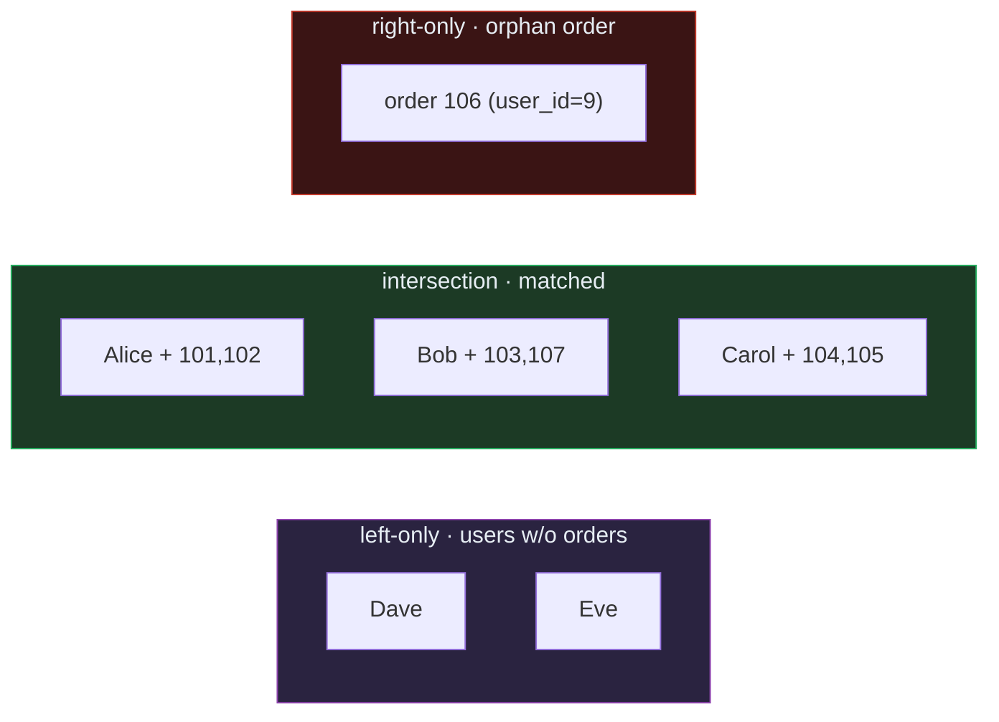

# SQL Foundations — JOINs, GROUP BY, Subqueries & CTEs: A Worked-Example Guide

> **Companion code:** [`sql_foundations.py`](https://github.com/quanhua92/tutorials/blob/main/analytics/sql_foundations.py).
> **Every table, row count, and number in this guide is printed by
> `python3 sql_foundations.py`** — change the code, re-run, re-paste. Nothing
> here is hand-computed.
>
> **Live demo:** [`sql_foundations.html`](https://github.com/quanhua92/tutorials/blob/main/analytics/sql_foundations.html)
> — open in a browser; an interactive JOIN visualizer (Venn regions light up
> per join type) plus a SQL query playground, all recomputed live in JS and
> gold-checked against the `.py`.
>
> **Source material:** CalibreOS *SQL Foundations*; Ramakrishnan & Gehrke,
> *Database Management Systems*; the PostgreSQL docs on JOIN/UNION; SQLite's
> own query-optimizer notes. The interview-grade checklist this distills is in
> [`discussion.md`](https://github.com/quanhua92/tutorials/blob/main/analytics/HOW_TO_RESEARCH.md).

---

## 0. TL;DR — every JOIN is a row-survival rule

A JOIN answers exactly **one** question: *when the `ON` key has no match on the
other side, do I keep the row, drop it, or NULL-fill it?* That single decision
is what separates the five join families. Get it right and the rest of SQL
(grouping, filtering, subqueries) is bookkeeping.

> *Picture two overlapping circles — `users` on the left, `orders` on the
> right. The **intersection** holds matched pairs (Alice + her orders). The
> **left-only** sliver is users with no orders (Dave, Eve). The **right-only**
> sliver is orders pointing at no user (order 106, an orphan). Each JOIN type
> lights up a different subset of these three regions — that is literally the
> whole game.*



### The schema (from `sql_foundations.py` Section 0)

Three small tables, deliberately asymmetric so every JOIN behaves differently:

```
users(5)              orders(7)                employees(4)
 id  name   country    id   user_id amount      id  name   manager_id
  1  Alice  US         101     1     30          1  Alice    NULL
  2  Bob    UK         102     1     70          2  Bob        1
  3  Carol  US         103     2     50          3  Carol      1
  4  Dave   CA         107     2     80          4  Dave       2
  5  Eve    US         104     3     20
                       105     3     40
                       106     9     90   <-- orphan (user 9 absent)
```

The two asymmetries that drive everything:
- **Dave and Eve** have no orders (left-only region).
- **Order 106** references `user_id=9`, who does not exist (right-only region).

---

## 1. The JOIN families — Venn reading + row counts

| JOIN | Which Venn regions light up | Rows* | Unmatched handling |
|---|---|---:|---|
| **INNER** (`JOIN`) | intersection only | 6 | unmatched rows on **both** sides **dropped** |
| **LEFT** (`LEFT JOIN`) | left-only + intersection | 8 | left rows kept; right cols **NULL-filled** |
| **RIGHT** (`RIGHT JOIN`) | intersection + right-only | 7 | right rows kept; left cols **NULL-filled** |
| **FULL OUTER** | all three regions | 9 | both sides kept; NULLs on whichever side misses |
| **CROSS** | cartesian (no `ON`) | 35 | none — every left row × every right row |
| **SELF** | a table joined to itself | 4 | alias the same table twice |

\* Row counts from `sql_foundations.py` Section 1 on the schema above.

> **The RIGHT-JOIN rule.** `RIGHT JOIN` is just a `LEFT JOIN` with the table
> order swapped. The field-tested advice is: **never write `RIGHT JOIN`** —
> swap the tables and write `LEFT JOIN` instead, so the "driving" table is
> always on the left where readers expect it. Section 1 of the `.py`
> implements RIGHT semantics exactly this way: `orders o LEFT JOIN users u`.
> The three RIGHT rows worth knowing are the 7 orders, with order 106's
> `name` column coming back NULL.

### INNER vs LEFT vs FULL — the three worth memorizing

From Section 1 (abridged; full tables in the `.py` output):

**INNER JOIN — only matched pairs survive (6 rows):**
```
 uid | name  | oid | amount
   1 | Alice | 101 | 30
   1 | Alice | 102 | 70
   2 | Bob   | 103 | 50
   2 | Bob   | 107 | 80
   3 | Carol | 104 | 20
   3 | Carol | 105 | 40
```
Dave, Eve, and order 106 are all **gone** — they have no match on the other
side.

**LEFT JOIN — every user kept; Dave/Eve NULL-filled (8 rows):**
```
 uid | name  | oid | amount
   1 | Alice | 101 | 30
   ...
   4 | Dave  |     |          <- NULL-filled
   5 | Eve   |     |          <- NULL-filled
```
The left-only region now survives. The orphan order is still dropped.

**FULL OUTER JOIN — everything, NULLs on both sides (9 rows):**
```
 uid | name  | oid | amount
   ...
   5 | Eve   |     |          <- left-only (right cols NULL)
     |       | 106 | 90       <- right-only (left cols NULL)
```
All three regions. This is what you reach for when neither side may lose rows.

### The anti-join: LEFT JOIN + `IS NULL`

"Find users who never ordered." The safe, idiomatic answer is a LEFT JOIN that
filters the unmatched right side:

```sql
SELECT u.name
FROM   users u
LEFT JOIN orders o ON o.user_id = u.id
WHERE  o.id IS NULL;     -- => Dave, Eve
```

> ⚠️ **Never use `NOT IN (subquery)` for anti-joins.** If the subquery returns
> even one NULL, `NOT IN` returns **zero rows** — a silent, classic bug. Use
> `LEFT JOIN ... WHERE right.id IS NULL` or `NOT EXISTS` instead. (Section 3
> proves all three give `{Dave, Eve}`.)

### SELF JOIN — a table joined to itself

Alias the same table twice. The canonical case is an org tree: each employee's
manager is another row in `employees`.

```sql
SELECT e.name AS employee, m.name AS manager
FROM   employees e
LEFT JOIN employees m ON m.id = e.manager_id;
-- => Alice/NULL, Bob/Alice, Carol/Alice, Dave/Bob
```
The `LEFT JOIN` keeps Alice (the root) with a NULL manager. Self-joins are the
foundation of referral-chain and hierarchical queries; a CTE makes multi-level
chains readable (see §4).

---

## 2. GROUP BY vs HAVING — WHERE filters rows, HAVING filters groups

SQL runs in a fixed order, and getting a filter in the **wrong stage** is the
#1 source of "plausible but wrong" totals:

```
FROM > JOIN > WHERE > GROUP BY > HAVING > SELECT > ORDER BY > LIMIT
```

- **WHERE** filters **individual rows** *before* grouping (e.g. `country='US'`).
- **HAVING** filters **aggregated groups** *after* grouping (e.g. `COUNT(*)>5`).

Per-user aggregates (Section 2 of the `.py`, 5 rows — `LEFT JOIN` keeps every
user, `COALESCE` turns the NULL `SUM` into 0 for the order-less users):

```
 name  | n_orders | total
 Bob   | 2        | 130
 Alice | 2        | 100
 Carol | 2        | 60
 Dave  | 0        | 0
 Eve   | 0        | 0
```

**HAVING `SUM(amount) > 70`** (a filter on the aggregate — impossible in WHERE)
keeps only **Bob (130)** and **Alice (100)**.

**WHERE `country='US'` then HAVING `SUM>50`** (both stages, correct placement):

```sql
SELECT u.name, COUNT(o.id) AS n_orders, COALESCE(SUM(o.amount),0) AS total
FROM   users u
LEFT JOIN orders o ON o.user_id = u.id
WHERE  u.country = 'US'        -- rows filtered BEFORE grouping
GROUP BY u.id, u.name
HAVING SUM(o.amount) > 50;     -- groups filtered AFTER grouping
-- => Alice (100), Carol (60)
```
`WHERE` first shrinks the input to US users (Alice, Carol, Eve); `HAVING` then
drops Eve's empty group (0). Swap the two clauses and you get a different —
and wrong — answer.

### NULL poisoning of aggregates (the deep-dive traps)

| Aggregate | NULL behaviour |
|---|---|
| `COUNT(*)` | counts **all** rows, including NULL-filled ones |
| `COUNT(col)` | counts only **non-NULL** values (0 for Dave/Eve) |
| `AVG(col)` | ignores NULLs — denominator is non-NULL rows only |
| `SUM(col)` | ignores NULLs, but returns **NULL** if **every** value is NULL |
| `GROUP BY` | NULLs form **their own group** |

Defensive toolkit: `COALESCE(col, 0)` defaults NULLs; `NULLIF(val, 0)` prevents
divide-by-zero; `COUNT(o.id)` not `COUNT(*)` when counting optional relations.

---

## 3. Subquery patterns — scalar, correlated, EXISTS

### Scalar subquery (runs once, returns one value)
```sql
SELECT o.id, o.amount
FROM   orders o
WHERE  o.amount > (SELECT AVG(amount) FROM orders);   -- avg = 54.2857
-- => orders 102 (70), 106 (90), 107 (80)
```
The inner query returns a single number; the outer query treats it as a
constant.

### Correlated subquery (re-runs per outer row — O(n·m), avoid in production)
```sql
SELECT u.name,
       (SELECT MAX(o.amount) FROM orders o
         WHERE o.user_id = u.id) AS max_order
FROM   users u;
-- => Alice 70, Bob 80, Carol 40, Dave NULL, Eve NULL
```
The inner query references the outer `u.id`, so it re-executes for each user.
Rewrite as a JOIN or window function at scale (the CTE in §4 is the pattern).

### EXISTS / NOT EXISTS (semi-join and anti-join)
```sql
-- users who placed >= 1 order        => Alice, Bob, Carol
SELECT u.name FROM users u
WHERE EXISTS (SELECT 1 FROM orders o WHERE o.user_id = u.id);

-- users who NEVER ordered            => Dave, Eve
SELECT u.name FROM users u
WHERE NOT EXISTS (SELECT 1 FROM orders o WHERE o.user_id = u.id);
```
`EXISTS` short-circuits at the first match and returns no columns, so it is
cheap. `NOT EXISTS` is the **NULL-safe** anti-join — unlike `NOT IN`.

---

## 4. Set operations — UNION, INTERSECT, EXCEPT

Set ops combine row-sets **by value** (not by join key). Every SELECT must
return the same number/type of columns. `UNION` dedupes; `UNION ALL` keeps
duplicates and is faster when you know they are distinct.

```sql
-- UNION: every user_id seen anywhere  => {1,2,3,4,5,9}
SELECT id      FROM users
UNION
SELECT user_id FROM orders;

-- INTERSECT: user_ids in BOTH tables  => {1,2,3}
SELECT id      FROM users
INTERSECT
SELECT user_id FROM orders;

-- EXCEPT: users never in orders (set-based anti-join) => {4,5} = Dave, Eve
SELECT id      FROM users
EXCEPT
SELECT user_id FROM orders;
```
`EXCEPT` gives the **same** anti-join answer as `NOT EXISTS` and
`LEFT JOIN ... IS NULL` — `{Dave, Eve}`. Pick whichever reads cleanest.

---

## 5. CTEs (`WITH`) — named, testable, composable steps

A CTE is a named subquery you reference like a table. Chain several to build
cohort/ranking pipelines **top-down**. Each step is independently testable,
and modern optimizers (PostgreSQL 12+, BigQuery, Snowflake) treat CTEs and
inline subqueries identically — so prefer CTEs for readability.

```sql
WITH per_user AS (                       -- step 1: one row per user w/ totals
    SELECT u.id, u.name,
           COUNT(o.id)              AS n_orders,
           COALESCE(SUM(o.amount),0) AS total
    FROM   users u
    LEFT JOIN orders o ON o.user_id = u.id
    GROUP BY u.id, u.name
),
ranked AS (                              -- step 2: window RANK over totals
    SELECT *, RANK() OVER (ORDER BY total DESC) AS rnk
    FROM   per_user
)
SELECT name, n_orders, total, rnk        -- step 3: project + order
FROM   ranked
ORDER BY rnk, name;
```

Result (Section 5 of the `.py`, 5 rows):

```
 name  | n_orders | total | rnk
 Bob   | 2        | 130   | 1
 Alice | 2        | 100   | 2
 Carol | 2        | 60    | 3
 Dave  | 0        | 0     | 4    ┐ ties share a rank
 Eve   | 0        | 0     | 4    ┘ (RANK, not ROW_NUMBER)
```

This three-stage shape — **aggregate → window → project** — is exactly how you
build a cohort-retention query (4 CTEs: cohorts, activity, sizes, rate), each
one testable on its own.

---

## 6. The interview answer template

Before writing a query, verbalise:

1. **Grain** — one row per user? per order? per day?
2. **JOIN type** — does INNER drop unmatched rows I need? (anti-joins → LEFT + IS NULL)
3. **NULLs** — are there NULLs in join keys or aggregated columns? (`COALESCE`, `COUNT(col)`)
4. **Filter stage** — does my filter go before grouping (WHERE) or after (HAVING)?
5. **Structure** — is there a correlated subquery I can rewrite as a JOIN/window/CTE?

### Production debug order for wrong results
1. Validate the **output grain** first.
2. Count rows **before and after each JOIN** to catch fanout.
3. Audit **NULL behaviour** on key columns.
4. Reconcile **WHERE vs HAVING** placement.
5. Run a **minimal slice** sanity check on one known case.

---

## Gold check

`sql_foundations.py` ends with an independent recompute that re-derives every
headline number in pure Python (no SQL) and asserts equality:

```
INNER JOIN: rows=6 (py 6), total=290 (py 290)  -> OK
GROUP BY per-user totals match python for all 5 users -> OK
AVG=54.2857 (py 54.2857); orders above avg=3 (py 3)  -> OK
Anti-join (NOT EXISTS == LEFT JOIN+IS NULL == EXCEPT) = ['Dave', 'Eve']  -> OK
[check] SQL output matches independent Python recompute on all four checks: OK
```
The [`sql_foundations.html`](https://github.com/quanhua92/tutorials/blob/main/analytics/sql_foundations.html)
demo re-runs the same joins in JavaScript and shows a `[check: OK]` gold badge
when its INNER-join row count and per-user totals match the `.py`.

---

*This guide is the analytics companion to the SQL interview checklist. Every
figure traces back to a `=== SECTION ===` banner in
[`sql_foundations_output.txt`](https://github.com/quanhua92/tutorials/blob/main/analytics/sql_foundations_output.txt),
which is the verbatim stdout of
[`sql_foundations.py`](https://github.com/quanhua92/tutorials/blob/main/analytics/sql_foundations.py).*
