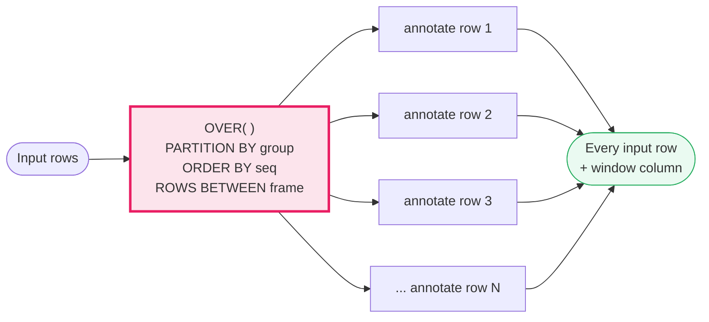

# SQL Window Functions

> **Companion code:** [`sql_window_functions.py`](https://github.com/quanhua92/tutorials/blob/main/analytics/sql_window_functions.py).
> **Live demo:** [`sql_window_functions.html`](./sql_window_functions.html) — open in a browser.

---

## 0. TL;DR — the one idea

> **The analogy:** a window function is a *sticky note* slapped on every row of a
> table. `GROUP BY` crushes a hundred rows into one summary line; a window function
> keeps all hundred rows and just *annotates* each one with a value computed from
> its neighborhood (its "window"). You get the group-level intelligence without
> losing the row-level detail.



Three knobs inside `OVER()` decide the window:

| Knob | `PARTITION BY` | `ORDER BY` | frame `ROWS BETWEEN` |
|---|---|---|---|
| Asks | **which group?** | **in what sequence?** | **how many rows contribute?** |
| Example | `PARTITION BY region` | `ORDER BY amount DESC` | `ROWS BETWEEN 2 PRECEDING AND CURRENT ROW` |

Window functions appear in ~70% of hard SQL interview questions at major tech
companies. The recurring patterns are: **top-N per group**, **running totals**,
**period-over-period** (LAG/LEAD), and **gaps-and-islands** (session/streak
detection).

---

## 1. ROW_NUMBER — unique rank per partition

> From `sql_window_functions.py` Section 1:

`ROW_NUMBER()` assigns `1,2,3,...` with **no ties** — the tie-break is arbitrary,
so add a deterministic column to `ORDER BY` when reproducibility matters.

```
OVER (PARTITION BY region ORDER BY amount DESC, rep)
```

| region | rep | amount | rn |
|---|---|---|---|
| East | alice | 100 | 1 |
| East | bob | 100 | 2 |
| East | carol | 80 | 3 |
| East | dave | 60 | 4 |
| West | eve | 120 | 1 |
| West | frank | 90 | 2 |
| West | grace | 90 | 3 |
| West | heidi | 50 | 4 |

West `frank` and `grace` **tie** at 90, but `ROW_NUMBER` breaks it (here by
`rep`): frank=2, grace=3. **No duplicate ranks ever.** This is the function you
reach for to **deduplicate** ("latest record per user") and to build
**top-N-per-group**:

```sql
WITH r AS (
  SELECT *, ROW_NUMBER() OVER (PARTITION BY user_id ORDER BY created_at DESC) AS rn
  FROM events
)
SELECT * FROM r WHERE rn = 1;        -- one row per user, the newest
```

> **Trap:** you cannot put a window function in `WHERE` directly — it is computed
> *after* `WHERE`. Wrap it in a CTE and filter the CTE.

---

## 2. RANK vs DENSE_RANK — the tie-handling decision

> From `sql_window_functions.py` Section 2:

Both assign the **same** number to tied rows, but differ *after* the tie:

| Function | Tie behavior | Example on East `[100,100,80,60]` | When to use |
|---|---|---|---|
| `ROW_NUMBER` | unique, arbitrary tie-break | `1,2,3,4` | dedup, exactly N rows |
| `RANK` | same number, **skip after** | `1,1,3,4` | "tied for 1st, next is 3rd" |
| `DENSE_RANK` | same number, **no skip** | `1,1,2,3` | **"Nth highest"** problems |

| region | rep | amount | RANK | DENSE_RANK |
|---|---|---|---|---|
| East | alice | 100 | 1 | 1 |
| East | bob | 100 | 1 | 1 |
| East | carol | 80 | **3** | **2** |
| East | dave | 60 | **4** | **3** |
| West | eve | 120 | 1 | 1 |
| West | frank | 90 | 2 | 2 |
| West | grace | 90 | 2 | 2 |
| West | heidi | 50 | **4** | **3** |

**The "second-highest salary" trap:** if two people share the top salary, `RANK`
produces `1,1,3` — **rank 2 does not exist**, so `WHERE rank = 2` returns nothing.
`DENSE_RANK` produces `1,1,2` and always works. Reach for `DENSE_RANK` on
"Nth-highest" questions; reach for `ROW_NUMBER` when you need **exactly** N rows.

---

## 3. LAG / LEAD — period-over-period

> From `sql_window_functions.py` Section 3:

`LAG(col, n, default)` peeks **back** n rows; `LEAD(col, n, default)` peeks
**ahead**. The first row of a partition has no predecessor, so `LAG` returns
`NULL` there — handle it with `COALESCE` or the three-argument form.

| dt | revenue | LAG (prev) | LEAD (next) | day-over-day |
|---|---|---|---|---|
| 2024-01-01 | 100 | NULL | 150 | — |
| 2024-01-02 | 150 | 100 | 120 | **+50** |
| 2024-01-03 | 120 | 150 | 200 | **−30** |
| 2024-01-04 | 200 | 120 | 180 | **+80** |
| 2024-01-05 | 180 | 200 | 90 | **−20** |
| 2024-01-06 | 90 | 180 | 110 | **−90** |
| 2024-01-07 | 110 | 90 | NULL | **+20** |

Day-over-day change is simply `revenue - LAG(revenue)`. The same machinery powers
**week-over-week**, **month-over-month**, **session detection** (gap > 30 min
starts a new session), and **consecutive-day streaks** (gaps-and-islands).

> Always `PARTITION BY` the dimension (user, category, region) — `LAG` without a
> partition **leaks across users**.

---

## 4. SUM() OVER — running total (cumulative)

> From `sql_window_functions.py` Section 4:

An aggregate plus an explicit **frame** = a rolling computation. The running total
uses the widest-growing frame:

```
SUM(revenue) OVER (ORDER BY dt
    ROWS BETWEEN UNBOUNDED PRECEDING AND CURRENT ROW)
```

| dt | revenue | running total |
|---|---|---|
| 2024-01-01 | 100 | 100 |
| 2024-01-02 | 150 | 250 |
| 2024-01-03 | 120 | 370 |
| 2024-01-04 | 200 | 570 |
| 2024-01-05 | 180 | 750 |
| 2024-01-06 | 90 | 840 |
| 2024-01-07 | 110 | **950** |

The window **grows** by one row each step — every prior row contributes to the
current sum. Cumulative revenue, running signups, and year-to-date counters all
use this shape.

---

## 5. AVG() OVER — moving average (frame clause)

> From `sql_window_functions.py` Section 5:

A **narrow** frame produces a *smoothed* metric. The 3-row moving average slides a
3-wide window:

```
AVG(revenue) OVER (ORDER BY dt
    ROWS BETWEEN 2 PRECEDING AND CURRENT ROW)
```

| dt | revenue | ma3 | window rows |
|---|---|---|---|
| 2024-01-01 | 100 | 100.00 | {01} |
| 2024-01-02 | 150 | 125.00 | {01,02} |
| 2024-01-03 | 120 | **123.33** | {01,02,03} |
| 2024-01-04 | 200 | 156.67 | {02,03,04} |
| 2024-01-05 | 180 | **166.67** | {03,04,05} |
| 2024-01-06 | 90 | 156.67 | {04,05,06} |
| 2024-01-07 | 110 | 126.67 | {05,06,07} |

At the partition **edge** fewer rows fall in the window, so early values use 1 or 2
rows — the average stays exact, just shorter. The classic 7-day rolling metric is
`ROWS BETWEEN 6 PRECEDING AND CURRENT ROW`.

### ROWS vs RANGE — the precision rule

| Frame type | Counts by | Behavior |
|---|---|---|
| `ROWS BETWEEN` | **physical row position** | deterministic — use this for time series |
| `RANGE BETWEEN` | **value range** | can include unexpected rows on ties/gaps |

> **Rule:** for time-series analytics, **always** use `ROWS BETWEEN`. The default
> frame (when `ORDER BY` is present and no frame is written) is
> `RANGE BETWEEN UNBOUNDED PRECEDING AND CURRENT ROW` — fine for running totals
> until a tie surprises you.

---

## 6. NTILE — percentile / quartile bucketing

> From `sql_window_functions.py` Section 6:

`NTILE(n)` splits an ordered partition into `n` roughly-equal buckets:
`NTILE(4)` = quartiles, `NTILE(10)` = deciles, `NTILE(100)` = percentiles. When
rows do not divide evenly, **earlier buckets get the extra row** (4 rows into
`NTILE(3)` → bucket sizes 2,1,1).

| region | rep | amount | NTILE(3) |
|---|---|---|---|
| East | alice | 100 | 1 |
| East | bob | 100 | 1 |
| East | carol | 80 | 2 |
| East | dave | 60 | 3 |
| West | eve | 120 | 1 |
| West | frank | 90 | 1 |
| West | grace | 90 | 2 |
| West | heidi | 50 | 3 |

East: `alice,bob` → bucket 1; `carol` → 2; `dave` → 3. Popular for **ML feature
engineering** — revenue deciles, risk tiers, rank-based normalization of skewed
distributions. For *exact* percentiles use `PERCENTILE_CONT`/`PERCENTILE_DISC`
(PostgreSQL, BigQuery, Snowflake).

---

## 7. FIRST_VALUE / LAST_VALUE — edges of the frame

> From `sql_window_functions.py` Section 7:

`FIRST_VALUE` = the value at the **first** row of the ordered partition.
`LAST_VALUE` = the value at the **last row of the frame** — **not** the partition.

| region | rep | amount | FIRST_VALUE | LAST_VALUE |
|---|---|---|---|---|
| East | alice | 100 | 100 | 60 |
| East | bob | 100 | 100 | 60 |
| East | carol | 80 | 100 | 60 |
| East | dave | 60 | 100 | 60 |
| West | eve | 120 | 120 | 50 |
| West | frank | 90 | 120 | 50 |
| West | grace | 90 | 120 | 50 |
| West | heidi | 50 | 120 | 50 |

`FIRST_VALUE` per region = the **top** amount (East 100, West 120). `LAST_VALUE`
per region = the **bottom** amount (East 60, West 50) — but **only** because the
query widens the frame:

```sql
LAST_VALUE(amount) OVER (PARTITION BY region ORDER BY amount DESC
    ROWS BETWEEN UNBOUNDED PRECEDING AND UNBOUNDED FOLLOWING)
```

### The #1 interview gotcha — LAST_VALUE's default frame

With the default frame (`RANGE BETWEEN UNBOUNDED PRECEDING AND CURRENT ROW`),
`LAST_VALUE` *tracks the current row* at every step — so it just echoes each
row's own value, which is almost never what you want. To get the partition's true
last value, you **must** widen the frame to `UNBOUNDED FOLLOWING`.

---

## 8. GOLD values — pinned for the live demo

> From `sql_window_functions.py` Section 8:

The live [`sql_window_functions.html`](./sql_window_functions.html) re-implements
every window function above in hand-written JavaScript on the **identical**
deterministic data and compares against these pinned values:

| key | value | key | value |
|---|---|---|---|
| `row_number_east` | `1,2,3,4` | `rank_west` | `1,2,2,4` |
| `row_number_west` | `1,2,3,4` | `dense_rank_west` | `1,2,2,3` |
| `rank_east` | `1,1,3,4` | `lag_02` | `100` |
| `dense_rank_east` | `1,1,2,3` | `lead_02` | `120` |
| `dod_02` | `50` | `running_total_07` | `950` |
| `moving_avg_03` | `123.33` | `moving_avg_05` | `166.67` |
| `ntile3_east` | `1,1,2,3` | `first_value_east` | `100` |
| `last_value_east` | `60` | `first_value_west` | `120` |

---

## Decision summary

| Pattern | Function + frame | Why |
|---|---|---|
| Dedup / "latest per user" / exact top-N | `ROW_NUMBER() ... WHERE rn = N` | unique, never ties |
| "Nth highest" / leaderboard | `DENSE_RANK()` | no gaps, ties included |
| Period-over-period change | `LAG`/`LEAD` with `PARTITION BY` dimension | one-row peek |
| Cumulative / running total | `SUM() ... ROWS BETWEEN UNBOUNDED PRECEDING AND CURRENT ROW` | growing window |
| 7-day rolling / smoothing | `AVG() ... ROWS BETWEEN 6 PRECEDING AND CURRENT ROW` | sliding window |
| Percentile / decile bucketing | `NTILE(n)` | even buckets (extra to bucket 1) |
| Top/bottom per group | `FIRST_VALUE` / `LAST_VALUE` (full frame) | edge of partition |

### Killer gotchas

- **Filter via CTE, never in `WHERE`.** Window functions are computed *after*
  `WHERE`; filter them in an outer query.
- **Always `PARTITION BY` the dimension.** `LAG`/`LEAD` without a partition leaks
  across users, categories, regions.
- **Use `ROWS`, not `RANGE`, for time series.** `RANGE` with ties or gaps can
  include unexpected rows.
- **`LAST_VALUE` needs an explicit `UNBOUNDED FOLLOWING` frame** or it echoes the
  current row — the most common silent bug.
- **Zero-activity periods:** join to a **date spine** to fill gaps *before*
  windowing, or `LAG` will connect non-adjacent days.
- **Division by zero** in percentage change: wrap the denominator in `NULLIF`.
