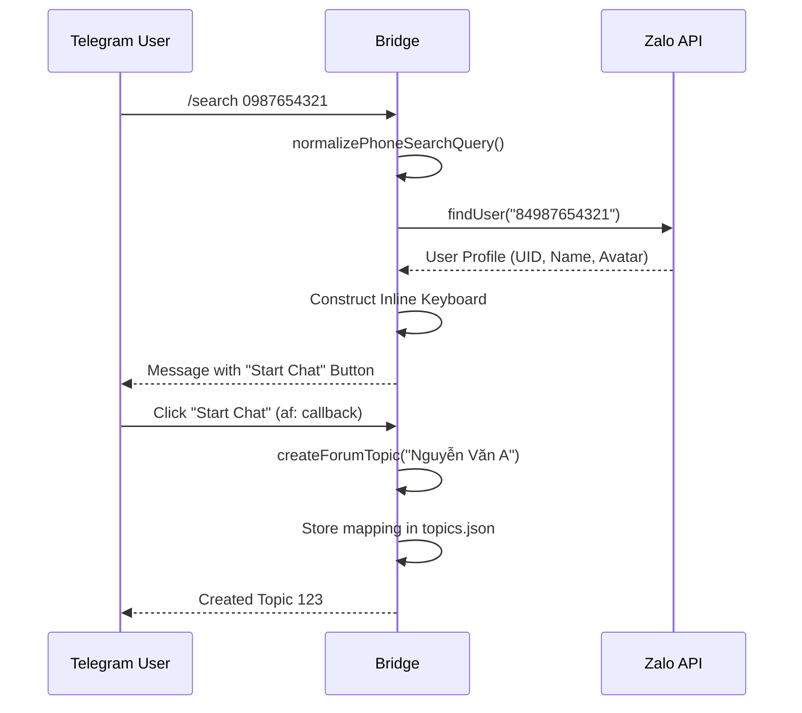

# Telegram Commands & User Interface

This section describes the Telegram-side user interface, including command handling, dashboards, and interactive inline keyboards.

## Detailed Logic Description

The bridge's UI is entirely managed via Telegram commands and callback queries.

### 1. Command Architecture
Commands are registered in `src/telegram/bot.ts` and their logic is implemented in `src/telegram/handler.ts`.
- **`syncTelegramCommands`**: Updates the bot's command list in the Telegram app UI.
- **Handlers**: Each command (e.g., `/status`, `/admin`) is a middleware function that generates formatted HTML or sends interactive buttons.

### 2. Search & Topic Creation
The `/search` command implements a dual-search strategy:
1.  **Phone Search**: Calls Zalo's `findUser` API for exact matches.
2.  **Name Search**: Filters the in-memory `friendsCache` and `groupsCache`.
Results are displayed as **Inline Buttons**. Clicking a result triggers a callback query that creates a new Telegram topic and maps it to the Zalo UID.

### 3. Dashboards (HTML Formatting)
The **Status** and **Admin Panel** utilize Telegram's **HTML Parse Mode**:
- `<b>`: Bold for headers.
- `<code>`: Monospace for IDs and metrics.
- `<pre>`: Blocks for structured data.
- Emojis (📈, ⚙️, ✅) are used to provide a "native" application feel.

## /search Sequence Diagram



## Protocol Specification

### 1. answerCallbackQuery
- **Purpose**: Provides visual feedback (toasts/alerts) after a button click.
- **Endpoint**: `POST /answerCallbackQuery`
- **Body (JSON)**:
    ```json
    {
      "callback_query_id": "987654321",
      "text": "Topic created successfully!",
      "show_alert": false
    }
    ```

### 2. editMessageText (Interface Updating)
- **Purpose**: Updates the current message in-place to provide a "drill-down" menu experience.
- **Endpoint**: `POST /editMessageText`
- **Body (JSON)**:
    ```json
    {
      "chat_id": -100123456789,
      "message_id": 456,
      "text": "New menu content...",
      "reply_markup": { "inline_keyboard": [ ... ] }
    }
    ```

## File References

### Bridge
- **[src/telegram/handler.ts](https://github.com/williamcachamwri/zalo-tg/blob/805709dc70217fd46a1edb79d89ebc5f33874688/src/telegram/handler.ts)**: Core UI and command logic (L699).
- **[src/telegram/bot.ts](https://github.com/williamcachamwri/zalo-tg/blob/805709dc70217fd46a1edb79d89ebc5f33874688/src/telegram/bot.ts)**: Command definitions (L12).

### Telegraf
- **[telegraf-src/src/telegram.ts](https://github.com/telegraf/telegraf/blob/0638cf4cc7ba8467ccb9222726024c99c54d119f/src/telegram.ts)**: Implementation of `editMessageText` (L146) and `answerCbQuery` (L456).

## Technical Analysis
The bridge makes heavy use of **Inline Keyboards** to reduce the need for manual ID entry. This "Button-First" approach is essential for a CLI-based tool, making it accessible to non-technical users. The decision to use **HTML Parse Mode** instead of MarkdownV2 was likely driven by HTML's more lenient escaping rules, which prevents the bot from crashing when Zalo names contain special characters.
