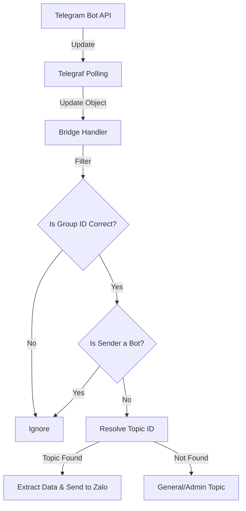

# Telegram Inbound Event Processing

This section describes how the bridge processes incoming events from Telegram and routes them to Zalo.

## Detailed Logic Description

The entry point for all Telegram events is `src/telegram/handler.ts`. The bridge uses the `tgBot.on()` middleware pattern provided by Telegraf to multiplex different event types.

### 1. The Update Lifecycle
Telegram delivers events as **Update Objects**.
- **Delivery**: Updates are fetched via **Long Polling** (handled by `telegraf` polling loop).
- **Filtering**: The bridge immediately filters updates to ensure they originate from the correct Group ID (`config.telegram.groupId`) and that the sender is not a bot (to prevent self-echo loops).
- **Routing**: The `message_thread_id` is extracted to identify the target Zalo conversation using the `store`.

### 2. Message Parsing
When a `message` event is received:
- **Text Extraction**: The raw text is extracted.
- **Mention Resolution**: The `resolveTgMentions` function parses Telegram `mention` and `text_mention` entities. It maps these to Zalo UIDs using the local `userCache`.
- **Formatting**: Currently, the bridge prioritizes text content; complex Telegram formatting (bold, italic) is stripped before sending to Zalo.

### 3. Special Event Types
- **`message_reaction`**: The bridge maps Telegram reaction emojis to Zalo's supported reaction set (e.g., 👍, ❤️, 😂).
- **`poll_answer`**: Triggered when a user votes on a Telegram poll. The bridge uses the `pollStore` to identify the corresponding Zalo poll and forwards the vote using `api.votePoll`.

## Routing Flowchart



## Protocol Specification

### 1. Telegram `Update` Object (Raw JSON)
Incoming updates follow this structure:
```json
{
  "update_id": 123456789,
  "message": {
    "message_id": 100,
    "from": {
      "id": 123,
      "is_bot": false,
      "first_name": "User"
    },
    "chat": {
      "id": -100123456789,
      "type": "supergroup"
    },
    "message_thread_id": 12,
    "text": "Hello @someone",
    "entities": [
      { "offset": 6, "length": 8, "type": "mention" }
    ]
  }
}
```

## File References

### Bridge
- **[src/telegram/handler.ts](https://github.com/williamcachamwri/zalo-tg/blob/805709dc70217fd46a1edb79d89ebc5f33874688/src/telegram/handler.ts)**: Primary update processing logic (L1857).
- **[src/index.ts](https://github.com/williamcachamwri/zalo-tg/blob/805709dc70217fd46a1edb79d89ebc5f33874688/src/index.ts)**: Configuration of `allowedUpdates` (L38).

### Telegraf
- **[telegraf-src/src/telegraf.ts](https://github.com/telegraf/telegraf/blob/0638cf4cc7ba8467ccb9222726024c99c54d119f/src/telegraf.ts)**: Core update dispatching logic (L575).

## Technical Analysis
The use of `ctx.from?.is_bot` for self-echo prevention is a robust strategy, but it relies on all bridge-initiated messages being sent via the bot token. The bridge's decision to ignore `edited_message` updates is a design choice to maintain a simple, append-only history in Zalo, which lacks a robust real-time edit API for third-party clients.
