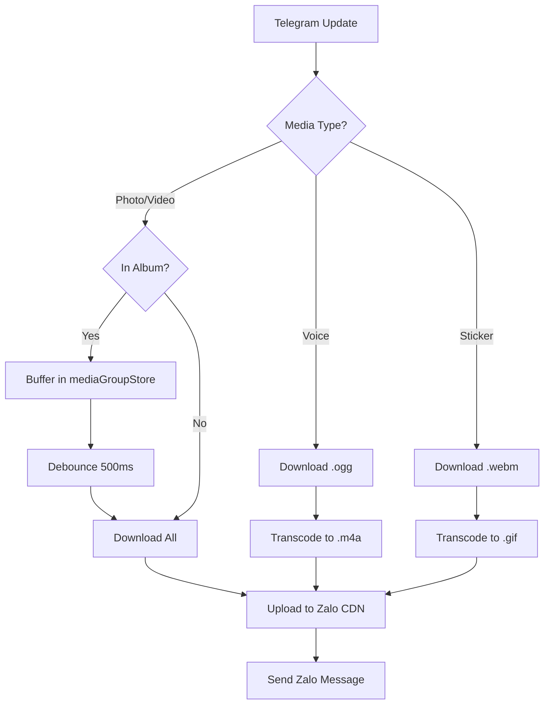

# Telegram Media Handling & Transcoding

This section describes how the bridge processes Telegram media (Photos, Videos, Stickers, Voice) before forwarding them to Zalo.

## Detailed Logic Description

Telegram media events are processed in `src/telegram/handler.ts`. The bridge handles individual media files and "Media Groups" (Albums).

### 1. Media Group (Album) Buffering
Telegram sends albums as separate message updates, each sharing the same `media_group_id`.
- **Store**: Uses `mediaGroupStore` to buffer incoming items.
- **Debounce**: Implements a **500ms debounce** (`flushMediaGroup`). Once the timer expires, all collected items are sent as a single Zalo message with multiple attachments.
- **File Reference**: [Bridge: src/telegram/handler.ts](https://github.com/williamcachamwri/zalo-tg/blob/805709dc70217fd46a1edb79d89ebc5f33874688/src/telegram/handler.ts#L2255)

### 2. Transcoding Logic (ffmpeg)
Because Zalo and Telegram use different native formats, the bridge uses `ffmpeg` for transcoding:
- **Voice**: Converts Telegram's `.ogg` (Opus) to Zalo's required `.m4a` (AAC).
- **Video Stickers**: Converts Telegram's `.webm` or `.tgs` to high-quality `.gif`.
- **Thumbnails**: Automatically extracts a frame from videos to provide Zalo with a preview image.
- **File Reference**: [Bridge: src/utils/media.ts](https://github.com/williamcachamwri/zalo-tg/blob/805709dc70217fd46a1edb79d89ebc5f33874688/src/utils/media.ts#L141)

### 3. File Downloads
- **Standard**: Calls `getFile` to get the `file_path`, then downloads from `https://api.telegram.org/file/bot<token>/<file_path>`.
- **Local API**: If a local server is used, the bridge detects `file://` URLs and uses **Zero-Copy** (direct `fs.copyFileSync`) to move the file to its temporary directory.

## Media Forwarding Pipeline



## Protocol Specification

### 1. getFile (Metadata)
- **Endpoint**: `GET /getFile?file_id=<ID>`
- **Response**:
    ```json
    {
      "ok": true,
      "result": {
        "file_id": "...",
        "file_size": 12345,
        "file_path": "photos/file_0.jpg"
      }
    }
    ```

### 2. File Download URL
- **Pattern**: `https://api.telegram.org/file/bot<token>/<file_path>`
- **Local Server**: Returns absolute filesystem path.

## File References

### Bridge
- **[src/telegram/handler.ts](https://github.com/williamcachamwri/zalo-tg/blob/805709dc70217fd46a1edb79d89ebc5f33874688/src/telegram/handler.ts)**: Media event processing and album flushing (L2255, L2514).
- **[src/utils/media.ts](https://github.com/williamcachamwri/zalo-tg/blob/805709dc70217fd46a1edb79d89ebc5f33874688/src/utils/media.ts)**: `downloadToTemp` (L62) and `convertToM4a` (L141).

### Telegraf
- **[telegraf-src/src/telegram.ts](https://github.com/telegraf/telegraf/blob/0638cf4cc7ba8467ccb9222726024c99c54d119f/src/telegram.ts)**: Implementation of `getFile` (L235) and `getFileLink` (L250).

## Technical Analysis
The 500ms debounce for albums is a critical synchronization point. Telegram delivers album items as completely separate HTTP updates; without this buffer, the bridge would send 10 separate Zalo messages for a single 10-photo album. By grouping them, it maintains the "Album" structure on the Zalo side, resulting in a significantly better user experience.
