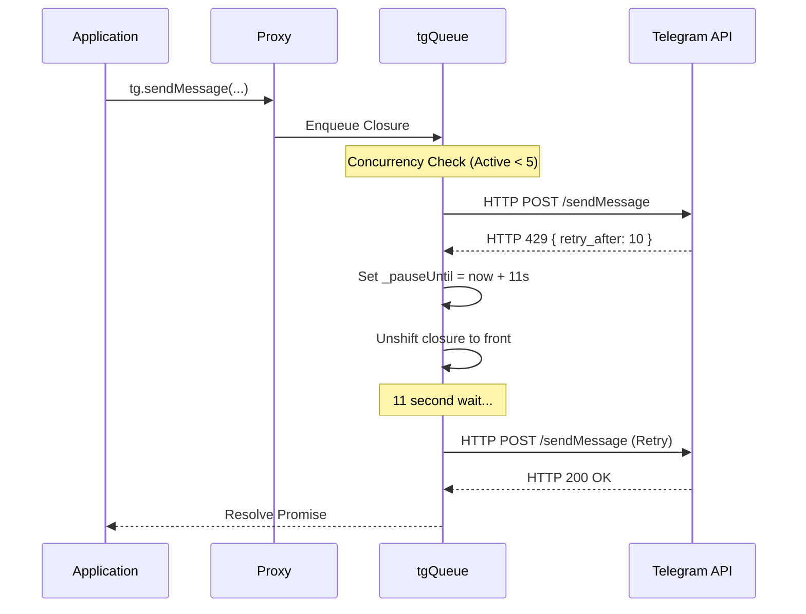

# Telegram Queueing and Rate Limiting

This section describes how the bridge manages Telegram's strict rate limits (429 errors) and ensures reliable message delivery using a concurrent queue and a global back-off mechanism.

## Detailed Logic Description

### 1. The Rate-Limit Aware Queue (`tgQueue`)
All outgoing Telegram API calls are routed through a centralized queue implementation in `src/utils/tgQueue.ts`.
- **Concurrency**: The queue allows up to **5 simultaneous** in-flight API calls.
- **Deduplication of Back-off**: Instead of each request retrying independently, the queue implements a **Global Pause**.

### 2. 429 Error Handling
When a Telegram request fails with an HTTP 429 status code:
1.  **Extraction**: the `is429` helper identifies the error and extracts the `retry_after` parameter (seconds) provided by Telegram.
2.  **Global Pause**: A global `_pauseUntil` timestamp is set to `Date.now() + (retry_after + 1) * 1000`.
3.  **Re-queueing**: The failed request is placed back at the **front of the queue** (`unshift`) for immediate execution once the pause expires.
4.  **Retries**: Requests are retried up to 5 times before failing permanently.

### 3. API Transparency (Proxy Wrapper)
To make rate-limiting transparent to the rest of the application, the bridge uses a **JavaScript Proxy** to wrap the Telegraf `telegram` instance.
- **Interception**: Every method call on the `tg` object is intercepted.
- **Automatic Queueing**: The proxy automatically wraps the original method call in a `tgQueue(() => ...)` closure.
- **Developer Experience**: Developers can write `tg.sendMessage(...)` as if it were a direct call, and it is automatically rate-limit managed.

## File References

### Bridge
- **[src/utils/tgQueue.ts](https://github.com/williamcachamwri/zalo-tg/blob/805709dc70217fd46a1edb79d89ebc5f33874688/src/utils/tgQueue.ts)**: Implementation of the queue and 429 logic.
- **[src/zalo/handler.ts](https://github.com/williamcachamwri/zalo-tg/blob/805709dc70217fd46a1edb79d89ebc5f33874688/src/zalo/handler.ts)**: Definition of the `tg` Proxy wrapper (L45).

### Telegraf
- **[telegraf-src/src/core/network/client.ts](https://github.com/telegraf/telegraf/blob/0638cf4cc7ba8467ccb9222726024c99c54d119f/src/core/network/client.ts)**: Protocol layer that performs requests and throws `TelegramError`.
- **[telegraf-src/src/core/network/error.ts](https://github.com/telegraf/telegraf/blob/0638cf4cc7ba8467ccb9222726024c99c54d119f/src/core/network/error.ts)**: Definition of `TelegramError` containing response parameters.

## Code Snippets

### Bridge: Proxy Wrapper
```typescript
// src/zalo/handler.ts
const tg = new Proxy(tgBot.telegram, {
  get(target, prop: string) {
    const orig = (target as any)[prop];
    if (typeof orig === 'function') {
      return (...args: any[]) => tgQueue(() => orig.apply(target, args));
    }
    return orig;
  }
});
```

### Bridge: 429 Detection & Back-off
```typescript
// src/utils/tgQueue.ts
function is429(err: unknown): number | null {
  if (err?.response?.error_code === 429) {
    return err.response.parameters?.retry_after ?? 30;
  }
  return null;
}
```

## Queue Lifecycle Diagram



## Technical Analysis
The decision to use a centralized queue with a global pause is critical for Telegram bots operating in high-volume environments. Without the global pause, multiple concurrent requests would all hit 429s independently, potentially leading to a "spiral" of rate limits and eventually a long-term ban. The Proxy wrapper ensures that this complex logic doesn't leak into the business logic of the Zalo handlers.
