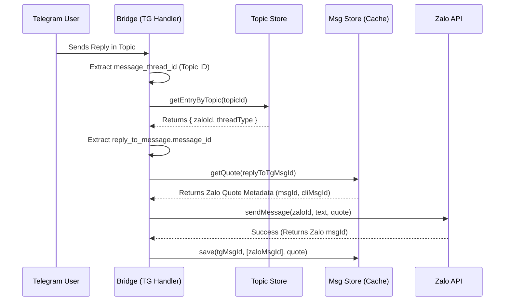

# Telegram Forum Topics and Routing logic

This section describes how the bridge utilizes Telegram Forum Topics to isolate conversations and how it routes messages between Zalo and Telegram.

## Detailed Logic Description

### 1. Topic-Based Conversation Isolation
The bridge uses the **Telegram Forum Topics** feature (also known as "Message Threads") to map each Zalo conversation (DM or Group) to a specific topic within a single Telegram Supergroup.

- **DMs**: Each Zalo user contact is mapped to a topic.
- **Groups**: Each Zalo group is mapped to a topic.

This mapping is stored in `data/topics.json` and cached in memory.

### 2. Topic Creation and Management
When a message arrives from Zalo, the bridge checks if a topic already exists for that conversation.

- **Creation**: If no mapping exists, `createForumTopic` is called.
    - **DM Topic**: Named "👤 Name", icon color Blue (`0x6FB9F0`).
    - **Group Topic**: Named "👥 Name", icon color Pink (`0xFF93B2`).
- **Renaming**: For DMs and Groups, if the name changes on Zalo, the bridge updates the topic name using `editForumTopic`.
- **Persistence**: Mapping includes `topicId` (Telegram `message_thread_id`), `zaloId` (UID or GroupID), `type` (DM or Group), and `name`.

### 3. Message Routing (Zalo → Telegram)
1.  **Inbound Zalo Event**: `src/zalo/handler.ts` receives a message.
2.  **Topic Lookup**: Calls `getOrCreateTopic(zaloId, type, displayName)`.
3.  **Forwarding**: The message is sent to the Telegram Group with the specific `message_thread_id`.
4.  **Message ID Mapping**: The resulting Telegram `message_id` is mapped to the Zalo `msgId` in `msgStore`.

### 4. Message Routing (Telegram → Zalo)
1.  **Inbound Telegram Message**: `src/telegram/handler.ts` listens for `message` events.
2.  **Context Check**: Filters by `config.telegram.groupId` and ensures the message is in a topic (`message_thread_id` is present).
3.  **Reverse Mapping**: `store.getEntryByTopic(topicId)` retrieves the Zalo target (`zaloId` and `threadType`).
4.  **Reply Handling**: If the message is a reply, `getZaloQuote` resolves the original Zalo message metadata using `msgStore`.
5.  **Dispatch**: The message (and optional quote/attachments) is sent to Zalo via `api.sendMessage`.

## File References

### Bridge
- [src/store.ts](https://github.com/williamcachamwri/zalo-tg/blob/805709dc70217fd46a1edb79d89ebc5f33874688/src/store.ts)
- [src/zalo/handler.ts](https://github.com/williamcachamwri/zalo-tg/blob/805709dc70217fd46a1edb79d89ebc5f33874688/src/zalo/handler.ts)
- [src/telegram/handler.ts](https://github.com/williamcachamwri/zalo-tg/blob/805709dc70217fd46a1edb79d89ebc5f33874688/src/telegram/handler.ts)

### Telegraf
- [telegraf-src/src/telegram.ts](https://github.com/telegraf/telegraf/blob/0638cf4cc7ba8467ccb9222726024c99c54d119f/src/telegram.ts)
- [telegraf-src/src/context.ts](https://github.com/telegraf/telegraf/blob/0638cf4cc7ba8467ccb9222726024c99c54d119f/src/context.ts)

## Code Snippets

### Bridge: Topic Store Entry Structure
```typescript
// src/store.ts#L30-L35
export interface TopicEntry {
  topicId: number;
  zaloId:  string;   // threadId (UID for DMs, groupId for groups)
  type:    0 | 1;    // 0 = ThreadType.User, 1 = ThreadType.Group
  name:    string;   // contact name or group name
}
```

### Bridge: Forwarding from Telegram to Zalo
```typescript
// src/telegram/handler.ts#L1879-L1887
// Look up the corresponding Zalo conversation
const entry = store.getEntryByTopic(topicId);
if (!entry) {
  console.warn(`[TG→Zalo] No Zalo mapping for topicId=${topicId}`);
  return;
}

const { zaloId } = entry;
const threadType: ThreadType = entry.type === 1 ? ThreadType.Group : ThreadType.User;
```

### Telegraf: createForumTopic Implementation
```typescript
// telegraf-src/src/telegram.ts#L1043-L1055
createForumTopic(
  chat_id: number | string,
  name: string,
  extra?: tt.ExtraCreateForumTopic
) {
  return this.callApi('createForumTopic', {
    chat_id,
    name,
    ...extra,
  })
}
```

## Technical Analysis: Message Routing Flow

### Flow Diagram: Telegram Reply back to Zalo



## Protocol Specification

### createForumTopic
**Method**: `POST`
**URL**: `https://api.telegram.org/bot<token>/createForumTopic`
**Body** (JSON):
```json
{
  "chat_id": -100123456789,
  "name": "👤 Nguyễn Văn A",
  "icon_color": 7322096
}
```

### editForumTopic
**Method**: `POST`
**URL**: `https://api.telegram.org/bot<token>/editForumTopic`
**Body** (JSON):
```json
{
  "chat_id": -100123456789,
  "message_thread_id": 123,
  "name": "👤 Nguyễn Văn B (New Name)"
}
```

### sendMessage (with Routing)
**Method**: `POST`
**URL**: `https://api.telegram.org/bot<token>/sendMessage`
**Body** (JSON):
```json
{
  "chat_id": -100123456789,
  "message_thread_id": 123,
  "text": "Hello from Telegram!",
  "reply_parameters": {
    "message_id": 456
  }
}
```
*(Note: `message_thread_id` is crucial for the message to appear in the correct Topic.)*
