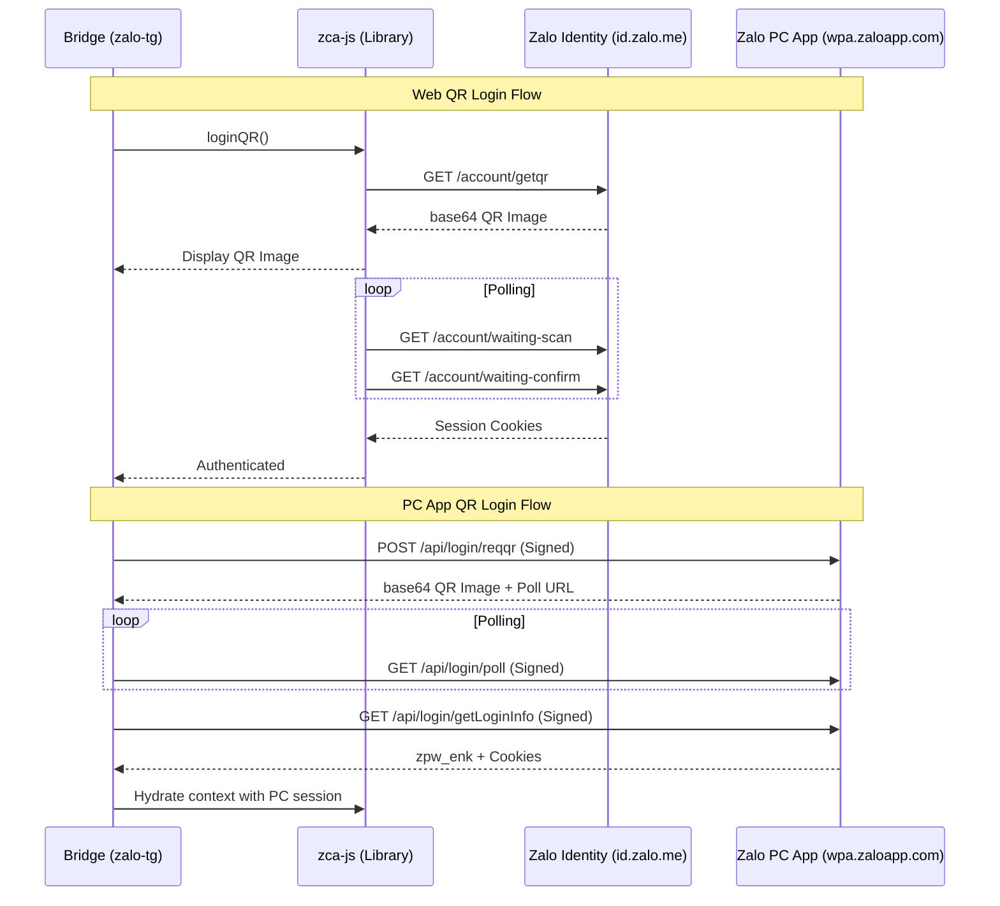

# Zalo Authentication & Session Management

## Detailed Logic Description

The Zalo authentication system in this bridge uses two primary flows: **Web QR Login** (native to `zca-js`) and **PC App QR Login** (custom implementation in the bridge).

### 1. Web QR Login (Internal zca-js Flow)
This flow emulates the browser-based Zalo Web handshake with the authentication server (`id.zalo.me`).

- **Sequence**:
    1. **`loadLoginPage`**: Fetches the initial Zalo Web login page to obtain the first set of cookies.
    2. **`getLoginInfo`**: Calls `https://id.zalo.me/account/logininfo` to get basic client metadata.
    3. **`verifyClient`**: Kicks off the client verification process.
    4. **`generate`**: Requests a new QR code via `https://id.zalo.me/account/getqr`. It parses the response to get the `qrCode` (token) and `base64ImageData`.
    5. **`waitingScan`**: Long-polls `https://id.zalo.me/account/waiting-scan` using the QR token. Transitions to **SCANNED** state.
    6. **`waitingConfirm`**: Long-polls `https://id.zalo.me/account/waiting-confirm`. Transitions to **CONFIRMED** state.
    7. **`checkSession`**: Retrieves the final session cookies.
    8. **`getUserInfo`**: Confirms the logged-in user profile.
- **File Reference**: [zca-js: src/apis/loginQR.ts](https://github.com/RFS-ADRENO/zca-js/blob/54df45d803fad7397eca04b2753cc0a894dc6e86/src/apis/loginQR.ts)

### 2. PC App QR Login (Advanced Bridge Flow)
This custom implementation mimics the official Zalo PC Desktop application (`wpa.zaloapp.com`).

- **Sequence**:
    1. **`reqqr`**: Requests a QR code from `https://wpa.zaloapp.com/api/login/reqqr`. It receives a Base64 image and a `pollUrl`.
    2. **`poll`**: Long-polls the provided URL until the user scans and confirms on their phone.
    3. **`getLoginInfo`**: Fetches the final session data from `https://wpa.zaloapp.com/api/login/getLoginInfo`.
- **Request Signing**: Every request to `wpa.zaloapp.com` requires a `signkey`.
    - `seed = 'zsecure' + endpointName + sortedParamValues`
    - `signkey = md5(seed)`
- **File Reference**: [Bridge: src/zalo/loginApp.ts](https://github.com/williamcachamwri/zalo-tg/blob/805709dc70217fd46a1edb79d89ebc5f33874688/src/zalo/loginApp.ts)

### 3. Transition & "Hydration"
A key strategy of the bridge is using the PC App session to "hydrate" the `zca-js` instance.
- **Remapping**: Cookies issued by `wpa.zaloapp.com` are remapped to the `chat.zalo.me` domain.
- **Service Map**: After a successful login, Zalo returns a `zpw_service_map_v3`. This is a critical internal dictionary that directs the library to the correct microservice domains for different features (e.g., `group-wpa.zalo.me`, `friend-wpa.zalo.me`).

## Sequence Diagram



## Protocol Specification

### 1. HTTP Headers (Mandatory)
Every request to Zalo infrastructure must include these headers to avoid `403 Forbidden`:
- **`User-Agent`**: `Mozilla/5.0 (Windows NT 10.0; Win64; x64) AppleWebKit/537.36 (KHTML, like Gecko) Zalo/23.12.1 Chrome/118.0.5993.159 Electron/27.1.3 Safari/537.36` (Identifies as Zalo PC).
- **`zpw_type`**: `30` (Protocol type for PC Application).
- **`zpw_ver`**: `671` (Current protocol version).
- **`Referer`**: `https://pc.zalo.me/`

### 2. PC App `reqqr` Request (Signed)
- **Endpoint**: `POST https://wpa.zaloapp.com/api/login/reqqr`
- **Body (Form-Encoded)**:
    ```
    type: 30
    client_version: 671
    computer_name: <OS_HOSTNAME>
    imei: <UUID_HASH>
    os_name: Windows
    os_version: 10
    signkey: <MD5_SIGNATURE>
    ```
- **Response Shape**:
    ```json
    {
      "error_code": 0,
      "data": {
        "qrCode": "...",       // Token for polling
        "qrCodeUrl": "...",    // Base64 image data
        "pollUrl": "..."       // URL for status checks
      }
    }
    ```

### 3. PC App `getLoginInfo` Request (Signed)
- **Endpoint**: `GET https://wpa.zaloapp.com/api/login/getLoginInfo`
- **Params**: `type=30&client_version=671&imei=...&qr_token=...&signkey=...`
- **Critical Response Fields**:
    - **`zpw_enk`**: The 16/24/32-byte AES session encryption key (Base64).
    - **`zpw_sek`**: The session secret used for cookie authentication.
    - **`cookies`**: An array of `Set-Cookie` strings.

### 4. Web `checksession` Request
- **Endpoint**: `GET https://id.zalo.me/account/checksession`
- **Required Cookies**: `z_uuid`, `zalopc_imei`, `fps_id`.
- **Response**: Returns the `zpsid` cookie which is used to access the `chat.zalo.me` domain.

## File References

### Bridge
- **[src/zalo/loginApp.ts](https://github.com/williamcachamwri/zalo-tg/blob/805709dc70217fd46a1edb79d89ebc5f33874688/src/zalo/loginApp.ts)**: PC App QR login implementation (L217).
- **[src/zalo/appApi.ts](https://github.com/williamcachamwri/zalo-tg/blob/805709dc70217fd46a1edb79d89ebc5f33874688/src/zalo/appApi.ts)**: Helper for using PC App session data (L30).

### zca-js
- **[src/apis/loginQR.ts](https://github.com/RFS-ADRENO/zca-js/blob/54df45d803fad7397eca04b2753cc0a894dc6e86/src/apis/loginQR.ts)**: Internal Web QR login flow (L90).
- **[src/apis/login.ts](https://github.com/RFS-ADRENO/zca-js/blob/54df45d803fad7397eca04b2753cc0a894dc6e86/src/apis/login.ts)**: Post-login session initialization (L12).
- **[src/context.ts](https://github.com/RFS-ADRENO/zca-js/blob/54df45d803fad7397eca04b2753cc0a894dc6e86/src/context.ts)**: Definition of the `LoginInfo` and `zpwServiceMap` structures (L63).
