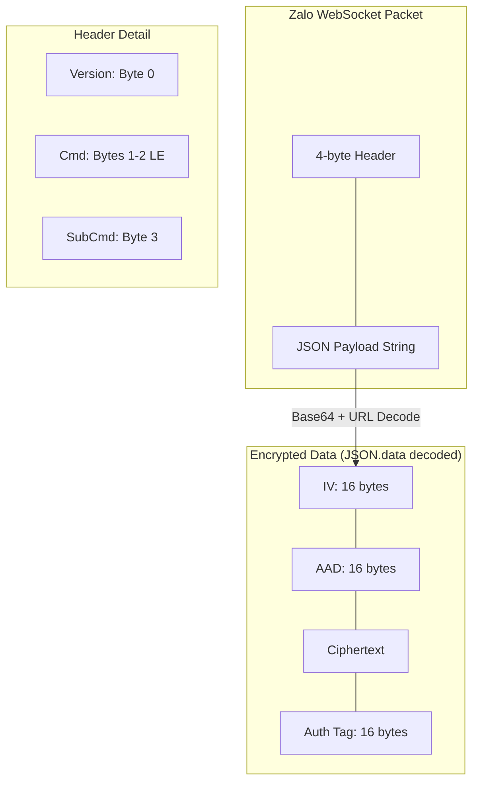

# Zalo Cryptography & Security

## Detailed Logic Description

This project implements Zalo's security model across three layers: standard HTTP parameters, binary WebSocket events, and request signing.

### 1. 4-byte Binary Header
The Zalo WebSocket protocol (used in `zca-js/src/apis/listen.ts`) uses a custom 4-byte header for every packet.
- **Byte 0 (uint8)**: Version (typically `1`).
- **Bytes 1-2 (uint16 LE)**: Command ID.
- **Byte 3 (uint8)**: Sub-command ID.
- **Logic**: The header is used to multiplex different event types (e.g., cmd 501 for messages) before the payload is parsed.
- **File Reference**: [zca-js: src/apis/listen.ts](https://github.com/RFS-ADRENO/zca-js/blob/54df45d803fad7397eca04b2753cc0a894dc6e86/src/apis/listen.ts#L485)

### 2. AES-GCM (WebSocket Events)
Encrypted event data within the WebSocket stream uses AES-256-GCM.
- **Handshake**: A cipher key is exchanged upon connection (`cmd: 1, subCmd: 1`).
- **IV (16 bytes)**: Bytes 0-15 of the decoded binary payload.
- **AAD (16 bytes)**: Bytes 16-31 of the decoded binary payload.
- **Ciphertext & Tag**: The remaining buffer contains the ciphertext followed by a 16-byte authentication tag.
- **Zlib Compression**: After decryption, the payload is often inflated using the `pako` library.
- **File Reference**: [zca-js: src/utils.ts](https://github.com/RFS-ADRENO/zca-js/blob/54df45d803fad7397eca04b2753cc0a894dc6e86/src/utils.ts#L380)

### 3. AES-CBC (API Parameters)
Standard HTTP API calls protect their `params` field using AES-CBC.
- **Algorithm**: AES-128/192/256-CBC with PKCS7 padding.
- **IV**: A fixed 16-byte buffer of zeros (`0x00`).
- **Key**: The `zpw_enk` session key.
- **File Reference**: [Bridge: src/zalo/appApi.ts](https://github.com/williamcachamwri/zalo-tg/blob/805709dc70217fd46a1edb79d89ebc5f33874688/src/zalo/appApi.ts#L64)

## Packet Structure Diagram

## Cryptographic Specification

### 1. WebSocket Binary Frame
The raw TCP/WebSocket payload for a message packet (e.g., cmd 501) looks like this:
- **`[0x01]`**: Version.
- **`[0xF5, 0x01]`**: Command 501 (Little Endian: `0x01F5` = 501).
- **`[0x00]`**: Sub-command.
- **`{ "msgs": [ ... ], "data": "BASE64_ENCRYPTED_BLOB" }`**: JSON string.

### 2. AES-GCM Payload Mapping
When the `data` field above is Base64-decoded, the resulting buffer is parsed as:
| Offset | Length | Description |
| :--- | :--- | :--- |
| 0 | 16 | **Initialization Vector (IV)** |
| 16 | 16 | **Additional Authenticated Data (AAD)** |
| 32 | variable | **Encrypted Ciphertext** |
| End-16 | 16 | **Authentication Tag** |

### 3. AES-CBC 'params' Construction
All POST requests to `wpa.zaloapp.com` follow this pattern:
1.  **JSON Body**: `{ "gridVerMap": "...", "type": 30 }`
2.  **Encryption**: `AES-256-CBC(JSON_Body, Key=zpw_enk, IV=zeros)`
3.  **Encoding**: `Base64(Ciphertext)`
4.  **Final Payload**: `params=BASE64_STRING` (URL-encoded).

### 4. Session Key Acquisition
The `zpw_enk` is provided as a Base64 string in the `getLoginInfo` response. 
- **Auto-Detection**: The library detects key length: 16 bytes (AES-128), 24 bytes (AES-192), or 32 bytes (AES-256).
- **Persistence**: It is saved in `data/app-session.json` and reused for all subsequent calls.

## File References

### Bridge
- **[src/zalo/appApi.ts](https://github.com/williamcachamwri/zalo-tg/blob/805709dc70217fd46a1edb79d89ebc5f33874688/src/zalo/appApi.ts)**: Core implementation of `encodeAes` (L64) using Node.js crypto.
- **[src/zalo/loginApp.ts](https://github.com/williamcachamwri/zalo-tg/blob/805709dc70217fd46a1edb79d89ebc5f33874688/src/zalo/loginApp.ts)**: Implementation of `signKey` (L45) for PC App auth.

### zca-js
- **[src/utils.ts](https://github.com/RFS-ADRENO/zca-js/blob/54df45d803fad7397eca04b2753cc0a894dc6e86/src/utils.ts)**: Implementation of `decodeEventData` (L380) for AES-GCM.
- **[src/apis/listen.ts](https://github.com/RFS-ADRENO/zca-js/blob/54df45d803fad7397eca04b2753cc0a894dc6e86/src/apis/listen.ts)**: Logic for binary header parsing (`getHeader` L485).
