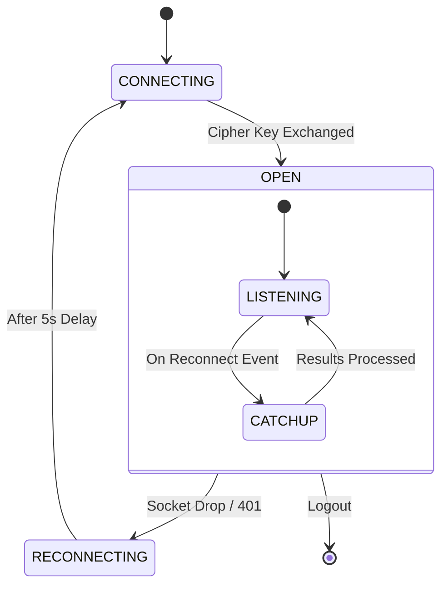

# Zalo Event Processing & Reconnection

## Detailed Logic Description

The Zalo event system operates across two layers: the `zca-js` library (transport/protocol) and the `zalo-tg` bridge (state management).

### 1. Listener State Machine
The `Listener` (in `zca-js/src/apis/listen.ts`) manages the WebSocket lifecycle:
- **CONNECTING**: The socket is initializing.
- **OPEN**: The cipher key has been exchanged (`cmd: 1, subCmd: 1`), and the `connected` event is emitted.
- **RECONNECTING**: If the socket drops, the bridge's `scheduleReconnect` logic (in `src/index.ts`) waits for a fixed 5-second window before attempting a fresh login and listener restart.
- **File Reference**: [zca-js: src/apis/listen.ts](https://github.com/RFS-ADRENO/zca-js/blob/54df45d803fad7397eca04b2753cc0a894dc6e86/src/apis/listen.ts#L55)

### 2. Catch-up Logic (Historical Sync)
Zalo's WebSocket does not automatically resend missed events. Upon reconnection, the bridge explicitly requests the latest history:
- **Commands**: `510/511` (Old Messages) and `610/611` (Old Reactions).
- **Execution**: `requestOldMessages` is called with `lastId: null` to fetch the most recent window. Results are replayed through the deduplicator.
- **File Reference**: [Bridge: src/index.ts](https://github.com/williamcachamwri/zalo-tg/blob/805709dc70217fd46a1edb79d89ebc5f33874688/src/index.ts#L51)

### 3. Deduplication Tiers
To handle re-emitted events (common when Zalo updates a message with a reaction), the bridge uses two tiers of suppression:
- **In-flight Tier**: A volatile `Set` (`_inFlightMsgIds`) in `handler.ts` tracks active message IDs for 10 seconds to catch rapid re-emits.
- **Persistent Tier**: The `msgStore` in `store.ts` maps Zalo IDs to Telegram IDs, surviving restarts and providing long-term duplicate suppression.
- **File Reference**: [Bridge: src/zalo/handler.ts](https://github.com/williamcachamwri/zalo-tg/blob/805709dc70217fd46a1edb79d89ebc5f33874688/src/zalo/handler.ts#L305)

## Listener Lifecycle Diagram

## File References

### Bridge
- **[src/zalo/handler.ts](https://github.com/williamcachamwri/zalo-tg/blob/805709dc70217fd46a1edb79d89ebc5f33874688/src/zalo/handler.ts)**: Core logic for event replaying and in-flight deduplication (L498).
- **[src/index.ts](https://github.com/williamcachamwri/zalo-tg/blob/805709dc70217fd46a1edb79d89ebc5f33874688/src/index.ts)**: Reconnection state management (L127).
- **[src/store.ts](https://github.com/williamcachamwri/zalo-tg/blob/805709dc70217fd46a1edb79d89ebc5f33874688/src/store.ts)**: Persistent mapping and deduplication store (L302).

### zca-js
- **[src/apis/listen.ts](https://github.com/RFS-ADRENO/zca-js/blob/54df45d803fad7397eca04b2753cc0a894dc6e86/src/apis/listen.ts)**: Core `Listener` implementation and catch-up commands (L55).
