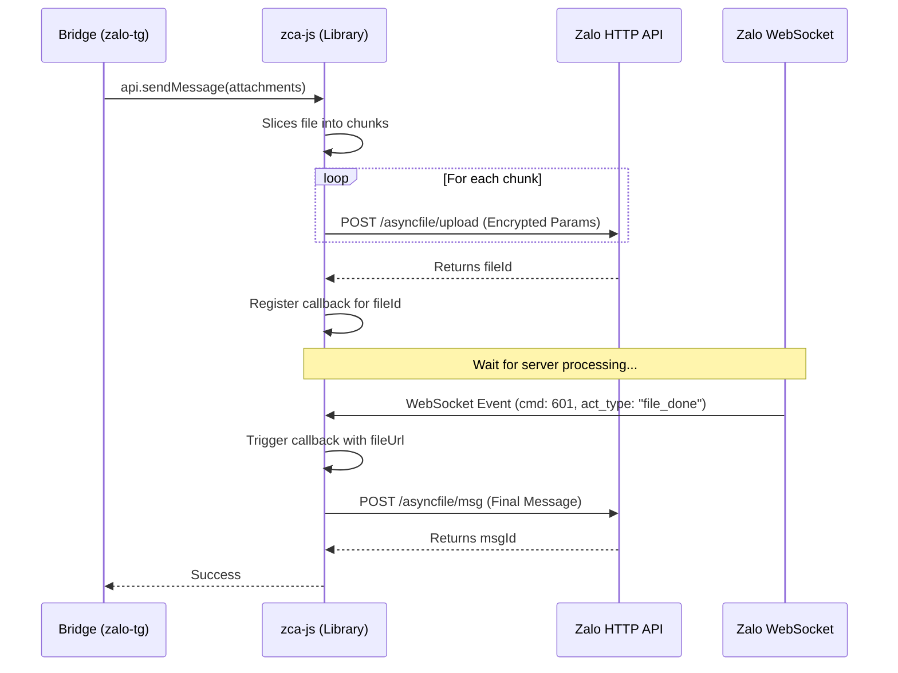

# Zalo Messaging & File Handling

## Detailed Logic Description

The bridge facilitates two-way communication between Zalo and Telegram, handling various message types and media formats. This requires mapping high-level actions to Zalo's encrypted internal Web API calls.

### 1. File Upload Lifecycle
The lifecycle for non-image attachments (Videos, Documents, Voice) follows a hybrid HTTP/WebSocket pattern:
- **Init**: `uploadAttachment` calculates chunking based on `chunk_size_file` (typically 512KB).
- **Upload**: Chunks are POSTed to `/asyncfile/upload`. Params are AES-256-CBC encrypted.
- **Registration**: The client receives a `fileId` and registers a listener in `ctx.uploadCallbacks`.
- **WebSocket Hook**: The Zalo server processes the file and sends a `cmd: 601` (Control) message over the WebSocket.
- **file_done**: The `Listener` detects `act_type: "file_done"`, extracts the final `fileUrl`, and triggers the callback.
- **Final Send**: The main messaging API (`asyncfile/msg`) is called with the `fileId` and `fileUrl`.
- **File Reference**: [zca-js: src/apis/uploadAttachment.ts](https://github.com/RFS-ADRENO/zca-js/blob/54df45d803fad7397eca04b2753cc0a894dc6e86/src/apis/uploadAttachment.ts#L110)

### 2. 'qmsg' and 'mentionInfo' Structures
- **mentionInfo**: A JSON array sent in the encrypted `params` field.
  `[{"pos": 0, "uid": "12345", "len": 6, "type": 0}]`
- **qmsg**: A string representing the text content of the quoted message. If quoting media, metadata is sent in `qmsgAttach`.
- **File Reference**: [zca-js: src/apis/sendMessage.ts](https://github.com/RFS-ADRENO/zca-js/blob/54df45d803fad7397eca04b2753cc0a894dc6e86/src/apis/sendMessage.ts#L344)

### 3. Protocol Message Types
Zalo uses integer IDs for message types:
- `webchat` -> 1
- `chat.voice` -> 31
- `chat.photo` -> 32
- `chat.sticker` -> 36
- `chat.video.msg` -> 44
- `share.file` -> 46
- **File Reference**: [zca-js: src/utils.ts](https://github.com/RFS-ADRENO/zca-js/blob/54df45d803fad7397eca04b2753cc0a894dc6e86/src/utils.ts#L477)

## Media Upload Flow



## Messaging Specification

### 1. SMS POST Body (Text Message)
- **Endpoint**: `POST https://chat.zalo.me/api/message/sms`
- **Params (JSON)**:
    ```json
    {
      "message": "Hello World",
      "clientId": "1717584000123",  // Current timestamp
      "toid": "123456789",         // Recipient UID
      "imei": "...",
      "ttl": 0,
      "mentionInfo": "[{\"pos\": 0, \"uid\": \"12345\", \"len\": 6, \"type\": 0}]"
    }
    ```

### 2. Multi-part Upload Form-Data
Each chunk is uploaded with the following fields:
- **`chunkContent`**: Binary blob of the chunk.
- **`params` (Encrypted JSON)**:
    ```json
    {
      "totalChunk": 5,
      "chunkId": 1,
      "totalSize": 2500000,
      "fileName": "video.mp4",
      "clientId": "1717584000456"
    }
    ```

### 3. WebSocket `file_done` Payload
- **Event**: `cmd 601` (Control)
- **JSON Structure**:
    ```json
    {
      "act_type": "file_done",
      "data": {
        "fileId": "abc-123",
        "fileUrl": "https://files-wpa.zalo.me/.../video.mp4",
        "checksum": "...",
        "totalSize": 2500000
      }
    }
    ```

## File References

### Bridge
- **[src/telegram/handler.ts](https://github.com/williamcachamwri/zalo-tg/blob/805709dc70217fd46a1edb79d89ebc5f33874688/src/telegram/handler.ts)**: Outbound routing and `sendAttachment` logic (L2054).
- **[src/utils/media.ts](https://github.com/williamcachamwri/zalo-tg/blob/805709dc70217fd46a1edb79d89ebc5f33874688/src/utils/media.ts)**: Media downloading and transcoding utilities (L62).

### zca-js
- **[src/apis/sendMessage.ts](https://github.com/RFS-ADRENO/zca-js/blob/54df45d803fad7397eca04b2753cc0a894dc6e86/src/apis/sendMessage.ts)**: Implementation of quotes and mentions (L43).
- **[src/apis/uploadAttachment.ts](https://github.com/RFS-ADRENO/zca-js/blob/54df45d803fad7397eca04b2753cc0a894dc6e86/src/apis/uploadAttachment.ts)**: File upload logic and multipart handling (L110).
- **[src/apis/listen.ts](https://github.com/RFS-ADRENO/zca-js/blob/54df45d803fad7397eca04b2753cc0a894dc6e86/src/apis/listen.ts)**: WebSocket `file_done` handler (L245).
