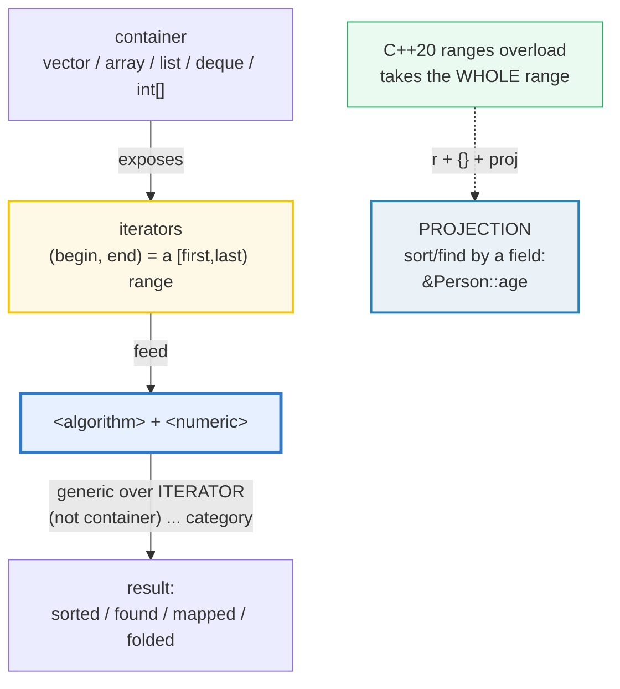
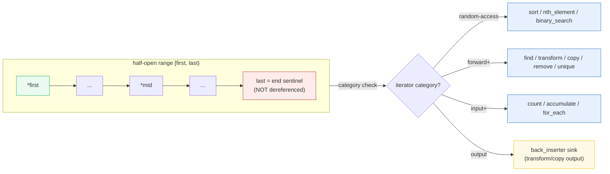
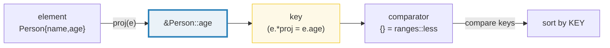

# ALGORITHMS — `<algorithm>` + `<numeric>`: Sort/Find/Transform/Accumulate & C++20 Ranges Projections

> **Goal (one line):** by printing every value, show how C++'s `<algorithm>`
> + `<numeric>` expose ~100 **generic algorithms over ITERATOR RANGES** —
> `sort`/`find`/`transform`/`accumulate`/`partition`/`unique`/`copy`/`minmax` —
> and how **C++20 ranges algorithms + PROJECTIONS**
> (`ranges::sort(v, {}, &Person::age)`) make them container-agnostic and
> field-aware — pinning the **`std::sort` is NOT stable** rule and the
> **erase-remove idiom** as documented expert payoffs (every verified path is
> deterministic: no `rand`/`now`, output iterators always have room).
>
> **Run:** `just run algorithms`
>
> **Ground truth:** [`algorithms.cpp`](./algorithms.cpp) → captured stdout in
> [`algorithms_output.txt`](./algorithms_output.txt). Every number/table below is
> pasted **verbatim** from that file under a `> From algorithms.cpp Section X:`
> callout. Nothing is hand-computed.
>
> **Prerequisites:** 🔗 [`VALUES_TYPES.md`](./VALUES_TYPES.md) (value-init, sizes),
> 🔗 [`REFERENCES_POINTERS_INTRO.md`](./REFERENCES_POINTERS_INTRO.md) (iterators
> are a generalization of pointers), 🔗 [`ARRAYS_STRINGS.md`](./ARRAYS_STRINGS.md)
> (the sequence containers these algorithms run over). Upcoming: 🔗
> `ITERATORS_RANGES` (P5) and 🔗 `CONTAINERS_SEQUENCE` (P5) — the dedicated
> treatments of the iterator categories and `std::vector`/`deque`/`list`.

---

## 1. Why this bundle exists (lineage)

C++ inherits from Stepanov & Lee's **STL** a radical idea: **separate the
algorithms from the containers.** A container (`vector`, `list`, `deque`, …)
holds data and exposes **iterators**; the algorithms in `<algorithm> and
<numeric> operate on iterator **ranges** `[first, last)` and know nothing about
which container produced them. The result is ~100 algorithms — sort, find,
transform, accumulate, partition, copy, unique, min/max, lower/upper bound, heap
ops, set ops, permutations, … — that work on **any** sequence whose iterators
meet the required category. One `std::sort` sorts a `vector`, an `array`, a raw
`int[]`, a `deque`, or a custom container — the algorithm is **parameterized by
iterator, not container.**

C++20 then added **`std::ranges::`** overloads (take the whole range, no
`begin`/`end` pair) plus **projections** — a callable applied to each element
before the algorithm runs, so `ranges::sort(people, {}, &Person::age)` sorts
people by age in one line (previously you wrote a comparator lambda).



The headline contrast across the 5-language curriculum:

| Language | Where do "algorithms" live? | Generic over |
|---|---|---|
| **C++** (this bundle) | **`<algorithm>` + `<numeric>`**, free-function overloads taking `[first,last)`; C++20 `ranges::` + projections | **any iterator range** (vector, array, list, deque, raw pointers, …) |
| 🔗 [`../rust/ITERATORS.md`](../rust/ITERATORS.md) | **`Iterator` trait methods** (`.map`/`.filter`/`.fold`/`.collect`) + free fns (`itertools`) | any `Iterator`-impl type (compile-time, borrow-checked) |
| 🔗 [`../ts/ARRAYS_TUPLES.md`](../ts/ARRAYS_TUPLES.md) | **`Array.prototype` methods** (`.map`/`.filter`/`.reduce`) | **arrays only** (under a GC) |
| 🔗 [`../go/`](../go/) | **none** — Go has **no** `<algorithm>`; you write the `for` loop (or pull `slices.Sort`) | n/a — the gap C++/Rust/TS fill |

C++'s distinctive bet: the algorithm is **a free function template** that
compiles against *your* iterator type (monomorphization — like Rust generics,
unlike Java's erasure). You pay in compile time and (historically) inscrutable
template errors; you gain a uniform vocabulary that works everywhere.

> From cppreference — *Algorithms library*: "The algorithms library … defines
> functions for a variety of purposes … that work on **ranges of elements**."
> And *Constrained algorithms (C++20)*: "ranges:: versions … take a **range**
> argument … and support **projections**."

---

## 2. The mental model: iterators are the algorithm boundary

Every classic algorithm has the same shape:

```cpp
std::algorithm(first, last, /* optional: out / pred / comp / init / op */);
```

`first`/`last` are **iterators** — generalized pointers. `[first, last)` is a
**half-open range**: `first` included, `last` excluded (so `last` is the
one-past-the-end sentinel, like `v.end()`). The algorithm never asks "what
container is this?"; it only advances iterators and compares/dereferences them.
That is the whole generality mechanism.



The **iterator category** gates which algorithms compile: `std::sort` needs
**random-access** iterators (so it can't sort a `std::list` directly — use
`list::sort` or `std::forward_list`'s); `std::find` only needs **input**
iterators; `std::transform`'s output needs an **output** iterator. Get the
category wrong and you get a template error at the call site. (🔗
`ITERATORS_RANGES` deepens the five categories.)

The **output sink** for `transform`/`copy` is the easy place to write UB: the
algorithm will write `N` values starting at your output iterator, so it **must
have room for N**. The safe idiom — used throughout this bundle — is
**`std::back_inserter(aVector)`**, which `push_back`s as it goes (grows the
container, never writes past the end).

---

## 3. Section A — `sort` (NOT stable) + `stable_sort` + `find`/`find_if`/`count`

> From `algorithms.cpp` Section A:
> ```
> (1) input            {5, 3, 8, 1, 9, 2, 7, 4, 6}
>     std::sort ->     {1, 2, 3, 4, 5, 6, 7, 8, 9}
> [check] std::sort produced ascending order: OK
> [check] sorted vector front == 1 (min): OK
> [check] sorted vector back  == 9 (max): OK
> (2) stable_sort by key on {1,1,1,2,2} (tags 10,11,12,20,21):
>     -> key/tag sequence: (1,10) (1,11) (1,12) (2,20) (2,21)
> [check] stable_sort kept key-1 tags in input order: 10,11,12: OK
> [check] stable_sort kept key-2 tags in input order: 20,21: OK
> [check] std::sort would NOT guarantee this (NOT stable) — documented, not run: OK
> (3) search source    {3, 1, 4, 1, 5, 9, 2, 6, 5}
> [check] std::find(begin,end,9) found 9 (iter != end): OK
> [check] std::find(begin,end,99) returned end (absent): OK
> [check] std::find_if(x>5) returned the first such element (9): OK
>     count(1)=2   count(5)=2   (difference_type)
> [check] count(1) == 2: OK
> [check] count(5) == 2: OK
>     count_if(even)=3
> [check] count_if(even) == 3 (the values 4,2,6): OK
> ```

**`std::sort(first, last)`** — sorts the range **in place** in non-descending
order (default comparator `operator<`). It is an **introsort** (quicksort +
heapsort fallback) — O(N log N), and **NOT stable**: the relative order of
*equal* elements is unspecified and may be reordered. This bundle therefore
**does not** assert an exact post-`sort` order on an equal-keyed input — that
output is compiler/library-dependent (§4.2 determinism rule). It sorts
*distinct* values (fully determined: ascending) and demonstrates stability
*deterministically* via `std::stable_sort`.

**`std::stable_sort(first, last)`** — same effect, **stable**: equal elements
keep their input order. Section A's `(2)` proves it: pairs keyed by `first` with
unique `second` tags; after `stable_sort` by key, the equal-key groups
(`{(1,10),(1,11),(1,12)}`, `{(2,20),(2,21)}`) preserve tag order. `stable_sort`
is O(N log² N) (or O(N log N) with extra memory) — slightly slower than `sort`,
so reach for it **only** when you need the stability.

**`std::find(first, last, value)`** — linear scan; returns an **iterator** to the
first match, or `last` if absent. **Always compare against `end` before
dereferencing** — dereferencing `end` is UB. `std::find_if(first, last, pred)`
takes a predicate (a lambda — 🔗 `LAMBDAS` / `FUNCTIONS_OVERLOADING`) and returns
the first element for which `pred(*it)` is true.

**`std::count(first, last, value)`** — returns the number of matches as a
**signed `difference_type`** (the iterator's `difference_type`, typically
`ptrdiff_t`), not `size_t`. Print/cast accordingly (`count_if` likewise).

> From cppreference — *`std::sort`*: "The order of **equal elements is not
> guaranteed to be preserved**." *`std::stable_sort`*: "The order of equivalent
> elements is **guaranteed to be preserved**." *`std::find`*: "returns the first
> iterator … `i` … `*i == value`"; if none, "returns `last`." *`std::count`*:
> "returns … the number of iterators … `difference_type`."

---

## 4. Section B — `transform` (map → `back_inserter`) + `accumulate` (fold) + `copy`/`copy_if`

> From `algorithms.cpp` Section B:
> ```
> source             {1, 2, 3, 4, 5}
> transform(*x) ->   {1, 4, 9, 16, 25}
> [check] transform produced squares {1,4,9,16,25}: OK
> accumulate(+, init=0) = 15
> [check] accumulate sum 1..5 == 15: OK
> accumulate(*, init=1) = 120   (5! = 120)
> [check] accumulate product 1..5 == 120: OK
> accumulate(string concat) = "1,2,3,4,5"
> [check] accumulate joined "1,2,3,4,5": OK
> copy (all) ->      {1, 2, 3, 4, 5}
> [check] copy reproduced the source: OK
> copy_if(even) ->   {2, 4}
> [check] copy_if(even) produced {2,4}: OK
> ```

**`std::transform(first, last, out, fn)`** — **MAP**: applies `fn` to each
element and writes the result to `out`. The sink `out` **must have room for N
outputs** — `std::back_inserter(aVector)` is the safe idiom (it `push_back`s on
each write, growing the container, so there is never an out-of-bounds write).
Writing into an under-sized buffer is **UB** (caught by ASan). Section B's
squares `{1,4,9,16,25}` come from `transform(src, back_inserter(squares), x*x)`.

**`std::accumulate(first, last, init, op=+)`** — **FOLD/REDUCE**: starts with
`init`, folds each element in via binary `op`. The default `op` is `+`, so
`accumulate(first, last, 0)` is a **sum**. Pass any binary callable to get other
folds — Section B demonstrates three:

- **sum** (`op = +`, `init = 0`) → `15`;
- **product** (`op = *`, `init = 1`) → `120` (= 5!);
- **string join** (`op` concatenates `acc + "," + x`, `init = ""`) → `"1,2,3,4,5"`.

**The `init` type fixes the accumulation type.** `init = 0` (int) ⇒ integer
sum; `init = 0.0` ⇒ double sum; `init = std::string("")` ⇒ string fold. This is
template deduction off the `init` argument — a common surprise (pass `0` to sum
`double`s and you get integer truncation). The C++23 / Rust-analog is
`std::ranges::fold_left` (C++23) and Rust's `.fold`; pre-23, `accumulate` is it.

**`std::copy` / `std::copy_if`** — copy all / matching elements to an output
iterator (again, `back_inserter` is the safe sink).

> From cppreference — *`std::transform`*: "applies the given function to a range
> and stores the result in another range, beginning at `d_first`." *`std::
> accumulate`*: "Computes the sum … `init` … optionally using `op`." *`std::copy`
> / `std::copy_if`*: copies the elements "to another range beginning at
> `d_first`."

---

## 5. Section C — the erase-remove idiom + `std::erase` (C++20) + `partition`/`unique`/`minmax`

> From `algorithms.cpp` Section C:
> ```
> (1) before erase-remove(value=2): {1, 2, 3, 2, 4, 2, 5}
>     after  erase-remove(value=2): {1, 3, 4, 5}
> [check] erase-remove removed ALL 2s -> {1,3,4,5}: OK
> (2) std::erase(b, 2) removed 3 element(s) -> {1, 3, 4, 5}
> [check] std::erase(b,2) removed all three 2s: OK
> [check] std::erase left {1,3,4,5}: OK
>     std::erase_if(c, odd) removed 4 -> {2, 4, 6, 8}
> [check] std::erase_if(odd) kept only evens {2,4,6,8}: OK
> (3) stable_partition(even first): {2, 4, 6, 8, 1, 3, 5, 7}
>     partition point: first 4 elements are even
> [check] is_partitioned(even-first) holds: OK
> [check] stable_partition kept evens in input order: 2,4,6,8: OK
> [check] stable_partition kept odds  in input order: 1,3,5,7: OK
> [check] std::partition (non-stable) would NOT guarantee intra-group order: OK
> (4) sort + unique + erase (dedup): {1, 2, 3}
> [check] unique dedup produced {1,2,3}: OK
> (5) min/max source: {7, 2, 9, 4, 1, 8, 3}
>     min=1  max=9  (minmax: min=1 max=9)
> [check] min_element == 1: OK
> [check] max_element == 9: OK
> [check] minmax_element matches min/max separately: OK
> ```

### The erase-remove idiom — THE classic C++ gotcha

`std::remove(first, last, value)` does **NOT shrink the container** — it can't
(it takes iterators, which can't resize their container). Instead it **reorders**
so the *kept* elements are at the front and returns the **new logical end**; the
`[new_end, old_end)` tail is in a moved-from state. You must then **`.erase`**
that tail to actually drop it:

```cpp
v.erase(std::remove(v.begin(), v.end(), x), v.end());   // pre-C++20 two-step
```

Forgetting the `.erase` is the classic newcomer bug: the "removed" element is
still there, just shifted past `new_end`. **C++20 collapses the dance into one
free function** — `std::erase(v, x)` and `std::erase_if(v, pred)` (uniform
container erasure, N4009) — which returns the count erased and does both steps.
Section C's `(2)` shows `std::erase(b, 2)` returning `3` and leaving `{1,3,4,5}`,
identical to the manual idiom in `(1)`.

### `partition` / `unique` / `min`/`max`/`minmax`

- **`std::partition(first, last, pred)`** — reorders so `pred`-true elements come
  first; returns the partition point. **NOT stable** (use
  `std::stable_partition` to keep intra-group order). This bundle uses
  `stable_partition` so the evens `{2,4,6,8}` and odds `{1,3,5,7}` each keep
  input order — a **deterministic** result — and asserts `std::is_partitioned`.
- **`std::unique(first, last)`** — collapses **adjacent** equal elements and
  returns the new end. To dedup *fully*, **sort first** (so all dups become
  adjacent), then `unique`, then `erase` — Section C's `(4)` turns
  `{3,1,3,2,1,3,2,1}` into `{1,2,3}`. (Like `remove`, `unique` needs the
  `.erase` to actually shrink.)
- **`std::min_element` / `max_element` / `minmax_element`** — return **iterators**
  to the min / max / both (`minmax_element` returns a `pair<min_it,max_it>`).
  Dereference to read the value, compare to `end` if the range might be empty.

> From cppreference — *`std::remove`*: "Removes … by shifting … returns … the
> new past-the-end iterator. **Does not change the size of the container.**"
> *`std::erase` (C++20)*: "Erases all elements … `== value` … from `c`." *Erase-
> remove idiom*: "a common C++ technique to eliminate elements … from a Standard
> Library container." *`std::unique`*: "removes all **adjacent** duplicate
> elements." *`std::partition`*: "the order of equal elements is not guaranteed
> to be preserved."

---

## 6. Section D — C++20 ranges algorithms + PROJECTIONS (sort by a field)

> From `algorithms.cpp` Section D:
> ```
> (1) ranges source       {5, 3, 8, 1, 9, 2, 7, 4, 6}
>     ranges::sort(v) ->   {1, 2, 3, 4, 5, 6, 7, 8, 9}
> [check] ranges::sort produced ascending order: OK
> [check] ranges::find(v,7) found 7: OK
> [check] ranges::count(v,7) == 1: OK
>     ranges::transform(*2)-> {2, 4, 6, 8, 10, 12, 14, 16, 18}
> [check] ranges::transform doubled each (front 2, back 18): OK
> (2) people before: Ada(36) Linus(54) Grace(85) Alan(41) 
>     ranges::sort(people, {}, &Person::age) -> Ada(36) Alan(41) Linus(54) Grace(85) 
> [check] projection sorted people by age ascending: Ada36, Alan41, Linus54, Grace85: OK
>     ranges::sort(people, greater, &Person::age) -> Grace(85) Linus(54) Alan(41) Ada(36) 
> [check] projection+greater sorted by age DESCENDING: Grace85..Ada36: OK
> [check] ranges::find(people, 54, &Person::age) found Linus(54): OK
> ```

**C++20 `std::ranges::` overloads** do two things the classic algorithms don't:

1. **Take the whole range** — `ranges::sort(v)` instead of
   `sort(v.begin(), v.end())`. No more `begin`/`end` boilerplate.
2. **Accept a projection** — an optional trailing callable applied to each
   element *before* the algorithm compares/operates. A **pointer-to-member** like
   `&Person::age` is a valid projection: `ranges` calls it as `proj(element)` →
   `element.*&Person::age` → the `age` field.



So `std::ranges::sort(people, {}, &Person::age)` reads: sort `people`, using the
**default comparator** (`{}` = `std::ranges::less`), keyed on the **age
projection** (`&Person::age`). Section D's `(2)` proves it: the input order
`Ada(36) Linus(54) Grace(85) Alan(41)` becomes `Ada(36) Alan(41) Linus(54)
Grace(85)` — sorted by age, ascending. Pass an explicit comparator to change
direction: `ranges::sort(people, std::ranges::greater{}, &Person::age)` sorts
**descending** by age.

**Why the projection argument order is `comp` *then* `proj`** (the question that
surprises everyone): the algorithms existed for decades with `comp` as the
second argument (after the iterators); C++20 kept that position to stay
familiar, and appended `proj` after it. So it's always
`ranges::algo(range, comp={}, proj={})`.

Projections also work on **`ranges::find` / `ranges::count`**: `ranges::find(
people, 54, &Person::age)` returns an iterator to the `Person` whose **age** is
`54` (here `Linus`), not whose whole-object equals `54`. The value you pass is
compared **after projection**.

> From cppreference — *Constrained algorithms*: "Most algorithms … have an
> additional input: **projection**. … a callable applied to each element before
> further processing." *`ranges::sort(r, comp = {}, proj = {})`*: "Sorts the
> elements … The order of equivalent elements is not guaranteed to be preserved."
> A pointer-to-member is a valid projection: it "returns the value of the
> indicated member."

---

## 7. Section E — Generic over iterators + execution-policy note

> From `algorithms.cpp` Section E:
> ```
> (1) sort over vector -> {1, 1, 2, 3, 4, 5, 6, 9}
>     sort over array   -> {1, 1, 2, 3, 4, 5, 6, 9}
>     sort over C-array -> {1, 1, 2, 3, 4, 5, 6, 9}
> [check] std::sort worked over std::vector: OK
> [check] std::sort worked over std::array: OK
> [check] std::sort worked over raw C-array (via pointers): OK
> (2) accumulate over the std::array -> 31
> [check] accumulate over the std::array == 31: OK
> (3) Execution policies (C++17): std::execution::seq / par /
>     par_unseq parallelize algorithms, but require linking a
>     backend (TBB on most toolchains) — NOT exercised here.
>     Every prior section used the sequential overload.
> [check] execution-policy note printed (par/par_unseq not run; need linking): OK
> (4) Cross-language: <algorithm> is GENERIC OVER ITERATORS —
>     the same sort/transform/accumulate works on any range whose
>     iterators meet the category. Contrast:
>       Rust Iterator methods (.map/.filter/.fold) — methods ON the
>         trait, generic over the iterator type (compile-time).
>       TS array methods (.map/.filter/.reduce) — ARRAY-only, under GC.
>       Go — NO <algorithm>; you write the for-loop yourself.
> [check] cross-language contrast printed (Rust/TS methods, Go no-lib): OK
> ```

**The defining property of `<algorithm>`**: the **same** `std::sort` template
compiles and runs over a `std::vector`, a `std::array`, and a raw `int[]`
(passed as pointers `cc, cc+8`). All three produce `{1,1,2,3,4,5,6,9}`. This is
monomorphization — the compiler stamps out a `sort` specialization for each
iterator type (🔗 `CLASS_TEMPLATES` / `FUNCTION_TEMPLATES`), exactly like Rust
generics and unlike Java's erased `Collections.sort`. The only requirement is
that the iterator meets `sort`'s category (**random-access**), which all three
do. `std::accumulate` likewise runs over the `std::array` (sum `31`) — one
generic template, any input range.

**Execution policies (C++17, `std::execution`)** — `seq` / `par` / `par_unseq` /
`unseq` — let you ask the algorithm to run **in parallel**:
`std::sort(std::execution::par, v.begin(), v.end())`. They are **not exercised
in this bundle** because `par`/`par_unseq` require **linking a parallel backend**
(Intel TBB on GCC/clang on Linux; partial/none on Apple clang), which breaks the
stdlib-first single-TU discipline. Every prior section used the sequential
overload (the default when you omit the policy). When you genuinely need
parallelism and have a backend linked, the policy is a one-argument prefix.

> From cppreference — *Execution policies*: "the parallel algorithms … may be
> executed … `std::execution::seq`, `::par`, `::par_unseq`, `::unseq` …"
> Implementation note: "Parallel versions of algorithms … require linking
> **Intel TBB**" on most toolchains.

---

## 8. Worked smallest-scale example

The five idioms a beginner must memorize, compressed:

```cpp
std::vector<int> v = {3,1,4,1,5,9,2,6};

std::sort(v.begin(), v.end());                         // sort in place (NOT stable)

auto it = std::find(v.begin(), v.end(), 9);            // -> iterator; check != end
auto gt = std::find_if(v.begin(), v.end(),             // -> first match of pred
                       [](int x){ return x > 4; });
auto n  = std::count(v.begin(), v.end(), 1);           // -> difference_type (signed)

std::vector<int> sq;
std::transform(v.begin(), v.end(), std::back_inserter(sq),  // MAP -> back_inserter
               [](int x){ return x*x; });
int sum = std::accumulate(v.begin(), v.end(), 0);           // FOLD (sum by default)

std::erase(v, 1);     // C++20: erase all 1s (replaces erase-remove idiom)
std::ranges::sort(v); // C++20: whole-range form (no begin/end)
```

> From `algorithms.cpp` Sections A–D: each line above is exercised and asserted.
> `find` returns an iterator you must compare to `end` (Section A `[check]`s);
> `transform` writes into a `back_inserter` so the sink always has room (Section
> B's squares); `accumulate` folds from `init` (Section B's sum/product/join);
> `std::erase` is the C++20 one-call form of the erase-remove idiom (Section C);
> `ranges::sort(v)` takes the whole range (Section D).

---

## 9. The value-vs-reference axis (threaded through this bundle)

🔗 `VALUE_VS_REFERENCE_VS_POINTER.md` / `MOVE_SEMANTICS.md` / `RAII.md`. Where
do the moving parts of an algorithm call sit?

| Construct in this bundle | Copied? | Aliases? | Owns? |
|---|---|---|---|
| `std::sort(v.begin(), v.end())` on `vector<int>` | moves the ints around | the vector still owns | vector owns |
| `std::sort` on a `vector<std::string>` | **moves** the strings (sort uses `std::swap`/`std::move`) | — | vector owns; strings not copied |
| `std::transform(..., back_inserter(out), fn)` | copies the mapped values into `out` | — | `out` owns the new values |
| `std::accumulate(first, last, init, op)` | folds by **value** through `acc` | — | the result value owns itself |
| A **lambda predicate** `[](const T& a, const T& b){ ... }` | captures by value or ref (you choose) | usually aliases via `const T&` params | no (borrowed) |
| A **projection** `&Person::age` | reads the member | aliases the element | no |

The expert detail: `std::sort` on a container of expensive-to-copy values does
**not** copy them — it **swaps/moves** (since C++11, sort uses move semantics for
the element shuffles). So `sort(vector<string>)` is cheap. The comparator /
projection / predicate you pass should take elements by **`const T&`** to avoid
copying on each comparison.

---

## 10. Pitfalls (the expert payoff)

| Trap | Symptom | Fix |
|---|---|---|
| `v.erase(std::remove(...))` forgetting the `.erase` | the "removed" element is still in `v`, just shifted past the logical end — silent size bug | Use the **full** idiom, or C++20 `std::erase(v,x)` / `std::erase_if(v,pred)`. |
| Assuming `std::sort` is stable | equal elements **reorder silently** — wrong output when equal-key order matters (e.g. secondary sort) | Use `std::stable_sort`. (Same for `partition` vs `stable_partition`.) |
| `transform`/`copy` into an under-sized output | **OOB write = UB**; ASan reports a heap-buffer-overflow | Use `std::back_inserter(aVector)` (grows as it writes), or pre-`resize` to N. |
| Dereferencing `find`'s result without checking `!= end` | if not found, `*it` dereferences `end` → **UB** | `if (it != v.end())` before `*it`. |
| `std::accumulate(first, last, 0)` on `vector<double>` | `init=0` (int) ⇒ **integer truncation** of the sum | Pass `init = 0.0` (or the target type) so deduction gives you the right accumulation type. |
| `std::unique` without sorting first | only **adjacent** dups collapse; non-adjacent dups survive | `sort` first (so all dups become adjacent), then `unique`, then `erase`. |
| `std::sort` on a `std::list` | **won't compile** — `list` iterators are bidirectional, not random-access | Use `list::sort()` (member), or copy to a `vector`, sort, copy back. |
| Comparing `std::count`'s result to a `size_t` with `==` | sign-compare warning (`count` returns signed `difference_type`) | Compare to a signed value, or cast explicitly. |
| `std::execution::par` with no backend linked | link error (`undefined reference to …tbb…`) on most toolchains | Link `-ltbb` (Intel TBB), or omit the policy (sequential). Apple clang support is partial. |
| Projection in the wrong slot (`ranges::sort(v, &Person::age)`) | the pointer-to-member is interpreted as the **comparator** → compile error / nonsense | comparator **then** projection: `ranges::sort(v, {}, &Person::age)` (`{}` = default comp). |
| Modifying the range while iterating with an algorithm | iterator invalidation → **UB** (e.g. `erase` mid-`for_each`) | Don't mutate the container from inside an algorithm's predicate; pre-collect indices or use the erase-remove idiom. |
| `auto x = std::remove(...)` and think `v` shrank | `remove` returns an iterator; `v.size()` is **unchanged** | Always pair `remove` with `erase`: `v.erase(remove(...), v.end())`. |

---

## 11. Cheat sheet

```cpp
#include <algorithm>   // sort, find, transform, copy, remove, partition, unique,
                       //   min/max_element, ... AND ranges:: overloads
#include <numeric>     // accumulate (fold/reduce)
#include <iterator>    // std::back_inserter (the safe transform/copy sink)
#include <vector>      // std::vector + C++20 std::erase / std::erase_if

// ── Sorting (NOT stable) ─────────────────────────────────────────────────
std::sort(v.begin(), v.end());                 // ascending, in place
std::sort(v.begin(), v.end(), std::greater{}); // descending
std::stable_sort(v.begin(), v.end());          // STABLE (equal order kept)
//   sort NEEDS random-access iterators -> won't compile on std::list.

// ── Searching / counting ─────────────────────────────────────────────────
auto it  = std::find(v.begin(), v.end(), x);   // -> first x, or v.end()
auto it2 = std::find_if(v.begin(), v.end(), pred);
auto n   = std::count(v.begin(), v.end(), x);  // difference_type (SIGNED)
//   ALWAYS check it != v.end() BEFORE *it.

// ── Map / fold ───────────────────────────────────────────────────────────
std::transform(v.begin(), v.end(), std::back_inserter(out), fn);  // MAP
int  sum  = std::accumulate(v.begin(), v.end(), 0);               // SUM (init=int)
int  prod = std::accumulate(v.begin(), v.end(), 1,
                            [](int a,int b){ return a*b; });      // PRODUCT
//   init's TYPE fixes the accumulation type (0.0 -> double sum).

// ── Erasing elements ────────────────────────────────────────────────────
v.erase(std::remove(v.begin(), v.end(), x), v.end()); // pre-C++20 idiom
std::erase(v, x);                                     // C++20 (returns count)
std::erase_if(v, pred);                               // C++20 predicate form

// ── Partition / unique / minmax ──────────────────────────────────────────
auto pt = std::stable_partition(v.begin(), v.end(), pred); // stable; pt = split
v.erase(std::unique(v.begin(), v.end()), v.end());   // dedup AFTER sort
auto mn = std::min_element(v.begin(), v.end());       // -> iterator
auto mm = std::minmax_element(v.begin(), v.end());    // pair<min_it,max_it>

// ── C++20 ranges: whole-range form + PROJECTIONS ─────────────────────────
std::ranges::sort(v);                                 // no begin/end needed
std::ranges::sort(people, {}, &Person::age);         // {} = default comp; proj = age
std::ranges::sort(people, std::ranges::greater{}, &Person::age); // descending by age
std::ranges::find(people, 54, &Person::age);         // find person whose age==54

// ── Execution policies (C++17; need -ltbb for par/par_unseq) ──────────────
// std::sort(std::execution::par, v.begin(), v.end());  // parallel — link TBB
```

---

## 12. 🔗 Cross-references

**Within C++ (the expertise spine):**

- 🔗 `ITERATORS_RANGES` (P5, upcoming) — the five iterator categories
  (input/output/forward/bidirectional/random-access/contiguous) are the
  **compile-time constraint** that decides which algorithms a range supports.
  `sort` needs random-access; `find` needs only input; that's the gate.
- 🔗 `CONTAINERS_SEQUENCE` (P5, upcoming) — `std::vector`/`deque`/`list`/`forward_list`
  are the containers these algorithms run over. Note `list`/`forward_list`
  iterators are **not random-access**, so `std::sort` won't compile on them
  (use the member `.sort()`).
- 🔗 [`REFERENCES_POINTERS_INTRO.md`](./REFERENCES_POINTERS_INTRO.md) — iterators
  are a **generalization of pointers**; `[first, last)` is the half-open range
  the algorithms speak in. Raw pointers `cc, cc+8` ARE valid iterators (Section E).
- 🔗 [`FUNCTIONS_OVERLOADING.md`](./FUNCTIONS_OVERLOADING.md) / `LAMBDAS` —
  `find_if`/`transform`/`partition` all take **callables** (lambdas, function
  pointers, functors). The lambda is how you customize a generic algorithm.
- 🔗 [`FUNCTION_TEMPLATES.md`](./FUNCTION_TEMPLATES.md) /
  [`CLASS_TEMPLATES.md`](./CLASS_TEMPLATES.md) — `<algorithm>` is **a header of
  function templates**; each call monomorphizes against your iterator type.
- 🔗 [`MOVE_SEMANTICS.md`](./MOVE_SEMANTICS.md) — `std::sort` on
  `vector<string>` is cheap because sort **moves/swaps** elements, not copies.
- 🔗 `UNDEFINED_BEHAVIOR` (P7) — OOB output writes, dereferencing `end`, and
  iterator invalidation mid-algorithm are all UB; ASan/UBSan (what
  `just sanitize` runs) catch them.

**Cross-language parallels (the 5-language curriculum):**

- 🔗 [`../rust/ITERATORS.md`](../rust/ITERATORS.md) — Rust's **`Iterator` trait
  methods** (`.map`/`.filter`/`.fold`/`.take_while`/`.collect`) are the moral
  equivalent: lazy, generic over the iterator type, compile-time checked. C++'s
  algorithms are **eager free functions** over `[first,last)`; Rust's are
  **lazy methods** on the trait, composed into iterator chains. Same algorithms,
  different ergonomics.
- 🔗 [`../ts/ARRAYS_TUPLES.md`](../ts/ARRAYS_TUPLES.md) — TS's
  **`Array.prototype` methods** (`.map`/`.filter`/`.reduce`/`.find`/`.sort`) are
  the same idea but **array-only** (and `.sort()` **coerces to string by
  default** — a famous JS footgun). C++ is generic over **any** iterator range,
  and `std::sort` is type-correct.
- 🔗 [`../go/`](../go/) — Go has **no** `<algorithm>` package of generic
  algorithms; you write the `for` loop yourself (the standard library added
  `slices.Sort`/`slices.Contains` only in Go 1.21/1.23, narrowly). The gap
  C++/Rust/TS fill is the gap Go leaves to the programmer.

---

## Sources

Every signature, value, and behavioral claim above was verified against
cppreference and the ISO C++ standard, then corroborated by ≥1 independent
secondary source:

- cppreference — *Algorithms library* (`<algorithm>` overview; the ~100
  algorithms grouped by purpose; constrained C++20 ranges overloads):
  https://en.cppreference.com/w/cpp/algorithm
- cppreference — *`std::sort`* (introsort; **"the order of equal elements is not
  guaranteed to be preserved"** — NOT stable; complexity O(N log N)):
  https://en.cppreference.com/w/cpp/algorithm/sort
- cppreference — *`std::stable_sort`* (stable; equal elements keep their input
  order; O(N log² N) / O(N log N) with extra memory):
  https://en.cppreference.com/w/cpp/algorithm/stable_sort
- cppreference — *`std::find` / `std::find_if`* (linear scan; returns first
  match or `last`; always compare to `end` before deref):
  https://en.cppreference.com/w/cpp/algorithm/find
- cppreference — *`std::count` / `std::count_if`* (returns `difference_type`,
  i.e. signed):
  https://en.cppreference.com/w/cpp/algorithm/count
- cppreference — *`std::transform`* (unary/binary map; writes to `d_first`,
  which must have room):
  https://en.cppreference.com/w/cpp/algorithm/transform
- cppreference — *`std::accumulate`* (fold; `init` + optional `op`; the init
  type fixes the accumulation type):
  https://en.cppreference.com/w/cpp/algorithm/accumulate
- cppreference — *`std::copy` / `std::copy_if`*:
  https://en.cppreference.com/w/cpp/algorithm/copy
- cppreference — *`std::remove` / `std::remove_if`* ("Removes … by shifting …
  **Does not change the size of the container**"; returns new past-the-end):
  https://en.cppreference.com/w/cpp/algorithm/remove
- cppreference — *`std::erase` / `std::erase_if` (C++20 uniform container
  erasure)* — the one-call replacement for the erase-remove idiom:
  https://en.cppreference.com/w/cpp/container/vector/erase2
- cppreference — *`std::partition` / `std::stable_partition`* (partition is NOT
  stable; `stable_partition` is):
  https://en.cppreference.com/w/cpp/algorithm/partition
- cppreference — *`std::unique`* (removes **adjacent** equal elements; returns
  new end; pair with `erase`, and sort first for full dedup):
  https://en.cppreference.com/w/cpp/algorithm/unique
- cppreference — *`std::min_element` / `std::max_element` / `std::minmax_element`*
  (return iterators; `minmax_element` returns `pair<min,max>`):
  https://en.cppreference.com/w/cpp/algorithm/minmax_element
- cppreference — *Constrained algorithms (C++20 `std::ranges::`)* — whole-range
  form + **projections** (pointer-to-member is a valid projection):
  https://en.cppreference.com/w/cpp/algorithm
- cppreference — *`std::ranges::sort`* (`ranges::sort(r, comp = {}, proj = {})`:
  comparator is the 2nd argument, projection is the 3rd; equivalent elements may
  reorder):
  https://en.cppreference.com/cpp/algorithm/ranges/sort
- cppreference — *Execution policies (C++17)* — `seq`/`par`/`par_unseq`/`unseq`;
  parallel algorithms require linking a backend:
  https://en.cppreference.com/w/cpp/algorithm/execution_policy_tag_t
- Standard C++ — *N4009 Uniform Container Erasure* (`std::erase`/`std::erase_if`,
  the C++20 one-call erase-remove; rationale and signatures):
  https://isocpp.org/files/papers/n4009.txt
- ISO C++23 draft (open-std.org) — normative wording:
  - 25 Algorithms library `[algorithms]`
  - 26 Ranges `[ranges]` (the constrained algorithm overloads + projections)
  - Working draft: https://open-std.org/JTC1/SC22/WG21/docs/papers/2023/n4950.pdf

**Secondary corroboration (≥2 independent sources, web-verified):**

- *Why do range algorithms have projection argument after comparator?* — Stack
  Overflow (confirms `ranges::sort(r, comp={}, proj={})` argument order):
  https://stackoverflow.com/questions/67736467/why-do-range-algorithms-have-projection-argument-after-comparator-argument
- *Examples of Projections from C++20 Ranges* — C++ Stories (Bartlomiej Filipek;
  pointer-to-member as projection, `ranges::sort(people, {}, &Person::age)`):
  https://www.cppstories.com/2023/projections-examples-ranges/
- *Projections are Function Adaptors* — Barry Revzin (the projection is applied
  to each element before comparison; default comparator is `ranges::less`):
  https://www.brevzin.github.io/c++/2022/02/13/projections-function-adaptors/
- *std::stable_sort vs std::sort* — StudyPlan / Codeforces (confirms
  `std::sort` is NOT stable, `std::stable_sort` is):
  https://www.studyplan.dev/pro-cpp/range-based-algorithms/q/std-sort-vs-stable-sort
  and https://codeforces.com/blog/entry/88488
- *Erase–remove idiom* — Wikipedia (the two-step dance; C++20 `std::erase`
  collapses it):
  https://en.wikipedia.org/wiki/Erase%E2%80%93remove_idiom
- *How to erase from an STL container* — Arthur O'Dwyer (erase-remove works
  great for vector/deque; C++20 `std::erase`/`std::erase_if`):
  https://quuxplusone.github.io/blog/2020/07/08/erase-if/

**Facts that could not be verified by running** (documented, not executed,
because they require linking, a different toolchain, or would be non-
deterministic): `std::sort`'s exact reordering of equal elements (unspecified —
varies by library; we demonstrate stability via `stable_sort` instead);
`std::execution::par` parallelism (needs linking Intel TBB / partial on Apple
clang); `std::sort` on `std::list` (won't compile — needs random-access
iterators). These are confirmed by the cppreference sections and secondary
sources above, not reproduced as runnable output in the verified path.
