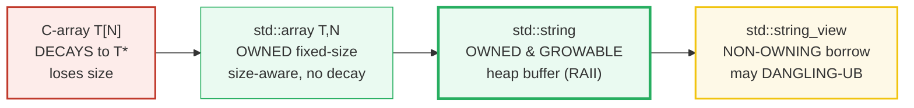
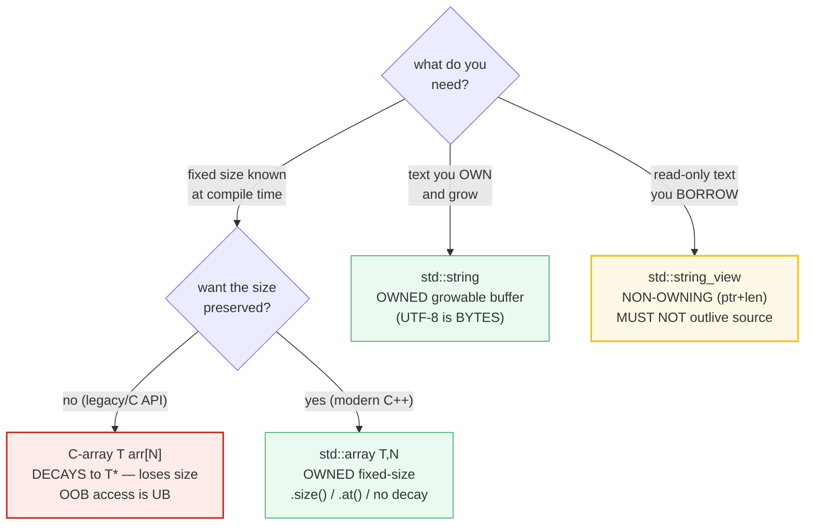
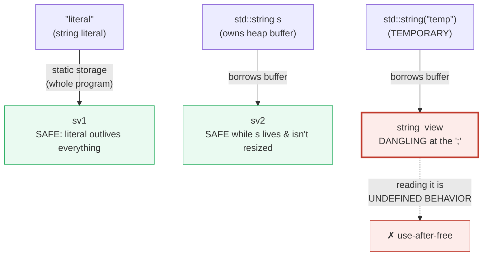

# ARRAYS_STRINGS — C-arrays, std::array, std::string & std::string_view

> **Goal (one line):** by printing every value, show how C++'s four sequence
> storage kinds differ — the **C-array** (which *decays to a pointer and loses
> its size*), **`std::array<T,N>`** (a size-aware, value-semantic, no-decay
> wrapper), **`std::string`** (an *owned*, growable byte sequence), and C++17
> **`std::string_view`** (a *non-owning* borrow with the dangling-view UB trap) —
> pinning out-of-bounds-as-UB and the dangling-`string_view` as documented expert
> payoffs (never executed in the verified path).
>
> **Run:** `just run arrays_strings`
>
> **Ground truth:** [`arrays_strings.cpp`](./arrays_strings.cpp) → captured stdout
> in [`arrays_strings_output.txt`](./arrays_strings_output.txt). Every
> number/table below is pasted **verbatim** from that file under a
> `> From arrays_strings.cpp Section X:` callout. Nothing is hand-computed.
>
> **Prerequisites:** 🔗 [`VALUES_TYPES.md`](./VALUES_TYPES.md) (value-init, sizes,
> `const`/`constexpr`). This is the storage-kind companion: where `VALUES_TYPES`
> pinned *what one value is*, this bundle pins *what a *sequence* of values is*.

---

## 1. Why this bundle exists (lineage)

C++ inherits C's **raw arrays** — and with them C's most famous bug source: an
array **decays to a pointer** the moment you do almost anything with it (pass it
to a function, return it, take its address), **throwing away its size**. That is
why `void f(int a[]) { … }` has *no idea* how big `a` is, and why C code is full
of `(array, length)` pairs. C++ then layers three better-behaved kinds on top:

- **`std::array<T,N>`** (C++11) — the same fixed-size, zero-overhead block as a
  C-array, but it **knows its size**, is a **true value type** (copyable), and
  **does not decay**.
- **`std::string`** — an **owned**, **growable** byte sequence (value type; it
  owns its heap buffer and frees it on destruction — RAII).
- **`std::string_view`** (C++17) — a **non-owning** `(pointer, length)` borrow,
  cheap to pass and the idiomatic read-only text parameter — but with a trap:
  it **must not outlive its referent**.



The headline contrast across the 5-language curriculum:

| Language | Fixed array | Growable array | String | Non-owning text borrow |
|---|---|---|---|---|
| **C++** (this bundle) | `T[N]` (decays) / `std::array` | `std::vector` (P5) | `std::string` (owned bytes) | `std::string_view` (**may dangle → UB**) |
| 🔗 [`../go/ARRAYS_SLICES.md`](../go/ARRAYS_SLICES.md) | `[N]T` (value, no decay) | slice `[]T` (ptr+len+cap) | `string` (immutable bytes) | `[]byte` view (GC-safe) |
| 🔗 [`../rust/core/STRINGS_STR.md`](../rust/core/STRINGS_STR.md) | `[T; N]` (no decay) | `Vec<T>` | `String` (owned UTF-8) | `&str` (**borrow checked by borrowck — no UB**) |
| 🔗 [`../ts/STRINGS_CHARS.md`](../ts/STRINGS_CHARS.md) | `Array` / `tuple` | `Array` (growable) | `string` (immutable UTF-16) | n/a (GC + immutable) |

C++ is the only language here that gives you a *non-owning borrow* (`string_view`)
**without** a borrow checker to keep it alive — so the dangling-view read is
**undefined behavior**, not a compile error. That trap, plus the C-array decay,
plus out-of-bounds being UB, are the three things this bundle pins.

> From cppreference — *Arrays*: "There is an **implicit conversion** (array-to-
> pointer conversion) … lvalue of type 'array of N T' … can be converted to a
> prvalue of type 'pointer to T'. The result is a pointer to the first element."
> (This is the decay.)

---

## 2. The mental model: four storage kinds on the ownership axis



Two facts cut across all four:

- **Does it own its memory?** C-arrays, `std::array`, and `std::string` *own*
  their storage (freed automatically at end of scope — RAII). `string_view`
  *borrows* — it owns nothing, so it can dangle.
- **Is out-of-bounds checked?** No, by default. `operator[]` on a C-array,
  `std::array`, `std::string`, and `string_view` is **unchecked — OOB is UB**.
  Only `std::array::at` / `std::string::at` are *checked* (they throw
  `std::out_of_range`). This bundle uses `.at()` for any access that *might* be
  OOB and documents the `[]` UB trap without executing it.

---

## 3. Section A — C-style array `T[N]`: decays to `T*`, loses size; OOB is UB

> From `arrays_strings.cpp` Section A:
> ```
> int carr[5] = {10,20,30,40,50};
>   sizeof(carr)                = 20  (= 5 * sizeof(int)=20)
>   sizeof(carr)/sizeof(carr[0]) = 5  (the manual size trick)
>   carr[0]=10  carr[4]=50  (valid indices 0..4)
> 
> sizeofDecayedParam(carr) = 8  (== sizeof(int*)=8 — size LOST on pass!)
> [check] C-array: sizeof(carr) == 5 * sizeof(int): OK
> [check] C-array: sizeof(carr)/sizeof(carr[0]) == 5 (size trick in defining scope): OK
> [check] C-array DECAYS: sizeof(param) == sizeof(int*) (size lost on pass): OK
> 
> carr[5] / carr[99] would be OUT-OF-BOUNDS -> UNDEFINED BEHAVIOR
>   (C-arrays have NO bounds check; the verified path never reads OOB.)
>   (DEMO_UB not defined: the OOB read is correctly omitted from this build.)
> [check] C-array OOB access is UB (documented; not executed in verified path): OK
> ```

**What.** `int carr[5]` is a contiguous block of 5 ints. In the *defining* scope,
`sizeof(carr) == 5 * sizeof(int) == 20`, and the manual size trick
`sizeof(carr)/sizeof(carr[0]) == 5` recovers the element count.

**Why — the decay trap.** The moment you pass `carr` to a function, the
*array-to-pointer conversion* fires: `carr` (type `int[5]`) becomes a pointer to
its first element (type `int*`). Inside `void f(int* a)` — which is **exactly**
what the spelling `void f(int a[])` means, by parameter-type adjustment —
`sizeof(a)` is `sizeof(int*) == 8`, **not** `5 * sizeof(int)`. **The size is
gone.** This is *why* every classic C function takes `(pointer, length)`: the
length cannot be recovered from the pointer. (Note: the bundle writes the
parameter as `int* a` on purpose — writing `int a[]` and then `sizeof(a)` trips
clang's `-Wsizeof-array-argument`, the compiler literally warning about the bug
this section teaches.)

> From cppreference — *Implicit conversion / Array-to-pointer conversion*:
> "lvalue or rvalue of type 'array of N T' … can be converted to a prvalue of
> type 'pointer to T'. … applies to … **function parameter lists** (the
> parameter type is adjusted from 'array of T' to 'pointer to T')."

**Why — OOB is UB.** `carr[5]` or `carr[99]` reads past the end. C-arrays have
**no bounds check** — there is no throw, no trap; the read is **undefined
behavior**. The compiler is entitled to *assume it never happens*, so a
misplaced OOB read can delete nearby checks, fold to an arbitrary constant, or
return garbage. The verified path therefore **never reads OOB**; the offending
read is gated behind `#ifdef DEMO_UB` (never passed by `just run`/`out`/`check`/
`sanitize`):

```cpp
#ifdef DEMO_UB
    // carr[99] reads 94 ints past the end -> UB. ASan reports a stack-buffer-
    // overflow; the printed value is meaningless.
    std::printf("[DEMO_UB] carr[99] = %d\n", carr[99]);   // <-- UB
#endif
```

**The non-copyable detail.** A C-array is an *object* but C++ makes it
**non-copyable**: `int b[5] = carr;` (copy-init) and `b = carr;` (assignment)
are both **ill-formed** — a compile error, not a runtime trap. To copy a C-array
you must loop, `std::copy`, `std::memcpy`, or wrap it (which is exactly what
`std::array` does, in Section B). So C-arrays are *neither* value-semantic
*copyable* *nor* size-preserving — two independent reasons to reach for
`std::array`.

---

## 4. Section B — `std::array<T,N>`: size-aware, value-semantic, `.at()` throws

> From `arrays_strings.cpp` Section B:
> ```
> std::array<int,3> a = {1,2,3};
>   a.size()   = 3
>   sizeof(a)  = 12  (= 3 * sizeof(int)=12 — NO overhead vs C-array)
>   a[0]=1  a[1]=2  a[2]=3
> 
> std::array<int,3> b = a;  b[0] = 99;  -> a[0]=1 (copy is independent)
> std::get<2>(a) = 3  (compile-time-checked index)
> a.at(99) -> threw std::out_of_range: YES  (CHECKED access)
> arraySize(a) = 3  (passed by const& — size PRESERVED, no decay)
> 
> a[99] would be UNCHECKED OOB -> UB (use .at() for checked access)
> [check] std::array: a.size() == 3: OK
> [check] std::array: sizeof(a) == 3 * sizeof(int) (no overhead vs C-array): OK
> [check] std::array: copy is independent (b[0]=99 did not change a[0]): OK
> [check] std::array: std::get<2>(a) == 3 (compile-time-checked): OK
> [check] std::array: a.at(99) threw std::out_of_range (runtime-checked): OK
> [check] std::array: no decay — arraySize(a) preserved size == 3: OK
> [check] std::array: operator[] OOB is UB (documented; not executed): OK
> ```

**What.** `std::array<T,N>` is a thin, aggregate wrapper around a C-array. It
has the **same memory layout** (`sizeof(a) == 3 * sizeof(int) == 12` — *no
overhead*), but it fixes every defect of the C-array:

- **It knows its size.** `a.size() == 3` (a constant-expression member).
- **It is a true value type.** `std::array<int,3> b = a;` is a real element-wise
  copy; `b[0] = 99;` leaves `a[0]` untouched. (A C-array *cannot* be copied this
  way — Section A.)
- **It does not decay.** Passed by reference (`const std::array<T,N>&`), the size
  is preserved: `arraySize(a)` returns `3`, not a pointer. (You *can* still make
  it decay by passing by value of a pointer, but you have to opt in.)

**Why — two flavors of bounds safety.** `std::array` offers both:

- **`operator[i]` — unchecked.** `a[99]` is **undefined behavior** (the same UB
  as a C-array). Use it only when you've *already* proved `i < size()`.
- **`a.at(i)` — checked.** `a.at(99)` **throws `std::out_of_range`** at runtime.
  The bundle proves it by catching the throw. Use `.at()` for any access whose
  index you have *not* statically proven in-bounds.
- **`std::get<i>(a)` — compile-time-checked.** `std::get<2>(a)` is verified at
  compile time; `std::get<5>(a)` on a size-3 array is a **compile error** (never
  reaches runtime). Use it when the index is a constant.

> From cppreference — `std::array<T,N>::at`: "Returns a reference to the element
> at specified location `pos`, with bounds checking. If `pos` is not within the
> range of the container, an exception of type `std::out_of_range` is thrown."
> — and `operator[]`: "no bounds checking … accessing an element that does not
> exist is **undefined behavior**."

---

## 5. Section C — `std::string`: OWNED, growable, value-semantic; UTF-8 is bytes

> From `arrays_strings.cpp` Section C:
> ```
> std::string s = "hello";
>   s.size()=5  s.length()=5  (length == size)
> after s.push_back('!'); s.append(" world"); s+='?';
>   s = "hello! world?"  s.size()=13
> 
> std::string s2 = s;  s2[0] = 'X';  -> s[0]='h' (independent copy)
> s.substr(0,5) = "hello"   s.find("world") = 7
> 
> std::string utf8 = "\xc3\xa9";  (UTF-8 for U+00E9)
>   utf8.size() = 2  (BYTES, not characters — no built-in unicode)
>   utf8[0] = 0xc3  utf8[1] = 0xa9  (two bytes)
> 
> s.c_str() -> const char* (null-terminated, C-interop); strlen(s.c_str())=13
> [check] string: s after appends == "hello! world?" (size 13): OK
> [check] string: s.size() == s.length(): OK
> [check] string: copy is independent (s2[0]='X' left s[0]='h'): OK
> [check] string: s.substr(0,5) == "hello": OK
> [check] string: s.find("world") == 7: OK
> [check] string: UTF-8 U+00E9 is 2 BYTES (utf8.size()==2): OK
> [check] string: utf8 bytes are 0xC3 0xA9: OK
> [check] string: strlen(s.c_str()) == s.size() (no embedded null): OK
> ```

**What.** `std::string` is an **owned**, **growable** sequence of `char` (bytes).
It is a **true value type**: `std::string s2 = s;` copies the whole buffer (and
`s2[0] = 'X'` leaves `s` untouched). It grows via `push_back`/`append`/`+=`/
`insert`/`replace`; `.size()`/`.length()` (synonyms) give the byte count;
`.substr`/`.find`/`.rfind` do the usual; `.c_str()` returns a **null-terminated**
`const char*` for C-interop (and `strlen(s.c_str()) == s.size()` *only when*
there's no embedded null — a C-string cannot contain a `'\0'`).

**Why — ownership & RAII.** A `std::string` **owns** its heap buffer; on
destruction (end of scope, or move-from) it frees it automatically. That is RAII
(🔗 `RAII.md`). Copying a string copies the buffer (expensive — O(n)); moving a
string (🔗 `MOVE_SEMANTICS.md`) steals the buffer in O(1). The "small string
optimization" (SSO) stores short strings inline (no heap) — an implementation
detail you must not depend on for layout but which explains why short-string
copies are cheap.

**Why — UTF-8 is bytes, NOT characters.** This is the cross-language trap. A
`std::string` has **no concept of a Unicode code point** — it is a sequence of
`char` (bytes). The UTF-8 encoding of `é` (U+00E9) is the two bytes `0xC3 0xA9`,
so `utf8.size() == 2`, *not* 1. `.substr`/`.find`/indexing operate on **bytes**:
`utf8[0]` is a byte, not a character, and `utf8.substr(0,1)` would *split* the
code point (producing invalid UTF-8). Compare:

- 🔗 [`../ts/STRINGS_CHARS.md`](../ts/STRINGS_CHARS.md) — a JS `string` is UTF-16;
  `.length` counts UTF-16 *code units* (and surrogate pairs make it wrong for
  astral plane code points), but never bytes.
- 🔗 [`../rust/core/STRINGS_STR.md`](../rust/core/STRINGS_STR.md) — Rust's `String`
  /`&str` are **guaranteed valid UTF-8**; indexing `s[0]` is a *compile error*
  (you must use `s.chars()` or `s.as_bytes()`). Rust turns the C++ byte-trap into
  a *type-system* guarantee.

To count *characters* in C++ you need a Unicode library (`std::text_encoding`,
`ICU`, or roll a UTF-8 decoder). The standard library does **not** do it for you.

> From cppreference — `std::basic_string`: the stored objects "are of type
> `CharT`" (a `char` for `std::string`); `size()`/`length()` return "the number
> of `CharT` … i.e. `std::distance(begin(), end())`" — bytes for `std::string`,
> not code points.

---

## 6. Section D — `std::string_view` (C++17): NON-OWNING borrow; dangling UB

> From `arrays_strings.cpp` Section D:
> ```
> std::string_view sv1 = "literal";  (borrows a string literal)
>   sv1.size()   = 7
>   sizeof(sv1)  = 16  (data pointer + length)
>   sv1 = "literal"
> 
> std::string s = "hello world";  std::string_view sv2 = s;
>   sv2.size() = 11   sv2.substr(0,5) = "hello"
>   sv2 == "hello world": YES   (sv2 == s.c_str()): YES
> 
> sizeof(std::string_view) = 16  (== sizeof(char*)+size_t = 16 — a borrow)
> 
> TRAP: std::string_view sv = std::string("temp");  <- DANGLING
>   the temporary string dies at the ';'; sv dangles -> reading sv is UB
>   (documented only; the verified path never reads a dangling view)
>   (DEMO_UB not defined: the dangling-view UB read is correctly omitted.)
> [check] string_view: sv1 (from literal) size == 7: OK
> [check] string_view: sv2 == "hello world": OK
> [check] string_view: sv2.substr(0,5) == "hello": OK
> [check] string_view: sizeof == sizeof(char*) + sizeof(size_t) (ptr+len): OK
> [check] string_view: dangling-view read is UB (documented; not executed): OK
> ```

**What.** `std::string_view` is a **non-owning** view: just a `(const char*
data, size_type length)` pair — `sizeof == 16` here (8-byte pointer + 8-byte
size), the size of *two words*. It constructs cheaply from a `std::string`, a
C-string literal, or a `(ptr, len)` pair; it supports the read-only subset of
`std::string` (`.size`, `.substr`, `.find`, `.data`, comparisons). It is the
**idiomatic read-only text parameter**: cheaper than `const std::string&` (no
allocation if the caller has a C-string), and safer than `const char*` (it
carries the length, so no `strlen` and no missing-null-terminator UB).

**Why — it borrows, it does not own.** A `string_view` holds no buffer. It is a
borrow — ⟷ Rust's `&str`. That is its strength (cheap to pass) and its trap:
**it must not outlive its referent.**



**The dangling-view trap (documented, not executed).** A `string_view` bound to
a *temporary* string dangles the instant the temporary is destroyed — at the
end of the full expression (the `;`). Reading the dangling view is **undefined
behavior** (a use-after-free). The verified path documents it and gates the
read behind `#ifdef DEMO_UB`:

```cpp
#ifdef DEMO_UB
    // The temporary std::string("temp") is destroyed at the ';'; `bad` dangles.
    // Reading bad.size()/bad[0] is UB (ASan: use-after-free / stack-use-after-scope).
    std::string_view bad = std::string("temp");   // temp destroyed here
    std::printf("%zu\n", bad.size());             // <-- UB
#endif
```

The same trap bites from a **return value** — `std::string_view f() { return
std::string("x"); }` returns a view into a string destroyed at function exit.
The compiler's `-Wdangling` / `-Wdangling-gsl` catch *some* of these (the
`-Wsizeof-array-argument`-shaped family), but **not all**; static analysis
(MathWorks Bug Finder, DeepSource `CXX-W2004`) and `-fsanitize=address` catch
the runtime ones. **The discipline: never let a `string_view` outlive what it
views.**

**Why — C++ has no borrow checker.** This is the cross-language crux. Rust's
`&str` is *also* a non-owning borrow — but Rust's **borrow checker rejects a
dangling `&str` at compile time**. C++ has no such checker; a dangling
`string_view` compiles and runs until it doesn't, and the "doesn't" is UB. The
C++17 committee accepted the trap as the price of a zero-overhead read-only
string parameter. (🔗 `../rust/core/STRINGS_STR.md`.)

> From cppreference — `std::basic_string_view`: "refers to a contiguous
> sequence … **does not own** the corresponding storage"; "it is the caller's
> responsibility to ensure that `std::string_view` does not outlive the pointed-
> to character array."

**Conversions, the easy direction.** `std::string` → `string_view` is implicit
(a `string` is convertible to a view of its buffer); `const char*` →
`string_view` is implicit (a literal is a view of itself); `string` → `const
char*` requires `.c_str()` (explicit, because it must hand back a *null-
terminated* buffer). The dangerous direction — `string_view` → `std::string` —
*works* (it copies), but that copy **allocates**, silently undoing the "cheap
view" point. If a function takes `string_view` and immediately constructs a
`std::string` from it, it would have been clearer to take `const std::string&`
or `std::string` by value.

---

## 7. Section E — Which to use when + cross-language

> From `arrays_strings.cpp` Section E:
> ```
> C-array T[N]         : avoid in modern C++; decays & loses size.
> std::array<T,N>      : fixed size KNOWN at compile time.
> std::string          : you OWN & grow the text.
> std::string_view     : READ-ONLY borrow (cheap param); never outlive source.
> std::vector<T> (P5)  : size GROWS at runtime. (see ITERATORS_RANGES)
> 
> Ownership axis (low -> high):
>   string_view (borrows, may dangle)  <  C-array (decays, loses size)
>   < std::array (owns fixed)  <  std::string (owns, growable)
> 
> Cross-language analogues:
>   Go slice    = ptr+len+cap, GROWABLE  -> C++ std::vector<T> is the analog
>   Rust &str   = NON-OWNING borrow      -> C++ std::string_view is the analog
>   Rust String = OWNED, growable        -> C++ std::string is the analog
>   JS string   = immutable UTF-16, NO UB -> C++ std::string is mutable bytes
> [check] decision: string_view is non-owning (sizeof small, ~2 words): OK
> [check] decision: std::array has NO overhead vs C-array (same sizeof): OK
> [check] decision: std::string is OWNED (concatenation grows, size reflects): OK
> ```

**The decision rule (memorize this):**

| You have… | Use |
|---|---|
| a fixed-size sequence whose size is known at compile time | **`std::array<T,N>`** (never a C-array) |
| a sequence that must grow or shrink at runtime | **`std::vector<T>`** (🔗 `ITERATORS_RANGES`, P5) |
| text you own and mutate | **`std::string`** |
| read-only text passed as a parameter, source outlives the call | **`std::string_view`** |
| a C API demanding a null-terminated `const char*` | **`std::string` + `.c_str()`** |

**The ownership axis** runs from *borrows* to *owns*: `string_view` (borrows,
may dangle) → C-array (decays, loses size) → `std::array` (owns, fixed) →
`std::string` (owns, growable). Move **right** for safety (no dangling, no decay,
real value semantics); move **left** for zero-overhead borrowing. The bug rate
moves the same way.

---

## 8. Worked smallest-scale example

Everything above, compressed to the three declarations a beginner must memorize:

```cpp
int       arr[5] = {1,2,3,4,5};     // C-array: sizeof(arr)=20, DECAYS to int* on pass
std::array<int,5> a = {1,2,3,4,5};  // std::array: a.size()==5, NO decay, copyable
std::string       s = "hello";      // std::string: owned, grows; s += "!" -> size 6
std::string_view  sv = s;           // string_view: NON-OWNING; dangles if s dies
```

> From `arrays_strings.cpp`: Section A prints `sizeofDecayedParam(carr) = 8 (==
> sizeof(int*))` proving the decay; Section B prints `arraySize(a) = 3 (passed
> by const& — size PRESERVED, no decay)` proving `std::array` does not; Section C
> prints `s = "hello! world?" s.size()=13` proving ownership & growth; Section D
> prints `sizeof(std::string_view) = 16 (a borrow)` and documents the dangling
> read as UB. The contrast *is* the lesson.

---

## 9. The value-vs-reference-vs-ownership axis (threaded through this bundle)

This is the teaching spine of the whole curriculum (🔗 `MOVE_SEMANTICS.md`,
`VALUE_VS_REFERENCE_VS_POINTER.md`, `RAII.md`). Where does each sequence kind sit?

| Construct | Copied on assignment? | Owns its memory? | Size preserved on pass? | OOB checked? |
|---|---|---|---|---|
| `T arr[N]` (C-array) | **no** (copy is ill-formed) | yes (stack, RAII) | **no — decays to `T*`** | **no — UB** |
| `std::array<T,N>` | **yes** (element-wise) | yes (stack, RAII) | **yes** (pass by `const&`) | `.at` yes; `[]` no (UB) |
| `std::string` | **yes** (copies buffer, O(n)) | **yes** (heap, RAII) | yes (it carries `.size()`) | `.at` yes; `[]` no (UB) |
| `std::string_view` | **yes** (2 words, O(1)) | **no — borrows** | yes (it carries `.size()`) | `[]` no (UB) |

Note the asymmetry: `std::string_view` is the **only** non-owner here. That
single cell ("owns? no") is the source of its dangling UB — every other row owns
its storage and frees it on destruction.

---

## 10. Pitfalls (the expert payoff)

| Trap | Symptom | Fix |
|---|---|---|
| `sizeof(arr)` inside `void f(int a[])` | returns `sizeof(int*)` (8), not the array size — silent logic bug, missing `length` | Use `std::array` (carries `.size()`); or pass size explicitly. Clang `-Wsizeof-array-argument` flags it. |
| `arr[N]` / `a[N]` / `s[N]` OOB via `operator[]` | **undefined behavior** — garbage, ASan stack/heap-buffer-overflow, deleted checks | Use `.at(i)` (throws `std::out_of_range`); enable ASan/UBSan in CI; prove bounds before `[]`. |
| `std::string_view sv = std::string("x");` then read `sv` | **dangling view — UB** (use-after-free); works until it doesn't | Never bind a view to a temporary; return `std::string` instead of a view from a function building a string. `-Wdangling`/ASan help. |
| `string_view` outlives a `std::string` that gets `.resize`/`clear`/move | view points at freed/relocated buffer — UB | Treat a `string_view` like a raw reference: re-derive it after any mutating op on the owner. |
| Treating `s.size()` as a *character* count | off by a factor for any non-ASCII (UTF-8 is multi-byte): `"é".size() == 2` | Count code points with a UTF-8 decoder (`ICU`, a hand-rolled one); don't index mid-code-point. |
| `s.substr(start, len)` splitting a UTF-8 code point | invalid UTF-8 (a lone continuation byte) | Slice on code-point boundaries; or use byte spans and never render partial text. |
| `std::string_view` → `std::string` conversion "by accident" | silent heap allocation, undoing the cheap-view point | Take `const std::string&`/`std::string` by value if you need a `std::string`; reserve `string_view` for genuine read-only. |
| `.c_str()` on a string with an embedded `'\0'` | C APIs see a truncated string (`strlen` stops at the first null) | Don't store embedded nulls in a `std::string` if it crosses a C-string boundary; use `std::string_view`/`(ptr,len)` APIs. |
| `strlen(const char*)` on a non-null-terminated buffer | reads off the end — UB | `std::string` and `std::string_view` always carry the length; never `strlen` a view's `.data()`. |
| `int a[5] = b;` (copying a C-array) | **ill-formed** — compile error | Use `std::array` (copyable), or `std::copy`/`std::memcpy`. |
| Returning a C-array / pointer to a local array | **dangling** — the local is destroyed at function exit | Return `std::array` (value) or `std::vector`; never a pointer to a local. |
| Assuming `sizeof(std::string)` is the byte count | it's the *fixed* object size (the SSO inline buffer + pointer/size/cap), unrelated to `.size()` | Use `.size()`/`.length()` for the content length; `sizeof` only for layout. |
| Comparing a `string_view` from a temporary in a macro/`LOG()` | the temporary dies before the view is consumed — UB | Materialize to `std::string` first, or ensure the source is a literal / long-lived. |

---

## 11. Cheat sheet

```cpp
// ── C-array T[N]: AVOID — decays to T*, loses size; OOB is UB ──────────────
int arr[5] = {1,2,3,4,5};
//   sizeof(arr)              == 5*sizeof(int)   (ONLY in the defining scope)
//   sizeof(arr)/sizeof(arr[0]) == 5            (the manual size trick)
//   void f(int a[])  ===  void f(int* a)        (DECAY in the parameter list)
//   arr[5] / arr[99]                          -> UNDEFINED BEHAVIOR (unchecked)

// ── std::array<T,N>: fixed size, modern default ────────────────────────────
#include <array>
std::array<int,3> a = {1,2,3};
//   a.size() == 3        sizeof(a) == 3*sizeof(int)   (no overhead; no decay)
//   std::array<int,3> b = a;                          (TRUE value-semantic copy)
//   std::get<i>(a)        // COMPILE-TIME-checked  (get<5> on size-3 -> error)
//   a.at(i)               // RUNTIME-checked       (throws std::out_of_range)
//   a[i]                  // UNCHECKED — OOB is UB

// ── std::string: OWNED + growable; UTF-8 is BYTES ───────────────────────────
#include <string>
std::string s = "hello";          // owns its buffer (RAII); freed at scope end
s.push_back('!');  s.append(" world");  s += '?';   // growable
//   s.size() == s.length()       // BYTE count, not characters
//   s.substr(0,5)  s.find("x")  s.c_str()  (null-terminated const char*)
//   std::string("\xc3\xa9").size() == 2     // 'e-acute' U+00E9 is 2 UTF-8 bytes
//   std::string s2 = s;          // full buffer COPY (O(n)); move is O(1)

// ── std::string_view (C++17): NON-OWNING borrow — may DANGLING ──────────────
#include <string_view>
std::string_view sv = "literal";  // borrows a string literal (static storage)
std::string_view sv2 = s;         // borrows s's buffer (valid while s lives)
//   sizeof(std::string_view) == sizeof(char*) + sizeof(size_t)  (just ptr+len)
//   sv.substr(0,5)  sv.find("x")  sv == "literal"               (read-only)
//   sv DOES NOT OWN — must NOT outlive its referent:
//     std::string_view bad = std::string("temp");  // DANGLING at the ';'
//     reading bad is UB (use-after-free). No borrow checker in C++.

// ── Decision rule ────────────────────────────────────────────────────────────
//   fixed size, known at compile time  -> std::array<T,N>
//   grows at runtime                   -> std::vector<T>   (see ITERATORS_RANGES)
//   text you own & mutate              -> std::string
//   read-only text param (source lives)-> std::string_view
//   C API needs null-terminated char*  -> std::string + .c_str()
```

---

## 12. 🔗 Cross-references

**Within C++ (the expertise spine):**

- 🔗 [`VALUES_TYPES.md`](./VALUES_TYPES.md) (P1) — value-init vs default-init, the
  sizes/`sizeof` family, `const`/`constexpr`. This bundle is the *sequence*
  companion: the same value/reference/ownership axis applied to collections.
- 🔗 `ITERATORS_RANGES` (P5) — `std::vector<T>` is the runtime-growable analog of
  `std::array`; iterators and ranges are the uniform way to walk all of these
  (C-arrays, `std::array`, `std::string`, `std::vector`) — and the only way to
  write code that works across them.
- 🔗 `MOVE_SEMANTICS.md` — moving a `std::string`/`std::vector` is O(1) (steals
  the buffer); copying is O(n). `string_view` cannot be "moved" meaningfully (it
  is already just two words).
- 🔗 `RAII.md` — `std::array` (stack) and `std::string` (heap buffer) *own* and
  *free* their storage at scope exit; `string_view` owns nothing.
- 🔗 `UNDEFINED_BEHAVIOR` (P7) — the OOB reads of Sections A/B and the dangling
  view of Section D are UB, demonstrated under ASan/UBSan (via the `#ifdef
  DEMO_UB` gates).

**Cross-language parallels (the 5-language curriculum):**

- 🔗 [`../go/ARRAYS_SLICES.md`](../go/ARRAYS_SLICES.md) — Go's `[N]T` is a true
  value-type array (it does **not** decay on pass — Go passes it by value,
  copying the whole array, which is why Go slices exist). A Go slice `[]T` is a
  `(ptr, len, cap)` header that **grows** — the closest C++ analog is
  `std::vector<T>` (P5), *not* `std::array`. C++'s C-array decay is a trap Go
  simply doesn't have.
- 🔗 [`../rust/core/STRINGS_STR.md`](../rust/core/STRINGS_STR.md) — Rust `String`
  ⟷ C++ `std::string` (owned, growable); Rust `&str` ⟷ C++ `std::string_view`
  (non-owning borrow). The crucial difference: Rust's **borrow checker makes a
  dangling `&str` a compile error**; C++'s dangling `string_view` is **UB**.
  Also: Rust's strings are **guaranteed valid UTF-8**; C++'s are arbitrary
  bytes (no compile-time UTF-8 guarantee, no `.chars()` builtin).
- 🔗 [`../ts/STRINGS_CHARS.md`](../ts/STRINGS_CHARS.md) — a JS `string` is
  **immutable UTF-16** under a GC, with **no UB at all**. `.length` counts UTF-16
  code units (also not "characters", but for a different reason than C++). C++'s
  `std::string` is **mutable bytes** with **no GC** — the opposite end on every
  axis.

---

## Sources

Every signature, value, and behavioral claim above was verified against
cppreference and the ISO C++ standard, then corroborated by ≥1 independent
secondary source:

- cppreference — *Arrays* (declaration, aggregate init, the array-to-pointer
  conversion, no `=` between arrays):
  https://en.cppreference.com/w/cpp/language/array
- cppreference — *Implicit conversion / Array-to-pointer conversion* (the decay;
  parameter-type adjustment `T[]` → `T*`):
  https://en.cppreference.com/w/cpp/language/implicit_conversion
  - See also *Parameter list*: "the first dimension of the parameter … is
    adjusted to a pointer": https://en.cppreference.com/w/cpp/language/function
- cppreference — `std::array` (fixed-size, zero-overhead; aggregate; no decay;
  `.size()`, iterators): https://en.cppreference.com/w/cpp/container/array
- cppreference — `std::array<T,N>::at` ("throws `std::out_of_range` if `pos` not
  within range"):
  https://en.cppreference.com/w/cpp/container/array/at
- cppreference — `std::array<T,N>::operator[]` ("no bounds checking …
  out-of-bounds access is **undefined behavior**"):
  https://en.cppreference.com/w/cpp/container/array/operator_at
- cppreference — `std::array<T,N>::operator=` ("replaces contents with a copy of
  the contents of other" — value-semantic copy):
  https://en.cppreference.com/w/cpp/container/array/operator%3D
- cppreference — `std::basic_string` (owned, growable; `CharT` = `char`;
  `size`/`length` = number of `CharT` = bytes for `std::string`; `push_back`/
  `append`/`substr`/`find`/`c_str`):
  https://en.cppreference.com/w/cpp/string/basic_string
  - *`basic_string::substr`*: https://en.cppreference.com/w/cpp/string/basic_string/substr
  - *`basic_string::c_str`* ("null-terminated"): https://en.cppreference.com/w/cpp/string/basic_string/c_str
- cppreference — *`std::string_view`* ("refers to a contiguous sequence … **does
  not own** the storage"; "caller's responsibility to ensure it does not outlive
  the pointed-to array"):
  https://en.cppreference.com/w/cpp/string/basic_string_view
  - *implicit conversions* (string→string_view implicit; C-string→string_view
    implicit): https://en.cppreference.com/w/cpp/string/basic_string_view/operator_string_view
- cppreference — `std::out_of_range` (thrown by checked `.at` access):
  https://en.cppreference.com/cpp/error/out_of_range
- ISO C++23 draft (open-std.org) — normative wording:
  - 9.3.1.2 Array-to-pointer conversion `[conv.array]`
  - 16.3.2.4 `std::array` `[array.overview]`, `[array.access]`
  - 16.4.4 `std::basic_string` `[string.access]`
  - 17.4 `std::basic_string_view` `[string.view.template]`
  - Working draft: https://open-std.org/JTC1/SC22/WG21/docs/papers/2023/n4950.pdf
- Secondary corroboration (≥2 independent sources, web-verified):
  - The decay / lost-size trap:
    - Stack Overflow — *"Why doesn't C++ pass arrays by value / what is
      array-to-pointer decay?"*:
      https://stackoverflow.com/questions/7452481/c-passing-array-as-parameter
      and *"C++ sizeof array in function"*
      (sizeof returns pointer size inside the callee):
      https://stackoverflow.com/questions/4108313/how-do-i-collect-the-array-size-in-c-when-passed-to-a-function
    - learncpp.com — *11.2 Arrays (part II)* — "arrays decay to a pointer and
      lose their length information":
      https://www.learncpp.com/cpp-tutorial/arrays-part-ii/
  - `operator[]` OOB is UB vs `.at()` throws:
    - cppreference `std::array::at` (above) + Stack Overflow — *"Accessing an
      out of range element in an array"* (`.at` throws; `[]` is unchecked UB;
      use ASan):
      https://stackoverflow.com/questions/78428959/accessing-an-out-of-range-element-in-an-array
    - Reddit r/cpp / cplusplus.com forum — confirming `[]` has no bounds check
      while `.at()` does:
      https://cplusplus.com/forum/beginner/238490/
  - The dangling-`string_view` UB trap:
    - Mathworks Bug Finder — *"std::string_view initialized with dangling
      pointer"* (constructing a view from a temporary is a use-after-free):
      https://www.mathworks.com/help/bugfinder/ref/std-string_viewinitializedwithdanglingpointer.html
    - DeepSource — *CXX-W2004 Dangling references in value handles
      `std::string_view`* ("avoid creating std::string_view handles for
      temporary std::string instances"):
      https://deepsource.com/directory/cxx/issues/CXX-W2004
    - Arthur O'Dwyer — *"Value category is not lifetime"* (the canonical writeup
      of `string_view sv = std::string("hi");` dangling at the `;`):
      https://quuxplusone.github.io/blog/2019/03/11/value-category-is-not-lifetime/
    - GCC Bugzilla — *PR106393 Add warnings for common dangling problems*
      (cites `std::string_view s = std::string("blah");` as the case to warn on):
      https://gcc.gnu.org/PR106393

**Facts that could not be verified by running** (documented, not executed,
because they are compile errors, sanitizer-only by design, or UB that
destroys reproducibility): the C-array copy `int b[5] = carr;` (ill-formed — a
compile error); `arr[99]` / `a[99]` OOB reads and the dangling
`string_view` read (UB — `#ifdef DEMO_UB`-gated; under `-DDEMO_UB` ASan reports
stack-buffer-overflow / use-after-free respectively, and the printed values are
meaningless); `std::get<5>` on a size-3 `std::array` (compile error); the exact
`.what()` text of `std::out_of_range` (implementation-defined — the bundle
catches the throw without printing the message). These are confirmed by the
cppreference sections and secondary sources above, not reproduced as runnable
output in the verified path (a file triggering them would fail `just check` /
`just sanitize`).
