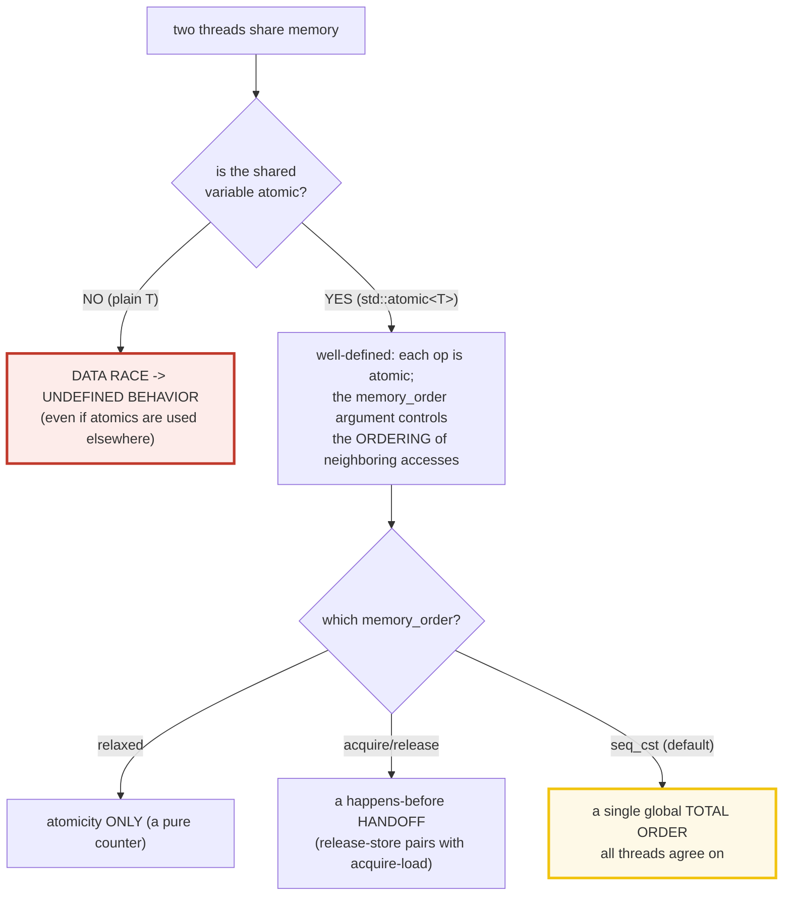
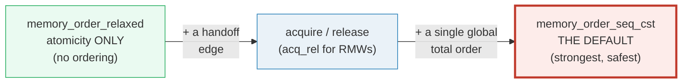
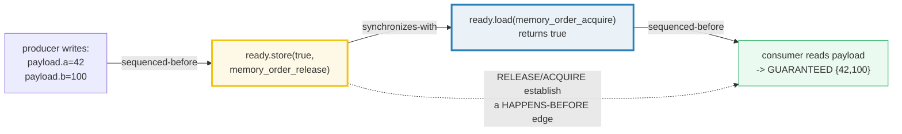
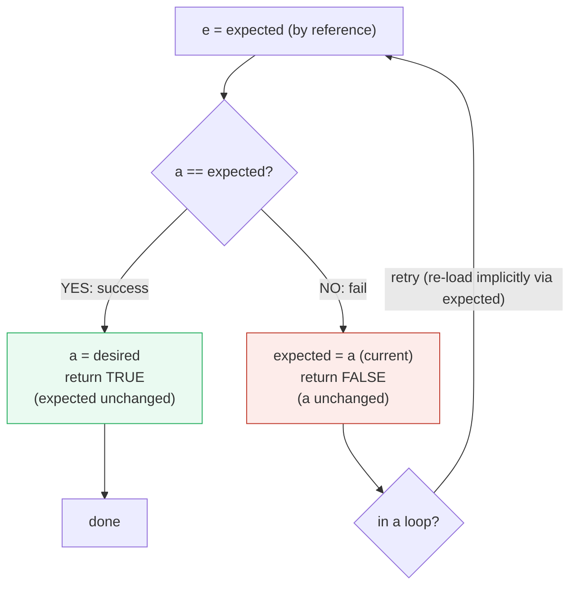

# ATOMICS_MEMORY_ORDER — `std::atomic<T>` & the Memory Model

> **Goal (one line):** by printing every value, show how `std::atomic<T>` gives
> **data-race-free** operations (a counter over N threads reaches **EXACTLY
> N*iters** with no mutex), and how the `memory_order` argument controls the
> **synchronization** guarantees — `relaxed` (atomicity only) → `acquire`/
> `release` (a happens-before handoff) → `seq_cst` (a single global total order,
> **the default**) — plus `compare_exchange` (CAS) as the lock-free building
> block, the read-modify-write family, `is_lock_free`, and the `atomic_flag`
> spinlock. The **data-race-on-a-non-atomic-is-UB** trap is documented
> (`DEMO_UB`-gated, never run in the verified path).
>
> **Run:** `just run atomics_memory_order`
>
> **Ground truth:** [`atomics_memory_order.cpp`](./atomics_memory_order.cpp) →
> captured stdout in
> [`atomics_memory_order_output.txt`](./atomics_memory_order_output.txt). Every
> number/table below is pasted **verbatim** from that file under a
> `> From atomics_memory_order.cpp Section X:` callout. Nothing is hand-computed.
>
> **Prerequisites:** 🔗 `STD_THREAD` (P4 — `std::thread`, join, the thread-of-
> execution model). This bundle is the concurrency **memory model** layer on top
> of raw threads.

---

## 1. Why this bundle exists (lineage)

Once you have more than one thread (🔗 `STD_THREAD`), you immediately face two
problems: **(a)** two threads touching the *same* memory, and **(b)** the fact
that a CPU is free to **reorder** a thread's reads and writes for performance.
Plain C++ answers both with a single brutal word: **don't**. Two unsynchronized
accesses to one non-atomic variable, at least one a write, is a **data race**,
and a data race is **undefined behavior** (🔗 `UNDEFINED_BEHAVIOR`). And without
synchronization you cannot reason about what one thread *sees* of another's
writes.

`std::atomic<T>` is the standard library's answer to both:



This **is** the C++ memory model — and it is *the same model* as Rust's
`std::atomic` + `Ordering`, Go's `sync/atomic`, and TS's `Atomics`. Learn it once
here, read it everywhere. The headline contrast across the 5-language curriculum:

| Language | The atomic type | The orderings | Default |
|---|---|---|---|
| **C++** (this bundle) | `std::atomic<T>` | `relaxed`/`acquire`/`release`/`acq_rel`/`seq_cst` | **`seq_cst`** (the default) |
| 🔗 [`../rust/core/ATOMICS.md`](../rust/core/ATOMICS.md) | `std::atomic::Atomic{I,U,Bool,...}` | `Ordering::{Relaxed,Acquire,Release,AcqRel,SeqCst}` | **you must state it per-op** (no default) |
| 🔗 [`../go/ATOMIC_STATE.md`](../go/ATOMIC_STATE.md) | `sync/atomic` (`int32`/`int64`/`Pointer`/`Value`) | sequential / `Load`/`Store` are `seq_cst`-ish | `seq_cst`-ish (Go is conservative) |
| 🔗 [`../ts/SHARED_MEMORY_ATOMICS.md`](../ts/SHARED_MEMORY_ATOMICS.md) | `Atomics` on `SharedArrayBuffer` | `relaxed`/`acquire`/`release`/`seq` | `seq` |

> From cppreference — *`std::atomic`*: "Each instantiation and full specialization
> of the `std::atomic` template defines an atomic type. … The standard library
> provides specializations for all **scalar types**: `bool`, … all integral
> types, and pointer types. … Objects of atomic types are **the only C++ objects
> that are free from data races**; that is, if one thread writes to an atomic
> object while another thread reads from it, the behavior is well-defined."

---

## 2. The mental model: the memory-order ladder

A `memory_order` argument is **not** about *whether* the op is atomic (every
atomic op is atomic regardless) — it is about the **ordering of the *other*
(non-atomic) memory accesses** around this op, *between threads*. The ladder,
weakest to strongest:



- **`relaxed`** — "do this one op atomically, and promise **nothing** about any
  other access." Perfect for a pure counter (`fetch_add`): you need no lost
  updates, and there is no neighboring data to keep consistent.
- **`acquire`** (loads) / **`release`** (stores) — a **handoff**. A
  `release`-store pairs with an `acquire`-load to establish a **happens-before**
  edge: every plain write that happened *before* the release becomes visible to
  every plain read that happens *after* the matching acquire. This is how you
  safely publish non-atomic data between threads.
- **`seq_cst`** (the default) — acquire/release **plus** a single **global total
  order** on all `seq_cst` operations that every thread agrees on. The strongest,
  the safest, and what you get if you write no order argument. Costs a fence on
  x86 stores.

The release→acquire **happens-before** edge is the single most important idea in
this bundle. It is what lets a non-atomic `payload` be safely handed from a
producer to a consumer:



> From cppreference — *`std::memory_order`*: "`memory_order_relaxed`: … no
> synchronization or ordering constraints … only atomicity is required";
> "`memory_order_release`: A store operation … no reads or writes in the current
> thread can be reordered *after* this store"; "`memory_order_acquire`: A load
> operation … no reads or writes in the current thread can be reordered *before*
> this load"; "`memory_order_seq_cst`: A load operation … plus a **single total
> order exists** in which all threads observe all modifications in the same
> order."

---

## 3. Section A — `std::atomic` basics: `store`/`load`/`fetch_add`; the exact counter

> From `atomics_memory_order.cpp` Section A:
> ```
> a.store(42); a.load() = 42
> a.exchange(7) -> returned old = 42; a.load() now = 7
> [check] store then load round-trips the value: OK
> [check] exchange returned the previous value (42): OK
> [check] exchange wrote the new value (a == 7): OK
> 
> 8 threads x 100000 fetch_add(1, relaxed) -> counter = 800000 (expected 800000)
> [check] fetch_add counter reached EXACTLY N*ITERS (no lost updates, no mutex): OK
> [check] no overflow / exact value: N*ITERS == 800000: OK
> ```

**What.** `store(v)` writes, `load()` reads, `exchange(v)` writes `v` and returns
the **previous** value (an unconditional read-modify-write). `fetch_add(n,
order)` is an RMW: it reads, adds `n`, and writes back as **one indivisible
step**, returning the previous value.

**Why the counter is EXACTLY 800000 — with no mutex.** `fetch_add` is atomic, so
no update is ever *lost*. Eight threads × 100000 increments = 800000, **always**,
regardless of how the OS interleaves them. A plain `long counter` with
`counter++` from 8 threads would race: `++` is a *read, add, write* sequence, and
two threads could both read the same value and both write `value+1`, losing an
update — **and** that race is UB. `fetch_add` makes the whole step indivisible,
eliminating both the lost update and the UB. (A mutex would *also* make it
correct, by serializing the threads — but `fetch_add` is lock-free and far
cheaper for a hot counter.)

**Why `relaxed` is fine here.** The counter has no *neighboring* data to keep
consistent — we only need **atomicity** (no lost updates), not **ordering**. So
the cheapest order, `relaxed`, is correct. This is the proof that **atomicity and
ordering are orthogonal**: the relaxed counter is still exact.

> From cppreference — *`std::atomic` fetch_add*: "Atomically replaces the current
> value with the result of computation involving the previous value and `arg`. …
> a *read-modify-write* operation." And *Data race*: "If one thread writes to an
> atomic object while another thread reads from it, the behavior is
> **well-defined**" — contrast *the plain-variable case*, which is UB.

---

## 4. Section B — `memory_order`: `relaxed` / acquire-release / `seq_cst`

> From `atomics_memory_order.cpp` Section B:
> ```
> (1) relaxed: atomicity only, NO ordering. (Section A's counter
>     used relaxed and was still exact: atomicity != ordering.)
>     r.store(5, relaxed); r.load(relaxed) = 5
> [check] relaxed store/load still atomically round-trips the value: OK
> 
> (2) acquire/release handoff (the happens-before edge):
>     producer: payload.a=42; payload.b=100; ready.store(RELEASE)
>     consumer: while(!ready.load(ACQUIRE)); read payload -> {42, 100}
> [check] acquire-load sees the release's prior writes: consumer_a == 42: OK
> [check] acquire-load sees the release's prior writes: consumer_b == 100: OK
> [check] the handoff outcome is deterministic (release/acquire guarantee it): OK
> 
> (3) seq_cst (the DEFAULT): a single global total order.
>     a.store(x) with NO order arg == a.store(x, memory_order_seq_cst).
>     Strongest; small perf cost. The store-buffer litmus (both threads
>     read 0) is IMPOSSIBLE under seq_cst, POSSIBLE under relaxed — but a
>     single run can't deterministically show it, so we DOCUMENT it.
>     s.store(9); s.load() = 9  (both default-seq_cst)
> [check] seq_cst (default) store/load round-trips the value: OK
> ```

### (1) `relaxed` — atomicity only

`r.store(5, relaxed); r.load(relaxed)` round-trips the value just fine — relaxed
ops are still **atomic**. What relaxed *omits* is any ordering of other accesses.
Section A's counter used `relaxed` and was exact; that is the whole point: a pure
counter has no other data to order, so the cheapest order wins.

### (2) acquire/release — the happens-before handoff

`payload` is a **plain (non-atomic)** struct. The producer writes
`payload.a = 42; payload.b = 100;`, **then** does `ready.store(true,
memory_order_release)`. The consumer spins on
`while (!ready.load(memory_order_acquire))` and then reads `payload`. The bundle
asserts the consumer sees `{42, 100}` — and this is **deterministic**, not
probabilistic: the memory model *guarantees* it.

This is **not** a data race, even though `payload` is non-atomic. The release on
`ready` *synchronizes-with* the acquire that observes it, so the producer's
writes to `payload` **happen-before** the consumer's reads (see the diagram in
§2). The acquire/release pair is *exactly* the happens-before edge that makes a
plain variable safe to hand between threads. Use `relaxed` on `ready` here
instead and you would reintroduce a race: the consumer might see `ready==true`
but a *stale* `payload` (a relaxed store does not publish prior writes). That bug
is architecture-dependent and rare — the worst kind.

### (3) `seq_cst` — the default, and a single global total order

`a.store(x)` with **no order argument** is `a.store(x, memory_order_seq_cst)`.
`seq_cst` is acquire/release **plus** a single total order: every thread agrees
on one global sequence of all `seq_cst` operations. The classic store-buffer
litmus test (two threads each `x=1; r=y` vs `y=1; r=x` — *can both read 0?*) is
**impossible** under `seq_cst` and **possible** under `relaxed`. We **document**
that guarantee rather than run the race: a single execution cannot *determin-
istically* reveal the difference on a strong architecture like x86 or
arm64-with-store-release, so an assertion against a specific interleaving would
be meaningless (and a flaky test). This is the §4.2 determinism discipline: we
assert only the *invariant* the model guarantees, never a particular schedule.

**Which to choose?** Start with `seq_cst` (the default) — it is correct for
nearly everything and the cost is small. Drop to `acquire`/`release` for a
hot handoff path. Use `relaxed` only for a pure counter/statistic with no
neighboring data. `acq_rel` is for an RMW that must do *both* sides of a handoff
(e.g. a `fetch_add` inside a producer/consumer ring).

> From cppreference — *`std::memory_order`*: "`memory_order_seq_cst`: … a single
> total order exists in which all threads observe all modifications in the same
> order." And the store-buffer note: under `seq_cst`, the "(0, 0)" outcome of the
> message-passing/store-buffer pattern "cannot occur," whereas it *can* under
> `relaxed`.

---

## 5. Section C — `compare_exchange` (CAS): success, fail, and the loop

> From `atomics_memory_order.cpp` Section C:
> ```
> (1) a=5; expected=5; desired=10; CAS_strong -> true/success (a=10, expected=5)
> [check] CAS success: returned true: OK
> [check] CAS success: a was set to desired (a == 10): OK
> [check] CAS success: expected UNCHANGED on success (expected == 5): OK
> (2) a=10; expected=5(stale); desired=20; CAS_strong -> false/fail (a=10, expected=10)
> [check] CAS fail: returned false: OK
> [check] CAS fail: a UNCHANGED (a == 10): OK
> [check] CAS fail: expected UPDATED to current value (5 -> 10): OK
> (3) CAS loop: m=1; f(x)=2x+1; one iteration -> m=3 (d was 3)
> [check] CAS loop computed f(1) = 2*1+1 = 3: OK
> [check] CAS loop: expected still equals the loaded value (1): OK
> 
> (4) lock-free MAX via CAS loop, 8 threads -> max = 56 (expected 56)
> [check] lock-free CAS-loop max equals the global max (N_THREADS*7 == 56): OK
> ```

**What.** `compare_exchange(expected, desired)` does, atomically:



Two subtleties that catch everyone:

1. **`expected` is taken by reference and *updated on failure*** to the current
   value — so the loop "knows" what just happened. Case (2) proves it: a *stale*
   `expected = 5` against a current `a = 10` fails, and `expected` is rewritten
   to `10` (the bundle asserts both `expected2 == 10` and `a` *unchanged*).
2. **`weak` vs `strong`.** `weak` **may fail spuriously** even when `a ==
   expected` (the hardware CAS instruction — LL/SC on ARM/Power — can lose its
   reservation to a neighboring eviction). `strong` never fails spuriously. **Use
   `weak` inside a loop** (a spurious fail just retries, and `weak` is cheaper in
   a loop); **use `strong` outside a loop** (a one-shot check where a spurious
   fail would be a real bug).

**The CAS loop — the lock-free update pattern.** CAS is the universal lock-free
primitive: any operation without a single RMW instruction (multiply, "set if
greater," "insert if absent") is built by looping CAS:

```cpp
do { e = a.load(); d = f(e); } while (!a.compare_exchange_weak(e, d));
```

Case (3) applies `f(x) = 2x + 1` to `1` → `3`. Case (4) generalizes to a
**multi-threaded lock-free max**: each thread tries to raise the shared max to
its value; the loop retries on contention. Because `max` is *commutative and
associative*, the final result (the global maximum, **56**) is **deterministic**,
independent of the interleaving — exactly the §4.2 invariant discipline.

> From cppreference — *`atomic::compare_exchange`*: "Atomically compares the
> [object] … with the value pointed to by `expected`: if equal, replaces it with
> `desired` … otherwise **loads the actual value** into `*expected`." And
> (`weak`): "may fail spuriously … `weak` compare-and-exchange operations …
> should be used in **loops** … which generally naturally tolerate spurious
> failures."

---

## 6. Section D — the RMW family + `is_lock_free` + the `atomic_flag` spinlock

> From `atomics_memory_order.cpp` Section D:
> ```
> (1) a=10; fetch_add(5)=10; fetch_sub(7)=15; exchange(100)=8; a=100
> [check] fetch_add returned previous (10): OK
> [check] fetch_sub returned previous (15): OK
> [check] exchange returned previous (8): OK
> [check] a is now 100 after the three RMWs: OK
>     bits=0b1100; fetch_and(0b1010)=12; fetch_or(0b0011)=8; fetch_xor(0b0011)=11; bits=8
> [check] fetch_and(0b1010) returned previous (12): OK
> [check] fetch_or(0b0011) returned previous (8): OK
> [check] fetch_xor(0b0011) returned previous (11): OK
> [check] bits is now 8 (0b1000): OK
> 
> (2) std::atomic<int>.is_lock_free() = true
>     ATOMIC_INT_LOCK_FREE macro = 2  (0=never, 1=sometimes, 2=always)
> [check] ATOMIC_INT_LOCK_FREE == 2 (always lock-free on this platform): OK
> 
> (3) atomic_flag: test_and_set()=false (was clear); test()=true; clear(); test()=false
> [check] atomic_flag.test_and_set() first returns false (it was clear): OK
> [check] after test_and_set, test() is true: OK
> [check] after clear(), test() is false: OK
> 
> (4) atomic_flag spinlock: 8 threads x 50000 ++ -> plain_counter = 400000 (expected 400000)
> [check] atomic_flag spinlock: non-atomic counter reached EXACTLY N*ITERS (race-free): OK
> ```

**The RMW family.** Every integer atomic supports the read-modify-write ops;
**each returns the PREVIOUS value** (a common beginner surprise — `fetch_add`
returns what *was* there, not the new value):

| Op | Effect | Returns |
|---|---|---|
| `fetch_add(n)` | `a += n` | previous |
| `fetch_sub(n)` | `a -= n` | previous |
| `exchange(v)` | `a = v` | previous |
| `fetch_and(m)` | `a &= m` | previous |
| `fetch_or(m)` | `a |= m` | previous |
| `fetch_xor(m)` | `a ^= m` | previous |
| `compare_exchange(e,d)` | `if a==e then a=d` | bool (success) |

(C++26 adds `fetch_max` / `fetch_min`.) The bundle threads them through one
value: `10 --+5--> 15 ---7--> 8 --exch--> 100`, and through a bitmask
`0b1100 --&1010--> 0b1000 --|0011--> 0b1011 --^0011--> 0b1000`.

**`is_lock_free()` / `ATOMIC_*_LOCK_FREE`.** Not every atomic is *lock-free* in
the hardware sense — a `std::atomic<HugeStruct>` may be implemented with a hidden
mutex. `is_lock_free()` (the method) and `ATOMIC_INT_LOCK_FREE` (the macro, `0` =
never / `1` = sometimes / `2` = always) tell you. On every mainstream platform a
word-sized atomic (`int`/`long`/pointer) is `2` = always lock-free — which the
bundle asserts for `int`.

**`atomic_flag` — the one guaranteed-lock-free type.** `std::atomic_flag` is the
*only* type the standard **guarantees** is always lock-free (it has no
`is_lock_free()` method because it needn't — it's guaranteed). It has exactly two
states (clear/set) and three ops: `test_and_set()` (returns previous), `clear()`,
and `test()` (C++20, read-only). Its raison d'être is the **spinlock**:

```cpp
std::atomic_flag lock = {};                        // C++20: default-init to clear
auto acquire_lock = [&]{ while (lock.test_and_set(std::memory_order_acquire)) {} };
auto release_lock = [&]{ lock.clear(std::memory_order_release); };
```

Case (4) uses exactly this to protect a **non-atomic** `long plain_counter`. The
spinlock provides mutual exclusion, so only one thread touches `plain_counter` at
a time → **no data race** → race-free, UB-free, and the count is **exactly
400000** (8 × 50000). This is the lesson: a lock/handoff makes a *plain* variable
safe; an atomic makes the atomic itself safe. (For a single counter, prefer
`fetch_add`; the spinlock here exists to justify the lock by protecting something
`fetch_add` can't.)

> From cppreference — *`std::atomic_flag`*: "is an **atomic boolean type** …
> guaranteed to be **lock-free**." And *`is_lock_free`*: "Checks whether all
> operations on this object are lock-free."

---

## 7. Section E — data-race-on-a-non-atomic **IS UB** (documented; `DEMO_UB`-gated)

> From `atomics_memory_order.cpp` Section E:
> ```
> THE RULE: a NON-atomic variable read+written by 2+ threads with NO
> synchronization is UNDEFINED BEHAVIOR — even if atomics are used
> elsewhere. (Atomics make the ATOMIC accesses well-defined; they do
> nothing for a neighboring plain variable without a happens-before edge.)
> 
> CORRECT (this bundle, verified): make the shared state ATOMIC
>   (fetch_add counter, Section A) or protect a plain variable with a
>   lock/handoff (atomic_flag spinlock, Section D; acquire/release
>   handoff, Section B). Each establishes the happens-before edge that
>   makes the access race-free.
> 
> WRONG (NEVER in the verified path — gated behind -DDEMO_UB):
>   long bad = 0;
>   // thread A: bad++;   thread B: print(bad);   // <-- DATA RACE -> UB
> Reading/writing `bad` from two threads with no synchronization is a
> data race -> UB. ThreadSanitizer (TSan, -fsanitize=thread) reports it;
> ASan/UBSan catch different classes and may miss a plain race. Worse,
> the compiler is entitled to ASSUME no race and may delete or
> miscompile surrounding code.
> 
> (DEMO_UB not defined: the UB race is correctly omitted from this build.)
> [check] the verified path contains NO data race (all shared state atomic or locked): OK
> 
> CROSS-LANGUAGE: this is THE memory model. Rust `std::atomic` +
> `Ordering::{Relaxed,Acquire,Release,AcqRel,SeqCst}` is IDENTICAL
> (Rust makes you state the Ordering per-op; C++ defaults to seq_cst).
> Go `sync/atomic` (Load/Store/Add/CompareAndSwap/atomic.Pointer) and
> TS `Atomics` (on a SharedArrayBuffer) are the same model.
> ```

**THE central rule** — and the bridge to 🔗 `UNDEFINED_BEHAVIOR` (P7): a **data
race** on a non-atomic variable is **undefined behavior**, even if you use
atomics *somewhere else*. Atomics make the **atomic** accesses well-defined;
they do **nothing** for a *neighboring plain* variable unless a happens-before
edge (acquire/release, a mutex, or a fence) connects the accesses.

The bundle therefore shows the **correct** fixes (every other section is a
verified example) and **documents** the wrong version, gating the actual race
behind `#ifdef DEMO_UB` — exactly the pattern from 🔗 `VALUES_TYPES` Section C's
uninitialized-read gate. `just run` / `just out` / `just check` / `just sanitize`
**never** pass `-DDEMO_UB`, so the default and sanitizer builds stay UB-free.

**Why ASan/UBSan aren't enough here.** `just sanitize` runs **ASan + UBSan**.
ASan catches *memory* errors (use-after-free, OOB, leaks); UBSan catches
*integer/UB* (signed overflow, null deref, alignment). **Neither detects data
races** — that is **ThreadSanitizer** (`-fsanitize=thread`). A plain-variable
race can therefore sail through `just sanitize` clean *and still be UB*. The
discipline is: never write the race; verify with TSan separately. (The bundle's
verified path is genuinely race-free, so TSan would also be clean.)

**The compiler-assumes-no-UB trap.** Because a data race is UB, the compiler is
*entitled to assume it does not happen*. It may therefore delete a check that
would only matter in a racy execution, or hoist a load out of a loop, producing
"impossible" miscompilations. This is the same as-if-rule trap as the
uninitialized read — the safe code is the *only* code.

> From cppreference — *Data race*: "If a data race occurs, the behavior is
> **undefined**." (C++23; a data race is defined as "two actions … on the same
> memory location, at least one … not an atomic operation, and … not both
> reads.")

---

## 8. Worked smallest-scale example

Everything above, compressed to the four forms a beginner must memorize:

```cpp
std::atomic<int> a{0};

// (1) plain atomic ops — the default order is seq_cst
a.store(42);                 // write
int v = a.load();            // read  -> 42

// (2) the exact counter — relaxed is enough (no neighboring data)
std::atomic<long> n{0};
// from N threads:  n.fetch_add(1, std::memory_order_relaxed);
// final n is EXACTLY N*iters — no mutex, no lost updates

// (3) the acquire/release handoff — publish non-atomic data safely
payload.a = 42;
ready.store(true, std::memory_order_release);        // producer
while (!ready.load(std::memory_order_acquire)) {}    // consumer spins
// payload.a is GUARANTEED visible (happens-before edge)

// (4) the CAS loop — any RMW you don't have an instruction for
int e = a.load();
do { /* d = f(e) */ } while (!a.compare_exchange_weak(e, /* d */));
```

> From `atomics_memory_order.cpp`, Section A's counter prints
> `8 threads x 100000 fetch_add(1, relaxed) -> counter = 800000 (expected
> 800000)`; Section B's handoff prints `read payload -> {42, 100}`; Section C's
> CAS loop prints `f(x)=2x+1; one iteration -> m=3`. Each line is recomputed by
> the `.cpp` every run.

---

## 9. The data-race / synchronization axis (threaded through this bundle)

Where does each piece of shared state in this bundle sit on the race axis?

| Shared state in this bundle | Atomic? | Synchronization used | Race-free? |
|---|---|---|---|
| Section A `counter` (`atomic<long>`) | **yes** | none needed (atomic RMW) | yes |
| Section B `payload` (plain `struct`) | **no** | **acquire/release** on `ready` | yes (handoff) |
| Section B `ready` (`atomic<bool>`) | **yes** | it *is* the synchronization | yes |
| Section C `mx` (`atomic<int>`) | **yes** | CAS loop (relaxed) | yes |
| Section D `plain_counter` (plain `long`) | **no** | **atomic_flag spinlock** | yes (mutual exclusion) |
| Section E `bad` (plain `long`, `DEMO_UB`) | **no** | **none** | **NO → UB** (gated) |

The two plain-but-safe rows (B's `payload`, D's `plain_counter`) are the whole
lesson: a non-atomic variable is fine **iff** a happens-before edge protects
every pair of conflicting accesses.

---

## 10. Pitfalls (the expert payoff)

| Trap | Symptom | Fix |
|---|---|---|
| `long n;` incremented by 2 threads, no sync | **data race → UB**: lost updates, torn reads, miscompilation | Make it `std::atomic<long>` (`fetch_add`), or guard it with a mutex/spinlock. Verify with TSan. |
| Using `memory_order_relaxed` for a flag/publish handoff | Consumer may see `ready==true` but **stale** payload (no ordering of other accesses) | Use `release` on the store, `acquire` on the load — the happens-before edge is the whole point. |
| `compare_exchange` and **ignoring the return / the updated `expected`** | Logic bug: you treated a fail as a success, or reused a stale `expected` | Check the bool; remember `expected` is **rewritten on failure** to the current value. |
| `compare_exchange_strong` **inside a loop** | Slower than `weak` on LL/SC (ARM/Power) where the hardware CAS spuriously fails | Use `weak` in loops (tolerates spurious fail); `strong` for a one-shot check. |
| Assuming the **default is cheap** | `seq_cst` stores cost a fence on x86; hot loops pay it | Profile; drop to `acquire`/`release` for hot handoffs, `relaxed` for pure counters. |
| `memory_order_consume` | Compilers treat it as `acquire` (no real data-dependency tracking); portable code can't rely on it | Avoid; use `acquire`. |
| `std::atomic<HugeStruct>` and assuming it's lock-free | May silently use a **hidden mutex** (then `is_lock_free()==false`) | Check `is_lock_free()` / `ATOMIC_*_LOCK_FREE`; keep atomics word-sized, or `std::atomic_ref`. |
| Treating **ASan/UBSan clean** as "no data race" | They don't detect races — **TSan** does (`-fsanitize=thread`) | Run TSan on concurrent code; ASan/UBSan catch different classes. |
| Busy-wait spinlock without backoff/fairness | Latency under high contention, possible starvation | Use `std::mutex` for general use; `_mm_pause()`/`yield` for short critical sections; the standard library is conservative. |
| Atomic ops on a `volatile` (or "volatile makes it atomic") | **`volatile` is NOT atomic** — it only disables *compiler* caching, not reordering or tearing, and provides no inter-thread guarantee | Use `std::atomic`; `volatile` is for MMIO, not concurrency. |
| Reusing an `atomic` after moving it | `std::atomic` is **neither copyable nor movable**; the move is deleted | Pass atomics by reference; wrap in a struct and move the struct if you must. |
| `is_lock_free()` queried **per-instance** on a type that's "sometimes" lock-free | The instance answer can vary by alignment/size in edge cases | Prefer the compile-time `ATOMIC_*_LOCK_FREE` macro for a portable guarantee. |

---

## 11. Cheat sheet

```cpp
#include <atomic>
// ── the atomic ops ────────────────────────────────────────────────────────
std::atomic<int> a{0};
a.store(v);                       // write            (default order: seq_cst)
int v = a.load();                 // read             (default order: seq_cst)
int old = a.exchange(v);          // a=v; return PREVIOUS
int old = a.fetch_add(n);         // a+=n; return PREVIOUS   (+sub/and/or/xor)
bool ok = a.compare_exchange_strong(e, d);  // if a==e: a=d, true; else e=a, false
bool ok = a.compare_exchange_weak(e, d);    // same, but MAY fail spuriously (use in loops)

// ── the memory_order ladder (weakest -> strongest) ────────────────────────
//   memory_order_relaxed     atomicity ONLY (pure counter / statistic)
//   memory_order_consume     compilers treat as acquire; AVOID
//   memory_order_acquire     load: nothing AFTER reorders BEFORE it
//   memory_order_release     store: nothing BEFORE reorders AFTER it
//   memory_order_acq_rel     RMW: acquire + release together
//   memory_order_seq_cst     THE DEFAULT: acq/rel + a single global total order
a.store(v, std::memory_order_release);     // publish
while (!a.load(std::memory_order_acquire)) {}   // observe the publish
a.fetch_add(1, std::memory_order_relaxed);      // hot counter, no neighbors

// ── the CAS loop (any RMW without a dedicated instruction) ────────────────
int e = a.load();
do { /* int d = f(e); */ } while (!a.compare_exchange_weak(e, /* d */));

// ── is it really lock-free? ───────────────────────────────────────────────
a.is_lock_free();                 // instance query
ATOMIC_INT_LOCK_FREE              // macro: 0=never  1=sometimes  2=always

// ── atomic_flag: the ONE guaranteed-lock-free type; the spinlock primitive ─
std::atomic_flag lock = {};                  // C++20: default-init to clear
while (lock.test_and_set(std::memory_order_acquire)) {}   // acquire (spin)
lock.clear(std::memory_order_release);                     // release

// ── THE RULE (bridge to UNDEFINED_BEHAVIOR) ───────────────────────────────
//   a NON-atomic var read+written by 2 threads with no sync  ==  DATA RACE
//   a data race is UB, even if atomics are used ELSEWHERE.
//   detect races with TSan (-fsanitize=thread), NOT ASan/UBSan.
```

---

## 12. 🔗 Cross-references

**Within C++ (the expertise spine):**

- 🔗 `STD_THREAD` (P4) — `std::thread`, `join`, the thread-of-execution model.
  This bundle is the **memory model** layer *on top of* raw threads: threads give
  you the concurrency, atomics give you the rules for what they can safely share.
- 🔗 `MUTEX_LOCK_GUARD` (P4) — `std::mutex` + `std::lock_guard` for **critical
  sections**. Use `std::atomic` for a single hot counter or flag; use a mutex for
  a multi-statement critical section (and to protect non-atomic data you can't or
  won't make atomic). The `atomic_flag` spinlock here is the lock-free cousin.
- 🔗 `UNDEFINED_BEHAVIOR` (P7) — **a data race IS UB**. Section E is the on-ramp:
  the wrong code is gated behind `DEMO_UB` (mirroring `VALUES_TYPES` Section C's
  uninitialized-read gate). Verified under ASan+UBSan, and *additionally* by TSan.

**Cross-language parallels (THE headline — this is the same memory model in 4
languages):**

- 🔗 [`../rust/core/ATOMICS.md`](../rust/core/ATOMICS.md) — Rust's
  `std::atomic::{AtomicI32, AtomicUsize, AtomicBool, …}` +
  `Ordering::{Relaxed, Acquire, Release, AcqRel, SeqCst}` is the **IDENTICAL**
  model. The one ergonomic difference: Rust makes you **state the `Ordering`
  per-op** (no default), so you cannot accidentally fall back to `seq_cst`; C++
  defaults to `seq_cst` (safe, slightly costlier). `compare_exchange` and the CAS
  loop are 1:1.
- 🔗 [`../go/ATOMIC_STATE.md`](../go/ATOMIC_STATE.md) — Go's `sync/atomic`
  (`atomic.Int32/Int64`, `atomic.Pointer[T]`, `Load`/`Store`/`Add`/
  `CompareAndSwap`) is the same model. Go is deliberately conservative: its ops
  are `seq_cst`-ish, with fewer fine-grained ordering knobs. `CompareAndSwap` is
  Go's CAS (it returns the swapped-bool and the old value).
- 🔗 [`../ts/SHARED_MEMORY_ATOMICS.md`](../ts/SHARED_MEMORY_ATOMICS.md) — JS's
  `Atomics` object over a `SharedArrayBuffer` (the only way to share mutable
  memory between Web Workers) is the same model again: `Atomics.load`/`store`/
  `add`/`compareExchange`, with the `relaxed`/`acquire`/`release`/`seq` orders.
  The browser requires `SharedArrayBuffer` to be opt-in via COOP/COEP headers —
  the JS analog of "atomics need real shared memory."

---

## Sources

Every signature, value, and behavioral claim above was verified against
cppreference and the ISO C++ standard, then corroborated by ≥1 independent
secondary source:

- cppreference — *`std::atomic`* (the atomic type; free-from-data-races guarantee;
  `store`/`load`/`exchange`/`fetch_add`; integer/bool/pointer specializations):
  https://en.cppreference.com/w/cpp/atomic/atomic
- cppreference — *`std::memory_order`* (the `relaxed`/`consume`/`acquire`/
  `release`/`acq_rel`/`seq_cst` ladder; release/acquire synchronizes-with; seq_cst
  single total order; the store-buffer litmus "cannot occur" under seq_cst):
  https://en.cppreference.com/w/cpp/atomic/memory_order
- cppreference — *`atomic::compare_exchange`* (`weak` vs `strong`; spurious
  failure of `weak`; `expected` updated by reference on failure; the loop note):
  https://en.cppreference.com/w/cpp/atomic/atomic/compare_exchange
- cppreference — *`std::atomic_flag`* (the only guaranteed-lock-free type;
  `test_and_set`/`clear`/`test`; the spinlock example):
  https://en.cppreference.com/w/cpp/atomic/atomic_flag
- cppreference — *`atomic::is_lock_free`* + *`ATOMIC_*_LOCK_FREE`* macros:
  https://en.cppreference.com/w/cpp/atomic/atomic/is_lock_free
  and https://en.cppreference.com/w/cpp/atomic/atomic
- cppreference — *Data race* (definition: same memory location, ≥1 not atomic,
  not both reads → UB):
  https://en.cppreference.com/w/cpp/language/memory_model#Threads_and_data_races
  (also https://en.cppreference.com/w/c/language/atomic under "data race")
- ISO C++23 draft (open-std.org) — normative wording:
  - 6.9.2 Data races `[intro.races]`
  - 33.5 Atomics library `[atomics]`
  - 33.5.4 `atomic` `[atomics.types.generic]`; 33.5.6 `atomic_flag`
    `[atomics.flag]`
  - Working draft: https://open-std.org/JTC1/SC22/WG21/docs/papers/2023/n4950.pdf
- Secondary corroboration (≥2 independent sources, web-verified):
  - Microsoft C++ DevBlogs — Raymond Chen, *"How do I choose between the strong
    and weak versions of compare-exchange?"* (spurious failure of `weak`; use
    `strong` outside a loop, `weak` inside): https://devblogs.microsoft.com/oldnewthing/20180330-00/?p=98395
  - Sutter's Mill — Herb Sutter (August 2012): "Use `compare_exchange_weak` by
    default when looping … Use `compare_exchange_strong` outside a loop": https://herbsutter.com/2012/08/
  - Stack Overflow — *"Does C++11 sequential consistency memory order forbid
    store buffer litmus test?"* (under `seq_cst` the (0,0) outcome cannot occur;
    under `relaxed` it can): https://stackoverflow.com/questions/70204442/does-c11-sequential-consistency-memory-order-forbid-store-buffer-litmus-test
  - Stack Overflow — *"Understanding std::atomic::compare_exchange_weak()"*
    (spurious failure; LL/SC hardware rationale):
    https://stackoverflow.com/questions/25199838/understanding-stdatomiccompare-exchange-weak-in-c11
  - open-std N2748 — *Strong Compare and Exchange* (normative note that `weak`
    "may fail spuriously"): https://www.open-std.org/jtc1/sc22/wg21/docs/papers/2008/n2748.html
  - Jeff Preshing — *"Memory Ordering at Compile Time"* / *"Acquire and Release
    Semantics"* (the happens-before / synchronizes-with mental model):
    https://preshing.com/20120613/acquire-and-release-semantics/

**Facts that could not be verified by running** (documented, not executed,
because they are probabilistic, sanitizer-only-by-design, or compile-gated): the
actual `seq_cst`-vs-`relaxed` store-buffer difference (architecture-dependent and
non-deterministic per run — so documented, not asserted, per §4.2); the torn/lost
result of the `DEMO_UB` data race (UB — meaninglessly varies, detected by TSan
not ASan/UBSan); `memory_order_consume` being treated as `acquire` by mainstream
compilers (a compiler-behavior fact, not a runtime value). These are confirmed by
the cppreference sections and secondary sources above, not reproduced as runnable
output in the verified path (a file triggering them would fail `just check` /
`just sanitize` / TSan).
