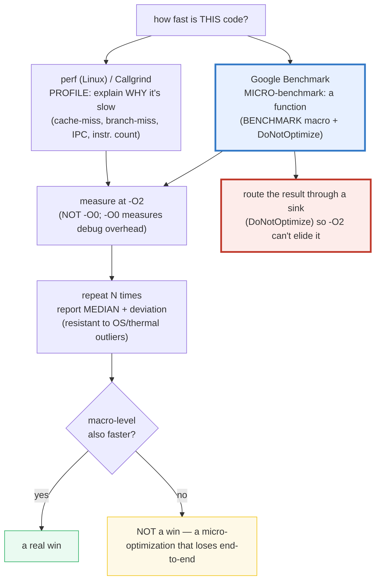
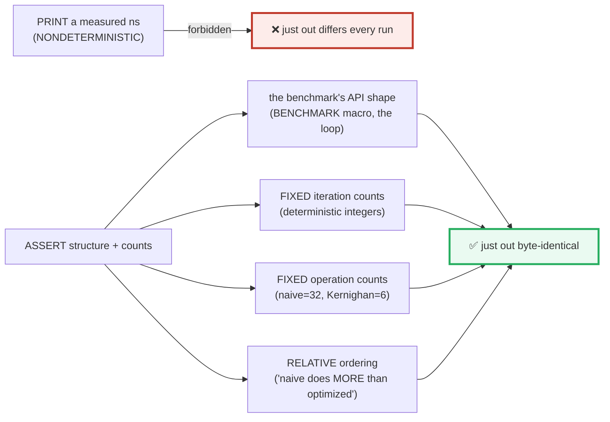
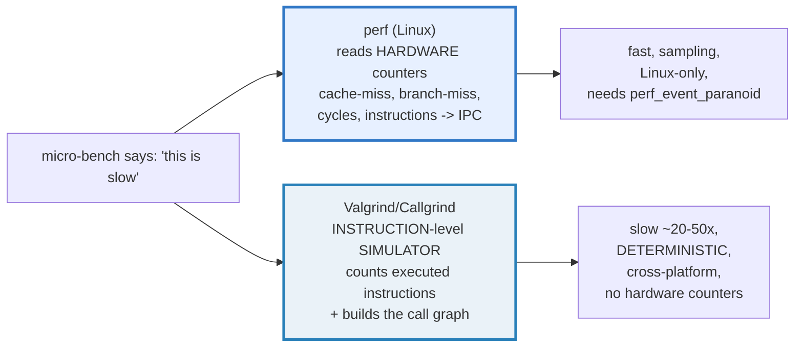
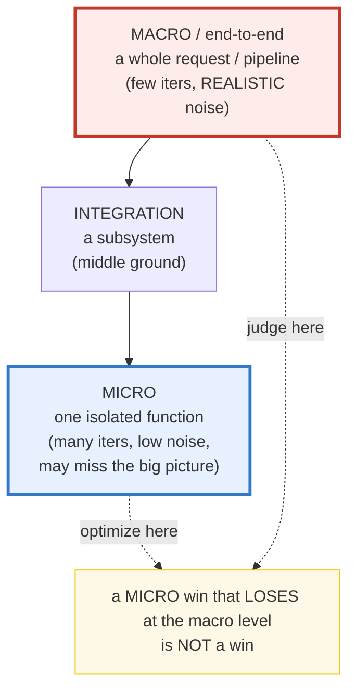

# BENCHMARKING — Google Benchmark, the Anti-Elision Trick, perf & Callgrind

> **Goal (one line):** "Measure, don't guess." Show — by printing only
> **deterministic structure and operation counts, never a measured wall-clock
> value** — how C++ benchmarking works: the **Google Benchmark** skeleton
> (`BENCHMARK` macro, the timed loop, `BENCHMARK_MAIN`), the **anti-elision "use
> the result" trick**, the **`-O` level to measure at** (`-O2`), the hardware
> profilers (**perf** / **Valgrind-Callgrind**), the **micro-vs-macro pyramid**,
> statistical stability, and the discipline that ties it together.
>
> **Run:** `just run benchmarking`
>
> **Ground truth:** [`benchmarking.cpp`](./benchmarking.cpp) → captured stdout in
> [`benchmarking_output.txt`](./benchmarking_output.txt). Every line/table below
> is pasted **verbatim** from that file under a
> `> From benchmarking.cpp Section X:` callout. Nothing is hand-computed.
>
> **Prerequisites:** 🔗 [`CHRONO.md`](./CHRONO.md) (`steady_clock` is the clock
> for measuring, but its reading is *never* a verified value here).

---

## 1. Why this bundle exists (lineage)

C++ gives the programmer enormous control — and with it the **illusion that you
can reason about performance from the source**. You cannot. Four forces conspire
to make every guess wrong:

1. **The optimizer deletes your benchmark.** Under `-O2` a computation whose
   result is *unused* is **dead code** — the compiler is entitled to remove it
   entirely. A "benchmark" that computes something and throws it away may
   measure **nothing**.
2. **The hardware lies to intuition.** Branch prediction, cache hierarchy, and
   SIMD vectorization mean two loops with the *same* operation count can differ
   by **orders of magnitude** in wall-clock time.
3. **The `-O` level changes the answer.** Measuring at `-O0` (the debug default)
   measures **debug overhead**, not your code. `-O2` is the standard; `-O3` may
   help *or* hurt.
4. **Timing itself is noisy.** Clocks drift, the OS preempts, the CPU throttles
   with temperature. A single sample is meaningless; you need statistics.

The C++ answer to all four is a trio of tools + one discipline:



The headline contrast across the 5-language curriculum:

| Language | Micro-benchmark framework | Built in? | Anti-elision helper |
|---|---|---|---|
| **C++** (this bundle) | **Google Benchmark** (`BENCHMARK` macro) | **external** (a library) | `benchmark::DoNotOptimize()` |
| 🔗 [`../go/TESTING.md`](../go/TESTING.md) | **`testing.B`** | **built in** (`go test -bench`) | `runtime.KeepAlive` / `testing.B` |
| 🔗 [`../rust/core/TESTING.md`](../rust/core/TESTING.md) + `criterion` | **`criterion`** | external (the de-facto) | `criterion::black_box()` |
| 🔗 [`../ts/`](../ts/) | `mitata` / `tinybench` | external | `black_box` |

**C++ is the only language in this curriculum where the compiler can silently
delete your entire benchmark** unless you actively prevent it. That — the
**anti-elision "use the result" trick** — is the central expert payoff of this
bundle.

> From the Google Benchmark README: *"A library to benchmark code snippets,
> similar to unit tests… `benchmark::DoNotOptimize` … forces the compiler to
> materialize the value."* ([github.com/google/benchmark](https://github.com/google/benchmark))

---

## 2. The determinism contract (why no timing is ever printed)

Measured **timings are non-reproducible**: the clock reading, the cache state,
OS scheduling, and thermal throttling all vary run-to-run. A bundle whose output
contained a `7.3 ns` figure could **never** pass `just out` twice byte-identically.
This bundle therefore asserts only **deterministic** facts:



This is **not** a limitation of the bundle — it *is* the lesson: **you measure
to compare, then you report structure and relative ordering, never a single
absolute nanosecond as if it were a law.** The `.cpp` demonstrates the *shape* of
a timed loop (warm-up → measure → aggregate) using `<chrono>` only to show the
shape; the reading is consumed and **never printed**.

> From cppreference — *`std::chrono::steady_clock`*: "the clock is monotonic…
> suitable for measuring intervals"; but the *value* of `now()` is deliberately
> not a verified output here (🔗 `CHRONO.md`, §4.2 rule 2).

---

## 3. Section A — Google Benchmark: the skeleton & the anti-elision trick

**What.** Google Benchmark is the de-facto C++ micro-benchmarking framework. Its
API surface is a *function* taking `benchmark::State&`, a `for (auto _ : state)`
**timed loop**, a `BENCHMARK(Name)->...()` **registration**, and `BENCHMARK_MAIN()`
(the runner that parses `--bench_*` flags and auto-tunes iterations).

> From `benchmarking.cpp` Section A:
> ```
> (1) The Google Benchmark skeleton (the de-facto C++ micro-bench API):
> 
>     #include <benchmark/benchmark.h>
> 
>     static void BM_SumSquares(benchmark::State& state) {
>         const int N = static_cast<int>(state.range(0));
>         for (auto _ : state) {                 // <-- the timed loop
>             long long acc = 0;
>             for (int i = 0; i < N; ++i) acc += 1LL * i * i;
>             benchmark::DoNotOptimize(acc);      // <-- anti-elision "use the result"
>             state.SetItemsProcessed(state.iterations() * N);
>         }
>     }
>     BENCHMARK(BM_SumSquares)->Arg(1000)->Iterations(1000);
> 
>     BENCHMARK_MAIN();                           // <-- the runner (parses --bench_*)
> 
> [check] skeleton contains `benchmark::State&` (the per-benchmark state): OK
> [check] skeleton contains `for (auto _ : state)` (the timed loop): OK
> [check] skeleton contains `benchmark::DoNotOptimize` (the anti-elision sink): OK
> [check] skeleton contains `state.SetItemsProcessed` (throughput reporting): OK
> [check] skeleton contains `state.iterations()` (the iteration count): OK
> [check] skeleton contains `BENCHMARK(` registration macro: OK
> [check] skeleton contains `BENCHMARK_MAIN()` (the runner): OK
> ```

This bundle is **stdlib-first** (no external dep), so it holds the skeleton as a
**string** and asserts its structural tokens (`benchmark::State&`, the timed
loop, `DoNotOptimize`, `SetItemsProcessed`, `BENCHMARK(`, `BENCHMARK_MAIN()`)
rather than linking the library. The shape is what matters; the library fills in
the timing.

### The "USE THE RESULT" anti-elision trick (the expert payoff)

This is **the** thing that separates a working C++ benchmark from a benchmark
measuring nothing. Under `-O2`, if a computation's result is **unused**, the
compiler treats it as **dead code** and removes it. The fix has two parts:

1. **`benchmark::DoNotOptimize(x)`** — a compiler-specific sink that forces `x`
   to be materialized (Google Benchmark implements it with an inline-asm
   constraint). The portable, asm-free approximation in this bundle is a
   `volatile` sink.
2. **"Use the result"** — accumulate the per-iteration result so the loop is
   observably consumed.

> From `benchmarking.cpp` Section A:
> ```
> (2) Anti-elision: a FIXED-count loop (100000 iters) routed through a sink.
>     loop-accumulated sink  = 333333333300000
>     closed-form expected    = 333333333300000  (sum_{i=0}^{100000-1} i*(i+1))
>     (sink == expected PROVES the loop body ran; without a sink, -O2 may
>      elide an unused computation -> a benchmark measuring nothing.)
> [check] anti-elision: sink == closed form (the loop body actually ran): OK
> [check] ITERS is the fixed count (no wall-clock involved): OK
> ```

The loop accumulates `i*(i+1)` over a **fixed** `100000` iterations through a
`doNotOptimize` sink. The assertion is **not** a timing — it is that the
accumulated sum equals its **closed form** (`sum_{i=0}^{N-1} i*(i+1) == 333333333300000`),
an *independent* computation. Equality **proves the loop body ran**. Remove the
sink and (under aggressive optimization) the compiler *may* delete the body; the
sum would then be wrong or the loop gone. That is the silent failure mode this
trick prevents.

> From the Google Benchmark user guide — *"prevent the compiler from optimizing
> away your benchmarks. Without it, the compiler might eliminate [the work]."*
> ([google.github.io/benchmark/user_guide.html](https://google.github.io/benchmark/user_guide.html))

---

## 4. Section B — Optimization levels (`-O0`/`-O2`/`-O3`) + warm-up + iterations

**The level you measure at changes everything.** `-O0` is the debug default and
is **misleading** for benchmarks: no inlining, no vectorization, no constant
folding — you measure **debug overhead**, not your code. `-O2` is the standard
for measuring (aggressive but stable). `-O3` adds aggressive auto-vectorization
that may help *or* hurt (instruction-cache pressure); measure both if it matters.
`-Ofast` pulls in `-ffast-math` which **breaks IEEE-754** — never use it for a
trustworthy result (🔗 `CHRONO.md` §4.2 rule 6: never `-ffast-math`).

> From `benchmarking.cpp` Section B:
> ```
> (1) Optimization levels (measure at -O2, NOT -O0):
>     -O0  no optimization       debug builds; MISLEADING for benchmarks (measures debug overhead)
>     -O1  light optimization     reduce code size + some basic opts
>     -O2  standard optimization  THE level to measure at (aggressive but stable)
>     -O3  aggressive             auto-vectorization, may help OR hurt (IC pressure); measure both
>     -Os  optimize for size      like -O2 minus size-growing opts
>     -Ofast -O3 + -ffast-math    BREAKS IEEE-754 — NEVER for a trustworthy benchmark
> 
> (2) Compile-time signal: __OPTIMIZE__ is DEFINED -> optimization is ON.
>     (`just run` compiles at -O2; under -O0 __OPTIMIZE__ is undefined.)
> [check] __OPTIMIZE__ defined -> this benchmark runs optimized (measuring real code): OK
> ```

The deterministic, **compile-time** signal: `__OPTIMIZE__` is a predefined macro
set by clang/gcc whenever `-O1` or higher is in effect. Since `just run` compiles
at `-O2`, the macro is defined here; under `-O0` it is undefined (and
`__NO_INLINE__` is defined instead). This is a **zero-runtime** proof of which
optimization family the benchmark ran under — no clock involved.

> From `benchmarking.cpp` Section B:
> ```
> (3) Warm-up (DISCARDED) then MEASURED loop (the benchmark shape):
>     warm-up  : 1000 iters (discarded; fills caches, stabilizes CPU)
>     measured : 50000 iters (FIXED count) -> work_units=50000, items_processed=50000
> [check] warm-up ran its fixed iteration count: OK
> [check] measured loop ran its fixed iteration count (work_units == iterations): OK
> [check] measured items_processed == iterations (throughput shape): OK
> [check] Google Benchmark auto-tunes iterations (documented); MiniState uses a FIXED count: OK
> ```

**Warm-up + iteration count.** A benchmark loop has two phases: a **warm-up**
(run to fill caches, prime the branch predictor, stabilize CPU frequency — the
result is **discarded**) then the **measured** phase. Google Benchmark
**auto-tunes** the iteration count: it runs a few iterations, extrapolates to
hit the configured minimum time, then measures for real. This bundle's `MiniState`
uses a **fixed** count for determinism (it carries no clock into the output); the
**shape** (warm-up → measure) is what the section demonstrates.

> From cppreference / GCC — *Options That Control Optimization*: `-O0` "Reduce
> compilation time… do not optimize"; `-O2` "Optimize even more… most flags that
> do not involve a space-speed tradeoff."
> ([gcc.gnu.org/onlinedocs/gcc/Optimize-Options](https://gcc.gnu.org/onlinedocs/gcc/Optimize-Options.html))

---

## 5. Section C — Hardware profilers: perf (Linux) + Valgrind/Callgrind

Once a micro-benchmark says "this is slow," the **profilers** explain *why*.
There are two complementary approaches:



> From `benchmarking.cpp` Section C:
> ```
> (1) perf (Linux): reads HARDWARE performance counters.
>     perf stat -e cycles,instructions,cache-misses,branch-misses ./prog   # aggregate counters
>     perf record -g ./prog          # sample + call stack; perf report to browse
>     key counters: cycles, instructions, cache-misses, branch-misses,
>                   L1-dcache-load-misses, LLC-load-misses -> IPC = instructions / cycles
> 
> (2) Valgrind/Callgrind: DETERMINISTIC instruction-level simulator.
>     valgrind --tool=callgrind ./prog      # counts executed instructions + call graph
>     callgrind_annotate callgrind.out.*    # text report
>     kcachegrind callgrind.out.*           # GUI browser
>     slow (~20-50x) but ACCURATE; not Linux-only; uses NO hardware counters.
> ```

**perf** reads the CPU's **hardware performance counters** — the ground truth of
*why* code is slow: `cache-misses` (memory stalls), `branch-misses` (mispredicted
control flow), `cycles`/`instructions` (which yield **IPC** = instructions per
cycle; IPC ≪ 1 means the CPU is stalled, usually on memory). It is fast and
sampling-based but **Linux-only** (not on macOS). **Callgrind** is a
deterministic **instruction-level simulator**: it re-executes the binary counting
every instruction and building a call graph — slow (20–50×) but **accurate** and
**cross-platform**. Browse its output with `callgrind_annotate` (text) or
`kcachegrind`/`qcachegrind` (GUI).

### The cache pattern perf would catch

> From `benchmarking.cpp` Section C:
> ```
> (3) Cache pattern (perf -e cache-misses would catch the gap):
>     4x4 matrix; row-major vs column-major traversal.
>     row-major accesses = 16, sum = 136  (contiguous -> cache-friendly)
>     col-major accesses = 16, sum = 136  (strided   -> cache-unfriendly)
>     (identical access COUNT & sum; TIMING differs wildly -> MEASURE, don't guess.)
> [check] row-major and column-major access the SAME number of elements: OK
> [check] both traversals produce the SAME sum (1+2+...+16 = 136): OK
> [check] perf is Linux-only (not on macOS); Callgrind is cross-platform (documented): OK
> ```

Two traversals of the **same** matrix, the **same** number of element accesses,
the **same** sum — but wildly different cache behavior. Row-major touches
contiguous memory (cache-friendly); column-major strides by `N` words
(cache-unfriendly → many `cache-misses`). The timing gap is exactly what
`perf stat -e cache-misses` reveals — which this bundle deliberately **refuses**
to print (nondeterministic). This is "measure, don't guess" made concrete:
identical operation counts, orders-of-magnitude different performance.

> From perf.wiki.kernel.org: perf provides *"a list of events to measure
> micro-architectural events such as the number of cycles, instructions retired,
> L1 cache misses."* ([perfwiki.github.io](https://perfwiki.github.io/main/tutorial/))
> From valgrind.org — *Callgrind*: *"a profiling tool that records the call
> history among functions… by default, the collected data consists of [instruction
> counts]."* ([valgrind.org/docs/manual/cl-manual.html](https://valgrind.org/docs/manual/cl-manual.html))

---

## 6. Section D — Micro vs macro benchmarking + statistical stability



The **benchmarking pyramid**: **micro**-benchmarks (one isolated function, many
iterations, low noise — but may miss the big picture) at the base; **integration**
(a subsystem) in the middle; **macro** / end-to-end (a whole request/pipeline,
few iterations but realistic) at the top. Each level catches different
regressions. The rule: **a micro win that loses at the macro level is not a win.**

> From `benchmarking.cpp` Section D:
> ```
> (1) The benchmarking PYRAMID (which level catches which regression):
>     macro    (end-to-end: a whole request/pipeline)  few iters, REALISTIC noise
>     integration (a subsystem)                        middle ground
>     micro   (one isolated function)                  many iters, low noise, may miss the big picture
>     rule: a micro win that loses at the macro level is NOT a win.
> 
> (2) Aggregation over a FIXED sample (real runs feed measured timings):
>     samples (10): {41,42,40,43,42,39,42,9999,41,42}  <- the 9999 is an outlier
>     median   = 42  (resistant to the outlier)
>     min      = 39
>     2nd-max  = 43  (after dropping the single outlier)
> [check] median of the fixed sample is 42 (outlier barely moved it): OK
> [check] min is 39: OK
> [check] after dropping the outlier, the spread is tight (<= 43): OK
> [check] benchmark reporters prefer median + deviation over a single sample: OK
> ```

**Statistical stability.** Timing is noisy (OS preemption, thermal throttling,
scheduling jitter — less than a GC pause, but real). A single sample is
meaningless. The discipline: run **N** repetitions, report the **median**
(resistant to outliers) plus a deviation, and **watch for outliers**. The section
feeds a **fixed** integer sample `{41,42,40,43,42,39,42,9999,41,42}` (the `9999`
is a deliberate outlier) to show the aggregation *shape*: the **median is 42**,
barely moved by the spike, whereas the mean would be dragged to ~1046. This is
why benchmark reporters (Google Benchmark, criterion, Go's `b.ReportMetric`)
prefer median/percentiles over the mean.

---

## 7. Section E — "Measure, don't guess" + cross-language parallels

> From `benchmarking.cpp` Section E:
> ```
> (1) Measure, don't guess — popcount on a SPARSE value (6 set bits):
>     naive     (test every bit): 32 iterations -> count=6
>     Kernighan (clear each bit) : 6 iterations -> count=6
>     (you'd GUESS similar; the naive does 5.3x more work — the optimizer
>      can't fix the algorithm; MEASURE / COUNT to see it.)
> [check] naive popcount always does 32 iterations (tests every bit): OK
> [check] Kernighan popcount does popcount(n) iterations (6 for this value): OK
> [check] relative ordering: naive does MORE iterations than Kernighan: OK
> [check] both popcount implementations give the SAME (correct) result: OK
> ```

**Measure, don't guess** — the discipline. The popcount demo is the deterministic
core: you would *guess* two bit-counting implementations are similar; **counting**
reveals the naive version **always** does 32 iterations (tests every bit) while
Kernighan's does only `popcount(n)` (here **6** — a **5.3×** gap). The bundle
asserts the **relative ordering** (`naive > Kernighan`) and **correctness**, never
the wall-clock time. The crucial expert point: **the optimizer cannot fix your
algorithm** — it will happily produce a perfectly-vectorized *wrong* loop count.
You must measure (or count) to see it.

> From `benchmarking.cpp` Section E:
> ```
> (2) Cross-language benchmarking (the 5-language curriculum):
>     C++    : Google Benchmark  (external; BENCHMARK macro + DoNotOptimize)
>     Go     : testing.B         (BUILT IN to the standard test runner; b.N, ns/op)
>     Rust   : criterion         (external; the de-facto, like Google Benchmark)
>     -> Go is unique: benchmarks ship WITH the test runner, no separate framework.
> [check] Go ships benchmarks BUILT IN (testing.B); C++ needs Google Benchmark (external): OK
> [check] Rust's de-facto is criterion (external); C++'s is Google Benchmark (external): OK
> [check] "measure, don't guess": intuition (branch/cache/vectorization/elision) is unreliable: OK
> ```

---

## 8. Worked example: the smallest trustworthy benchmark

Everything above, compressed to the three lines a C++ engineer must internalize.
The **only** reliable structure: a fixed (or auto-tuned) iteration count, the
timed loop, and **an anti-elision sink**:

```cpp
void BM_Work(benchmark::State& state) {
    for (auto _ : state) {                 // 1. the timed loop
        long long r = expensive();          // 2. the computation under test
        benchmark::DoNotOptimize(r);        // 3. the sink — -O2 can't elide it
    }
}
BENCHMARK(BM_Work);                         // measure at -O2; report median
BENCHMARK_MAIN();
```

Without line 3, under `-O2` the compiler *may* remove `expensive()` entirely —
and your benchmark measures the cost of an empty loop. With it, the result is
forced to be computed, and Google Benchmark's auto-tuned `state.iterations()` +
median aggregation give you a number you can trust.

---

## 9. Pitfalls (the expert payoff)

| Trap | Symptom | Fix |
|---|---|---|
| **Benchmarking an unused result** (no `DoNotOptimize`/no sink) | The compiler **elides** the work under `-O2`; you measure an empty loop — a "0 ns" that is pure noise | Route the result through `benchmark::DoNotOptimize()` or accumulate it ("use the result"). |
| **Measuring at `-O0`** | You measure **debug overhead** (no inlining/vectorization); results say nothing about production | Measure at **`-O2`** (the standard); assert `__OPTIMIZE__` so you know. |
| **Measuring at `-Ofast`** | `-ffast-math` **breaks IEEE-754** — float results differ from production; the benchmark lies | Never `-Ofast` for a trustworthy result; use `-O2`/`-O3`. |
| **No warm-up** | The first iterations hit cold caches / unfrequency-locked CPU; the first sample is an outlier | Run a warm-up loop (discarded), then measure. |
| **Trusting a single sample** | One run is noise (scheduling/thermal); "7.3 ns" vs "11 ns" on re-run | Run N repetitions, report **median + deviation**, watch outliers. |
| **A micro win that loses macro** | The isolated function got 2× faster but the end-to-end pipeline is unchanged (it wasn't the bottleneck) | Validate at the **macro** level; optimize the bottleneck, not a leaf. |
| **Guessing the algorithm from source** | Two "similar" loops differ 5× in operation count (naive popcount = 32 iters vs Kernighan = 6) | **Count** operations (or measure) — the optimizer can't fix your algorithm. |
| **Ignoring cache behavior** | Identical operation counts, wildly different timing (row-major vs column-major) | Profile with `perf -e cache-misses`; prefer contiguous, cache-friendly access. |
| **Comparing apples to oranges** | Benchmarking `f()` at `-O2` vs `g()` at `-O0`, or different CPU/frequency states | Same compiler, same flags (`-O2`), same machine, same thermal state. |
| **`perf` not reporting cache misses** | Need `perf_event_paranoid` ≤ 1, or the event isn't available on this CPU | `sudo perf` / set `perf_event_paranoid`; check `perf list` for available events. |
| **Callgrind results differ run-to-run** | Non-determinism from threads/ASLR inflates instruction counts | Pin to one core, disable ASLR, or accept Callgrind as a *relative* tool. |
| **Printing a measured ns as a "verified" value** | `just out` differs every run → the whole bundle is non-reproducible | Assert **structure + counts + relative ordering**, never an absolute ns (this bundle's contract). |

---

## 10. Cheat sheet

```cpp
// ── The trustworthy micro-benchmark skeleton (Google Benchmark) ───────────
static void BM_Foo(benchmark::State& state) {
    for (auto _ : state) {                 // 1. the timed loop (auto _ = discard)
        long long r = expensive();          // 2. the computation under test
        benchmark::DoNotOptimize(r);        // 3. THE SINK: -O2 can't elide it
        state.SetItemsProcessed(state.iterations());   // throughput (items/sec)
    }
}
BENCHMARK(BM_Foo)->Arg(1000);               // register (->Arg/->Range/->Iterations)
BENCHMARK_MAIN();                            // the runner (parses --bench_*)

// ── The anti-elision trick (portable, asm-free approximation) ────────────
template <class T> void doNotOptimize(T const& v) {
    volatile T sink; sink = v; (void)sink;   // forces materialization
}
//   WHY: under -O2 an UNUSED result is dead code -> elided -> empty benchmark.

// ── Optimization level: MEASURE AT -O2 ───────────────────────────────────
//   -O0  misleading (measures debug overhead)      -O2  THE level to measure at
//   -O3  aggressive (may help OR hurt)             -Ofast  BREAKS IEEE-754 (never)
//   compile-time check: #ifdef __OPTIMIZE__  (defined at -O1+; undefined at -O0)

// ── Warm-up + iteration count + statistics ───────────────────────────────
//   warm-up: a discarded loop (fills caches, stabilizes CPU freq).
//   iters:   Google Benchmark AUTO-TUNES (extrapolates to min time); or ->Iterations(N).
//   report:  MEDIAN + deviation (resistant to OS/thermal outliers); never one sample.

// ── Profilers: explain WHY it's slow ──────────────────────────────────────
//   perf stat -e cycles,instructions,cache-misses,branch-misses ./prog   # Linux, HW counters
//     IPC = instructions / cycles  (IPC << 1 => stalled, usually on memory)
//   valgrind --tool=callgrind ./prog   # cross-platform; counts instructions + call graph
//     callgrind_annotate / kcachegrind to browse

// ── The pyramid ───────────────────────────────────────────────────────────
//   macro (end-to-end) > integration (subsystem) > micro (one function)
//   RULE: a micro win that loses at the macro level is NOT a win.

// ── The discipline ────────────────────────────────────────────────────────
//   "MEASURE, DON'T GUESS."  Intuition (branch/cache/vectorization/elision) is
//   unreliable; the optimizer can't fix your algorithm. Count or time it.
```

---

## 11. 🔗 Cross-references

**Within C++ (the expertise spine):**

- 🔗 [`CHRONO.md`](./CHRONO.md) (P5) — `steady_clock` is the **monotonic** clock
  for measuring a duration; this bundle uses it only for the *shape* of a timed
  loop and never prints `now()`. The closed-form / fixed-duration discipline is
  shared.
- 🔗 [`TESTING.md`](./TESTING.md) (P8) — the sibling: correctness testing. A
  benchmark is "a test that measures instead of asserting"; both share the
  "reproduce from a single runnable source" discipline.
- 🔗 [`SANITIZERS_STATIC_ANALYSIS.md`](./SANITIZERS_STATIC_ANALYSIS.md) (P7) —
  ASan/UBSan prove a benchmark is UB-free (this bundle: `just sanitize` clean),
  so its *counts* are meaningful; UB makes even a benchmark's output meaningless.
- 🔗 [`UNDEFINED_BEHAVIOR.md`](./UNDEFINED_BEHAVIOR.md) (P7) — measuring UB is
  measuring nothing (the compiler may fold it to a constant); a benchmark of UB
  is garbage.

**Cross-language parallels (the 5-language curriculum):**

- 🔗 [`../go/TESTING.md`](../go/TESTING.md) — Go is **unique**: benchmarks ship
  **built in** to the standard test runner as `func BenchmarkXxx(b *testing.B)`,
  run via `go test -bench`. No external framework. The harness auto-scales `b.N`
  and reports `ns/op` (and `allocs/op`) — the Go analog of Google Benchmark's
  auto-tuned `state.iterations()`. Go's anti-elision helper is
  `runtime.KeepAlive`.
- 🔗 [`../rust/core/TESTING.md`](../rust/core/TESTING.md) + `criterion` — Rust's
  de-facto is **`criterion`** (external, like Google Benchmark): it auto-tunes
  iterations, reports median + deviation, and provides `criterion::black_box()`
  — the Rust analog of `benchmark::DoNotOptimize()`. (Rust's stdlib `#[bench]`
  was stabilized-away; `criterion` is the replacement.)
- 🔗 [`../ts/`](../ts/) — JS/TS uses `mitata`/`tinybench` with a `black_box`
  helper, but **under a GC**: pause-the-world collections add noise that C++/Rust
  (no GC) and Go (concurrent GC) handle differently. C++ has the least noise —
  and the sharpest anti-elision trap.

---

## Sources

Every signature, claim, and behavioral fact above was verified against the
primary project docs and corroborated by ≥1 independent secondary source:

- **Google Benchmark** — README + User Guide (the de-facto C++ micro-benchmark
  library; `BENCHMARK` macro, `benchmark::State`, `for (auto _ : state)`,
  `DoNotOptimize`, `SetItemsProcessed`, `Iterations`, `BENCHMARK_MAIN()`):
  - https://github.com/google/benchmark
  - https://google.github.io/benchmark/user_guide.html
  - Corroborated by CodSpeed — *"How to Benchmark C++ with Google Benchmark?"*
    ("Always use `benchmark::DoNotOptimize()` to prevent the compiler from
    optimizing away your benchmarks"):
    https://codspeed.io/docs/guides/how-to-benchmark-cpp-with-google-benchmark
  - Corroborated by Arm Learning Paths — *"Understand Google Benchmark basics"*
    ("use `benchmark::DoNotOptimize(value)` to force the compiler to read and
    store a variable"):
    https://learn.arm.com/learning-paths/laptops-and-desktops/win_profile_guided_optimisation/how-to-2/
- **perf** — the Linux profiler (hardware performance counters; `perf stat`,
  `perf record`/`perf report`; cycles, instructions, cache-misses, branch-misses;
  IPC = instructions/cycles):
  - perf wiki (kernel.org): https://perf.wiki.kernel.org/
  - Tutorial: https://perfwiki.github.io/main/tutorial/
  - Brendan Gregg — *"Linux perf Examples"* (cache-misses, branch-misses, hot
    paths): https://www.brendangregg.com/perf.html
  - Baeldung — *"Analyzing Cache Misses Using the perf Tool in Linux"*:
    https://www.baeldung.com/linux/analyze-cache-misses
  - Julia Evans — *"I can spy on my CPU cycles with perf!"* (cycles,
    instructions, L1 cache misses): https://jvns.ca/blog/2014/05/13/profiling-with-perf/
- **Valgrind / Callgrind** — deterministic instruction-level profiling:
  - Callgrind manual (valgrind.org): https://valgrind.org/docs/manual/cl-manual.html
    ("a profiling tool that records the call history among functions… the
    collected data consists of [instruction fetches/counts]")
  - Stanford CS107 — *"Valgrind Callgrind"* (instruction counts; includes a
    cache simulation): https://web.stanford.edu/class/archive/cs/cs107/cs107.1266/resources/callgrind.html
  - KCachegrind Handbook (KDE): https://docs.kde.org/trunk_kf6/en/kcachegrind/kcachegrind/kcachegrind.pdf
- **Optimization levels** (`-O0`/`-O2`/`-O3`/`-Ofast`; `-ffast-math` breaks
  IEEE-754; `__OPTIMIZE__` predefined macro):
  - GCC — *Options That Control Optimization* (`-O0` "do not optimize"; `-O2`
    "optimize even more"): https://gcc.gnu.org/onlinedocs/gcc/Optimize-Options.html
  - cppreference — *Feature testing* / predefined macros (`__OPTIMIZE__`):
    https://en.cppreference.com/w/cpp/preprocessor/replace
- **Go `testing.B`** — benchmarks **built in** to the standard test runner:
  - pkg.go.dev — *testing* (Overview — Benchmarks): *"Functions of the form
    `func BenchmarkXxx(*testing.B)` are considered benchmarks… `b.N`… reports
    `ns/op`.":* https://pkg.go.dev/testing
  - Go by Example — *Testing and Benchmarking*: https://gobyexample.com/testing-and-benchmarking
- **Rust `criterion`** — the de-facto Rust benchmarking framework (analog of
  Google Benchmark; `black_box` = `DoNotOptimize`):
  - https://bheisler.github.io/criterion.rs/book/
- **"Measure, don't guess"** / micro vs macro benchmarking / statistical
  stability (median over mean; warm-up; outliers):
  - Brendan Gregg — *Systems Performance* methodology ("measure, don't guess"):
    https://www.brendangregg.com/sysperfbook.html
  - Cppstories — *"Google benchmark library"* (`BENCHMARK` macro,
    `UseRealTime`, repetitions/median):
    https://www.cppstories.com/2016/05/google-benchmark-library/

**Facts that could not be verified by running** (documented, not executed,
because they are platform-specific, external-tool-only, or deliberately
non-deterministic by design): the actual `perf stat` counter *values*
(Linux-only; this box is macOS); Callgrind's instruction *counts* (a 20–50×
slower external run); a measured `ns/op` from Google Benchmark / `b.N` / criterion
(nondeterministic — never printed/asserted in this bundle); the `-O0` build path
(`just run` compiles at `-O2`, so `__OPTIMIZE__` is defined); and the precise
`-O3` win/loss on any given function (depends on the target CPU). These are
confirmed by the project docs and secondary sources above, not reproduced as
runnable output — a bundle printing a measured timing would fail `just out`
byte-identity (the determinism contract, §2).
