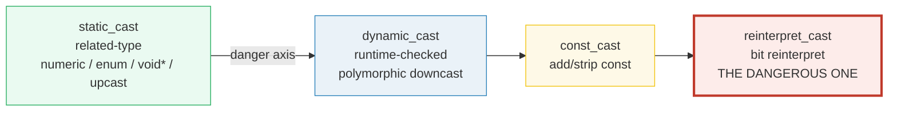
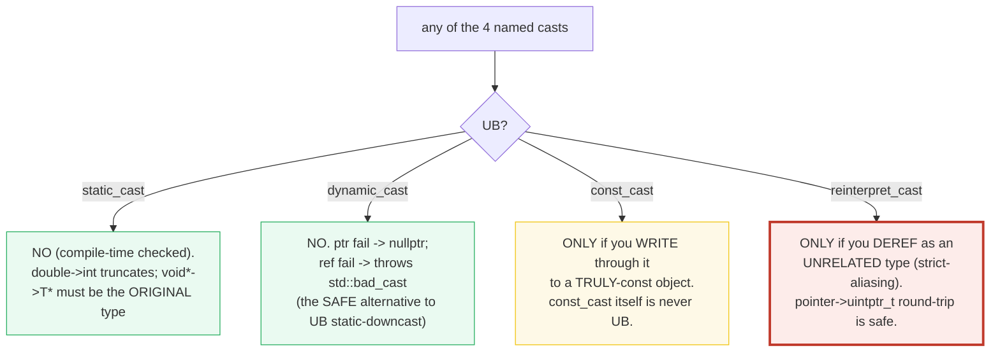

# CASTS — static_cast / dynamic_cast / const_cast / reinterpret_cast (+ avoid the C-cast)

> **Goal (one line):** by printing every value, show how C++'s **four named
> casts** behave — `static_cast` (related-type), `dynamic_cast` (runtime-checked
> polymorphic downcast), `const_cast` (add/strip const), `reinterpret_cast` (bit
> reinterpret) — and why the C-style cast `(T)x` should be **avoided** because it
> silently picks the most dangerous cast that compiles.
>
> **Run:** `just run casts`
>
> **Ground truth:** [`casts.cpp`](./casts.cpp) → captured stdout in
> [`casts_output.txt`](./casts_output.txt). Every value/table below is pasted
> **verbatim** from that file under a `> From casts.cpp Section X:` callout.
> Nothing is hand-computed.
>
> **Prerequisites:** 🔗 [`VALUES_TYPES.md`](./VALUES_TYPES.md) (types,
> `const`/`constexpr`) and 🔗
> [`REFERENCES_POINTERS_INTRO.md`](./REFERENCES_POINTERS_INTRO.md) (the
> value/reference/pointer trichotomy — every cast here moves between these).

---

## 1. Why this bundle exists (lineage)

C++ is **statically typed**, but it lets you *force* the type system to bend in
five sharply different ways — one of which (the C-style cast `(T)x`) is dangerous
precisely because it **hides which bend it took**. The C++ expert move is to use
the **four named casts**, each of which is self-documenting (you can `grep` it)
and carries a precise **UB profile**:





The second diagram is the whole safety story: **the only casts that can produce
UB are `const_cast`-then-write-to-truly-const and `reinterpret_cast`-then-deref-
unrelated-type.** Both are *documented and gated* in `casts.cpp` behind
`#ifdef DEMO_UB`; the verified path demonstrates the **safe form of each** and
uses `dynamic_cast` (defined: null/throw on failure) instead of the
UB-equivalent `static_cast` downcast.

> From cppreference — *Explicit type conversion (cast notation)*: when the
> compiler meets the C-style cast `(T)x` it tries, **in this order**, the first
> that compiles: `const_cast`, `static_cast` (+ derived↔base extensions),
> `static_cast` then `const_cast`, `reinterpret_cast`, `reinterpret_cast` then
> `const_cast`. "The first choice that satisfies the requirements of the
> respective cast operator is selected, even if it is ill-formed." That is why
> the C-cast is un-auditable and why the named casts exist.

### Cross-language headline

| Language | Casts available | Runtime cost | UB from a cast? |
|---|---|---|---|
| **C++** (this bundle) | 4 named + C-style | `dynamic_cast` is runtime-checked; others compile-time | **yes** — `reinterpret_cast` aliasing, `const_cast`-write-to-truly-const |
| 🔗 [`../rust/`](../rust/) | `as` (numeric only), `From`/`Into`, `TryFrom`/`TryInto` | none (all compile-time) | **no** — the UB-prone casts are impossible in safe Rust |
| 🔗 [`../ts/TYPE_ASSERTIONS_UNKNOWN.md`](../ts/TYPE_ASSERTIONS_UNKNOWN.md) | `as`, type assertion | none — fully erased | **no** — `as` is a hint to the checker, emits no code |

---

## 2. Section A — `static_cast` (the safe everyday "related-type" cast)

> From `casts.cpp` Section A:
> ```
> (1) static_cast<double>(5) = 5.000000   (int -> double, widening)
> (2) static_cast<int>(2.900000) = 2   (double -> int TRUNCATES toward zero)
> (3) static_cast<Color>(1) -> static_cast<int> back = 1   (== Color::Green)
> (4) void* round-trip: *static_cast<int*>(void*) = 7   (deref as ORIGINAL type)
> (5) static_cast<Animal*>(&dog) upcast -> non-null (safe; same as implicit)
> [check] static_cast<double>(5) == 5.0: OK
> [check] static_cast<int>(2.9) == 2 (truncates toward zero): OK
> [check] static_cast<Color>(1) round-trips to int 1 (Color::Green): OK
> [check] void* round-trip deref equals original (7): OK
> [check] static_cast upcast Dog* -> Animal* is non-null: OK
> ```

**What.** `static_cast<T>(e)` converts between **related** types at compile
time. The five everyday uses, all shown above:

- **Numeric widening** `int → double` — lossless here (`5 → 5.0`).
- **Numeric narrowing** `double → int` — **truncates toward zero** (`2.9 → 2`),
  *not* rounds. The only UB here is if the truncated value would not fit in
  `int` (e.g. `static_cast<int>(1e20)`); ordinary values are fine.
- **`int ↔ enum`** — `static_cast<Color>(1)` yields `Color::Green`;
  `static_cast<int>(c)` yields the enumerator's underlying value.
- **`void* → T*`** — the inverse of the implicit `T* → void*`. You **must** cast
  back to the **original** type and dereference as that type (the bundle's
  round-trip reads `7`, the value that went in). Casting `void*` to the *wrong*
  type and dereferencing is aliasing UB (see Section D).
- **Upcast `Derived* → Base*`** — identical to the implicit conversion; no
  virtual function is required.

**Why (internals).** `static_cast` is the **first** cast the C-style `(T)x`
tries after `const_cast`. It performs no runtime check — it trusts that the
conversion is valid by type-system rules alone. That is exactly why it is **safe
for upcasts** (the compiler can prove a `Dog` *is* an `Animal`) but **unsafe for
downcasts** (`Animal*` might point at a `Cat`, and `static_cast<Dog*>` would not
notice) — for downcasts you need `dynamic_cast` (Section B).

> From cppreference — *static_cast*: "`static_cast<new-type>(expression)`" — for
> arithmetic, "if the target type is a (possibly cv-qualified) … integer type,
> … the value is **truncated**"; for `void* → T*`, "converts any pointer to
> pointers to un/qualified object … back to the original type … if the original
> is not the same type the behavior is **undefined**."

---

## 3. Section B — `dynamic_cast` (runtime-checked polymorphic downcast)

> From `casts.cpp` Section B:
> ```
> (1) pa points at a Dog; dynamic_cast<Dog*>(pa) -> non-null (correct downcast)
> (2) a Dog is not a Cat; dynamic_cast<Cat*>(pa) -> nullptr (nullptr = SAFE failure)
> (3) dynamic_cast<Cat&>(Animal& to a Dog) threw std::bad_cast -> caught (SAFE; reference form always throws on failure)
> [check] dynamic_cast<Dog*>(Animal* to Dog) succeeded (non-null): OK
> [check] dynamic_cast<Cat*>(Animal* to Dog) returned nullptr (safe failure): OK
> [check] dynamic_cast<Cat&>(Animal& to Dog) threw std::bad_cast (safe failure): OK
> ```

**What.** `dynamic_cast<T>(e)` DOWN-casts (and side-casts) along a
**polymorphic** hierarchy at **runtime**, consulting RTTI. It requires the
source type to have ≥1 `virtual` function. The defining feature is that
**failure is well-defined and safe**:

| Target kind | On success | On failure |
|---|---|---|
| **pointer** `dynamic_cast<D*>(p)` | non-null `D*` | **`nullptr`** — check before use |
| **reference** `dynamic_cast<D&>(r)` | valid `D&` | **throws `std::bad_cast`** — references can't be null |

The bundle proves both failure modes: casting an `Animal*` (really a `Dog`) to
`Cat*` yields `nullptr` (line 2); casting the `Animal&` to `Cat&` *throws*
`std::bad_cast`, which we `catch` (line 3). Throwing + catching is well-defined
behavior — **not** UB.

**Why this is THE safe alternative.** The `static_cast` equivalent of a wrong
downcast is **undefined behavior** — `static_cast<Cat*>(&dog)` compiles and
produces a `Cat*` that **isn't**, and using it is UB. `dynamic_cast` pays a small
runtime cost (a vtable/RTTI walk) to make a wrong downcast **detectable**.
Reach for it whenever you cannot *prove* the dynamic type some other way.

**RTTI requirement.** `dynamic_cast` needs **Run-Time Type Information**, which
requires (a) a polymorphic source type and (b) RTTI enabled (it is on by default
on every mainstream compiler; flags like `-fno-rtti` turn it off). A
`dynamic_cast` on a *non-polymorphic* type is a **compile error** for downcasts
— the compiler refuses because there is no vtable to consult. (🔗
`POLYMORPHISM` / `CLASSES_DESUGAR` cover the virtual-table machinery.)

> From cppreference — *dynamic_cast*: "Safely converts pointers and references
> to classes up, down, and sideways along the inheritance hierarchy." On a failed
> downcast "if target-type is a pointer type, the result is the **null pointer
> value** … if target-type is a reference type, an exception of a type that would
> match a handler of type `std::bad_cast` is **thrown**." And: "A downcast can
> also be performed with `static_cast`, which avoids the cost of the runtime
> check, but it is only safe if the program can guarantee … that the object … is
> definitely `Derived`." The hierarchy requires "a [polymorphic
> type](/cpp/language/object#Polymorphic_objects) within its lifetime."

---

## 4. Section C — `const_cast` (add/strip const) + the truly-const UB trap

> From `casts.cpp` Section C:
> ```
> (1) const_cast<const int*>(&n) reads 11   (adding const; trivial)
> (2) int n=11; const int& cref=n; int& m=const_cast<int&>(cref); m=99;
>     -> n is now 99 (SAFE: n itself was never declared const)
> (3) THE TRAP (NOT executed): const int k=5; const_cast<int&>(k)=...;
>     k is TRULY const -> writing through the de-consted ref is UNDEFINED
>     BEHAVIOR (see the #ifdef DEMO_UB block; never built by default).
> [check] const_cast can ADD const (cp aliases n): OK
> [check] const_cast stripped const from a non-const object; n is now 99: OK
> [check] const_cast-then-modify of a truly-const object is UB (documented, not run): OK
>     (DEMO_UB not defined: the truly-const write is correctly omitted.)
> ```

**What.** `const_cast<T>(e)` is the **only** cast that can add or remove
`const`/`volatile`. The bundle shows the two legitimate uses and the one trap:

- **(1) Add const** — rarely needed (the implicit conversion does it).
- **(2) Strip const from a NON-const object viewed through a `const&`, then
  modify** — **SAFE**. `int n = 11;` is mutable; `const int& cref = n;` is just a
  read-only *view* of it. `int& m = const_cast<int&>(cref); m = 99;` mutates the
  underlying mutable `n` → `99`. This is the canonical legitimate `const_cast`
  (e.g. calling a non-`const`-correct legacy API you *know* won't modify).
- **(3) THE TRAP** — strip const from a **truly-const** object then write. `const
  int k = 5; const_cast<int&>(k) = 999;` is **undefined behavior**. Documented
  here, gated behind `#ifdef DEMO_UB`, **never** built by `just
  run`/`check`/`sanitize`.

**The precise rule.** `const_cast` *itself* is never UB — the cast just produces
a different view. UB arises **only** when you then **write** through the
de-consted path to an object that was **declared `const`** (or read/write a
`volatile` object through a non-volatile glvalue). Stripping and *reading* a
truly-const object is fine; stripping and *writing* it is UB. (🔗
`CONST_QUALIFIERS` deepens `const`-correctness and `mutable`.)

> From cppreference — *const_cast*: "**Modifying a const object through a
> non-const access path** and referring to a volatile object through a
> non-volatile glvalue results in **undefined behavior**." (The cast expression
> itself, and writing to a non-const object through a de-consted path, are
> well-defined.)

---

## 5. Section D — `reinterpret_cast` (bit reinterpret) + the aliasing UB

> From `casts.cpp` Section D:
> ```
> (1) reinterpret_cast<uintptr_t>(&x) -> back to int*;
>     round-trip preserves the value (*p2 == x == 16909060); address NOT printed (ASLR).
> (2) std::memcpy(&x) into unsigned char[4] (aliasing-safe): 04 03 02 01  (little-endian: low byte first)
> (3) THE UB (NOT dereffed): float* fp = reinterpret_cast<float*>(&int);
>     `fp` exists, but reading *fp would be STRICT-ALIASING UB (int != float).
> [check] reinterpret_cast round-trip: int* -> uintptr_t -> int* preserves value: OK
> [check] round-trip pointer points back at the same object (identity): OK
> [check] x == 0x01020304 == 16909060: OK
> [check] little-endian byte[0] == 0x04 (low byte first on this platform): OK
> [check] aliasing int-as-float deref is UB (documented; *fp never read): OK
>     (DEMO_UB not defined: the aliasing deref is correctly omitted.)
> ```

**What.** `reinterpret_cast<T>(e)` reinterprets the **bit pattern**: between
pointers of unrelated types, and between pointers and integers. The cast itself
is well-defined; **UB comes from how you USE the result**. The bundle shows two
safe uses and documents the UB:

- **(1) Pointer ↔ `uintptr_t` round-trip, deref as the ORIGINAL type** — **SAFE**.
  `reinterpret_cast<uintptr_t>(&x)` then `reinterpret_cast<int*>(u)` reproduces a
  pointer to the genuine `int`; reading `*p2 == x == 16909060` is fine. (We print
  the *value*, never the address — addresses change every run under ASLR and
  would break `just out` determinism.)
- **(2) Bit-pattern inspection via `std::memcpy` into `unsigned char`** — **the
  canonical aliasing-safe type-pun**. `unsigned char`/`std::byte` may alias any
  type by special dispensation, so `memcpy`-ing an `int` into a `char` array and
  printing the bytes is UB-free. The bytes `04 03 02 01` of `0x01020304` reveal
  this box is **little-endian** (low byte first).
- **(3) THE UB** — reinterpret an `int`'s storage as a `float*` and **deref**.
  Creating the pointer is legal; **reading `*fp`** is a **strict-aliasing**
  violation (an `int` object accessed as a `float`). Documented, gated behind
  `#ifdef DEMO_UB`, never dereffed in the verified path.

**Why — the strict aliasing rule.** A `T*` may be dereferenced **only as `T`**
(or as `char`, `unsigned char`, or `std::byte`, which alias everything). Aliasing
an `int`'s storage as a `float`/`struct`/unrelated type and reading it is UB:
under the as-if rule the compiler may assume no aliasing, so a UB-violating
type-pun can produce nonsense values and miscompilation. The **only** portable,
UB-free way to type-pun is `std::memcpy` (or C++20 `std::bit_cast`, a constexpr
`memcpy` that requires identical sizes and trivially-copyable types).
`reinterpret_cast` of a pointer to an incompatible type is for **storing** the
value or passing it to a C API that will treat it correctly — **not** for
dereferencing.

> From cppreference — *reinterpret_cast*: "produces a value of new-type by
> reinterpreting the object representation"; for `reinterpret_cast` of pointers,
> the result may only be safely used in limited ways (cast back to the original
> type, store, etc.) — most other uses are UB "due to the **strict aliasing
> rule**." `std::memcpy` is the sanctioned type-punning escape.

---

## 6. Section E — AVOID the C-style cast + the cross-language view

> From `casts.cpp` Section E:
> ```
> The C-style cast `(T)x` is NOT one cast. The compiler tries, in order:
>     (a) const_cast<T>
>     (b) static_cast<T>  (+ derived<->base extensions)
>     (c) static_cast<T> then const_cast<T>
>     (d) reinterpret_cast<T>   <-- the dangerous one
>     (e) reinterpret_cast<T> then const_cast<T>
> and picks the FIRST that compiles — even if that is (d)/(e). It is not
> auditable: a reader cannot tell which cast actually ran. Prefer the four
> NAMED casts (self-documenting + greppable).
> (1) (double)5 = 5.000000   vs   static_cast<double>(5) = 5.000000
>     (same here: for a numeric conversion both resolve to static_cast)
> (2) `(float*)&int` and `reinterpret_cast<float*>(&int)` compile identically;
>     the C-style form HIDES that it is a reinterpret_cast. (Not dereffed.)
> (3) CROSS-LANGUAGE (no runtime here; see the .md):
>     - Rust `as`: numeric only, COMPILE-CHECKED (e.g. `5_i32 as f64`).
>       `From`/`Into` are infallible + checked; `TryFrom`/`TryInto` return
>       `Result`. There is NO safe-Rust equivalent of reinterpret_cast or
>       const_cast — the UB-prone casts are impossible without `unsafe`.
>     - TypeScript `as`: COMPILE-TIME ONLY, fully ERASED at runtime (no
>       check, no conversion, no emitted code). It is a hint to the type
>       checker, not a value transformation.
> [check] (double)5 == static_cast<double>(5) for a numeric conversion: OK
> [check] C-style (float*)&int equals reinterpret_cast<float*>(&int) (not dereffed): OK
> [check] named casts are preferred over the C-style cast (documented rule): OK
> ```

**What.** The C-style cast `(T)x` is **not** one cast — it is a search. The
compiler tries `const_cast` → `static_cast` → `static_cast`+`const_cast` →
`reinterpret_cast` → `reinterpret_cast`+`const_cast` in that order and picks the
**first that compiles, even if that is the aliasing-UB `reinterpret_cast`**. Two
consequences, both demonstrated:

- **(1)** For a plain numeric conversion `(double)5` resolves to a
  `static_cast` — so the result matches `static_cast<double>(5)`. The danger is
  *not the result here*; it is that a reader cannot tell **which** cast ran.
- **(2)** `(float*)&int_x` silently resolves to `reinterpret_cast` (option d) —
  the bundle proves it produces the **same pointer** as the explicit named form,
  but hides the aliasing risk. A `grep reinterpret_cast` would miss it entirely;
  `grep static_cast`/`const_cast` would not exist either. **That** is the
  auditability argument for the named casts.

**Why — prefer the named casts.** Each named cast (a) names *exactly one*
conversion, (b) is `grep`-able, and (c) carries a precise UB profile you can
reason about. The C-style cast does none of this. The same logic applies to the
**function-style cast** `T(e)` (e.g. `unsigned(f)`) — it is a constructor call,
not a low-level reinterpret, and is fine for constructing values, but reach for
the named cast when you mean a *conversion between existing types*.

> From cppreference — *Explicit type conversion (cast notation)*: the C-style
> cast "attempts to interpret it as the following cast expressions, in this
> order: `const_cast` … `static_cast` … `static_cast` followed by `const_cast`
> … `reinterpret_cast` … `reinterpret_cast` followed by `const_cast`. The first
> choice that satisfies the requirements … is selected, even if it is
> ill-formed."

### Cross-language (no runtime in the `.cpp`; the comparison is the point)

- 🔗 [`../rust/`](../rust/) — Rust's `as` is **numeric-only** and
  **compile-checked** (`5_i32 as f64` widens; `1.5_f64 as i32` truncates, like
  C++ `static_cast`). `From`/`Into` are infallible conversions; `TryFrom`/
  `TryInto` return `Result`. **Crucially, safe Rust has no `reinterpret_cast` and
  no `const_cast`** — there is no way to reinterpret an `int`'s bits as a `float`
  or to strip mutability without `unsafe`. `std::mem::transmute` is the `unsafe`
  analog of `reinterpret_cast`/`bit_cast`. C++ lets you do all of it; Rust makes
  the dangerous ones opt-in.
- 🔗 [`../ts/TYPE_ASSERTIONS_UNKNOWN.md`](../ts/TYPE_ASSERTIONS_UNKNOWN.md) —
  TypeScript's `as` is **entirely a compile-time hint**: it emits **no code**, does
  **no conversion**, performs **no check**. `(x as number)` re-labels the static
  type and vanishes; at runtime the value is unchanged. It is the opposite end
  from C++'s `reinterpret_cast`, which *does* re-bits the value (and can be UB).

---

## 7. Worked smallest-scale example

Everything above, compressed to the lines a beginner must memorize:

```cpp
// static_cast  — related types. Safe everyday cast.
static_cast<double>(5);          // 5.0  (numeric widen)
static_cast<int>(2.9);           // 2    (numeric narrow — TRUNCATES)

// dynamic_cast — polymorphic runtime-checked downcast. SAFE on failure.
Animal* a = &dog;
Dog*   d1 = dynamic_cast<Dog*>(a);   // non-null (correct)
Cat*   d2 = dynamic_cast<Cat*>(a);   // nullptr  (wrong type — SAFE)
// dynamic_cast<Cat&>(*a);           // THROWS std::bad_cast (SAFE, catch it)

// const_cast   — add/strip const. Stripping is fine; WRITING a truly-const is UB.
int n = 1; const int& cr = n;
const_cast<int&>(cr) = 2;            // OK — n is not truly const
// const int k = 1; const_cast<int&>(k) = 2;  // <-- UB: k is truly const

// reinterpret_cast — bit reinterpret. NEVER deref as an unrelated type.
uintptr_t u = reinterpret_cast<uintptr_t>(&n);   // pointer -> int  (store / round-trip)
int* p = reinterpret_cast<int*>(u); *p;          // OK — deref as ORIGINAL type
// float* fp = reinterpret_cast<float*>(&n); *fp; // <-- UB: strict aliasing

// (T)x        — AVOID. Silently picks the most dangerous cast that compiles.
```

> From `casts.cpp`, Sections A–E: `static_cast<int>(2.9) == 2`; `dynamic_cast`
> to the wrong derived type → `nullptr` (pointer) and `std::bad_cast` (reference);
> `const_cast` strips const and mutates a non-const object (→ `99`); a
> `reinterpret_cast<uintptr_t>` round-trip preserves the value (`16909060`); and
> `(float*)&int` compiles identically to `reinterpret_cast<float*>(&int>` — the
> auditability argument for the named casts.

---

## 8. The value-vs-reference-vs-pointer axis (threaded through this bundle)

(🔗 [`REFERENCES_POINTERS_INTRO.md`](./REFERENCES_POINTERS_INTRO.md),
[`MOVE_SEMANTICS.md`](./MOVE_SEMANTICS.md).) The casts move *between* the three
categories; none of them copies an object's value:

| Construct | What the cast re-points / re-labels | Copies the object? | Aliases it? |
|---|---|---|---|
| `static_cast<double>(i)` | produces a **new temporary** value | yes (a prvalue) | no |
| `static_cast<Base*>(&d)` | re-points the pointer (adjusts offset) | no | yes (same object) |
| `dynamic_cast<Derived*>(bp)` | re-points, **runtime-checked** | no | yes (same object) |
| `const_cast<int&>(cr)` | re-labels the access path | no | yes (same object) |
| `reinterpret_cast<uintptr_t>(&x)` | re-bits the pointer into an int | no (it's now a number) | — |

A cast never extends or transfers ownership. `dynamic_cast`/`const_cast`/
`reinterpret_cast` produce a new **view** of the **same** bytes — so lifetime and
ownership questions belong to RAII/smart pointers, not to the cast itself.

---

## 9. Pitfalls (the expert payoff)

| Trap | Symptom | Fix |
|---|---|---|
| `static_cast<Derived*>(base_ptr)` wrong downcast | **UB** — no runtime check; the pointer "isn't" a `Derived`, using it does anything | Use `dynamic_cast` (null on failure for pointers, throws for references) |
| `dynamic_cast` on a **non-polymorphic** type | **compile error** (no vtable/RTTI to consult) for downcasts | Add a `virtual` (usually `virtual ~Base()`); or use `static_cast` only if you can *prove* the type |
| `dynamic_cast` compiled with `-fno-rtti` | link/compile failure or UB depending on compiler | Don't disable RTTI where you need `dynamic_cast`; or restructure to avoid it |
| `static_cast<int>(1e20)` (out-of-range float→int) | **UB** — the truncated value does not fit | Range-check first; or use `std::trunc`/saturating conversion |
| `reinterpret_cast<float*>(&int_var)` then `*fp` | **strict-aliasing UB** — miscompilation, garbage values, `-fsanitize=undefined` "load of type 'float' from object of type 'int'" | `std::memcpy` into a `float` (or C++20 `std::bit_cast`) — never deref an aliased pointer |
| `const_cast<int&>(const_int)` then write | **UB** — modifying a truly-const object | Only `const_cast` away const when you **know** the underlying object is mutable; never write a declared-`const` object |
| `(float*)&x` (C-style cast of unrelated pointer) | SILENTLY a `reinterpret_cast` — the aliasing UB above, with no `grep` trail | Write the named cast explicitly (`reinterpret_cast`); better, use `memcpy`/`bit_cast` |
| `void* vp = &x; double* dp = static_cast<double*>(vp); *dp;` | **UB** — cast `void*` back to a *different* type than the original | Cast `void*` back to the **original** type only; or `memcpy` |
| `reinterpret_cast` assuming a pointer fits in `int` | Truncation on 64-bit (pointer is 8 bytes, `int` is 4) → a broken round-trip | Use `std::uintptr_t`/`std::intptr_t` (8 bytes here) for pointer↔int round-trips |
| Assuming `double → int` **rounds** | It **truncates** toward zero (`2.9 → 2`, `-2.9 → -2`) | `std::lround`/`std::round` if you need rounding |
| Type-punning via a `union` (read the non-active member) | **UB** in C++ (defined in C99+, not in C++) | `std::memcpy` / `std::bit_cast` (C++20) |
| Forgetting `std::bad_cast` can escape a `dynamic_cast<D&>` | An uncaught exception terminates the program | `try`/`catch (const std::bad_cast&)`, or use the **pointer** form and check for null |

---

## 10. Cheat sheet

```cpp
// ── static_cast: related-type, compile-time, SAFE everyday cast ──────────
static_cast<double>(5);          // 5.0   (numeric widen)
static_cast<int>(2.9);           // 2     (numeric narrow — TRUNCATES toward 0)
static_cast<Color>(1);           // enum  (int -> scoped enum)
static_cast<int*>(void_ptr);     // void* -> T* : MUST be the ORIGINAL type
static_cast<Base*>(&derived);    // upcast (no virtual needed; == implicit)

// ── dynamic_cast: runtime-checked polymorphic downcast; SAFE on failure ──
//   requires: polymorphic source type (>=1 virtual) + RTTI enabled.
Base* bp = &derived;
Derived* dp = dynamic_cast<Derived*>(bp);   // nullptr on failure (CHECK it)
// dynamic_cast<Derived&>(br);              // THROWS std::bad_cast on failure

// ── const_cast: add/strip const; UB only on WRITE to a truly-const obj ────
const_cast<const int*>(&n);      // add const (trivial — implicit already does)
int& m = const_cast<int&>(cr);   // strip const; m=... is OK iff the obj is NOT const
// const int k=5; const_cast<int&>(k)=9;    // <-- UB: k is TRULY const

// ── reinterpret_cast: bit reinterpret; NEVER deref an unrelated type ──────
uintptr_t u = reinterpret_cast<uintptr_t>(&n);   // pointer -> int (store/round-trip)
int* p = reinterpret_cast<int*>(u); *p;          // OK — deref as ORIGINAL type
unsigned char b[sizeof(int)]; std::memcpy(b, &n, sizeof n);  // SAFE type-pun
// float* fp = reinterpret_cast<float*>(&n); *fp;   // <-- UB: strict aliasing

// ── (T)x  C-style cast: AVOID — silently tries const/static/reinterpret ───
//   prefer the named casts: each does exactly ONE thing and is greppable.

// ── rule of thumb ──────────────────────────────────────────────────────────
//   numeric/enum/void*/upcast         -> static_cast
//   polymorphic runtime down/sidecast -> dynamic_cast  (null / bad_cast on fail)
//   add/strip const                   -> const_cast    (never write a truly-const)
//   store/round-trip pointer bits     -> reinterpret_cast (never alias-deref)
//   "see the bits" of another type    -> std::memcpy / std::bit_cast (C++20)
```

---

## 11. 🔗 Cross-references

**Within C++ (the expertise spine):**

- 🔗 [`REFERENCES_POINTERS_INTRO.md`](./REFERENCES_POINTERS_INTRO.md) (P1) — the
  value/reference/pointer trichotomy. Every cast in this bundle moves *between*
  those categories; none of them copies an object's value or changes ownership.
- 🔗 [`CONST_QUALIFIERS.md`](./CONST_QUALIFIERS.md) (P1) — `const`-correctness,
  top-level vs low-level const, and `mutable`. Section C's `const_cast` trap is
  precisely "you may not write a truly-const object"; `CONST_QUALIFIERS` is the
  full `const` story.
- 🔗 `POLYMORPHISM` / `CLASSES_DESUGAR` — the vtable/RTTI machinery that
  `dynamic_cast` consults at runtime. This bundle uses the *interface*
  (null/throw on failure); those bundles show *why* a virtual function is the
  prerequisite.
- 🔗 [`VALUES_TYPES.md`](./VALUES_TYPES.md) (P1) — the numeric types that
  `static_cast` widens/narrows, and `sizeof`/`alignof` (alignment matters for
  safe `reinterpret_cast`).
- 🔗 `UNDEFINED_BEHAVIOR` (P7) — the strict-aliasing UB (Section D) and the
  truly-const-modify UB (Section C) are canonical UB categories, demonstrated
  there under ASan/UBSan/MSan.

**Cross-language parallels (the 5-language curriculum):**

- 🔗 [`../rust/`](../rust/) — Rust's `as` is **numeric-only and
  compile-checked**; `From`/`Into`/`TryFrom`/`TryInto` are the safe conversion
  traits. **Safe Rust has no `reinterpret_cast` and no `const_cast`** — the
  UB-prone casts are impossible without `unsafe` (`std::mem::transmute` is the
  `unsafe` analog). C++ trusts the programmer and pays in UB; Rust forbids the
  dangerous casts outright.
- 🔗 [`../ts/TYPE_ASSERTIONS_UNKNOWN.md`](../ts/TYPE_ASSERTIONS_UNKNOWN.md) —
  TypeScript's `as` is a **compile-time hint that emits no code** (no check, no
  conversion, no runtime effect). It is the opposite of C++'s
  `reinterpret_cast`, which really re-bits the value (and can be UB).

---

## Sources

Every signature, value, and behavioral claim above was verified against
cppreference and the ISO C++ standard, then corroborated by ≥1 independent
secondary source:

- cppreference — *Explicit type conversion (cast notation)* (the C-style `(T)x`
  search order: const_cast → static_cast → static_cast+const_cast →
  reinterpret_cast → reinterpret_cast+const_cast; "first choice … selected,
  even if it is ill-formed"; function-style cast `T(e)` is a constructor call):
  https://en.cppreference.com/w/cpp/language/explicit_cast
- cppreference — *static_cast conversion* (numeric widen/narrow — "truncated";
  void*↔T* — "back to the original type … otherwise UB"; upcast; the "extensions"
  derived↔base that the C-style cast adds):
  https://en.cppreference.com/w/cpp/language/static_cast
- cppreference — *dynamic_cast conversion* (polymorphic runtime-checked
  downcast; "null pointer value" on pointer failure; "exception of a type that
  would match a handler of type `std::bad_cast`" on reference failure; requires a
  polymorphic type within its lifetime; "static_cast avoids the cost of the
  runtime check, but it is only safe if … definitely `Derived`"):
  https://en.cppreference.com/w/cpp/language/dynamic_cast
- cppreference — *const_cast conversion* ("**Modifying a const object through a
  non-const access path** … results in **undefined behavior**"; the cast itself
  is defined; "casting away constness"):
  https://en.cppreference.com/w/cpp/language/const_cast
- cppreference — *reinterpret_cast conversion* (pointer↔integer, pointer↔pointer
  of unrelated type; result may only be safely cast back to the original type /
  stored; most other uses UB "due to the **strict aliasing rule**"):
  https://en.cppreference.com/w/cpp/language/reinterpret_cast
- cppreference — *Type aliasing* (the strict-aliasing rule: a `T*` may be
  dereferenced only as `T` or as `char`/`unsigned char`/`std::byte`;
  `std::memcpy` and C++20 `std::bit_cast` are the sanctioned type-punning
  escapes):
  https://en.cppreference.com/w/cpp/language/object#Strict_aliasing
  - `std::bit_cast` (C++20, constexpr type-pun for identical-size
    trivially-copyable types): https://en.cppreference.com/w/cpp/numeric/bit_cast
- cppreference — *Type identification* / RTTI (the run-time type information
  that `dynamic_cast` consults; `-fno-rtti` / compiler options to disable it):
  https://en.cppreference.com/w/cpp/language/typeid
- ISO C++23 draft (open-std.org) — normative wording:
  - 7.6.1.7 Dynamic cast `[expr.dynamic.cast]`
  - 7.6.3 Explicit type conversion (cast notation) `[expr.cast]`
  - 7.6.1.9 `static_cast` / `reinterpret_cast` / `const_cast`
  - Working draft: https://open-std.org/JTC1/SC22/WG21/docs/papers/2023/n4950.pdf
    (and the latest N49xx series at https://open-std.org/JTC1/SC22/WG21/ )
- Secondary corroboration (≥2 independent sources, web-verified):
  - **const_cast-then-modify-truly-const is UB**:
    - Stack Overflow — *"Is const_cast(this) with a write operation undefined
      behaviour, if the actual object is not const?"*:
      https://stackoverflow.com/questions/56989756/
    - PVS-Studio — *"C++ programmer's guide to undefined behavior: part 5 of 11"*
      (the `const_cast` write-to-const trap):
      https://pvs-studio.com/en/blog/posts/cpp/1160/
  - **strict aliasing / reinterpret_cast type-punning is UB**:
    - Shafik Yaghmour — *"What is the Strict Aliasing Rule and Why Do We Care?"*
      (GitHub Gist): https://gist.github.com/shafik/848ae25ee209f698763cffee272a58f8
    - Stack Overflow — *"Is reinterpret_cast type punning actually undefined
      behavior?"*: https://stackoverflow.com/questions/53995657/
    - ttapa (Pieter P) — *"Don't use unions or pointer casts for type punning"*
      (memcpy / bit_cast as the safe escape):
      https://tttapa.github.io/Pages/Programming/Cpp/Practices/type-punning.html
  - **dynamic_cast null-on-failure (pointer) / bad_cast (reference)**:
    - Microsoft Learn — *dynamic_cast operator*:
      https://learn.microsoft.com/en-us/cpp/cpp/dynamic-cast-operator
    - GeeksforGeeks — *dynamic_cast in C++* (null pointer / bad_cast summary):
      https://www.geeksforgeeks.org/dynamic-_cast-in-cpp/

**Facts that could not be verified by running** (documented, not executed,
because they are UB, compile errors, or sanitizer-only by design): the
`const_cast<int&>(k) = 999` write to a truly-`const` object (UB); the
`*fp` deref of an `int` aliased as `float` (strict-aliasing UB, caught by
UBSan as "load of type 'float' from object of type 'int'"); and the `static_cast`
wrong-downcast that `dynamic_cast` replaces (UB). These are gated behind
`#ifdef DEMO_UB` in `casts.cpp` (never built by `just run`/`just out`/`just
check`/`just sanitize`) and confirmed by the cppreference sections and secondary
sources above, not reproduced as runnable output in the verified path.
