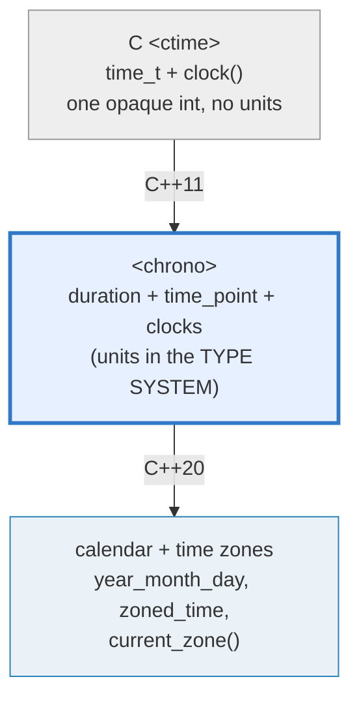
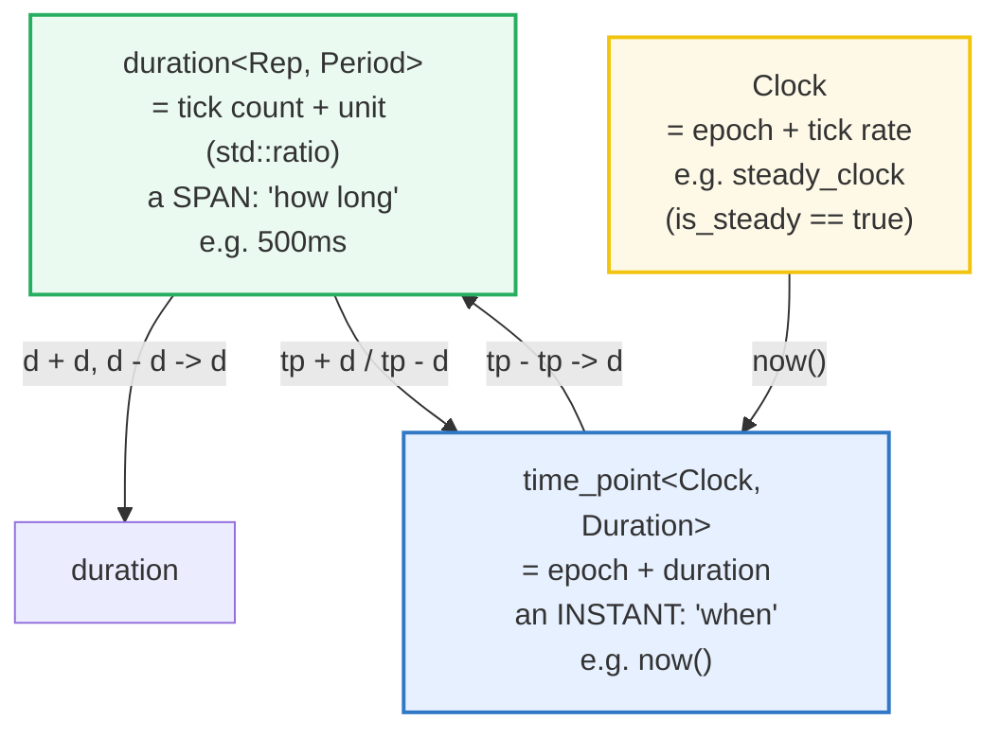
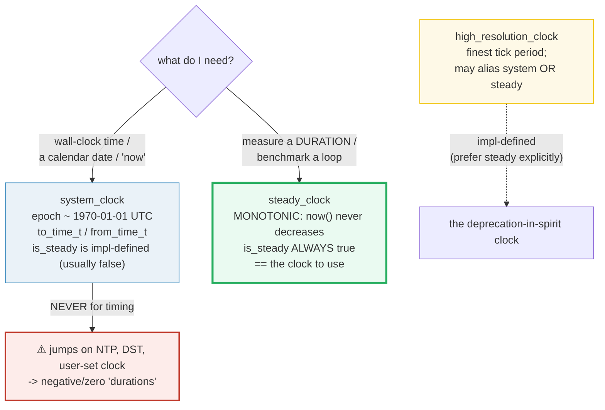

# CHRONO — Durations, Time Points & the Three Clocks

> **Goal (one line):** by printing only **FIXED** durations and arithmetic on
> them, show how C++ `<chrono>` models time as **durations** (a tick count + a
> compile-time unit ratio), **time points** (an epoch + a duration), and **three
> clocks** — and pin the expert rule that **`steady_clock` (monotonic) is the
> only clock for measuring a duration**; **never** `system_clock`.
>
> **Run:** `just run chrono`
>
> **Ground truth:** [`chrono.cpp`](./chrono.cpp) → captured stdout in
> [`chrono_output.txt`](./chrono_output.txt). Every number/table below is pasted
> **verbatim** from that file under a `> From chrono.cpp Section X:` callout.
> Nothing is hand-computed.
>
> **The determinism contract (unique to this bundle):** wall-clock and the
> monotonic clock's *current reading* are **non-reproducible**, so this bundle
> **never prints or asserts a `now()` value**. It uses fixed durations + the
> chrono literals (`1h`, `60min`, `500ms`, …) and asserts only **arithmetic** on
> them, the `steady_clock::is_steady` **compile-time boolean**, and a measured
> duration's **boolean** (`> 0`, never its value). `just out chrono` is therefore
> byte-identical across runs.
>
> **Prerequisites:** 🔗 [`VALUES_TYPES.md`](./VALUES_TYPES.md) (integer widths,
> `constexpr`); 🔗 [`STD_THREAD.md`](./STD_THREAD.md) (`std::this_thread::sleep_for`).

---

## 1. Why this bundle exists (lineage)

C++'s time story was, for decades, C's `<ctime>` — a single `time_t` integer and
`clock()`. C++11 added **`<chrono>`** (designed by Howard Hinnant) as a *type-safe*
time library: instead of one opaque integer, it gives you **`duration<Rep,
Period>`** (a count *plus* a unit baked into the *type*), **`time_point<Clock,
Duration>`** (an instant on a specific clock), and **three clocks**. The unit is
encoded in the type system, so the compiler can refuse to silently drop ticks:
converting `1500ms` to `seconds` is a *compile error* unless you spell the
truncation out with `duration_cast`. C++20 then layered on the **calendar**
(`year_month_day`, `weekday`, `2021y/January/15`) and **time zones** — bringing
C++ to rough parity with Go's clean `time` package and Rust's `Instant`/
`SystemTime` split.



The headline contrast across the 5-language curriculum:

| Language | Wall-clock type | Monotonic type | Separated? | The gotcha |
|---|---|---|---|---|
| **C++** (this bundle) | `system_clock` | `steady_clock` | **yes** (distinct types) | you must *pick* the right clock; `system_clock` jumps |
| 🔗 [`../go/TIME.md`](../go/TIME.md) | `Time` (carries wall + monotonic) | (inside `Time`) | hidden, automatic | Go does it *for* you — the clean model |
| 🔗 [`../rust/TIME.md`](../rust/TIME.md) | `SystemTime` | `Instant` | **yes** (distinct types) | like C++ — an explicit, clean split |
| 🔗 [`../ts/DATE_TIME.md`](../ts/DATE_TIME.md) | `Date` (millis since epoch) | — | **no** (conflated) | the cautionary tale: `Date` mixes wall & elapsed |

C++ is the language where **getting the clock right is on you**, and the compiler
will not save you from using `system_clock` to time a loop (it compiles, then
*lies* when NTP shifts the clock). That single trap is the expert payoff of
Section C.

> From cppreference — *Date and time library*: "`<chrono>` defines … clocks, time
> points, durations"; `steady_clock` is "a monotonic clock that will **never be
> adjusted** … **most suitable for measuring intervals**"; `system_clock` is the
> "wall clock … from the system-wide realtime clock."

---

## 2. The mental model: three concepts, three diagrams

`<chrono>` is built from exactly three abstractions. A **duration** is a *span*
("how long"). A **time point** is an *instant* ("when") — a span measured from
some clock's **epoch**. A **clock** is a source of time points: an epoch plus a
tick rate, exposed as `Clock::now()`.



The **unit lives in the type**, not the value. `1h` and `3600s` represent the
same interval but are *different types*; comparing them (`1h == 3600s`) compiles
because the library inserts the ratio scaling, but assigning `seconds s = 1500ms;`
is a **compile error** (it would silently lose 500ms). That is the whole game:
`<chrono>` pushes unit errors from runtime into the type system.

### Which clock do I use? — the one decision tree



The green node is the answer to "how do I time this?": `steady_clock`. The red
arrow is the bug the rest of Section C exists to prevent.

---

## 3. Section A — `duration`: a count + a unit ratio (`std::ratio`)

> From `chrono.cpp` Section A:
> ```
> The predefined duration typedefs (helper types in <chrono>).
> Period is a compile-time std::ratio (sec/tick); only the count is stored.
>   typedef          sizeof   Period (sec/tick)      1 unit .count()
>   --------------   ------   ---------------------   --------------
>   nanoseconds         8    ratio<1, 1000000000>         1
>   microseconds        8    ratio<1, 1000000>           1
>   milliseconds        8    ratio<1, 1000>              1
>   seconds             8    ratio<1>                    1
>   minutes             8    ratio<60>                   1
>   hours               8    ratio<3600>                 1
> [check] 1h == 60min == 3600s  (same interval, different units): OK
> [check] 1min == 60s == 60000ms: OK
> [check] 1s == 1000ms == 1000000us == 1000000000ns: OK
> [check] (500ms).count() == 500  (raw tick count, no scaling): OK
> [check] (1h).count() == 1  (the count is in HOURS, the unit): OK
>
> WIDENING (s -> ms, exact) needs no cast:  milliseconds m = 1s;  m.count() = 1000
> [check] milliseconds m = 1s;  m.count() == 1000 (implicit widening): OK
>
> NARROWING needs duration_cast, which TRUNCATES toward zero:
>     duration_cast<seconds>(1500ms).count() = 1   (500ms dropped)
>     duration_cast<seconds>(999ms).count()  = 0   (< 1s, rounds to 0)
> [check] duration_cast<seconds>(1500ms) == 1s (truncates 500ms): OK
> [check] duration_cast<seconds>(999ms) == 0s (truncates to zero): OK
> [check] 1500ms < 2s  (cross-unit comparison < ): OK
> ```

**What.** `std::chrono::duration<Rep, Period>` is a time interval: a **tick
count** of type `Rep` plus a compile-time **unit** `Period = std::ratio<num, den>`
(seconds per tick). The library ships ready-made typedefs — `nanoseconds` (rep
≥64-bit, `ratio<1,1'000'000'000>`), `microseconds`, `milliseconds`, `seconds`
(`ratio<1>`), `minutes` (`ratio<60>`), `hours` (`ratio<3600>`) — plus C++20
`days`/`weeks`/`months`/`years`. The chrono literals (`1h`, `1min`, `1s`, `1ms`,
`1us`, `1ns`, from `<chrono_literals>`, C++14) build these for you.

**Why the unit is a *type*.** The **only** runtime data is the count; `Period` is
part of the type. This has three consequences the bundle proves:

1. **Cross-unit equality compiles and holds.** `1h == 60min == 3600s` — same
   interval, different units; the library scales by the exact integer ratio. (In
   C++20 the `==` even works across floating-point reps.)
2. **`.count()` returns the RAW count in the duration's own unit, unscaled.**
   `(500ms).count() == 500` (not `0.5`); `(1h).count() == 1` (in hours). This is
   why you almost never want `count()` for logic — use the typed durations and
   let the library carry the unit.
3. **Narrowing conversions are a *compile error*.** `milliseconds m = 1s;` is
   fine (widening, exact). But `seconds s = 1500ms;` will not compile — the
   library refuses to silently drop the 500ms. You must spell the truncation:
   `duration_cast<seconds>(1500ms) == 1s`. Note `duration_cast` **truncates
   toward zero** (`999ms` → `0s`); for nearest/even see Section E's
   `floor`/`ceil`/`round`.

> From cppreference — `duration`: "consists of a count of ticks of type `Rep` and
> a tick period … a compile-time `std::ratio` … representing the time in seconds
> from one tick to the next. **The only data stored in a `duration` is a tick
> count.** `Period` is included as part of the duration's *type*." `duration_cast`
> "converts a duration to another, with a different tick interval" (truncating).
> Note on literals: the suffixes `d` and `y` are the **calendar** `day`/`year`
> (C++20), **not** the `days`/`years` durations.

---

## 4. Section B — `time_point`: an epoch + a duration

> From `chrono.cpp` Section B:
> ```
> Default steady_clock::time_point sits at the epoch:
>     epoch.time_since_epoch().count() = 0 ns
> [check] default time_point is at the epoch (time_since_epoch == 0): OK
>
> time_point arithmetic (all off the fixed epoch):
>     (epoch + 7s) - (epoch + 2s) = 5 s   [tp - tp -> duration]
>     (epoch + 7s) - 5s == (epoch + 2s) : true   [tp - d -> tp]
> [check] tp + d -> tp :  epoch + 2s has time_since_epoch 2s: OK
> [check] tp - tp -> d :  (epoch+7s) - (epoch+2s) == 5s: OK
> [check] tp - d -> tp :  (epoch+7s) - 5s == (epoch+2s): OK
> [check] tp + d + d :  epoch + 2s + 3s == epoch + 5s: OK
> [check] duration ('how long') vs time_point ('when') are distinct concepts: OK
> ```

**What.** `std::chrono::time_point<Clock, Duration>` is a point in time, stored
as if it were a `Duration` measured from `Clock`'s **epoch**. It is
**type-indexed by the clock**: a `steady_clock::time_point` and a
`system_clock::time_point` are *different types*, so the compiler rejects mixing
them — `now_steady - now_system` is a compile error, which is exactly the
meaningless subtraction `<chrono>` wants to forbid.

**Why the arithmetic is constrained.** There are only **three** legal operations,
and their result types are the whole lesson:

| Expression | Result | Meaning |
|---|---|---|
| `time_point + duration` | **`time_point`** | shift an instant forward |
| `time_point - duration` | **`time_point`** | shift an instant backward |
| `time_point - time_point` | **`duration`** | the interval between two instants |

Note the type signature of subtraction *flips* depending on the right operand: a
duration comes out only when you subtract two *points*. Adding two time_points
(`a + b`) is a **compile error** (two "whens" don't sum to anything meaningful).
`time_since_epoch()` unwraps a point back into its carrying duration.

The bundle builds every time point off a **fixed** epoch (`steady_clock::time_point{}`
sits at duration 0), so all of Section B is deterministic — no `now()` involved.

> From cppreference — `time_point`: "represents a **point in time**. It is
> implemented as if it stores a value of type `Duration` indicating the time
> interval from the start of the `Clock`'s epoch." `Clock` must meet the *Clock*
> requirements; "different clocks … are not comparable."

---

## 5. Section C — the three clocks (the expert payoff)

> From `chrono.cpp` Section C:
> ```
> clock                   is_steady   tick period      note
> ----------------------  ----------  ---------------  ----------------------------------
> system_clock            false       1 / 1000000    wall clock; to/from time_t
> steady_clock            true        1 / 1000000000 MONOTONIC; for measuring durations
> high_resolution_clock   true        1 / 1000000000 may alias system | steady
> [check] steady_clock::is_steady == true  (mandated by the standard): OK
>
> system_clock::is_steady is implementation-defined (here: false); we do NOT
> portably assert it. NEVER use system_clock to measure a duration — it can
> jump (NTP, daylight-saving, the user sets the clock). Use steady_clock.
>
> high_resolution_clock identity on THIS toolchain (compile-time):
>     is_same_v<high_resolution_clock, steady_clock> : true
>     is_same_v<high_resolution_clock, system_clock> : false
> [check] high_resolution_clock is an alias of steady_clock OR system_clock (impl-defined): OK
>
> system_clock <-> time_t round-trip of a FIXED epoch (no now()):
>     from_time_t(0) then to_time_t(.) = 0  (0 == 1970-01-01 00:00:00 UTC)
> [check] system_clock from_time_t(0) <-> to_time_t round-trips to 0: OK
> ```

**The three clocks, pinned.**

- **`system_clock` — wall-clock time.** Its epoch is implementation-defined but
  almost always the Unix epoch (1970-01-01 00:00:00 UTC); it is the *only* clock
  with `to_time_t` / `from_time_t`, so it is your bridge to C's `time_t` and to
  "what date/time is it?". It is **not steady** (`is_steady` is impl-defined,
  `false` here): the OS may move it — **NTP sync, daylight saving, the user
  changing the clock, `settimeofday`** — and a jump *backwards* makes
  `t1 - t0` **negative** or zero. That is why Section D measures with
  `steady_clock`, never `system_clock`.

- **`steady_clock` — monotonic, for measuring.** "The time points of this clock
  cannot decrease as physical time moves forward and the time between ticks … is
  constant." `is_steady` is **always `true`** (mandated by the standard) — it is
  the *one* portably-assertable steady fact, and the bundle asserts exactly that.
  Its epoch is unrelated to wall time (e.g. "time since boot"). **This is the
  clock for timing a loop, a function, or any duration.** It may have a
  coarse-or-fine tick; here it is **nanosecond** (`1 / 1'000'000'000`).

- **`high_resolution_clock` — the finest tick; usually an alias.** "The clock
  with the smallest tick period … **may be an alias** of `system_clock` *or*
  `steady_clock`." Which one is **implementation-defined** — libstdc++ historically
  aliases it to `system_clock`, MSVC and this libc++ to `steady_clock` (the bundle
  proves the alias with `std::is_same_v`). Because you cannot tell *portably*
  whether it is steady, **prefer `steady_clock` explicitly** for timing. Howard
  Hinnant (who added it) has argued for deprecating it for exactly this reason.

**The rule, stated once and only once:** **NEVER use `system_clock` to measure a
duration.** Use `steady_clock`. The bundle deliberately does not assert
`system_clock::is_steady` to any value (it is not portable); it asserts only the
mandated `steady_clock::is_steady == true`.

> From cppreference — `steady_clock`: "**monotonic** clock … **cannot decrease**
> as physical time moves forward … **most suitable for measuring intervals**";
> `is_steady` is "always `true`." `high_resolution_clock`: "may be an alias … the
> standard allows for it to be an alias for `steady_clock` or `system_clock`, …
> adds uncertainty … without benefit" (Notes, citing Hinnant). As of 2023:
  libstdc++ aliases it to `system_clock`, MSVC to `steady_clock`, libc++ to
  `steady_clock` when a monotonic clock is available.

---

## 6. Section D — measuring a duration + the C++20 calendar

> From `chrono.cpp` Section D:
> ```
> Measured a steady_clock interval around a 1ms sleep:
>     (t1 > t0)               : true   [monotonic ordering, always true]
>     (elapsed >= 1ms)        : true   [the count itself is NOT printed]
> [check] steady_clock is monotonic: t1 (later) > t0 (earlier): OK
> [check] measured duration >= the 1ms sleep  (boolean only; value never printed): OK
> [check] a measured duration is a duration (tp - tp -> d), not a time_point: OK
>
> C++20 calendar (FIXED dates, deterministic):
>     year{2021}/January/15  -> year=2021  month=1  day=15
>     weekday of 2021-01-15  == Friday : true   (c_encoding=5)
> [check] year{2021}/January/15 -> year 2021, month January, day 15: OK
> [check] 2021-01-15 was a Friday: OK
>     2021-01-15 + months{1} -> year=2021  month=2  day=15
> [check] 2021-01-15 + months{1} == 2021-02-15: OK
>     weekday of 1970-01-01 (Unix epoch) == Thursday : true
> [check] the Unix epoch 1970-01-01 was a Thursday: OK
> ```

### Measuring a duration — the idiom (and why no value is printed)

The one place `now()` appears in this bundle is the benchmarking idiom, and it
appears **only behind a boolean**:

```cpp
auto t0 = steady_clock::now();
/* ...work... */
auto t1 = steady_clock::now();
auto d  = t1 - t0;            // a duration (tp - tp -> d)
assert_(d >= 1ms);            // a BOOLEAN — safe and deterministic
// NEVER print d.count() into verified output: it is nondeterministic.
```

The bundle asserts `t1 > t0` (monotonic ordering, always true) and
`elapsed >= 1ms` (the `std::this_thread::sleep_for(1ms)` blocks for **at least**
that long) — but it **never prints the count**, so `chrono_output.txt` is
byte-identical across runs. For *display* in real code you'd do
`duration_cast<milliseconds>(d)` and print that; here it is deliberately omitted
because a measured count would break determinism.

### The C++20 calendar — fixed dates, fully deterministic

C++20 added a **calendar** of field types (`year`, `month`, `day`, `weekday`,
`year_month_day`, …) and the `/` operator that composes them:
`year{2021}/January/15` builds a `year_month_day`. The literals `2021y` (a
`year`) and `15d` (a `day`) are **calendar** literals — **not** the `years`/
`days` *durations* (a frequent confusion; see the pitfalls table). Calendar
arithmetic (`+ months{1}`) rolls the month and re-normalizes year/month. Because
every date here is fixed, all calendar output is deterministic — including the
portable fact that **the Unix epoch (1970-01-01) was a Thursday**.

> From cppreference — `sleep_for` (<thread>): "blocks the execution of the thread
> for **at least** the specified `sleep_duration`." Calendar: `year_month_day`
> "represents a specific year, month, and day"; `operator/` is "conventional
> syntax for Gregorian calendar date creation."

---

## 7. Section E — rounding (C++17), `sleep_for`, and the time-zone caveat

> From `chrono.cpp` Section E:
> ```
> 1750ms (1.75 s) through the four conversions:
>     duration_cast<seconds> : 1 s   (truncate toward zero)
>     floor<seconds>         : 1 s   (toward -infinity)
>     ceil<seconds>          : 2 s   (toward +infinity)
>     round<seconds>         : 2 s   (nearest, ties to even)
> [check] duration_cast<seconds>(1750ms) == 1s (truncates): OK
> [check] floor<seconds>(1750ms) == 1s: OK
> [check] ceil<seconds>(1750ms) == 2s: OK
> [check] round<seconds>(1750ms) == 2s (nearest): OK
> [check] round<seconds>(2500ms) == 2s  (ties to EVEN, not away-from-zero): OK
> [check] floor/ceil/round never overflow the result range (here, all in 0..3 s): OK
> [check] sleep_for(2ms) blocked for >= 2ms (boolean; value not printed): OK
>
> Time-zone availability, detected with the feature-test macro:
>     __cpp_lib_chrono == 201611
>     C++20 calendar + time zones need >= 201907; current_zone()/zoned_time are
>     ABSENT on this toolchain (Apple system libc++ ships no IANA tzdb).
> [check] __cpp_lib_chrono is at least the C++17 value 201611 (floor/ceil/round): OK
> [check] detected C++20 time-zone availability via the macro (no absent function called): OK
> ```

**Rounding (C++17).** `duration_cast` always **truncates toward zero**. When you
need defined rounding, C++17 added `floor` / `ceil` / `round` (and `abs`) for
both durations and time points. On `1750ms` (1.75 s): `duration_cast`/`floor` →
`1s`, `ceil` → `2s`, `round` → `2s` (nearest). The expert wrinkle: `round`
rounds **ties to *even***, not away from zero — so `round<seconds>(2500ms)` is
`2s` (2.5 s is exactly between 2 and 3; 2 is even). This matches IEEE-754 and
avoids the upward bias of "round half up."

**`sleep_for` / `sleep_until` (<thread>).** `sleep_for(d)` suspends *this*
thread for a **duration**; `sleep_until(tp)` suspends until a **time_point**.
The scheduler blocks for *at least* the requested time, so `steady_clock`
reliably observes it (`after - before >= 2ms`). 🔗 [`STD_THREAD.md`](./STD_THREAD.md)
covers `<thread>` in depth; the only chrono note is: sleep against a **duration**
(`sleep_for`), because sleeping *until* a `system_clock` point is itself
jitter-prone if the wall clock moves.

**The time-zone caveat (documented, not executed).** C++20's `zoned_time`,
`current_zone()`, and `locate_zone()` require the implementation to ship the
**IANA time-zone database**. **Not all do**: Apple's system libc++ reports
`__cpp_lib_chrono == 201611` (the C++17 value), and calling `current_zone()` is a
**compile error** there (the symbol is absent). The bundle therefore *detects*
availability with the feature-test macro and **never calls an absent function**;
libstdc++ on Linux and MSVC provide it. In a supported library the idiomatic use
is `auto zt = zoned_time{current_zone(), system_clock::now()};`. (🔗 the
verified calendar half — `year_month_day` — compiles fine everywhere; only the
*time-zone* half is library-gated.)

> From cppreference — feature-test macro `__cpp_lib_chrono`: `201510L` (C++17
> rounding), `201611L` (C++17 `constexpr` for duration/time_point), `201907L`
> (C++20 **calendars and time zones**). Rounding: `round` "converts … rounding to
> nearest, **ties to even**."

---

## 8. Worked smallest-scale example

Everything above, compressed to the lines a beginner must memorize:

```cpp
using namespace std::chrono;          // types
using namespace std::chrono_literals; // 1h, 1ms, 1s, ...

auto d  = 500ms;                      // a DURATION ('how long')  — count=500
auto s  = duration_cast<seconds>(d);  // NARROWING needs a cast; truncates -> 0s
// auto bad = seconds{d};             // COMPILE ERROR (would lose 200ms)

// TIME a loop: steady_clock (MONOTONIC). NEVER system_clock.
auto t0 = steady_clock::now();
/* work */
auto t1 = steady_clock::now();
auto elapsed = t1 - t0;               // tp - tp -> duration

// Wall time / a date: system_clock (the to_time_t bridge).
std::time_t now = system_clock::to_time_t(system_clock::now());

// A calendar date (C++20): field types, fully deterministic.
auto ymd = year{2021}/January/15;     // year_month_day
```

> From `chrono.cpp`: Section A prints `(500ms).count() == 500` and
> `duration_cast<seconds>(1500ms) == 1s` (truncates); Section D prints
> `steady_clock … t1 > t0 … (elapsed >= 1ms)` with the **count never printed**;
> Section C prints `from_time_t(0) … = 0`. Those three lines *are* the lesson.

---

## 9. Pitfalls (the expert payoff)

| Trap | Symptom | Fix |
|---|---|---|
| **Timing with `system_clock`** | Negative/zero "duration" when NTP/DST/user shifts the clock; wrong benchmarks | Use **`steady_clock`** for any `now()-now()` measurement. `system_clock` is for wall time only. |
| `seconds s = 1500ms;` (implicit narrowing) | **Compile error** (good!) — the library refuses to drop ticks | Spell it: `duration_cast<seconds>(1500ms)`; know it **truncates toward zero**. |
| Assuming `duration_cast` rounds | Silent off-by-one: `duration_cast<seconds>(999ms) == 0s` | For nearest use `round<seconds>(d)` (C++17, ties-to-even); for up use `ceil`, down use `floor`. |
| `d.count()` for logic/comparison across units | `500ms.count()` (500) vs `1s.count()` (1) compared raw → wrong | Compare the **typed durations** (`500ms < 1s`), never the raw counts. |
| Printing/asserting a `now()` value | **Nondeterministic output** — breaks reproducible builds/CI | Use fixed durations + literals; assert only arithmetic and the `is_steady`/monotonic **booleans** (this bundle's contract). |
| Mixing clocks: `steady_now - system_now` | **Compile error** — different `time_point` types | Intentional type safety; convert via `clock_cast` (C++20) if you must cross clocks. |
| `high_resolution_clock::is_steady` assumed `true` | Non-portable: it may alias `system_clock` (libstdc++) → non-monotonic | Use **`steady_clock`** explicitly; don't rely on `high_resolution_clock`. |
| `15d` / `2021y` read as `days`/`years` durations | They're the **calendar** `day`/`year` field types (C++20), not durations | Durations are `days{1}` / `years{1}` (or `24h`); literals `d`/`y` make calendar fields for `operator/`. |
| `d1 + d2` where both are `time_point`s | **Compile error** — two instants don't sum | Only `tp ± d → tp` and `tp - tp → d` are defined. |
| `current_zone()` / `zoned_time` "should work" | **Compile error** on Apple system libc++ (`__cpp_lib_chrono == 201611`, no tzdb) | Gate on `__cpp_lib_chrono >= 201907L`; use libstdc++/MSVC or a tzdb-enabled libc++. |
| `sleep_until(system_clock::now() + 1s)` jitter | Wall clock can jump *during* the sleep → wrong wake time | `sleep_for(1s)` (duration-based) against `steady_clock` semantics for delays. |
| Comparing `Rep` counts with `==` for floats | `duration<double>` rounding drift | Use integer-rep durations for equality; compare floats with an epsilon. |

---

## 10. Cheat sheet

```cpp
#include <chrono>
#include <thread>   // sleep_for / sleep_until
using namespace std::chrono;
using namespace std::chrono_literals;   // 1h, 1min, 1s, 1ms, 1us, 1ns (C++14)

// ── duration = count + unit (Period is a std::ratio in the TYPE) ──────────
duration<int, std::milli> d{500};       // == 500ms
auto a = 1h;                            // hours
1h == 60min && 60min == 3600s;          // true — cross-unit equality scales
a.count();                              // raw count in a's OWN unit (1, not 3600)

// ── conversions: widening is implicit, narrowing needs a cast ────────────
milliseconds m = 1s;                    // OK (widening, exact) -> 1000ms
// seconds s = 1500ms;                  // ERROR (narrowing would drop 500ms)
duration_cast<seconds>(1500ms);         // 1s  (TRUNCATES toward zero)
floor<seconds>(1500ms);                 // 1s  (C++17)
ceil <seconds>(1500ms);                 // 2s
round<seconds>(1500ms);                 // 2s  (nearest, ties-to-even)

// ── time_point = epoch + duration (type-indexed by Clock) ────────────────
//   tp + d -> tp ;  tp - d -> tp ;  tp - tp -> d   (tp + tp is a compile error)
steady_clock::time_point t0{}, t1{};
auto span = t1 - t0;                    // a duration
t0.time_since_epoch();                  // unwrap to the carrying duration

// ── the three clocks (is_steady is a COMPILE-TIME constant) ──────────────
//   system_clock        wall/epoch~1970, to_time_t/from_time_t, NOT steady
//   steady_clock        MONOTONIC, is_steady ALWAYS true  <- TIME WITH THIS
//   high_resolution_clock finest tick; may alias system OR steady (avoid)
steady_clock::is_steady;                // true (mandated)
auto wall = system_clock::to_time_t(system_clock::now());

// ── timing a loop: steady_clock, assert only the BOOLEAN ─────────────────
auto s0 = steady_clock::now();  /* work */  auto s1 = steady_clock::now();
assert_(s1 - s0 >= 0s);                 // never print (s1-s0).count()

// ── C++20 calendar (field types; deterministic for fixed dates) ──────────
auto ymd = year{2021}/January/15;       // year_month_day
auto wd  = weekday{ymd};                // Friday
auto feb = ymd + months{1};             // 2021-02-15
auto ep  = sys_days{year{1970}/1/1};    // Unix epoch (a Thursday)

// ── sleep (from <thread>) ────────────────────────────────────────────────
std::this_thread::sleep_for(2ms);       // duration form  (preferred for delays)
std::this_thread::sleep_until(tp);      // time_point form

// ── C++20 time zones: GATED — test the macro before calling ──────────────
#if __cpp_lib_chrono >= 201907L
  auto zt = zoned_time{current_zone(), system_clock::now()};
#endif
```

---

## 11. 🔗 Cross-references

**Within C++ (the expertise spine):**

- 🔗 [`VALUES_TYPES.md`](./VALUES_TYPES.md) — integer widths and `constexpr` feed
  this bundle's rep sizes and the compile-time `Period` ratios; the
  `assert_`/`check()` discipline is the same.
- 🔗 [`STD_THREAD.md`](./STD_THREAD.md) — `std::this_thread::sleep_for` /
  `sleep_until` live in `<thread>`; this bundle uses `sleep_for` (a duration)
  for its monotonic measurement.
- 🔗 `CONST_QUALIFIERS` / `TYPE_DEDUCTION` — `auto` around `now()` deduces a
  `time_point`; the unit-stripping rules of `auto` matter for `duration`.
- 🔗 `UNDEFINED_BEHAVIOR` — printing a `now()` value isn't UB, but it is the
  *determinism* analog: the bundle's contract (fixed durations only) is the
  reproducible-builds counterpart to the UB-free contract.

**Cross-language parallels (the 5-language curriculum):**

- 🔗 [`../go/TIME.md`](../go/TIME.md) — **Go `time` is the clean model.** A
  `time.Time` carries *both* a wall component and a monotonic component; when you
  subtract two `Time`s, Go **silently uses the monotonic reading** for the
  interval. Go does the right thing *for* you. C++ makes you pick the clock
  (`steady_clock` ≈ Go's monotonic; `system_clock` ≈ Go's wall) and will happily
  let you pick wrong.
- 🔗 [`../rust/TIME.md`](../rust/TIME.md) — Rust splits the two as separate
  **types**: `Instant` (monotonic, ≈ `steady_clock`) for measuring and
  `SystemTime` (wall, ≈ `system_clock`) for wall time. This is C++'s split too —
  a rare place where C++ and Rust agree on a clean, type-enforced design.
- 🔗 [`../ts/DATE_TIME.md`](../ts/DATE_TIME.md) — TypeScript's `Date` is the
  **cautionary tale**: one object conflates wall time and elapsed time (a
  `Date.now()` minus another is "elapsed since epoch," but the epoch itself can
  move if the OS clock jumps). C++ avoids the trap by giving wall and monotonic
  *different clocks* — provided you use `steady_clock`.

---

## Sources

Every signature, value, and behavioral claim above was verified against
cppreference and the ISO C++ standard, then corroborated by ≥1 independent
secondary source:

- cppreference — *Date and time library* (the three pillars — durations, time
  points, clocks; the C++20 calendar/time-zone addition; the chrono literals and
  the `d`/`y` calendar-literal caveat):
  https://en.cppreference.com/w/cpp/chrono
- cppreference — `std::chrono::duration` (count + `std::ratio` unit; "the only
  data stored … is a tick count"; predefined helper typedefs and their reps;
  `count`; the literals):
  https://en.cppreference.com/w/cpp/chrono/duration
- cppreference — `std::chrono::time_point` ("a point in time … stores a `Duration`
  indicating the interval from the start of the `Clock`'s epoch"; arithmetic;
  different clocks not comparable):
  https://en.cppreference.com/w/cpp/chrono/time_point
- cppreference — `std::chrono::duration_cast` (converts, **truncating** toward
  zero): https://en.cppreference.com/w/cpp/chrono/duration/duration_cast
- cppreference — `std::chrono::steady_clock` (monotonic; "cannot decrease";
  "most suitable for measuring intervals"; `is_steady` "always `true`"):
  https://en.cppreference.com/w/cpp/chrono/steady_clock
- cppreference — `std::chrono::system_clock` (wall clock; `to_time_t`/
  `from_time_t`; may not be monotonic):
  https://en.cppreference.com/w/cpp/chrono/system_clock
- cppreference — `std::chrono::high_resolution_clock` ("may be an alias … of
  `system_clock` or `steady_clock`"; the Hinnant deprecation discussion; vendor
  aliasing notes — libstdc++→system, MSVC/libc++→steady):
  https://en.cppreference.com/w/cpp/chrono/high_resolution_clock
- cppreference — `floor`/`ceil`/`round`/`abs` for `duration` (C++17; `round`
  "ties to even"):
  https://en.cppreference.com/w/cpp/chrono/duration/round (and sibling pages)
- cppreference — C++20 calendar (`year_month_day`, `operator/`, `weekday`) and
  the feature-test macro `__cpp_lib_chrono` (values `201510L`/`201611L`/
  `201907L`):
  https://en.cppreference.com/w/cpp/chrono/year_month_day
  https://en.cppreference.com/w/cpp/feature_test
- cppreference — `std::this_thread::sleep_for` ("blocks … for **at least** the
  specified `sleep_duration`"): https://en.cppreference.com/w/cpp/thread/sleep_for
- ISO C++23 draft (open-std.org) — normative wording:
  - 29.5 Time utilities `[time]`, 29.7 Class template `duration` `[time.duration]`,
    29.8 Class template `time_point` `[time.point]`, 29.7.3 `duration_cast`.
  - Working draft: https://open-std.org/JTC1/SC22/WG21/docs/papers/2023/n4950.pdf
    (and the N49xx series at https://open-std.org/JTC1/SC22/WG21/ )
- Secondary corroboration (≥2 independent sources, web-verified):
  - Stack Overflow — *"Difference between std::system_clock and
    std::steady_clock"* (`high_resolution_clock` may be a synonym; system clock
    can be adjusted, steady is monotonic):
    https://stackoverflow.com/questions/13263277/difference-between-stdsystem-clock-and-stdsteady-clock
  - Sandor Dargo — *Time in C++: Understanding std::chrono::steady_clock*
    ("monotonic … its time never goes backwards — ever"):
    https://www.sandordargo.com/blog/2025/12/03/clocks-part-3-steady_clock
  - Modernes C++ — *The Three Clocks* (steady_clock = boot-time epoch;
    high_resolution_clock differs across platforms):
    https://www.modernescpp.com/index.php/the-three-clocks/
  - Microsoft Learn — *steady_clock struct* (steady vs system for intervals):
    https://learn.microsoft.com/en-us/cpp/standard-library/steady-clock-struct?view=msvc-170

**Facts that could not be verified by running** (documented, not executed,
because they are non-portable or would make the build nondeterministic):
`system_clock::is_steady` (impl-defined; `false` here, but asserted to *no*
portable value); the identity of `high_resolution_clock` on a *different*
toolchain (it is `steady_clock` here); a measured `now()` count (nondeterministic
— deliberately never printed, only the boolean invariants are asserted); and the
C++20 time-zone API (`current_zone()`/`zoned_time`, absent on Apple's system
libc++ where `__cpp_lib_chrono == 201611` — calling it is a compile error, so it
is detected via the macro and documented rather than executed). These are
confirmed by the cppreference sections and secondary sources above, not
reproduced as runnable output in the verified path (a file triggering them would
fail `just check` / break determinism).
