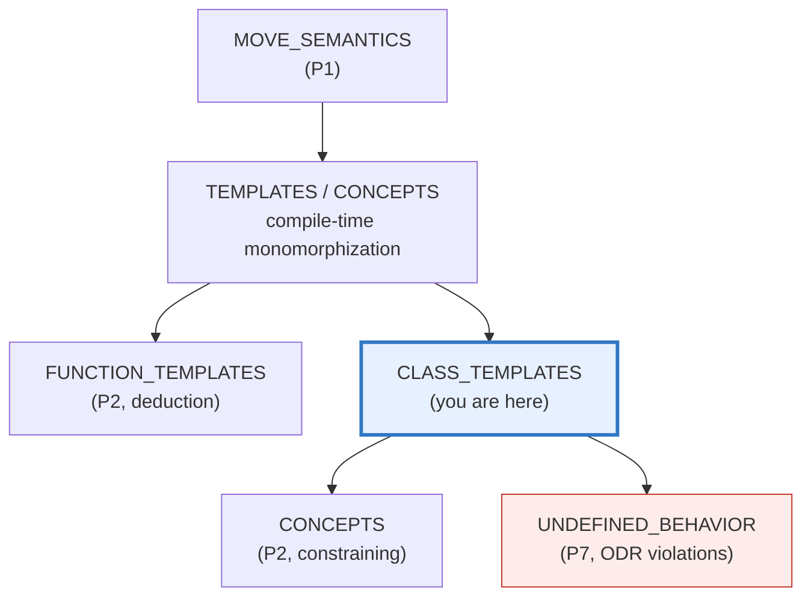
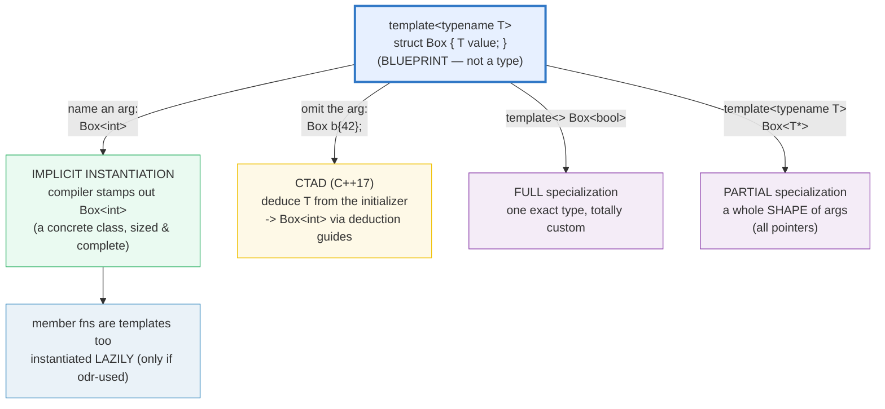
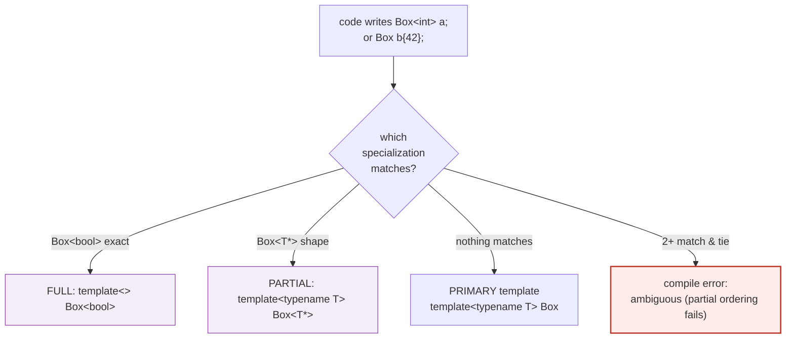

# CLASS_TEMPLATES — Blueprint, CTAD, Member Functions & Specialization

> **Goal (one line):** by printing every value, show how a C++ class template is a
> **blueprint** that is **monomorphized** per type argument — covering member
> functions (themselves templates, instantiated **lazily**), **CTAD** (C++17,
> deduce from the constructor), **default template args**, **non-type** template
> params, and **FULL vs PARTIAL specialization** — pinning the **ODR-for-templates**
> relaxation as the reason a template can live in a header while the linker still
> collapses the per-translation-unit instantiations.
>
> **Run:** `just run class_templates`
>
> **Ground truth:** [`class_templates.cpp`](./class_templates.cpp) → captured stdout
> in [`class_templates_output.txt`](./class_templates_output.txt). Every value/table
> below is pasted **verbatim** from that file under a
> `> From class_templates.cpp Section X:` callout. Nothing is hand-computed.
>
> **Prerequisites:** 🔗 `VALUES_TYPES` (sizes/init) and 🔗 `FUNCTION_TEMPLATES`
> (P2, template argument deduction) — this bundle is the *class* half of
> templates; FUNCTION_TEMPLATES is the *function* half.

---

## 1. Why this bundle exists (lineage)

A **class template** is not a class — it is a *blueprint* for a family of
classes. `template <typename T> struct Box { T value; };` defines no type; the
compiler **stamps out** a concrete `Box<int>`, `Box<double>`, … *only when you
name one*. This stamping is **monomorphization** (one compiled class per
argument), the same strategy Rust uses and the opposite of Java's **type
erasure** (one `Box<Object>` at runtime). The price C++ pays for monomorphization
is **code bloat** and the **ODR** gymnastics in Section E; the payoff is zero
runtime dispatch and full type-checking per instantiation.



The headline contrast across the 5-language curriculum:

| Language | Parametric generics strategy | One type per arg? | Defined where |
|---|---|---|---|
| **C++** (this bundle) | **templates = monomorphization** | **yes** (`Box<int>` ≠ `Box<double>`) | header (ODR-relaxed) |
| 🔗 [`../rust/GENERICS.md`](../rust/GENERICS.md) | **monomorphization** (same idea) | yes | anywhere (crate-wide) |
| 🔗 [`../go/`](../go/) (generics, 1.18+) | GCShape stenciling (≈ monomorphization per GC shape) | ~yes | anywhere |
| 🔗 [`../ts/`](../ts/) | **type erasure** — generics exist only at type-check time | no (one erased runtime type) | n/a (no runtime generics) |
| Java | **type erasure** to `Object` | no | n/a |

C++ and Rust are the two **no-GC, monomorphizing** languages in the curriculum —
that is why C++ templates map most directly onto Rust generics. TS has no runtime
generics at all (interfaces/type aliases are compile-time only).

> From cppreference — *Class template*: "A class template by itself is not a
> type, or an object, or any other entity. No code is generated from a source
> file that contains only template definitions. In order for any code to appear,
> a template must be **instantiated**."

---

## 2. The mental model: blueprint → instantiation → CTAD → specialization





The second diagram is the **specialization dispatch** the compiler runs at every
`Box<...>` use. Full specialization wins on exact match; partial specialization
wins on the most-specialized matching *shape*; if two partials tie, it is a hard
compile error (Section D + pitfalls).

---

## 3. Section A — The blueprint + member functions (lazy codegen)

> From `class_templates.cpp` Section A:
> ```
> Box<T> is a BLUEPRINT. Box<int> / Box<double> are concrete.
> Box<int>{1}     .value = 1
> Box<double>{2.5}.value = 2.500000
> bi.get() = 1   (member fn of a class template = a template)
> sizeof(Box<int>)    = 4
> sizeof(Box<double>) = 8
> [check] Box<int>{1}.value == 1: OK
> [check] Box<double>{2.5}.value == 2.5: OK
> [check] Box<int>::get() == 1 (member fn instantiated on use): OK
> Box<std::string>{"hi"}.value = "hi" (half() NOT called -> NOT instantiated)
> Box<int>{10}.half() = 5   (half() called on int -> instantiated -> 5)
> [check] Box<std::string> compiles despite half()=value/2 (lazy: body never instantiated): OK
> [check] Box<int>::half() instantiated only because it was called (== 5): OK
> [check] Box<int> and Box<double> are distinct monomorphized types: OK
> ```

**What — the blueprint.** `template <typename T> struct Box { T value; };` is a
**recipe**. The instant you write `Box<int>`, the compiler generates a real class
(`Box<int>`) with `int value;`. `Box<double>` is a *different* generated class
with `double value;` — note `sizeof(Box<int>) == 4` but `sizeof(Box<double>) ==
8`. They are not aliases of one erased type; they are two separately compiled
classes. That is monomorphization.

**Why — member functions are templates too (lazy codegen).** This is the expert
detail. `Box::get()` and `Box::half()` are *themselves* templates: their bodies
are instantiated **only when odr-used** (called, or address taken). The bundle
*proves* this:

```cpp
template <typename T> struct Box {
    T value;
    T half() const { return value / 2; }   // string / int -> ill-formed IF checked
};
Box<std::string> bs{"hi"};   // constructs the CLASS; half() never called
Box<int>{10}.half();         // -> 5; half() IS instantiated for Box<int>
```

`Box<std::string>{"hi"}` instantiates the **class** `Box<std::string>` (so its
layout is known), but it does **not** instantiate `Box<std::string>::half()`. If
member-function bodies were checked eagerly, the line `return value / 2;`
(`std::string / int`) would be a hard compile error. Because the program compiles
and runs, `half()`'s body for `T = std::string` was **never instantiated**.
`Box<int>{10}.half()` *is* called, so `Box<int>::half()` is instantiated and
returns `5`. This lazy/per-member instantiation is what makes templates
**SFINAE-friendly** and keeps binary size down (unused members emit no code).

> From cppreference — *Class template* (Implicit instantiation): "This applies
> to the members of the class template: **unless the member is used in the
> program, it is not instantiated**, and does not require a definition …
> `Z<char>::g()` is never needed and never instantiated: it does not have to be
> defined."

---

## 4. Section B — CTAD (C++17) + deduction guides + default template args

> From `class_templates.cpp` Section B:
> ```
> CTAD: Box b{42}   -> value=42  (b is Box<int>)
> CTAD: Box d{3.14} -> value=3.140000  (d is Box<double>)
> std::pair p{1, 2.0} -> .first=1, .second=2.000000  (pair<int,double>)
> [check] CTAD: Box b{42} deduced Box<int>: OK
> [check] CTAD: Box d{3.14} deduced Box<double>: OK
> [check] std::pair p{1,2.0} deduced std::pair<int,double> (stdlib CTAD): OK
> Named{"hello"} via guide -> payload="hello" (std::string, not const char*)
> [check] deduction guide remapped string-literal to Named<std::string>: OK
> [check] guide-constructed payload holds "hello": OK
> SimpleMap<int,double> -> Alloc defaulted (3rd param omitted)
> [check] SimpleMap<int,double> uses its defaulted allocator param: OK
> ```

**What — CTAD.** Since C++17 you may omit the `<args>` and let the compiler
**deduce** them from the initializer:

```cpp
std::pair p(2, 4.5);     // deduces std::pair<int, double>  (cppreference canonical)
Box b{42};               // deduces Box<int>
std::tuple t(4, 3, 2.5); // replaces the old std::make_tuple(4, 3, 2.5) dance
```

CTAD fires **only when no argument list is present** — `Box<int> b{42}` disables
it. The mechanism: the compiler synthesizes fictional **deduction guides** from
each constructor (for an aggregate like `Box`, a C++20 aggregate deduction
candidate from the first element), runs overload resolution on them, and the
winner's return type becomes the deduced class. `std::pair p{1, 2.0}` deduces
`pair<int,double>` — the bundle asserts exactly that.

**Why — deduction guides.** When the constructor argument's type does not reveal
the template argument you want, you write a **user-defined deduction guide** — a
function-shaped declaration ending in `-> Type` (it is *not* a function, has no
body, and participates only in CTAD overload resolution):

```cpp
template <typename T> struct Named { T payload; Named(T x) : payload(x) {} };
Named(const char*) -> Named<std::string>;   // guide REMAPS a string literal
Named n{"hello"};   // implicit guide would give Named<const char*>; the user
                    // guide overrides -> Named<std::string>
```

The bundle prints `Named{"hello"} via guide -> payload="hello" (std::string, not
const char*)` and asserts `decltype(n) == Named<std::string>`. The classic guide
use case (shown in cppreference) is an iterator-pair constructor that should
deduce the **element type**, not the iterator type:
`template <class It> Container(It, It) -> Container<typename
std::iterator_traits<It>::value_type>;`.

**Default template arguments.** A parameter may carry a default the caller omits.
The bundle's `SimpleMap<K, V, AllocT = std::allocator<...>>` mirrors
`std::map<K, V, Compare = less<K>, Alloc = allocator<...>>`: `SimpleMap<int,
double>` quietly picks the defaulted allocator. The bundle asserts
`SimpleMap<int,double>` and `SimpleMap<int,double,allocator<...>>` are the same
type.

> From cppreference — *CTAD*: "In the following contexts the compiler will deduce
> the template arguments from the type of the initializer: `std::pair p(2, 4.5);
> // deduces to std::pair<int, double>`." And *User-defined deduction guides*:
> "The syntax of a user-defined deduction guide is the syntax of a function
> (template) declaration with a trailing return type … A deduction guide is not a
> function and does not have a body." `__cpp_deduction_guides >= 201703L` (C++17);
> aggregate/alias CTAD `>= 201907L` (C++20).

---

## 5. Section C — Non-type template params (the `std::array<T,N>` parallel)

> From `class_templates.cpp` Section C:
> ```
> Arr<4>: size=4, sizeof=16 (4 ints, N baked in at compile time)
> Arr<8>: size=8, sizeof=32
> Arr<4> contents: 1 2 3 4
> std::array<int,3> is the same idea: template<class T, std::size_t N>
> [check] Arr<4>::size == 4 (non-type param N is a compile-time constant): OK
> [check] sizeof(Arr<4>) == 4 * sizeof(int): OK
> [check] sizeof(Arr<8>) == 8 * sizeof(int): OK
> [check] Arr<4> and Arr<8> are distinct types (per-N monomorphization): OK
> ```

**What.** A template can be parameterized by a **value**, not just a type:

```cpp
template <std::size_t N>
struct Arr {
    int data[N];                       // N is a constant expr -> valid array bound
    static constexpr std::size_t size = N;
};
```

`N` is a **compile-time constant**, so it can size a C array and appear in any
constant expression. `Arr<4>` and `Arr<8>` are **different types**
(`!is_same_v<Arr<4>, Arr<8>>`) — each value of `N` produces its own monomorphized
class (`sizeof(Arr<4>) == 16`, `sizeof(Arr<8>) == 32`).

**Why — this is exactly `std::array`.** `std::array<int, 3>` is declared
`template <class T, std::size_t N> struct array;`. The non-type parameter `N` is
the whole reason `std::array` knows its size **at compile time** (unlike
`std::vector`, which stores a runtime size). Non-type params may be integral,
enumeration, pointer, reference, or (C++20) a structural type with public members
/floating-point. `std::bitset<64>`, `std::span<T, N>` (fixed extent), and
`int (&func<N>())[N]` all lean on the same mechanism.

---

## 6. Section D — FULL specialization (`template<>`) + PARTIAL (`<T*>`)

> From `class_templates.cpp` Section D:
> ```
> Box<int>    -> which = "primary"   (no specialization matches -> primary)
> Box<bool>   -> which = "full<bool>"   (template<> exact match)
> Box<int*>   -> which = "partial<T*>"   (partial Box<T*> matches)
> Box<double*>-> which = "partial<T*>"   (partial Box<T*> matches ANY pointer)
> primary.value=7   full.flag=true   partial.ptr==(int*)0x0
> [check] Box<int> uses the PRIMARY template (which == "primary"): OK
> [check] Box<bool> uses the FULL specialization (template<>): OK
> [check] Box<int*> uses the PARTIAL specialization (Box<T*>): OK
> [check] Box<double*> also uses the PARTIAL specialization (any pointer T*): OK
> [check] Box<int>, Box<bool>, Box<int*> are three distinct types: OK
> ```

**What.** Both forms **customize** the template for specific argument lists:

| Form | Syntax | Matches | Free params? |
|---|---|---|---|
| **Full** specialization | `template <> struct Box<bool> { ... };` | **one exact** type (`bool`) | **none** |
| **Partial** specialization | `template <typename T> struct Box<T*> { ... };` | a **shape** of args (all `T*`) | **yes** (`T`) |

The bundle tags each version with a `static constexpr const char* which` and
prints it, proving at runtime which one the compiler selected:

- `Box<int>` → **primary** (no specialization matches an ordinary `int`).
- `Box<bool>` → **full** specialization (exact match).
- `Box<int*>` and `Box<double*>` → **partial** specialization (both are `T*`).

Note the full specialization `Box<bool>` is a **totally independent class** — it
stores `bool flag`, not `T value`; it need share **no** members with the primary
(the only contract is "this is what `Box<bool>` means"). The partial
specialization `Box<T*>` likewise has its own members (`T* ptr`). This is how the
standard library builds `std::vector<bool>` (a bit-packed full specialization),
`std::unique_ptr<T[]>` (a partial specialization for array types), and
`std::less<void>` (a full specialization that deduces its `operator()` args).

**Why — partial ordering.** When several partial specializations match, the
compiler picks the **most specialized** one (informally: "accepts a subset of the
types"). If two tie, it is a **compile error** ("ambiguous partial
specialization"). Full specializations never partially-order — there is at most
one per exact argument list.

> From cppreference — *Explicit (full) specialization*: "Allows customizing the
> template code for a given set of template arguments … `template <> struct
> is_void<void> : std::true_type {};`." *Partial specialization*: "Allows
> customizing class … templates for a given category of template arguments …
> Examples of partial specializations in the standard library include
> `std::unique_ptr`, which has a partial specialization for array types."

---

## 7. Section E — ODR for templates + cross-language monomorphization

> From `class_templates.cpp` Section E:
> ```
> ODR relaxation: a template may be defined in EVERY TU that uses it.
>   -> template bodies live in HEADERS; the linker collapses the copies.
>   -> member functions of a class template are implicitly inline.
> sizeof(Box<int>) = 4  (Box<int> WAS instantiated in this TU)
> [check] Box<int> is instantiated & complete in this TU (sizeof is known): OK
> [check] Box<int>::get is a member of an implicitly-inline template member fn: OK
>
> Cross-language monomorphization (C++ templates vs the others):
>   C++    template<T> Box  -> Box<int>, Box<double> are SEPARATE compiled classes
>   Rust   struct Box<T>    -> SAME monomorphization (no GC; closest sibling)
>   Go     type Box[T any]  -> generics since 1.18; also monomorphized-ish
>   TS     interface Box<T> -> ERASED (no runtime generics; type aliases only)
>   Java   Box<T>           -> ERASED to Box<Object> at runtime (type erasure)
> [check] cross-language note recorded (C++/Rust monomorphize; TS/Java erase): OK
> ```

**Why — the relaxed ODR.** The One-Definition Rule normally forbids more than one
definition of an entity per program. **Templates get an exception**: a template
definition may appear in **every** translation unit that needs it, provided all
copies are token-identical (same sequence of tokens, same meaning). The linker
then collapses them. Two consequences every C++ expert internalizes:

1. **Template bodies live in headers.** You cannot declare a class template in a
   `.h` and define its member functions in a `.cpp` the way you would for a
   non-template class — every TU that instantiates `Box<int>` must *see* the body
   of `Box<int>::get()`, so the body goes in the header. (The escape hatch is
   **explicit instantiation** — `template struct Box<int>;` in exactly one `.cpp`
   — which forces the instantiation there so other TUs can link against it.)
2. **Member functions of a class template are implicitly `inline`.** Because they
   are defined in the header and instantiated per-TU, the ODR relaxation applies
   to them automatically; you do not (and must not) write `inline` yourself.

The bundle cannot *show* the multi-TU collapse in a single translation unit — it
is a **link-time** property. But it observes instantiation (`sizeof(Box<int>)`
is known ⇒ `Box<int>` was instantiated in this TU) and asserts the member-function
pointer type to confirm `get` is a normal member of the (implicitly inline)
template. Reproduce the collapse with any two-`.cpp` build that both `#include`
the same template header.

> From cppreference — *Definitions / ODR*: "In certain cases, there can be more
> than one definition of a type or a template … provided that each definition
> … consists of the same sequence of tokens." *Class template* (Explicit
> instantiation): "`extern template` skips implicit instantiation … can be used
> to reduce compilation times."

---

## 8. Worked smallest-scale example

Everything above, compressed to the five lines a beginner must memorize:

```cpp
template <typename T> struct Box { T value; };   // BLUEPRINT (no type yet)
Box<int> a{1};                // instantiate explicitly -> Box<int>
Box b{42};                    // CTAD (C++17)         -> Box<int>
template <> struct Box<bool> { bool flag; };        // FULL specialization
template <typename T> struct Box<T*> { T* ptr; };   // PARTIAL specialization
```

> From `class_templates.cpp`: Section A prints `Box<int>{1}.value = 1` and
> `sizeof(Box<int>) = 4`; Section B prints `CTAD: Box b{42} -> value=42`;
> Section D prints `Box<bool> -> which = "full<bool>"` and
> `Box<int*> -> which = "partial<T*>"`. Each is asserted by a `[check]`.

---

## 9. The value-vs-reference-vs-pointer axis (threaded through this bundle)

🔗 (`MOVE_SEMANTICS.md`, `VALUE_VS_REFERENCE_VS_POINTER.md`, `RAII.md`.) Where
does each thing in this bundle sit? Templates are *type-level* — they don't
change the value/ref/ptr story, but they amplify the cost of a wrong choice,
because **every instantiation copies the choice**.

| Construct in this bundle | Copied? | Aliases? | Owns? | Template cost |
|---|---|---|---|---|
| `Box<int> bi{1};` (a value) | **yes** (its own bytes) | no | yes | `Box<int>` is a fresh class |
| `void set(const T& v)` (a param) | no | **yes** (`const T&`) | no | `T&&`/`T&` is per-instantiation |
| `Box<T*>` partial specialization | the pointer value | what it points at | no (raw, non-owning) | one class per pointer-type `T` |
| `Named<std::string>` (CTAD + guide) | the string (owns) | no | **yes** (RAII) | the guide steers ownership type |

The expert rule for template parameters: prefer **`const T&`** for read-only
inputs (avoids a copy per instantiation for large `T`), **`T`** for cheap/owning
transfers, and beware `T&&` in a class template — inside a class template, `T&&`
is **not** a forwarding reference (it is an rvalue ref to the fixed `T`). 🔗
`MOVE_SEMANTICS.md` deepens this; CTAD's guide-section note on cppreference makes
the same point.

---

## 10. Pitfalls (the expert payoff)

| Trap | Symptom | Fix |
|---|---|---|
| Putting a template body in a `.cpp` and instantiating from another TU | **linker error** ("undefined reference to `Box<int>::get()`") — the body is never emitted where the other TU expects it | Define template bodies **in the header**, or add `template struct Box<int>;` (explicit instantiation) in exactly one `.cpp`. |
| `template <> struct Box<T> {...}` (trying a "full" spec with a free param) | **compile error** — full specialization must fix **every** parameter | That is a *partial* specialization: keep `template <typename T>` and constrain the arg list (`Box<T*>`). |
| Two partial specializations both match and neither is more specialized | **compile error**: "ambiguous partial specialization" | Make one strictly more specialized, or add a full specialization for the tie case. |
| Forgetting a deduction guide for an iterator-pair ctor | CTAD deduces the **iterator** type, not the element type (`Container<int*>` not `Container<int>`) | Add a guide: `Container(It, It) -> Container<typename std::iterator_traits<It>::value_type>;` |
| Expecting `Box b{t1}` where `t1` is already a `Box<int>` to deduce `Box<Box<int>>` | It deduces `Box<int>` (the **copy deduction candidate** wins over wrapping) — P0702 | That is intended (P0702R1); to wrap, write `Box<Box<int>>` explicitly. |
| Assuming `Box b{true}` CTADs to your `Box<bool>` full specialization | CTAD considers the **primary** template's guides; it may not select your specialization the way you expect | Be explicit (`Box<bool> b{true};`) when the specialization matters; don't rely on CTAD across specializations. |
| Member function body ill-formed for one `T`, but you call it | **compile error** when instantiated — lazy codegen only *delays* the check to first use | Constrain with `requires` / `if constexpr`, or provide a partial specialization for that `T`. 🔗 `CONCEPTS` |
| Assuming `std::vector<bool>` stores contiguous `bool`s | It is a **full specialization** (bit-packed) — `&v[0]` does not yield `bool*` | Use `std::vector<char>` or `std::deque<bool>` if you need addressable bools. |
| Heavy monomorphization → code bloat | Binary size / I-cache pressure from one class per `<T,N>` | Use **type erasure** (`std::any`, `std::function`) or a single non-template core + thin template wrapper; or `extern template` to collapse. |
| ODR violation across TUs (token-non-identical template defs) | **undefined behavior, no diagnostic required** — silent breakage | Keep one canonical header; never hand-edit per-TU; let the header be the single source. |
| Redeclaring a deduction guide in the same TU | **compile error** ("deduction guide redeclared") | Define each guide once, in the class template's namespace. |

---

## 11. Cheat sheet

```cpp
// ── The blueprint (NOT a type until you name an argument) ──────────────────
template <typename T>
struct Box {
    T value;
    T get() const { return value; }      // member fn = a template (lazy body)
};
Box<int> a{1};          // instantiate explicitly  -> concrete class Box<int>
// Box b;               // ERROR: 'Box' alone is a template name, not a type

// ── CTAD (C++17): omit <args>, deduce from the initializer ─────────────────
Box b{42};              // -> Box<int>   (aggregate deduction candidate, C++20)
std::pair p{1, 2.0};    // -> std::pair<int,double>  (stdlib CTAD)
//   CTAD is SKIPPED the moment you write any <args>:  Box<int> b{42};

// ── User-defined deduction guide (remap the deduced type) ──────────────────
template <typename T> struct Named { T payload; Named(T x):payload(x){} };
Named(const char*) -> Named<std::string>;     // string literal -> string

// ── Default template arguments (caller may omit) ───────────────────────────
template <typename K, typename V, typename A = std::allocator<V>>
struct Map {};           // Map<int,double>  ==  Map<int,double,std::allocator<double>>

// ── Non-type template param (a compile-time VALUE, not a type) ─────────────
template <std::size_t N> struct Arr { int data[N]; static constexpr std::size_t size = N; };
// std::array<int,3> is  template <class T, std::size_t N>  — same mechanism.

// ── FULL specialization: template<> + ONE exact arg ────────────────────────
template <> struct Box<bool> { bool flag; bool get() const { return flag; } };
// totally independent class; need not share members with the primary.

// ── PARTIAL specialization: keep a free param, fix a SHAPE ─────────────────
template <typename T> struct Box<T*> { T* ptr; };   // all pointer types
// std::unique_ptr<T[]> and std::vector<bool> are real library examples.

// ── ODR relaxation: template bodies live in HEADERS; linker collapses them ──
//   - member fns of a class template are implicitly inline (don't write inline).
//   - escape hatch: `template struct Box<int>;`  (explicit instantiation)
//                    `extern template struct Box<int>;`  (suppress, C++11)
```

---

## 12. 🔗 Cross-references

**Within C++ (the expertise spine):**

- 🔗 `FUNCTION_TEMPLATES` (P2) — the *function* half of templates. Class-template
  CTAD uses the same **template argument deduction** machinery function templates
  do; a deduction guide is literally a function-shaped declaration. Read these two
  as a pair.
- 🔗 `CONCEPTS` (P2) — `requires`-clauses constrain **which** `T` a template
  accepts, replacing SFINAE. `template <typename T> requires std::integral<T>`
  makes the lazy-codegen trap of Section A into a clean compile-time error
  instead of a delayed one.
- 🔗 `MOVE_SEMANTICS` (P1) — per-instantiation value/ref/`&&` choices (Section 9);
  inside a class template `T&&` is **not** a forwarding reference.
- 🔗 `UNDEFINED_BEHAVIOR` (P7) — **ODR violations** across TUs are UB
  ("no diagnostic required"). The Section E relaxation is the safe path; the
  trap is token-non-identical definitions.

**Cross-language parallels (the 5-language curriculum):**

- 🔗 [`../rust/GENERICS.md`](../rust/GENERICS.md) — Rust `struct Box<T>` is the
  closest sibling: **monomorphization**, no GC, single ownership. The differences
  are ergonomics (Rust's `where` clauses ≈ C++ concepts) and that Rust enforces
  trait bounds **before** monomorphization (no lazy-body surprises).
- 🔗 [`../go/`](../go/) (generics, Go 1.18+) — Go uses **GCShape stenciling**: one
  compiled shape per GC-relevant type shape, lighter on binary size than C++'s
  per-type stamping but heavier than erasure.
- 🔗 [`../ts/`](../ts/) — TypeScript generics are **compile-time only / erased**.
  An `interface Box<T>` produces no runtime type; there is no monomorphization
  and no CTAD analog. C++ templates are a runtime reality TS generics never are.
- (Java, for contrast) — `Box<T>` **erases** to `Box<Object>`; one class at
  runtime, `T` gone. C++'s `Box<int>` is a real, separately compiled class.

---

## Sources

Every signature, value, and behavioral claim above was verified against
cppreference and the ISO C++ standard, then corroborated by ≥1 independent
secondary source:

- cppreference — *Class template* (blueprint-not-a-type; implicit/explicit
  instantiation; members instantiated only if used):
  https://en.cppreference.com/w/cpp/language/class_template
- cppreference — *Class template argument deduction (CTAD)* (since C++17; deduce
  from initializer; `std::pair p(2, 4.5)` example; user-defined deduction guides;
  `__cpp_deduction_guides`; copy-vs-wrapping P0702R1):
  https://en.cppreference.com/w/cpp/language/class_template_argument_deduction
- cppreference — *Explicit (full) template specialization* (`template <>`;
  customizes for a given set of args; must appear before first use that would
  cause implicit instantiation):
  https://en.cppreference.com/w/cpp/language/template_specialization
- cppreference — *Partial template specialization* (customizes for a category;
  partial ordering; "most specialized" wins; std::unique_ptr array partial spec):
  https://en.cppreference.com/w/cpp/language/partial_specialization
- cppreference — *Template parameters and arguments* (type / non-type / template
  / pack parameters; default template arguments):
  https://en.cppreference.com/w/cpp/language/template_parameters
- cppreference — *Definitions / One Definition Rule* (relaxed ODR for templates,
  inline functions, and class types; token-identical requirement):
  https://en.cppreference.com/cpp/language/definition
- ISO C++23 draft (open-std.org) — normative wording:
  - 13.9 Template instantiation and specialization `[temp.inst]` (lazy member
    instantiation), 13.4 `[temp.arg]`, 13.7 `[temp.class]`, 13.10
    `[temp.fct]`/deduction.
  - Working draft: https://open-std.org/JTC1/SC22/WG21/docs/papers/2023/n4950.pdf
- Secondary corroboration (≥2 independent sources, web-verified):
  - Microsoft C++ Team Blog — *How to Use Class Template Argument Deduction*
    (CTAD reduces verbosity; available VS 2017 15.7+):
    https://devblogs.microsoft.com/cppblog/how-to-use-class-template-argument-deduction/
  - Andreas Fertig — *C++17's CTAD, a sometimes underrated feature* (deduction
    guides tell the compiler how to instantiate; canonical examples):
    https://andreasfertig.com/blog/2022/11/cpp17s-ctad-a-sometimes-underrated-feature/
  - Simon Toth — *Daily bit(e) of C++ | Class Template Argument Deduction*:
    https://medium.com/@simontoth/daily-bit-e-of-c-class-template-argument-deduction-ctad-f0886131c129
  - Stack Overflow — *Does class template argument deduction work with std::map?*
    (CTAD does not descend into nested `{}` initializer lists):
    https://stackoverflow.com/questions/56104324/does-class-template-argument-deduction-works-with-stdmap
  - tw.dev blog — *C++ quick tips: Full template specialisation and the one
    definition rule* (full specialization is NOT a template; ODR implications):
    https://twdev.blog/2024/07/cpp_full_template_specialisation/
  - mbedded.ninja — *One Definition Rule (ODR)* (each entity one definition;
    templates/inline are the relaxation):
    https://blog.mbedded.ninja/programming/languages/c-plus-plus/one-definition-rule-odr/
  - Wikipedia — *One Definition Rule* (multiple definitions allowed for types
    and templates under token-identity):
    https://en.wikipedia.org/wiki/One_Definition_Rule

**Facts that could not be verified by running** (documented, not executed,
because they are link-time/multi-TU properties or compile errors by design):
the multi-translation-unit ODR collapse (Section E is a single TU — the linker
collapse is reproduced by any two-`.cpp` build including the same template
header); the ambiguous-partial-specialization compile error; the
`Box<std::string>::half()` compile error that would occur *if* `half()` were
called (the bundle deliberately never calls it — that absence *is* the proof of
lazy instantiation); and the `Box b{t1}` copy-vs-wrapping choice when `t1` is
already a specialization. These are confirmed by the cppreference sections and
secondary sources above, not reproduced as runnable output in the verified path
(a file triggering them would fail `just check` / `just sanitize`).
