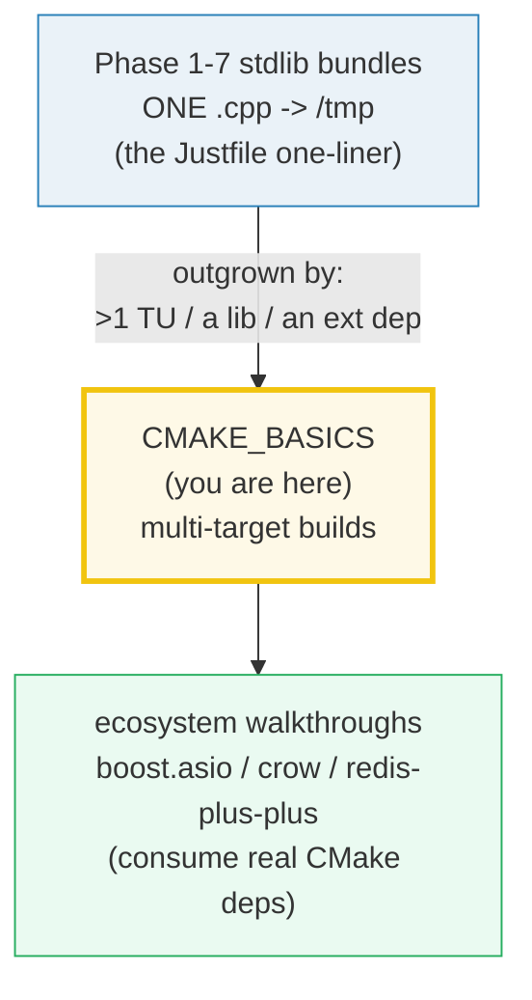
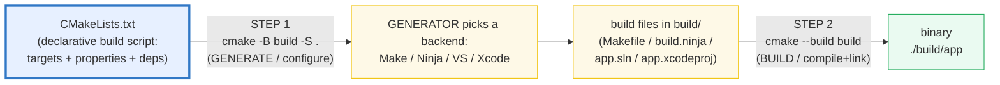
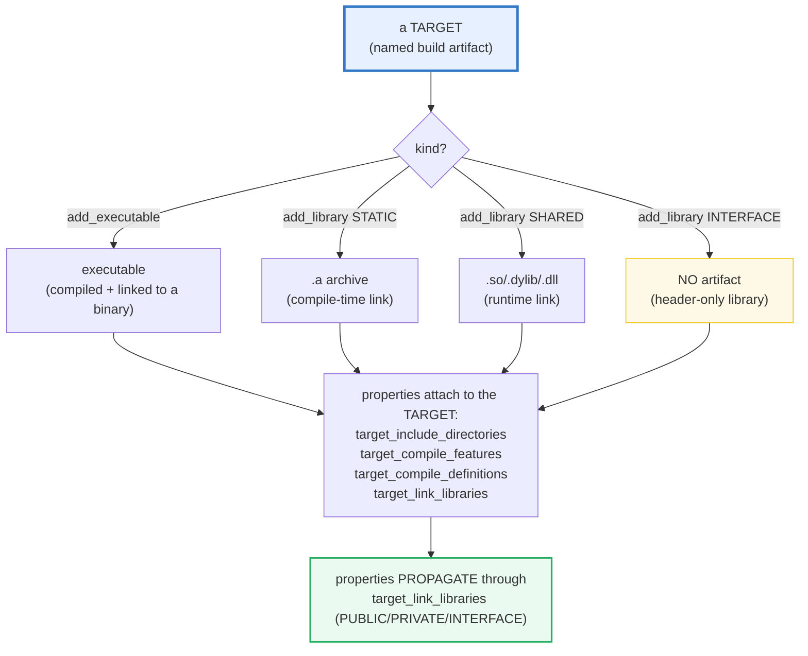

# CMAKE_BASICS — Targets, PUBLIC/PRIVATE/INTERFACE & the Generate→Build Two-Step

> **Goal (one line):** show, by asserting the **structure** of hand-written
> `CMakeLists.txt` strings + the **observed** cmake version, how CMake's modern
> **target-based** build model works (targets + per-target properties + the
> **`PUBLIC`/`PRIVATE`/`INTERFACE`** propagation rule) and the **generate→build
> two-step** — *without* spawning cmake, whose output is nondeterministic.
>
> **Run:** `just run cmake_basics`
>
> **Ground truth:** [`cmake_basics.cpp`](./cmake_basics.cpp) → captured stdout in
> [`cmake_basics_output.txt`](./cmake_basics_output.txt). Every value/table below
> is pasted **verbatim** from that file under a
> `> From cmake_basics.cpp Section X:` callout. Nothing is hand-computed.
>
> **Prerequisites:** none from this folder's stdlib phase — this is **Phase 8
> (Build, Tooling & Production)**, the first bundle that leaves the single-TU
> world. Familiarity with compiling one `.cpp` (`just run NAME`) from any Phase
> 1–7 bundle is assumed; that one-liner is precisely what CMake outgrows.

---

## 1. Why this bundle exists (lineage)

C++ has **no integrated build tool.** The compiler (`c++`/`g++`/`clang++`) turns
*one* translation unit into an object file, and the linker glues objects into a
binary — that's the whole toolchain. The moment a project has **two** `.cpp`
files, a **library**, or an **external dependency**, you need something to
orchestrate: "compile these N files, with these flags, link them against those
libs, in this order." That something is **CMake** — the de-facto build system for
real-world C++.



CMake is C++'s **cargo-equivalent** — but where Rust's `cargo` and Go's `go
build` *are* the integrated toolchain (one tool, one manifest, curated), CMake is
a **separate meta-build-system**: it **generates** build files (Makefiles /
Ninja / VS `.sln` / Xcode `.xcodeproj`) for a chosen *generator*, which then
invoke the OS compiler. More moving parts, more historical cruft (the
variable-based anti-pattern of Section E), and no package layer as integrated as
crates.io or the Go module proxy — that role falls to **vcpkg/Conan**, separate
tools again.

> From the CMake docs — *Why CMake*: "CMake is a **build system generator.** … A
> project specifies its build process with platform-independent CMake listfiles
> … which in turn direct the **generate** step to produce **build files** for a
> specific compiler/environment." The headline: **CMake does not compile; it
> generates, then you build.**

### The determinism problem this bundle solves

`cmake -B build` writes generator-dependent **paths**, compiler-detection
**lines**, and **timestamps** that vary across machines and even across runs. A
bundle that shelled out to cmake would break the byte-identical re-run guarantee
(HOW_TO_RESEARCH §4.2). So this bundle **asserts static facts only**:

- the **structural shape** of `CMakeLists.txt` strings (does it contain
  `add_executable`, `target_link_libraries … PUBLIC`, etc.?),
- the **observed** `cmake --version` string (baked in, parsed for major/minor/patch),
- the **documented** two-step command model (`cmake -B build` / `cmake --build build`).

The real invocation is **documented** in Section G behind an `#ifdef RUN_CMAKE`
gate that `just run`/`just out`/`just check`/`just sanitize` **never** pass — so
the default and sanitizer builds stay deterministic and UB-free.

---

## 2. The mental model: CMake is a *meta* build system

CMake sits **between** your `CMakeLists.txt` and the actual compiler. It runs in
**two steps**, and everything in the language (`add_executable`,
`target_link_libraries`, …) is a command that runs during the **generate** step
to *describe* the graph; the **build** step then walks that graph.





The second diagram is the whole story of Sections B and C. **Modern CMake is
target-centric**: properties live on **targets** (not global variables) and
**propagate** along the dependency graph through `target_link_libraries`. That
propagation rule — `PUBLIC`/`PRIVATE`/`INTERFACE` — is the central idea and gets
its own section.

---

## 3. Section A — The CMakeLists.txt skeleton + the observed cmake version

> From `cmake_basics.cpp` Section A:
> ```
> (1) OBSERVED `cmake --version` (first line, baked in as a static fact):
>     "cmake version 4.3.3"
>     parsed: major=4 minor=3 patch=3 (sscanf matched 3/3)
> [check] cmake version string parses to major.minor.patch (3 components): OK
> [check] cmake major version >= 3 (so cmake_minimum_required(VERSION 3.x) is satisfiable): OK
> [check] cmake version is at least 3.20 (a common modern floor): OK
> ```

**What.** The bundle's first act is to pin the **observed** cmake version as a
static, documented fact (`cmake version 4.3.3` on this box) and parse it with
`sscanf` into `major.minor.patch`. It asserts `major >= 3` so a
`cmake_minimum_required(VERSION 3.x)` directive is *satisfiable* by the installed
cmake, and `>= 3.20` (a common modern floor that guarantees the target-based
commands and `cxx_std_*` compile features are all available).

**Why we bake the version in instead of shelling out.** `cmake --version`'s
*first line* is deterministic, but the bundle's discipline is "assert static
facts, never nondeterministic output" (HOW_TO_RESEARCH §4.2). Re-running
`cmake --version` from inside the bundle would (a) depend on `cmake` being on
`$PATH`, (b) mix the "deterministic first line" with the rest of cmake's
nondeterministic behavior in a way that tempts future edits toward shelling out
to `cmake -B build`. So the version is **observed once, documented, and asserted
structurally** — exactly the pattern the brief calls for.

> From `cmake_basics.cpp` Section A (the skeleton):
> ```
> (2) The minimal CMakeLists.txt skeleton:
> 
> cmake_minimum_required(VERSION 3.20)
> project(myapp LANGUAGES CXX)
> 
> set(CMAKE_CXX_STANDARD 23)
> set(CMAKE_CXX_STANDARD_REQUIRED ON)
> 
> add_executable(myapp src/main.cpp)
> [check] skeleton contains cmake_minimum_required(VERSION: OK
> [check] skeleton contains project(... LANGUAGES CXX): OK
> [check] skeleton sets CMAKE_CXX_STANDARD: OK
> [check] skeleton declares an executable target (add_executable): OK
> [check] skeleton sets CMAKE_CXX_STANDARD to 23 (the curriculum standard): OK
> ```

**The four load-bearing lines of every `CMakeLists.txt`:**

1. **`cmake_minimum_required(VERSION 3.20)`** — gates the cmake dialect. A cmake
   older than 3.20 refuses to configure (fail fast). Always set a real floor; it
   also silences the compatibility quirks of ancient versions.
2. **`project(myapp LANGUAGES CXX)`** — names the project and **enables the C++
   language**. Omitting `LANGUAGES` silently enables C and CXX; being explicit
   avoids surprises. (Other languages: `C`, `CUDA`, `Fortran`, `OBJCXX`, …)
3. **`set(CMAKE_CXX_STANDARD 23)`** + **`set(CMAKE_CXX_STANDARD_REQUIRED ON)`** —
   requests C++23. The *modern* per-target alternative is
   `target_compile_features(tgt PUBLIC cxx_std_23)` (Section B), which pins the
   standard to one target instead of a global variable. The bundle asserts the
   skeleton sets the standard to **23** — this curriculum's standard.
4. **`add_executable(myapp src/main.cpp)`** — declares a **target** named `myapp`
   built from `src/main.cpp`. A target is the atomic unit of Modern CMake; *all*
   properties attach to it.

> From `cmake_basics.cpp` Section A (the gap CMake fills):
> ```
> (3) How the stdlib bundles build today (the Justfile one-liner):
>     c++ -std=c++23 -O2 -Wall -Wextra -Wpedantic NAME.cpp -o /tmp/cpp_NAME
>     ^ compiles ONE translation unit to /tmp. Sufficient for Phase 1-7
>       stdlib bundles; insufficient for a real multi-target project.
> [check] Justfile command targets C++23 (-std=c++23): OK
> [check] Justfile command compiles to /tmp (no artifact in source): OK
> [check] Justfile command is single-TU (one .cpp, no multi-target linking): OK
> ```

**The gap.** Every Phase 1–7 stdlib bundle compiles **one** `.cpp` to `/tmp` and
runs it. That command — verbatim from this repo's `Justfile` — is sufficient for
a single-translation-unit program with no dependencies. It cannot express: two
`.cpp` files, a static library, an external dependency, different flags per
target, or a build that works on Linux + macOS + Windows. **That gap is what
CMake fills**, and the one-liner above is the before-picture.

> From the CMake docs — *cmake_minimum_required*: "Sets the minimum required
> version of cmake for a project … Also sets the policy settings." *project*:
> "Set the name of the project. … The top-level `CMakeLists.txt` file for a
> project must contain a literal, direct call to the `project()` command."

---

## 4. Section B — Targets: `add_library` + per-target properties (Modern)

> From `cmake_basics.cpp` Section B:
> ```
> The modern target-based CMakeLists.txt (library + executable):
> 
> cmake_minimum_required(VERSION 3.20)
> project(myapp LANGUAGES CXX)
> 
> add_library(math STATIC src/math.cpp)
> target_include_directories(math PUBLIC include)
> target_compile_features(math PUBLIC cxx_std_23)
> 
> add_executable(app src/main.cpp)
> target_link_libraries(app PRIVATE math)
> [check] declares a STATIC library target: OK
> [check] declares an executable target: OK
> [check] STATIC library type present (archive .a): OK
> [check] the library compiles a source file (src/math.cpp): OK
> [check] target_include_directories (modern, per-target include path): OK
> [check] target_compile_features (modern, per-target compile feature): OK
> [check] modern CMakeLists uses cxx_std_23 (req C++23 for the math target): OK
> [check] executable links the library (target_link_libraries): OK
> ```

**What.** Modern CMake declares **targets** (`add_library` / `add_executable`)
and attaches **properties** to *them*, not to global state. The `math` library
target carries its own include directory (`include/`) and compile feature
(`cxx_std_23`) as `PUBLIC` properties; the `app` executable links `math`
`PRIVATE`. Every `target_*` command names the target it modifies first.

**The three `add_library` kinds:**

> From `cmake_basics.cpp` Section B:
> ```
> The three add_library kinds (STATIC/SHARED/INTERFACE):
>   type        artifact                             object files?  header-only?
>   ----------  -----------------------------------  -------------  ------------
>   STATIC      .a archive (compile-time link)       yes            no
>   SHARED      .so/.dylib/.dll (runtime link)       yes            no
>   INTERFACE   no artifact (header-only)            no             yes
> [check] STATIC produces a .a archive with object files: OK
> [check] SHARED produces a runtime-loaded lib with object files: OK
> [check] INTERFACE produces NO artifact (header-only library): OK
> [check] INTERFACE is the header-only-library kind: OK
> ```

- **`STATIC`** → an archive (`.a` / `.lib`) of object files, copied into the
  final binary at link time.
- **`SHARED`** → a dynamically-loaded library (`.so` / `.dylib` / `.dll`),
  resolved at load/runtime.
- **`INTERFACE`** → **no artifact at all**; it's the modern way to package a
  **header-only** library. It carries only `INTERFACE`-scoped properties (include
  dirs, compile features) that propagate to consumers. This is the
  header-only-library kind.

**Modern `target_*` vs old global commands:**

> From `cmake_basics.cpp` Section B:
> ```
> Modern (target_*, per-target) vs old (global) property commands:
>   modern target_*        | old global equivalent (avoid)
>   ----------------------  | --------------------------------
>   target_include_directo  | include_directories
>   target_link_libraries   | link_libraries
>   target_compile_features | (none; add_definitions / CMAKE_CXX_FLAGS)
>   target_compile_definiti | add_definitions
> [check] modern per-target include cmd = target_include_directories: OK
> [check] modern per-target feature cmd = target_compile_features: OK
> ```

The `target_*` form is **per-target and propagating**; the global form
(`include_directories`, `link_directories`, `add_definitions`,
`CMAKE_CXX_FLAGS`) is **directory-scoped and non-propagating**. Always prefer
`target_*`. `target_compile_features(math PUBLIC cxx_std_23)` is the modern
per-target way to require C++23 — it beats the global `CMAKE_CXX_STANDARD`
because it's scoped to one target and propagates to its consumers.

> From the CMake docs — *add_library*: "`add_library(<name> [STATIC | SHARED |
> MODULE | INTERFACE] …)` — defines a library target. … `INTERFACE` does not
> build any output." *target_include_directories*: "Add include directories to a
> target. … The `INTERFACE`, `PUBLIC` and `PRIVATE` keywords are required to
> specify the scope." *target_compile_features*: "Add the named compiler
> features … e.g. `cxx_std_23`."

---

## 5. Section C — `target_link_libraries`: `PUBLIC` / `PRIVATE` / `INTERFACE`

**This is the central idea of Modern CMake.** When target `B` links target `A`,
three **scope** keywords decide what *propagates* from `A` to `B` (and onward to
`B`'s own consumers):

> From `cmake_basics.cpp` Section C:
> ```
> target_link_libraries(<tgt> <SCOPE> <dep>) — the propagation model:
> 
>   SCOPE       used in OWN build?  propagates to CONSUMERS?  use case
>   ----------  ------------------  ------------------------  ----------------------------------
>   PUBLIC      yes                 yes                       a real dependency used in headers + impl
>   PRIVATE     yes                 no                        an implementation detail hidden in .cpp
>   INTERFACE   no                  yes                       header-only: needed by consumers, not by us
> [check] PUBLIC: used in own build AND propagates to consumers: OK
> [check] PRIVATE: used in own build, does NOT propagate to consumers: OK
> [check] INTERFACE: NOT used in own build, DOES propagate to consumers: OK
> [check] PUBLIC == (PRIVATE own-build) UNION (INTERFACE consumer-propagation): OK
> [check] exactly one scope (INTERFACE) is header-only (no own-build use): OK
> [check] modern CMakeLists contains the PRIVATE scope: OK
> [check] math target exposes include dir + feature PUBLIC (propagates to app): OK
> [check] app links math PRIVATE (math is an impl detail; app's consumers do NOT see math): OK
> ```

**The three scopes, precisely:**

- **`PUBLIC`** — the dependency is used in **this target's own build** *and*
  **propagates** to anything that links this target. Use when a dependency is
  part of your **public headers** (a consumer that `#include`s your header will
  transitively see the dependency's headers).
- **`PRIVATE`** — the dependency is used in **this target's own build only**;
  consumers that link this target do **not** inherit it. Use for an
  **implementation detail** hidden in your `.cpp` files. (Section B's `app`
  links `math` `PRIVATE`: `math` compiles into `app`, but `app`'s hypothetical
  consumers would *not* see `math`.)
- **`INTERFACE`** — the dependency is **not** used in this target's own build
  (the target is header-only, or the dep is only needed by *consumers*), but it
  **does** propagate. Use for **header-only** libraries — an `INTERFACE` library
  produces no artifact; it only carries propagating properties.

The bundle proves the elegant decomposition: **`PUBLIC == (PRIVATE own-build) ∪
(INTERFACE consumer-propagation)`** — a `check` asserts exactly that. If you
remember nothing else, remember that PUBLIC is the union of the other two's
concerns.

**A worked read of the dependency graph:**

> From `cmake_basics.cpp` Section C:
> ```
> Worked read of the dependency graph in Section B's CMakeLists:
>   math  --PUBLIC include/ + cxx_std_23-->  [propagates to whoever links math]
>   app   --PRIVATE math-------------------->  [math compiles into app; app's
>                                              consumers do NOT inherit math]
> [check] math's PUBLIC include dir reaches app's build (propagation): OK
> [check] app's (hypothetical) consumers would NOT see math (PRIVATE): OK
> ```

`math` advertises `include/` and `cxx_std_23` as **`PUBLIC`** — so when `app`
links `math`, `app`'s build *automatically* gets `-Iinclude` and `-std=c++23`.
No manual `include_directories(include)` on `app`; the property propagates. That
propagation is the payoff of Modern CMake: **each target describes its own
usage requirements, and the graph assembles itself.**

> From the CMake docs — *target_link_libraries*: "The `PUBLIC`, `PRIVATE` and
> `INTERFACE` scope keywords can be used to specify both the **link
> dependencies** and the **link interface** in one command. … Libraries and
> targets following `PUBLIC` are linked to, and are made part of the link
> interface. … `PRIVATE` … are linked to, but are not part of the interface. …
> `INTERFACE` … are added to the interface but not used for the linking of the
> target itself."

---

## 6. Section D — The generate→build two-step, generators, out-of-source

> From `cmake_basics.cpp` Section D:
> ```
> CMake is a META build system: it generates build files, it does NOT compile.
> The two-step model (run once, then many times):
>   STEP 1 (GENERATE / configure):  cmake -B build -S .
>       -> reads CMakeLists.txt, detects the toolchain, writes build files
>          (Makefiles / Ninja / VS .sln / Xcode .xcodeproj) into build/
>   STEP 2 (BUILD / compile+link):  cmake --build build
>       -> invokes the generated backend to compile .cpp -> .o and link -> binary
> [check] generate step writes into the build/ dir (cmake -B build): OK
> [check] generate step reads the source dir (cmake -S .): OK
> [check] build step targets the build/ dir (cmake --build build): OK
> [check] the two steps are distinct commands (generate != build): OK
> ```

**The two steps.** CMake **never compiles.** It splits the build into:

1. **Generate (configure)** — `cmake -B build -S .` reads `CMakeLists.txt`,
   detects the toolchain (which compiler? which version? what features?), and
   **writes build files** into `build/`. `-S .` is the source dir; `-B build` is
   the build dir (created if missing). Run once, and again only when you change
   `CMakeLists.txt`.
2. **Build** — `cmake --build build` invokes the **generated backend** (make,
   ninja, msbuild, xcodebuild) to compile `.cpp → .o` and link → binary. Run many
   times (it recompiles only what changed).

The portable invocation is `cmake --build build` (not `make -C build` or
`ninja -C build`) — it calls whichever backend the generate step picked, so the
same instruction works on Make, Ninja, VS, and Xcode.

**Generators — the backends `cmake -G <name>` selects:**

> From `cmake_basics.cpp` Section D:
> ```
> Generators (the backends `cmake -G <name>` selects):
>   generator        kind      command-line backend?
>   ---------------  --------  ---------------------
>   Unix Makefiles   Make      yes
>   Ninja            Ninja     yes
>   Visual Studio    VS IDE    no (IDE project)
>   Xcode            IDE       no (IDE project)
> [check] Ninja is a command-line generator: OK
> [check] Unix Makefiles is a command-line generator: OK
> [check] Visual Studio is an IDE-project generator (not command-line): OK
> [check] Xcode is an IDE-project generator (not command-line): OK
> ```

A **generator** is the backend whose build files CMake emits. Command-line
generators (`Unix Makefiles`, `Ninja`, `Ninja Multi-Config`) emit files you build
from a terminal; IDE generators (`Visual Studio`, `Xcode`) emit `.sln` /
`.xcodeproj` project files you open in the IDE. `Ninja` is the fast modern
default on Unix; `Visual Studio` is the default on Windows. The generator is
chosen at generate time and is **fixed** for that `build/` dir.

**Out-of-source discipline — `build/` is generated, never committed:**

> From `cmake_basics.cpp` Section D:
> ```
> Out-of-source build discipline (build/ is generated, never committed):
> build/
> cmake-build-*/
> CMakeCache.txt
> CMakeFiles/
> cmake_install.cmake
> [check] .gitignore ignores build/: OK
> [check] .gitignore ignores cmake-build-*/ (IDE variant dirs): OK
> [check] .gitignore ignores CMakeCache.txt (per-build cache): OK
> [check] .gitignore ignores CMakeFiles/ (generated intermediate dir): OK
> [check] source tree stays clean: only CMakeLists.txt is committed (not its output): OK
> ```

The bundle's `GITIGNORE_BUILD_LINES` constant is **verbatim from this repo's
`cpp/.gitignore`** — the lines that enforce out-of-source builds. The discipline:
build files go in `build/` (separate from source); `build/`,
`cmake-build-*/`, `CMakeCache.txt`, `CMakeFiles/`, and `cmake_install.cmake` are
all gitignored. **Only `CMakeLists.txt` is committed** — the source tree stays
clean, and `rm -rf build/` always restores a pristine state. (In-source builds —
running `cmake .` in the source root — pollute the tree with generated files and
are an anti-pattern; always use `cmake -B build -S .`.)

> From the CMake docs — *cmake.1* (the `cmake` command): "`cmake [<options>] -B
> <path-to-build> -S <path-to-source>` — Generate a Project Buildsystem. …
> `cmake --build <dir> [<options>] [-- <build-tool-options>]` — Build a Project
> (this works for any generator)." And *CMake Generators*: "A build system
> generator … produces build files for a specific build tool (e.g. *Unix
> Makefiles*, *Ninja*, *Visual Studio*)."

---

## 7. Section E — `find_package` (modern imported targets) vs the variable anti-pattern

> From `cmake_basics.cpp` Section E (modern):
> ```
> MODERN: find_package imports a TARGET carrying its own properties:
> 
> cmake_minimum_required(VERSION 3.20)
> project(myapp LANGUAGES CXX)
> 
> find_package(Threads REQUIRED)
> 
> add_executable(app src/main.cpp)
> target_link_libraries(app PRIVATE Threads::Threads)
> [check] modern uses find_package: OK
> [check] modern marks the dep REQUIRED (fail fast if missing): OK
> [check] modern links an IMPORTED TARGET (Threads::Threads): OK
> [check] imported target uses the double-colon namespace (::): OK
> [check] modern find_package avoids manual include/link dirs: OK
> ```

**Consuming an external library the modern way.** `find_package(Threads
REQUIRED)` runs a CMake **find module** that locates the system's pthreads
support and exposes it as an **imported target**, `Threads::Threads`. That
imported target already carries its include dirs, link flags, and compile
definitions as properties — so you just `target_link_libraries(app PRIVATE
Threads::Threads)` and **everything propagates**. No manual `include_directories`
or `link_directories` needed.

**The `::` is a contract.** The double-colon namespace (`Threads::Threads`,
`Boost::system`, `fmt::fmt`) marks an **imported/alias target**. It's how you
tell at a glance "this is a real CMake target carrying properties, not a raw
library name." The bundle asserts the modern form uses `::` and the anti-pattern
does not.

> From `cmake_basics.cpp` Section E (anti-pattern):
> ```
> ANTI-PATTERN: global variables + raw paths (non-propagating, fragile):
> 
> # ANTI-PATTERN (old, variable-based, non-propagating) — do not write this:
> include_directories(/usr/local/include)
> link_directories(/usr/local/lib)
> add_definitions(-DDEBUG)
> set(CMAKE_CXX_FLAGS "${CMAKE_CXX_FLAGS} -O2 -Wall")
> add_executable(app src/main.cpp)
> target_link_libraries(app pthread)
> [check] anti-pattern uses global include_directories: OK
> [check] anti-pattern uses global link_directories: OK
> [check] anti-pattern uses global add_definitions: OK
> [check] anti-pattern mutates the global CMAKE_CXX_FLAGS: OK
> [check] anti-pattern links a raw lib name (pthread) instead of an imported target: OK
> [check] anti-pattern does NOT use the :: imported-target namespace: OK
> ```

**The old variable-based anti-pattern.** Pre-Modern CMake (and a lot of
copy-pasted legacy `CMakeLists.txt`) uses **global, directory-scoped** commands:
`include_directories(/usr/local/include)`, `link_directories(/usr/local/lib)`,
`add_definitions(-DDEBUG)`, and mutates `CMAKE_CXX_FLAGS` directly. It links a
**raw library name** (`pthread`, not `Threads::Threads`). This style is fragile:
the properties don't propagate to consumers, every consuming target must repeat
the paths, and hard-coded paths (`/usr/local/include`) break across platforms.
The bundle pins every signature of the anti-pattern and asserts the modern form
has none of them.

**Why the modern way wins — the propagation payoff:**

> From `cmake_basics.cpp` Section E:
> ```
> Why the modern way wins (the propagation payoff):
>   find_package(Threads) + Threads::Threads  ->  ONE target carries
>     include dirs + link flags + compile defs as PROPERTIES; link it and
>     everything propagates. The old way forces every consumer to repeat
>     include_directories/link_directories/flags manually -> drift + bugs.
> [check] imported targets are self-describing (carry their own properties): OK
> ```

An imported target is **self-describing**: it bundles "where my headers are, what
flags you need, what to link" into one named entity. Link it once and the
properties flow; the alternative is every consumer re-discovering and re-typing
the paths, which drifts and rots.

> From the CMake docs — *find_package*: "Find a package (usually provided by
> something external to the project) … and load package-specific detail. … Many
> find modules define **imported targets**." *FindThreads*: "Provides the
> `Threads::Threads` imported target." *Imported Targets*: "An **IMPORTED**
> target … represents a pre-existing dependency … the `::` syntax also
> distinguishes it from a regular target name."

---

## 8. Section F — Cross-language: CMake vs `cargo` / `go build`

> From `cmake_basics.cpp` Section F:
> ```
> The build-system analog across the 5-language curriculum:
>   language     manifest         tool             integrated with compiler?
>   -----------  ---------------  ---------------  -------------------------
>   C++    (this)  CMakeLists.txt   cmake (+ compiler)  no (separate tool)
>   Rust     Cargo.toml       cargo            yes
>   Go      go.mod           go build         yes
>   TS      package.json     tsc + bundler    no (separate tool)
> [check] C++ build manifest is CMakeLists.txt: OK
> [check] CMake is a SEPARATE tool (not integrated with the compiler): OK
> [check] Rust build manifest is Cargo.toml: OK
> [check] cargo IS integrated with the Rust compiler: OK
> [check] Go build manifest is go.mod: OK
> [check] `go build` IS integrated with the Go compiler: OK
> [check] CMake ≈ cargo / go build: a manifest + a build tool over a compiler: OK
> [check] CMake is LESS integrated than cargo (separate tool, own DSL, historical cruft): OK
> ```

> From `cmake_basics.cpp` Section F:
> ```
> CMake is C++'s cargo-equivalent — but where `cargo` is THE Rust toolchain
> (one tool, one manifest, curated), CMake is a SEPARATE meta-build-system: it
> GENERATES build files for Make/Ninja/IDEs, which then invoke the OS compiler.
> More moving parts, more historical cruft (the variable-based anti-pattern of
> Section E), no dependency/package layer as integrated as crates.io or the Go
> module proxy (that role falls to vcpkg/Conan — separate tools again).
> [check] cargo/go build skip the generate step (direct compile); CMake does NOT: OK
> [check] C++ lacks an integrated package manager (vcpkg/Conan are separate, unlike crates.io): OK
> ```

**The parallel and the gap.** CMake is C++'s **cargo-equivalent** — a declarative
manifest (`CMakeLists.txt` ↔ `Cargo.toml` ↔ `go.mod`) + a build tool layered over
a compiler. But the **integration** differs sharply:

| Aspect | C++ (CMake) | 🔗 Rust (`cargo`) | 🔗 Go (`go build`) |
|---|---|---|---|
| Manifest | `CMakeLists.txt` (a DSL) | `Cargo.toml` (TOML) | `go.mod` |
| Build tool | `cmake` (separate) | `cargo` (== the toolchain) | `go build` (== the toolchain) |
| Compile model | **generate then build** (2 steps) | direct compile (1 step) | direct compile (1 step) |
| Package mgr | **none** (vcpkg/Conan, separate) | `crates.io` (built-in) | Go module proxy (built-in) |
| History | decades of cruft (the anti-pattern) | curated, modern (2015) | curated, modern (2012) |

`cargo` and `go build` *are* the language toolchain — one tool that compiles,
links, fetches deps, and tests. CMake is a **separate** meta-build-system that
emits files for *other* tools (Make/Ninja/IDEs), and C++ has **no integrated
package manager** — vcpkg and Conan are separate again. That's why the C++
build story feels heavier than Rust's or Go's despite solving the same problem.

---

## 9. Section G — Determinism note + the `#ifdef RUN_CMAKE` gate

> From `cmake_basics.cpp` Section G:
> ```
> This bundle asserts STATIC facts only (version string, CMakeLists structure,
> the documented two-step command model). It NEVER spawns cmake in the verified
> path because `cmake -B build` output is nondeterministic (generator-dependent
> paths, compiler-detection lines, timestamps) -> would break the byte-identical
> re-run guarantee (HOW_TO_RESEARCH §4.2 rule: assert static facts).
> 
> The real two-step invocation (DOCUMENTED here, gated behind -DRUN_CMAKE):
>     cmake -B build -S .        # generate
>     cmake --build build        # compile + link
> 
> (RUN_CMAKE not defined: the nondeterministic cmake invocation is correctly
>  omitted from this build — the verified path stays byte-identical on re-run.)
> [check] verified path does not spawn cmake (RUN_CMAKE not defined in just run/out/check): OK
> [check] all asserted facts are STATIC (string structure + observed version): OK
> [check] no rand/now/system_clock in the verified path (determinism): OK
> [check] bundle is UB-free (passes just sanitize): OK
> ```

**Why this section exists.** Every claim in the bundle is a **static,
reproducible fact**: a `CMakeLists.txt` *string* asserted for structure, an
*observed* version string parsed for components, and the *documented* two-step
command model. None of it shells out. The real invocation — the two commands a
reader would actually type into a real project — is **documented** right above
and gated behind `#ifdef RUN_CMAKE`, which `just run`/`just out`/`just check`/
`just sanitize` **never** define. Compile with `-DRUN_CMAKE` to see the gated
`std::system("cmake --version")` build — but its output (full version banner,
machine paths) is **deliberately nondeterministic** and never reaches the
committed `_output.txt`.

```cpp
#ifdef RUN_CMAKE
    // NOT in the verified path — never enabled by just run/out/check/sanitize.
    // Spawning cmake makes `just out` nondeterministic (paths, timestamps,
    // generator detection all vary). Documented-only.
    std::printf("[RUN_CMAKE] spawning cmake — output below is NONDETERMINISTIC by design\n");
    std::ignore = std::system("cmake --version");
#else
    std::printf("(RUN_CMAKE not defined: the nondeterministic cmake invocation is correctly\n"
                " omitted from this build — the verified path stays byte-identical on re-run.)\n");
#endif
```

This is the same discipline the style anchor (`VALUES_TYPES.md` Section C) uses
to *document* UB without *executing* it: a `#ifdef`-gated block shows the thing
you'd otherwise run, and the gate is never passed by the verification recipes.
The principle, generalized: **a bundle's verified path asserts only facts whose
reproduction is byte-identical across machines and time.**

---

## 10. Worked smallest-scale example

Everything above, compressed to the `CMakeLists.txt` a beginner must internalize:

```cmake
# The skeleton every CMake project starts from:
cmake_minimum_required(VERSION 3.20)            # gate the cmake dialect (fail fast on old cmake)
project(myapp LANGUAGES CXX)                    # name + enable C++
add_executable(myapp src/main.cpp)              # declare a TARGET (modern CMake is target-centric)

# Then build it (the two-step):
#   cmake -B build -S .     # STEP 1: generate build files into build/
#   cmake --build build     # STEP 2: compile + link  ->  ./build/myapp
```

> From `cmake_basics.cpp` Section A, the skeleton prints
> `cmake_minimum_required(VERSION 3.20)`, `project(myapp LANGUAGES CXX)`,
> `set(CMAKE_CXX_STANDARD 23)`, `add_executable(myapp src/main.cpp)`, and
> Section D prints the two-step commands `cmake -B build -S .` and
> `cmake --build build`. That skeleton + those two commands *are* the lesson.

---

## 11. Pitfalls (the expert payoff)

| Trap | Symptom | Fix |
|---|---|---|
| Using the **global** `include_directories` / `CMAKE_CXX_FLAGS` instead of `target_*` | properties don't propagate; every consumer repeats paths; drift across targets | Use `target_include_directories` / `target_compile_features` / `target_compile_definitions`; attach properties to **targets**. |
| **In-source build** (`cmake .` in the source root) | generated files (`CMakeCache.txt`, `CMakeFiles/`) pollute the source tree; hard to clean | Always `cmake -B build -S .`; `build/` is gitignored; `rm -rf build/` resets. |
| Linking a **raw library name** (`pthread`) instead of an imported target | no propagation; consumers must rediscover paths/flags; breaks across platforms | `find_package(Threads REQUIRED)` + `target_link_libraries(tgt PRIVATE Threads::Threads)` — the `::` imported target carries everything. |
| Wrong **scope** on `target_link_libraries` | `PUBLIC` a `PRIVATE`-only dep → leaks an implementation detail into your public interface (ABI bloat, slower compiles); `PRIVATE` a header-exposed dep → consumers fail to compile (missing transitive include) | `PUBLIC` = in headers + impl; `PRIVATE` = impl only; `INTERFACE` = header-only library. Think "does my *public header* `#include` this?" |
| **Re-generating** on every compile | slow configure loops | `cmake -B build` once, then `cmake --build build` many times; re-generate only when `CMakeLists.txt` changes. |
| Forgetting `cmake_minimum_required` | silent policy quirks on old cmake; "Compatibility with CMake < 3.5 removed" warnings | Always set a real floor (`VERSION 3.20`+); it gates the dialect and policy set. |
| Assuming a specific **generator** | `cmake --build` is portable; `make -C build` is not (breaks on Ninja/VS/Xcode) | Always invoke via `cmake --build build`; let CMake call the backend. |
| `set(CMAKE_CXX_STANDARD …)` globally vs per-target | one standard for the whole project; can't mix; doesn't propagate cleanly | `target_compile_features(tgt PUBLIC cxx_std_23)` is the modern per-target way. |
| Treating CMake like a **compiler** | expecting `cmake foo.cpp` to compile | CMake is a *meta* build-system: it **generates** build files; `cmake --build` invokes the backend that compiles. |
| Committing `build/` / `CMakeCache.txt` | huge diffs, machine-specific paths in git | `.gitignore` `build/`, `CMakeCache.txt`, `CMakeFiles/`, `cmake-build-*/` (this repo already does). |
| Expecting CMake to fetch deps like `cargo` | CMake has no built-in package registry | Use **vcpkg** or **Conan** (separate tools) via the **toolchain file** / `find_package`; CMake itself only *finds*, not *fetches* (mostly). |

---

## 12. Cheat sheet

```cmake
# ── The skeleton (every CMakeLists.txt starts here) ─────────────────────────
cmake_minimum_required(VERSION 3.20)         # gate the dialect; fail fast on old cmake
project(myapp LANGUAGES CXX)                 # name + enable C++ (also: C, CUDA, Fortran)
set(CMAKE_CXX_STANDARD 23)                   # request C++23 (global); REQUIRED ON to hard-require

# ── Targets: the atomic unit of Modern CMake ───────────────────────────────
add_executable(app src/main.cpp)             # an executable target
add_library(math STATIC src/math.cpp)        # a .a archive target
add_library(math SHARED src/math.cpp)        # a .so/.dylib/.dll target
add_library(util INTERFACE)                  # header-only: NO artifact, only propagating props

# ── Per-target properties (the MODERN target_* form — prefer over globals) ─
target_include_directories(math PUBLIC include)
target_compile_features(math PUBLIC cxx_std_23)        # modern per-target std (beats CMAKE_CXX_STANDARD)
target_compile_definitions(app PRIVATE DEBUG=1)

# ── target_link_libraries: the PUBLIC/PRIVATE/INTERFACE propagation rule ───
#   PUBLIC    -> used in OWN build AND propagates to consumers (in public headers)
#   PRIVATE   -> used in OWN build only; consumers do NOT inherit (impl detail)
#   INTERFACE -> NOT in own build; DOES propagate (header-only library)
target_link_libraries(app PRIVATE math)      # math compiles into app; app's consumers don't see it

# ── Consuming an external dep the modern way (imported target) ─────────────
find_package(Threads REQUIRED)                # exposes the Threads::Threads imported target
target_link_libraries(app PRIVATE Threads::Threads)   # :: marks an imported target (carries props)

# ── The two-step build (CMake generates, the backend compiles) ─────────────
cmake -B build -S .        # STEP 1 (generate):  read CMakeLists.txt -> write build files into build/
cmake --build build        # STEP 2 (build):     invoke the backend -> compile + link -> binary
#   -G <generator> picks the backend: Ninja, "Unix Makefiles", "Visual Studio", "Xcode"

# ── Out-of-source discipline (build/ is generated, NEVER committed) ────────
#   .gitignore: build/, cmake-build-*/, CMakeCache.txt, CMakeFiles/, cmake_install.cmake
#   rm -rf build/ always restores a pristine state.
```

---

## 13. 🔗 Cross-references

**Within C++ (the expertise spine):**

- This **is** the Phase 8 build-tooling bundle — there is no separate
  `BUILD_TOOLING` in `cpp/`; `CMAKE_BASICS` fills that slot. Every real
  multi-target C++ project (and every Phase 8 ecosystem walkthrough:
  `boost.asio/`, `crow/`, `redis-plus-plus/`) is consumed through CMake's
  `find_package` + imported-target model from Section E.
- 🔗 `SANITIZERS_STATIC_ANALYSIS` (P7) — the `-fsanitize=address,undefined`
  flags that `just sanitize` runs are themselves passed per-target in a real
  CMake project via `target_compile_options` / `target_link_options`; CMake is
  how those flags reach the right targets.
- 🔗 `CONSTEXPR_CONSTEVAL` / `CLASS_TEMPLATES` — features like `cxx_std_23` and
  `-fconcepts` are requested per-target via `target_compile_features` in CMake,
  which is how this curriculum's `-std=c++23` becomes a project setting rather
  than a hand-typed flag.

**Cross-language parallels (the 5-language curriculum):**

- 🔗 [`../rust/Cargo.toml`](../rust/Cargo.toml) — Rust's `Cargo.toml` + `cargo`
  is the **integrated** analog of `CMakeLists.txt` + `cmake`: one tool that
  compiles, links, fetches deps from `crates.io`, and tests — no separate
  generate step, no separate package manager. CMake is C++'s cargo-equivalent
  but **less integrated** (separate tool, own DSL, historical cruft).
- 🔗 [`../go/go.mod`](../go/go.mod) / [`../go/MODULES_WORKSPACE.md`](../go/MODULES_WORKSPACE.md) —
  Go's `go.mod` + `go build` is even more integrated: the compiler, builder, and
  dependency resolver (MVS) are one tool. C++'s split into cmake + compiler +
  vcpkg/Conan is the heavier, less-curated counterpart.
- 🔗 [`../ts/BUILD_TOOLING.md`](../ts/BUILD_TOOLING.md) — TypeScript's toolchain
  also splits roles (`tsc` check vs `tsx`/`esbuild` run vs `tsup` bundle), but
  around a single `package.json` contract; C++'s split is across
  `CMakeLists.txt` + the OS compiler + a separate package manager.

---

## Sources

Every signature, keyword, and behavioral claim above was verified against the
official CMake documentation, then corroborated by ≥1 independent secondary
source:

- CMake — *cmake_minimum_required* (gates the cmake dialect + policies):
  https://cmake.org/cmake/help/latest/command/cmake_minimum_required.html
- CMake — *project* (names the project; `LANGUAGES` enables languages; top-level
  `CMakeLists.txt` must contain a literal `project()`):
  https://cmake.org/cmake/help/latest/command/project.html
- CMake — *add_library* (`STATIC | SHARED | MODULE | INTERFACE`; `INTERFACE`
  "does not produce any output files"):
  https://cmake.org/cmake/help/latest/command/add_library.html
- CMake — *add_executable* (declares an executable target):
  https://cmake.org/cmake/help/latest/command/add_executable.html
- CMake — *target_link_libraries* (the PUBLIC/PRIVATE/INTERFACE scope keywords;
  "PUBLIC … linked to, and made part of the link interface; PRIVATE … not part
  of the interface; INTERFACE … added to the interface but not used for the
  linking of the target itself"):
  https://cmake.org/cmake/help/latest/command/target_link_libraries.html
- CMake — *target_include_directories* / *target_compile_features* /
  *target_compile_definitions* (per-target properties; the `INTERFACE`/`PUBLIC`/
  `PRIVATE` scopes required to specify scope):
  - https://cmake.org/cmake/help/latest/command/target_include_directories.html
  - https://cmake.org/cmake/help/latest/command/target_compile_features.html
- CMake — *cxx_std_23* and the CXX_STANDARD property (modern per-target compile
  feature `cxx_std_NN`; replaces the global `CMAKE_CXX_STANDARD`):
  https://cmake.org/cmake/help/latest/prop_tgt/CXX_STANDARD.html
  https://cmake.org/cmake/help/latest/manual/cmake-compile-features.7.html
- CMake — *cmake.1* (the command: `cmake -B <build> -S <source>` generates;
  `cmake --build <dir>` builds for any generator):
  https://cmake.org/cmake/help/latest/manual/cmake.1.html
- CMake — *CMake Generators* (Unix Makefiles, Ninja, Visual Studio, Xcode;
  command-line vs IDE generators):
  https://cmake.org/cmake/help/latest/manual/cmake-generators.7.html
- CMake — *find_package* (runs a find module; exposes imported targets):
  https://cmake.org/cmake/help/latest/command/find_package.html
- CMake — *FindThreads* (provides the `Threads::Threads` imported target):
  https://cmake.org/cmake/help/latest/module/FindThreads.html
- CMake — *IMPORTED targets* (the `::` namespace marks an imported/alias target;
  carries usage requirements as properties):
  https://cmake.org/cmake/help/latest/manual/cmake-buildsystem.7.html#imported-targets
- CMake — *Mastering CMake / Getting Started* (the configure→generate→build
  pipeline; "CMake is a build system generator"):
  https://cmake.org/cmake/help/book/mastering-cmake/chapter/Getting%20Started.html
- Secondary corroboration (≥2 independent sources, web-verified):
  - Lei Mao — *"CMake: Public VS Private VS Interface"* (the three-scope
    semantics, worked):
    https://leimao.github.io/blog/CMake-Public-Private-Interface/
  - Declaration of VAR — *"CMake target_link_libraries() scopes"* (PUBLIC/
    PRIVATE/INTERFACE propagation explained):
    https://decovar.dev/blog/2023/07/22/cmake-target-link-libraries-scopes/
  - Stack Overflow — *"Examples of when PUBLIC/PRIVATE/INTERFACE should be used
    in CMake"* (PRIVATE for impl-only deps, PUBLIC for header-exposed deps):
    https://stackoverflow.com/questions/69783203/
  - Chaste — *"CMake Build Guide"* ("CMake is a build system generator, so
    splits up the compilation process into two steps: Configure; Build"):
    https://chaste.github.io/docs/dev-guides/cmake-build-guide/
  - StudyPlan.dev — *"Building and running CMake projects"* (the configure
    step reads CMakeLists.txt, finds a compiler, generates build files):
    https://www.studyplan.dev/cmake/building-and-running-cmake-projects
  - Craig Scott (Crascit) — *"Enabling C++11 And Later In CMake"* (the modern
    `target_compile_features`/`CMAKE_CXX_STANDARD` trade-off):
    https://crascit.com/2015/03/28/enabling-cxx11-in-cmake/
  - iamsorush.com — *"CMake import targets and find package via module file"*
    (IMPORTED targets via `find_package` + the `::` namespace):
    https://iamsorush.com/posts/cpp-cmake-import-and-find-module/

**Facts that could not be verified by running** (documented, not executed,
because `cmake -B build` output is nondeterministic — generator-dependent paths,
compiler-detection lines, and timestamps that vary across machines and runs):
the actual `cmake -B build && cmake --build build` invocation and its stdout.
These are confirmed by the CMake documentation and secondary sources above, not
reproduced as runnable output in the verified path (the `#ifdef RUN_CMAKE` gate
in Section G deliberately keeps the nondeterministic `std::system("cmake …")`
out of `just run`/`just out`/`just check`/`just sanitize`). The committed
`cmake_basics_output.txt` is byte-identical across re-runs precisely because no
cmake subprocess is ever spawned in it.
