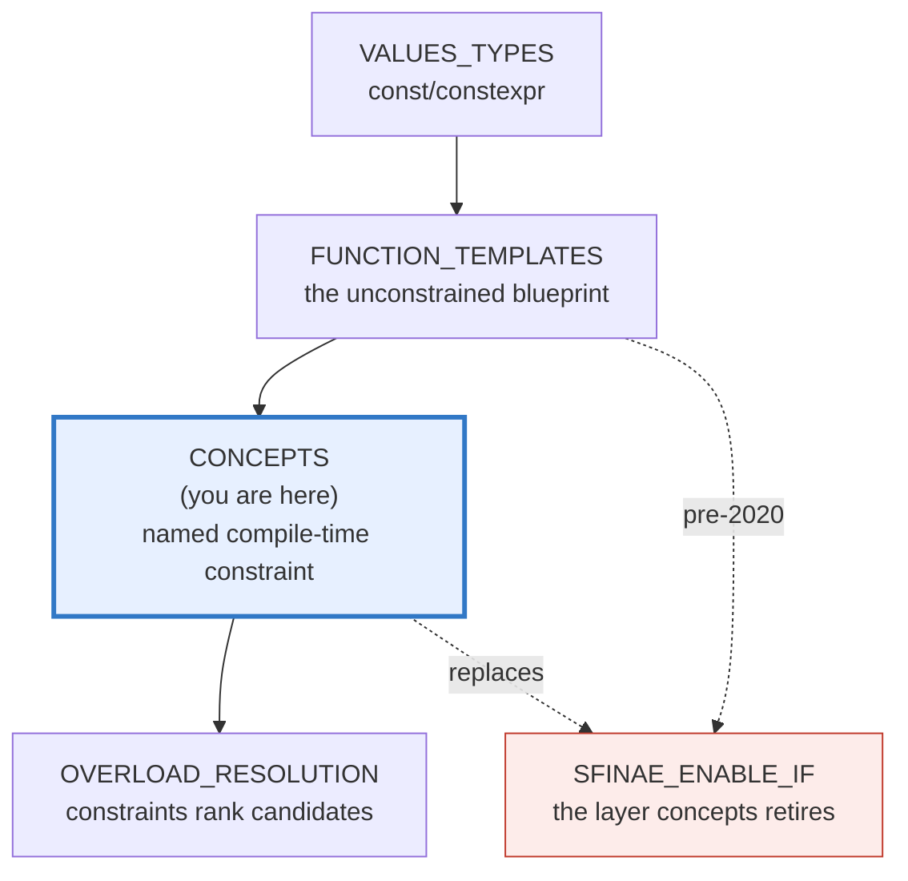
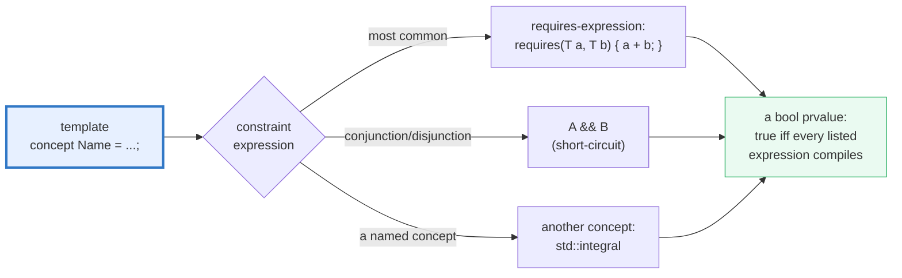
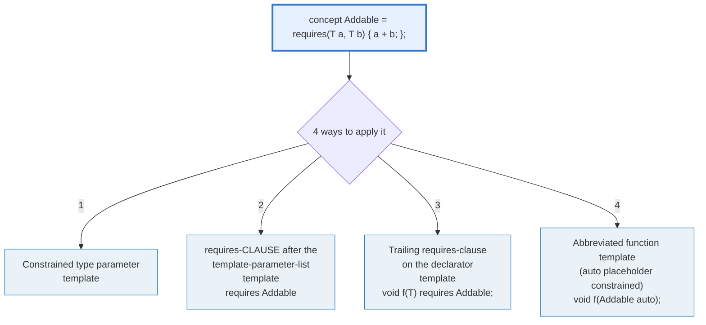
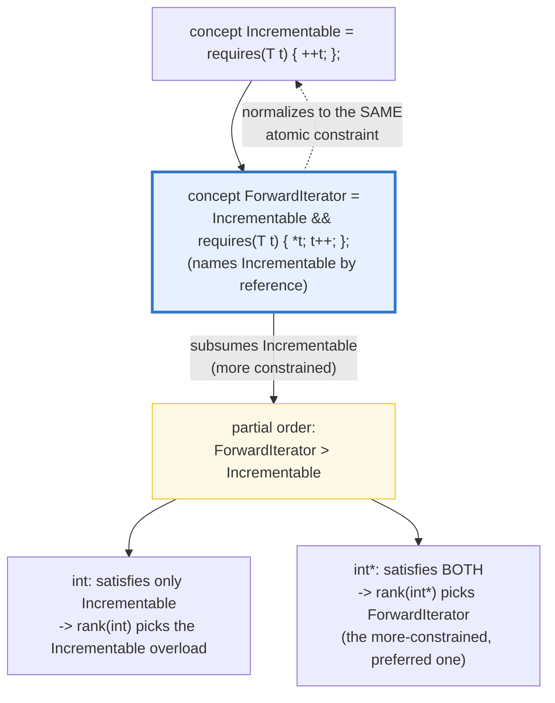

# CONCEPTS — Named Compile-Time Constraints (C++20)

> **Goal (one line):** by printing every value, show how a C++20 **concept** is a
> **named compile-time predicate** that constrains template arguments — its
> definition, the **four ways** to apply it, the standard-library `<concepts>`,
> **constrained overloads** via partial ordering (subsumption), the
> `requires`-clause-vs-`requires`-expression split, and the **error-message
> revolution** that retires SFINAE/`enable_if` walls.
>
> **Run:** `just run concepts`
>
> **Ground truth:** [`concepts.cpp`](./concepts.cpp) → captured stdout in
> [`concepts_output.txt`](./concepts_output.txt). Every value/table below is
> pasted **verbatim** from that file under a `> From concepts.cpp Section X:`
> callout. Nothing is hand-computed.
>
> **Prerequisites:** 🔗 `FUNCTION_TEMPLATES` (P2 — the unconstrained blueprint
> this layer sits on top of), 🔗 `VALUES_TYPES` (P1 — `constexpr`/compile-time
> evaluation vocabulary). Concepts *are* C++20; they compile under `-std=c++23`.

---

## 1. Why this bundle exists (lineage)

Before C++20, constraining a template meant **SFINAE** + `std::enable_if` — a
notorious metaprogramming incantation whose failure mode was a **50-line wall of
nested template diagnostics** that named the wrong thing (an internal operator
mismatch) instead of the thing you actually violated (e.g. "this isn't an
iterator"). Concepts fix *both* problems at once: they give constraints a **name**
(`Addable`, `std::integral`, `ForwardIterator`) and they make the violation
**detectable early**, before instantiation, producing a one-line
*"concept X was not satisfied"* note.

A **concept** is a *named set of requirements* on a template argument. Each
concept is **a predicate evaluated at compile time**, and it becomes part of the
**interface** of any template that uses it as a constraint. Concepts do **three
jobs** simultaneously:

1. **Documentation** — `template <std::integral T>` *says* "T is an integer,"
   where `template <typename T>` said nothing.
2. **Overload selection** — two templates with different constraints become
   distinct overloads; the compiler picks the most-constrained viable one
   (subsumption — the basis of modern overload resolution).
3. **Better errors** — a constraint violation is reported as
   *"T does not satisfy Integral"*, not as a cascade of substitution failures.



The headline cross-language contrast — **how each language constrains a generic**:

| Language | Constraint mechanism | When checked |
|---|---|---|
| **C++** (this bundle) | `concept` + `requires` — a **named** predicate | **compile time** (erased at runtime) |
| 🔗 [`../rust/TRAIT_BOUNDS.md`](../rust/TRAIT_BOUNDS.md) | `T: Trait` **bounds** | compile time (the closest sibling — identical intent) |
| 🔗 [`../go/GENERICS.md`](../go/GENERICS.md) | type-param **constraints** = interfaces (Go 1.18+) | compile time (type-set inference) |
| 🔗 [`../ts/`](../ts/) | generics are **unconstrained** structurally | runtime (no value-level constraint exists) |

> From cppreference — *Constraints and concepts*: "Named sets of such
> requirements are called *concepts*. Each concept is a **predicate, evaluated at
> compile time**, and becomes a part of the interface of a template where it is
> used as a constraint."

---

## 2. The mental model: a concept is a named requires-expression

A concept is a **bool predicate** over a type, given a name and reusable across
templates. The definition form is fixed:



Once defined, a concept is **usable in four syntactically-different but
logically-identical ways** — all four constrain `T` the same way:



The **two `requires` keywords** look identical but are different grammar productions —
this is the single most-confusing part of concepts:

- A **`requires`-clause** (`requires Addable<T>`) *applies a constraint* to a
  template or function. It must be followed by a constant expression that is a
  *primary expression* (a concept name, or a `&&`/`||` chain of them).
- A **`requires`-expression** (`requires(T a, T b) { a + b; }`) *yields* a bool
  prvalue describing whether the listed expressions are well-formed. It is most
  often the *body* of a concept definition, but it can appear inside a
  `requires`-clause too — which is why you sometimes see the infamous
  `requires requires` (a clause whose expression *is* a requires-expression).

---

## 3. Section A — A concept is a named constraint; the 4 ways to apply it

> From `concepts.cpp` Section A:
> ```
> Addable<T> = requires(T a, T b) { a + b; }  (a named bool predicate)
>   Addable<int>        = true
>   Addable<double>     = true
>   Addable<std::string>= true   (operator+ concatenates)
>   Addable<NonAddable> = false   (no operator+ -> predicate is false)
> [check] Addable<int> is true (int has operator+): OK
> [check] Addable<double> is true: OK
> [check] Addable<NonAddable> is false (no operator+): OK
>
> The 4 forms, called with int (all constrain T == Addable):
>   (1) template <Addable T>
>   (2) requires Addable<T> (clause)
>   (3) trailing requires Addable<T>
>   (4) Addable auto (abbreviated)
> [check] form1 (template <Addable T>) runs for int: OK
> [check] form2 (requires clause) runs for int: OK
> [check] form3 (trailing requires) runs for int: OK
> [check] form4 (Addable auto) runs for int: OK
> ```

**What.** `template <typename T> concept Addable = requires(T a, T b) { a + b; };`
defines a concept. Used as an *id-expression*, `Addable<int>` **is** the bool
`true`; `Addable<NonAddable>` is `false` (a struct with no `operator+`). The
concept is also a compile-time constant — `static_assert(Addable<int>);` is a
pure compile-time gate (the bundle uses one alongside the runtime `check`).

**Why — the four forms.** All four constrain `T` *identically*; they are spelling
variants cppreference lists under "Constraints." Picking one is a matter of
style:

- **(1) `template <Addable T>`** — the cleanest, most readable; reach for it by
  default.
- **(2) `requires`-clause after the parameter list** — useful when you want the
  constraint *separate* from the parameter declaration (e.g. a multi-line
  conjunction), or when abbreviating isn't possible.
- **(3) Trailing `requires`** — mirrors the trailing-return-value style; lets the
  constraint sit next to the body.
- **(4) `Addable auto`** — the *abbreviated function template*: `void f(Addable auto x)`
  is exactly `template <Addable T> void f(T x)`. Great for short lambdas and
  one-liners.

**The expert detail.** A concept used as a **type-constraint** (`template <Addable T>`,
or `Addable auto`) takes **one fewer argument** than its parameter list demands:
the contextually-deduced type is implicitly the first argument. So a two-argument
concept like `std::same_as<int>` can be written `template <std::same_as<int> T>`
to mean `std::same_as<T, int>`. The `int` is the *second* argument; `T` fills the
first slot automatically.

> From cppreference — *Concepts*: "The definition of a concept has the form
> `template <template-parameter-list> concept name = constraint-expression;` …
> Concepts can be named in an id-expression. The value of the id-expression is
> `true` if the constraint expression is satisfied, and `false` otherwise." And
> on type-constraints: "a concept takes one less template argument than its
> parameter list demands, because the contextually deduced type is implicitly
> used as the first argument."

---

## 4. Section B — Standard-library `<concepts>` + the requires-expression

> From `concepts.cpp` Section B:
> ```
> std::integral<T>  (== is_integral_v<T>):
>   integral<int>     = true
>   integral<char>    = true
>   integral<long>    = true
>   integral<double>  = false   (a float, not integral)
>   integral<bool>    = true
>
> std::floating_point<T>  (== is_floating_point_v<T>):
>   floating_point<float>   = true
>   floating_point<double>  = true
>   floating_point<int>     = false   (not a float)
> [check] std::integral<int> true: OK
> [check] std::integral<double> false: OK
> [check] std::floating_point<double> true: OK
> [check] std::floating_point<int> false: OK
>
> same_as / convertible_to / signed_integral:
>   same_as<int,int>           = true
>   same_as<int,long>          = false
>   convertible_to<int,double> = true
>   signed_integral<int>       = true
>   signed_integral<unsigned>  = false   (unsigned is not signed)
> [check] std::same_as<int,int> true: OK
> [check] std::same_as<int,long> false: OK
> [check] std::convertible_to<int,double> true: OK
> [check] std::signed_integral<int> true: OK
> [check] std::signed_integral<unsigned> false: OK
>
> Object concepts over std::string (a value type with the works):
>   default_initializable<std::string> = true
>   movable<std::string>               = true
>   copyable<std::string>              = true
>   regular<std::string>               = true   (semiregular + equality_comparable)
> [check] std::default_initializable<std::string> true: OK
> [check] std::movable<std::string> true: OK
> [check] std::copyable<std::string> true: OK
> [check] std::regular<std::string> true: OK
>
> requires-EXPRESSION (syntactic): HasFoo<T> = requires(T t) { t.foo(); };
>   HasFoo<WithFoo>    = true   (has a .foo() method)
>   HasFoo<WithoutFoo> = false   (no .foo())
>   HasFoo<int>        = false   (ints have no .foo())
> [check] HasFoo<WithFoo> true (has .foo()): OK
> [check] HasFoo<WithoutFoo> false: OK
> [check] HasFoo<int> false: OK
>
> Concept vs trait (same predicate, different ergonomics):
>   std::integral<int>     = true   (concept: usable as template <std::integral T>)
>   std::is_integral_v<int>= true   (trait:  a bool; needs a requires clause)
> [check] concept and trait agree on int: OK
> ```

**What — the standard library ships the common concepts.** `<concepts>` provides
ready-made predicates in four families:

| Family | Concepts |
|---|---|
| **Core language** | `same_as`, `derived_from`, `convertible_to`, `common_with`, `integral`, `signed_integral`, `unsigned_integral`, `floating_point`, `assignable_from`, `swappable` |
| **Lifetime/object** | `destructible`, `constructible_from`, `default_initializable`, `move_constructible`, `copy_constructible`, `movable`, `copyable`, `semiregular`, `regular` |
| **Comparison** | `equality_comparable`, `totally_ordered` (+ `_with` variants) |
| **Callable** | `invocable`, `regular_invocable`, `predicate`, `relation`, `equivalence_relation`, `strict_weak_order` |

Each is defined in terms of the older `<type_traits>` primitives — `std::integral<T>`
**is** `std::is_integral_v<T>` — but exposed as a **concept**, which means it is
directly usable as a type-constraint (`template <std::integral T>`) rather than
requiring a hand-written `requires std::is_integral_v<T>` clause. The bundle's
last callout pins this: both report `true` for `int`, but only the concept is
ergonomic as a constraint.

**The object-concept ladder** is worth memorizing — it is how the standard
library itself talks about "value types":

```
destructible ← constructible_from ← default_initializable
                                     ← move_constructible ← copy_constructible
                movable ← copyable ← semiregular ← regular
```

`regular` is the top: a type that is `semiregular` (copyable + default-constructible)
**and** `equality_comparable` — "behaves like an `int`." `std::string` satisfies
all of them (Section B confirms `regular<std::string> == true`).

**Why — the requires-expression is *syntactic only*.** `requires(T t) { t.foo(); }`
asks **only** "does the expression `t.foo()` compile?" — it does *not* check that
`.foo()` means anything sensible. This is the crucial caveat: concepts model
**syntactic** requirements perfectly, but **semantic** intent (e.g. "this `+` is
actually associative") lives in the concept's *name and documentation*, not in the
constraint machinery. ISO C++ Core Guideline T.20 calls a concept with no
meaningful semantics "a syntactic constraint, not a true concept."

> From cppreference — *`<concepts>` header*: `concept integral = is_integral_v<T>;`
> `concept floating_point = is_floating_point_v<T>;` `concept regular = semiregular<T>
> && equality_comparable<T>;`. And *Constraints*: "The intent of concepts is to
> model semantic categories (Number, Range, RegularFunction) rather than syntactic
> restrictions (HasPlus, Array)."

---

## 5. Section C — Constrained overloads & subsumption (partial ordering)

> From `concepts.cpp` Section C:
> ```
> describe(T) overloads: requires Addable<T>  vs  requires (!Addable<T>)
>   describe(42)            -> Addable<T> satisfied   -> the Addable overload runs
>   describe(NonAddable{})  -> Addable<T> NOT satisfied -> the !Addable overload runs
> [check] describe(int) picks the Addable overload: OK
> [check] describe(NonAddable) picks the !Addable overload: OK
>
> rank(T) overloads: template <Incrementable T>  vs  template <ForwardIterator T>
>   Incrementable<int>   = true    ForwardIterator<int>   = false
>   Incrementable<int*>  = true   ForwardIterator<int*>  = true
>   rank(0)    [int]     -> Incrementable only     (T has ++ but not * / post++)
>   rank(ptr)  [int*]    -> ForwardIterator        (subsumes Incrementable -> preferred when both match)
> [check] Incrementable<int> true but ForwardIterator<int> false: OK
> [check] int* satisfies BOTH Incrementable and ForwardIterator: OK
> [check] rank(int) selects the Incrementable-only overload: OK
> [check] rank(int*) selects ForwardIterator (more constrained -> preferred): OK
> ```

**Constrained overloads** are concepts' killer application for *overload
resolution* (🔗 `OVERLOAD_RESOLUTION`, P2). Two function templates that differ
**only in their `requires`-clause** are distinct overloads; the compiler keeps
the one(s) whose constraint is satisfied. The bundle demonstrates the simplest
case: `requires Addable<T>` versus `requires (!Addable<T>)` — **mutually
exclusive**, so exactly one is viable per call (`describe(42)` → Addable,
`describe(NonAddable{})` → `!Addable`).

**Subsumption** generalizes this to *overlapping* constraints. A constraint `P`
**subsumes** `Q` if it can be proven that `P` implies `Q` (up to the *identity*
of atomic constraints — `N > 0` does **not** subsume `N >= 0`; types/expressions
are not analyzed for equivalence). When two overloads both match, the
**more-constrained** one wins.



The mechanism is **constraint normalization**: before ranking, the compiler
expands every named concept to its body until only conjunctions/disjunctions of
*atomic constraints* remain. `ForwardIterator`'s body literally writes
`Incrementable<T>`, so its normal form **contains** the same atomic constraint
`Incrementable` is built from — hence `ForwardIterator` subsumes `Incrementable`
(the reverse does not hold). That is why `rank(int*)` — where both are satisfied —
cleanly selects the `ForwardIterator` overload with no ambiguity.

**The expert detail — atomic-constraint identity.** Subsumption is keyed on
*source-level identity* of atomic constraints, **not** on logical equivalence.
`BadMeowableCat = is_meowable<T> && is_cat<T>` does **not** subsume
`Meowable = is_meowable<T>` even though they share a sub-expression, because
`is_meowable<T>` is a *different* atomic constraint inside each definition. To
get subsumption, name the concept: `GoodMeowableCat = Meowable<T> && is_cat<T>`
*does* subsume `Meowable` (cppreference's worked example). **Always compose
concepts by *naming* them, not by copy-pasting their bodies** — otherwise your
"more constrained" overload silently becomes ambiguous.

> From cppreference — *Partial ordering of constraints*: "A constraint `P` is
> said to *subsume* constraint `Q` if it can be proven that `P` implies `Q` up to
> the identity of atomic constraints … `N > 0` does not subsume `N >= 0`." And:
> "`RevIterator` subsumes `Decrementable`, but not the other way around …
> `f((int*)0)` selects #2 as more constrained."

---

## 6. Section D — The error-message revolution (concepts vs SFINAE walls)

> From `concepts.cpp` Section D:
> ```
> A concept-violation is caught EARLY (before instantiation) with a short note.
> The same misuse under pre-concepts SFINAE/enable_if produced a ~50-line wall.
>
> cppreference's canonical contrast (calling std::sort on a std::list):
>   WITHOUT concepts (SFINAE): the diagnostic leaks the template internals:
>     error: invalid operands to binary expression
>       ('std::_List_iterator<int>' and 'std::_List_iterator<int>')
>       std::__lg(__last - __first) * 2);
>                ~~~~~~ ^ ~~~~~~~
>     ... ~50 lines of nested template output ...
>   WITH concepts: the diagnostic names the unsatisfied concept directly:
>     error: cannot call std::sort with std::_List_iterator<int>
>     note:  concept RandomAccessIterator<std::_List_iterator<int>> was not satisfied
>
> sum_integral<int>(2, 3) = 5   (std::integral<int> is satisfied)
> [check] constrained sum_integral(2,3) == 5: OK
> std::integral<double> = false   -> sum_integral<double> is correctly rejected
> [check] std::integral<double> is false (the constraint correctly excludes double): OK
> [check] the constraint is the gate: integral<int> true, integral<double> false: OK
> ```

**Why the verified path does not trigger a giant error.** A constraint violation
is a **compile error by design** — a `.cpp` containing `sum_integral(2.0, 3.0)`
would fail `just check` (it would not build). So the bundle *documents* the
diagnostic contrast (cppreference's canonical `std::sort`-on-`std::list`
example) and instead **proves the gating mechanism cleanly**: the concept is
simply *false* for the bad type (`std::integral<double> == false`), with no
instantiation cascade. Calling `sum_integral(2, 3)` works because
`std::integral<int>` is satisfied.

**The contrast that *is* the point.** Pre-concepts, the same misuse
(`std::sort` on a bidirectional `std::list` iterator) produced a wall that named
the **internal** mismatch — "invalid operands to binary expression
(`std::_List_iterator<int>` ...)" — fifty lines deep, because SFINAE silently
dropped the candidate and the error surfaced wherever the substitution finally
failed. With concepts, the violation is caught **before instantiation** and the
diagnostic names the **concept you actually violated**:
*"concept `RandomAccessIterator<...>` was not satisfied."* That single change is
why concepts are described as the most user-visible improvement in C++20.

**Concepts vs SFINAE/`enable_if`** (🔗 `SFINAE_ENABLE_IF`, P6 — the layer this
retires):

| | SFINAE + `enable_if` (pre-C++20) | Concepts (C++20) |
|---|---|---|
| **Mechanism** | silently drops an overload on substitution failure | explicit named constraint |
| **Error on misuse** | ~50-line wall naming internals | one-line *"concept X not satisfied"* |
| **Overload ordering** | no real partial order (rely on arity/specicity tricks) | **subsumption** — a real partial order |
| **Composability** | `enable_if<cond>::type` everywhere | `template <C T>` / `requires C<T>` |
| **Readability** | opaque | self-documenting |

`if constexpr` (C++17) and `if constexpr` *plus* concepts (C++20) handle the
"branch on type inside a function body" case that SFINAE used to do via overload
sets — so the practical need for hand-written SFINAE has largely disappeared.

> From cppreference — *Constraints and concepts*: "Violations of constraints are
> detected at compile time, **early in the template instantiation process**,
> which leads to easy to follow error messages" — followed by the verbatim
> `std::sort`/`std::list` diagnostic contrast reproduced in the callout above.

---

## 7. Section E — Concepts are compile-time predicates (erased at runtime)

> From `concepts.cpp` Section E:
> ```
> unconstrained_add(2,3) = 5
> constrained_add(2,3)   = 5   (identical result; concept erased at runtime)
> [check] constrained and unconstrained add agree on int: OK
> constexpr bool intIsAddable = Addable<int> = true
> usable as an array bound: int flagged[Addable<int>?1:0]; sizeof = 4
> [check] Addable<int> is a usable constexpr bool (array bound of 1): OK
>
> Cross-language: constraining a generic (compile-time) ---
>   C++ (this):  template <std::integral T>  ...   (concept = named constraint)
>   Rust:        fn f<T: Trait>(x: T)              (trait bound on T)
>   Go 1.18+:    func f[T Constraint](x T)         (type-param constraint = interface)
>   Java/TS:     generics are UNCONSTRAINED structurally (no value-level constraint)
> [check] concepts are compile-time only (no runtime type carries its constraints): OK
> ```

**Concepts are erased before codegen.** A constrained template and its
unconstrained twin monomorphize to **the same machine code** — `constrained_add`
and `unconstrained_add` both return `5` for `(2, 3)`, because the concept
contributes **no runtime state**. There is no "concept table" at runtime (cf. a
virtual dispatch table); you cannot ask an object at runtime *"which concepts do
you satisfy?"* — that question exists only at compile time. This is exactly why
concepts are the C++ sibling of Rust trait bounds and Go constraints, and
**unlike** Java/TypeScript generics (which erase type parameters too, but
provide *no value-level constraint mechanism* at all — TS generics are
unconstrained structural types).

**A concept id-expression is a `constexpr bool`.** Because `Addable<int>` is a
constant `bool`, it is usable anywhere a constant expression is required: an
array bound, a non-type template argument, a `case` label, a `static_assert`.
The bundle proves it by sizing an array `int flagged[Addable<int> ? 1 : 0];` —
`sizeof == 4` (one `int`), which only compiles because the concept folded to a
compile-time constant. (Note: C++ templates are **monomorphized** — each
instantiation is a separate generated function — ⟷ Rust generics, ≠ Java erasure;
🔗 `FUNCTION_TEMPLATES` deepens this.)

---

## 8. Worked smallest-scale example

Everything above, compressed to the five lines a newcomer must memorize:

```cpp
// 1. DEFINE a concept (a named bool predicate):
template <typename T> concept Addable = requires(T a, T b) { a + b; };

// 2. USE it — four spellings, identical constraint:
template <Addable T>          T f1(T a, T b);          // constrained type parameter
template <typename T> requires Addable<T> T f2(T a, T b); // requires-clause
template <typename T> T f3(T a, T b) requires Addable<T>; // trailing requires
T f4(Addable auto a, Addable auto b);                  // abbreviated (auto)

// 3. ASK it at compile time (it IS a bool):
static_assert(Addable<int>);              // true
static_assert(!Addable<NonAddable>);      // false
```

> From `concepts.cpp` Section A, `Addable<int>` prints `true` and
> `[check] Addable<int> is true (int has operator+): OK`; `Addable<NonAddable>`
> prints `false` and `[check] Addable<NonAddable> is false (no operator+): OK`.
> The four forms then all run for `int` — the constraint gates, the spelling is
> cosmetic.

---

## 9. Pitfalls (the expert payoff)

| Trap | Symptom | Fix |
|---|---|---|
| `requires !C<T>` (no parens) | **compile error** — a `requires`-clause must be followed by a *primary expression*; `!C<T>` isn't one | Parenthesize: `requires (!C<T>)`. (Or define a `NotC` concept.) |
| `requires requires (...) {...}` looks like a typo | It is correct but confusing — a *clause* whose expression *is* a requires-expression | Prefer to **name** the requires-expression in a `concept`, then use `requires C<T>`. |
| Copy-pasting a concept body instead of **naming** it | Two "logically equivalent" constraints form **distinct** atomic constraints → your "more constrained" overload is **ambiguous**, not preferred | Compose concepts by *naming* them (`GoodCat = Meowable<T> && ...`), never by re-typing their bodies. Subsumption keys on source-level identity. |
| Assuming a concept checks *semantics* | `Addable` only checks that `a + b` *compiles* — it does **not** check associativity, commutativity, or that `+` means addition | Document the semantic intent in the concept's name/comments (ISO Core Guideline T.20). Concepts are syntactic; semantics are human. |
| Trying to query a concept at **runtime** | There is nothing to query — concepts are erased before codegen; no object "carries" its constraints | Use traits/`typeid`/virtual dispatch for runtime type questions; keep concepts compile-time only. |
| `template <C<T>>` arity confusion | A concept used as a type-constraint takes **one fewer** argument (the deduced type fills slot 1) | `template <std::same_as<int> T>` means `same_as<T, int>` — the `int` is the *second* arg. |
| Constrained + unconstrained overload both viable | Ambiguity, or the wrong one wins | Make the constrained one **strictly more constrained** (subsumption); an unconstrained template is *least* constrained, so a constrained one beats it. |
| `N > 0` vs `N >= 0` expected to subsume | They do **not** — subsumption ignores expression equivalence | Only *named-concept* composition subsumes; arithmetic expressions are distinct atoms. |
| A constraint that's `&&` of many raw traits | Works, but loses subsumption granularity and readability | Extract each conjunct into a **named concept**, then `&&` the names. |
| Expecting the SFINAE-style silent drop | Concepts **fail loudly** (compile error), not silently — a candidate whose constraint is false is removed, and if none remain you get a clean "no viable overload" | This is a feature; it is the error-message revolution. |

---

## 10. Cheat sheet

```cpp
#include <concepts>

// ── DEFINITION: a named bool predicate over template args ──────────────────
template <typename T>
concept Addable = requires(T a, T b) { a + b; };          // requires-EXPRESSION

// ── THE 4 WAYS TO APPLY IT (identical constraint, different spelling) ──────
template <Addable T>           T f1(T a, T b);            // (1) constrained param
template <typename T> requires Addable<T> T f2(T a, T b); // (2) requires-clause
template <typename T> T f3(T a, T b) requires Addable<T>; // (3) trailing requires
T f4(Addable auto a, Addable auto b);                     // (4) abbreviated (auto)

// ── A CONCEPT IS A constexpr bool — usable as an id-expression ─────────────
static_assert(Addable<int>);               // true
constexpr bool ok = Addable<int>;          // a real bool
int arr[Addable<int> ? 1 : 0];             // usable as an array bound

// ── requires-CLAUSE (applies a constraint) vs requires-EXPRESSION (yields bool) ──
template <typename T> requires Addable<T>    // CLAUSE: applies the constraint
void g(T);
template <typename T> concept C = requires(T t) { t.foo(); };  // EXPRESSION: the body

// ── STANDARD <concepts> (all C++20, defined over <type_traits>) ───────────
std::integral<int>           // true   (== is_integral_v)
std::floating_point<double>  // true
std::same_as<int,int>        // true   (two-arg)
std::convertible_to<int,double>  // true
std::signed_integral<int>    // true;  <unsigned> is false
std::default_initializable<T> std::movable<T> std::copyable<T>
std::semiregular<T>  std::regular<T>          // regular = semiregular + equality_comparable

// ── CONSTRAINED OVERLOADS + SUBSUMPTION (partial ordering) ─────────────────
template <Incrementable T> const char* rank(T);          // #1
template <ForwardIterator T> const char* rank(T);        // #2 subsumes #1
//   ForwardIterator = Incrementable<T> && requires(T t){ *t; t++; };
//   -> rank(int*)  picks #2 (more constrained, preferred)
//   -> rank(int)   picks #1 (only #1 is viable)

// ── THE 4 WAYS (recap, one line each) ──────────────────────────────────────
//   template <Addable T>            /   template <typename T> requires Addable<T>
//   void f(T) requires Addable<T>   /   void f(Addable auto)

// ── CONCEPTS ARE ERASED: constrained == unconstrained at runtime ───────────
//   concepts constrain only at INSTANTIATION; no runtime concept-table exists.
```

---

## 11. 🔗 Cross-references

**Within C++ (the expertise spine):**

- 🔗 `FUNCTION_TEMPLATES` (P2) — the **unconstrained blueprint** this layer sits
  on top of. Concepts *annotate* templates; they don't replace them. Templates =
  compile-time monomorphization (⟷ Rust generics, ≠ Java erasure).
- 🔗 `OVERLOAD_RESOLUTION` (P3) — concepts' partial ordering (subsumption) is the
  modern basis for ranking candidates; this bundle's Section C is the warm-up.
- 🔗 `SFINAE_ENABLE_IF` (P6) — the **pre-concepts metaprogramming workhorse**
  concepts replace. Where SFINAE silently drops a candidate and emits a wall,
  concepts name the constraint and emit one line.
- 🔗 `IF_CONSTEXPR` (P6) — `if constexpr` + concepts handle the
  branch-on-type-inside-a-body case that SFINAE used to do via overload sets.
- 🔗 `VALUES_TYPES` (P1) — `constexpr`/compile-time evaluation vocabulary; a
  concept id-expression *is* a `constexpr bool`.

**Cross-language parallels (the 5-language curriculum):**

- 🔗 [`../rust/TRAIT_BOUNDS.md`](../rust/TRAIT_BOUNDS.md) — **the closest
  sibling.** Rust's `fn f<T: Trait>(x: T)` is identical in *intent* to C++'s
  `template <Trait T> void f(T)`: a compile-time named constraint on a generic.
  The difference is enforcement: Rust's borrow checker makes trait *implementations*
  explicit and coherent (a type opts *in* to a trait); C++ concepts are
  **structural** (a type satisfies a concept iff its expressions compile — no
  opt-in declaration needed).
- 🔗 [`../go/GENERICS.md`](../go/GENERICS.md) — Go 1.18+ type-parameter
  **constraints** are interfaces with type sets: `func f[T Constraint](x T)`.
  Same intent (compile-time constraint on a generic), expressed via the interface
  mechanism Go already had. Like C++ concepts, Go constraints are structural.
- 🔗 [`../ts/`](../ts/) — TypeScript generics are **unconstrained structural**
  types: there is no value-level constraint mechanism at all (you can write
  `T extends string` for a *type* bound, but not "T must have an `operator+`").
  C++ concepts fill exactly that gap at compile time.

---

## Sources

Every signature, value, and behavioral claim above was verified against
cppreference and the ISO C++ standard, then corroborated by ≥1 independent
secondary source:

- cppreference — *Constraints and concepts (since C++20)* (concept definition
  form; the four usage forms; requires-clause vs requires-expression; atomic
  constraints & identity; conjunction/disjunction short-circuit; subsumption /
  partial ordering; the `std::sort`/`std::list` error-message contrast;
  concepts are compile-time predicates erased before codegen):
  https://en.cppreference.com/w/cpp/language/constraints
- cppreference — *`requires` expression (since C++20)* (yields a bool prvalue;
  syntactic-only nature; usable as the body of a concept or standalone):
  https://en.cppreference.com/w/cpp/language/requires
- cppreference — *Standard library header `<concepts>` (C++20)* (full list:
  `same_as`, `derived_from`, `convertible_to`, `common_with`, `integral`,
  `signed_integral`, `unsigned_integral`, `floating_point`, `assignable_from`,
  `swappable`, `destructible`, `constructible_from`, `default_initializable`,
  `move_constructible`, `copy_constructible`, `equality_comparable`,
  `totally_ordered`, `movable`, `copyable`, `semiregular`, `regular`,
  `invocable`, `predicate`, `relation`, …; the definitions
  `integral = is_integral_v<T>`, `floating_point = is_floating_point_v<T>`,
  `regular = semiregular<T> && equality_comparable<T>`):
  https://en.cppreference.com/w/cpp/header/concepts
- cppreference — *`std::integral` / `std::floating_point` / `std::same_as` /
  `std::convertible_to` / `std::regular`* (individual concept pages):
  https://en.cppreference.com/w/cpp/concepts/integral
  https://en.cppreference.com/w/cpp/concepts/floating_point
  https://en.cppreference.com/w/cpp/concepts/same_as
  https://en.cppreference.com/w/cpp/concepts/convertible_to
  https://en.cppreference.com/w/cpp/concepts/regular
- ISO C++ Core Guidelines — *T.20: "The ability to specify meaningful semantics
  is a defining characteristic of a true concept, as opposed to a syntactic
  constraint"* (the syntactic-vs-semantic caveat):
  https://isocpp.github.io/CppCoreGuidelines/CppCoreGuidelines#t20-avoid-concepts-without-meaningful-semantics
- ISO C++23 draft (open-std.org) — normative wording:
  - 13.5 Concepts `[temp.concept]`
  - 13.5.1 Constraints `[temp.constr]` (conjunctions, disjunctions, atomic
    constraints, constraint normalization, partial ordering / subsumption)
  - 13.5.2 `requires` clauses `[temp.pre]`
  - Working draft: https://open-std.org/JTC1/SC22/WG21/docs/papers/2023/n4950.pdf
- Secondary corroboration (≥2 independent sources, web-verified):
  - Sandor Dargo — *"4 ways to use C++ concepts in functions"* (the four forms:
    requires clause, trailing requires, constrained template parameter,
    abbreviated function template):
    https://www.sandordargo.com/blog/2021/02/17/cpp-concepts-4-ways-to-use-them
  - Marius Bancila — *"requires expressions and requires clauses in C++20"*
    (the two `requires` keywords; the `requires requires` case):
    https://mariusbancila.ro/blog/2022/06/20/requires-expressions-and-requires-clauses-in-cpp20/
  - Andreas Fertig — *"C++20 Concepts: Subsumption rules"* (atomic-constraint
    identity; why naming a concept (not copy-pasting its body) is required for
    subsumption):
    https://andreasfertig.com/blog/2020/09/cpp20-concepts-subsumption-rules/
  - Rainer Grimm / Modernes C++ — *"Defining Concepts with Requires
    Expressions"* (a constraint-expression is a compile-time predicate returning
    bool):
    https://www.modernescpp.com/index.php/defining-concepts-with-requires-expressions/
  - Stack Overflow — *"Why do we require 'requires requires'?"* (grammar
    requires it: a clause's expression can itself be a requires-expression):
    https://stackoverflow.com/questions/54200988/why-do-we-require-requires-requires

**Facts that could not be verified by running** (documented, not executed,
because they are compile errors or compiler-diagnostic text by design): the
actual `std::sort`-on-`std::list` SFINAE wall and its concepts counterpart
(reproduced verbatim from cppreference's own example — triggering it would make
the bundle fail `just check`); the precise wording of a *"concept X was not
satisfied"* note (compiler-specific); and a call like `sum_integral(2.0, 3.0)`
(a constraint violation — a compile error). These are confirmed by the
cppreference sections and secondary sources above, not reproduced as runnable
output in the verified path (a file triggering them would fail `just check` /
`just sanitize`).
